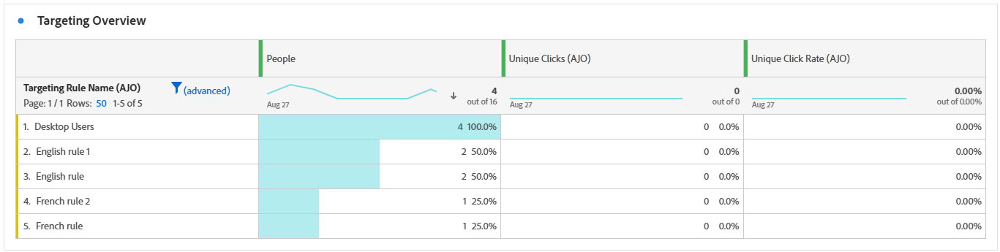

# Informe de campaña {#campaign-global-report-cja}

>[!BEGINSHADEBOX]

Puede acceder a su informe de Campaign haciendo clic en el botón **[!UICONTROL Informes]** de su campaña y seleccionando **[!UICONTROL Ver informe de todo el tiempo]**. [Más información](report-gs-cja.md)

>[!ENDSHADEBOX]

## KPI de campaña {#campaign-kpis}

Los indicadores clave de rendimiento (KPI) **[!UICONTROL Campaign]** funcionan como un tablero integral que ofrece un análisis de las métricas esenciales asociadas con su campaña. Esto incluye detalles como el recuento de clics y la cantidad de mensajes enviados, lo que ofrece una insight completa sobre la eficacia y el nivel de participación de su campaña.

Los KPI variarán según los canales utilizados en la campaña.

+++ Obtenga más información sobre las métricas de KPI de Campaign

* **[!UICONTROL Tasa de clics]**: Porcentaje de usuarios que interactuaron con el mensaje.

* **[!UICONTROL Clics]**: Número de veces que se hizo clic en un contenido del mensaje.

* **[!UICONTROL Entregado]**: número de correos electrónicos enviados correctamente en relación con el número total de mensajes enviados.

* **[!UICONTROL Pantallas]**: Número de veces que se abrió el mensaje.

+++

>[!AVAILABILITY]
>Las campañas organizadas solo admiten los canales SMS, de correo electrónico y push. Otros canales (aplicación, web, correo directo, etc.) no están disponibles en las campañas orquestadas y no aparecen en los informes.

### Información general de Campaign {#delivery-global}

La tabla **[!UICONTROL Resumen de campaña]** sirve como un panel completo, que ofrece un desglose detallado de las métricas clave relacionadas con su campaña. Esto incluye información esencial, como la cantidad de perfiles y las acciones entregadas, lo que proporciona una comprensión exhaustiva del rendimiento y la participación de su campaña.

Tenga en cuenta que las métricas variarán en función de los canales utilizados en la campaña.

+++ Obtenga más información sobre las métricas de información general de Campaign

* **[!UICONTROL Personas]**: Número de perfiles de usuario que se califican como perfiles de destino para sus mensajes.

* **[!UICONTROL Tasa de clics]**: Porcentaje de usuarios que interactuaron con el mensaje.

* **[!UICONTROL Clics]**: Número de veces que se hizo clic en un contenido del mensaje.

* **[!UICONTROL Clics únicos]**: Número de perfiles que hicieron clic en un contenido del mensaje.

* **[!UICONTROL Entregado]**: número de correos electrónicos enviados correctamente en relación con el número total de mensajes enviados.

* **[!UICONTROL Devoluciones para canales salientes]**: Número total de errores acumulados durante el proceso de envío y procesamiento automático de devoluciones en relación con el número total de mensajes enviados.

* **[!UICONTROL Errores salientes]**: Número total de errores que se produjeron durante el proceso de envío para evitar que se enviara a los perfiles.

* **[!UICONTROL Exclusiones salientes]**: número de perfiles que han sido excluidos por Adobe Journey Optimizer. [Más información sobre cómo se cuentan las exclusiones](exclusion-list.md#exclusion-list).

* **[!UICONTROL Pantallas]**: Número de veces que se abrió el mensaje.

* **[!UICONTROL Visualizaciones únicas]**: Número de veces que se abrió el mensaje, no se tienen en cuenta las interacciones múltiples de un perfil.

+++

### Resultados del canal de Campaign {#campaign-funnel}

El gráfico de **[!UICONTROL resultados de Campaign funnel]** presenta un análisis detallado de la participación de sus perfiles con sus mensajes, lo que ofrece información valiosa sobre cómo varios perfiles interactúan con su contenido.

+++ Obtenga más información sobre las métricas de resultados de Campaign funnel

* **[!UICONTROL Entregado]**: número de correos electrónicos enviados correctamente en relación con el número total de mensajes enviados.

* **[!UICONTROL Clics]**: Número de veces que se hizo clic en un contenido del mensaje.
+++

### Etiqueta de vínculo rastreado {#campaign-track}

La tabla **[!UICONTROL Etiqueta de vínculo rastreado]** ofrece información esencial sobre la participación de los visitantes con las direcciones URL incluidas en los mensajes, y proporciona información valiosa sobre los vínculos que atraen más interacción.

+++ Obtenga más información sobre las métricas de etiquetas de vínculos rastreados

* **[!UICONTROL Clics únicos]**: Número de perfiles que hicieron clic en un contenido del mensaje.

* **[!UICONTROL Clics]**: Número de veces que se hizo clic en un contenido del mensaje.

+++

## Información general de segmentación {#targeting}

Si configuraste **[!UICONTROL reglas de segmentación]** para tu contenido, la tabla de **[!UICONTROL Información general de segmentación]** proporciona una vista detallada de las métricas de participación clave, mostrando cómo los perfiles de segmentación para cada regla interactuaron con tu contenido.

➡️ [Más información sobre las Reglas de segmentación](../campaigns/campaigns-message-optimization.md)

+++ Más información sobre las Métricas de información general de Segmentación

* **[!UICONTROL Personas]**: Número de perfiles de usuario que se califican como perfiles de destino para sus eventos.

* **[!UICONTROL Clics únicos]**: Número de perfiles que hicieron clic en un contenido de un correo electrónico.

* **[!UICONTROL Tasa de clics únicos]**: Porcentaje de perfiles de destino que hicieron clic al menos una vez.

+++
