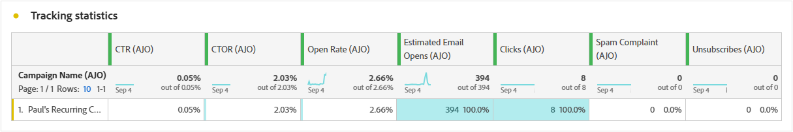

# Informe de campaña {#campaign-global-report-cja}

El **Informe de campaña** actúa como un tablero completo que proporciona un análisis detallado de las métricas clave asociadas con la campaña. Incluye datos como el recuento de clics, los mensajes enviados, los números de perfil y las acciones realizadas. Al ofrecer una visión general completa de la eficacia y los niveles de participación de su campaña, el informe garantiza una comprensión exhaustiva del rendimiento general de su campaña.

Se puede acceder a los informes de campaña directamente desde la campaña con el **[!UICONTROL Informes]** botón.

El **Informe de campaña** Esta página se muestra con las siguientes pestañas según el canal elegido:

* [Campaign](#campaign-global)
* [Experimentación](#experimentation)
* [Correo electrónico](#email-global)
* [SMS](#sms)
* [Notificación push](#push-notification)
* [Correo directo](#direct-mail)
* [Web](#web)

Para obtener más información sobre Customer Journey Analytics Workspace y cómo filtrar y analizar datos, consulte [esta página](https://experienceleague.adobe.com/en/docs/analytics-platform/using/cja-workspace/home).

## Campaign {#campaign-global}

### KPI de campaña {#campaign-kpis}

El **[!UICONTROL Campaign]** Los indicadores clave de rendimiento (KPI) funcionan como un panel que abarca todo, lo que ofrece un análisis de las métricas esenciales asociadas con la campaña. Esto incluye detalles como el recuento de clics y la cantidad de mensajes enviados, lo que ofrece una perspectiva completa de la eficacia y el nivel de participación de su campaña.

Los KPI variarán según los canales utilizados en la campaña.

+++ Obtenga más información sobre las métricas de KPI de Campaign

* **[!UICONTROL Tasa de pulsaciones]**: porcentaje de usuarios que interactuaron con el mensaje.

* **[!UICONTROL Clics]**: Número de veces que se hizo clic en un contenido del mensaje.

* **[!UICONTROL Entregado]**: Número de correos electrónicos enviados correctamente, en relación con el número total de mensajes enviados.

* **[!UICONTROL Visualizaciones]**: Número de veces que se abrió el mensaje.

+++

### Información general de Campaign {#delivery-global}

El **[!UICONTROL Información general de Campaign]** sirve como un tablero completo, que ofrece un desglose detallado de las métricas clave relacionadas con su campaña. Esto incluye información esencial, como la cantidad de perfiles y las acciones entregadas, lo que proporciona una comprensión exhaustiva del rendimiento y la participación de su campaña.

Tenga en cuenta que las métricas variarán en función de los canales utilizados en la campaña.

+++ Obtenga más información sobre las métricas de información general de Campaign

* **[!UICONTROL People]**: Número de perfiles de usuario que se califican como perfiles de destinatario para los mensajes.

* **[!UICONTROL Tasa de pulsaciones]**: porcentaje de usuarios que interactuaron con el mensaje.

* **[!UICONTROL Clics]**: Número de veces que se hizo clic en un contenido del mensaje.

* **[!UICONTROL Clics únicos]**: Número de perfiles que hicieron clic en un contenido del mensaje.

* **[!UICONTROL Entregado]**: Número de correos electrónicos enviados correctamente, en relación con el número total de mensajes enviados.

* **[!UICONTROL Devoluciones para canales salientes]**: Número total de errores acumulados durante el proceso de envío y el procesamiento automático de devoluciones en relación con el número total de mensajes enviados.

* **[!UICONTROL Errores de salida]**: Número total de errores que se produjeron durante el proceso de envío y que impiden su envío a los perfiles.

* **[!UICONTROL Exclusiones de salida]**: Número de perfiles que han sido excluidos por Adobe Journey Optimizer.

* **[!UICONTROL Visualizaciones]**: Número de veces que se abrió el mensaje.

* **[!UICONTROL Visualizaciones únicas]**: Número de veces que se abrió el mensaje, no se tienen en cuenta varias interacciones de un perfil.

+++

### Resultados del canal de Campaign {#campaign-funnel}

El **[!UICONTROL Resultados del canal de Campaign]** el gráfico presenta un análisis detallado de la participación de sus perfiles con sus mensajes, lo que ofrece una valiosa perspectiva de cómo varios perfiles interactuaron con el contenido.

+++ Obtenga más información sobre las métricas de resultados de embudo de Campaign

* **[!UICONTROL Entregado]**: Número de correos electrónicos enviados correctamente, en relación con el número total de mensajes enviados.

* **[!UICONTROL Clics]**: Número de veces que se hizo clic en un contenido del mensaje.
+++

### Etiqueta de vínculo rastreado {#campaign-track}

El **[!UICONTROL Etiqueta de vínculo rastreado]** ofrece perspectivas esenciales sobre la participación de sus visitantes con las direcciones URL incluidas en sus mensajes, proporcionando información valiosa sobre los vínculos que atraen la mayor interacción.

+++ Obtenga más información sobre las métricas de etiquetas de vínculos rastreados

* **[!UICONTROL Clics únicos]**: Número de perfiles que hicieron clic en un contenido del mensaje.

* **[!UICONTROL Clics]**: Número de veces que se hizo clic en un contenido del mensaje.

+++

## Experimentación {#experimentation}

El **[!UICONTROL Experimentación]** proporciona perspectivas clave sobre el rendimiento de cada variante e identifica la que tiene más éxito.

Tenga en cuenta que definir el mejor ejecutante puede llevar algún tiempo. Si el experimento no se realiza correctamente, se establecerá en **Inconcluso**.

### KPI de experimentación {#experimentation-kpis}

El **[!UICONTROL Experimentación]** Los indicadores clave de rendimiento (KPI) funcionan como un panel que abarca todo, lo que ofrece un análisis de las métricas esenciales asociadas con la experimentación.

+++ Más información sobre las métricas de KPI de experimentación

* **[!UICONTROL Alza]**: Medida de la mejora porcentual en la tasa de conversión de un tratamiento determinado respecto al valor basal.

* **[!UICONTROL Confianza]**: Evidencia de que un tratamiento dado es el mismo que el tratamiento basal. [Más información](../content-management/experiment-calculations.md#understand-confidence)

+++

### Variante por clics entrantes {#variant-inbound}

El **[!UICONTROL Variante por clics entrantes]** widget detalla el rendimiento de cada variante.
Para profundizar en estos resultados y en cómo interpretarlos, consulte [esta página](../content-management/get-started-experiment.md#interpret-results).

+++ Más información sobre las métricas Variante por clics entrantes

* **[!UICONTROL People]**: Número de perfiles de usuario que se califican como perfiles de destinatario para los mensajes.

* **[!UICONTROL Clics entrantes]**: Recuento total de clics en los canales salientes.

* **[!UICONTROL Tasa de conversión]**: Valor total de la métrica de éxito, seleccionada anteriormente al crear los experimentos, dividido por el número de perfiles.

* **[!UICONTROL Alza]**: Medida de la mejora porcentual en la tasa de conversión de un tratamiento determinado respecto al valor basal.

* **[!UICONTROL Confianza]**: Evidencia de que un tratamiento dado es el mismo que el tratamiento basal. [Más información](../content-management/experiment-calculations.md#understand-confidence)

<!--
* **[!UICONTROL Confidence Upper bound]**:

* **[!UICONTROL Confidence Lower bound]**:
-->
+++

### Tasa de conversión de clics entrantes {#conversion-rate}

El **[!UICONTROL Intervalo de confianza]** el gráfico mide la incertidumbre en torno a la mejora. Detalla la diferencia porcentual en el rendimiento entre la línea de base y el tratamiento con mejor rendimiento. [Más información](../content-management/experiment-calculations.md#confidence-intervals).

## Correo electrónico {#email-global}

### Tendencia de envíos frente a clics {#delivered-click}

El **[!UICONTROL Tendencia de envíos frente a clics]** el gráfico presenta un análisis detallado de la participación de sus perfiles con sus correos electrónicos, lo que ofrece perspectivas valiosas sobre cómo los perfiles interactúan con el contenido.

+++ Obtenga más información sobre las métricas de tendencias de Entregado frente a Clic

* **[!UICONTROL Entregado]**: Número de correos electrónicos enviados correctamente, en relación con el número total de correos electrónicos enviados.

* **[!UICONTROL Clics]**: Número de veces que se hizo clic en un contenido en los correos electrónicos.

+++

### Estado del envío {#delivery-status}

El **[!UICONTROL Estado del envío]** el gráfico proporciona una vista completa de los datos relacionados con los correos electrónicos enviados en la campaña, y ofrece información sobre las métricas clave como envíos y devoluciones. Esto permite un análisis detallado del proceso de envío de correo electrónico, lo que proporciona información valiosa sobre la eficacia y el rendimiento de las campañas.

+++ Más información sobre las Métricas de estado de entrega

* **[!UICONTROL Entregado]**: Número de correos electrónicos enviados correctamente, en relación con el número total de correos electrónicos enviados.

* **[!UICONTROL Devoluciones para canales salientes]**: Total de errores acumulados durante el proceso de envío y el procesamiento automático de devoluciones en relación con el número total de mensajes enviados.

* **[!UICONTROL Errores salientes]**: Número total de errores que se produjeron durante un proceso de envío que impidieron que se enviara a los perfiles.

* **[!UICONTROL Exclusiones salientes]**: Número de perfiles que han sido excluidos por Adobe Journey Optimizer.

+++

### Estadísticas de envío {#sending-statistics-email}

El **[!UICONTROL Envío de estadísticas]** proporciona un resumen completo de los datos esenciales sobre los correos electrónicos en sus campañas. Detalla métricas clave como las interacciones con los correos electrónicos y la cantidad de correos electrónicos enviados correctamente, lo que ofrece perspectivas valiosas sobre la eficacia y el alcance de los correos electrónicos y las campañas.

+++ Más información sobre el envío de métricas de estadísticas

* **[!UICONTROL People]**: Número de perfiles de usuario que se califican como perfiles de destinatario para los mensajes.

* **[!UICONTROL Objetivos]**: Número total de correos electrónicos procesados durante el proceso de envío.

* **[!UICONTROL Envíos]**: Número total de envíos del correo electrónico.

* **[!UICONTROL Entregado]**: Número de correos electrónicos enviados correctamente, en relación con el número total de mensajes enviados.

* **[!UICONTROL Devoluciones para canales salientes]**: Total de errores acumulados durante el proceso de envío y el procesamiento automático de devoluciones en relación con el número total de mensajes enviados.

* **[!UICONTROL Errores de salida]**: Número total de errores que se produjeron durante el proceso de envío y que impiden su envío a los perfiles.

* **[!UICONTROL Exclusiones de salida]**: Número de perfiles que han sido excluidos por Adobe Journey Optimizer.

+++

### Estadísticas de seguimiento {#tracking-statistics-email}

El **[!UICONTROL Correo electrónico: estadísticas de seguimiento]** La tabla ofrece una descripción detallada de la actividad del perfil relacionada con los correos electrónicos incluidos en la campaña. Esto incluye métricas sobre aperturas, clics y otros indicadores de participación relevantes, lo que ofrece una vista completa de cómo los perfiles interactúan con el contenido del correo electrónico.

+++ Más información sobre las Métricas de estadísticas de seguimiento

* **[!UICONTROL Tasa de pulsaciones (CTR)]**: porcentaje de usuarios que interactuaron con el correo electrónico.

* **[!UICONTROL Tasa de apertura de pulsaciones (CTOR)]**: Número de veces que se abrió el correo electrónico.

* **[!UICONTROL Clics]**: Número de veces que se hizo clic en un contenido en los correos electrónicos.

* **[!UICONTROL Clics únicos]**: Número de perfiles que hicieron clic en un contenido de un correo electrónico.

* **[!UICONTROL Aperturas de correo electrónico]**: Número de veces que se abrieron los correos electrónicos en una campaña.

* **[!UICONTROL Aperturas de correo electrónico únicas]**: porcentaje de correos electrónicos abiertos.

* **[!UICONTROL Quejas de spam]**: Número de veces que un mensaje se declaró como correo no deseado.

* **[!UICONTROL Cancela la suscripción]**: Número de clics en el vínculo de baja de suscripción.

+++

### Dominios de correo electrónico {#email-domains}

El **[!UICONTROL Dominios de correo electrónico]** ofrece un desglose detallado de los correos electrónicos clasificados por dominio, lo que proporciona una amplia perspectiva de las métricas de rendimiento de sus campañas de correo electrónico. Este análisis completo le permite comprender el comportamiento de los distintos dominios en respuesta al contenido del correo electrónico.

+++ Más información sobre las métricas de Dominios de correo electrónico

* **[!UICONTROL Envíos]**: Número total de envíos del correo electrónico.

* **[!UICONTROL Entregado]**: Número de correos electrónicos enviados correctamente, en relación con el número total de correos electrónicos enviados.

* **[!UICONTROL Aperturas de correo electrónico]**: Número de veces que se abrieron los correos electrónicos en una campaña.

* **[!UICONTROL Clics]**: Número de veces que se hizo clic en un contenido en los correos electrónicos.

* **[!UICONTROL Devoluciones para canales salientes]**: Número total de errores acumulados durante el proceso de envío y el procesamiento automático de devoluciones en relación con el número total de correos electrónicos enviados.

* **[!UICONTROL Errores de salida]**: Número total de errores que se produjeron durante el proceso de envío y que impiden su envío a los perfiles.
+++

### Etiquetas de vínculos rastreados {#track-link-label}

El **[!UICONTROL Etiquetas de vínculos rastreados]** ofrece una amplia descripción general de las etiquetas de vínculo de los correos electrónicos, destacando las que generan el mayor tráfico de visitantes. Esta función le permite identificar y priorizar los vínculos más populares.

+++ Obtenga más información sobre las métricas de etiquetas de vínculos rastreados

* **[!UICONTROL Clics únicos]**: Número de perfiles que hicieron clic en un contenido de un correo electrónico.

* **[!UICONTROL Clics]**: Número de veces que se hizo clic en un contenido en los correos electrónicos.

+++

### URL de vínculos rastreados {#track-link-url}

El **[!UICONTROL URL de vínculos rastreados]** proporciona una visión general de las direcciones URL del correo electrónico que atraen el mayor tráfico de visitantes. Esto le permite identificar y priorizar los vínculos más populares, lo que mejora su comprensión de la participación del perfil con contenido específico en los correos electrónicos.

+++ Más información sobre las métricas de URL de vínculos rastreados

* **[!UICONTROL Clics únicos]**: Número de perfiles que hicieron clic en un contenido de un correo electrónico.

* **[!UICONTROL Clics]**: Número de veces que se hizo clic en un contenido en los correos electrónicos.

* **[!UICONTROL Visualizaciones]**: Número de veces que se abrió el correo electrónico.

* **[!UICONTROL Visualizaciones únicas]**: Número de veces que se abrió el correo electrónico, no se tienen en cuenta las interacciones múltiples de un perfil.

+++

### Asuntos de correo electrónico {#email-subjects}

El **[!UICONTROL Temas de correo electrónico]** presenta una descripción general detallada de los temas de correo electrónico que han atraído el mayor tráfico de visitantes. Este recurso ofrece información valiosa sobre la dinámica de participación de la audiencia.

+++ Más información sobre las métricas de Temas de correo electrónico

* **[!UICONTROL People]**: Número de perfiles de usuario que se califican como perfiles de destinatario para los correos electrónicos.

+++

### Motivos excluidos {#excluded-reasons}

El **[!UICONTROL Razones de exclusión]** La tabla presenta una vista completa de los diferentes factores que resultaron en la exclusión de perfiles de usuario de la audiencia de destino, lo que da como resultado que el mensaje no se reciba.

Consulte [esta página](exclusion-list.md) para obtener la lista completa de motivos de exclusión.

### Motivos de rechazo {#bounce-reasons-email}

El **[!UICONTROL Motivos del rechazo]** Esta tabla compila los datos disponibles relacionados con los mensajes rechazados, y proporciona una perspectiva detallada de los motivos específicos detrás de los rechazos de correo electrónico.

Para obtener más información sobre las devoluciones, consulte [Lista de supresión](../reports/suppression-list.md) página.

### Motivos de error {#error-reasons-email}

El **[!UICONTROL Motivos del error]** La tabla ofrece visibilidad de los errores específicos que se produjeron durante el proceso de envío y proporciona información valiosa sobre la naturaleza y la incidencia de los errores.

## SMS {#sms}

### Tendencia de envíos frente a clics {#delivered-click-sms}

El **[!UICONTROL Tendencia de envíos frente a clics]** el gráfico presenta un análisis detallado de la participación de sus perfiles con sus correos electrónicos, lo que ofrece perspectivas valiosas sobre cómo los perfiles interactúan con el contenido.

+++ Obtenga más información sobre las métricas de tendencias de Entregado frente a Clic

* **[!UICONTROL Entregado]**: Número de mensajes SMS enviados correctamente en relación con el número total de mensajes SMS.

* **[!UICONTROL Clics]**: Número de veces que se hizo clic en un contenido en sus mensajes SMS.

+++

### Estado del envío {#delivery-status-sms}

El **[!UICONTROL Estado del envío]** Esta tabla ofrece una descripción detallada de la actividad de perfil relacionada con sus campañas SMS. Esto incluye métricas sobre mensajes enviados, clics y otros indicadores de participación relevantes, lo que ofrece una vista completa de cómo los perfiles interactúan con el contenido del SMS.

+++ Más información sobre las Métricas de estado de entrega

* **[!UICONTROL Entregado]**: Número de mensajes SMS enviados correctamente en relación con el número total de mensajes SMS.

* **[!UICONTROL Devoluciones para canales salientes]**: Total de errores acumulados durante el proceso de envío y el procesamiento automático de devoluciones en relación con el número total de mensajes SMS enviados.

* **[!UICONTROL Errores salientes]**: Número total de errores que han impedido su envío a los perfiles.

* **[!UICONTROL Exclusiones salientes]**: Número de perfiles que han sido excluidos por Adobe Journey Optimizer.

+++

### Etiquetas de vínculos rastreados {#track-link-label-sms}

El **[!UICONTROL Etiquetas de vínculos rastreados]** ofrece una visión general completa de las etiquetas de vínculo dentro de los mensajes SMS, destacando las que generan el mayor tráfico de visitantes. Esta función le permite identificar y priorizar los vínculos más populares.

+++ Obtenga más información sobre las métricas de etiquetas de vínculos rastreados

* **[!UICONTROL Clics únicos]**: Número de perfiles que hicieron clic en un contenido del mensaje SMS.

* **[!UICONTROL Clics]**: Número de veces que se hizo clic en un contenido en sus mensajes SMS.

+++

### URL de vínculos rastreados {#track-link-url-sms}

El **[!UICONTROL URL de vínculos rastreados]** Esta tabla proporciona una visión general de las direcciones URL de los mensajes SMS que atraen el mayor tráfico de visitantes. Esto le permite identificar y priorizar los vínculos más populares, lo que mejora su comprensión de la participación del perfil con contenido específico en los mensajes SMS.

+++ Más información sobre las métricas de URL de vínculos rastreados

* **[!UICONTROL Clics únicos]**: Número de perfiles que hicieron clic en un contenido del mensaje SMS.

* **[!UICONTROL Clics]**: Número de veces que se hizo clic en un contenido en sus mensajes SMS.

* **[!UICONTROL Visualizaciones]**: Número de veces que se abrió el mensaje.

* **[!UICONTROL Visualizaciones únicas]**: Número de veces que se abrió el mensaje, no se tienen en cuenta varias interacciones de un perfil.

+++

### Mensaje entrante SMS {#sms-inbound}

El **[!UICONTROL Mensaje entrante de SMS]** La tabla presenta una descripción detallada de los mensajes SMS que han atraído el mayor tráfico de visitantes. Este recurso ofrece información valiosa sobre la dinámica de participación de la audiencia.

+++ Más información sobre las métricas de mensajes entrantes de SMS

* **[!UICONTROL People]**: Número de perfiles de usuario que se califican como perfiles de destinatario para sus mensajes SMS.

+++

### Tipo de mensaje SMS {#sms-message-type}

El **[!UICONTROL Tipo de mensaje SMS]** presenta una descripción general detallada de los tipos de mensajes SMS que han atraído el mayor tráfico de visitantes. Este recurso ofrece información valiosa sobre la dinámica de participación de la audiencia.

+++ Más información sobre las métricas de tipo Mensaje SMS

* **[!UICONTROL People]**: Número de perfiles de usuario que se califican como perfiles de destinatario para sus mensajes SMS.

+++

### Proveedores de SMS {#sms-providers}

El **[!UICONTROL Proveedores de SMS]** La tabla presenta una descripción detallada de los proveedores de SMS que han atraído el mayor tráfico de visitantes. Este recurso ofrece información valiosa sobre la dinámica de participación de la audiencia.

+++ Más información sobre las métricas de proveedores de SMS

* **[!UICONTROL People]**: Número de perfiles de usuario que se califican como perfiles de destinatario para sus mensajes SMS.

+++

### Motivos de rechazo {#bounce-reasons-sms}

El **[!UICONTROL Razones de rechazos]** Esta tabla proporciona una visión general completa de los datos relacionados con los mensajes SMS devueltos, lo que ofrece una valiosa perspectiva de las razones específicas detrás de las instancias de devoluciones de mensajes SMS.

### Motivos de error {#error-reasons-sms}

El **[!UICONTROL Motivos del error]** Esta tabla le permite identificar los errores específicos que se produjeron durante el proceso de envío de sus mensajes SMS, lo que facilita un análisis exhaustivo de cualquier problema encontrado.

### Motivos excluidos {#excluded-reasons-sms}

El **[!UICONTROL Razones de exclusión]** Esta tabla muestra visualmente los diversos factores que llevaron a la exclusión de perfiles de usuario de la audiencia de destino, lo que les impidió recibir sus mensajes SMS.

Consulte [esta página](exclusion-list.md) para obtener la lista completa de motivos de exclusión.

## Notificación push {#push-notification}

### Estadísticas de envío {#sending-statistics-push}

El **[!UICONTROL Envío de estadísticas]** proporciona un resumen completo de los datos esenciales relacionados con sus campañas de notificaciones push. Detalla métricas clave como el tamaño de la audiencia objetivo y el número de notificaciones push entregadas correctamente, lo que ofrece valiosas perspectivas sobre la eficacia y el alcance de la notificación push.

+++ Más información sobre el envío de métricas de estadísticas

* **[!UICONTROL People]**: Número de perfiles de usuario que se califican como perfiles de destinatario para las notificaciones push.

* **[!UICONTROL Objetivos]**: Número total de notificaciones push procesadas durante el análisis.

* **[!UICONTROL Envíos]**: Número total de envíos para la notificación push.

* **[!UICONTROL Entregado]**: Número de notificaciones push enviadas correctamente, en relación con el número total de notificaciones push enviadas.

* **[!UICONTROL Devoluciones para canales salientes]**: Total de errores acumulados durante el proceso de envío y el procesamiento automático de devoluciones en relación con el número total de notificaciones push.

* **[!UICONTROL Errores salientes]**: Número total de errores que han impedido su envío a los perfiles.

* **[!UICONTROL Exclusiones salientes]**: Número de perfiles que han sido excluidos por Adobe Journey Optimizer.

+++

### Estadísticas de seguimiento {#tracking-statistics-push}

El **[!UICONTROL Estadísticas de seguimiento]** ofrece una instantánea detallada de la actividad del perfil vinculada a sus notificaciones push, lo que proporciona perspectivas esenciales sobre la participación y la eficacia de las notificaciones push.

+++ Más información sobre las Métricas de estadísticas de seguimiento

* **[!UICONTROL Tasa de pulsaciones (CTR)]**: porcentaje de usuarios que interactuaron con las notificaciones push.

* **[!UICONTROL Tasa de apertura de pulsaciones (CTOR)]**: Número de veces que se abrieron las notificaciones push.

* **[!UICONTROL Clics]**: Número de veces que se hizo clic en un contenido en las notificaciones push.

* **[!UICONTROL Clics únicos]**: Número de perfiles que hicieron clic en un contenido en las notificaciones push.

<!--
* **[!UICONTROL Push custom actions]**: 
-->
+++

### Etiquetas de vínculos rastreados {#track-link-label-push}

El **[!UICONTROL Etiquetas de vínculos rastreados]** ofrece una descripción general completa de las etiquetas de vínculo de las notificaciones push, destacando las que generan el mayor tráfico de visitantes. Esta función le permite identificar y priorizar los vínculos más populares.

+++ Obtenga más información sobre las métricas de etiquetas de vínculos rastreados

* **[!UICONTROL Clics únicos]**: Número de perfiles que hicieron clic en un contenido en las notificaciones push.

* **[!UICONTROL Clics]**: Número de veces que se hizo clic en un contenido en las notificaciones push.

+++

### URL de vínculos rastreados {#track-link-url-push}

El **[!UICONTROL URL de vínculos rastreados]** proporciona una visión general de las direcciones URL dentro de las notificaciones push que atraen el mayor tráfico de visitantes. Esto le permite identificar y priorizar los vínculos más populares, lo que le permite comprender mejor la participación del perfil con contenido específico en las notificaciones push.

+++ Más información sobre las métricas de URL de vínculos rastreados

* **[!UICONTROL Clics únicos]**: Número de perfiles que hicieron clic en un contenido en las notificaciones push.

* **[!UICONTROL Clics]**: Número de veces que se hizo clic en un contenido en las notificaciones push.

+++

### Motivos de rechazo {#bounce-reasons-push}

El **[!UICONTROL Razones de rechazos]** proporciona una amplia descripción general de los datos relacionados con las notificaciones push devueltas, lo que proporciona una valiosa perspectiva de los motivos específicos detrás de las instancias de devoluciones de notificaciones push.

### Motivos de error {#error-reasons-push}

El **[!UICONTROL Motivos del error]** La tabla de permite identificar los errores específicos que se produjeron durante el proceso de envío de las notificaciones push, lo que facilita un análisis exhaustivo de cualquier problema encontrado.

### Motivos excluidos {#exclude-reasons-push}

El **[!UICONTROL Razones de exclusión]** Esta tabla muestra visualmente los diversos factores que llevaron a la exclusión de perfiles de usuario de la audiencia de destino, lo que les impidió recibir las notificaciones push.

Consulte [esta página](exclusion-list.md) para obtener la lista completa de motivos de exclusión.

## En la aplicación {#in-app}

### Tendencia de impresión y clics {#impression-click-trend}

El **[!UICONTROL Tendencia de impresión y clics]** Este gráfico presenta un análisis detallado de la participación de sus perfiles con los mensajes en la aplicación, lo que ofrece información valiosa sobre cómo los perfiles interactúan con el contenido.

+++ Obtenga más información sobre las métricas de tendencias de impresión y clics

* **[!UICONTROL Clics]**: Número de veces que se hizo clic en un contenido en los mensajes en la aplicación.

* **[!UICONTROL Visualizaciones]**: Número de veces que se abrió el mensaje.

+++

### Clics {#clicks-inapp}

El **[!UICONTROL Clics]** El gráfico muestra las métricas de clics en la aplicación, e ilustra tanto la cantidad total de clics en el contenido como la cantidad de perfiles únicos que hicieron clic en el contenido.

+++ Más información sobre las métricas de Clics

* **[!UICONTROL Clics únicos]**: Número de perfiles que hicieron clic en un contenido de los mensajes en la aplicación

* **[!UICONTROL Clics]**: Número de veces que se hizo clic en un contenido en los mensajes en la aplicación.

+++

### Mostrar {#display-inapp}

El **[!UICONTROL Visualizaciones]** Este gráfico le ayuda a comprender el alcance general del mensaje y la cantidad de perfiles únicos que interactúan con él.

+++ Más información sobre las Métricas de visualización

* **[!UICONTROL Visualizaciones]**: Número de veces que se abrió el mensaje.

* **[!UICONTROL Visualizaciones únicas]**: Número de veces que se abrió el mensaje, no se tienen en cuenta varias interacciones de un perfil.

+++

### Datos de seguimiento {#tracking-data-inapp}

El **[!UICONTROL Datos de seguimiento]** ofrece una instantánea detallada de la actividad del perfil vinculada a sus mensajes en la aplicación, lo que proporciona perspectivas esenciales sobre la participación y la eficacia de los mensajes en la aplicación.

+++ Más información sobre el Seguimiento de métricas de datos

* **[!UICONTROL People]**: Número de perfiles de usuario que se califican como perfiles de destino para los mensajes en la aplicación.

* **[!UICONTROL Tasa de pulsaciones (CTR)]**: porcentaje de usuarios que interactuaron con los mensajes en la aplicación.

* **[!UICONTROL Tasa de apertura de pulsaciones (CTOR)]**: Número de veces que se abrieron los mensajes en la aplicación.

* **[!UICONTROL Clics]**: Número de veces que se hizo clic en un contenido en los mensajes en la aplicación.

* **[!UICONTROL Clics únicos]**: Número de perfiles que hicieron clic en un contenido de los mensajes en la aplicación.

* **[!UICONTROL Visualizaciones]**: Número de veces que se abrió el mensaje.

* **[!UICONTROL Visualizaciones únicas]**: Número de veces que se abrió el mensaje, no se tienen en cuenta varias interacciones de un perfil.

* **[!UICONTROL Envíos]**: Número total de envíos para los mensajes en la aplicación.

<!--
* **[!UICONTROL Inbound triggered]**: 

* **[!UICONTROL Inbound dismisses]**: 
-->
+++

### Etiquetas de vínculos rastreados {#track-link-label-inapp}

El **[!UICONTROL Etiquetas de vínculos rastreados]** ofrece una descripción general completa de las etiquetas de los vínculos de los mensajes en la aplicación, en los que se destacan los que generan el mayor tráfico de visitantes. Esta función le permite identificar y priorizar los vínculos más populares.

+++ Obtenga más información sobre las métricas de etiquetas de vínculos rastreados

* **[!UICONTROL Clics únicos]**: Número de perfiles que hicieron clic en un contenido de los mensajes en la aplicación.

* **[!UICONTROL Clics]**: Número de veces que se hizo clic en un contenido en los mensajes en la aplicación.

* **[!UICONTROL Visualizaciones]**: Número de veces que se abrió el mensaje.

* **[!UICONTROL Visualizaciones únicas]**: Número de veces que se abrió el mensaje, no se tienen en cuenta varias interacciones de un perfil.

+++

### URL de vínculos rastreados {#track-link-url-inapp}

El **[!UICONTROL URL de vínculos rastreados]** proporciona una visión general de las direcciones URL de los mensajes en la aplicación que atraen el mayor tráfico de visitantes. Esto le permite identificar y priorizar los vínculos más populares, lo que le permite comprender mejor la participación del perfil con contenido específico en los mensajes en la aplicación.

+++ Más información sobre las métricas de URL de vínculos rastreados

* **[!UICONTROL Clics únicos]**: Número de perfiles que hicieron clic en un contenido de los mensajes en la aplicación.

* **[!UICONTROL Clics]**: Número de veces que se hizo clic en un contenido en los mensajes en la aplicación.

+++

## Correo directo {#direct-mail}

### Estadísticas de envío {#sending-statistics-directmail}

El **[!UICONTROL Envío de estadísticas]** proporciona un resumen completo de los datos esenciales relacionados con sus campañas de correo postal. Detalla métricas clave como el tamaño de la audiencia objetivo y la cantidad de correo postal entregado correctamente, lo que ofrece valiosas perspectivas sobre la eficacia y el alcance de sus mensajes de correo postal.

+++ Más información sobre el envío de métricas de estadísticas

* **[!UICONTROL People]**: Número de perfiles de usuario que se califican como perfiles de destinatario para los mensajes.

* **[!UICONTROL Objetivos]**: Número total de mensajes de correo postal procesados durante el proceso de envío.

* **[!UICONTROL Envíos]**: Número total de envíos para los mensajes de correo postal.

* **[!UICONTROL Entregado]**: Número de mensajes de correo postal enviados correctamente, en relación con el número total de mensajes enviados.

* **[!UICONTROL Errores de salida]**: Número total de errores que se produjeron durante el proceso de envío y que impiden su envío a los perfiles.

* **[!UICONTROL Exclusiones de salida]**: Número de perfiles que han sido excluidos por Adobe Journey Optimizer.

+++

### Estado del envío {#delivery-status-directmail}

El **[!UICONTROL Estado del envío]** el gráfico proporciona una vista completa de los datos relacionados con los mensajes de correo postal enviados en su campaña, y ofrece información sobre las métricas clave como los errores enviados y. Esto permite un análisis detallado del proceso de envío de mensajes de correo postal, lo que proporciona información valiosa sobre la eficacia y el rendimiento de sus campañas.

+++ Más información sobre las Métricas de estado de entrega

* **[!UICONTROL Entregado]**: Número de mensajes de correo postal enviados correctamente, en relación con el número total de mensajes de correo postal enviados.

* **[!UICONTROL Errores salientes]**: Número total de errores que se produjeron durante un proceso de envío que impiden que se envíen los mensajes de correo postal a los perfiles.

* **[!UICONTROL Exclusiones salientes]**: Número de perfiles que han sido excluidos por Adobe Journey Optimizer.

+++

### Motivos de error {#error-reasons-directmail}

El **[!UICONTROL Motivos del error]** Esta tabla le permite identificar los errores específicos que se han producido durante el proceso de envío de sus mensajes de correo postal, lo que facilita un análisis exhaustivo de los problemas encontrados.

### Motivos excluidos {#exclude-reasons-directmail}

El **[!UICONTROL Razones de exclusión]** Esta tabla muestra visualmente los diversos factores que llevaron a la exclusión de perfiles de usuario de la audiencia de destino, lo que les impidió recibir sus mensajes de correo postal.

Consulte [esta página](exclusion-list.md) para obtener la lista completa de motivos de exclusión.

## Web {#web}

### Tendencia de impresión y clics {#impressions-web}

El **[!UICONTROL Tendencia de impresión y clics]** Este gráfico presenta un análisis detallado de la participación de sus perfiles con sus páginas web, lo que ofrece información valiosa sobre cómo los perfiles interactúan con el contenido.

+++ Obtenga más información sobre las métricas de tendencias de impresión y clics

* **[!UICONTROL Clics]**: Número de veces que se hizo clic en un contenido en las páginas web.

* **[!UICONTROL Visualizaciones]**: Número de veces que se abrió el mensaje.

+++

### Clics {#clicks-web}

El **[!UICONTROL Clics]** Este gráfico muestra las métricas de clics en páginas web, ilustrando tanto el número total de clics en contenido como el número de perfiles únicos que hicieron clic en el contenido.

+++ Más información sobre las métricas de Clics

* **[!UICONTROL Clics únicos]**: Número de perfiles que hicieron clic en un contenido de sus páginas web.

* **[!UICONTROL Clics]**: Número de veces que se hizo clic en un contenido en las páginas web.

+++

### Visualizaciones {#displays-web}

El **[!UICONTROL Visualizaciones]** Este gráfico le ayuda a comprender el alcance general del mensaje y la cantidad de perfiles únicos que interactúan con él.

+++ Más información sobre las Métricas de visualización

* **[!UICONTROL Visualizaciones]**: Número de veces que se abrió el mensaje.

* **[!UICONTROL Visualizaciones únicas]**: Número de veces que se abrió el mensaje, no se tienen en cuenta varias interacciones de un perfil.

+++

### Datos de seguimiento {#track-data-web}

El **[!UICONTROL Datos de seguimiento]** ofrece una instantánea detallada de la actividad del perfil vinculada a sus páginas web, proporcionando información esencial sobre la participación y la eficacia de las páginas web.

+++ Más información sobre el Seguimiento de métricas de datos

* **[!UICONTROL People]**: Número de perfiles de usuario que se califican como perfiles de destino para las páginas web.

* **[!UICONTROL Tasa de pulsaciones (CTR)]**: porcentaje de usuarios que interactuaron con las páginas web.

* **[!UICONTROL Clics]**: Número de veces que se hizo clic en un contenido en las páginas web.

* **[!UICONTROL Clics únicos]**: Número de perfiles que hicieron clic en un contenido de sus páginas web.

* **[!UICONTROL Visualizaciones]**: Número de veces que se abrió la página web.

* **[!UICONTROL Visualizaciones únicas]**: Número de veces que se abrió la página web, no se tienen en cuenta las interacciones múltiples de un perfil.

+++

### Etiquetas de vínculos rastreados {#track-link-web}

El **[!UICONTROL Etiquetas de vínculos rastreados]** ofrece una descripción general completa de las etiquetas de vínculo de las páginas web, destacando las que generan el mayor tráfico de visitantes. Esta función le permite identificar y priorizar los vínculos más populares.

+++ Obtenga más información sobre las métricas de etiquetas de vínculos rastreados

* **[!UICONTROL Clics únicos]**: Número de perfiles que hicieron clic en un contenido de sus páginas web.

* **[!UICONTROL Clics]**: Número de veces que se hizo clic en un contenido en las páginas web.

* **[!UICONTROL Visualizaciones]**: Número de veces que se abrió el mensaje.

* **[!UICONTROL Visualizaciones únicas]**: Número de veces que se abrió el mensaje, no se tienen en cuenta varias interacciones de un perfil.

+++

### URL de vínculos rastreados {#track-url-web}

El **[!UICONTROL URL de vínculos rastreados]** proporciona una visión general completa de las direcciones URL de las páginas web que atraen el mayor tráfico de visitantes. Esto le permite identificar y priorizar los vínculos más populares, lo que le permite comprender mejor la participación de perfiles con contenido específico en las páginas web.

+++ Más información sobre las métricas de URL de vínculos rastreados

* **[!UICONTROL Clics únicos]**: Número de perfiles que hicieron clic en un contenido de sus páginas web.

* **[!UICONTROL Clics]**: Número de veces que se hizo clic en un contenido en las páginas web.

* **[!UICONTROL Visualizaciones]**: Número de veces que se abrió el mensaje.

* **[!UICONTROL Visualizaciones únicas]**: Número de veces que se abrió el mensaje, no se tienen en cuenta varias interacciones de un perfil.

+++
