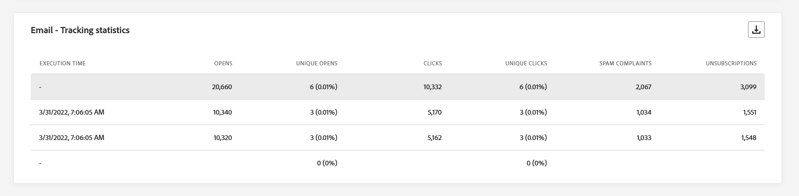
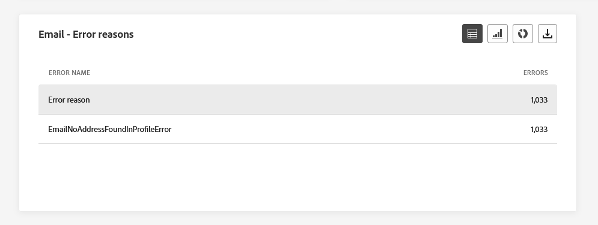
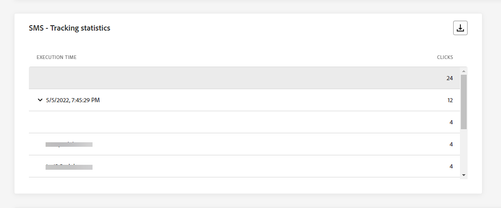
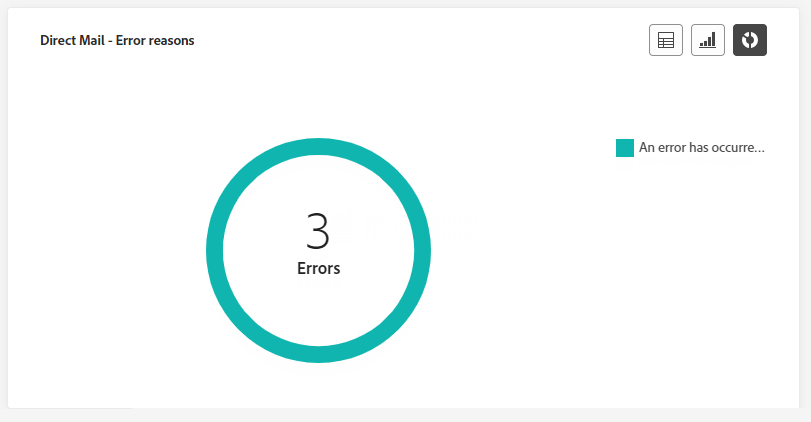

# Informe global de la campaña {#campaign-global-report}

>[!CONTEXTUALHELP]
>id="ajo_campaign_global_report"
>title="Informe global de la campaña"
>abstract="El informe global de campaña permite medir el impacto de las campañas durante un período de tiempo seleccionado. El informe se divide en distintos widgets que detallan el éxito y los errores de la campaña. Cada tablero de informes se puede modificar cambiando el tamaño de los widgets o eliminándolos."

Informes globales, accesibles desde **Siempre** pestaña, muestra los eventos que se produjeron hace al menos dos horas y cubre los eventos durante un periodo de tiempo seleccionado. En comparación, los informes en directo se centran en los eventos que han tenido lugar en las últimas 24 horas, con un intervalo de tiempo mínimo de dos minutos desde que se produjo el evento.

Se puede acceder al informe global de Campaign directamente desde la campaña con la variable **[!UICONTROL Ver informe]** botón.

La campaña **[!UICONTROL Informe global]** se mostrará con las siguientes pestañas:

* [Campaign](#campaign-global)
* [Correo electrónico](#email-global)
* [En la aplicación](#inapp-global)
* [Push](#push-global)
* [SMS](#sms-global)
* [Web](#web-tab)
* [Correo directo](#direct-mail-global)

La campaña **[!UICONTROL Informe global]** se divide en diferentes widgets que detallan el éxito y los errores de la campaña. Se puede cambiar el tamaño de cada widget y eliminarlo si es necesario. Para obtener más información, consulte [sección](../reports/global-report.md#modify-dashboard).

Para obtener una lista detallada de todas las métricas disponibles en Adobe Journey Optimizer, consulte [esta página](global-report.md#list-of-components-global.md)

## Pestaña Campaña {#campaign-global}

### Envío {#delivery-global}

>[!CONTEXTUALHELP]
>id="ajo_campaign_delivery_global"
>title="Estadísticas de Campaign"
>abstract="El widget de estadísticas de Campaign detalla la información principal relativa a la campaña, como los perfiles introducidos y las acciones enviadas."

El **[!UICONTROL Estadísticas de la campaña]** Los KPI sirven como un tablero completo, que ofrece un desglose detallado de las métricas clave relacionadas con la campaña. Esto incluye información esencial, como la cantidad de perfiles y las acciones entregadas, lo que proporciona una comprensión exhaustiva del rendimiento y la participación de su campaña.

+++ Obtenga más información sobre las métricas de estadísticas de Campaign

* **[!UICONTROL Audiencia]**: Número de perfiles objetivo.

* **[!UICONTROL Acciones entregadas]**: Número total de veces que se ha entregado una acción.

* **[!UICONTROL Acciones con errores en %]**: porcentaje de veces únicas que una acción ha fallado comparado con el número total de veces únicas que se ha entregado una acción.

+++

<!--
### Objectives report {#objectives-global}

The **[!UICONTROL Objectives]** tab allows you to better fine-tune your deliveries' reports by targeting one specific metric.

The **[!UICONTROL Objectives]** listed are linked to **[!UICONTROL Datasets]** that define a connection to a system in order to retrieve additional information. A list of built-in **[!UICONTROL Objectives]** is available but you can add your own by adding new **[!UICONTROL Dataset]**. For the detailed procedure, refer to this [section](../campaigns/reporting-configuration.md).

After selecting the Objectives you want to target on, the two **[!UICONTROL Performance overview]** and **[!UICONTROL Campaign objective]** widgets will provide a detailed summary of your delivery performance. 

With the **[!UICONTROL Campaign objective]** widget, you can also choose to compare your main objective with another metric.
-->

### Informe de experimentación {#experimentation-global}

>[!CONTEXTUALHELP]
>id="ajo_campaigns_content_experiment_click"
>title="Métrica de éxito"
>abstract="El valor total de la métrica de éxito, previamente seleccionada al crear los experimentos, dividido por el número de perfiles."

El **[!UICONTROL Experimentación]** proporciona perspectivas clave sobre el rendimiento de cada variante e identifica la que tiene más éxito.

Tenga en cuenta que la definición del mejor ejecutante puede llevar algún tiempo y se representará mediante este icono .

+++Obtenga más información sobre las distintas métricas y widgets disponibles para el informe Experimentación.

El **[!UICONTROL Resultado del experimento]** widget detalla el rendimiento de cada variante. Puede cambiar la línea de base seleccionando uno de los tratamientos en la **[!UICONTROL Línea base]** la lista desplegable. El mejor tratamiento se representará con un icono de estrella.

Para profundizar en estos resultados y en cómo interpretarlos, consulte [esta página](../campaigns/get-started-experiment.md#interpret-results).

La tabla presenta las siguientes métricas:

* **[!UICONTROL Alza sobre la línea base]**: Medida de la mejora porcentual en la tasa de conversión de un tratamiento determinado respecto al valor basal.

* **[!UICONTROL Confianza]**: Evidencia de que un tratamiento dado es el mismo que el tratamiento basal. [Más información](../campaigns/experiment-calculations.md#understand-confidence)

* **[!UICONTROL Clics salientes únicos]**: Recuento total de clics en los canales salientes.

* **[!UICONTROL Perfiles]**: Número de perfiles objetivo para este tratamiento.

* **[!UICONTROL Clics/perfiles salientes únicos]**: Valor total de la métrica de éxito, seleccionada anteriormente al crear los experimentos, dividido por el número de perfiles.

El **[!UICONTROL Intervalo de confianza]** el gráfico mide la incertidumbre en torno a la mejora. Detalla la diferencia porcentual en el rendimiento entre la línea de base y el tratamiento con mejor rendimiento. [Más información](../campaigns/experiment-calculations.md#confidence-intervals).

El último widget proporciona datos relacionados con el **[!UICONTROL Métrica de éxito]** ha seleccionado anteriormente para sus Tratamientos. Tiene la opción de seleccionar una métrica de destino diferente en la **[!UICONTROL Métrica]** menú desplegable para rastrear datos alternativos.

>[!CAUTION]
>
>Cuando trabaje con métricas filtradas de experimentación, tenga en cuenta que al cambiar la selección de métricas del menú desplegable en la página de comparación para la experimentación, no se conservará el valor de filtro. Por ejemplo, si se cambia de &quot;Clics&quot; a &quot;Clics únicos&quot;, se perderá el filtro aplicado y la comparación se volverá inexacta o no válida.

+++

## Pestaña de correo electrónico {#email-global}

### Correo electrónico: estadísticas de envío {#sending-statistics-email}

>[!CONTEXTUALHELP]
>id="ajo_campaign_global_email_sending_statistics"
>title="Correo electrónico: Estadísticas de envío"
>abstract="La tabla Correo electrónico: Estadísticas de envío resume los datos esenciales sobre sus correos electrónicos, como los segmentados o enviados."

El **[!UICONTROL Estadísticas de envío de correo electrónico]** proporciona un resumen completo de los datos esenciales relacionados con sus campañas de correo electrónico. Detalla métricas clave como el tamaño de la audiencia objetivo y la cantidad de correos electrónicos enviados correctamente, lo que ofrece perspectivas valiosas sobre la eficacia y el alcance de los correos electrónicos.

+++ Más información sobre las métricas de estadísticas de envío de correo electrónico

* **[!UICONTROL Objetivos]**: Número total de correos electrónicos procesados durante el proceso de envío.

* **[!UICONTROL Enviado]**: Número total de envíos del correo electrónico.

* **[!UICONTROL Entregado]**: Número de correos electrónicos enviados correctamente, en relación con el número total de mensajes enviados.

* **[!UICONTROL Tasa de entrega]**: porcentaje de correos electrónicos enviados correctamente.

* **[!UICONTROL Devoluciones]**: Total de errores acumulados durante el proceso de envío y el procesamiento automático de devoluciones en relación con el número total de mensajes enviados.

* **[!UICONTROL Tasa de devoluciones]**: porcentaje de correos electrónicos que rebotaron en comparación con los enviados.

* **[!UICONTROL Errores]**: Número total de errores que se produjeron durante el proceso de envío y que impiden su envío a los perfiles.

* **[!UICONTROL Tasa de error]**: porcentaje de errores que se produjeron durante el proceso de envío y que impiden su envío en comparación con los correos electrónicos enviados.

* **[!UICONTROL Reintentos]**: Número de correos electrónicos en cola para reintentos.

* **[!UICONTROL Excluido]**: Número de perfiles que han sido excluidos por Adobe Journey Optimizer.

+++

### Correo electrónico: Estadísticas de seguimiento {#tracking-statistics-email}

>[!CONTEXTUALHELP]
>id="ajo_campaign_global_email_tracking_statistics"
>title="Correo electrónico: Estadísticas de seguimiento"
>abstract="La tabla Correo electrónico: Estadísticas de seguimiento proporciona datos sobre la actividad del perfil del Correo electrónico."

El **[!UICONTROL Correo electrónico: estadísticas de seguimiento]** Esta tabla ofrece una descripción detallada de la actividad de perfil relacionada con sus campañas de correo electrónico. Esto incluye métricas sobre aperturas, clics y otros indicadores de participación relevantes, lo que ofrece una vista completa de cómo los perfiles interactúan con el contenido del correo electrónico.

+++ Más información sobre el Correo electrónico: métricas de estadísticas de seguimiento

* **[!UICONTROL Aperturas]**: Número de veces que se abrió el correo electrónico.

* **[!UICONTROL Aperturas únicas]**: porcentaje de correos electrónicos abiertos.

* **[!UICONTROL Tasa de apertura]**: Número total de correos electrónicos abiertos en comparación con el número de correos electrónicos enviados.

* **[!UICONTROL Clics]**: Número de veces que se hizo clic en un contenido en los correos electrónicos.

* **[!UICONTROL Clics únicos]**: Número de perfiles que hicieron clic en un contenido de un correo electrónico.

* **[!UICONTROL Tasa de clics únicos]**: porcentaje de usuarios que interactuaron con los correos electrónicos.

* **[!UICONTROL Baja de suscripciones]**: Número de clics en el vínculo de baja de suscripción.

* **[!UICONTROL Quejas de spam]**: Número de veces que un mensaje se declaró como correo no deseado.

+++

### Correo electrónico: rendimiento de envío {#sending-performance-email}

>[!CONTEXTUALHELP]
>id="ajo_campaign_global_email_sending_performance"
>title="Correo electrónico: Rendimiento de envío"
>abstract="El gráfico de rendimiento Correo electrónico: envío presenta datos completos sobre los correos electrónicos enviados, ofreciendo perspectivas sobre métricas clave como envíos y devoluciones, lo que permite un análisis detallado del proceso de envío de correo electrónico."

El **[!UICONTROL Correo electrónico: rendimiento de envío]** El gráfico proporciona una vista completa de los datos relacionados con los correos electrónicos enviados, y ofrece información sobre las métricas clave como los envíos y los rechazos. Esto permite un análisis detallado del proceso de envío de correo electrónico, lo que proporciona información valiosa sobre la eficacia y el rendimiento de sus campañas de correo electrónico.

+++ Más información sobre el Correo electrónico: envío de métricas de rendimiento

* **[!UICONTROL Entregado]**: Número de correos electrónicos enviados correctamente, en relación con el número total de correos electrónicos enviados.

* **[!UICONTROL Devoluciones]**: Total de errores acumulados durante el proceso de envío y el procesamiento automático de devoluciones en relación con el número total de correos electrónicos enviados.

* **[!UICONTROL Reintentos]**: Número de correos electrónicos en cola para reintentos.

* **[!UICONTROL Errores]**: Número total de errores que se produjeron durante el proceso de envío y que impiden su envío a los perfiles.

+++

### Correo electrónico: motivos de rechazo y categorías {#bounces-email}

>[!CONTEXTUALHELP]
>id="ajo_campaign_global_email_bounce_categories"
>title="Correo electrónico: Categorías de Rechazo"
>abstract="Los gráficos y la tabla Correo electrónico: Categorías de rechazo proporcionan datos sobre errores tanto temporales como permanentes."

>[!CONTEXTUALHELP]
>id="ajo_campaign_global_email_bounce_reasons"
>title="Correo electrónico: motivos de los Rechazos"
>abstract="El correo electrónico: los gráficos y la tabla Motivos de rechazos contienen los datos disponibles relacionados con los mensajes rechazados."

El **[!UICONTROL Correo electrónico: razones de rechazo]** y **[!UICONTROL Correo electrónico: categorías de rechazo]** los widgets compilan los datos disponibles relacionados con los mensajes devueltos, proporcionando una perspectiva detallada de los motivos y las categorías específicos detrás de los rechazos de correo electrónico.

Para obtener más información sobre las devoluciones, consulte [Lista de supresión](../reports/suppression-list.md) página.

+++ Más información sobre las métricas Correo electrónico: categorías de rechazo

* **[!UICONTROL Rechazo duro]**: el número total de errores permanentes, como una dirección de correo electrónico incorrecta. Esto implica un mensaje de error que indica explícitamente que la dirección no es válida, como Usuario desconocido.

* **[!UICONTROL Rechazo suave]**: el número total de errores temporales, como una bandeja de entrada llena.

* **[!UICONTROL Ignorado]**: el número total de mensajes temporales, como Fuera de la oficina, o un error técnico, por ejemplo, si el tipo de remitente es administrador de correo.

+++

### Correo electrónico: Motivos de error {#errors-email}

>[!CONTEXTUALHELP]
>id="ajo_campaign_global_email_error_reasons"
>title="Correo electrónico: Motivos de error"
>abstract="El correo electrónico: los gráficos y la tabla Motivos de error permiten le permiten identificar los errores específicos que se produjeron durante el envío."

El **[!UICONTROL Motivos del error]** los gráficos y las tablas ofrecen visibilidad de los errores específicos que se produjeron durante el proceso de envío, lo que proporciona información valiosa sobre la naturaleza y la incidencia de los errores.

Puede elegir entre cambiar de una tabla, un gráfico de barras o un anillo.

### Correo electrónico: Motivos excluidos {#excluded-email}

>[!CONTEXTUALHELP]
>id="ajo_campaign_global_email_excluded_reasons"
>title="Correo electrónico: Motivos excluidos"
>abstract="Los gráficos y la tabla Motivos excluidos ilustran los distintos factores que llevaron a que los perfiles de usuario, excluidos del público destinatario, no recibieran el mensaje."

El **[!UICONTROL Razones de exclusión]** los gráficos y la tabla presentan una vista completa de los diferentes factores que resultaron en la exclusión de perfiles de usuario de la audiencia de destino, lo que da como resultado que el mensaje no se reciba.

Consulte [esta página](exclusion-list.md) para obtener la lista completa de motivos de exclusión.

### Enviados y entregados por dominios {#sent-domains}

El  **[!UICONTROL Enviados y entregados por dominios]** La tabla y el gráfico proporcionan un desglose detallado de los correos electrónicos en el nivel de dominio, lo que ofrece información completa sobre el rendimiento de los correos electrónicos.

+++ Más información sobre las Métricas de Enviado y entregado por dominios

* **[!UICONTROL Enviado]**: Número total de envíos del correo electrónico.

* **[!UICONTROL Entregado]**: Número de correos electrónicos enviados correctamente, en relación con el número total de correos electrónicos enviados.

+++

### Rechazos y errores por dominios {#bounces-domains}

El  **[!UICONTROL Devoluciones y errores por dominios]** El gráfico y la tabla ofrecen un desglose a nivel de dominio de los errores específicos encontrados durante el proceso de envío, lo que proporciona un análisis detallado de los problemas que se han producido.

+++ Más información sobre las Métricas Devoluciones y errores por dominios

* **[!UICONTROL Devoluciones]**: Total de errores acumulados durante el proceso de envío y el procesamiento automático de devoluciones en relación con el número total de correos electrónicos enviados.

* **[!UICONTROL Errores]**: Número total de errores que se produjeron durante el proceso de envío y que impiden que el correo electrónico se envíe a los perfiles.

+++

### Aperturas y clics por dominios {#opens-domains}

El  **[!UICONTROL Abrir y hacer clic por dominios]** los gráficos y las tablas muestran un desglose a nivel de dominio de la participación de sus perfiles con su correo electrónico, lo que proporciona una valiosa perspectiva de cómo los distintos dominios interactúan con su contenido.

+++ Más información sobre las métricas Abrir y clics por dominios

* **[!UICONTROL Aperturas]**: Número de veces que se abrió el correo electrónico.

* **[!UICONTROL Clics]**: Número de veces que se hizo clic en un contenido en un correo electrónico.

+++

### Razones de rechazo por dominio {#bounce-reasons-domains}

El  **[!UICONTROL Razones de rechazo por dominio]** los gráficos y las tablas ofrecen un desglose de datos a nivel de dominio sobre los errores temporales y permanentes, lo que proporciona una perspectiva detallada de los motivos que subyacen a los mensajes rechazados.

+++ Más información sobre los Motivos de rechazo por métricas de dominio

* **[!UICONTROL Aperturas]**: Número de veces que se abrió el correo electrónico.

* **[!UICONTROL Clics]**: Número de veces que se hizo clic en un contenido en un correo electrónico.

+++

### Correo electrónico: URL principal {#top-url-email}

>[!CONTEXTUALHELP]
>id="ajo_campaign_global_email_top_url"
>title="Correo electrónico: URL principal"
>abstract="Correo electrónico: el gráfico y la tabla URL principal ofrecen una visión general de las direcciones URL dentro del correo electrónico que reciben el mayor tráfico de visitantes, lo que le permite identificar los vínculos más populares."

El **[!UICONTROL Correo electrónico: URL principal]** El gráfico y la tabla proporcionan una visión general de las direcciones URL del correo electrónico que atraen el mayor tráfico de visitantes. Esto le permite identificar y priorizar los vínculos más populares, lo que mejora su comprensión de la participación del perfil con contenido específico en los correos electrónicos.

### Correo electrónico: Dominio del mejor destinatario {#top-recipient-email}

>[!CONTEXTUALHELP]
>id="ajo_campaign_global_email_best_recipient"
>title="Correo electrónico: Dominio del mejor destinatario"
>abstract="Correo electrónico: el gráfico y la tabla Dominio del mejor destinatario proporcionan un desglose detallado de los dominios que los destinatarios utilizan con más frecuencia para abrir el correo electrónico, lo que ofrece información valiosa sobre el comportamiento de los destinatarios."

>[!CAUTION]
>
> El **[!UICONTROL Correo electrónico: dominio del mejor destinatario]** El widget tiene una tasa de precisión del 99,95 %.

El **[!UICONTROL Correo electrónico: dominio del mejor destinatario]** el gráfico y la tabla ofrecen un desglose detallado de los dominios que los perfiles utilizan con más frecuencia para abrir los correos electrónicos. Esto proporciona una valiosa perspectiva del comportamiento del perfil, lo que le ayuda a comprender las plataformas preferidas.

+++ Más información sobre el correo electrónico: las mejores métricas de dominio de destinatario

* **[!UICONTROL Entregado]**: Número de correos electrónicos enviados correctamente, en relación con el número total de correos electrónicos enviados.

* **[!UICONTROL Tasa de entrega]**: porcentaje de correos electrónicos enviados correctamente.

* **[!UICONTROL Tasa de rechazos + errores]**: porcentaje de correos electrónicos que rebotaron en comparación con los enviados.

+++

### Correo electrónico: optimización {#optimized-email}

>[!NOTE]
>
>El **[!UICONTROL Optimizado frente a no optimizado]** y **[!UICONTROL Optimización del tiempo de envío]**  Los widgets solo están disponibles si la opción Optimización del tiempo de envío está activada para el correo electrónico. Para obtener más información sobre la optimización del tiempo de envío, consulte [esta página](../building-journeys/journeys-message.md#send-time-optimization).

El **[!UICONTROL Optimizado frente a no optimizado]** y **[!UICONTROL Optimización del tiempo de envío]** los widgets detallan la información principal relativa al mensaje, estén optimizados o no.

+++ Más información sobre las Métricas de optimización del tiempo de envío

* **[!UICONTROL Enviado]**: Número total de envíos.

* **[!UICONTROL Aperturas]**: Número de veces que se abrió el mensaje.

* **[!UICONTROL Clics]**: Número de veces que se hizo clic en un contenido en un correo electrónico.

* **[!UICONTROL Entregado]**: Número de mensajes enviados correctamente en relación con el número total de mensajes enviados.

* **[!UICONTROL Devoluciones]**: Total de errores acumulados durante el proceso de envío y el procesamiento automático de devoluciones en relación con el número total de mensajes enviados.

+++

### Correo electrónico: ofertas {#email-offers}

El **[!UICONTROL Estadísticas de ofertas]**, **[!UICONTROL Estadísticas de ofertas con el tiempo]** y **[!UICONTROL Estadísticas detalladas de ofertas]** los widgets miden el éxito y el impacto de su oferta en la audiencia de destino.

+++ Más información sobre el Correo electrónico: métricas de ofertas

* **[!UICONTROL Oferta enviada]**: Número total de envíos para la oferta.

* **[!UICONTROL Impresión de oferta]**: Número de veces que se abrió la oferta en sus correos electrónicos.

* **[!UICONTROL Clics de oferta]**: Número de veces que se hizo clic en una oferta en sus correos electrónicos.

* **[!UICONTROL Nombre de ubicación]**: Nombre de la ubicación utilizada para mostrar la oferta. Para obtener más información sobre la ubicación, consulte esta sección [página](../offers/offer-library/creating-placements.md).

* **[!UICONTROL Nombre de oferta]**: Nombre de la oferta añadida en la entrega. Para obtener más información sobre la ubicación, consulte esta sección [página](../offers/offer-library/creating-personalized-offers.md).

* **[!UICONTROL Oferta enviada]**: Número total de envíos para la oferta.

* **[!UICONTROL Tasa de impresiones de oferta]**: porcentaje de ofertas abiertas comparado con el número de ofertas enviadas.

+++

## Pestaña en la aplicación {#inapp-global}

Desde la campaña **[!UICONTROL Informe global]**, el **[!UICONTROL En la aplicación]** Esta pestaña detalla la información principal relativa a los mensajes en la aplicación enviados en la campaña.

### Rendimiento en la aplicación {#in-app-performance}

>[!CONTEXTUALHELP]
>id="ajo_campaign_global_inapp_performance"
>title="Rendimiento en la aplicación"
>abstract="Los KPI de rendimiento en la aplicación proporcionan información esencial sobre la participación de los visitantes en los mensajes de la aplicación."

El **[!UICONTROL Rendimiento en la aplicación]** Los KPI proporcionan información esencial sobre la participación de los visitantes en los mensajes en la aplicación, y proporcionan métricas esenciales para evaluar la eficacia y el impacto de las campañas en la aplicación.

+++ Obtenga más información sobre las métricas de rendimiento en la aplicación.

* **[!UICONTROL Impresiones únicas]**: número de usuarios únicos a los que se entregó el mensaje en la aplicación.

* **[!UICONTROL Impresiones]**: número total de mensajes en la aplicación entregados a todos los usuarios.

* **[!UICONTROL Interacciones]**: número total de interacciones con el mensaje en la aplicación. Esto incluye cualquier acción realizada por los usuarios, como clics, rechazos o cualquier otra interacción.

+++

### Interacciones por tipo {#interactions-type}

>[!CONTEXTUALHELP]
>id="ajo_campaign_global_inapp_interactions"
>title="Interacciones por tipo"
>abstract="La tabla Interacciones por tipo detalla la interacción de los usuarios con el mensaje de la aplicación mediante el seguimiento de cualquier clic, rechazo o interacción."

El **[!UICONTROL Interacciones por tipo]** Los gráficos y las tablas proporcionan una descripción detallada de cómo los perfiles interactuaron con el mensaje en la aplicación, el seguimiento de acciones como clics, rechazos o cualquier otra forma de participación.

### Resumen de la aplicación {#in-app-summary}

>[!CONTEXTUALHELP]
>id="ajo_campaign_global_inapp_summary"
>title="Resumen de la aplicación"
>abstract="El gráfico de resumen de la aplicación ilustra la progresión de las impresiones e interacciones de la aplicación durante el período especificado."

El **[!UICONTROL Resumen en la aplicación]** Este gráfico ilustra la progresión de las impresiones e interacciones en la aplicación durante el periodo especificado, lo que proporciona una visión general del rendimiento de los mensajes en la aplicación.

+++ Más información sobre las Métricas de resumen en la aplicación

* **[!UICONTROL Impresiones únicas]**: número de usuarios únicos a los que se entregó el mensaje en la aplicación.

* **[!UICONTROL Impresiones]**: número total de mensajes en la aplicación entregados a todos los usuarios.

* **[!UICONTROL Interacciones]**: número total de interacciones con el mensaje en la aplicación. Esto incluye cualquier acción realizada por los usuarios, como clics, rechazos o cualquier otra interacción.

+++

## Pestaña de notificación push {#push-global}

Desde la campaña **[!UICONTROL Informe global]**, el **[!UICONTROL Notificación push]** Esta pestaña detalla la información principal relativa a las notificaciones push enviadas en la campaña.

### Notificación push: estadísticas de envío {#push-sending-statistics}

>[!CONTEXTUALHELP]
>id="ajo_campaign_global_push_sending_statistics"
>title="Notificación push: estadísticas de envío"
>abstract="La tabla Estadísticas de envío de notificaciones push resume los datos esenciales sobre las notificaciones push, como los mensajes dirigidos o enviados."

El **[!UICONTROL Notificación push: estadísticas de envío]** proporciona un resumen conciso de los datos esenciales relacionados con las notificaciones push, incluidas las métricas clave como el número de mensajes dirigidos y el número de mensajes enviados correctamente.

+++ Más información sobre las Notificaciones push: envío de métricas de estadísticas

* **[!UICONTROL Tiempo de ejecución]**: Hora de inicio de cada ejecución de la notificación push recurrente. Para segmentar solo una o varias notificaciones push recurrentes, selecciónelas en el **[!UICONTROL Tiempo de ejecución]** menú desplegable.

* **[!UICONTROL Objetivos]**: Número total de notificaciones push procesadas durante el análisis.

* **[!UICONTROL Enviado]**: Número total de envíos para la notificación push.

* **[!UICONTROL Entregado]**: Número de notificaciones push enviadas correctamente, en relación con el número total de notificaciones push enviadas.

* **[!UICONTROL Tasa de entrega]**: porcentaje de notificaciones push enviadas correctamente.

* **[!UICONTROL Devoluciones]**: Total de errores acumulados durante el proceso de envío y el procesamiento automático de devoluciones en relación con el número total de notificaciones push.

* **[!UICONTROL Tasa de devoluciones]**: porcentaje de notificaciones push que rebotaron en comparación con las notificaciones push enviadas.

* **[!UICONTROL Errores]**: Número total de errores que han impedido su envío a los perfiles.

* **[!UICONTROL Tasa de error]**: porcentaje de errores que se produjeron durante la prevención para que se enviara en comparación con las notificaciones push enviadas.

* **[!UICONTROL Excluido]**: Número de perfiles que han sido excluidos por Adobe Journey Optimizer.

+++

### Notificación push: estadísticas de seguimiento {#push-tracking-statistics}

>[!CONTEXTUALHELP]
>id="ajo_campaign_global_push_tracking_statistics"
>title="Notificación push: estadísticas de seguimiento"
>abstract="Las Estadísticas de seguimiento push proporcionan datos sobre la actividad del perfil de su notificación push."

El **[!UICONTROL Notificación push: estadísticas de seguimiento]** El widget ofrece una instantánea detallada de la actividad del perfil vinculada a las notificaciones push, lo que proporciona una información esencial sobre la participación y la eficacia de las notificaciones push.

+++ Más información sobre las Notificaciones push: métricas de estadísticas de seguimiento

* **[!UICONTROL Tiempo de ejecución]**: Hora de inicio de cada ejecución de la notificación push recurrente. Para segmentar solo una o varias notificaciones push recurrentes, selecciónelas en el **[!UICONTROL Tiempo de ejecución]** menú desplegable.

* **[!UICONTROL Aperturas]**: Número de veces que se abrió la notificación push.

* **[!UICONTROL Acciones]**: Número total de acciones en la notificación push entregada, por ejemplo, clic en el botón o despido.

+++

### Notificación push: resumen del envío {#push-summary}

>[!CONTEXTUALHELP]
>id="ajo_campaign_global_push_sending_summary"
>title="Notificación push: resumen del envío"
>abstract="El gráfico Resumen del envío de notificaciones push muestra los datos disponibles para las notificaciones push enviadas."

El **[!UICONTROL Notificación push: resumen de envío]** el gráfico ofrece una representación dinámica que muestra un análisis de la actividad de notificaciones push. Esta representación gráfica proporciona un desglose completo de las notificaciones push enviadas.

+++ Más información sobre las Notificaciones push: envío de métricas de resumen

* **[!UICONTROL Aperturas]**: Número de veces que se abrió la notificación push.

* **[!UICONTROL Acciones]**: Número total de acciones en la notificación push entregada, por ejemplo, clic en el botón o despido.

* **[!UICONTROL Devoluciones]**: Total de errores acumulados y procesamiento automático de devolución en relación con el número total de notificaciones push enviadas.

* **[!UICONTROL Entregado]**: Número de notificaciones push enviadas correctamente, en relación con el número total de notificaciones push enviadas.

* **[!UICONTROL Errores]**: Número total de errores que han impedido su envío a los perfiles.

+++

### Notificación push: optimización {#push-optimized}

>[!NOTE]
>
>El **[!UICONTROL Optimizado frente a no optimizado]** y **[!UICONTROL Optimización del tiempo de envío]**  Los widgets solo están disponibles si la opción Optimización del tiempo de envío está activada para la notificación push. Para obtener más información sobre la optimización del tiempo de envío, consulte [esta página](../building-journeys/journeys-message.md#send-time-optimization).

El **[!UICONTROL Optimizado frente a no optimizado]** y **[!UICONTROL Optimización del tiempo de envío]** los widgets detallan la información principal relativa al mensaje, estén optimizados o no.

+++ Más información sobre las Notificaciones push: enviar métricas de optimización de tiempo

* **[!UICONTROL Entregado]**: Número de notificaciones push enviadas correctamente, en relación con el número total de notificaciones push enviadas.

* **[!UICONTROL Aperturas]**: Número de veces que se abrió la notificación push.

* **[!UICONTROL Acciones]**: Número total de acciones en la notificación push entregada, por ejemplo, clic en el botón o despido.

* **[!UICONTROL Devoluciones]**: Total de errores acumulados durante el proceso de envío y el procesamiento automático de devoluciones en relación con el número total de notificaciones push enviadas.

+++

### Notificación push: motivos del error {#error-reasons-push}

>[!CONTEXTUALHELP]
>id="ajo_campaign_global_push_error_reasons"
>title="Notificación push: motivos del error"
>abstract="Los gráficos y la tabla Motivos del error le permiten identificar los errores específicos que se produjeron durante el proceso de envío."

El **[!UICONTROL Motivos del error]** La tabla y los gráficos le permiten identificar los errores específicos que se produjeron durante el proceso de envío de las notificaciones push, lo que ofrece información detallada sobre cualquier problema que se haya encontrado durante el proceso.

### Notificación push: motivos excluidos {#excluded-push}

>[!CONTEXTUALHELP]
>id="ajo_campaign_global_push_excluded_reasons"
>title="Notificación push: motivos excluidos"
>abstract="Los gráficos y la tabla Motivos excluidos ilustran los distintos factores que llevaron a que los perfiles de usuario, excluidos del público destinatario, no recibieran el mensaje."

El **[!UICONTROL Razones de exclusión]** los gráficos y la tabla muestran los diferentes motivos que impidieron que los perfiles de usuario, excluidos de los perfiles de destino, recibieran las notificaciones push.

Consulte [esta página](exclusion-list.md) para obtener la lista completa de motivos de exclusión.

### Notificación push: desglose por plataforma {#breakdown-platform-push}

>[!CONTEXTUALHELP]
>id="ajo_campaign_global_push_breakdown_platform"
>title="Notificación push: desglose por plataforma"
>abstract="Los gráficos y la tabla Desglose por plataforma proporcionan un desglose del éxito de las notificaciones push en función del sistema operativo del perfil."

El **[!UICONTROL Notificación push: desglose por plataforma]** el gráfico y la tabla proporcionan un análisis detallado del éxito de sus notificaciones push, y ofrecen perspectivas basadas en el sistema operativo de su perfil. Este desglose mejora su comprensión del rendimiento de las notificaciones push en las distintas plataformas.

+++ Más información sobre las notificaciones push: desglose por métricas de plataforma

* **[!UICONTROL Objetivos]**: Número total de notificaciones push procesadas durante el análisis.

* **[!UICONTROL Entregado]**: Número de notificaciones push enviadas correctamente, en relación con el número total de notificaciones push enviadas.

* **[!UICONTROL Aperturas]**: Número de veces que se abrió la notificación push.

* **[!UICONTROL Acciones]**: Número total de acciones en la notificación push entregada, por ejemplo, clic en el botón o despido.

* **[!UICONTROL Devoluciones]**: Total de errores acumulados y procesamiento automático de devolución en relación con el número total de notificaciones push enviadas.

* **[!UICONTROL Errores]**: Número total de errores que han impedido su envío a los perfiles.

* **[!UICONTROL Excluido]**: Número de perfiles que han sido excluidos por Adobe Journey Optimizer.

+++

## Pestaña SMS {#sms-global}

Desde la campaña **[!UICONTROL Informe global]**, el **[!UICONTROL SMS]** Esta pestaña detalla la información principal relativa a los mensajes SMS enviados en la campaña.

### SMS: estadísticas de envío {#sms-sending-statistics}

>[!CONTEXTUALHELP]
>id="ajo_campaign_global_sms_sending_statistics"
>title="SMS: estadísticas de envío"
>abstract="La tabla Estadísticas del envío de SMS resume los datos esenciales sobre sus mensajes SMS, como los mensajes segmentados o enviados."

El **[!UICONTROL SMS: estadísticas de envío]** La tabla proporciona un resumen conciso de los datos esenciales relacionados con sus mensajes SMS, que incluye métricas clave como el número de mensajes dirigidos y el recuento de mensajes enviados correctamente.

+++ Más información sobre SMS: métricas de estadísticas de envío

* **[!UICONTROL Tiempo de ejecución]**: Hora de inicio de cada ejecución del mensaje SMS recurrente. Para dirigirse solo a uno o varios mensajes SMS recurrentes, selecciónelos en la **[!UICONTROL Tiempo de ejecución]** menú desplegable.

* **[!UICONTROL Objetivos]**: número de perfiles de usuario que se califican como perfiles de destinatario.

* **[!UICONTROL Excluido]**: número de perfiles de usuario, excluidos de los perfiles de destino, que no recibieron el mensaje.

* **[!UICONTROL Enviado]**: Número total de envíos para sus mensajes SMS.

* **[!UICONTROL Devoluciones]**: Total de errores acumulados durante el proceso de envío y el procesamiento automático de devoluciones en relación con el número total de mensajes SMS enviados.

* **[!UICONTROL Errores]**: Número total de errores que han impedido su envío a los perfiles.

+++

### SMS: estadísticas de seguimiento {#sms-tracking-statistics}

El **[!UICONTROL SMS: estadísticas de seguimiento]** Este widget proporciona una descripción detallada de la información clave relacionada con la participación de los visitantes con las direcciones URL, lo que ofrece perspectivas sobre la eficacia de los mensajes SMS.

+++ Más información sobre SMS: métricas de estadísticas de seguimiento

* **[!UICONTROL Tiempo de ejecución]**: Hora de inicio de cada ejecución del SMS recurrente. Para dirigirse solo a uno o varios SMS recurrentes, selecciónelos en la **[!UICONTROL Tiempo de ejecución]** menú desplegable.

* **[!UICONTROL Clics]**: Número de veces que se hizo clic en un contenido en un mensaje SMS.

+++

### SMS: rendimiento por fecha {#sms-perfomance-date}

>[!CONTEXTUALHELP]
>id="ajo_campaign_global_sms_performance"
>title="SMS: rendimiento por fecha"
>abstract="El widget Rendimiento por fecha de SMS proporciona información clave sobre los mensajes a través de una representación gráfica."

El **[!UICONTROL Rendimiento de SMS por fecha]** El widget ofrece una descripción detallada de la información clave relacionada con los mensajes, presentada a través de un gráfico, que proporciona perspectivas sobre las tendencias de rendimiento en períodos de tiempo específicos.

+++ Más información sobre SMS: rendimiento por métricas de fecha

* **[!UICONTROL Enviado]**: Número total de envíos para sus mensajes SMS.

* **[!UICONTROL Devoluciones]**: Total de errores acumulados durante el proceso de envío y el procesamiento automático de devoluciones en relación con el número total de mensajes SMS enviados.

* **[!UICONTROL Errores]**: Número total de errores que han impedido su envío a los perfiles.

+++

### SMS: motivos de error {#sms-error}

>[!CONTEXTUALHELP]
>id="ajo_campaign_global_sms_error_reasons"
>title="SMS: motivos de error"
>abstract="SMS: los gráficos y la tabla Motivos de error le permiten identificar los errores específicos que se produjeron durante el proceso de envío."

El **[!UICONTROL Motivos del error]** Los gráficos y las tablas le permiten identificar los errores específicos que se produjeron durante el proceso de envío de sus mensajes SMS, lo que facilita un análisis exhaustivo de cualquier problema encontrado.

### SMS: motivos excluidos {#sms-excluded-reasons}

>[!CONTEXTUALHELP]
>id="ajo_campaign_global_sms_excluded_reasons"
>title="SMS: motivos excluidos"
>abstract="Los gráficos y la tabla Motivos excluidos ilustran los distintos factores que llevaron a que los perfiles de usuario, excluidos del público destinatario, no recibieran el mensaje."

El **[!UICONTROL Excluye motivos]** Los gráficos y tablas muestran visualmente los diversos factores que llevaron a la exclusión de perfiles de usuario de la audiencia de destino, lo que les impidió recibir sus mensajes SMS.

Consulte [esta página](exclusion-list.md) para obtener la lista completa de motivos de exclusión.

### SMS: motivos de rechazos {#sms-bounces-reasons}

>[!CONTEXTUALHELP]
>id="ajo_campaign_global_sms_bounces_reasons"
>title="SMS: motivos de rechazos"
>abstract="Los gráficos y la tabla Motivos de rechazos contienen los datos disponibles relacionados con los mensajes rechazados."

El **[!UICONTROL Razones de rechazos]** Los gráficos y la tabla proporcionan una visión general completa de los datos relacionados con los mensajes SMS rechazados, lo que ofrece una valiosa perspectiva de las razones específicas detrás de las instancias de rechazos de mensajes SMS.

### SMS: clics por vínculos {#sms-clicks-links}

>[!CONTEXTUALHELP]
>id="ajo_campaign_global_sms_clicks_links"
>title="SMS: clics por vínculos"
>abstract="El widget SMS: clics por vínculos proporciona información esencial sobre la participación de los visitantes en las direcciones URL de los mensajes"

El **[!UICONTROL SMS: clics por vínculos]** El widget ofrece una información esencial sobre la participación de los visitantes con las direcciones URL incluidas en los mensajes, lo que proporciona información valiosa sobre los vínculos que atraen más interacción.

## Pestaña web {#web-tab}

Desde la campaña **[!UICONTROL Informe global]**, el **[!UICONTROL Web]** La pestaña detalla la información principal relativa a sus páginas web.

### Rendimiento web {#web-performance}

>[!CONTEXTUALHELP]
>id="ajo_campaign_global_web_performance"
>title="Rendimiento web"
>abstract="Los KPI de rendimiento web proporcionan información completa sobre la participación de los visitantes en las experiencias web."

El **[!UICONTROL Rendimiento web]** Los KPI ofrecen una amplia perspectiva de la participación de los visitantes en sus páginas web, lo que incluye métricas clave como Impresiones e Interacciones.

+++ Más información sobre las métricas de rendimiento web

* **[!UICONTROL Impresiones únicas]**: número de usuarios únicos a los que se ha entregado la experiencia web.

* **[!UICONTROL Impresiones]**: número total de experiencias web entregadas a todos los usuarios.

* **[!UICONTROL Tasa de interacción]**: porcentaje de interacciones con la página web. Esto incluye cualquier acción realizada por los usuarios, como clics o cualquier otra interacción.

+++

### Resumen web {#web-summary}

>[!CONTEXTUALHELP]
>id="ajo_campaign_global_web_summary"
>title="Resumen web"
>abstract="El gráfico Resumen web ilustra la progresión de las experiencias web, incluidas las impresiones, las impresiones únicas y las interacciones, durante el período especificado."

El **[!UICONTROL Resumen web]** Este gráfico muestra la evolución de las experiencias web (impresiones, impresiones únicas e interacciones) durante el periodo correspondiente.

+++ Más información sobre las métricas de resumen web

* **[!UICONTROL Impresiones únicas]**: número de usuarios únicos a los que se ha entregado la experiencia web.

* **[!UICONTROL Impresiones]**: número total de experiencias web entregadas a todos los usuarios.

* **[!UICONTROL Interacción]**: número total de interacciones con la página web. Esto incluye cualquier acción realizada por los usuarios, como clics o cualquier otra interacción.

+++

### Interacciones por elemento {#web-interactions}

>[!CONTEXTUALHELP]
>id="ajo_campaign_global_web_interactions"
>title="Interacciones por elemento"
>abstract="La tabla Interacciones por elemento proporciona información clave sobre la participación de los visitantes en diferentes elementos de las páginas web."

El **[!UICONTROL Interacciones por elemento]** La tabla presenta información completa sobre la participación de los visitantes con los distintos elementos de las páginas web, lo que ofrece información valiosa sobre las interacciones y preferencias del usuario.

+++ Más información sobre las Interacciones por métricas de elemento

* **[!UICONTROL Interacción]**: número total de interacciones con la página web. Esto incluye cualquier acción realizada por los usuarios, como clics o cualquier otra interacción.

* **[!UICONTROL Tasa de interacción]**: porcentaje de interacciones con la página web. Esto incluye cualquier acción realizada por los usuarios, como clics o cualquier otra interacción.

+++

## Pestaña de correo directo {#direct-mail-global}

Desde la campaña **[!UICONTROL Informe global]**, el **[!UICONTROL Correo directo]** Esta pestaña detalla la información principal relativa a sus mensajes de correo postal.

### Correo directo: estadísticas del envío {#direct-mail-sending-statistics}

>[!CONTEXTUALHELP]
>id="ajo_campaign_global_direct_sending_statistics"
>title="Correo directo: estadísticas del envío"
>abstract="La tabla Estadísticas del envío de correo directo resume los datos esenciales sobre sus mensajes de correo directo, como los mensajes segmentados o enviados."

El **[!UICONTROL Correo directo: estadísticas de envío]** proporciona un resumen conciso de los datos esenciales relacionados con sus mensajes de correo postal, incluyendo métricas clave como el número de mensajes dirigidos y el recuento de mensajes enviados correctamente.

+++ Más información sobre el Correo directo: métricas de estadísticas de envío

* **[!UICONTROL Tiempo de ejecución]**: Hora de inicio de cada ejecución del correo postal recurrente. Para dirigirse solo a uno o varios correos postales recurrentes, selecciónelos en la **[!UICONTROL Tiempo de ejecución]** menú desplegable.

* **[!UICONTROL Objetivos]**: número de perfiles de usuario que se pueden considerar perfiles de destinatario para los mensajes de correo postal.

* **[!UICONTROL Enviado]**: Número total de envíos para los mensajes de correo postal.

* **[!UICONTROL Errores]**: Número total de errores que se produjeron durante el proceso de envío y que impiden su envío a los perfiles.

* **[!UICONTROL Excluido]**: número de perfiles de usuario, excluidos de los perfiles de destino, que no recibieron sus mensajes de correo postal.

+++

### Correo directo: motivos de error {#direct-mail-error}

>[!CONTEXTUALHELP]
>id="ajo_campaign_global_direct_error_reasons"
>title="Correo directo: motivos de error"
>abstract="Los gráficos y la tabla Correo directo: motivos de error le permiten identificar los errores específicos que se produjeron durante el envío."

El **[!UICONTROL Correo directo: razones de error]** los gráficos y tablas proporcionan los medios para identificar errores específicos que se produjeron durante el proceso de envío de sus mensajes de correo postal, lo que permite un análisis detallado de cualquier problema encontrado.

### Correo directo: motivos excluidos {#direct-mail-excluded}

>[!CONTEXTUALHELP]
>id="ajo_campaign_global_direct_excluded_reasons"
>title="Correo directo: motivos excluidos"
>abstract="Los gráficos y la tabla Motivos excluidos del correo directo ilustran los distintos factores que llevaron a que los perfiles de usuario, excluidos del público destinatario, no recibieran el mensaje."

El **[!UICONTROL Correo directo: razones de exclusión]** los gráficos y las tablas ilustran visualmente los distintos factores que resultaron en la exclusión de perfiles de usuario de la audiencia de destino, lo que les impide recibir sus mensajes de correo postal.

Consulte [esta página](exclusion-list.md) para obtener la lista completa de motivos de exclusión.

## Recursos adicionales

* [Introducción a las campañas](../campaigns/get-started-with-campaigns.md)
* [Creación de una campaña](../campaigns/create-campaign.md)
* [Creación de campañas activadas por API](../campaigns/api-triggered-campaigns.md)
* [Modificación o detención de una campaña](../campaigns/modify-stop-campaign.md)
* [Informe en vivo de la campaña](campaign-live-report.md)
