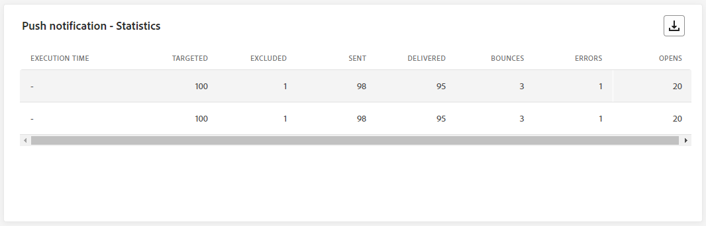

# Informe en vivo de la campaña {#campaign-live-report}

>[!CONTEXTUALHELP]
>id="ajo_campaign_live_report"
>title="Informe en vivo de la campaña"
>abstract="El informe en vivo de la campaña permite medir y visualizar en tiempo real el impacto y el rendimiento de las campañas solo durante las últimas 24 horas. El informe se divide en distintos widgets que detallan el éxito y los errores de la campaña. Cada tablero de informes se puede modificar cambiando el tamaño de los widgets o eliminándolos."

Los informes en directo, a los que se puede acceder desde la pestaña Últimas 24 horas, muestran los eventos que han tenido lugar en las últimas 24 horas, con un intervalo de tiempo mínimo de dos minutos desde que se produjo el evento. En comparación, los informes globales se centran en eventos que se produjeron hace al menos dos horas y abarcan eventos durante un período de tiempo seleccionado.

Se puede acceder directamente al informe de campaña en directo desde la campaña con la variable **[!UICONTROL Vista en vivo]** botón.

La campaña **[!UICONTROL Informe en vivo]** se mostrará con las siguientes pestañas:

* [Campaign](#campaign-live)
* [Correo electrónico](#email-live)
* [En la aplicación](#inapp-live)
* [Push](#push-live)
* [SMS](#sms-live)
* [Web](#web-tab)
* [Correo directo](#direct-mail-tab)

La campaña **[!UICONTROL Informe en vivo]** se divide en diferentes widgets que detallan el éxito y los errores de la campaña. Se puede cambiar el tamaño de cada widget y eliminarlo si es necesario. Para obtener más información, consulte [sección](../reports/live-report.md#modify-dashboard).

Para obtener una lista detallada de todas las métricas disponibles en Adobe Journey Optimizer, consulte [esta página](live-report.md#list-of-components-live).

## Pestaña Campaña {#campaign-live}

### envío {#delivery-live}

El **[!UICONTROL Estadísticas de la campaña]** Los KPI sirven como un panel completo, que ofrece un desglose detallado de las métricas clave de las últimas 24 horas relacionadas con la campaña. Esto incluye información esencial, como la cantidad de perfiles y las acciones entregadas, lo que proporciona una comprensión exhaustiva del rendimiento y la participación de su campaña.

+++ Obtenga más información sobre las métricas de estadísticas de Campaign

* **[!UICONTROL Audiencia]**: Número de perfiles objetivo.

* **[!UICONTROL Acciones entregadas]**: Número total de veces que se ha entregado una acción.

* **[!UICONTROL Errores]**: Número total de errores que se produjeron durante el proceso de envío y que impiden su envío a los perfiles.

+++

<!--
### Experimentation tab (#experimentation-live)

From your Campaign **[!UICONTROL Live report]**, the **[!UICONTROL Experimentation]** tab details the main information relative to how each variant is performing and if there is was winner during the test.
-->

## Pestaña de correo electrónico {#email-live}

Desde la campaña **[!UICONTROL Informe en vivo]**, el **[!UICONTROL Correo electrónico]** Esta pestaña detalla la información principal relativa al correo electrónico enviado en la campaña.

### Correo electrónico: Rendimiento de envío {#email-sending-performance}

>[!CONTEXTUALHELP]
>id="ajo_campaign_live_email_sending_statistics"
>title="Correo electrónico: Estadísticas de envío"
>abstract="El gráfico Estadísticas del envío de correo electrónico resume los datos esenciales sobre sus correos electrónicos, como los segmentados o enviados en las últimas 24 horas."

El **[!UICONTROL Correo electrónico: rendimiento de envío]** ofrece una descripción general detallada de los datos relacionados con los correos electrónicos enviados en las últimas 24 horas. Proporciona perspectivas sobre métricas esenciales como envíos y devoluciones, lo que permite un examen detallado del proceso de envío de correo electrónico.

+++ Más información sobre las métricas de rendimiento de envío de correo electrónico

* **[!UICONTROL Entregado]**: número de correos electrónicos enviados correctamente.

* **[!UICONTROL Devoluciones]**: Total de errores acumulados durante el proceso de envío y el procesamiento automático de devoluciones.

* **[!UICONTROL Reintentos]**: Número de correos electrónicos en cola para reintentos.

* **[!UICONTROL Errores]**: Número total de errores que se produjeron durante el proceso de envío y que impiden su envío a los perfiles.
+++

### Correo electrónico: Estadísticas

>[!CONTEXTUALHELP]
>id="ajo_campaign_live_email_statistics"
>title="Correo electrónico: Estadísticas"
>abstract="La tabla Correo electrónico: Estadísticas proporciona datos sobre la actividad del perfil de su correo electrónico en las últimas 24 horas."

El **[!UICONTROL Envío de métricas por correo electrónico]** ofrece un resumen completo de los datos de las últimas 24 horas. Describe las métricas esenciales, incluido el tamaño de la audiencia de destino y el recuento de correos electrónicos enviados correctamente. Esto proporciona una valiosa perspectiva de la eficacia y el alcance de sus campañas de correo electrónico.

+++ Más información sobre las métricas de Correo electrónico: Estadísticas

* **[!UICONTROL Tiempo de ejecución]**: Hora de inicio de cada ejecución del correo electrónico recurrente. Para dirigirse solo a uno o varios correos electrónicos recurrentes, selecciónelos en la **[!UICONTROL Tiempo de ejecución]** menú desplegable.

* **[!UICONTROL Objetivos]**: Número total de mensajes procesados durante el proceso de envío.

* **[!UICONTROL Excluido]**: número de perfiles de usuario, excluidos de los perfiles de destino, que no recibieron el mensaje.

* **[!UICONTROL Enviado]**: Número total de envíos.

* **[!UICONTROL Entregado]**: número de mensajes enviados correctamente.

* **[!UICONTROL Devoluciones]**: Total de errores acumulados durante el proceso de envío y el procesamiento automático de devoluciones.

* **[!UICONTROL Errores]**: Número total de errores que se produjeron durante el proceso de envío y que impiden su envío a los perfiles.

* **[!UICONTROL Aperturas]**: Número de veces que se abrió un mensaje.

* **[!UICONTROL Clics]**: Número de veces que se hizo clic en un contenido.

* **[!UICONTROL Cancelar suscripción]**: Número de clics en el vínculo de baja de suscripción.

* **[!UICONTROL Quejas de spam]**: Número de veces que un mensaje se declaró como correo no deseado.

* **[!UICONTROL Reintentos]**: Número de correos electrónicos en cola para reintentos.
+++

### Correo electrónico: categorías y motivos de rechazo {#bounce-categories}

>[!CONTEXTUALHELP]
>id="ajo_campaign_live_email_bounce_categories"
>title="Correo electrónico: Categorías de Rechazo"
>abstract="Los gráficos y la tabla de categorías de Rechazo de correo electrónico proporcionan datos sobre errores temporales y permanentes de las últimas 24 horas."

>[!CONTEXTUALHELP]
>id="ajo_campaign_live_email_bounce_reasons"
>title="Correo electrónico: motivos de los Rechazos"
>abstract="Los gráficos y la tabla Correo electrónico: Motivos de rechazos contienen los datos disponibles relacionados con los mensajes rechazados de las últimas 24 horas."

El **[!UICONTROL Motivos del rechazo]** y **[!UICONTROL Categorías de rechazo]** los widgets compilan los datos disponibles de las últimas 24 horas relacionados con los mensajes devueltos, proporcionando una perspectiva detallada de los motivos y las categorías específicos detrás de los rechazos de correo electrónico.

Para obtener más información sobre las devoluciones, consulte [Lista de supresión](../reports/suppression-list.md) página.

+++ Más información sobre las métricas Correo electrónico: Categorías de rechazo y motivos

* **[!UICONTROL Rechazo duro]**: el número total de errores permanentes, como una dirección de correo electrónico incorrecta. Esto implica un mensaje de error que indica explícitamente que la dirección no es válida, como Usuario desconocido.

* **[!UICONTROL Rechazo suave]**: el número total de errores temporales, como una bandeja de entrada llena.

* **[!UICONTROL Ignorado]**: el número total de mensajes temporales, como Fuera de la oficina, o un error técnico, por ejemplo, si el tipo de remitente es administrador de correo.

+++

### Correo electrónico: Rendimiento por fecha {#email-performance-date}

>[!CONTEXTUALHELP]
>id="ajo_campaign_live_email_performance_bydate"
>title="Correo electrónico: Rendimiento por fecha"
>abstract="El gráfico Correo electrónico: rendimiento por fecha presenta datos completos de las últimas 24 horas sobre los correos electrónicos enviados, ofreciendo información sobre métricas clave como envíos y devoluciones, lo que permite un análisis detallado del proceso de envío de correo electrónico."

El **[!UICONTROL Correo electrónico: rendimiento por fecha]** El widget ofrece una descripción detallada de la información clave relacionada con los mensajes, presentada a través de un gráfico, que proporciona información sobre las tendencias de rendimiento durante las últimas 24 horas.

+++ Más información sobre las métricas Correo electrónico: rendimiento por fecha y motivos

* **[!UICONTROL Enviado]**: Número total de envíos.

* **[!UICONTROL Entregado]**: número de mensajes enviados correctamente.

* **[!UICONTROL Devoluciones]**: Total de errores acumulados durante el proceso de envío y el procesamiento automático de devoluciones.

* **[!UICONTROL Errores]**: Número total de errores que se produjeron durante el proceso de envío y que impiden su envío a los perfiles.

* **[!UICONTROL Aperturas]**: Número de veces que se abrió un mensaje.

* **[!UICONTROL Clics]**: Número de veces que se hizo clic en un contenido.

* **[!UICONTROL Baja de suscripciones]**: Número de clics en el vínculo de baja de suscripción.

* **[!UICONTROL Quejas de spam]**: Número de veces que un mensaje se declaró como correo no deseado.

+++

### Motivos del error {#email-error-reasons}

>[!CONTEXTUALHELP]
>id="ajo_campaign_live_email_error_reasons"
>title="Correo electrónico: Motivos de error"
>abstract="Los gráficos y la tabla Correo electrónico: Motivos de error permiten identificar los errores específicos que se han producido en las últimas 24 horas."

El **[!UICONTROL Motivos del error]** los gráficos y tablas proporcionan una perspectiva de los errores específicos que se produjeron durante el proceso de envío en las últimas 24 horas. Esta información es valiosa para comprender la naturaleza y la frecuencia de los errores.

### Razones de exclusión {#email-exclude-reasons}

>[!CONTEXTUALHELP]
>id="ajo_campaign_live_email_excluded_reasons"
>title="Correo electrónico: Motivos excluidos"
>abstract="Los gráficos y la tabla Motivos de exclusión ilustran los distintos factores que llevaron a que los perfiles de usuario, excluidos del público destinatario, no recibieran el mensaje en las últimas 24 horas."

El **[!UICONTROL Razones de exclusión]** los gráficos y la tabla ofrecen una perspectiva completa de los distintos factores que llevaron a la exclusión de perfiles de usuario de la audiencia de destino en las últimas 24 horas.

Consulte [esta página](exclusion-list.md) para obtener la lista completa de motivos de exclusión.

### Correo electrónico: Dominio del mejor destinatario {#email-best-recipient}

>[!CONTEXTUALHELP]
>id="ajo_campaign_live_email_best_recipient"
>title="Correo electrónico: Dominio del mejor destinatario"
>abstract="El gráfico y la tabla Correo electrónico: el mejor dominio de destinatario proporcionan un desglose detallado de los dominios que los destinatarios utilizan con más frecuencia para abrir el correo electrónico, lo que ofrece información valiosa sobre el comportamiento de los destinatarios en las últimas 24 horas."

El **[!UICONTROL Correo electrónico: dominio del mejor destinatario]** los gráficos y las tablas proporcionan un desglose exhaustivo de los dominios que los perfiles utilizan con mayor frecuencia para abrir sus correos electrónicos en las últimas 24 horas. Esto proporciona una valiosa perspectiva del comportamiento del perfil, lo que le ayuda a comprender las plataformas preferidas.

### Correo electrónico: ofertas {#email-offers}

>[!NOTE]
>
>Los widgets y las métricas de Ofertas solo están disponibles si se insertó una decisión en un mensaje de correo electrónico. Para obtener más información sobre Gestión de decisiones, consulte esta [página](../offers/get-started/starting-offer-decisioning.md).

El **[!UICONTROL Estadísticas de ofertas]** y **[!UICONTROL Estadísticas de ofertas con el tiempo]** los widgets miden el éxito y el impacto de su oferta en la audiencia de destino. Detalla la información principal relativa al mensaje con KPI.

+++ Más información sobre el Correo electrónico: métricas de ofertas

* **[!UICONTROL Oferta enviada]**: Número total de envíos para la oferta.

* **[!UICONTROL Impresión de oferta]**: Número de veces que se abrió la oferta en sus correos electrónicos.

* **[!UICONTROL Clics de oferta]**: Número de veces que se hizo clic en una oferta en sus correos electrónicos.

+++

## Pestaña en la aplicación {#inapp-live}

Desde la campaña **[!UICONTROL Informe en vivo]**, el **[!UICONTROL En la aplicación]** Esta pestaña detalla la información principal relativa a los mensajes en la aplicación enviados en la campaña.

### Rendimiento en la aplicación {#inapp-performance}

>[!CONTEXTUALHELP]
>id="ajo_campaign_live_inapp_performance"
>title="Rendimiento en la aplicación"
>abstract="Los KPI de rendimiento en la aplicación proporcionan una perspectiva esencial de la participación de los visitantes en los mensajes en la aplicación en las últimas 24 horas."

El **[!UICONTROL Rendimiento en la aplicación]** Los KPI proporcionan una perspectiva esencial de la participación de sus perfiles con los mensajes en la aplicación en las últimas 24 horas, lo que proporciona métricas esenciales para evaluar la eficacia y el impacto de sus campañas en la aplicación.

+++ Obtenga más información sobre las métricas de rendimiento en la aplicación.

* **[!UICONTROL Impresiones]**: número total de mensajes en la aplicación enviados a todos los usuarios.

* **[!UICONTROL Interacciones]**: número total de interacciones con el mensaje en la aplicación. Esto incluye cualquier acción realizada por los usuarios, como clics, rechazos o cualquier otra interacción.

+++

### Resumen de la aplicación {#inapp-summary}

>[!CONTEXTUALHELP]
>id="ajo_campaign_live_inapp_summary"
>title="Resumen de la aplicación"
>abstract="El gráfico de resumen en la aplicación ilustra la progresión de las impresiones e interacciones en la aplicación en las últimas 24 horas."

El **[!UICONTROL Resumen en la aplicación]** Este gráfico ilustra la progresión de las impresiones e interacciones en la aplicación en las últimas 24 horas, y proporciona una visión general completa del rendimiento de los mensajes en la aplicación.

+++ Más información sobre las Métricas de resumen en la aplicación

* **[!UICONTROL Impresiones]**: número total de mensajes en la aplicación entregados a todos los usuarios.

* **[!UICONTROL Interacciones]**: número total de interacciones con el mensaje en la aplicación. Esto incluye cualquier acción realizada por los usuarios, como clics, rechazos o cualquier otra interacción.

+++

### Interacciones por tipo {#inapp-interactions}

>[!CONTEXTUALHELP]
>id="ajo_campaign_live_inapp_interactions"
>title="Interacciones por tipo"
>abstract="La tabla Interacciones por tipo detalla la interacción de los usuarios con el mensaje en la aplicación mediante el seguimiento de cualquier clic, descarte o interacción en las últimas 24 horas."

El **[!UICONTROL Interacciones por tipo]** Los gráficos y las tablas proporcionan una descripción detallada de cómo los perfiles interactuaron con el mensaje en la aplicación en las últimas 24 horas, y rastrean acciones como clics, rechazos o cualquier otra forma de participación.

## Pestaña de notificación push {#push-live}

Desde la campaña **[!UICONTROL Informe en vivo]**, el **[!UICONTROL Notificación push]** Esta pestaña detalla la información principal relativa a la notificación push enviada en la campaña.

### Notificación push: rendimiento del envío {#push-sending-performance}

>[!CONTEXTUALHELP]
>id="ajo_campaign_live_push_sending_performance"
>title="Notificación push: rendimiento del envío"
>abstract="El gráfico Rendimiento del envío de notificación push resume los datos esenciales sobre la notificación push, como los errores o los mensajes enviados en las últimas 24 horas."

El **[!UICONTROL Rendimiento de envío de notificaciones push]** el gráfico ofrece una descripción general completa de los datos relacionados con las notificaciones push enviadas en las últimas 24 horas. Proporciona perspectivas sobre métricas esenciales como envíos y devoluciones, lo que permite un examen detallado del proceso de envío de notificaciones push.

+++ Más información sobre las Notificaciones push: envío de métricas de rendimiento

* **[!UICONTROL Entregado]**: número de mensajes enviados correctamente.

* **[!UICONTROL Devoluciones]**: Total de errores acumulados durante el proceso de envío y el procesamiento automático de devoluciones.

* **[!UICONTROL Errores]**: Número total de errores que se produjeron durante el proceso de envío y que impiden su envío a los perfiles.

+++

### Notificación push: estadísticas {#push-statistics}

>[!CONTEXTUALHELP]
>id="ajo_campaign_live_push_statistics"
>title="Notificación push: estadísticas"
>abstract="La tabla Estadísticas push proporciona datos sobre la actividad del destinatario referente a la notificación push en las últimas 24 horas."

El **[!UICONTROL Notificación push: estadísticas]** proporciona un resumen conciso de los datos esenciales relacionados con las notificaciones push en las últimas 24 horas, incluidas las métricas clave como el número de mensajes dirigidos y el número de mensajes enviados correctamente.

+++ Más información sobre las Notificaciones push: métricas estadísticas

* **[!UICONTROL Tiempo de ejecución]**: Hora de inicio de cada ejecución de la notificación push recurrente. Para segmentar solo una o varias notificaciones push recurrentes, selecciónelas en el **[!UICONTROL Tiempo de ejecución]** menú desplegable.

* **[!UICONTROL Objetivos]**: Número total de mensajes procesados durante el proceso de envío.

* **[!UICONTROL Excluido]**: número de perfiles de usuario, excluidos de los perfiles de destino, que no recibieron el mensaje.

* **[!UICONTROL Enviado]**: Número total de envíos.

* **[!UICONTROL Entregado]**: número de mensajes enviados correctamente.

* **[!UICONTROL Devoluciones]**: Total de errores acumulados durante el proceso de envío y el procesamiento automático de devoluciones.

* **[!UICONTROL Errores]**: Número total de errores que se produjeron durante el proceso de envío y que impiden su envío a los perfiles.

* **[!UICONTROL Aperturas]**: Número de veces que se abrió un mensaje.

+++

### Notificación push: resumen del envío {#push-sending-summary}

>[!CONTEXTUALHELP]
>id="ajo_campaign_live_push_sending_summary"
>title="Notificación push: resumen del envío"
>abstract="El gráfico Resumen del envío de notificación push muestra los datos disponibles para las notificaciones push enviadas en las últimas 24 horas."

El **[!UICONTROL Notificación push: estadísticas]** el gráfico ofrece una representación dinámica que muestra un análisis de la actividad de notificaciones push en las últimas 24 horas. Esta representación gráfica proporciona un desglose completo de las notificaciones push enviadas.

+++ Más información sobre las Notificaciones push: envío de métricas de resumen

* **[!UICONTROL Aperturas]**: Número de veces que se abrió la notificación push.

* **[!UICONTROL Acciones]**: Número total de acciones en la notificación push entregada, por ejemplo, clic en el botón o despido.

* **[!UICONTROL Devoluciones]**: Total de errores acumulados y procesamiento automático de devolución en relación con el número total de mensajes enviados.

* **[!UICONTROL Entregado]**: Número de mensajes enviados correctamente en relación con el número total de mensajes enviados.

* **[!UICONTROL Errores]**: Número total de errores que han impedido su envío a los perfiles.

+++

### Notificación push: motivos excluidos {#push-excluded}

>[!CONTEXTUALHELP]
>id="ajo_campaign_live_push_excluded_reasons"
>title="Notificación push: motivos excluidos"
>abstract="Los gráficos y la tabla Motivos de exclusión ilustran los distintos factores que llevaron a que los perfiles de usuario, excluidos del público destinatario, no recibieran el mensaje en las últimas 24 horas."

El **[!UICONTROL Razones de exclusión]** los gráficos y la tabla muestran los diferentes motivos que impidieron que los perfiles de usuario, excluidos de los perfiles de destino, recibieran notificaciones push en las últimas 24 horas.

Consulte [esta página](exclusion-list.md) para obtener la lista completa de motivos de exclusión.

### Notificación push: motivos del error {#push-error}

>[!CONTEXTUALHELP]
>id="ajo_campaign_live_push_error_reasons"
>title="Notificación push: motivos del error"
>abstract="Los gráficos y la tabla Motivos de error permiten identificar los errores específicos que se produjeron en las últimas 24 horas durante el envío."

El **[!UICONTROL Motivos del error]** La tabla y los gráficos le permiten identificar los errores específicos que se produjeron durante el proceso de envío de las notificaciones push en las últimas 24 horas, lo que ofrece información detallada sobre cualquier problema que se haya encontrado durante el proceso.

### Notificación push: desglose por plataforma {#push-breakdown-platform}

>[!CONTEXTUALHELP]
>id="ajo_campaign_live_push_breakdown_platform"
>title="Notificación push: desglose por plataforma"
>abstract="Los gráficos y la tabla Desglose por plataforma proporcionan un desglose del éxito de las notificaciones push en las últimas 24 horas en función del sistema operativo del destinatario."

El **[!UICONTROL Notificación push: desglose por plataforma]** el gráfico y la tabla proporcionan un análisis detallado del éxito de las notificaciones push en las últimas 24 horas, y ofrecen perspectivas basadas en el sistema operativo de su perfil. Este desglose mejora su comprensión del rendimiento de las notificaciones push en las distintas plataformas.

+++ Más información sobre las notificaciones push: desglose por métricas de plataforma

* **[!UICONTROL Objetivos]**: Número total de mensajes procesados durante el análisis.

* **[!UICONTROL Entregado]**: Número de mensajes enviados correctamente en relación con el número total de mensajes enviados.

* **[!UICONTROL Aperturas]**: Número de veces que se abrió la notificación push.

* **[!UICONTROL Acciones]**: Número total de acciones en la notificación push entregada, por ejemplo, clic en el botón o despido.

* **[!UICONTROL Devoluciones]**: Total de errores acumulados y procesamiento automático de devolución en relación con el número total de mensajes enviados.

* **[!UICONTROL Errores]**: Número total de errores que han impedido su envío a los perfiles.

* **[!UICONTROL Excluido]**: Número de perfiles que han sido excluidos por Adobe Journey Optimizer.

+++

## Pestaña SMS {#sms-live}

Desde la campaña **[!UICONTROL Informe en vivo]**, el **[!UICONTROL SMS]** Esta pestaña detalla la información principal relativa al mensaje SMS enviado en la campaña.

### SMS: estadísticas {#sms-statistics}

>[!CONTEXTUALHELP]
>id="ajo_campaign_live_sms_statistics"
>title="SMS: estadísticas"
>abstract="La tabla Estadísticas del envío de SMS resume los datos esenciales sobre sus mensajes SMS, como los mensajes segmentados o enviados en las últimas 24 horas."

El **[!UICONTROL SMS: estadísticas]** La tabla proporciona un resumen conciso de los datos esenciales relacionados con sus mensajes SMS en las últimas 24 horas, que incluye métricas clave como el número de mensajes dirigidos y el recuento de mensajes enviados correctamente.

+++ Más información sobre los SMS: métricas estadísticas

* **[!UICONTROL Tiempo de ejecución]**: Hora de inicio de cada ejecución del mensaje SMS recurrente. Para dirigirse solo a uno o varios mensajes SMS recurrentes, selecciónelos en la **[!UICONTROL Tiempo de ejecución]** menú desplegable.

* **[!UICONTROL Objetivos]**: número de perfiles de usuario que se califican como perfiles de destinatario.

* **[!UICONTROL Excluido]**: número de perfiles de usuario, excluidos de los perfiles de destino, que no recibieron el mensaje.

* **[!UICONTROL Enviado]**: Número total de envíos.

* **[!UICONTROL Devoluciones]**: Total de errores acumulados durante el proceso de envío y el procesamiento automático de devoluciones.

* **[!UICONTROL Errores]**: Número total de errores que se produjeron durante el proceso de envío y que impiden su envío a los perfiles.

* **[!UICONTROL Clics]**: Número total de visitas de URL.

+++

### SMS: rendimiento por fecha {#sms-perfomance-date}

>[!CONTEXTUALHELP]
>id="ajo_campaign_live_sms_performance"
>title="SMS: rendimiento por fecha"
>abstract="El widget Rendimiento por fecha de SMS proporciona información clave de las últimas 24 horas sobre sus mensajes a través de una representación gráfica."

El **[!UICONTROL Rendimiento de SMS por fecha]** El widget ofrece una descripción detallada de la información clave relacionada con los mensajes, presentada a través de un gráfico, que proporciona información sobre las tendencias de rendimiento durante las últimas 24 horas.

+++ Más información sobre SMS: rendimiento por métricas de fecha

* **[!UICONTROL Enviado]**: Número total de envíos.

* **[!UICONTROL Devoluciones]**: Total de errores acumulados durante el proceso de envío y el procesamiento automático de devoluciones.

* **[!UICONTROL Errores]**: Número total de errores que se produjeron durante el proceso de envío y que impiden su envío a los perfiles.

+++

### SMS: razones de error {#sms-error-reasons}

>[!CONTEXTUALHELP]
>id="ajo_campaign_live_sms_error_reasons"
>title="SMS: motivos de error"
>abstract="Los gráficos y la tabla SMS: Motivos de error permiten identificar los errores específicos que se produjeron en las últimas 24 horas durante el envío."

El **[!UICONTROL Razones de exclusión]** Los gráficos y la tabla le permiten identificar los errores específicos que se produjeron durante el proceso de envío de sus mensajes SMS en las últimas 24 horas, lo que facilita un análisis exhaustivo de cualquier problema encontrado.

### SMS: razones de exclusión {#sms-excluded-reasons}

>[!CONTEXTUALHELP]
>id="ajo_campaign_live_sms_excluded_reasons"
>title="SMS: motivos excluidos"
>abstract="Los gráficos y la tabla Motivos de exclusión ilustran los distintos factores que llevaron a que los perfiles de usuario, excluidos del público destinatario, no recibieran el mensaje en las últimas 24 horas."

El **[!UICONTROL Razones de exclusión]** Los gráficos y la tabla muestran visualmente los diversos factores que llevaron a la exclusión de perfiles de usuario de la audiencia de destino, lo que les impidió recibir sus mensajes SMS en las últimas 24 horas.

Consulte [esta página](exclusion-list.md) para obtener la lista completa de motivos de exclusión.

### SMS: motivos de rechazos {#sms-bounces-reasons}

>[!CONTEXTUALHELP]
>id="ajo_campaign_live_sms_bounces_reasons"
>title="SMS: motivos de rechazos"
>abstract="Los gráficos y la tabla Motivos de rechazos contienen los datos disponibles de las últimas 24 horas relacionados con los mensajes rechazados."

El **[!UICONTROL Razones de rechazos]** Los gráficos y la tabla proporcionan una visión general completa de los datos relacionados con los mensajes SMS rechazados, lo que ofrece una valiosa perspectiva de las razones específicas detrás de las instancias de rechazos de mensajes SMS en las últimas 24 horas.

## Pestaña web {#web-tab}

Desde la campaña **[!UICONTROL Informe en vivo]**, el **[!UICONTROL Web]** La pestaña detalla la información principal relativa a sus páginas web.

### Rendimiento web {#web-performance}

>[!CONTEXTUALHELP]
>id="ajo_campaign_live_web_performance"
>title="Rendimiento web"
>abstract="Los KPI de rendimiento web proporcionan información completa sobre la participación de sus visitantes con sus experiencias web en las últimas 24 horas."

El **[!UICONTROL Rendimiento web]** Los KPI ofrecen una visión completa de la participación de los visitantes en sus páginas web en las últimas 24 horas, e incluyen métricas clave como Impresiones e Interacciones.

+++ Más información sobre las métricas de rendimiento web

* **[!UICONTROL Impresiones]**: número total de experiencias web entregadas a todos los usuarios.

* **[!UICONTROL Interacciones]**: número total de interacciones con la página web. Esto incluye cualquier acción realizada por los usuarios, como clics o cualquier otra interacción.

+++

### Resumen web {#web-summary}

>[!CONTEXTUALHELP]
>id="ajo_campaign_live_web_summary"
>title="Resumen web"
>abstract="El gráfico Resumen web ilustra la progresión de las experiencias web, incluidas las impresiones, las impresiones únicas y las interacciones, desde las últimas 24 horas."

El **[!UICONTROL Resumen web]** El gráfico muestra la evolución de sus experiencias web (impresiones, impresiones únicas e interacciones) en las últimas 24 horas.

+++ Más información sobre las métricas de resumen web

* **[!UICONTROL Impresiones]**: número total de experiencias web entregadas a todos los usuarios.

* **[!UICONTROL Interacciones]**: número total de interacciones con la página web. Esto incluye cualquier acción realizada por los usuarios, como clics o cualquier otra interacción.

+++

### Interacciones por elemento {#web-interactions}

>[!CONTEXTUALHELP]
>id="ajo_campaign_live_web_interactions"
>title="Interacciones por elemento"
>abstract="La tabla Interacciones por elemento proporciona información clave sobre la participación de los visitantes con diferentes elementos de las páginas web en las últimas 24 horas."

El **[!UICONTROL Interacciones por elemento]** La tabla presenta información completa sobre la participación de los visitantes con los distintos elementos de las páginas web en las últimas 24 horas, lo que ofrece información valiosa sobre las interacciones y preferencias del usuario.

## Pestaña de correo directo {#direct-mail-tab}

Desde la campaña **[!UICONTROL Informe en vivo]**, el **[!UICONTROL Correo directo]** Esta pestaña detalla la información principal relativa a su correo postal.

### Correo directo: estadísticas del envío {#direct-mail-sending}

>[!CONTEXTUALHELP]
>id="ajo_campaign_live_direct_sending_statistics"
>title="Correo directo: estadísticas del envío"
>abstract="La tabla Estadísticas de envío de correo directo resume los datos esenciales de las últimas 24 horas sobre sus mensajes de correo directo, como los mensajes dirigidos o enviados."

El **[!UICONTROL Correo directo: estadísticas de envío]** proporciona un resumen conciso de los datos esenciales relacionados con sus mensajes de correo directo, que incluye métricas clave como el número de mensajes dirigidos y el recuento de mensajes enviados correctamente en las últimas 24 horas.

+++ Más información sobre el Correo directo: métricas de estadísticas de envío

* **[!UICONTROL Objetivos]**: número de perfiles de usuario que se califican como perfiles de destinatario.

* **[!UICONTROL Enviado]**: Número total de envíos.

* **[!UICONTROL Errores]**: Número total de errores que se produjeron durante el proceso de envío y que impiden su envío a los perfiles.

* **[!UICONTROL Excluido]**: número de perfiles de usuario, excluidos de los perfiles de destino, que no recibieron su correo postal.

+++

### Correo directo: motivos de error {#direct-mail-error-reasons}

>[!CONTEXTUALHELP]
>id="ajo_campaign_live_direct_error_reasons"
>title="Correo directo: motivos de error"
>abstract="Los gráficos y la tabla Correo directo: los motivos del error permiten identificar los errores específicos que se han producido en las últimas 24 horas."

El **[!UICONTROL Correo directo: razones de error]** los gráficos y tablas proporcionan los medios para identificar errores específicos que se produjeron durante el proceso de envío de sus mensajes de correo postal, lo que permite un análisis detallado de cualquier problema encontrado en las últimas 24 horas.

### Correo directo: motivos excluidos {#direct-mail-excluded-reasons}

>[!CONTEXTUALHELP]
>id="ajo_campaign_live_direct_excluded_reasons"
>title="Correo directo: motivos excluidos"
>abstract="Los gráficos y la tabla Motivos de exclusión de correo directo ilustran los distintos factores que llevaron a que los perfiles de usuario, excluidos del público destinatario, no recibieran el mensaje en las últimas 24 horas."

El **[!UICONTROL Correo directo: razones de exclusión]** los gráficos y la tabla ilustran visualmente los distintos factores que resultaron en la exclusión de perfiles de usuario de la audiencia de destino, lo que les impide recibir sus mensajes de correo postal en las últimas 24 horas.

Consulte [esta página](exclusion-list.md) para obtener la lista completa de motivos de exclusión.

## Recursos adicionales

* [Introducción a las campañas](../campaigns/get-started-with-campaigns.md)
* [Creación de una campaña](../campaigns/create-campaign.md)
* [Creación de campañas activadas por API](../campaigns/api-triggered-campaigns.md)
* [Modificación o detención de una campaña](../campaigns/modify-stop-campaign.md)
* [Informe global de la campaña](campaign-global-report.md)
