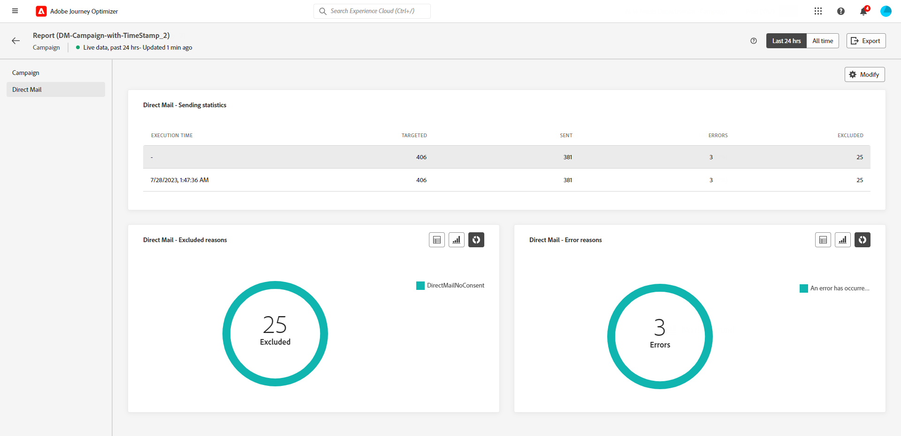

# Informe en vivo de la campaña {#campaign-live-report}

>[!CONTEXTUALHELP]
>id="ajo_campaign_live_report"
>title="Informe en vivo de la campaña"
>abstract="El informe en vivo de la campaña permite medir y visualizar en tiempo real el impacto y el rendimiento de las campañas solo durante las últimas 24 horas. El informe se divide en distintos widgets que detallan el éxito y los errores de la campaña. Cada tablero de informes se puede modificar cambiando el tamaño de los widgets o eliminándolos."

Los informes en directo, a los que se puede acceder desde la pestaña Últimas 24 horas, muestran los eventos que han tenido lugar en las últimas 24 horas, con un intervalo de tiempo mínimo de dos minutos desde que se produjo el evento. En comparación, los informes globales se centran en eventos que se produjeron hace al menos dos horas y abarcan eventos durante un período de tiempo seleccionado.

Se puede acceder directamente al informe de campaña en directo desde la campaña con la variable **[!UICONTROL Vista en vivo]** botón.

La campaña **[!UICONTROL Informe en vivo]** se mostrará con las siguientes pestañas:

* [Campaign](#campaign-live)
* [Correo electrónico](#email-live)
* [En la aplicación](#inapp-live)
* [Push](#push-live)
* [SMS](#sms-live)
* [Web](#web-tab)
* [Correo directo](#direct-mail-tab)

La campaña **[!UICONTROL Informe en vivo]** se divide en diferentes widgets que detallan el éxito y los errores de la campaña. Se puede cambiar el tamaño de cada widget y eliminarlo si es necesario. Para obtener más información, consulte [sección](../reports/live-report.md#modify-dashboard).

Para obtener una lista detallada de todas las métricas disponibles en Adobe Journey Optimizer, consulte [esta página](live-report.md#list-of-components-live).

## Pestaña Campaña {#campaign-live}

### envío {#delivery-live}

El **[!UICONTROL Estadísticas de campaña]** El widget detalla la información principal relativa a la campaña:

* **[!UICONTROL Perfiles introducidos]**: Número de perfiles que iniciaron el recorrido.

<!--
### Experimentation tab (#experimentation-live)

From your Campaign **[!UICONTROL Live report]**, the **[!UICONTROL Experimentation]** tab details the main information relative to how each variant is performing and if there is was winner during the test.
-->

## Pestaña de correo electrónico {#email-live}

>[!CONTEXTUALHELP]
>id="ajo_campaign_live_email_sending_statistics"
>title="Correo electrónico: Estadísticas de envío"
>abstract="El gráfico Estadísticas del envío de correo electrónico resume los datos esenciales sobre sus correos electrónicos, como los segmentados o enviados en las últimas 24 horas."

>[!CONTEXTUALHELP]
>id="ajo_campaign_live_email_statistics"
>title="Correo electrónico: Estadísticas"
>abstract="La tabla Correo electrónico: Estadísticas proporciona datos sobre la actividad del perfil de su correo electrónico en las últimas 24 horas."

>[!CONTEXTUALHELP]
>id="ajo_campaign_live_email_bounce_categories"
>title="Correo electrónico: Categorías de Rechazo"
>abstract="Los gráficos y la tabla de categorías de Rechazo de correo electrónico proporcionan datos sobre errores temporales y permanentes de las últimas 24 horas."

>[!CONTEXTUALHELP]
>id="ajo_campaign_live_email_performance_bydate"
>title="Correo electrónico: Rendimiento por fecha"
>abstract="El gráfico Correo electrónico: Rendimiento por fecha presenta datos completos de las últimas 24 horas sobre los correos electrónicos enviados, ofreciendo información sobre métricas clave como envíos y devoluciones, lo que permite un análisis detallado del proceso de envío de correo electrónico."

>[!CONTEXTUALHELP]
>id="ajo_campaign_live_email_bounce_reasons"
>title="Correo electrónico: motivos de los Rechazos"
>abstract="Los gráficos y la tabla Correo electrónico: Motivos de rechazos contienen los datos disponibles relacionados con los mensajes rechazados de las últimas 24 horas."

>[!CONTEXTUALHELP]
>id="ajo_campaign_live_email_error_reasons"
>title="Correo electrónico: Motivos de error"
>abstract="Los gráficos y la tabla Correo electrónico: Motivos de error permiten identificar los errores específicos que se han producido en las últimas 24 horas."

>[!CONTEXTUALHELP]
>id="ajo_campaign_live_email_excluded_reasons"
>title="Correo electrónico: Motivos excluidos"
>abstract="Los gráficos y la tabla Motivos de exclusión ilustran los distintos factores que llevaron a que los perfiles de usuario, excluidos del público destinatario, no recibieran el mensaje en las últimas 24 horas."

>[!CONTEXTUALHELP]
>id="ajo_campaign_live_email_best_recipient"
>title="Correo electrónico: Dominio del mejor destinatario"
>abstract="El gráfico y la tabla Correo electrónico: el mejor dominio de destinatario proporcionan un desglose detallado de los dominios que los destinatarios utilizan con más frecuencia para abrir el correo electrónico, lo que ofrece información valiosa sobre el comportamiento de los destinatarios en las últimas 24 horas."

Desde la campaña **[!UICONTROL Informe en vivo]**, el **[!UICONTROL Correo electrónico]** Esta pestaña detalla la información principal relativa al correo electrónico enviado en la campaña.

+++Obtenga más información sobre las distintas métricas y widgets disponibles para el informe de correo electrónico.

El **[!UICONTROL Estadísticas de envío de correo electrónico]** El widget detalla la información principal relativa al mensaje:

* **[!UICONTROL Entregado]**: número de mensajes enviados correctamente.

* **[!UICONTROL Devoluciones]**: Total de errores acumulados durante el proceso de envío y el procesamiento automático de devoluciones.

* **[!UICONTROL Errores]**: Número total de errores que se produjeron durante el proceso de envío y que impiden su envío a los perfiles.

El **[!UICONTROL Envío de métricas por correo electrónico]** tabla y **[!UICONTROL Resumen de correo electrónico]** el gráfico detalla el éxito de su correo electrónico:

* **[!UICONTROL Enviado]**: Número total de envíos.

* **[!UICONTROL Entregado]**: número de mensajes enviados correctamente.

* **[!UICONTROL Devoluciones]**: Total de errores acumulados durante el proceso de envío y el procesamiento automático de devoluciones.

* **[!UICONTROL Errores]**: Número total de errores que se produjeron durante el proceso de envío y que impiden su envío a los perfiles.

* **[!UICONTROL Aperturas]**: Número de veces que se abrió un mensaje.

* **[!UICONTROL Clics]**: Número de veces que se hizo clic en un contenido.

* **[!UICONTROL Cancelar suscripción]**: Número de clics en el vínculo de baja de suscripción.

* **[!UICONTROL Quejas de spam]**: Número de veces que un mensaje se declaró como correo no deseado.

El **[!UICONTROL Motivos del rechazo]** y **[!UICONTROL Categorías de rechazo]** los widgets contienen los datos disponibles relacionados con los mensajes devueltos, como:

* **[!UICONTROL Rechazo duro]**: el número total de errores permanentes, como una dirección de correo electrónico incorrecta. Esto implica un mensaje de error que indica explícitamente que la dirección no es válida, como Usuario desconocido.

* **[!UICONTROL Rechazo suave]**: el número total de errores temporales, como una bandeja de entrada llena.

* **[!UICONTROL Ignorado]**: el número total de mensajes temporales, como Fuera de la oficina, o un error técnico, por ejemplo, si el tipo de remitente es administrador de correo.

El **[!UICONTROL Motivos del error]** y **[!UICONTROL Razones de exclusión]** los gráficos y tablas permiten ver qué error y exclusiones se produjeron durante el proceso de envío.

El **[!UICONTROL Correo electrónico: dominio del mejor destinatario]** el gráfico y la tabla detallan qué dominios son los más utilizados por los destinatarios para abrir el correo electrónico.
+++

## Pestaña en la aplicación {#inapp-live}

>[!CONTEXTUALHELP]
>id="ajo_campaign_live_inapp_performance"
>title="Rendimiento en la aplicación"
>abstract="Los KPI de rendimiento en la aplicación proporcionan una perspectiva esencial de la participación de los visitantes en los mensajes en la aplicación en las últimas 24 horas."

>[!CONTEXTUALHELP]
>id="ajo_campaign_live_inapp_interactions"
>title="Interacciones por tipo"
>abstract="La tabla Interacciones por tipo detalla la interacción de los usuarios con el mensaje en la aplicación mediante el seguimiento de cualquier clic, descarte o interacción en las últimas 24 horas."

>[!CONTEXTUALHELP]
>id="ajo_campaign_live_inapp_summary"
>title="Resumen de la aplicación"
>abstract="El gráfico de resumen en la aplicación ilustra la progresión de las impresiones e interacciones en la aplicación en las últimas 24 horas."

Desde la campaña **[!UICONTROL Informe en vivo]**, el **[!UICONTROL En la aplicación]** Esta pestaña detalla la información principal relativa a los mensajes en la aplicación enviados en la campaña.

+++Obtenga más información sobre las distintas métricas y widgets disponibles para el informe en la aplicación.

El **[!UICONTROL Rendimiento en la aplicación]** Los KPI detallan la información principal relativa a la participación de los visitantes en los mensajes en la aplicación, como:

* **[!UICONTROL Impresiones]**: número total de mensajes en la aplicación enviados a todos los usuarios.

* **[!UICONTROL Interacciones]**: número total de interacciones con el mensaje en la aplicación. Esto incluye cualquier acción realizada por los usuarios, como clics, rechazos o cualquier otra interacción.

El **[!UICONTROL Resumen en la aplicación]** Este gráfico muestra la evolución de las impresiones e interacciones en la aplicación durante el periodo correspondiente.

El **[!UICONTROL Interacciones por tipo]** en los gráficos y la tabla se detalla la interacción de los usuarios con el mensaje en la aplicación mediante el seguimiento de cualquier clic, despido o interacción.

+++

## Pestaña de notificación push {#push-live}

>[!CONTEXTUALHELP]
>id="ajo_campaign_live_push_sending_performance"
>title="Notificación push: rendimiento del envío"
>abstract="El gráfico Rendimiento del envío de notificación push resume los datos esenciales sobre la notificación push, como los errores o los mensajes enviados en las últimas 24 horas."

>[!CONTEXTUALHELP]
>id="ajo_campaign_live_push_statistics"
>title="Notificación push: estadísticas"
>abstract="La tabla Estadísticas push proporciona datos sobre la actividad del destinatario referente a la notificación push en las últimas 24 horas."

>[!CONTEXTUALHELP]
>id="ajo_campaign_live_push_sending_summary"
>title="Notificación push: resumen del envío"
>abstract="El gráfico Resumen del envío de notificación push muestra los datos disponibles para las notificaciones push enviadas en las últimas 24 horas."

>[!CONTEXTUALHELP]
>id="ajo_campaign_live_push_excluded_reasons"
>title="Notificación push: motivos excluidos"
>abstract="Los gráficos y la tabla Motivos de exclusión ilustran los distintos factores que llevaron a que los perfiles de usuario, excluidos del público destinatario, no recibieran el mensaje en las últimas 24 horas."

>[!CONTEXTUALHELP]
>id="ajo_campaign_live_push_error_reasons"
>title="Notificación push: motivos del error"
>abstract="Los gráficos y la tabla Motivos de error permiten identificar los errores específicos que se produjeron en las últimas 24 horas durante el envío."

>[!CONTEXTUALHELP]
>id="ajo_campaign_live_push_breakdown_platform"
>title="Notificación push: desglose por plataforma"
>abstract="Los gráficos y la tabla Desglose por plataforma proporcionan un desglose del éxito de las notificaciones push en las últimas 24 horas en función del sistema operativo del destinatario."

Desde la campaña **[!UICONTROL Informe en vivo]**, el **[!UICONTROL Notificación push]** Esta pestaña detalla la información principal relativa a la notificación push enviada en la campaña.

+++Obtenga más información sobre las distintas métricas y widgets disponibles para el informe push.

**[!UICONTROL Rendimiento de envío de notificaciones push]**, **[!UICONTROL Resumen de notificaciones push]** y **[!UICONTROL Notificación push: estadísticas]** los widgets detallan la información principal relativa al mensaje:

* **[!UICONTROL Enviado]**: Número total de envíos.

* **[!UICONTROL Entregado]**: número de mensajes enviados correctamente.

* **[!UICONTROL Devoluciones]**: Total de errores acumulados durante el proceso de envío y el procesamiento automático de devoluciones.

* **[!UICONTROL Errores]**: Número total de errores que se produjeron durante el proceso de envío y que impiden su envío a los perfiles.

* **[!UICONTROL Aperturas]**: Número de veces que se abrió un mensaje.

* **[!UICONTROL Acciones]**: Número total de acciones en la notificación push entregada, por ejemplo, clic en el botón o despido.

* **[!UICONTROL Participaciones]**: Número total de aperturas y acciones para esta notificación push, es decir, si el perfil abrió la notificación push o si se hizo clic en un botón.

El **[!UICONTROL Motivos del error]** y **[!UICONTROL Razones de exclusión]** los gráficos y tablas permiten ver qué error y exclusiones se produjeron durante el proceso de envío

El **[!UICONTROL Envío de estadísticas: error]** El widget permite ver cuántos errores y rechazos se produjeron.

El **[!UICONTROL Seguimiento por plataforma]**, **[!UICONTROL Envío por plataforma]** y **[!UICONTROL Desglose por plataforma]** los gráficos y tablas detallan el éxito de la notificación push en función del sistema operativo.
+++

## Pestaña SMS {#sms-live}

>[!CONTEXTUALHELP]
>id="ajo_campaign_live_sms_statistics"
>title="SMS: estadísticas"
>abstract="La tabla Estadísticas del envío de SMS resume los datos esenciales sobre sus mensajes SMS, como los mensajes segmentados o enviados en las últimas 24 horas."

>[!CONTEXTUALHELP]
>id="ajo_campaign_live_sms_performance"
>title="SMS: rendimiento por fecha"
>abstract="El widget Rendimiento por fecha de SMS proporciona información clave de las últimas 24 horas sobre sus mensajes a través de una representación gráfica."

>[!CONTEXTUALHELP]
>id="ajo_campaign_live_sms_error_reasons"
>title="SMS: motivos de error"
>abstract="Los gráficos y la tabla SMS: Motivos de error permiten identificar los errores específicos que se produjeron en las últimas 24 horas durante el envío."

>[!CONTEXTUALHELP]
>id="ajo_campaign_live_sms_excluded_reasons"
>title="SMS: motivos excluidos"
>abstract="Los gráficos y la tabla Motivos de exclusión ilustran los distintos factores que llevaron a que los perfiles de usuario, excluidos del público destinatario, no recibieran el mensaje en las últimas 24 horas."

>[!CONTEXTUALHELP]
>id="ajo_campaign_live_sms_bounces_reasons"
>title="SMS: motivos de rechazos"
>abstract="Los gráficos y la tabla Motivos de rechazos contienen los datos disponibles de las últimas 24 horas relacionados con los mensajes rechazados."

Desde la campaña **[!UICONTROL Informe en vivo]**, el **[!UICONTROL SMS]** Esta pestaña detalla la información principal relativa al mensaje SMS enviado en la campaña.

+++Obtenga más información sobre las distintas métricas y widgets disponibles para el informe SMS.

El **[!UICONTROL SMS: estadísticas]** La tabla detalla el éxito del mensaje SMS:

* **[!UICONTROL Objetivos]**: número de perfiles de usuario que se califican como perfiles de destinatario.

* **[!UICONTROL Excluido]**: número de perfiles de usuario, excluidos de los perfiles de destino, que no recibieron el mensaje.

* **[!UICONTROL Enviado]**: Número total de envíos.

* **[!UICONTROL Devoluciones]**: Total de errores acumulados durante el proceso de envío y el procesamiento automático de devoluciones.

* **[!UICONTROL Errores]**: Número total de errores que se produjeron durante el proceso de envío y que impiden su envío a los perfiles.

* **[!UICONTROL Clics]**: Número total de visitas de URL.

El **[!UICONTROL Rendimiento de SMS por fecha]** El widget detalla la información principal relativa al mensaje con un gráfico:

* **[!UICONTROL Enviado]**: Número total de envíos.

* **[!UICONTROL Devoluciones]**: Total de errores acumulados durante el proceso de envío y el procesamiento automático de devoluciones.

* **[!UICONTROL Errores]**: Número total de errores que se produjeron durante el proceso de envío y que impiden su envío a los perfiles.

El **[!UICONTROL Razones de exclusión]**, **[!UICONTROL Razones de rechazos]** y **[!UICONTROL Motivos del error]** los gráficos y tablas permiten ver qué error y exclusiones se produjeron durante el proceso de envío.
+++

## Pestaña web {#web-tab}

>[!CONTEXTUALHELP]
>id="ajo_campaign_live_web_performance"
>title="Rendimiento web"
>abstract="Los KPI de rendimiento web proporcionan información completa sobre la participación de sus visitantes con sus experiencias web en las últimas 24 horas."

>[!CONTEXTUALHELP]
>id="ajo_campaign_live_web_summary"
>title="Resumen web"
>abstract="El gráfico Resumen web ilustra la progresión de las experiencias web, incluidas las impresiones, las impresiones únicas y las interacciones, desde las últimas 24 horas."

>[!CONTEXTUALHELP]
>id="ajo_campaign_live_web_interactions"
>title="Interacciones por elemento"
>abstract="La tabla Interacciones por elemento proporciona información clave sobre la participación de los visitantes con diferentes elementos de las páginas web en las últimas 24 horas."

Desde la campaña **[!UICONTROL Informe en vivo]**, el **[!UICONTROL Web]** La pestaña detalla la información principal relativa a sus páginas web.

+++Obtenga más información sobre las distintas métricas y widgets disponibles para el informe web.

El **[!UICONTROL Rendimiento web]** Los KPI detallan la información principal relativa a la participación de los visitantes en las experiencias web, como:

* **[!UICONTROL Impresiones]**: número total de experiencias web entregadas a todos los usuarios.

* **[!UICONTROL Interacciones]**: número total de interacciones con la página web. Esto incluye cualquier acción realizada por los usuarios, como clics o cualquier otra interacción.

El **[!UICONTROL Resumen web]** El gráfico muestra la evolución de las experiencias web (impresiones, impresiones únicas e interacciones) durante las últimas 24 horas.

El **[!UICONTROL Interacciones por elemento]** La tabla detalla la información principal relativa a la participación de los visitantes en los distintos elementos de las páginas web.
+++

## Pestaña de correo directo {#direct-mail-tab}

>[!CONTEXTUALHELP]
>id="ajo_campaign_live_direct_sending_statistics"
>title="Correo directo: estadísticas del envío"
>abstract="La tabla Estadísticas de envío de correo directo resume los datos esenciales de las últimas 24 horas sobre sus mensajes de correo directo, como los mensajes dirigidos o enviados."

>[!CONTEXTUALHELP]
>id="ajo_campaign_live_direct_error_reasons"
>title="Correo directo: motivos de error"
>abstract="Los gráficos y la tabla Correo directo: los motivos del error permiten identificar los errores específicos que se han producido en las últimas 24 horas."

>[!CONTEXTUALHELP]
>id="ajo_campaign_live_direct_excluded_reasons"
>title="Correo directo: motivos excluidos"
>abstract="Los gráficos y la tabla Motivos de exclusión de correo directo ilustran los distintos factores que llevaron a que los perfiles de usuario, excluidos del público destinatario, no recibieran el mensaje en las últimas 24 horas."

Desde la campaña **[!UICONTROL Informe en vivo]**, el **[!UICONTROL Correo directo]** Esta pestaña detalla la información principal relativa a su correo postal.

+++Obtenga más información sobre las distintas métricas y widgets disponibles para el informe Correo directo.

El **[!UICONTROL Correo directo: estadísticas de envío]** Esta tabla detalla el éxito de su correo postal:

* **[!UICONTROL Objetivos]**: número de perfiles de usuario que se califican como perfiles de destinatario.

* **[!UICONTROL Enviado]**: Número total de envíos.

* **[!UICONTROL Errores]**: Número total de errores que se produjeron durante el proceso de envío y que impiden su envío a los perfiles.

* **[!UICONTROL Excluido]**: número de perfiles de usuario, excluidos de los perfiles de destino, que no recibieron su correo postal.

El **[!UICONTROL Correo directo: razones de exclusión]** y **[!UICONTROL Correo directo: razones de error]** los gráficos y tablas permiten ver qué error y exclusiones se produjeron durante el proceso de envío.
+++

## Recursos adicionales

* [Introducción a las campañas](../campaigns/get-started-with-campaigns.md)
* [Creación de una campaña](../campaigns/create-campaign.md)
* [Creación de campañas activadas por API](../campaigns/api-triggered-campaigns.md)
* [Modificación o detención de una campaña](../campaigns/modify-stop-campaign.md)
* [Informe global de la campaña](campaign-global-report.md)
