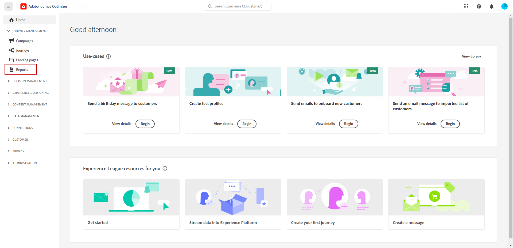
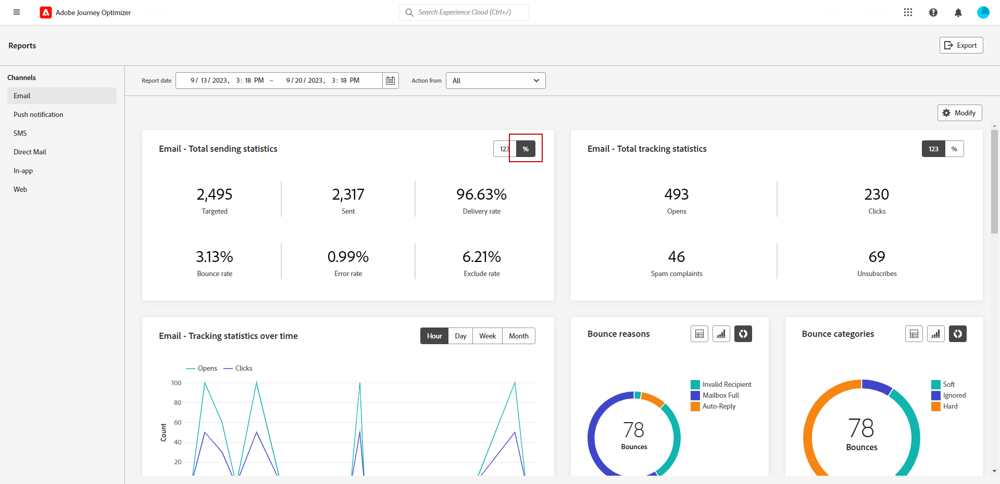

# Introducción a los informes de canal {#channel-report-gs}

>[!AVAILABILITY]
>
>La experiencia actual de creación de informes se eliminará a partir de enero de 2025. Después de esta fecha, la nueva experiencia de creación de informes pasará a ser el estándar. Le recomendamos que se familiarice con las nuevas características y funcionalidades para garantizar una transición sin problemas. [Introducción a la nueva interfaz de informes de Journey Optimizer.](report-gs-cja.md)

Los informes de canal sirven como una potente herramienta que proporciona una visión general completa de las métricas de tráfico y participación en un informe unificado para cada canal, que incluye todas las acciones de todas las campañas y Recorridos. Se divide en diferentes widgets, cada uno de los cuales proporciona una vista específica del rendimiento de la campaña o del recorrido.

Los informes de canal son totalmente personalizables, por lo que puede cambiar el tamaño de los widgets o eliminarlos para crear un tablero que satisfaga sus necesidades específicas. También puede exportar los datos del informe a un archivo PDF o CSV para su posterior análisis.

Obtenga más información acerca de las distintas métricas y widgets disponibles para los informes de canal de <!--[this page](channel-report.md)-->.

## Antes de empezar {#manage-reports-prereq}

Antes de comenzar, compruebe que tiene acceso al menú **[!UICONTROL Informes]**.

Si no puede ver el menú **[!UICONTROL Informes]**, sus derechos de acceso deben ampliarse para incluir el permiso **[!UICONTROL Ver informes de canal]**. Puede ampliar sus propios permisos si tiene acceso a los [permisos](https://experienceleague.adobe.com/docs/experience-platform/access-control/home.html?lang=es){target="_blank"} de Adobe Experience Platform para su organización. Si no es así, póngase en contacto con el administrador de Adobe Journey Optimizer.

+++Obtenga información sobre cómo asignar permisos de informe

Tenga en cuenta que este permiso está incluido en los siguientes **[!UICONTROL roles]** integrados: Administrador de campañas, Aprobador de campañas, Visor de campañas y Administrador de campañas.

Para asignar el permiso correspondiente a su **[!UICONTROL Rol]**:

1. En el producto [!DNL Permissions], vaya al menú **[!UICONTROL Roles]** y seleccione el rol que desea actualizar con el nuevo permiso **[!UICONTROL Ver informes de canal]**.

1. En el panel **[!UICONTROL Rol]**, haga clic en **[!UICONTROL Editar]**.

   

1. Arrastre y suelte el recurso **[!UICONTROL Informes]** para asignar el permiso.

   En el menú desplegable de recursos **[!UICONTROL Informe]**, seleccione el permiso **[!UICONTROL Ver informes de canal]**.

   

1. Haga clic en **[!UICONTROL Guardar]**.

Los usuarios asignados a este **[!UICONTROL Rol]** ahora pueden acceder al menú **[!UICONTROL Informes]**.

+++

## Administrar el tablero de informes {#manage-reports}

Para acceder y administrar los informes de canal, siga estos pasos:

1. Vaya al menú **[!UICONTROL Informes]** dentro de la sección **[!UICONTROL Administración de Recorrido]**.

   

1. En el tablero, elija **Inicio** y **[!UICONTROL Hora de finalización]** para segmentar datos específicos.

1. En el menú desplegable **[!UICONTROL Acción de]**, seleccione si quiere segmentar campañas, Recorridos o ambos.

   

1. Haga clic en **[!UICONTROL Modificar]** para cambiar el tamaño de los widgets o quitarlos y crear un tablero que satisfaga sus necesidades específicas.

   

1. Cuando esté satisfecho con el orden de visualización y el tamaño de los widgets, haga clic en **[!UICONTROL Guardar]**.

1. Según el widget, puede elegir cambiar de una tabla, un gráfico de barras o un anillo.

1. Haga clic en el icono de porcentaje para mostrar los datos como tasas.

   

## Exportación de informes {#export-reports}

Puede exportar fácilmente los distintos informes a los formatos PDF o CSV, lo que le permite compartirlos, manipularlos o imprimirlos. Los pasos detallados para exportar los informes de canal están disponibles en las siguientes pestañas:

>[!BEGINTABS]

>[!TAB Exporte su informe como archivo PDF]

1. En el informe, haga clic en **[!UICONTROL Exportar]** y seleccione **[!UICONTROL archivo PDF]**.

1. En la ventana Imprimir, configure el documento según sea necesario. Tenga en cuenta que las opciones pueden variar según el explorador.

1. Elija imprimir o guardar el informe como PDF.

1. Busque la carpeta en la que desea guardar el archivo, cambie su nombre si es necesario y haga clic en Guardar.

El informe ya está disponible para su visualización o uso compartido en un archivo pdf.

>[!TAB Exporte su informe como archivo CSV]

1. En el informe, haga clic en **[!UICONTROL Exportar]** y seleccione **[!UICONTROL archivo CSV]** para generar un archivo CSV en el nivel de informe general.

1. También puede elegir exportar datos de un widget específico. Haga clic en **[!UICONTROL Exportar datos de widget a CSV]** junto al widget seleccionado.

1. El archivo se descargará automáticamente y se podrá encontrar en los archivos locales.

   Si ha generado el archivo en el nivel de informe, contiene información detallada para cada widget, incluidos su título y datos.

   Si ha generado el archivo en el nivel de widget, proporciona específicamente datos para el widget seleccionado.

>[!ENDTABS]
