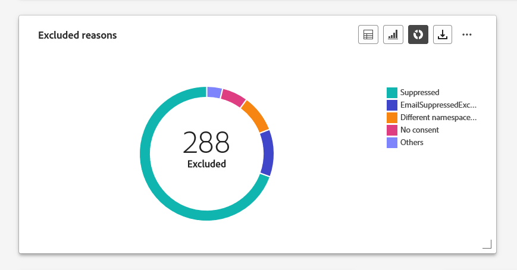
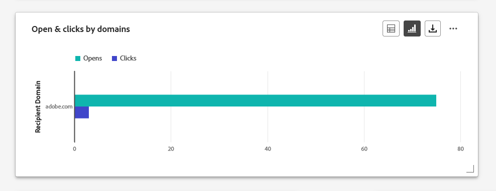
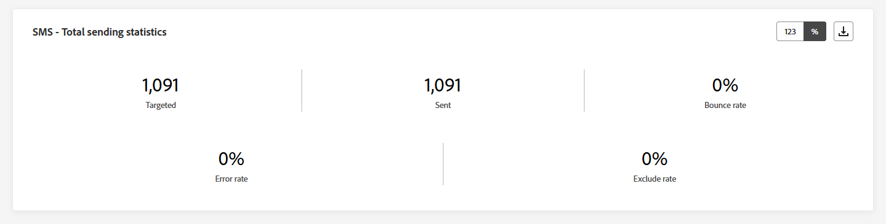
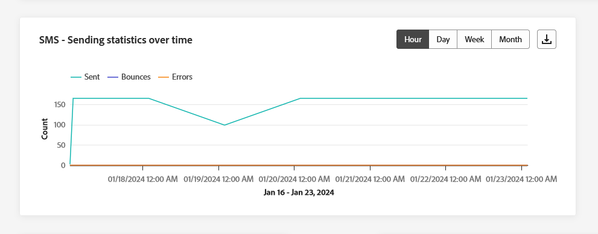
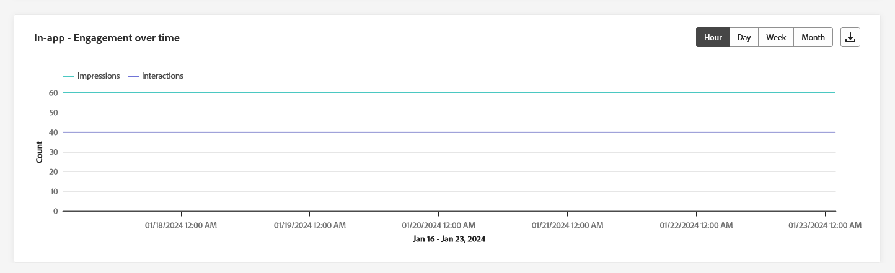
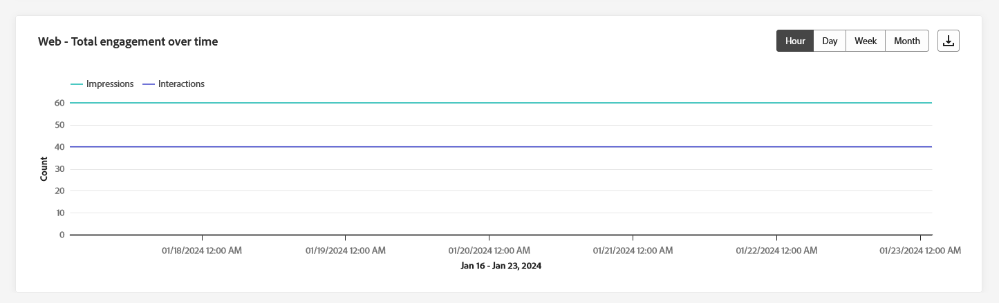

# Informes de canal {#channel-report}

>[!CONTEXTUALHELP]
>id="ajo_channel_level_report"
>title="Informe de nivel de canal"
>abstract="Los informes de canal ofrecen una completa descripción general del tráfico y las métricas de participación en todos los canales. Los informes se dividen en diferentes widgets que detallan la campaña y los recorridos de éxito y error. Cada tablero de informes se puede modificar cambiando el tamaño de los widgets o eliminándolos."

>[!IMPORTANT]
>
> Para acceder al menú **Informe**, debe tener el permiso **[!UICONTROL Ver informes de canal]**. [Más información](channel-report-gs.md#before-starting-manage-reports-prereq)

Los informes de canal proporcionan a los usuarios una visión general completa de las métricas de tráfico y participación a nivel de canal. Las métricas se agregan para presentar valores consolidados para acciones que se originan en el canal elegido, abarcando varias campañas y recorridos.

Puede acceder a los informes de canal navegando al menú **Informes** dentro de la sección **Administración de Recorrido**. Es totalmente personalizable, puede filtrar los datos según la fecha del informe o la acción. [Más información](channel-report-gs.md)

La página del informe se muestra con las siguientes pestañas:

* [Correo electrónico](#email)
* [Notificaciones push](#push)
* [SMS](#sms)
* [En la aplicación](#inapp)
* [Web](#web)
* [Correo directo](#direct-mail)

➡️ [Descubra esta función en vídeo](#channel-report-video)

## Correo electrónico {#email}

En los informes de canal, el menú Correo electrónico detalla la información principal relativa a los correos electrónicos enviados en las campañas y Recorridos. Las métricas se detallan a continuación.

### Correo electrónico: estadísticas de envío totales {#email-total-sending}

>[!CONTEXTUALHELP]
>id="ajo_channel_email_sending_statistics"
>title="Correo electrónico: estadísticas de envío totales"
>abstract="Los indicadores clave de rendimiento (KPI) de Correo electrónico: estadísticas totales de envío totales resumen los datos esenciales sobre los correos electrónicos, como los mensajes dirigidos o entregados."

El widget **[!UICONTROL Estadísticas totales de envío de correo electrónico]** ofrece una descripción general completa del rendimiento del correo electrónico, y muestra indicadores clave de rendimiento (KPI) que resumen datos esenciales sobre los correos electrónicos.

+++ Obtenga más información sobre las métricas Estadísticas de envío totales de correo electrónico

* **[!UICONTROL Destinatarios]**: Número total de correos electrónicos procesados.

* **[!UICONTROL Enviado]**: Número total de envíos.

* **[!UICONTROL Entregado]**: número de correos electrónicos enviados correctamente en relación con el número total de mensajes enviados.

* **[!UICONTROL Tasa de entrega]**: Porcentaje de correos electrónicos enviados correctamente.

* **[!UICONTROL Devoluciones]**: Total de errores acumulados y procesamiento automático de devoluciones en relación con el número total de mensajes enviados.

* **[!UICONTROL Tasa de salida hacia otro sitio]**: Porcentaje de correos electrónicos que se rebotaron en comparación con los enviados.

* **[!UICONTROL Errores]**: Número total de errores que impidieron que se enviara a los perfiles.

* **[!UICONTROL Tasa de errores]**: Porcentaje de errores que impidieron que se enviara en comparación con los mensajes de correo electrónico enviados.

* **[!UICONTROL Excluido]**: número de perfiles que han sido excluidos por Adobe Journey Optimizer.

* **[!UICONTROL Tasa de exclusión]**: porcentaje de perfiles que Adobe Journey Optimizer ha excluido.

+++

### Correo electrónico: estadísticas totales de seguimiento {#email-total-tracking}

>[!CONTEXTUALHELP]
>id="ajo_channel_email_tracking_statistics"
>title="Correo electrónico: estadísticas totales de seguimiento"
>abstract="Los KPI de Correo electrónico: Estadísticas totales de seguimiento, proporcionan datos sobre la actividad de perfil de los correos electrónicos."

El widget **[!UICONTROL Estadísticas totales de seguimiento de correo electrónico]** ofrece una instantánea detallada de la actividad del perfil vinculada a sus correos electrónicos, lo que proporciona información esencial sobre la participación y la eficacia del correo electrónico.

+++ Más información sobre las métricas de las Estadísticas de seguimiento totales de correo electrónico

* **[!UICONTROL Aperturas]**: Número de veces que se abrió el mensaje.

* **[!UICONTROL Tasa de apertura]**: Cantidad total de correos electrónicos abiertos en comparación con la cantidad de correos electrónicos enviados.

* **[!UICONTROL Clics]**: Número de veces que se hizo clic en un contenido de un mensaje.

* **[!UICONTROL Tasa de clics]**: Porcentaje de usuarios que interactuaron con el correo electrónico.

* **[!UICONTROL Quejas por correo no deseado]**: Número de veces que un mensaje se declaró como correo no deseado.

* **[!UICONTROL Tasa de quejas de correo no deseado]**: porcentaje de mensajes declarados como correo no deseado en comparación con el número de correos electrónicos enviados.

* **[!UICONTROL Cancela la suscripción]**: número de clics en el vínculo de suscripción.

* **[!UICONTROL Tasa de cancelación de suscripción]**: porcentaje de cancelación de suscripción comparado con el número de correos electrónicos enviados.

+++

### Correo electrónico: Estadísticas de envío a lo largo del tiempo {#email-sending-statistics-overtime}

>[!CONTEXTUALHELP]
>id="ajo_channel_email_sending_statistics_overtime"
>title="Correo electrónico: Estadísticas de envío a lo largo del tiempo"
>abstract="El gráfico Correo electrónico: Estadísticas de envío a lo largo del tiempo, presenta datos sobre los correos electrónicos enviados, desglosados por hora, día, semana o mes."

El gráfico **[!UICONTROL Correo electrónico: estadísticas de envío a lo largo del tiempo]** ofrece una representación dinámica que muestra un análisis de su actividad de correo electrónico. Esta representación gráfica proporciona un desglose completo de los correos electrónicos enviados, lo que le permite observar tendencias y patrones en una escala horaria, diaria, semanal o mensual.

+++ Más información sobre el Correo electrónico: Envío de estadísticas con métricas temporales

* **[!UICONTROL Enviado]**: Número total de envíos.

* **[!UICONTROL Entregado]**: Número de correos electrónicos enviados correctamente, en relación con el número total de correos electrónicos enviados.

* **[!UICONTROL Devoluciones]**: Total de errores acumulados y procesamiento automático de devoluciones en relación con el número total de correos electrónicos enviados.

* **[!UICONTROL Errores]**: Número total de errores que impidieron que se enviara a los perfiles.

+++

### Correo electrónico: Estadísticas de seguimiento a lo largo del tiempo {#email-tracking-statistics-overtime}

>[!CONTEXTUALHELP]
>id="ajo_channel_email_tracking_statistics_overtime"
>title="Correo electrónico: Estadísticas de seguimiento a lo largo del tiempo"
>abstract="El gráfico Correo electrónico: Estadísticas de seguimiento a lo largo del tiempo, proporciona datos sobre la actividad del perfil de los correos electrónicos, desglosados por hora, día, semana o mes."

El gráfico **[!UICONTROL Correo electrónico: estadísticas de seguimiento a lo largo del tiempo]** proporciona una descripción detallada de la actividad del perfil relacionada con sus correos electrónicos. Esta representación gráfica desglosa los datos por hora, día, semana o mes, lo que ofrece una valiosa perspectiva de cómo evoluciona la participación de los destinatarios en diferentes intervalos de tiempo.

+++ Más información sobre el Correo electrónico: estadísticas de seguimiento a lo largo del tiempo

* **[!UICONTROL Aperturas]**: Número de veces que se abrió el mensaje.

* **[!UICONTROL Clics]**: Número de veces que se hizo clic en un contenido de un mensaje.

+++

### Correo electrónico: categorías y motivos de rechazo {#bounce-categories}

>[!CONTEXTUALHELP]
>id="ajo_channel_email_bounce_categories"
>title="Categorías de rechazo"
>abstract="Los gráficos y la tabla Categorías de rechazo proporcionan datos sobre errores temporales y permanentes."

>[!CONTEXTUALHELP]
>id="ajo_channel_email_bounce_reasons"
>title="Motivos de rechazo"
>abstract="Los gráficos y la tabla Motivos de rechazos contienen los datos disponibles relacionados con los mensajes rechazados."

Los widgets de **[!UICONTROL Categorías de rechazo]** y **[!UICONTROL Motivos de rechazo]** encapsulan los datos asociados con los mensajes rechazados, proporcionando una visión general de las diversas categorías y motivos específicos detrás de los rechazos de mensajes

Para obtener más información sobre las devoluciones, consulte la página [Lista de supresión](../reports/suppression-list.md).

+++ Más información sobre las Métricas de categorías de rechazo

* **[!UICONTROL Rechazo grave]**: El número total de errores permanentes, como una dirección de correo electrónico incorrecta. Esto implica un mensaje de error que indica explícitamente que la dirección no es válida, como Usuario desconocido.

* **[!UICONTROL Devolución suave]**: El número total de errores temporales, como una bandeja de entrada completa.

* **[!UICONTROL Omitido]**: El número total de mensajes temporales, como Fuera de la oficina, o un error técnico, por ejemplo, si el tipo de remitente es administrador de correo.

+++

### Motivos de error {#error-reasons}

>[!CONTEXTUALHELP]
>id="ajo_channel_email_error_reasons"
>title="Motivos de error"
>abstract="Los gráficos y la tabla Motivos del error le permiten identificar los errores específicos que se produjeron durante el proceso de envío."

Los gráficos y la tabla **[!UICONTROL Motivos del error]** le permiten identificar los errores precisos que se produjeron durante el proceso de envío, lo que facilita una comprensión clara de los problemas encontrados.

### Motivos excluidos {#excluded-reasons}

>[!CONTEXTUALHELP]
>id="ajo_channel_email_excluded_reasons"
>title="Motivos excluidos"
>abstract="Los gráficos y la tabla Motivos excluidos ilustran los distintos factores que llevaron a que los perfiles de usuario, excluidos del público destinatario, no recibieran el mensaje."

Los gráficos y la tabla de **[!UICONTROL Motivos de exclusión]** presentan una vista completa de los diferentes factores que tuvieron como resultado la exclusión de perfiles de usuario de la audiencia de destino, lo que hizo que no se recibiera el mensaje.

Consulte [esta página](exclusion-list.md) para obtener una lista completa de motivos de exclusión.

### Enviados y entregados por dominios {#sent-delivered-domains}

>[!CONTEXTUALHELP]
>id="ajo_channel_email_sending_delivered_domains"
>title="Enviados y entregados por dominios"
>abstract="El gráfico y la tabla Enviado y entregado por dominios representan el desglose a nivel de dominio de cada dato importante de envío de correo electrónico."

La tabla y el gráfico de **[!UICONTROL Enviados y entregados por dominios]** proporcionan un desglose detallado de los envíos de correo electrónico en el nivel de dominio, lo que ofrece una perspectiva completa del rendimiento de sus correos electrónicos.

+++ Más información sobre las Métricas de Enviado y entregado por dominios

* **[!UICONTROL Enviado]**: Número total de envíos del correo electrónico.

* **[!UICONTROL Entregado]**: número de mensajes enviados correctamente en relación con el número total de mensajes enviados.

+++

### Rechazos y errores por dominios {#bounces-errors-domains}

>[!CONTEXTUALHELP]
>id="ajo_channel_email_bounces_errors_domains"
>title="Rechazos y errores por dominios"
>abstract="El gráfico y la tabla Rechazos y errores por dominios representan el desglose a nivel de dominio de errores específicos que se produjeron durante el proceso de envío."

El gráfico y la tabla **[!UICONTROL Devoluciones y errores por dominios]** ofrecen un desglose a nivel de dominio de los errores específicos encontrados durante el proceso de envío, lo que proporciona un análisis detallado de los problemas que se produjeron.

+++ Más información sobre las Métricas Devoluciones y errores por dominios

* **[!UICONTROL Devoluciones]**: Total de errores acumulados durante el proceso de envío y el procesamiento automático de devoluciones en relación con el número total de mensajes enviados.

* **[!UICONTROL Errores]**: Número total de errores que se produjeron durante el proceso de envío para evitar que se enviara a los perfiles.

+++

### Aperturas y clics por dominios {#open-clicks-domains}

>[!CONTEXTUALHELP]
>id="ajo_channel_email_open_clicks_domains"
>title="Aperturas y clics por dominios"
>abstract="El gráfico y la tabla Aperturas y clics por dominios representan el desglose a nivel de dominio de la participación de los visitantes con el correo electrónico."

El gráfico y la tabla **[!UICONTROL Abrir y clics por dominios]** muestran un desglose a nivel de dominio de la participación de los visitantes con el correo electrónico, lo que proporciona información valiosa sobre cómo los distintos dominios interactúan con el contenido.

+++ Más información sobre las métricas Abrir y clics por dominios

* **[!UICONTROL Aperturas]**: Número de veces que se abrió el correo electrónico.

* **[!UICONTROL Clics]**: Número de veces que se hizo clic en un contenido en un correo electrónico.

+++

### Motivos de rechazo por dominio {#bounce-reasons-domains}

>[!CONTEXTUALHELP]
>id="ajo_channel_email_bounce_reasons_domains"
>title="Motivos de rechazo por dominio"
>abstract="El gráfico y la tabla Motivos de rechazo por dominio por dominios representan el desglose de datos a nivel de dominio sobre errores temporales y permanentes."

El gráfico y la tabla de **[!UICONTROL motivos de rechazo por dominio]** ofrecen un desglose de datos a nivel de dominio sobre los errores temporales y permanentes, lo que proporciona información detallada sobre los motivos detrás de los mensajes rechazados.

Para obtener más información sobre las devoluciones, consulte la página [Lista de supresión](../reports/suppression-list.md).

## Notificación push {#push}

En los informes de canal, el menú **Notificaciones push** detalla la información principal relativa a las notificaciones push enviadas en las campañas y Recorridos. Las métricas se detallan a continuación.

### Notificaciones push: estadísticas de envío totales {#push-total-sending}

>[!CONTEXTUALHELP]
>id="ajo_channel_push_sending_statistics"
>title="Notificaciones push: estadísticas de envío totales"
>abstract="Los KPI Notificaciones push: estadísticas de envío totales resumen los datos esenciales sobre las notificaciones push, como las dirigidas o las enviadas."

Las **[!UICONTROL notificaciones push - estadísticas de envío totales]** KPI sirven como un resumen completo, encapsulando datos esenciales relacionados con sus notificaciones push. Estas métricas incluyen perspectivas detalladas sobre la audiencia objetivo y el estado de entrega real, lo que proporciona una vista completa de la eficacia y el alcance de las notificaciones push.

+++ Más información sobre las notificaciones push: métricas de estadísticas de envío total

* **[!UICONTROL Objetivos]**: Número total de notificaciones push procesadas.

* **[!UICONTROL Enviado]**: Número total de notificaciones push enviadas.

* **[!UICONTROL Entregado]**: Número de notificaciones push enviadas correctamente, en relación con el número total de notificaciones push enviadas.

* **[!UICONTROL Tasa de entrega]**: porcentaje de notificaciones push enviadas correctamente.

* **[!UICONTROL Devoluciones]**: Total de errores acumulados y procesamiento automático de devoluciones en relación con el número total de mensajes enviados.

* **[!UICONTROL Tasa de devoluciones]**: porcentaje de notificaciones push que rebotaron en comparación con las notificaciones push enviadas.

* **[!UICONTROL Errores]**: Número total de errores que impidieron que se enviara a los perfiles.

* **[!UICONTROL Tasa de errores]**: Porcentaje de errores que impidieron que se enviara en comparación con las notificaciones push enviadas.

* **[!UICONTROL Excluido]**: número de perfiles que han sido excluidos por Adobe Journey Optimizer.

* **[!UICONTROL Tasa de exclusión]**: porcentaje de perfiles que Adobe Journey Optimizer ha excluido.

+++

### Notificación push: estadísticas de seguimiento totales {#push-total-tracking}

>[!CONTEXTUALHELP]
>id="ajo_channel_push_tracking_statistics"
>title="Notificación push: estadísticas de seguimiento totales"
>abstract="Notificación push: las estadísticas de seguimiento totales proporcionan datos sobre la actividad del perfil para las notificaciones push."

El widget **[!UICONTROL Notificación push: estadísticas totales de seguimiento]** ofrece una instantánea detallada de la actividad del perfil vinculada a las notificaciones push, lo que proporciona información esencial sobre la participación y la eficacia de las notificaciones push.

+++ Más información sobre las notificaciones push: métricas de estadísticas de seguimiento totales

* **[!UICONTROL Aperturas]**: Número de veces que se abrió una notificación push.

* **[!UICONTROL Tasa de apertura]**: Porcentaje de notificaciones push abiertas.

* **[!UICONTROL Acciones]**: Número total de acciones en la notificación de inserción entregada, por ejemplo, clic en el botón o despido.

* **[!UICONTROL Tasa de acción]**: porcentaje de acciones en la notificación push entregada en comparación con las notificaciones push enviadas.

+++

### Notificaciones push: estadísticas de envío a lo largo del tiempo {#push-sending-overtime}

>[!CONTEXTUALHELP]
>id="ajo_channel_push_sending_statistics_overtime"
>title="Notificaciones push: estadísticas de envío a lo largo del tiempo"
>abstract="El gráfico de estadísticas de Envío de notificaciones push a lo largo del tiempo presenta datos sobre las notificaciones push enviadas, desglosados por hora, día, semana o mes."

El gráfico **[!UICONTROL Notificaciones push: estadísticas de envío a lo largo del tiempo]** ofrece una representación dinámica que muestra un análisis de su actividad de notificaciones push. Esta representación gráfica proporciona un desglose completo de las notificaciones push enviadas, lo que le permite observar tendencias y patrones en una escala horaria, diaria, semanal o mensual.

+++ Más información sobre las Notificaciones push: estadísticas de envío a lo largo del tiempo

* **[!UICONTROL Enviado]**: Número total de notificaciones push enviadas.

* **[!UICONTROL Entregado]**: Número de notificaciones push enviadas correctamente, en relación con el número total de notificaciones push enviadas.

* **[!UICONTROL Devoluciones]**: Total de errores acumulados y procesamiento automático de devoluciones en relación con el número total de mensajes enviados.

* **[!UICONTROL Errores]**: Número total de errores que impidieron que se enviara a los perfiles.

+++

### Notificaciones push: estadísticas de seguimiento a lo largo del tiempo {#push-tracking-overtime}

>[!CONTEXTUALHELP]
>id="ajo_channel_push_tracking_statistics_overtime"
>title="Notificaciones push: estadísticas de seguimiento a lo largo del tiempo"
>abstract="El gráfico Notificaciones push: estadísticas de seguimiento a lo largo del tiempo proporciona datos sobre la actividad del perfil para las notificaciones push, desglosados por hora, día, semana o mes."

El gráfico **[!UICONTROL Notificaciones push: estadísticas de seguimiento a lo largo del tiempo]** proporciona una descripción detallada de la actividad del perfil relacionada con sus notificaciones push. Esta representación gráfica desglosa los datos por hora, día, semana o mes, lo que ofrece una valiosa perspectiva de cómo evoluciona la participación de los destinatarios en diferentes intervalos de tiempo.

+++ Más información sobre las Notificaciones push: estadísticas de seguimiento a lo largo del tiempo

* **[!UICONTROL Aperturas]**: Número de veces que se abrió la notificación push.

* **[!UICONTROL Acciones]**: Número total de acciones en la notificación de inserción entregada, por ejemplo, clic en el botón o despido.

+++

### Notificaciones push: motivos de la exclusión {#push-excluded-reasons}

>[!CONTEXTUALHELP]
>id="ajo_channel_push_excluded_reasons"
>title="Motivos excluidos"
>abstract="Los gráficos y la tabla Motivos excluidos ilustran los distintos factores que llevaron a que los perfiles de usuario, excluidos del público destinatario, no recibieran el mensaje."

El gráfico y la tabla **[!UICONTROL Razones de exclusión]** muestran las diferentes razones que impidieron que los perfiles de usuario, excluidos de los perfiles de destino, recibieran sus notificaciones push.

Consulte [esta página](exclusion-list.md) para obtener una lista completa de motivos de exclusión.

### Notificaciones push: motivos del error {#push-error-reasons}

>[!CONTEXTUALHELP]
>id="ajo_channel_push_error_reasons"
>title="Motivos de error"
>abstract="Los gráficos y la tabla Motivos del error le permiten identificar los errores específicos que se produjeron durante el proceso de envío."

Los gráficos y la tabla de **[!UICONTROL Motivos del error]** le permiten identificar los errores específicos que se produjeron durante el proceso de envío de las notificaciones push, lo que ofrece una perspectiva detallada de los problemas que se detectaron durante el proceso.

### Notificaciones push: seguimiento por plataforma {#push-tracking-platform}

>[!CONTEXTUALHELP]
>id="ajo_channel_push_tracking_statistics_platform"
>title="Estadísticas de seguimiento por plataforma"
>abstract="Las estadísticas de seguimiento por gráfico y tabla de plataforma proporcionan datos sobre la actividad del perfil para las notificaciones push según el sistema operativo del perfil."

Los gráficos y tablas de **[!UICONTROL Notificaciones push - Seguimiento por plataforma]** detallan la actividad de los destinatarios de las notificaciones push en función del sistema operativo del perfil.

### Notificaciones push: envío por plataforma {#push-sending-platform}

>[!CONTEXTUALHELP]
>id="ajo_channel_push_sending_statistics_platform"
>title="Estadísticas de envío por plataforma"
>abstract="La tabla y el gráfico Enviar estadísticas por plataforma presentan los datos sobre las notificaciones push enviadas."

El gráfico y las tablas de **[!UICONTROL Notificaciones push - Envío por plataforma]** proporcionan un desglose completo, en el que se detalla el éxito de las notificaciones push en relación con los sistemas operativos de sus perfiles. Este análisis detallado ofrece información valiosa sobre la eficacia de las notificaciones push en diferentes plataformas.

## SMS {#sms}

Desde tus informes de **Channel**, el menú SMS detalla la información principal relacionada con los SMS enviados en tus campañas y Recorridos. Las métricas se detallan a continuación.

### SMS: estadísticas de envío totales {#sms-sending-statistics}

>[!CONTEXTUALHELP]
>id="ajo_channel_sms_sending_statistics"
>title="SMS: estadísticas de envío totales"
>abstract="Los KPI SMS: estadísticas de envío totales resumen los datos esenciales sobre los mensajes SMS, como los mensajes segmentados o enviados."

Los KPI **[!UICONTROL SMS - estadísticas de envío totales]** sirven como un resumen completo, encapsulando datos esenciales relacionados con su SMS. Estas métricas incluyen perspectivas detalladas sobre la audiencia objetivo y el estado de entrega real, lo que proporciona una vista completa de la eficacia y el alcance de sus mensajes SMS.

+++ Más información sobre las notificaciones push: métricas de estadísticas de envío total

* **[!UICONTROL Segmentado]**: número de perfiles de usuario que cumplen los requisitos como perfiles de destinatario para el canal SMS.

* **[!UICONTROL Enviado]**: Número total de mensajes SMS enviados.

* **[!UICONTROL Entregado]**: número de mensajes SMS enviados correctamente en relación con el número total de mensajes SMS enviados.

* **[!UICONTROL Tasa de entrega]**: porcentaje de mensajes SMS enviados correctamente.

* **[!UICONTROL Devoluciones]**: Total de errores acumulados y procesamiento automático de devoluciones en relación con el número total de mensajes SMS enviados.

* **[!UICONTROL Tasa de salida hacia otro sitio]**: Porcentaje de mensajes SMS que se rebotaron en comparación con los enviados por SMS.

* **[!UICONTROL Errores]**: Número total de errores que impidieron que se enviara a los perfiles.

* **[!UICONTROL Tasa de errores]**: Porcentaje de errores que impidieron que se enviara en comparación con los mensajes SMS enviados.

* **[!UICONTROL Excluido]**: número de perfiles de usuario, excluidos de los perfiles de destino, que no recibieron el mensaje.

* **[!UICONTROL Tasa de exclusión]**: porcentaje de perfiles que Adobe Journey Optimizer ha excluido.

+++

### SMS: estadísticas de seguimiento totales {#sms-tracking-statistics}

>[!CONTEXTUALHELP]
>id="ajo_channel_sms_tracking_statistics"
>title="SMS: estadísticas de seguimiento totales"
>abstract="Las estadísticas de seguimiento totales de SMS proporcionan datos sobre la actividad del perfil para los mensajes SMS."

El widget **[!UICONTROL SMS - Estadísticas totales de seguimiento]** proporciona una descripción detallada de la información clave relacionada con la participación de los visitantes con las direcciones URL, lo que ofrece perspectivas sobre la eficacia de los mensajes SMS:

* **[!UICONTROL Clics]**: Número de veces que se hizo clic en un contenido en el mensaje SMS.

### SMS: estadísticas de envío a lo largo del tiempo {#sms-sending-statistics-overtime}

>[!CONTEXTUALHELP]
>id="ajo_channel_sms_sending_statistics_overtime"
>title="SMS: estadísticas de envío a lo largo del tiempo"
>abstract="El gráfico SMS: estadísticas de envío a lo largo del tiempo presenta datos sobre los mensajes SMS enviados, desglosados por hora, día, semana o mes."

El gráfico **[!UICONTROL SMS - estadísticas de envío a lo largo del tiempo]** ofrece una vista completa de los mensajes SMS enviados, que proporciona datos desglosados por hora, día, semana o mes. Esta representación gráfica le permite rastrear y analizar las tendencias en su actividad de mensajería SMS en diferentes intervalos de tiempo.

+++ Más información sobre los SMS: estadísticas de envío a lo largo del tiempo

* **[!UICONTROL Enviado]**: Número total de mensajes SMS enviados.

* **[!UICONTROL Devoluciones]**: Total de errores acumulados y procesamiento automático de devoluciones en relación con el número total de mensajes SMS enviados.

* **[!UICONTROL Errores]**: Número total de errores que impidieron que se enviara a los perfiles.

+++

### SMS: Estadísticas de seguimiento a lo largo del tiempo {#sms-tracking-statistics-overtime}

>[!CONTEXTUALHELP]
>id="ajo_channel_sms_tracking_statistics_overtime"
>title="SMS: Estadísticas de seguimiento a lo largo del tiempo"
>abstract="El gráfico SMS: estadísticas de seguimiento a lo largo del tiempo proporciona datos sobre la actividad del perfil de los mensajes SMS, desglosados por hora, día, semana o mes."

El gráfico **[!UICONTROL SMS - Estadísticas de seguimiento a lo largo del tiempo]** proporciona datos sobre la actividad del perfil relacionada con sus mensajes SMS, y ofrece un desglose detallado por hora, día, semana o mes. Esta representación gráfica le permite analizar y comprender los patrones de participación del usuario en diferentes intervalos de tiempo.

* **[!UICONTROL Clics]**: Número de veces que se hizo clic en un contenido en el mensaje SMS.

### Motivos excluidos {#sms-excluded-reasons}

>[!CONTEXTUALHELP]
>id="ajo_channel_sms_excluded_reasons"
>title="Motivos excluidos"
>abstract="Los gráficos y la tabla Motivos excluidos ilustran los distintos factores que llevaron a que los perfiles de usuario, excluidos del público destinatario, no recibieran el mensaje."

Los gráficos y la tabla **[!UICONTROL Excluye Reasons]** muestran visualmente los diversos factores que llevaron a la exclusión de perfiles de usuarios de la audiencia de destino, lo que les impidió recibir sus mensajes SMS.

Consulte [esta página](exclusion-list.md) para obtener una lista completa de motivos de exclusión.

### Motivos de rechazo {#sms-bounce-reasons}

>[!CONTEXTUALHELP]
>id="ajo_channel_sms_bounce_reasons"
>title="Motivos de rechazo"
>abstract="Los gráficos y la tabla Motivos de rechazos contienen los datos disponibles relacionados con los mensajes rechazados."

Los gráficos y la tabla de **[!UICONTROL Motivos de rechazos]** proporcionan una visión general completa de los datos relacionados con los mensajes SMS rechazados, lo que proporciona información valiosa sobre los motivos específicos detrás de los rechazos de mensajes SMS.

### Motivos de error {#sms-error-reasons}

>[!CONTEXTUALHELP]
>id="ajo_channel_sms_error_reasons"
>title="Motivos de error"
>abstract="Los gráficos y la tabla Motivos del error le permiten identificar los errores específicos que se produjeron durante el proceso de envío."

Los gráficos y la tabla **[!UICONTROL Motivos del error]** le permiten identificar los errores específicos que se produjeron durante el proceso de envío de sus mensajes SMS, lo que facilita un análisis exhaustivo de cualquier problema que se haya encontrado.

## Correo directo {#direct-mail}

Desde tus informes de **Channel**, el menú de **Direct mail** detalla la información principal relativa a los mensajes de Direct mail enviados en tus **Campañas** y **Recorridos**. Las métricas se detallan a continuación.

### Correo directo: estadísticas de envío totales {#direct-mail-total-sending}

>[!CONTEXTUALHELP]
>id="ajo_channel_direct_sending_statistics"
>title="Correo directo: estadísticas de envío totales"
>abstract="Los KPI Correo directo: estadísticas de envío totales resume los datos esenciales sobre sus mensajes de correo directo, como los mensajes segmentados o enviados."

El widget **[!UICONTROL Correo directo: estadísticas de envío totales]** ofrece una descripción general completa del rendimiento de los mensajes de correo postal y muestra indicadores clave de rendimiento (KPI) que resumen datos esenciales sobre los mensajes de correo postal.

+++ Más información sobre el Correo directo: métricas de estadísticas de envío total

* **[!UICONTROL Segmentación]**: número de perfiles de usuario que cumplen los requisitos para ser destinatarios de sus mensajes de correo postal.

* **[!UICONTROL Enviado]**: Número total de envíos.

* **[!UICONTROL Errores]**: Número total de errores que impidieron que se enviara a los perfiles.

* **[!UICONTROL Tasa de errores]**: Porcentaje de errores que impidieron que se enviara en comparación con las notificaciones push enviadas.

* **[!UICONTROL Excluido]**: número de perfiles de usuario, excluidos de los perfiles de destino, que no recibieron el mensaje.

* **[!UICONTROL Tasa de exclusión]**: porcentaje de perfiles que Adobe Journey Optimizer ha excluido.

+++

### Motivos excluidos {#direct-mail-excluded-reasons}

>[!CONTEXTUALHELP]
>id="ajo_channel_direct_excluded_reasons"
>title="Motivos excluidos"
>abstract="Los gráficos y la tabla Motivos excluidos ilustran los distintos factores que llevaron a que los perfiles de usuario, excluidos del público destinatario, no recibieran el mensaje."

Los gráficos y la tabla de **[!UICONTROL Correo directo: razones de exclusión]** ilustran visualmente los diversos factores que resultaron en la exclusión de perfiles de usuarios de la audiencia de destino, lo que les impide recibir sus mensajes de correo postal.

Consulte [esta página](exclusion-list.md) para obtener una lista completa de motivos de exclusión.

### Motivos de error {#direct-mail-error-reasons}

>[!CONTEXTUALHELP]
>id="ajo_channel_direct_error_reasons"
>title="Motivos de error"
>abstract="Los gráficos y la tabla Motivos del error le permiten identificar los errores específicos que se produjeron durante el proceso de envío."

**[!UICONTROL Correo directo: razones de error]** proporcionan los medios para identificar errores específicos que se produjeron durante el proceso de envío de los mensajes de correo postal, lo que permite un análisis detallado de cualquier problema que se encuentre.

## En la aplicación {#in-app}

En los informes de canal, el menú en la aplicación detalla la información principal relativa a los mensajes en la aplicación enviados en las campañas y Recorridos. Las métricas se detallan a continuación.

### Participación total en la aplicación {#inapp-total-engagement}

>[!CONTEXTUALHELP]
>id="ajo_channel_inapp_engagement"
>title="En la aplicación: participación total"
>abstract="Los KPI En la aplicación: participación total proporcionan información completa sobre la participación de los visitantes en los mensajes en la aplicación, incluidas métricas como Impresiones e Interacciones."

Los KPI de **[!UICONTROL participación total en la aplicación]** ofrecen una perspectiva completa de la participación de los visitantes con los mensajes en la aplicación, que incluye métricas clave como **Impresiones** e **Interacciones**.

+++ Obtenga más información sobre las métricas de participación total en la aplicación.

* **[!UICONTROL Impresiones]**: Número total de mensajes en la aplicación enviados a todos los usuarios.

* **[!UICONTROL Interacciones]**: Número total de interacciones con su mensaje en la aplicación. Esto incluye cualquier acción realizada por los usuarios, como clics, rechazos o cualquier otra interacción.

+++

### Tiempo extra de participación en la aplicación {#inapp-engagement-overtime}

>[!CONTEXTUALHELP]
>id="ajo_channel_inapp_engagement_overtime"
>title="En la aplicación: tiempo extra de participación"
>abstract="El gráfico En la aplicación: tiempo extra de participación rastrea las impresiones e interacciones en la aplicación, y proporciona desgloses por hora, día, semanal y mensual."

El gráfico **[!UICONTROL Tiempo extra de participación en la aplicación]** muestra la evolución de las impresiones e interacciones en la aplicación durante el período correspondiente al rastrear cualquier impresión, rechazo o interacción.

+++ Más información sobre las Métricas de horas extra de participación en la aplicación

* **[!UICONTROL Impresiones]**: Número total de mensajes en la aplicación enviados a todos los usuarios.

* **[!UICONTROL Interacciones]**: Número total de interacciones con su mensaje en la aplicación. Esto incluye cualquier acción realizada por los usuarios, como clics, rechazos o cualquier otra interacción.

+++

## Web {#web}

A partir de sus informes de **Channel**, el menú web detalla la información principal relativa a las páginas web incluidas en sus **Campañas** y **Recorridos**. Las métricas se detallan a continuación.

### Web: participación total {#web-engagement-total}

>[!CONTEXTUALHELP]
>id="ajo_channel_web_engagement"
>title="Web: participación total"
>abstract="Los KPI Web: participación total proporcionan información completa sobre la participación de los visitantes en sus páginas web, incluidas métricas como Impresiones e Interacciones."

Los KPI de **[!UICONTROL participación total en la web]** ofrecen una amplia perspectiva de la participación de los visitantes en sus páginas web, e incluyen métricas clave como Impresiones e Interacciones.

+++ Obtenga más información sobre las métricas de participación totales en web

* **[!UICONTROL Impresiones]**: Número total de experiencias web entregadas a todos los usuarios.

* **[!UICONTROL Interacciones]**: Número total de interacciones con su página web. Esto incluye cualquier acción realizada por los usuarios, como clics o cualquier otra interacción.

+++

### Web: Tiempo extra de participación total {#web-engagement-total-overtime}

>[!CONTEXTUALHELP]
>id="ajo_channel_web_engagement_overtime"
>title="Web: Tiempo extra de participación total"
>abstract="El gráfico Web: tiempo extra de participación rastrea las impresiones e interacciones de las páginas web, y proporciona desgloses por hora, día, semana y mes."

El gráfico **[!UICONTROL Tiempo extra de participación en la web]** supervisa las **Impresiones** e **Interacciones** de sus páginas web, y ofrece desgloses detallados por hora, día, semana y mes.

+++ Más información sobre las métricas de horas extra de participación en web

* **[!UICONTROL Impresiones]**: Número total de experiencias web entregadas a todos los usuarios.

* **[!UICONTROL Interacciones]**: Número total de interacciones con su página web. Esto incluye cualquier acción realizada por los usuarios, como clics o cualquier otra interacción.

+++

## Informe de canal (vídeo) {#channel-report-video}

Obtenga información sobre cómo acceder, navegar y exportar informes en el nivel de canal en este vídeo

>[!VIDEO](https://video.tv.adobe.com/v/3424537?quality=12)
