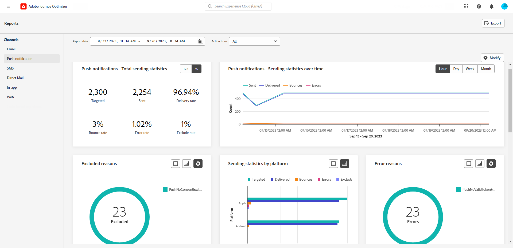
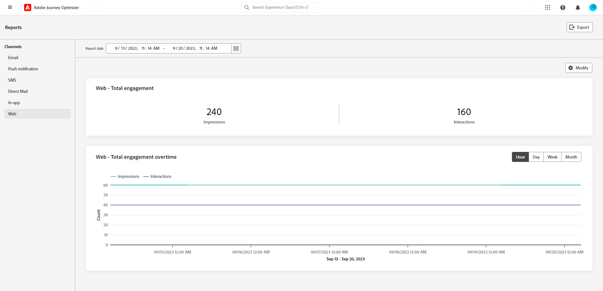

# Informes de canal {#channel-report}

>[!CONTEXTUALHELP]
>id="ajo_channel_level_report"
>title="Informe de nivel de canal"
>abstract="Los informes de canal ofrecen una completa descripción general del tráfico y las métricas de participación en todos los canales. Los informes se dividen en diferentes widgets que detallan la campaña y los recorridos de éxito y error. Cada tablero de informes se puede modificar cambiando el tamaño de los widgets o eliminándolos."

>[!IMPORTANT]
>
> Para acceder al menú **Informe**, debe tener el permiso **[!UICONTROL Ver informes de canal.]** [Más información](channel-report-gs.md#before-starting-manage-reports-prereq)

Los informes de canal proporcionan a los usuarios una visión general completa de las métricas de tráfico y participación a nivel de canal. Las métricas se agregan para presentar valores consolidados para acciones que se originan en el canal elegido, abarcando varias campañas y recorridos.

Puede acceder a los informes de canal navegando hasta el **Informes** menú dentro de **Administración de recorrido** sección. Es totalmente personalizable, puede filtrar los datos según la fecha del informe o la acción. [Más información](channel-report-gs.md)

La página del informe se muestra con las siguientes pestañas:

* [Correo electrónico](#email)
* [Notificaciones push](#push)
* [SMS](#sms)
* [En la aplicación](#inapp)
* [Web](#web)
* [Correo directo](#direct-mail)

➡️ [Descubra esta función en vídeo](#channel-report-video)

## Correo electrónico {#email}

>[!CONTEXTUALHELP]
>id="ajo_channel_email_sending_statistics"
>title="Correo electrónico: estadísticas de envío totales"
>abstract="Los KPI de las estadísticas de envío por correo electrónico - Total resumen los datos esenciales sobre las notificaciones push, como los mensajes dirigidos o enviados."

>[!CONTEXTUALHELP]
>id="ajo_channel_email_tracking_statistics"
>title="Correo electrónico: estadísticas totales de seguimiento"
>abstract="Los KPI de las estadísticas de seguimiento Correo electrónico - Total proporcionan datos sobre la actividad de perfil de los correos electrónicos."

>[!CONTEXTUALHELP]
>id="ajo_channel_email_sending_statistics_overtime"
>title="Correo electrónico: estadísticas de envío a lo largo del tiempo"
>abstract="El gráfico Estadísticas de envío por correo electrónico a lo largo del tiempo presenta datos sobre los correos electrónicos enviados, desglosados por hora, día, semana o mes."

>[!CONTEXTUALHELP]
>id="ajo_channel_email_tracking_statistics_overtime"
>title="Correo electrónico: estadísticas de seguimiento a lo largo del tiempo"
>abstract="El gráfico de estadísticas de seguimiento de correo electrónico a lo largo del tiempo proporciona datos sobre la actividad del perfil de los correos electrónicos, desglosados por hora, día, semana o mes."

>[!CONTEXTUALHELP]
>id="ajo_channel_email_bounce_categories"
>title="Categorías de rechazo"
>abstract="Los gráficos y la tabla Categorías de rechazo proporcionan datos sobre errores temporales y permanentes."

>[!CONTEXTUALHELP]
>id="ajo_channel_email_bounce_reasons"
>title="Motivos del rechazo"
>abstract="Los gráficos y la tabla de motivos de rechazos contienen los datos disponibles relacionados con los mensajes rechazados."

>[!CONTEXTUALHELP]
>id="ajo_channel_email_error_reasons"
>title="Motivos del error"
>abstract="Los gráficos y la tabla Motivos del error permiten identificar los errores específicos que se produjeron durante el proceso de envío."

>[!CONTEXTUALHELP]
>id="ajo_channel_email_excluded_reasons"
>title="Razones de exclusión"
>abstract="Los gráficos y la tabla de motivos de exclusión ilustran los distintos factores que llevaron a que los perfiles de usuario, excluidos de la audiencia de destino, no recibieran el mensaje."

>[!CONTEXTUALHELP]
>id="ajo_channel_email_sending_delivered_domains"
>title="Enviados y entregados por dominios"
>abstract="El gráfico y la tabla Enviado y entregado por dominios representan el desglose a nivel de dominio de cada dato importante de envío de correo electrónico."

>[!CONTEXTUALHELP]
>id="ajo_channel_email_bounces_errors_domains"
>title="Devoluciones y errores por dominios"
>abstract="El gráfico y la tabla Devoluciones y errores por dominios representan el desglose a nivel de dominio de errores específicos que se produjeron durante el proceso de envío."

>[!CONTEXTUALHELP]
>id="ajo_channel_email_open_clicks_domains"
>title="Abrir y hacer clic por dominios"
>abstract="El gráfico y la tabla Abrir y hacer clic por dominios representan el desglose a nivel de dominio de la participación de los visitantes con el correo electrónico."

>[!CONTEXTUALHELP]
>id="ajo_channel_email_bounce_reasons_domains"
>title="Razones de rechazo por dominio"
>abstract="El gráfico y la tabla de motivos de rechazo por dominio por dominios representan el desglose de datos a nivel de dominio sobre errores temporales y permanentes."

En los informes de canal, el menú Correo electrónico detalla la información principal relativa a los correos electrónicos enviados en las campañas y Recorridos. Las métricas se detallan a continuación.

+++ Obtenga más información sobre las distintas métricas y widgets disponibles para el informe de correo electrónico.

El **[!UICONTROL Estadísticas de envío totales de correo electrónico]** El gráfico detalla el éxito de sus correos electrónicos:

* **[!UICONTROL Objetivos]**: Número total de correos electrónicos procesados.

* **[!UICONTROL Enviado]**: Número total de envíos.

* **[!UICONTROL Entregado]**: Número de correos electrónicos enviados correctamente, en relación con el número total de mensajes enviados.

* **[!UICONTROL Tasa de entrega]**: porcentaje de correos electrónicos enviados correctamente.

* **[!UICONTROL Devoluciones]**: Total de errores acumulados y procesamiento automático de devolución en relación con el número total de mensajes enviados.

* **[!UICONTROL Tasa de devoluciones]**: porcentaje de correos electrónicos que rebotaron en comparación con los enviados.

* **[!UICONTROL Errores]**: Número total de errores que han impedido su envío a los perfiles.

* **[!UICONTROL Tasa de error]**: porcentaje de errores que han impedido su envío en comparación con los correos electrónicos enviados.

* **[!UICONTROL Excluido]**: Número de perfiles que han sido excluidos por Adobe Journey Optimizer.

* **[!UICONTROL Tasa de exclusión]**: porcentaje de perfiles que han sido excluidos por Adobe Journey Optimizer.

El **[!UICONTROL Estadísticas de seguimiento total de correo electrónico]** El widget contiene los datos disponibles para la actividad de perfil de los correos electrónicos:

* **[!UICONTROL Aperturas]**: Número de veces que se abrió el mensaje.

* **[!UICONTROL Tasa de apertura]**: Número total de correos electrónicos abiertos en comparación con el número de correos electrónicos enviados.

* **[!UICONTROL Clics]**: Número de veces que se hizo clic en un contenido de un mensaje.

* **[!UICONTROL Tasa de clics]**: porcentaje de usuarios que interactuaron con el correo electrónico.

* **[!UICONTROL Quejas de spam]**: Número de veces que un mensaje se declaró como correo no deseado.

* **[!UICONTROL Tasa de quejas de spam]**: porcentaje de mensajes declarados como correo no deseado o no deseado comparado con el número de correos electrónicos enviados.

* **[!UICONTROL Cancela la suscripción]**: Número de clics en el vínculo de suscripción.

* **[!UICONTROL Tasa de cancelación de suscripción]**: porcentaje de baja comparado con el número de correos electrónicos enviados.

El **[!UICONTROL Envío de estadísticas a lo largo del tiempo]** El gráfico contiene los datos disponibles para los correos electrónicos enviados, como:

* **[!UICONTROL Enviado]**: Número total de envíos.

* **[!UICONTROL Entregado]**: Número de correos electrónicos enviados correctamente, en relación con el número total de correos electrónicos enviados.

* **[!UICONTROL Devoluciones]**: Total de errores acumulados y procesamiento automático de devoluciones en relación con el número total de correos electrónicos enviados.

* **[!UICONTROL Errores]**: Número total de errores que han impedido su envío a los perfiles.

El **[!UICONTROL Horas extra de estadísticas de seguimiento de correo electrónico]** El gráfico contiene los datos disponibles para aperturas y clics.

El **[!UICONTROL Motivos del rechazo]** y **[!UICONTROL Categorías de rechazo]** los widgets contienen los datos disponibles relacionados con los mensajes devueltos, como:

* **[!UICONTROL Rechazo duro]**: el número total de errores permanentes, como una dirección de correo electrónico incorrecta. Esto implica un mensaje de error que indica explícitamente que la dirección no es válida, como Usuario desconocido.

* **[!UICONTROL Rechazo suave]**: el número total de errores temporales, como una bandeja de entrada llena.

* **[!UICONTROL Ignorado]**: el número total de mensajes temporales, como Fuera de la oficina, o un error técnico, por ejemplo, si el tipo de remitente es administrador de correo.

Para obtener más información sobre las devoluciones, consulte [Lista de supresión](../reports/suppression-list.md) página.

El **[!UICONTROL Motivos del error]** el gráfico y la tabla permiten ver qué error se produjo.

El **[!UICONTROL Razones de exclusión]** el gráfico y la tabla muestran los diferentes motivos que impidieron que los perfiles de usuario, excluidos de los perfiles de destino, recibieran el mensaje.

El **[!UICONTROL Razones de rechazo por dominio]**, **[!UICONTROL Enviados y entregados por dominios]**, **[!UICONTROL Aperturas y clics por dominio]**  y **[!UICONTROL Rechazos y errores por dominio]** las tablas y gráficos representan el desglose a nivel de dominio de cada envío de correo electrónico y datos de seguimiento importantes.
+++

## Notificación push {#push}

>[!CONTEXTUALHELP]
>id="ajo_channel_push_sending_statistics"
>title="Notificaciones push: estadísticas de envío totales"
>abstract="Las notificaciones push: los KPI de las estadísticas de envío totales resumen los datos esenciales sobre las notificaciones push, como las dirigidas o las enviadas."

>[!CONTEXTUALHELP]
>id="ajo_channel_push_tracking_statistics"
>title="Notificación push: estadísticas de seguimiento totales"
>abstract="Notificación push: las estadísticas de seguimiento totales proporcionan datos sobre la actividad del perfil para las notificaciones push."

>[!CONTEXTUALHELP]
>id="ajo_channel_push_sending_statistics_overtime"
>title="Notificaciones push: estadísticas de envío a lo largo del tiempo"
>abstract="El gráfico de estadísticas de envío de notificaciones push a lo largo del tiempo presenta datos sobre las notificaciones push enviadas, desglosados por hora, día, semana o mes."

>[!CONTEXTUALHELP]
>id="ajo_channel_push_tracking_statistics_overtime"
>title="Notificaciones push: estadísticas de seguimiento a lo largo del tiempo"
>abstract="El gráfico Notificaciones push: estadísticas de seguimiento a lo largo del tiempo proporciona datos sobre la actividad del perfil para las notificaciones push, desglosados por hora, día, semana o mes."

>[!CONTEXTUALHELP]
>id="ajo_channel_push_excluded_reasons"
>title="Razones de exclusión"
>abstract="Los gráficos y la tabla de motivos de exclusión ilustran los distintos factores que llevaron a que los perfiles de usuario, excluidos de la audiencia de destino, no recibieran el mensaje."

>[!CONTEXTUALHELP]
>id="ajo_channel_push_error_reasons"
>title="Motivos del error"
>abstract="Los gráficos y la tabla Motivos del error permiten identificar los errores específicos que se produjeron durante el proceso de envío."

>[!CONTEXTUALHELP]
>id="ajo_channel_push_tracking_statistics_platform"
>title="Estadísticas de seguimiento por plataforma"
>abstract="Las estadísticas de seguimiento por gráfico y tabla de plataforma proporcionan datos sobre la actividad del perfil para las notificaciones push según el sistema operativo del perfil."

>[!CONTEXTUALHELP]
>id="ajo_channel_push_sending_statistics_platform"
>title="Envío de estadísticas por plataforma"
>abstract="La tabla y el gráfico Enviar estadísticas por plataforma presentan los datos sobre las notificaciones push enviadas."

En los informes de Canal, el menú Notificaciones push detalla la información principal relativa a las notificaciones push enviadas en las Campañas y Recorridos. Las métricas se detallan a continuación.

+++  Obtenga más información sobre las distintas métricas y widgets disponibles para el informe push.

El **[!UICONTROL Notificaciones push: estadísticas de envío totales]** Esta tabla detalla la información principal relativa a las notificaciones push con gráficos y KPI:

* **[!UICONTROL Objetivos]**: Número total de notificaciones push procesadas.

* **[!UICONTROL Enviado]**: Número total de notificaciones push enviadas.

* **[!UICONTROL Entregado]**: Número de notificaciones push enviadas correctamente, en relación con el número total de notificaciones push enviadas.

* **[!UICONTROL Tasa de entrega]**: porcentaje de notificaciones push enviadas correctamente.

* **[!UICONTROL Devoluciones]**: Total de errores acumulados y procesamiento automático de devolución en relación con el número total de mensajes enviados.

* **[!UICONTROL Tasa de devoluciones]**: porcentaje de notificaciones push que rebotaron en comparación con las notificaciones push enviadas.

* **[!UICONTROL Errores]**: Número total de errores que han impedido su envío a los perfiles.

* **[!UICONTROL Tasa de error]**: porcentaje de errores que se produjeron al evitar que se enviara en comparación con las notificaciones push enviadas.

* **[!UICONTROL Excluido]**: Número de perfiles que han sido excluidos por Adobe Journey Optimizer.

* **[!UICONTROL Tasa de exclusión]**: porcentaje de perfiles que han sido excluidos por Adobe Journey Optimizer.

El **[!UICONTROL Notificación push: estadísticas de seguimiento totales]** contiene los datos disponibles de la actividad de perfil de las notificaciones push:

* **[!UICONTROL Aperturas]**: Número de veces que se abrió una notificación push.

* **[!UICONTROL Tasa de apertura]**: porcentaje de notificaciones push abiertas.

* **[!UICONTROL Acciones]**: Número total de acciones en la notificación push entregada, por ejemplo, clic en el botón o despido.

* **[!UICONTROL Tasa de acción]**: porcentaje de acciones en la notificación push entregada en comparación con las notificaciones push enviadas.

* **[!UICONTROL Tasa de participación]**: Porcentaje de aperturas y acciones para esta notificación push, es decir, si el perfil abrió la notificación push o si se hizo clic en un botón.

El **[!UICONTROL Notificaciones push: estadísticas de envío a lo largo del tiempo]** El gráfico contiene los datos disponibles para las notificaciones push enviadas, como:

* **[!UICONTROL Enviado]**: Número total de notificaciones push enviadas.

* **[!UICONTROL Entregado]**: Número de notificaciones push enviadas correctamente, en relación con el número total de notificaciones push enviadas.

* **[!UICONTROL Devoluciones]**: Total de errores acumulados y procesamiento automático de devolución en relación con el número total de mensajes enviados.

* **[!UICONTROL Errores]**: Número total de errores que han impedido su envío a los perfiles.

El **[!UICONTROL Razones de exclusión]** el gráfico y la tabla muestran los diferentes motivos que impidieron que los perfiles de usuario, excluidos de los perfiles de destino, recibieran el mensaje.

El **[!UICONTROL Motivos del error]** el gráfico y la tabla permiten ver qué error se produjo.

El **[!UICONTROL Seguimiento por plataforma]** y **[!UICONTROL Envío por plataforma]** los gráficos y tablas detallan el éxito de la notificación push según el sistema operativo del perfil.
+++

## SMS {#sms}

>[!CONTEXTUALHELP]
>id="ajo_channel_sms_sending_statistics"
>title="SMS: estadísticas de envío totales"
>abstract="Los KPI de las estadísticas de envío total de SMS resumen los datos esenciales sobre sus mensajes SMS, como segmentados o enviados."

>[!CONTEXTUALHELP]
>id="ajo_channel_sms_tracking_statistics"
>title="SMS: estadísticas de seguimiento totales"
>abstract="Las estadísticas de seguimiento SMS - Total proporcionan datos sobre la actividad del perfil para sus mensajes SMS."

>[!CONTEXTUALHELP]
>id="ajo_channel_sms_sending_statistics_overtime"
>title="SMS: estadísticas de envío a lo largo del tiempo"
>abstract="El gráfico SMS: estadísticas de envío a lo largo del tiempo presenta datos sobre los mensajes SMS enviados, desglosados por hora, día, semana o mes."

>[!CONTEXTUALHELP]
>id="ajo_channel_sms_tracking_statistics_overtime"
>title="SMS: estadísticas de seguimiento a lo largo del tiempo"
>abstract="El gráfico SMS: estadísticas de seguimiento a lo largo del tiempo proporciona datos sobre la actividad del perfil de sus mensajes SMS, desglosados por hora, día, semana o mes."

>[!CONTEXTUALHELP]
>id="ajo_channel_sms_excluded_reasons"
>title="Razones de exclusión"
>abstract="Los gráficos y la tabla de motivos de exclusión ilustran los distintos factores que llevaron a que los perfiles de usuario, excluidos de la audiencia de destino, no recibieran el mensaje."

>[!CONTEXTUALHELP]
>id="ajo_channel_sms_bounce_reasons"
>title="Motivos del rechazo"
>abstract="Los gráficos y la tabla de motivos de rechazos contienen los datos disponibles relacionados con los mensajes rechazados."

>[!CONTEXTUALHELP]
>id="ajo_channel_sms_error_reasons"
>title="Motivos del error"
>abstract="Los gráficos y la tabla Motivos del error permiten identificar los errores específicos que se produjeron durante el proceso de envío."

En los informes de canal, el menú SMS detalla la información principal relativa a los SMS enviados en sus campañas y Recorridos. Las métricas se detallan a continuación.

+++ Obtenga más información sobre las distintas métricas y widgets disponibles para el informe SMS.

El **[!UICONTROL SMS: estadísticas de envío totales]** Esta tabla detalla el éxito de su SMS:

* **[!UICONTROL Objetivos]**: Número de perfiles de usuario que se califican como perfiles de destinatario para el canal SMS.

* **[!UICONTROL Enviado]**: Número total de mensajes SMS enviados.

* **[!UICONTROL Entregado]**: Número de mensajes SMS enviados correctamente en relación con el número total de mensajes SMS enviados.

* **[!UICONTROL Tasa de entrega]**: porcentaje de mensajes SMS enviados correctamente.

* **[!UICONTROL Devoluciones]**: Total de errores acumulados y procesamiento automático de devolución en relación con el número total de mensajes SMS enviados.

* **[!UICONTROL Tasa de devoluciones]**: porcentaje de mensajes SMS que se rebotaron en comparación con los mensajes SMS enviados.

* **[!UICONTROL Errores]**: Número total de errores que han impedido su envío a los perfiles.

* **[!UICONTROL Tasa de error]**: porcentaje de errores que impidieron su envío en comparación con los mensajes SMS enviados.

* **[!UICONTROL Excluido]**: número de perfiles de usuario, excluidos de los perfiles de destino, que no recibieron el mensaje.

* **[!UICONTROL Tasa de exclusión]**: porcentaje de perfiles que han sido excluidos por Adobe Journey Optimizer.

El **[!UICONTROL SMS: estadísticas de seguimiento totales]** widget detalla la información principal relativa a la participación de los visitantes con las direcciones URL:

* **[!UICONTROL Clics]**: Número de veces que se hizo clic en un contenido en el mensaje SMS.

* **[!UICONTROL Tasa de clics]**: porcentaje de usuarios que interactuaron con el mensaje SMS.

El **[!UICONTROL SMS: estadísticas de envío a lo largo del tiempo]** El widget detalla la información principal relativa al mensaje con un gráfico:

* **[!UICONTROL Enviado]**: Número total de mensajes SMS enviados.

* **[!UICONTROL Entregado]**: Número de mensajes SMS enviados correctamente en relación con el número total de mensajes SMS enviados.

* **[!UICONTROL Devoluciones]**: Total de errores acumulados y procesamiento automático de devolución en relación con el número total de mensajes SMS enviados.

* **[!UICONTROL Errores]**: Número total de errores que han impedido su envío a los perfiles.

El **[!UICONTROL Razones de exclusión]**, **[!UICONTROL Razones de rechazos]** y **[!UICONTROL Motivos del error]** los gráficos y tablas permiten ver qué error y exclusiones se produjeron.

+++

## Correo directo {#direct-mail}

>[!CONTEXTUALHELP]
>id="ajo_channel_direct_sending_statistics"
>title="Correo directo: estadísticas de envío totales"
>abstract="Los KPI de las estadísticas de envío Correo directo: total resumen los datos esenciales sobre sus mensajes de correo directo, como Direccionado o Entregado."

>[!CONTEXTUALHELP]
>id="ajo_channel_direct_excluded_reasons"
>title="Razones de exclusión"
>abstract="Los gráficos y la tabla de motivos de exclusión ilustran los distintos factores que llevaron a que los perfiles de usuario, excluidos de la audiencia de destino, no recibieran el mensaje."

>[!CONTEXTUALHELP]
>id="ajo_channel_direct_error_reasons"
>title="Motivos del error"
>abstract="Los gráficos y la tabla Motivos del error permiten identificar los errores específicos que se produjeron durante el proceso de envío."

En sus informes de canal, el menú Correo directo detalla la información principal relativa a los mensajes de correo directo enviados en sus campañas y Recorridos. Las métricas se detallan a continuación.

+++ Obtenga más información sobre las distintas métricas y widgets disponibles para el informe Correo directo.

El **[!UICONTROL Correo directo: estadísticas de envío totales]** Esta tabla detalla el éxito de sus mensajes:

* **[!UICONTROL Objetivos]**: Número de perfiles de usuario que se califican como perfiles de destino para sus mensajes de correo postal.

* **[!UICONTROL Enviado]**: Número total de envíos.

* **[!UICONTROL Errores]**: Número total de errores que han impedido su envío a los perfiles.

* **[!UICONTROL Tasa de error]**: porcentaje de errores que se produjeron al evitar que se enviara en comparación con las notificaciones push enviadas.

* **[!UICONTROL Excluido]**: número de perfiles de usuario, excluidos de los perfiles de destino, que no recibieron el mensaje.

* **[!UICONTROL Tasa de exclusión]**: porcentaje de perfiles que han sido excluidos por Adobe Journey Optimizer.

El **[!UICONTROL Razones de exclusión]** y **[!UICONTROL Motivos del error]** los gráficos y tablas permiten ver qué error y exclusiones se produjeron.
+++

## En la aplicación {#in-app}

>[!CONTEXTUALHELP]
>id="ajo_channel_inapp_engagement"
>title="En la aplicación: participación total"
>abstract="Los KPI de participación total en la aplicación proporcionan información completa sobre la participación de los visitantes en los mensajes en la aplicación, incluidas métricas como Impresiones e Interacciones."

>[!CONTEXTUALHELP]
>id="ajo_channel_inapp_engagement_overtime"
>title="En la aplicación: tiempo extra de participación"
>abstract="El gráfico Tiempo extra de participación en la aplicación rastrea las impresiones e interacciones en la aplicación, y proporciona desgloses por hora, diario, semanal y mensual."

En los informes de canal, el menú en la aplicación detalla la información principal relativa a los mensajes en la aplicación enviados en las campañas y Recorridos. Las métricas se detallan a continuación.

+++  Obtenga más información sobre las distintas métricas y widgets disponibles para el informe en la aplicación.

El **[!UICONTROL Participación total en la aplicación]** Los KPI detallan la información principal relativa a la participación de los visitantes en los mensajes en la aplicación, como:

* **[!UICONTROL Impresiones]**: Número total de mensajes en la aplicación enviados a todos los usuarios.

* **[!UICONTROL Interacciones]**: Número total de interacciones con el mensaje en la aplicación. Esto incluye cualquier acción realizada por los usuarios, como clics, rechazos o cualquier otra interacción.

* **[!UICONTROL Rechazos]**: Número total de mensajes en la aplicación en los que los perfiles se descartan al hacer clic en el botón Cerrar o descartarlos automáticamente.

* **[!UICONTROL Tasa de descarte]**: porcentaje de mensajes en la aplicación que los perfiles descartaron.

El **[!UICONTROL Horas extra de participación en la aplicación]** Este gráfico muestra la evolución de las impresiones e interacciones en la aplicación durante el periodo correspondiente mediante el seguimiento de cualquier impresión, rechazo o interacción.

+++

## Web {#web}

>[!CONTEXTUALHELP]
>id="ajo_channel_web_engagement"
>title="Web: participación total"
>abstract="Los KPI de participación web - total proporcionan información completa sobre la participación de los visitantes en sus páginas web, incluidas métricas como Impresiones e Interacciones."

>[!CONTEXTUALHELP]
>id="ajo_channel_web_engagement_overtime"
>title="Web: tiempo extra de participación total"
>abstract="El gráfico Web: horas extra de participación rastrea las impresiones e interacciones de las páginas web, y proporciona desgloses por hora, día, semana y mes."

En los informes de canal, el menú web detalla la información principal relativa a las páginas web incluidas en las campañas y Recorridos. Las métricas se detallan a continuación.

+++ Obtenga más información sobre las distintas métricas y widgets disponibles para el informe web.

El **[!UICONTROL Participación total en web]** Los KPI detallan la información principal relativa a la participación de los visitantes en las experiencias web, como:

* **[!UICONTROL Impresiones]**: Número total de experiencias web entregadas a todos los usuarios.

* **[!UICONTROL Interacciones]**: Número total de interacciones con la página web. Esto incluye cualquier acción realizada por los usuarios, como clics o cualquier otra interacción.

* **[!UICONTROL Rechazos]**: Número total de páginas web que contienen perfiles descartados.

* **[!UICONTROL Tasa de descarte]**: porcentaje de páginas web que contienen perfiles descartados.

El **[!UICONTROL Horas extra de participación web]** El gráfico detalla la información principal relativa a la participación de los visitantes en sus páginas web.

+++

## Informe de canal (vídeo) {#channel-report-video}

Obtenga información sobre cómo acceder, navegar y exportar informes en el nivel de canal en este vídeo

>[!VIDEO](https://video.tv.adobe.com/v/3424537?quality=12)
