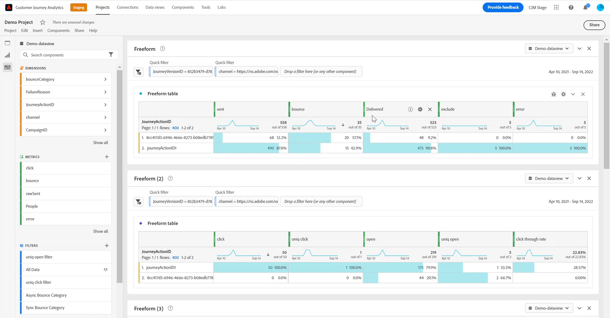

# Configurar manualmente [!DNL Customer Journey Analytics] {#cja-ajo}

La integración de [!DNL Journey Optimizer] con [!DNL Customer Journey Analytics] proporciona una vista integral de todos sus recorridos con una distribución automatizada de informes y visualizaciones personalizadas de los datos.

En la siguiente sección se describe cómo aprovechar manualmente los datos generados por Journey Optimizer para un análisis detallado en Customer Journey Analytics. Tenga en cuenta que esta integración se puede configurar automáticamente. [Más información](report-gs-cja.md)

Después de crear el recorrido en [!DNL Journey Optimizer], puede importar los datos de clientes a [!DNL Customer Journey Analytics] para iniciar informes y comprender el impacto de cada interacción que un cliente tiene con sus recorridos.

➡️ [Discover Customer Journey Analytics](https://experienceleague.adobe.com/es/docs/analytics-platform/using/integrations/ajo#manually-configure-a-data-view-to-be-used-with-journey-optimizer){target="_blank"}

>[!NOTE]
>
>Además de esta integración, también puede exportar el contenido de los conjuntos de datos de Adobe Journey Optimizer a ubicaciones de almacenamiento en la nube y utilizar esta información con fines de informes o análisis. [Obtenga información sobre cómo exportar conjuntos de datos a ubicaciones de almacenamiento en la nube](../data/export-datasets.md)
>

Antes de usar [!DNL Customer Journey Analytics] en sus recorridos, primero debe configurarla:

1. [Crear una conexión](https://experienceleague.adobe.com/docs/analytics-platform/using/cja-connections/create-connection.html?lang=es) en [!DNL Customer Journey Analytics] con el **[!UICONTROL conjunto de datos]** que desea enviar a Adobe Experience Platform.

   Se pueden configurar los siguientes [!DNL Journey Optimizer]:
   * [Evento de paso de Recorrido](../data/datasets-query-examples.md#journey-step-event): permite ver quién entra en los recorridos y hasta dónde llegan.
   * [Conjuntos de datos de seguimiento/comentarios de mensajes](../data/datasets-query-examples.md#message-feedback-event-dataset): permite ver la información de envío de sus mensajes enviados a través de [!DNL Journey Optimizer].
   * [Conjuntos de datos de entidad y Recorrido](../data/datasets-query-examples.md#entity-dataset): le permite buscar nombres descriptivos y utilizarlos en sus informes.

1. [Cree una vista de datos](https://experienceleague.adobe.com/docs/analytics-platform/using/cja-dataviews/create-dataview.html?lang=es) para configurar las dimensiones y métricas que desee usar en el informe.

   Puede crear métricas específicas de Journey Optimizer para reflejar mejor los datos de sus recorridos. [Más información](https://experienceleague.adobe.com/docs/analytics-platform/using/integrations/ajo.html?lang=es#configure-the-data-view-to-accommodate-journey-optimizer-dimensions-and-metrics)

El uso de [!DNL Journey Optimizer] con [!DNL Customer Journey Analytics] podría generar discrepancias en los datos de informes debido a lo siguiente:

* **Tanto [!DNL Journey Optimizer] como [!DNL Customer Journey Analytics] sincronizan los datos del almacenamiento de Azure Data Lake (ADLS) para los informes.**

  El tiempo de procesamiento de los datos entrantes puede ser ligeramente diferente entre los productos. Debido a esto, es posible que los datos no coincidan al mostrar los informes de una fecha determinada al día actual. Para reducir las discrepancias, utilice intervalos de fechas que excluyan el día actual.

* **En [!DNL Journey Optimizer] informes, la métrica Enviada también incluye la métrica Reintento.**

  **[!UICONTROL Reintentos]** no se incluirá en la métrica **[!UICONTROL Enviados]** en [!DNL Customer Journey Analytics]. Esto hará que [!DNL Customer Journey Analytics] **[!UICONTROL métricas enviadas]** muestren valores inferiores a [!DNL Journey Optimizer]. Sin embargo, los datos de reintentos convergen a la métrica **[!UICONTROL Mensajes enviados correctamente]** o **[!UICONTROL Devoluciones]**.
Para reducir las discrepancias, utilice intervalos de fechas de hace una semana o incluso más tarde.

* **Los informes se están suministrando desde una fuente de datos diferente.**

  Esto podría provocar discrepancias de datos de entre el 1 y el 2 % entre los productos.
