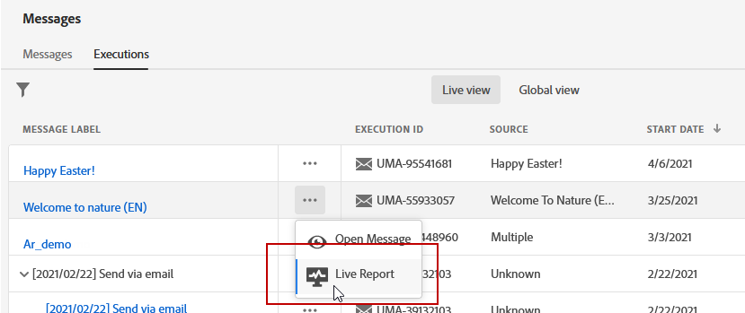

# Informe en vivo por correo electrónico {#email-live-report}

El correo electrónico **[!UICONTROL Live report]** solo se dirige a un envío de correo electrónico específico.

En la pestaña **[!UICONTROL Executions]** del menú **[!UICONTROL Messages]**, seleccione **[!UICONTROL Live view]** y, en el menú avanzado del envío seleccionado, seleccione **[!UICONTROL Live report]**.

El correo electrónico **[!UICONTROL Live report]** se divide en distintas utilidades que detallan el éxito y los errores del envío. Se puede cambiar el tamaño de cada widget y eliminarlo si es necesario. Para obtener más información, consulte esta [sección](live-report.md#modify-dashboard).

**[!UICONTROL Email performance]** y las  **[!UICONTROL Email summary]** utilidades detallan la información principal relativa al mensaje con un gráfico y KPI:

* **[!UICONTROL Sent]**: Número total de envíos para la entrega.

* **[!UICONTROL Delivered]**: Número de mensajes enviados correctamente, en relación con el número total de mensajes enviados.

* **[!UICONTROL Bounces]**: Total de errores acumulados durante la entrega y el procesamiento automático de devoluciones en relación con la cantidad total de mensajes enviados.

* **[!UICONTROL Errors]**: Número total de errores que se han producido durante una entrega que impiden que se envíe a perfiles.

* **[!UICONTROL Opens]**: Número de veces que se abrió un mensaje en una entrega.

* **[!UICONTROL Clicks]**: Número de veces que se hizo clic en un contenido en una entrega.

El gráfico **[!UICONTROL Sending Statistics]** detalla el éxito de su envío:

* **[!UICONTROL Delivered]**: Número de mensajes enviados correctamente, en relación con el número total de mensajes enviados.

* **[!UICONTROL Bounces]**: Total de errores acumulados durante la entrega y el procesamiento automático de devoluciones en relación con la cantidad total de mensajes enviados.

* **[!UICONTROL Errors]**: Número total de errores que se han producido durante una entrega que impiden que se envíe a perfiles.

El gráfico y la tabla **[!UICONTROL Error Reasons]** permiten ver qué error se produjo durante el envío.

Los widgets **[!UICONTROL Bounce Reasons]** y **[!UICONTROL Bounce categories]** contienen los datos disponibles relacionados con los mensajes devueltos, como:

* **[!UICONTROL Hard bounce]**: El número total de errores permanentes, como una dirección de correo electrónico incorrecta. Esto implica un mensaje de error que indica explícitamente que la dirección no es válida, como Usuario desconocido.

* **[!UICONTROL Soft bounce]**: El número total de errores temporales, como una bandeja de entrada completa.

* **[!UICONTROL Ignored]**: El número total de mensajes temporales, como fuera de la oficina o un error técnico, por ejemplo, si el tipo de remitente es administrador de correo.
