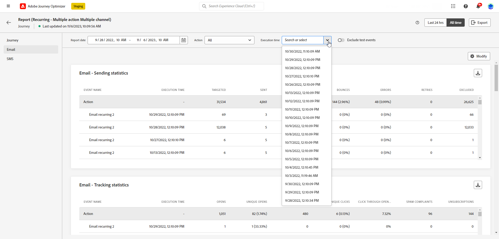

# Introducción al Informe global {#global-report}

>[!NOTE]
>
> Si las consultas personalizadas se realizan mediante API al utilizar el servicio de consulta, espere algún retraso para los informes.

Utilice el **[!UICONTROL Informe global]** para medir el impacto de los recorridos y envíos durante un periodo seleccionado.

* Si desea dirigirse a un recorrido o envíos en el contexto de un recorrido, desde el **[!UICONTROL Recorridos]** , acceda al recorrido y haga clic en el **[!UICONTROL Ver informe]** botón. A continuación, puede encontrar los informes globales Recorrido, Correo electrónico, SMS y Push.

  

* Si desea dirigirse a una campaña, en el **[!UICONTROL Campañas]** , acceda a la campaña y haga clic en **[!UICONTROL Informes]** botón.

  

* Si desea cambiar de la **[!UICONTROL Informe en vivo]** a la **[!UICONTROL Informe global]** para la entrega, haga clic en **[!UICONTROL Siempre]** en el conmutador de pestañas.

  

Para obtener una lista detallada de todas las métricas disponibles en Adobe Journey Optimizer, consulte [esta página](#list-of-components-global)

## Personalizar tablero {#modify-dashboard}

Para modificar cada tablero de informes, cambie el período de tiempo y cambie el tamaño o elimine los widgets. Cambiar los widgets solo afecta al tablero del usuario actual. Otros usuarios verán sus propios tableros o los establecidos de forma predeterminada.

1. En el informe global, seleccione una hora de inicio y otra de finalización para segmentar datos específicos.

   

1. Para los informes de Recorrido que implican varias configuraciones **[!UICONTROL Acciones]**, elija una específica **[!UICONTROL Acción]** en el menú desplegable.

1. Si solo desea enviar uno o varios mensajes recurrentes, selecciónelos en la **[!UICONTROL Tiempo de ejecución]** menú desplegable.

   

1. Elija si desea excluir los eventos de prueba de los informes con la barra de alternancia. Para obtener más información sobre los eventos de prueba, consulte [esta página](../building-journeys/testing-the-journey.md).

   Tenga en cuenta que la variable **[!UICONTROL Excluir eventos de prueba]** Esta opción solo está disponible para informes de Recorrido.

   

1. Clic **[!UICONTROL Modificar]** para empezar a personalizar el tablero.

   

1. Ajuste el tamaño de los widgets arrastrando su esquina inferior derecha.

   

1. Clic **[!UICONTROL Eliminar]** para eliminar cualquier widget que no necesite.

   

1. Cuando esté satisfecho con el orden de visualización y el tamaño de los widgets, haga clic en **[!UICONTROL Guardar]**.

1. Para personalizar la forma en que se muestran los datos, puede cambiar entre distintas opciones de visualización, como gráficos, tablas y gráficos circulares.

   

El tablero se ha guardado. Los diferentes cambios se volverán a aplicar para un uso posterior de los informes activos. Si es necesario, utilice el **[!UICONTROL Restablecer]** para restaurar el orden predeterminado de los widgets y widgets.

## Exportación de informes {#export-reports}

Puede exportar fácilmente los distintos informes a los formatos PDF o CSV, lo que le permite compartirlos o imprimirlos. Los pasos para exportar informes se detallan en las pestañas siguientes.

➡️ [Descubra esta función en vídeo](#video-csv)

>[!BEGINTABS]

>[!TAB Exportación del informe como archivo CSV]

1. En el informe, haga clic en **[!UICONTROL Exportar]** y seleccione **[!UICONTROL Archivo CSV]** para generar un archivo CSV en el nivel de informe general.

   

1. También puede elegir exportar datos de un widget específico. Clic **[!UICONTROL Exportar datos de widget a CSV]** situado junto al widget seleccionado.

   

1. El archivo se descargará automáticamente y se podrá encontrar en los archivos locales.

   Si ha generado el archivo en el nivel de informe, contiene información detallada para cada widget, incluidos su título y datos.

   Si ha generado el archivo en el nivel de widget, proporciona específicamente datos para el widget seleccionado.

>[!TAB Exportación del informe como archivo de PDF]

1. En el informe, haga clic en **[!UICONTROL Exportar]** y seleccione **[!UICONTROL archivo de PDF]**.

   

1. En la ventana Imprimir, configure el documento según sea necesario. Tenga en cuenta que las opciones pueden variar según el explorador.

1. Elija imprimir o guardar el informe como PDF.

1. Busque la carpeta en la que desea guardar el archivo, cambie su nombre si es necesario y haga clic en Guardar.

El informe ya está disponible para su visualización o uso compartido en un archivo pdf.

>[!ENDTABS]

### Exportación de informes (vídeo) {#video-csv}

Obtenga información sobre cómo descargar un informe CSV para un informe y para un widget único en el siguiente vídeo explicativo.

>[!VIDEO](https://video.tv.adobe.com/v/3424603?quality=12)

>[!CONTEXTUALHELP]
>id="ajo_report_campaign_CTR"
>title="CTR"
>abstract="Widget de CTR"

>[!CONTEXTUALHELP]
>id="ajo_report_campaign_clicks"
>title="Clics"
>abstract="Widget de clics"

>[!CONTEXTUALHELP]
>id="ajo_report_campaign_delivered"
>title="Entregados"
>abstract="Widget entregado"

>[!CONTEXTUALHELP]
>id="ajo_report_campaign_overview"
>title="Información general de Campaign"
>abstract="Widget de información general de Campaign"

>[!CONTEXTUALHELP]
>id="ajo_report_campaign_funnel"
>title="Resultados del canal de Campaign"
>abstract="Widget de resultados de embudo de Campaign"

>[!CONTEXTUALHELP]
>id="ajo_report_campaign_tracking_link"
>title="Etiquetas de vínculos rastreados"
>abstract="Widget de etiquetas de vínculos rastreados"

>[!CONTEXTUALHELP]
>id="ajo_report_campaign_displays"
>title="Visualizaciones"
>abstract="Muestra el widget"

<!--campaign email-->

>[!CONTEXTUALHELP]
>id="ajo_report_campaign_email_delivered_click"
>title="Tendencia de envíos y clics"
>abstract="Widget de tendencias de Entregado y clic"

>[!CONTEXTUALHELP]
>id="ajo_report_campaign_email_delivery_status"
>title="Estado del envío"
>abstract="Widget del estado de envío"

>[!CONTEXTUALHELP]
>id="ajo_report_campaign_email_sending_statistics"
>title="Envío de estadísticas"
>abstract="Widget de estadísticas de envío"

>[!CONTEXTUALHELP]
>id="ajo_report_campaign_email_tracking_statistics"
>title="Estadísticas de seguimiento"
>abstract="Widget de estadísticas de seguimiento"

>[!CONTEXTUALHELP]
>id="ajo_report_campaign_email_domains"
>title="dominios de correo electrónico"
>abstract="Widget de dominios de correo electrónico"

>[!CONTEXTUALHELP]
>id="ajo_report_campaign_email_tracked_link"
>title="Etiquetas de vínculos rastreados"
>abstract="Widget de etiquetas de vínculos de seguimiento"

>[!CONTEXTUALHELP]
>id="ajo_report_campaign_email_tracked_link_urls"
>title="URL de vínculos rastreados"
>abstract="Widget de direcciones URL de vínculos rastreados"

>[!CONTEXTUALHELP]
>id="ajo_report_campaign_email_subjects"
>title="Temas de correo electrónico"
>abstract="Widget de asuntos de correo electrónico"

>[!CONTEXTUALHELP]
>id="ajo_report_campaign_email_bounce_reasons"
>title="Motivos del rechazo"
>abstract="Widget de motivos de rechazo"

>[!CONTEXTUALHELP]
>id="ajo_report_campaign_email_exclude"
>title="Razones de exclusión"
>abstract="Widget de razones de exclusión"

>[!CONTEXTUALHELP]
>id="ajo_report_campaign_email_error"
>title="Motivos de error"
>abstract="Widget de motivos de error"

<!--campaign push-->

>[!CONTEXTUALHELP]
>id="ajo_report_campaign_push_sending_statistics"
>title="Envío de estadísticas"
>abstract="Widget de estadísticas de envío"

>[!CONTEXTUALHELP]
>id="ajo_report_campaign_push_tracking_statistics"
>title="Estadísticas de seguimiento"
>abstract="Widget de estadísticas de seguimiento"

>[!CONTEXTUALHELP]
>id="ajo_report_campaign_push_tracked_link"
>title="Etiquetas de vínculos rastreados"
>abstract="Widget de etiquetas de vínculos de seguimiento"

>[!CONTEXTUALHELP]
>id="ajo_report_campaign_push_tracked_link_urls"
>title="URL de vínculos rastreados"
>abstract="Widget de direcciones URL de vínculos rastreados"

>[!CONTEXTUALHELP]
>id="ajo_report_campaign_push_bounce_reasons"
>title="Motivos del rechazo"
>abstract="Widget de motivos de rechazo"

>[!CONTEXTUALHELP]
>id="ajo_report_campaign_push_exclude"
>title="Motivos de exclusión"
>abstract="Widget de razones de exclusión"

>[!CONTEXTUALHELP]
>id="ajo_report_campaign_push_email_error"
>title="Motivos de error"
>abstract="Widget de motivos de error"

<!--campaign inapp-->

>[!CONTEXTUALHELP]
>id="ajo_report_campaign_inapp_impression"
>title="Tendencia de impresión y clics"
>abstract="Widget de tendencias de impresión y clics"

>[!CONTEXTUALHELP]
>id="ajo_report_campaign_inapp_clicks"
>title="Clics"
>abstract="Widget de clics"

>[!CONTEXTUALHELP]
>id="ajo_report_campaign_inapp_displays"
>title="Visualizaciones"
>abstract="Muestra el widget"

>[!CONTEXTUALHELP]
>id="ajo_report_campaign_inapp_tracking_data"
>title="Datos de seguimiento"
>abstract="Widget de datos de seguimiento"

>[!CONTEXTUALHELP]
>id="ajo_report_campaign_inapp_tracked_link"
>title="Etiquetas de vínculos rastreados"
>abstract="Widget de etiquetas de vínculos rastreados"

>[!CONTEXTUALHELP]
>id="ajo_report_campaign_inapp_tracked_link_urls"
>title="URL de vínculos rastreados"
>abstract="Widget de direcciones URL de vínculos rastreados"

<!--campaign sms-->

>[!CONTEXTUALHELP]
>id="ajo_report_campaign_sms_delivered_click"
>title="Tendencia de envíos y clics"
>abstract="Widget de tendencias de Entregado y clic"

>[!CONTEXTUALHELP]
>id="ajo_report_campaign_sms_delivery_status"
>title="Estado del envío"
>abstract="Widget del estado de envío"

>[!CONTEXTUALHELP]
>id="ajo_report_campaign_sms_tracked_link"
>title="Etiquetas de vínculos rastreados"
>abstract="Widget de etiquetas de vínculos de seguimiento"

>[!CONTEXTUALHELP]
>id="ajo_report_campaign_sms_tracked_link_urls"
>title="URL de vínculos rastreados"
>abstract="Widget de direcciones URL de vínculos rastreados"

>[!CONTEXTUALHELP]
>id="ajo_report_campaign_sms_inbound"
>title="Mensaje entrante de SMS"
>abstract="Widget del mensaje entrante SMS"

>[!CONTEXTUALHELP]
>id="ajo_report_campaign_sms_message_type"
>title="Tipo de mensaje SMS"
>abstract="Widget del tipo de mensaje SMS"

>[!CONTEXTUALHELP]
>id="ajo_report_campaign_sms_providers"
>title="Proveedores de SMS"
>abstract="Widget de proveedores de SMS"

>[!CONTEXTUALHELP]
>id="ajo_report_campaign_sms_bounce"
>title="Motivos del rechazo"
>abstract="Widget de motivos de rechazo"

>[!CONTEXTUALHELP]
>id="ajo_report_campaign_sms_exclude"
>title="Razones de exclusión"
>abstract="Widget de razones de exclusión"

>[!CONTEXTUALHELP]
>id="ajo_report_campaign_sms_error"
>title="Motivos de error"
>abstract="Widget de motivos de error"
