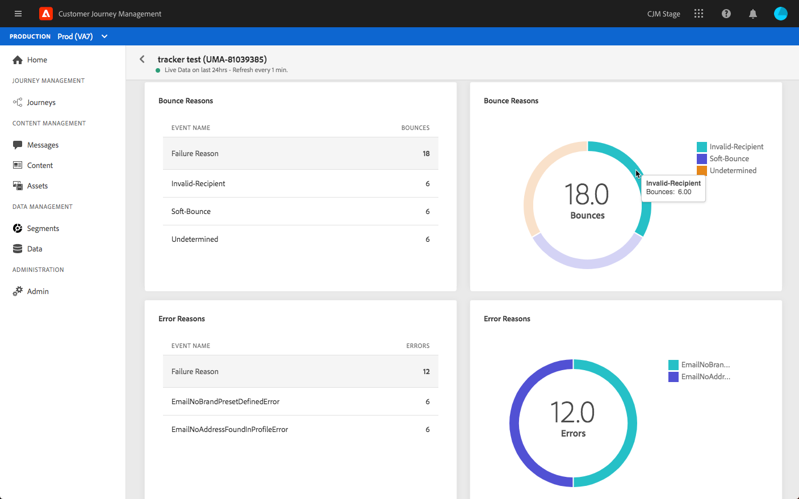
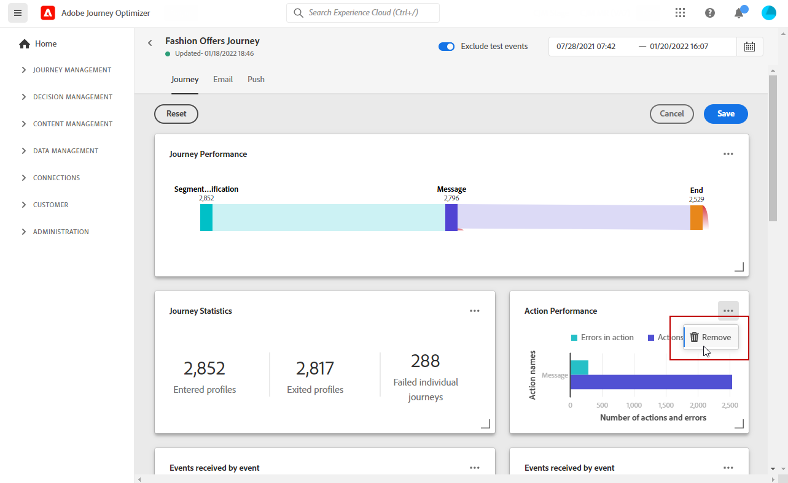

# Informe global {#global-report}

>[!NOTE]
>
> Si las consultas personalizadas se realizan a través de API al utilizar el servicio de Consulta, espere un cierto retraso para los informes.

Utilice la variable **[!UICONTROL Global report]** para medir el impacto de los recorridos y envíos durante un período de tiempo seleccionado.

* Si desea dirigirse a un recorrido o envíos en el contexto de un recorrido, desde el **[!UICONTROL Journeys]** , acceda al recorrido y haga clic en el botón **[!UICONTROL Global report]** icono. A continuación, puede encontrar el Recorrido, el correo electrónico y la inserción **[!UICONTROL Global report]**.

* Si desea segmentar un envío específico, en la **[!UICONTROL Global view]** del **[!UICONTROL Executions]** de los mensajes, seleccione **[!UICONTROL Global Report]** en el menú avanzado de la entrega seleccionada.

## Personalizar tablero {#modify-dashboard}

Cada tablero de informes se puede modificar cambiando el período de tiempo y cambiando el tamaño o eliminando las utilidades. Cambiar las utilidades solo afecta al tablero del usuario actual. Otros usuarios verán sus propios tableros o los que estén configurados de forma predeterminada.

1. En el informe Global , seleccione una Hora de inicio y una de finalización para dirigirse a datos específicos.

   

1. Elija si desea excluir los eventos de prueba de los informes con la barra de alternancia. Para obtener más información sobre los eventos de prueba, consulte [esta página](../building-journeys/testing-the-journey.md).

   

1. Haga clic en **[!UICONTROL Modify]** para comenzar a personalizar el tablero.

   

1. Ajuste el tamaño de los widgets arrastrando su esquina inferior derecha.

   

1. Haga clic en **[!UICONTROL Remove]** para quitar cualquier utilidad que no necesite.

   

1. Una vez que esté satisfecho con el orden de visualización y el tamaño de sus widgets, haga clic en **[!UICONTROL Save]**.

El tablero se ha guardado. Los diferentes cambios se volverán a aplicar para un uso posterior de los informes activos. Si es necesario, use la variable **[!UICONTROL Reset]** para restaurar el orden predeterminado de las utilidades y utilidades.
