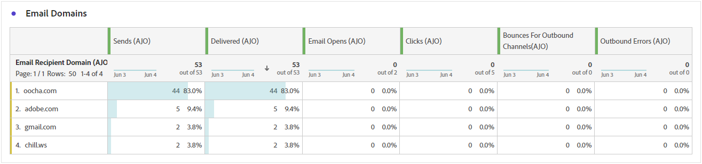
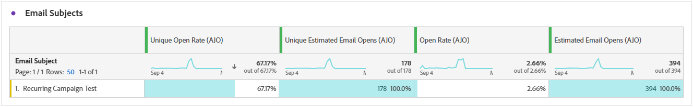

# Informe de recorrido de correo electrónico {#journey-global-report}

>[!INFO]
>
>Desde que Apple introdujo nuevas funciones de protección de la privacidad para su aplicación de correo nativa, incluida la protección de privacidad de correo, los remitentes ya no pueden utilizar píxeles de seguimiento para recopilar datos en perfiles que hayan habilitado la protección de privacidad de correo de Apple. Por lo tanto, la capacidad de Adobe Journey Optimizer para rastrear las aperturas de correo electrónico mediante los píxeles de seguimiento puede verse afectada.
> [Más información](https://experienceleaguecommunities.adobe.com/t5/adobe-campaign-classic-blogs/the-impact-of-apple-ios-privacy-changes-on-email-marketing-and/ba-p/699780?profile.language=es) sobre el impacto de los cambios de privacidad de Apple iOS en el marketing por correo electrónico.
> 
> Recomendamos centrarse en los clics y las métricas de conversión en lugar de en las tasas de apertura para obtener perspectivas más precisas.

>[!BEGINSHADEBOX]

Puede acceder a su informe de recorrido de correo electrónico si hace clic en el botón **[!UICONTROL Ver informe]** del recorrido. [Más información](report-gs-cja.md)

>[!ENDSHADEBOX]

## Tendencia de envíos frente a clics {#delivered-click}

El gráfico **[!UICONTROL Tendencia de entrega frente a clic]** presenta un análisis detallado de la participación de sus perfiles con sus correos electrónicos, lo que ofrece información valiosa sobre cómo varios dominios interactúan con su contenido.

+++ Más información sobre las métricas de tendencias de Entrega frente a Clic

* **[!UICONTROL Entregado]**: Número de correos electrónicos enviados correctamente, en relación con el número total de correos electrónicos enviados.

* **[!UICONTROL Clics]**: Número de veces que se hizo clic en un contenido en sus correos electrónicos.

+++

## Estado del envío {#delivery-status}

El gráfico **[!UICONTROL Estado de entrega]** le permite ver el rendimiento de sus correos electrónicos de un vistazo. Rastree métricas clave como envíos y devoluciones, lo que le permitirá comprender rápidamente la eficacia de su recorrido de correo electrónico.

+++ Más información sobre las Métricas de estado de entrega

* **[!UICONTROL Entregado]**: Número de correos electrónicos enviados correctamente, en relación con el número total de correos electrónicos enviados.

* **[!UICONTROL Devoluciones para canales salientes]**: Total de errores acumulados durante el proceso de envío y procesamiento automático de devoluciones en relación con el número total de mensajes enviados.

* **[!UICONTROL Errores salientes]**: Número total de errores que se produjeron durante un proceso de envío que impidió que se enviara a los perfiles.

* **[!UICONTROL Excluido]**: número de perfiles que han sido excluidos por Adobe Journey Optimizer.

+++

## Envío de estadísticas {#email-sending-statistics}

La tabla **[!UICONTROL Estadísticas de envío]** proporciona una visión clara del rendimiento de sus correos electrónicos dentro de sus recorridos. Rastrea métricas clave como tasas de entrega e interacciones, lo que le proporciona información valiosa para optimizar su estrategia de correo electrónico y mejorar el alcance y la participación.

+++ Más información sobre el envío de métricas de estadísticas

* **[!UICONTROL Segmentado]**: número de perfiles aptos para la audiencia antes de aplicar las exclusiones, las supresiones o las eliminaciones de consentimiento. En los recorridos con la reentrada habilitada, un perfil se puede definir como objetivo varias veces.

* **[!UICONTROL Envíos]**: Número total de envíos del correo electrónico.

* **[!UICONTROL Entregado]**: número de correos electrónicos enviados correctamente en relación con el número total de mensajes enviados.

* **[!UICONTROL Entrega única]**: Número de perfiles que recibieron correctamente al menos un correo electrónico.

* **[!UICONTROL Devoluciones para canales salientes]**: Total de errores acumulados durante el proceso de envío y procesamiento automático de devoluciones en relación con el número total de mensajes enviados.

* **[!UICONTROL Errores salientes]**: Número total de errores que se produjeron durante el proceso de envío para evitar que se enviara a los perfiles.

* **[!UICONTROL Exclusiones salientes]**: número de perfiles que han sido excluidos por Adobe Journey Optimizer.

+++

## Correo electrónico: Estadísticas de seguimiento {#email-tracking}

La tabla **[!UICONTROL Correo electrónico: estadísticas de seguimiento]** ofrece una cuenta detallada de la actividad del perfil relacionada con los correos electrónicos incluidos en el recorrido. Esto incluye métricas sobre aperturas, clics y otros indicadores de participación relevantes, lo que ofrece una vista completa de cómo los perfiles interactúan con el contenido del correo electrónico.

+++ Más información sobre las Métricas de estadísticas de seguimiento

* **[!UICONTROL Tasa de clics (CTR)]**: porcentaje de usuarios que interactuaron con el correo electrónico.

* **[!UICONTROL Tasa de apertura de clics (CTOR)]**: Número de veces que se abrió el correo electrónico.

* **[!UICONTROL Clics]**: Número de veces que se hizo clic en un contenido en sus correos electrónicos.

* **[!UICONTROL Clics únicos]**: Número de perfiles que hicieron clic en un contenido de un correo electrónico.

* **[!UICONTROL Aperturas de correo electrónico]**: Número de veces que se abrieron los mensajes de correo electrónico en una campaña.

* **[!UICONTROL Aperturas únicas de correo electrónico]**: Número de perfiles que abrieron correos electrónicos.

* **[!UICONTROL Quejas por correo no deseado]**: Número de veces que un mensaje se declaró como correo no deseado.

* **[!UICONTROL Cancelaciones de suscripción]**: número de clics en el vínculo de cancelación de suscripción.

* **[!UICONTROL Cancelaciones de suscripción de correo electrónico único]**: Número de perfiles que cancelaron la suscripción a sus correos electrónicos.
+++

## Dominios de correo electrónico {#email-domains}

La tabla **[!UICONTROL Dominios de correo electrónico]** ofrece un desglose detallado de los mensajes de correo electrónico clasificados por dominio, lo que proporciona información detallada sobre las métricas de rendimiento de los recorridos de correo electrónico. Este análisis completo le permite comprender el comportamiento de los distintos dominios en respuesta al contenido del correo electrónico.

+++ Más información sobre las métricas Dominios de correo electrónico

* **[!UICONTROL Envíos]**: Número total de envíos del correo electrónico.

* **[!UICONTROL Entregado]**: Número de correos electrónicos enviados correctamente, en relación con el número total de correos electrónicos enviados.

* **[!UICONTROL Aperturas de correo electrónico]**: Número de veces que los mensajes de correo electrónico se abrieron en un recorrido.

* **[!UICONTROL Clics]**: Número de veces que se hizo clic en un contenido en sus correos electrónicos.

* **[!UICONTROL Devoluciones para canales salientes]**: Número total de errores acumulados durante el proceso de envío y procesamiento automático de devoluciones en relación con el número total de correos electrónicos enviados.

* **[!UICONTROL Errores salientes]**: Número total de errores que se produjeron durante el proceso de envío para evitar que se enviara a los perfiles.

* **[!UICONTROL Exclusiones salientes]**: número de perfiles que han sido excluidos por Adobe Journey Optimizer.

+++

## Etiquetas de vínculos rastreados {#track-link-label}

La tabla **[!UICONTROL Etiquetas de vínculos rastreados]** ofrece una descripción general completa de las etiquetas de vínculos de los mensajes de correo electrónico, en la que se destacan las que generan el mayor tráfico de visitantes. Esta función le permite identificar y priorizar los vínculos más populares.

+++ Obtenga más información acerca de las métricas de etiquetas de vínculos rastreados

* **[!UICONTROL Clics únicos]**: Número de perfiles que hicieron clic en un contenido de un correo electrónico.

* **[!UICONTROL Clics]**: Número de veces que se hizo clic en un contenido en sus correos electrónicos.

+++

## URL de vínculos rastreados {#track-link-url}

La tabla **[!UICONTROL URL de vínculos rastreados]** proporciona una visión general de las direcciones URL del correo electrónico que atraen el tráfico de visitantes más alto. Esto le permite identificar y priorizar los vínculos más populares, lo que mejora su comprensión de la participación del perfil con contenido específico en los correos electrónicos.

+++ Obtenga más información acerca de las métricas de URL de vínculos rastreados

* **[!UICONTROL Clics únicos]**: Número de perfiles que hicieron clic en un contenido de un correo electrónico.

* **[!UICONTROL Clics]**: Número de veces que se hizo clic en un contenido en sus correos electrónicos.

+++

## Asuntos de correo electrónico {#email-subject}

La tabla **[!UICONTROL Temas de correo electrónico]** presenta una descripción general detallada de los temas de correo electrónico que han atraído el mayor tráfico de visitantes. Este recurso ofrece información valiosa sobre la dinámica de participación de la audiencia.

+++ Más información sobre las métricas de Temas de correo electrónico

* **[!UICONTROL Entregado]**: Número de correos electrónicos enviados correctamente, en relación con el número total de correos electrónicos enviados.

* **[!UICONTROL Entrega única]**: Número de perfiles distintos que recibieron correctamente al menos un correo electrónico, lo que garantiza que no se cuenten los duplicados.
+++

## Motivos de rechazo {#email-bounce-reasons}

La tabla **[!UICONTROL Razones de rechazo]** compila los datos disponibles relacionados con los mensajes rechazados, y proporciona información detallada sobre las razones específicas detrás de los rechazos de correo electrónico.

Para obtener más información sobre las devoluciones, consulte la página [Lista de supresión](../reports/suppression-list.md).

## Motivos excluidos {#email-excluded}

La tabla **[!UICONTROL Razones de exclusión]** presenta una vista completa de los diferentes factores que tuvieron como resultado la exclusión de perfiles de usuario de la audiencia de destino, lo que resultó en que el mensaje no se recibiera.

Consulte [esta página](exclusion-list.md) para obtener una lista completa de motivos de exclusión.

## Motivos de error {#email-errors}

La tabla **[!UICONTROL Motivos del error]** ofrece visibilidad de los errores específicos que se produjeron durante el proceso de envío y proporciona información valiosa sobre la naturaleza y la incidencia de los errores.
