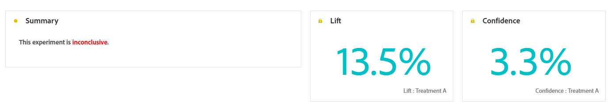

# Informe recorrido de experimentación {#campaign-global-report-cja-experimentation}

El informe de Recorrido le ofrece una vista completa del rendimiento de su experimento, junto con las métricas clave que necesita para comprender su impacto.

En Journey Optimizer, la experimentación con recorridos se divide en dos tipos:

* [Experimentos de contenido](../content-management/content-experiment.md)

  Tenga en cuenta que las tablas y los KPI detallados para el experimento de contenido son los mismos que para un experimento de ruta. Consulte la [documentación siguiente](#experimentation) si ha configurado un experimento de contenido.

* [Experimentos de ruta](../building-journeys/optimize.md)

## Experimento de ruta {#experimentation}

### KPI de experimentación {#experimentation-kpis}

**Resumen de experimentación** proporciona información clave sobre el rendimiento de tu experimento e identifica el más exitoso. Tenga en cuenta que definir el mejor ejecutante puede llevar algún tiempo. Si el experimento no se realiza correctamente, se establecerá en **No concluyente**.

Los **Indicadores clave de rendimiento (KPI) de experimentación** funcionan como un tablero que abarca todo, y ofrecen un análisis de las métricas esenciales asociadas con la experimentación.

+++ Más información sobre las métricas de KPI de experimentación

* **[!UICONTROL Alza]**: medición de la mejora porcentual en la tasa de conversión de un tratamiento determinado respecto al valor de referencia.

* **[!UICONTROL Confianza]**: Evidencia de que un tratamiento dado es el mismo que el tratamiento basal. [Más información](../content-management/experiment-calculations.md#understand-confidence)

+++

### Variante por métricas de éxito {#variant-inbound}

La tabla **Variante según métricas de éxito** muestra el rendimiento de cada variante en función de la métrica de éxito seleccionada al configurar el experimento.
Para profundizar en estos resultados y cómo interpretarlos, consulte [esta página](../content-management/get-started-experiment.md#interpret-results).

+++ Más información sobre la Variante por métrica de éxito

* **[!UICONTROL Personas]**: Número de perfiles de usuario que se califican como perfiles de destino para sus mensajes.

* **[!UICONTROL Clics entrantes]**: Valor total de la métrica de éxito, seleccionada anteriormente al crear los experimentos.

* **[!UICONTROL Tasa de conversión]**: Valor total de la métrica de éxito, seleccionada anteriormente al crear los experimentos, dividido por el número de perfiles.

* **[!UICONTROL Alza]**: medición de la mejora porcentual en la tasa de conversión de un tratamiento determinado respecto al valor de referencia.

* **[!UICONTROL Límite inferior de confianza]**: Valor estimado más bajo de la diferencia de tasa de conversión entre el tratamiento y la línea de base, dentro del intervalo de confianza elegido.

* **[!UICONTROL Confianza]**: Evidencia de que un tratamiento dado es el mismo que el tratamiento basal. [Más información](../content-management/experiment-calculations.md#understand-confidence)

* **[!UICONTROL Límite superior de confianza]**: Valor estimado más alto de la diferencia de tasa de conversión entre el tratamiento y la línea de base, dentro del intervalo de confianza elegido.

+++

### Tasa de conversión para la métrica de éxito {#conversion-rate}

El gráfico de **[!UICONTROL Intervalo de confianza]** muestra el rango de posibles mejoras, comparando la línea de base con el tratamiento de mejor rendimiento para la métrica de éxito elegida. [Más información](../content-management/experiment-calculations.md#confidence-intervals).
