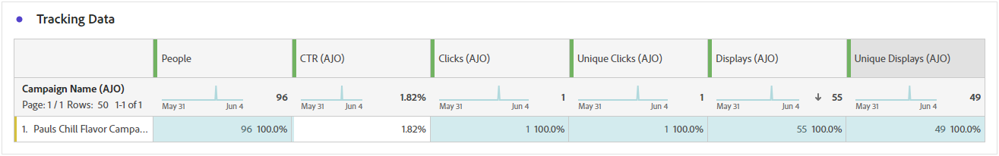

# Informe de recorrido web {#journey-global-report}

## Tendencia de impresión y clics {#impressions-web}

El gráfico **[!UICONTROL Tendencia de impresión y clics]** presenta un análisis detallado de la participación de sus perfiles con sus páginas web, lo que ofrece información valiosa sobre cómo los perfiles interactúan con su contenido.

+++ Obtenga más información sobre las métricas de tendencias de impresión y clics

* **[!UICONTROL Clics]**: Número de veces que se hizo clic en un contenido de sus páginas web.

* **[!UICONTROL Pantallas]**: Número de veces que se abrió el mensaje.

+++

## Clics {#clicks-web}

El gráfico **[!UICONTROL Clics]** muestra las métricas de clics en páginas web, ilustrando tanto la cantidad total de clics en contenido como la cantidad de perfiles únicos que hicieron clic en el contenido.

+++ Más información sobre las métricas de Clics

* **[!UICONTROL Clics únicos]**: Número de perfiles que hicieron clic en un contenido de sus páginas web.

* **[!UICONTROL Clics]**: Número de veces que se hizo clic en un contenido de sus páginas web.

+++

## Visualizaciones {#displays-web}

El gráfico **[!UICONTROL Muestra]** le ayuda a comprender el alcance general de la experiencia basada en código que se abrió y la cantidad de perfiles únicos que interactúan con ella.

+++ Más información sobre las Métricas de visualización

* **[!UICONTROL Pantallas]**: Número de veces que se abrió la experiencia basada en código.

* **[!UICONTROL Visualizaciones únicas]**: Número de veces que se abrió la experiencia basada en código, no se tienen en cuenta las interacciones múltiples de un perfil.

+++

## Datos de seguimiento {#track-data-web}

La tabla **[!UICONTROL Datos de seguimiento]** ofrece una instantánea detallada de la actividad del perfil vinculada a sus páginas web, lo que proporciona información esencial sobre la participación y la eficacia de las páginas web.

+++ Más información sobre el Seguimiento de métricas de datos

* **[!UICONTROL Personas]**: Número de perfiles de usuario que se califican como perfiles de destino para sus páginas web.

* **[!UICONTROL Tasa de clics (CTR)]**: Porcentaje de usuarios que interactuaron con las páginas web.

* **[!UICONTROL Clics]**: Número de veces que se hizo clic en un contenido de sus páginas web.

* **[!UICONTROL Clics únicos]**: Número de perfiles que hicieron clic en un contenido de sus páginas web.

* **[!UICONTROL Pantallas]**: Número de veces que se abrió la página web.

* **[!UICONTROL Visualizaciones únicas]**: Número de veces que se abrió la página web, no se tienen en cuenta las interacciones múltiples de un perfil.

+++

## Etiquetas de vínculos rastreados {#track-link-web}

La tabla **[!UICONTROL Etiquetas de vínculos rastreados]** ofrece una descripción general completa de las etiquetas de vínculos de sus páginas web, en la que se destacan las que generan el mayor tráfico de visitantes. Esta función le permite identificar y priorizar los vínculos más populares.

+++ Obtenga más información sobre las métricas de etiquetas de vínculos rastreados

* **[!UICONTROL Clics únicos]**: Número de perfiles que hicieron clic en un contenido de sus páginas web.

* **[!UICONTROL Clics]**: Número de veces que se hizo clic en un contenido de sus páginas web.

* **[!UICONTROL Pantallas]**: Número de veces que se abrió el mensaje.

* **[!UICONTROL Visualizaciones únicas]**: Número de veces que se abrió el mensaje, no se tienen en cuenta las interacciones múltiples de un perfil.

+++

## URL de vínculos rastreados {#track-url-web}

La tabla **[!UICONTROL URL de vínculos rastreados]** proporciona una visión general de las direcciones URL de las páginas web que atraen el mayor tráfico de visitantes. Esto le permite identificar y priorizar los vínculos más populares, lo que le permite comprender mejor la participación de perfiles con contenido específico en las páginas web.

+++ Más información sobre las métricas de URL de vínculos rastreados

* **[!UICONTROL Clics únicos]**: Número de perfiles que hicieron clic en un contenido de sus páginas web.

* **[!UICONTROL Clics]**: Número de veces que se hizo clic en un contenido de sus páginas web.

* **[!UICONTROL Pantallas]**: Número de veces que se abrió el mensaje.

* **[!UICONTROL Visualizaciones únicas]**: Número de veces que se abrió el mensaje, no se tienen en cuenta las interacciones múltiples de un perfil.

+++

