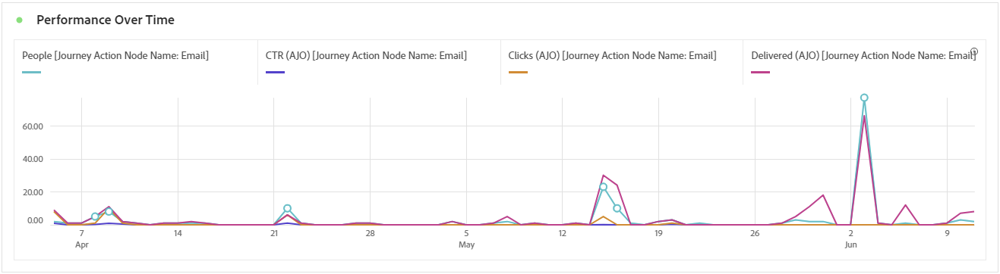
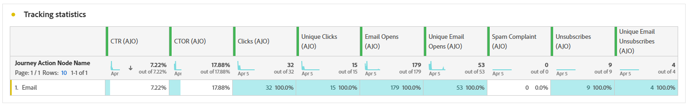

# Informe de recorrido {#journey-global-report}

El **informe de Recorrido** funciona como un tablero que abarca todo, y ofrece un análisis de las métricas esenciales asociadas con el recorrido. Esto incluye detalles como el recuento de perfiles introducidos y los casos de recorridos individuales fallidos, lo que ofrece una perspectiva completa de la eficacia y el nivel de participación de su recorrido.

Se puede acceder directamente al **informe de Recorrido** desde su recorrido con el botón **[!UICONTROL Ver informe]**.

La página **[!UICONTROL informe de Recorrido]** se mostrará con las siguientes fichas según las actividades de mensajes del recorrido:

* [ Recorrido ](#journey-global)
* [Correo electrónico](#email-global)
* [Push](#push-global)
* [SMS](#sms-global)
* [En la aplicación](#in-app-global)
* [Web](#web-cja)
* [Correo directo](#direct-mail-cja)
* [Código basado](#code-based)
* [Tarjeta de contenido](#content-card)

Para obtener más información sobre Customer Journey Analytics Workspace y cómo filtrar y analizar datos, consulte [esta página](https://experienceleague.adobe.com/en/docs/analytics-platform/using/cja-workspace/home).

## Información general del recorrido {#journey-global}

El informe **[!UICONTROL Recorrido]** le ofrece una visión clara de los datos de seguimiento más importantes sobre su recorrido.

### KPI de recorrido {#journey-perfomance}

Los indicadores clave de rendimiento (KPI) **[!UICONTROL Recorrido]** funcionan como un tablero que abarca todo, y ofrecen un análisis de las métricas esenciales asociadas con el recorrido. Esto incluye detalles como el recuento de perfiles introducidos y los casos de recorridos individuales fallidos, lo que ofrece una perspectiva completa de la eficacia y el nivel de participación de su recorrido.

+++ Más información sobre las métricas de KPI de Recorrido

* **[!UICONTROL Participación en el Recorrido]**: Número total de personas que interactuaron con los mensajes enviados desde el recorrido

* **[!UICONTROL Entradas de Recorrido]**: Número total de personas que llegaron al evento de entrada del recorrido.

* **[!UICONTROL Salidas de Recorrido]**: Número total de personas que salieron del recorrido.

* **[!UICONTROL Errores de Recorrido]**: Número total de recorridos individuales que no se ejecutaron correctamente.

+++

### estadísticas de recorrido {#journey-stats}

La tabla **[!UICONTROL Estadísticas de Recorrido]** ofrece un resumen detallado de datos cruciales sobre tus recorridos. Incluye métricas clave como el número de errores y las entradas exitosas, lo que proporciona una valiosa perspectiva del rendimiento y el alcance de sus correos electrónicos y recorridos.

+++ Más información sobre las métricas de Estadísticas de Recorrido

* **[!UICONTROL Participación en el Recorrido]**: Número total de personas que interactuaron con los mensajes enviados desde el recorrido.

* **[!UICONTROL Entradas de Recorrido]**: Número total de personas que llegaron al evento de entrada del recorrido.

* **[!UICONTROL Salidas de Recorrido]**: Número total de personas que salieron del recorrido.

* **[!UICONTROL Errores de Recorrido]**: Número total de recorridos individuales que no se ejecutaron correctamente.

* **[!UICONTROL Entradas de Recorridos únicos]**: Número total de individuos que llegaron al evento de entrada del recorrido; no se tienen en cuenta las interacciones múltiples de un perfil.

* **[!UICONTROL Salidas de Recorrido únicas]**: Número total de individuos que salieron del recorrido, no se tienen en cuenta las interacciones múltiples de un perfil.

* **[!UICONTROL Errores de Recorridos únicos]**: Número total de recorridos individuales que no se ejecutaron correctamente, no se tienen en cuenta las interacciones múltiples de un perfil.

+++

## lienzo de recorrido {#journey-canvas}

El widget **[!UICONTROL Lienzo de Recorrido]** le permite rastrear visualmente la trayectoria de sus perfiles de destino a medida que navegan por su recorrido. [Obtenga más información en la documentación del Customer Journey Analytics](https://experienceleague.adobe.com/en/docs/analytics-platform/using/cja-workspace/visualizations/journey-canvas/journey-canvas)

Mejore la personalización del lienzo con las siguientes opciones:

* Agregue o quite el tipo de actividad deseado, como mensajes o condiciones, del menú desplegable **[!UICONTROL Tipo de nodo]**.
* Ajuste el **[!UICONTROL valor de porcentaje]** para determinar la distribución del flujo entre las diferentes rutas de recorrido.
* Personaliza tu **[!UICONTROL configuración de flechas]** para incluir etiquetas, condiciones u optar por una pantalla limpia.
* Habilite la opción **[!UICONTROL Mostrar visitas en el orden previsto]** para visualizar los perfiles que salieron del recorrido directamente en el lienzo.

## Rendimiento de las acciones {#action-performance}

### Rendimiento con el tiempo {#action-overtime}

El gráfico **[!UICONTROL Rendimiento con el tiempo]** le permite identificar y analizar el número de perfiles que cumplen los criterios para ser considerados perfiles objetivo para sus acciones. Esta visualización proporciona información valiosa sobre la eficacia de sus estrategias y le ayuda a tomar decisiones basadas en datos para optimizar su rendimiento.

### Resumen de acción {#action-overview}

La tabla **[!UICONTROL Descripción general de la acción]** sirve como un panel completo, que ofrece un análisis de las métricas clave relacionadas con las acciones del recorrido. Esto incluye detalles cruciales como el número de interacciones y la tasa de clics

+++ Más información sobre las Métricas de resumen de la acción

* **[!UICONTROL Personas]**: Número de perfiles de usuario que se califican como perfiles de destino para sus acciones.

* **[!UICONTROL Tasa de clics]**: Porcentaje de usuarios que interactuaron con la acción.

* **[!UICONTROL Clics]**: Número de veces que se hizo clic en un contenido en sus acciones.

* **[!UICONTROL Entregado]**: número de acciones enviadas correctamente, en relación con el número total de acciones enviadas.

+++

## Rendimiento de eventos {#events-performance}

### Rendimiento con el tiempo {#event-overtime}

El gráfico **[!UICONTROL Rendimiento con el tiempo]** le permite identificar y analizar el número de perfiles que cumplen los requisitos como perfiles de destino para sus eventos. Esta potente herramienta le ayuda a seguir las tendencias y los patrones a lo largo del tiempo, proporcionando valiosas perspectivas para optimizar las estrategias de eventos.

### Resumen del evento {#event-overview}

La tabla **[!UICONTROL Información general del evento]** muestra cuántos perfiles cumplen los criterios del evento a lo largo del tiempo. Esta herramienta le ayuda a identificar patrones en las tasas de calificación para refinar su estrategia de eventos.

+++ Más información sobre las métricas de Estadísticas de Recorrido

* **[!UICONTROL Personas]**: Número de perfiles de usuario que se califican como perfiles de destino para sus eventos.

+++

## Detalles de correo electrónico {#email-global}

En el informe de recorrido, la pestaña **[!UICONTROL Correo electrónico]** detalla la información principal relacionada con los correos electrónicos enviados en el recorrido.

### Tendencia de envíos frente a clics {#delivered-click}

El gráfico **[!UICONTROL Tendencia de entrega frente a clic]** presenta un análisis detallado de la participación de sus perfiles con sus correos electrónicos, lo que ofrece información valiosa sobre cómo varios dominios interactúan con su contenido.

+++ Obtenga más información sobre las métricas de tendencias de Entregado frente a Clic

* **[!UICONTROL Entregado]**: Número de correos electrónicos enviados correctamente, en relación con el número total de correos electrónicos enviados.

* **[!UICONTROL Clics]**: Número de veces que se hizo clic en un contenido en sus correos electrónicos.

+++

### Estado del envío {#delivery-status}

El gráfico **[!UICONTROL Estado de entrega]** le permite ver el rendimiento de sus correos electrónicos de un vistazo. Rastree métricas clave como envíos y devoluciones, lo que le permitirá comprender rápidamente la eficacia de su recorrido de correo electrónico.

+++ Más información sobre las Métricas de estado de entrega

* **[!UICONTROL Entregado]**: Número de correos electrónicos enviados correctamente, en relación con el número total de correos electrónicos enviados.

* **[!UICONTROL Devoluciones para canales salientes]**: Total de errores acumulados durante el proceso de envío y procesamiento automático de devoluciones en relación con el número total de mensajes enviados.

* **[!UICONTROL Errores salientes]**: Número total de errores que se produjeron durante un proceso de envío que impidió que se enviara a los perfiles.

* **[!UICONTROL Excluido]**: número de perfiles que han sido excluidos por Adobe Journey Optimizer.

+++

### Estadísticas de envío {#email-sending-statistics}

La tabla **[!UICONTROL Estadísticas de envío]** proporciona una visión clara del rendimiento de sus correos electrónicos dentro de sus recorridos. Rastrea métricas clave como tasas de entrega e interacciones, lo que le proporciona información valiosa para optimizar su estrategia de correo electrónico y mejorar el alcance y la participación.

+++ Más información sobre el envío de métricas de estadísticas

* **[!UICONTROL Personas]**: Número de perfiles de usuario que se califican como perfiles de destino para sus mensajes.

* **[!UICONTROL Destinatarios]**: Número total de correos electrónicos procesados durante el proceso de envío.

* **[!UICONTROL Envíos]**: Número total de envíos del correo electrónico.

* **[!UICONTROL Entregado]**: número de correos electrónicos enviados correctamente en relación con el número total de mensajes enviados.

* **[!UICONTROL Devoluciones]**: Total de errores acumulados durante el proceso de envío y el procesamiento automático de devoluciones en relación con el número total de mensajes enviados.

* **[!UICONTROL Errores salientes]**: Número total de errores que se produjeron durante el proceso de envío para evitar que se enviara a los perfiles.

* **[!UICONTROL Exclusiones salientes]**: número de perfiles que han sido excluidos por Adobe Journey Optimizer.

+++

### Correo electrónico: Estadísticas de seguimiento {#email-tracking}

La tabla **[!UICONTROL Correo electrónico: estadísticas de seguimiento]** ofrece una cuenta detallada de la actividad del perfil relacionada con los correos electrónicos incluidos en el recorrido. Esto incluye métricas sobre aperturas, clics y otros indicadores de participación relevantes, lo que ofrece una vista completa de cómo los perfiles interactúan con el contenido del correo electrónico.

+++ Más información sobre las Métricas de estadísticas de seguimiento

* **[!UICONTROL Tasa de clics (CTR)]**: porcentaje de usuarios que interactuaron con el correo electrónico.

* **[!UICONTROL Tasa de apertura de pulsaciones (CTOR)]**: Número de veces que se abrió el correo electrónico.

* **[!UICONTROL Clics]**: Número de veces que se hizo clic en un contenido en sus correos electrónicos.

* **[!UICONTROL Clics únicos]**: Número de perfiles que hicieron clic en un contenido de un correo electrónico.

* **[!UICONTROL Aperturas de correo electrónico]**: Número de veces que los mensajes de correo electrónico se abrieron en un recorrido.

* **[!UICONTROL Aperturas únicas de correo electrónico]**: Porcentaje de correos electrónicos abiertos.

* **[!UICONTROL Quejas por correo no deseado]**: Número de veces que un mensaje se declaró como correo no deseado.

* **[!UICONTROL Cancelaciones de suscripción]**: número de clics en el vínculo de cancelación de suscripción.

+++

### Dominios de correo electrónico {#email-domains}

La tabla **[!UICONTROL Dominios de correo electrónico]** ofrece un desglose detallado de los mensajes de correo electrónico clasificados por dominio, lo que proporciona información detallada sobre las métricas de rendimiento de los recorridos de correo electrónico. Este análisis completo le permite comprender el comportamiento de los distintos dominios en respuesta al contenido del correo electrónico.

+++ Más información sobre las métricas de Dominios de correo electrónico

* **[!UICONTROL Envíos]**: Número total de envíos del correo electrónico.

* **[!UICONTROL Entregado]**: Número de correos electrónicos enviados correctamente, en relación con el número total de correos electrónicos enviados.

* **[!UICONTROL Aperturas de correo electrónico]**: Número de veces que los mensajes de correo electrónico se abrieron en un recorrido.

* **[!UICONTROL Clics]**: Número de veces que se hizo clic en un contenido en sus correos electrónicos.

* **[!UICONTROL Devoluciones para canales salientes]**: Número total de errores acumulados durante el proceso de envío y procesamiento automático de devoluciones en relación con el número total de correos electrónicos enviados.

* **[!UICONTROL Errores salientes]**: Número total de errores que se produjeron durante el proceso de envío para evitar que se enviara a los perfiles.
+++

### Etiquetas de vínculos rastreados {#track-link-label}

La tabla **[!UICONTROL Etiquetas de vínculos rastreados]** ofrece una descripción general completa de las etiquetas de vínculos de los mensajes de correo electrónico, en la que se destacan las que generan el mayor tráfico de visitantes. Esta función le permite identificar y priorizar los vínculos más populares.

+++ Obtenga más información sobre las métricas de etiquetas de vínculos rastreados

* **[!UICONTROL Clics únicos]**: Número de perfiles que hicieron clic en un contenido de un correo electrónico.

* **[!UICONTROL Clics]**: Número de veces que se hizo clic en un contenido en sus correos electrónicos.

+++

### URL de vínculos rastreados {#track-link-url}

La tabla **[!UICONTROL URL de vínculos rastreados]** proporciona una visión general de las direcciones URL del correo electrónico que atraen el tráfico de visitantes más alto. Esto le permite identificar y priorizar los vínculos más populares, lo que mejora su comprensión de la participación del perfil con contenido específico en los correos electrónicos.

+++ Más información sobre las métricas de URL de vínculos rastreados

* **[!UICONTROL Clics únicos]**: Número de perfiles que hicieron clic en un contenido de un correo electrónico.

* **[!UICONTROL Clics]**: Número de veces que se hizo clic en un contenido en sus correos electrónicos.

* **[!UICONTROL Pantallas]**: Número de veces que se abrió el mensaje.

* **[!UICONTROL Visualizaciones únicas]**: Número de veces que se abrió el mensaje, no se tienen en cuenta las interacciones múltiples de un perfil.

+++

### Asuntos de correo electrónico {#email-subject}

La tabla **[!UICONTROL Temas de correo electrónico]** presenta una descripción general detallada de los temas de correo electrónico que han atraído el mayor tráfico de visitantes. Este recurso ofrece información valiosa sobre la dinámica de participación de la audiencia.

+++ Más información sobre las métricas de Temas de correo electrónico

* **[!UICONTROL Personas]**: Número de perfiles de usuario que cumplen los requisitos como perfiles de destino para sus correos electrónicos.

+++

### Motivos de rechazo {#email-bounce-reasons}

La tabla **[!UICONTROL Razones de rechazo]** compila los datos disponibles relacionados con los mensajes rechazados, y proporciona información detallada sobre las razones específicas detrás de los rechazos de correo electrónico.

Para obtener más información sobre las devoluciones, consulte la página [Lista de supresión](../reports/suppression-list.md).

### Motivos excluidos {#email-excluded}

La tabla **[!UICONTROL Razones de exclusión]** presenta una vista completa de los diferentes factores que tuvieron como resultado la exclusión de perfiles de usuario de la audiencia de destino, lo que resultó en que el mensaje no se recibiera.

Consulte [esta página](exclusion-list.md) para obtener una lista completa de motivos de exclusión.

### Motivos de error {#email-errors}

La tabla **[!UICONTROL Motivos del error]** ofrece visibilidad de los errores específicos que se produjeron durante el proceso de envío y proporciona información valiosa sobre la naturaleza y la incidencia de los errores.

## Pestaña de notificación push {#push-global}

En el informe de recorrido, la ficha **[!UICONTROL Notificación push]** detalla la información principal relativa a las notificaciones push enviadas en el recorrido.

## Notificación push {#push-notification}

### Estadísticas de envío {#sending-statistics-push}

La tabla **[!UICONTROL Estadísticas de envío]** le ayuda a comprender el rendimiento de las notificaciones push. Incluye métricas clave como la tasa de entrega y el tamaño de la audiencia, lo que le ofrece información valiosa sobre la eficacia y el alcance de sus recorridos.

+++ Más información sobre el envío de métricas de estadísticas

* **[!UICONTROL Personas]**: Número de perfiles de usuario que cumplen los requisitos como perfiles de destino para sus mensajes SMS.

* **[!UICONTROL Objetivos]**: Número total de notificaciones push procesadas durante el análisis.

* **[!UICONTROL Envíos]**: Número total de envíos para la notificación push.

* **[!UICONTROL Entregado]**: Número de notificaciones push enviadas correctamente, en relación con el número total de notificaciones push enviadas.

* **[!UICONTROL Devoluciones para canales salientes]**: Total de errores acumulados durante el proceso de envío y procesamiento automático de devoluciones en relación con el número total de notificaciones push.

* **[!UICONTROL Errores salientes]**: Número total de errores que impidieron que se enviara a los perfiles.

* **[!UICONTROL Exclusiones salientes]**: número de perfiles que han sido excluidos por Adobe Journey Optimizer.

+++

### Estadísticas de seguimiento {#tracking-statistics-push}

La tabla **[!UICONTROL Estadísticas de seguimiento]** ofrece una instantánea detallada de la actividad del perfil asociada a sus notificaciones push, lo que proporciona información esencial sobre la participación y la eficacia de las notificaciones push.

+++ Más información sobre las Métricas de estadísticas de seguimiento

* **[!UICONTROL Tasa de clics (CTR)]**: porcentaje de usuarios que interactuaron con la notificación push.

* **[!UICONTROL Tasa de apertura de clics (CTOR)]**: Número de veces que se abrió la notificación push.

* **[!UICONTROL Clics]**: Número de veces que se hizo clic en un contenido en su notificación push.

* **[!UICONTROL Clics únicos]**: Número de perfiles que hicieron clic en un contenido de su notificación push.

<!--
* **[!UICONTROL Push custom actions]**: 
-->
+++

### Etiquetas de vínculos rastreados {#track-link-label-push}

La tabla **[!UICONTROL Etiquetas de vínculos rastreados]** ofrece una descripción general completa de las etiquetas de vínculos dentro de las notificaciones push, destacando las que generan el mayor tráfico de visitantes. Esta función le permite identificar y priorizar los vínculos más populares.

+++ Obtenga más información sobre las métricas de etiquetas de vínculos rastreados

* **[!UICONTROL Clics únicos]**: Número de perfiles que hicieron clic en un contenido en sus notificaciones push.

* **[!UICONTROL Clics]**: Número de veces que se hizo clic en un contenido en las notificaciones push.

+++

### URL de vínculos rastreados {#track-link-url-push}

La tabla **[!UICONTROL URL de vínculos rastreados]** proporciona una visión general de las URL de las notificaciones push que atraen el tráfico de visitantes más alto. Esto le permite identificar y priorizar los vínculos más populares, lo que le permite comprender mejor la participación del perfil con contenido específico en las notificaciones push.

+++ Más información sobre las métricas de URL de vínculos rastreados

* **[!UICONTROL Clics únicos]**: Número de perfiles que hicieron clic en un contenido en sus notificaciones push.

* **[!UICONTROL Clics]**: Número de veces que se hizo clic en un contenido en las notificaciones push.

+++

### Motivos de rechazo {#bounce-reasons-push}

La tabla **[!UICONTROL Razones de rechazos]** proporciona una visión general completa de los datos relacionados con las notificaciones push devueltas, lo que proporciona información valiosa sobre las razones específicas detrás de las instancias de rechazos de notificaciones push.

### Motivos de error {#error-reasons-push}

La tabla **[!UICONTROL Motivos del error]** le permite identificar los errores específicos que se produjeron durante el proceso de envío de las notificaciones push, lo que facilita un análisis exhaustivo de los problemas encontrados.

### Motivos excluidos {#exclude-reasons-push}

La tabla **[!UICONTROL Razones de exclusión]** muestra visualmente los diversos factores que llevaron a la exclusión de perfiles de usuarios de la audiencia de destino, lo que les impidió recibir sus notificaciones push.

Consulte [esta página](exclusion-list.md) para obtener una lista completa de motivos de exclusión.

## SMS {#sms}

### Tendencia de envíos frente a clics {#delivered-click-sms}

El gráfico **[!UICONTROL Tendencia de entrega frente a clic]** presenta un análisis detallado de la participación de sus perfiles con sus mensajes SMS, que ofrece información valiosa sobre cómo varios dominios interactúan con su contenido.

+++ Obtenga más información sobre las métricas de tendencias de Entregado frente a Clic

* **[!UICONTROL Entregado]**: número de mensajes SMS enviados correctamente en relación con el número total de mensajes SMS.

* **[!UICONTROL Clics]**: Número de veces que se hizo clic en un contenido en sus mensajes SMS.

+++

### Estado del envío {#delivery-status-sms}

La tabla **[!UICONTROL Estado de entrega]** ofrece una cuenta detallada de la actividad del perfil relacionada con sus mensajes SMS. Esto incluye métricas sobre mensajes enviados, clics y otros indicadores de participación relevantes, lo que ofrece una vista completa de cómo los perfiles interactúan con el contenido del SMS.

+++ Más información sobre las Métricas de estado de entrega

* **[!UICONTROL Entregado]**: número de mensajes SMS enviados correctamente en relación con el número total de mensajes SMS.

* **[!UICONTROL Devoluciones para canales salientes]**: Total de errores acumulados durante el proceso de envío y procesamiento automático de devoluciones en relación con el número total de mensajes SMS enviados.

* **[!UICONTROL Errores salientes]**: Número total de errores que impidieron que se enviara a los perfiles.

* **[!UICONTROL Exclusiones salientes]**: número de perfiles que han sido excluidos por Adobe Journey Optimizer.

+++

### Etiquetas de vínculos rastreados {#track-link-label-sms}

La tabla **[!UICONTROL Etiquetas de vínculos rastreados]** ofrece una descripción general completa de las etiquetas de vínculos de los mensajes SMS, en la que se destacan las que generan el mayor tráfico de visitantes. Esta función le permite identificar y priorizar los vínculos más populares.

+++ Obtenga más información sobre las métricas de etiquetas de vínculos rastreados

* **[!UICONTROL Clics únicos]**: Número de perfiles que hicieron clic en un contenido de su mensaje SMS.

* **[!UICONTROL Clics]**: Número de veces que se hizo clic en un contenido en sus mensajes SMS.

+++

### URL de vínculos rastreados {#track-link-url-sms}

La tabla **[!UICONTROL URL de vínculos rastreados]** proporciona una visión general de las URL de los mensajes SMS que atraen el tráfico de visitantes más alto. Esto le permite identificar y priorizar los vínculos más populares, lo que mejora su comprensión de la participación del perfil con contenido específico en los mensajes SMS.

+++ Más información sobre las métricas de URL de vínculos rastreados

* **[!UICONTROL Clics únicos]**: Número de perfiles que hicieron clic en un contenido de su mensaje SMS.

* **[!UICONTROL Clics]**: Número de veces que se hizo clic en un contenido en sus mensajes SMS.

* **[!UICONTROL Pantallas]**: Número de veces que se abrió el mensaje.

* **[!UICONTROL Visualizaciones únicas]**: Número de veces que se abrió el mensaje, no se tienen en cuenta las interacciones múltiples de un perfil.

+++

### Mensaje entrante SMS {#sms-inbound}

La tabla **[!UICONTROL mensaje entrante SMS]** presenta una descripción general detallada de los mensajes SMS que han atraído el mayor tráfico de visitantes. Este recurso ofrece información valiosa sobre la dinámica de participación de la audiencia.

+++ Más información sobre las métricas de mensajes entrantes de SMS

* **[!UICONTROL Personas]**: Número de perfiles de usuario que cumplen los requisitos como perfiles de destino para sus mensajes SMS.

+++

### Tipo de mensaje SMS {#sms-message-type}

La tabla **[!UICONTROL Tipo de mensaje SMS]** presenta una descripción general detallada de qué tipo de mensaje SMS ha atraído el mayor tráfico de visitantes. Este recurso ofrece información valiosa sobre la dinámica de participación de la audiencia.

+++ Más información sobre las métricas de tipo Mensaje SMS

* **[!UICONTROL Personas]**: Número de perfiles de usuario que cumplen los requisitos como perfiles de destino para sus mensajes SMS.

+++

### Proveedores de SMS {#sms-providers}

La tabla **[!UICONTROL proveedores de SMS]** presenta una descripción general detallada de los proveedores de SMS que han atraído el tráfico de visitantes más alto. Este recurso ofrece información valiosa sobre la dinámica de participación de la audiencia.

+++ Más información sobre las métricas de proveedores de SMS

* **[!UICONTROL Personas]**: Número de perfiles de usuario que cumplen los requisitos como perfiles de destino para sus mensajes SMS.

+++

### Motivos de rechazo {#bounce-reasons-sms}

La tabla **[!UICONTROL Razones de rechazos]** proporciona una visión general completa de los datos relacionados con los mensajes SMS rechazados, lo que proporciona información valiosa sobre las razones específicas detrás de las instancias de rechazos de mensajes SMS.

### Motivos de error {#error-reasons-sms}

La tabla **[!UICONTROL Motivos del error]** le permite identificar los errores específicos que se produjeron durante el proceso de envío de sus mensajes SMS, lo que facilita un análisis exhaustivo de los problemas encontrados.

### Motivos excluidos {#excluded-reasons-sms}

La tabla **[!UICONTROL Razones de exclusión]** muestra visualmente los diversos factores que llevaron a la exclusión de perfiles de usuarios de la audiencia de destino, lo que les impidió recibir sus mensajes SMS.

Consulte [esta página](exclusion-list.md) para obtener una lista completa de motivos de exclusión.

## En la aplicación

### Tendencia de impresión y clics {#impression-click-trend}

El gráfico **[!UICONTROL Tendencia de impresión y clics]** presenta un análisis detallado de la participación de sus perfiles con los mensajes en la aplicación, lo que ofrece información valiosa sobre cómo los perfiles interactúan con el contenido.

+++ Obtenga más información sobre las métricas de tendencias de impresión y clics

* **[!UICONTROL Clics]**: Número de veces que se hizo clic en un contenido en los mensajes en la aplicación.

* **[!UICONTROL Pantallas]**: Número de veces que se abrió el mensaje.

+++

### Clics {#clicks-inapp}

El gráfico **[!UICONTROL Clics]** muestra las métricas de clics en la aplicación, ilustrando tanto la cantidad total de clics en el contenido como el número de perfiles únicos que hicieron clic en el contenido.

+++ Más información sobre las métricas de Clics

* **[!UICONTROL Clics únicos]**: Número de perfiles que hicieron clic en un contenido de sus mensajes en la aplicación

* **[!UICONTROL Clics]**: Número de veces que se hizo clic en un contenido en los mensajes en la aplicación.

+++

### Mostrar {#display-inapp}

El gráfico **[!UICONTROL Muestra]** le ayuda a comprender el alcance general del mensaje y la cantidad de perfiles únicos que interactúan con él.

+++ Más información sobre las Métricas de visualización

* **[!UICONTROL Pantallas]**: Número de veces que se abrió el mensaje.

* **[!UICONTROL Visualizaciones únicas]**: Número de veces que se abrió el mensaje, no se tienen en cuenta las interacciones múltiples de un perfil.

+++

### Datos de seguimiento {#tracking-data-inapp}

La tabla **[!UICONTROL Datos de seguimiento]** ofrece una instantánea detallada de la actividad del perfil vinculada a los mensajes en la aplicación, lo que proporciona información esencial sobre la participación y la eficacia de los mensajes en la aplicación.

+++ Más información sobre el Seguimiento de métricas de datos

* **[!UICONTROL Personas]**: Número de perfiles de usuario que cumplen los requisitos como perfiles de destino para los mensajes en la aplicación.

* **[!UICONTROL Tasa de clics (CTR)]**: porcentaje de usuarios que interactuaron con los mensajes en la aplicación.

* **[!UICONTROL Tasa de clics abiertos (CTOR)]**: Número de veces que se abrieron los mensajes en la aplicación.

* **[!UICONTROL Clics]**: Número de veces que se hizo clic en un contenido en los mensajes en la aplicación.

* **[!UICONTROL Clics únicos]**: Número de perfiles que hicieron clic en un contenido de sus mensajes en la aplicación.

* **[!UICONTROL Pantallas]**: Número de veces que se abrió el mensaje.

* **[!UICONTROL Visualizaciones únicas]**: Número de veces que se abrió el mensaje, no se tienen en cuenta las interacciones múltiples de un perfil.

* **[!UICONTROL Envíos]**: Número total de envíos para sus mensajes en la aplicación.

<!--
* **[!UICONTROL Inbound triggered]**: 

* **[!UICONTROL Inbound dismisses]**: 
-->
+++

### Etiquetas de vínculos rastreados {#track-link-label-inapp}

La tabla **[!UICONTROL Etiquetas de vínculos rastreados]** ofrece una descripción general completa de las etiquetas de vínculos de los mensajes en la aplicación, en la que se destacan las que generan el mayor tráfico de visitantes. Esta función le permite identificar y priorizar los vínculos más populares.

+++ Obtenga más información sobre las métricas de etiquetas de vínculos rastreados

* **[!UICONTROL Clics únicos]**: Número de perfiles que hicieron clic en un contenido de sus mensajes en la aplicación.

* **[!UICONTROL Clics]**: Número de veces que se hizo clic en un contenido en los mensajes en la aplicación.

* **[!UICONTROL Pantallas]**: Número de veces que se abrió el mensaje.

* **[!UICONTROL Visualizaciones únicas]**: Número de veces que se abrió el mensaje, no se tienen en cuenta las interacciones múltiples de un perfil.

+++

### URL de vínculos rastreados {#track-link-url-inapp}

La tabla **[!UICONTROL URL de vínculos rastreados]** proporciona una visión general de las URL de los mensajes en la aplicación que atraen el mayor tráfico de visitantes. Esto le permite identificar y priorizar los vínculos más populares, lo que le permite comprender mejor la participación del perfil con contenido específico en los mensajes en la aplicación.

+++ Más información sobre las métricas de URL de vínculos rastreados

* **[!UICONTROL Clics únicos]**: Número de perfiles que hicieron clic en un contenido de sus mensajes en la aplicación

* **[!UICONTROL Clics]**: Número de veces que se hizo clic en un contenido en los mensajes en la aplicación.

+++

## Web {#web-cja}

### Tendencia de impresión y clics {#impressions-web}

El gráfico **[!UICONTROL Tendencia de impresión y clics]** presenta un análisis detallado de la participación de sus perfiles con sus páginas web, lo que ofrece información valiosa sobre cómo los perfiles interactúan con su contenido.

+++ Obtenga más información sobre las métricas de tendencias de impresión y clics

* **[!UICONTROL Clics]**: Número de veces que se hizo clic en un contenido de sus páginas web.

* **[!UICONTROL Pantallas]**: Número de veces que se abrió el mensaje.

+++

### Clics {#clicks-web}

El gráfico **[!UICONTROL Clics]** muestra las métricas de clics en páginas web, ilustrando tanto la cantidad total de clics en contenido como la cantidad de perfiles únicos que hicieron clic en el contenido.

+++ Más información sobre las métricas de Clics

* **[!UICONTROL Clics únicos]**: Número de perfiles que hicieron clic en un contenido de sus páginas web.

* **[!UICONTROL Clics]**: Número de veces que se hizo clic en un contenido de sus páginas web.

+++

### Visualizaciones {#displays-web}

El gráfico **[!UICONTROL Muestra]** le ayuda a comprender el alcance general de la experiencia basada en código que se abrió y la cantidad de perfiles únicos que interactúan con ella.

+++ Más información sobre las Métricas de visualización

* **[!UICONTROL Pantallas]**: Número de veces que se abrió la experiencia basada en código.

* **[!UICONTROL Visualizaciones únicas]**: Número de veces que se abrió la experiencia basada en código, no se tienen en cuenta las interacciones múltiples de un perfil.

+++

### Datos de seguimiento {#track-data-web}

La tabla **[!UICONTROL Datos de seguimiento]** ofrece una instantánea detallada de la actividad del perfil vinculada a sus páginas web, lo que proporciona información esencial sobre la participación y la eficacia de las páginas web.

+++ Más información sobre el Seguimiento de métricas de datos

* **[!UICONTROL Personas]**: Número de perfiles de usuario que se califican como perfiles de destino para sus páginas web.

* **[!UICONTROL Tasa de clics (CTR)]**: Porcentaje de usuarios que interactuaron con las páginas web.

* **[!UICONTROL Clics]**: Número de veces que se hizo clic en un contenido de sus páginas web.

* **[!UICONTROL Clics únicos]**: Número de perfiles que hicieron clic en un contenido de sus páginas web.

* **[!UICONTROL Pantallas]**: Número de veces que se abrió la página web.

* **[!UICONTROL Visualizaciones únicas]**: Número de veces que se abrió la página web, no se tienen en cuenta las interacciones múltiples de un perfil.

+++

### Etiquetas de vínculos rastreados {#track-link-web}

La tabla **[!UICONTROL Etiquetas de vínculos rastreados]** ofrece una descripción general completa de las etiquetas de vínculos de sus páginas web, en la que se destacan las que generan el mayor tráfico de visitantes. Esta función le permite identificar y priorizar los vínculos más populares.

+++ Obtenga más información sobre las métricas de etiquetas de vínculos rastreados

* **[!UICONTROL Clics únicos]**: Número de perfiles que hicieron clic en un contenido de sus páginas web.

* **[!UICONTROL Clics]**: Número de veces que se hizo clic en un contenido de sus páginas web.

* **[!UICONTROL Pantallas]**: Número de veces que se abrió el mensaje.

* **[!UICONTROL Visualizaciones únicas]**: Número de veces que se abrió el mensaje, no se tienen en cuenta las interacciones múltiples de un perfil.

+++

### URL de vínculos rastreados {#track-url-web}

La tabla **[!UICONTROL URL de vínculos rastreados]** proporciona una visión general de las direcciones URL de las páginas web que atraen el mayor tráfico de visitantes. Esto le permite identificar y priorizar los vínculos más populares, lo que le permite comprender mejor la participación de perfiles con contenido específico en las páginas web.

+++ Más información sobre las métricas de URL de vínculos rastreados

* **[!UICONTROL Clics únicos]**: Número de perfiles que hicieron clic en un contenido de sus páginas web.

* **[!UICONTROL Clics]**: Número de veces que se hizo clic en un contenido de sus páginas web.

* **[!UICONTROL Pantallas]**: Número de veces que se abrió el mensaje.

* **[!UICONTROL Visualizaciones únicas]**: Número de veces que se abrió el mensaje, no se tienen en cuenta las interacciones múltiples de un perfil.

+++

## Correo directo {#direct-mail-cja}

### Estadísticas de envío {#sending-statistics-directmail}

La tabla **[!UICONTROL Estadísticas de envío]** le ofrece una perspectiva del rendimiento de sus recorridos de correo postal. Consulte métricas clave como la cantidad de destinatarios objetivo y las piezas enviadas correctamente, lo que le ayuda a medir el alcance y la eficacia de sus envíos de correo.

+++ Más información sobre el envío de métricas de estadísticas

* **[!UICONTROL Personas]**: Número de perfiles de usuario que se califican como perfiles de destino para sus mensajes.

* **[!UICONTROL Destinatarios]**: Número total de mensajes de correo postal procesados durante el proceso de envío.

* **[!UICONTROL Envíos]**: Número total de envíos para sus mensajes de correo postal.

* **[!UICONTROL Entregado]**: número de mensajes de correo directo enviados correctamente en relación con el número total de mensajes enviados.

* **[!UICONTROL Errores salientes]**: Número total de errores que se produjeron durante el proceso de envío para evitar que se enviara a los perfiles.

* **[!UICONTROL Exclusiones salientes]**: número de perfiles que han sido excluidos por Adobe Journey Optimizer.

+++

### Estado del envío {#delivery-status-directmail}

El gráfico **[!UICONTROL Estado de entrega]** proporciona una vista completa de los datos relacionados con los mensajes de correo postal enviados en su recorrido, y ofrece detalles sobre métricas clave como errores y envíos. Esto permite un análisis detallado del proceso de envío de mensajes de correo postal, proporcionando información valiosa sobre la eficacia y el rendimiento de sus recorridos.

+++ Más información sobre las Métricas de estado de entrega

* **[!UICONTROL Entregado]**: número de mensajes de correo postal enviados correctamente en relación con el número total de mensajes de correo postal enviados.

* **[!UICONTROL Errores salientes]**: Número total de errores que se produjeron durante un proceso de envío que impidió que los mensajes de correo postal se enviaran a los perfiles.

* **[!UICONTROL Exclusiones salientes]**: número de perfiles que han sido excluidos por Adobe Journey Optimizer.

+++

### Motivos de error {#error-reasons-directmail}

La tabla **[!UICONTROL Motivos del error]** le permite identificar los errores específicos que se produjeron durante el proceso de envío de los mensajes de correo postal, lo que facilita un análisis exhaustivo de los problemas encontrados.

### Motivos excluidos {#exclude-reasons-directmail}

La tabla **[!UICONTROL Razones de exclusión]** muestra visualmente los diversos factores que llevaron a la exclusión de perfiles de usuarios de la audiencia de destino, lo que les impidió recibir sus mensajes de correo postal.

Consulte [esta página](exclusion-list.md) para obtener una lista completa de motivos de exclusión.

## Experiencia basada en código

### Mostrar y hacer clic {#impressions-code}

Los gráficos **[!UICONTROL Display &amp; Click]** presentan un análisis detallado de la participación de sus perfiles con sus experiencias basadas en código, lo que ofrece información valiosa sobre cómo los perfiles interactúan con su contenido.

+++ Más información sobre las Métricas de impresión y clics

* **[!UICONTROL Clics únicos]**: Número de perfiles que hicieron clic en un contenido de sus experiencias.

* **[!UICONTROL Clics]**: Número de veces que se hizo clic en un contenido en sus experiencias.

* **[!UICONTROL Pantallas]**: Número de veces que se abrió la experiencia.

* **[!UICONTROL Visualizaciones únicas]**: Número de veces que se abrió la experiencia, no se tienen en cuenta las interacciones múltiples de un perfil.

+++

### Datos de seguimiento {#track-data-code}

La tabla **[!UICONTROL Datos de seguimiento]** ofrece una instantánea detallada de la actividad del perfil vinculada a sus experiencias basadas en código, lo que proporciona información esencial sobre la participación y la eficacia de las experiencias.

+++ Más información sobre el Seguimiento de métricas de datos

* **[!UICONTROL Personas]**: Número de perfiles de usuario que se califican como perfiles de destino para sus experiencias.

* **[!UICONTROL Tasa de clics (CTR)]**: Porcentaje de usuarios que interactuaron con sus experiencias.

* **[!UICONTROL Clics]**: Número de veces que se hizo clic en un contenido en sus experiencias.

* **[!UICONTROL Clics únicos]**: Número de perfiles que hicieron clic en un contenido de sus experiencias.

* **[!UICONTROL Pantallas]**: Número de veces que se abrió su experiencia.

* **[!UICONTROL Visualizaciones únicas]**: Número de veces que se abrió su experiencia, no se tienen en cuenta las interacciones múltiples de un perfil.

+++

### Etiquetas de vínculos rastreados {#track-link-code}

La tabla **[!UICONTROL Etiquetas de vínculos rastreados]** ofrece una descripción general completa de las etiquetas de vínculos dentro de las experiencias basadas en código, destacando las que generan el mayor tráfico de visitantes. Esta función le permite identificar y priorizar los vínculos más populares.

+++ Obtenga más información sobre las métricas de etiquetas de vínculos rastreados

* **[!UICONTROL Clics únicos]**: Número de perfiles que hicieron clic en un contenido de sus experiencias basadas en código.

* **[!UICONTROL Clics]**: Número de veces que se hizo clic en un contenido en sus experiencias basadas en código.

* **[!UICONTROL Pantallas]**: Número de veces que se abrió la experiencia.

* **[!UICONTROL Visualizaciones únicas]**: Número de veces que se abrió la experiencia, no se tienen en cuenta las interacciones múltiples de un perfil.

+++

## Tarjeta de contenido {#content-card}

### Mostrar y hacer clic {#displays-content-card}

Los gráficos **[!UICONTROL Mostrar y hacer clic]** presentan un análisis detallado de la participación de sus perfiles con sus tarjetas de contenido, lo que ofrece información valiosa sobre cómo los perfiles interactúan con el contenido.

+++ Más información sobre las métricas de pantallas y clics

* **[!UICONTROL Clics únicos]**: Número de perfiles que hicieron clic en un contenido de sus tarjetas de contenido.

* **[!UICONTROL Clics]**: Número de veces que se hizo clic en un contenido en sus tarjetas de contenido.

* **[!UICONTROL Pantallas]**: Número de veces que se abrió la tarjeta de contenido.

* **[!UICONTROL Visualizaciones únicas]**: Número de veces que se abrió la tarjeta de contenido; no se tienen en cuenta las interacciones múltiples de un perfil.

+++

### Datos de seguimiento {#track-data-content}

La tabla **[!UICONTROL Datos de seguimiento]** ofrece una instantánea detallada de la actividad del perfil vinculada a sus tarjetas de contenido, lo que proporciona información esencial sobre la participación y la eficacia de las experiencias.

+++ Más información sobre el Seguimiento de métricas de datos

* **[!UICONTROL Personas]**: Número de perfiles de usuario que se califican como perfiles de destino para sus tarjetas de contenido.

* **[!UICONTROL Tasa de clics (CTR)]**: Porcentaje de usuarios que interactuaron con sus tarjetas de contenido.

* **[!UICONTROL Clics]**: Número de veces que se hizo clic en un contenido en sus tarjetas de contenido.

* **[!UICONTROL Clics únicos]**: Número de perfiles que hicieron clic en un contenido de sus tarjetas de contenido.

* **[!UICONTROL Pantallas]**: Número de veces que se abrió la tarjeta de contenido.

* **[!UICONTROL Visualizaciones únicas]**: Número de veces que se abrió la tarjeta de contenido, no se tienen en cuenta las interacciones múltiples de un perfil.

+++

### Etiquetas de vínculos rastreados {#track-link-content}

La tabla **[!UICONTROL Etiquetas de vínculos rastreados]** ofrece una descripción general completa de las etiquetas de vínculos de las tarjetas de contenido, en la que se destacan las que generan el mayor tráfico de visitantes. Esta función le permite identificar y priorizar los vínculos más populares.

+++ Obtenga más información sobre las métricas de etiquetas de vínculos rastreados

* **[!UICONTROL Clics únicos]**: Número de perfiles que hicieron clic en un contenido de sus tarjetas de contenido.

* **[!UICONTROL Clics]**: Número de veces que se hizo clic en un contenido en sus tarjetas de contenido.

* **[!UICONTROL Pantallas]**: Número de veces que se abrió la tarjeta de contenido.

* **[!UICONTROL Visualizaciones únicas]**: Número de veces que se abrió la tarjeta de contenido; no se tienen en cuenta las interacciones múltiples de un perfil.

+++