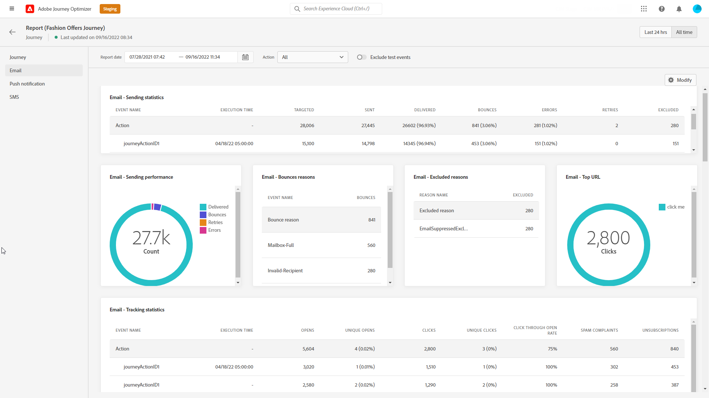

# Informe global de recorrido {#journey-global-report}

>[!CONTEXTUALHELP]
>id="ajo_journey_global_report"
>title="Informe global de recorrido"
>abstract="El informe global de recorrido permite medir el impacto de sus recorridos durante un período de tiempo seleccionado. El informe se divide en distintos widgets que detallan el éxito y los errores del recorrido. Cada tablero de informes se puede modificar cambiando el tamaño o eliminando los widgets."

Se puede acceder al informe global de recorrido directamente desde el recorrido con la variable **[!UICONTROL Ver informe]** botón.

El recorrido **[!UICONTROL Informe global]** se muestra con las siguientes pestañas:

* [ Recorrido ](#journey-global)
* [Correo electrónico](#email-global)
* [Push](#push-global)
* [SMS](#sms-global)

El recorrido **[!UICONTROL Informe global]** se divide en distintas utilidades que detallan el éxito y los errores de su recorrido. Se puede cambiar el tamaño de cada widget y eliminarlo si es necesario. Para obtener más información, consulte [sección](global-report.md#modify-dashboard).

Para obtener una lista detallada de todas las métricas disponibles en Adobe Journey Optimizer, consulte [esta página](global-report.md#list-of-components-global).

## ficha recorrido {#journey-global}

Desde su recorrido **[!UICONTROL Informe global]**, el **[!UICONTROL Recorrido]** le proporciona una vista clara de los datos de seguimiento más importantes sobre su recorrido.

+++Obtenga más información sobre las distintas métricas y utilidades disponibles para el informe de Recorrido.

La variable **[!UICONTROL Rendimiento del recorrido]** permite ver la ruta de los perfiles de destino paso a paso a través del recorrido.

La variable **[!UICONTROL Estadísticas de recorrido]** muestra los siguientes KPI:

* **[!UICONTROL Perfiles introducidos]**: Número total de personas que llegaron al evento de entrada del recorrido.

* **[!UICONTROL Perfiles de salida]**: Número total de personas que salieron del recorrido.

* **[!UICONTROL Error en el recorrido individual]**: Número total de recorridos individuales que no se ejecutaron correctamente.

La variable **[!UICONTROL Eventos recibidos por evento]**, **[!UICONTROL Eventos por origen]** y **[!UICONTROL Eventos principales]** las utilidades permiten ver cuál de sus **[!UICONTROL Eventos]** se ejecutó correctamente mediante gráficos y tablas.

**[!UICONTROL Rendimiento de la acción]**, **[!UICONTROL Motivos del error de acción]** y **[!UICONTROL Acciones principales]** las utilidades representan la acción más exitosa y los errores que se produjeron al **[!UICONTROL Acciones]** se activaron.

La variable **[!UICONTROL Acciones principales]** contiene los datos disponibles para **[!UICONTROL Acciones]**, como:

* **[!UICONTROL Acciones ejecutadas correctamente]**: Número total de **[!UICONTROL Acciones]** se ejecutó correctamente para un recorrido.

* **[!UICONTROL Error en la acción]**: Número total de errores que se han producido para **[!UICONTROL Acciones]**.

La variable **[!UICONTROL Políticas de consentimiento]** tabla y gráfico muestran el número de perfiles excluidos de cada directiva en sus acciones personalizadas.
Para obtener más información sobre las acciones personalizadas, consulte [la documentación detallada](../action/about-custom-action-configuration.md).

Tenga en cuenta que para que estas utilidades aparezcan en los informes de Recorridos, deberá restablecer los tableros. Para ello, haga clic en **[!UICONTROL Modificar]** then **[!UICONTROL Restablecer]** en la parte superior del informe.
+++

## Ficha Correo electrónico {#email-global}

Desde su recorrido **[!UICONTROL Informe global]**, el **[!UICONTROL Correo electrónico]** La pestaña detalla la información principal relativa a los envíos de correo electrónico realizados en el recorrido.

+++Obtenga más información sobre las distintas métricas y utilidades disponibles para el informe Correo electrónico .

La variable **[!UICONTROL Estadísticas de envío de correo electrónico]** graph detalla el éxito de la entrega:

* **[!UICONTROL Segmentado]**: Número de perfiles dirigidos por el Journey Orchestration de Adobe para cualquier acción, como enviar correo electrónico o SMS.

* **[!UICONTROL Enviado]**: Número total de envíos para la entrega.

* **[!UICONTROL Entrega]**: Número de mensajes enviados correctamente, en relación con el número total de mensajes enviados.

* **[!UICONTROL Tasa de entrega]**: Porcentaje de mensajes enviados correctamente.

* **[!UICONTROL Devoluciones]**: Total de errores acumulados durante la entrega y el procesamiento automático de devoluciones en relación con la cantidad total de mensajes enviados.

* **[!UICONTROL Tasa de devoluciones]**: Porcentaje de correos electrónicos devueltos en comparación con los correos electrónicos enviados.

* **[!UICONTROL Errores]**: Número total de errores que se han producido durante una entrega que impiden que se envíe a perfiles.

* **[!UICONTROL Tasa de error]**: Porcentaje de errores que se produjeron durante una entrega que impiden que se envíe en comparación con los correos electrónicos enviados.

La variable **[!UICONTROL Correo electrónico: estadísticas de seguimiento]** contiene los datos disponibles para la actividad de destinatario para su envío:

* **[!UICONTROL Aperturas]**: Número de veces que se abrió la entrega en una entrega.

* **[!UICONTROL Aperturas únicas]**: Porcentaje de envíos abiertos.

* **[!UICONTROL Tasa de apertura única]**: Número total de correos electrónicos abiertos comparados con el número de correos electrónicos enviados.

* **[!UICONTROL Clics]**: Número de veces que se hizo clic en un contenido en un correo electrónico.

* **[!UICONTROL Clics únicos]**: número de destinatarios que hicieron clic en un contenido en un correo electrónico.

* **[!UICONTROL Tasa de pulsaciones]**: Porcentaje de usuarios que interactuaron con el recorrido.

* **[!UICONTROL Cancelar suscripción]**: Número de clics en el vínculo de baja de suscripción.

* **[!UICONTROL Reclamaciones por correo no deseado]**: Número de veces que un mensaje se declaró como correo no deseado o no deseado.

La variable **[!UICONTROL Envío de estadísticas]** El gráfico contiene los datos disponibles para los correos electrónicos enviados, como:

* **[!UICONTROL Entrega]**: Número de mensajes enviados correctamente, en relación con el número total de mensajes enviados.

* **[!UICONTROL Devoluciones]**: Total de errores acumulados durante la entrega y el procesamiento automático de devoluciones en relación con la cantidad total de mensajes enviados.

* **[!UICONTROL Errores]**: Número total de errores que se han producido durante una entrega que impiden que se envíe a perfiles.

La variable **[!UICONTROL Razones de devolución]** y **[!UICONTROL Categorías de rebote]** los widgets contienen los datos disponibles relacionados con los mensajes devueltos, como:

* **[!UICONTROL Rechazo grave]**: El número total de errores permanentes, como una dirección de correo electrónico incorrecta. Esto implica un mensaje de error que indica explícitamente que la dirección no es válida, como Usuario desconocido.

* **[!UICONTROL Rechazo suave]**: El número total de errores temporales, como una bandeja de entrada completa.

* **[!UICONTROL Ignorado]**: El número total de mensajes temporales, como fuera de la oficina o un error técnico, por ejemplo, si el tipo de remitente es administrador de correo.

Para obtener más información sobre las devoluciones, consulte la sección [Lista de supresión](../reports/suppression-list.md) página.

La variable **[!UICONTROL Motivos del error]** El gráfico y la tabla permiten ver qué error se produjo durante el envío.

La variable **[!UICONTROL Motivos excluidos]** en el gráfico y la tabla se muestran las diferentes razones que impidieron que los perfiles de usuario, excluidos de los perfiles de destino, recibieran el mensaje.

La variable **[!UICONTROL Correo Electrónico: Dirección Url Principal]** gráfico y tabla detallan las direcciones URL de su envío que son las más visitadas.

La variable **[!UICONTROL Correo electrónico: dominio de destinatario principal]** gráfico y tabla detallan qué dominios son los más utilizados por los destinatarios para abrir el correo electrónico.

>[!NOTE]
>
>La variable **[!UICONTROL Optimizado frente a no optimizado]** y **[!UICONTROL Optimización del tiempo de envío]**  las utilidades solo están disponibles si la opción de optimización del tiempo de envío está activada para la entrega. Para obtener más información sobre la optimización del tiempo de envío, consulte [esta página](../building-journeys/journeys-message.md#send-time-optimization).

La variable **[!UICONTROL Optimizado frente a no optimizado]** graph detalla la información principal relativa al mensaje, independientemente de si están optimizados o no:

* **[!UICONTROL Enviado]**: Número total de envíos para la entrega.
* **[!UICONTROL Aperturas]**: Número de veces que se abrió la entrega en una entrega.
* **[!UICONTROL Clics]**: Número de veces que se hizo clic en un contenido en un correo electrónico.

La variable **[!UICONTROL Optimización del tiempo de envío]** detalla el éxito de la entrega en función del método de envío: optimizado o normal.

* **[!UICONTROL Entrega]**: Número de mensajes enviados correctamente, en relación con el número total de mensajes enviados.
* **[!UICONTROL Devoluciones]**: Total de errores acumulados durante la entrega y el procesamiento automático de devoluciones en relación con la cantidad total de mensajes enviados.

>[!NOTE]
>
>Las métricas y las utilidades de Ofertas solo están disponibles si se ha insertado una decisión en un mensaje de correo electrónico. Para obtener más información sobre la gestión de decisiones, consulte esta [página](../offers/get-started/starting-offer-decisioning.md).

La variable **[!UICONTROL Estadística de ofertas]** y **[!UICONTROL Estadísticas de ofertas]** a lo largo del tiempo, los widgets miden el éxito y el impacto de su oferta en la audiencia de destino. Detalla la información principal relativa al mensaje con KPI:

* **[!UICONTROL Oferta enviada]**: Número total de envíos para la oferta.

* **[!UICONTROL Impresión de oferta]**: Número de veces que la oferta se abrió en una entrega.

* **[!UICONTROL Clics en ofertas]**: Número de veces que se hizo clic en una oferta en una entrega.

La variable **[!UICONTROL Ofertas estadísticas detalladas]** contiene los datos disponibles para la actividad del destinatario con su oferta:

* **[!UICONTROL Nombre de colocación]**: Nombre de la ubicación utilizada para mostrar la oferta. Para obtener más información sobre la colocación, consulte esta [página](../offers/offer-library/creating-placements.md).

* **[!UICONTROL Nombre de la oferta]**: Nombre de la oferta añadida en la entrega. Para obtener más información sobre la colocación, consulte esta [página](../offers/offer-library/creating-personalized-offers.md).

* **[!UICONTROL Oferta enviada]**: Número total de envíos para la oferta.

* **[!UICONTROL Tasa de impresión de la oferta]**: Porcentaje de ofertas abiertas comparadas con el número de ofertas enviadas.

* **[!UICONTROL Tasa de clics de ofertas]**: Porcentaje de usuarios que interactuaron con la oferta.
+++

## Pestaña de notificaciones push {#push-global}

Desde su recorrido **[!UICONTROL Informe global]**, el **[!UICONTROL Notificaciones push]** detalla la información principal relativa a los envíos push realizados en el recorrido.

+++Obtenga más información sobre las distintas métricas y utilidades disponibles para el informe push.

La variable **[!UICONTROL Notificaciones push: estadísticas de envío]** la tabla detalla la información principal relativa a las notificaciones push con gráficos y KPI:

* **[!UICONTROL Segmentado]**: Número de perfiles dirigidos por el Journey Orchestration de Adobe para cualquier acción, como enviar correo electrónico o SMS.

* **[!UICONTROL Enviado]**: Número total de envíos para la entrega.

* **[!UICONTROL Entrega]**: Número de mensajes enviados correctamente, en relación con el número total de mensajes enviados.

* **[!UICONTROL Tasa de entrega]**: Porcentaje de mensajes enviados correctamente.

* **[!UICONTROL Devoluciones]**: Total de errores acumulados durante la entrega y el procesamiento automático de devoluciones en relación con la cantidad total de mensajes enviados.

* **[!UICONTROL Tasa de devoluciones]**: Porcentaje de notificaciones push que rebotaron en comparación con las notificaciones push enviadas.

* **[!UICONTROL Errores]**: Número total de errores que se han producido durante una entrega que impiden que se envíe a perfiles.

* **[!UICONTROL Tasa de error]**: Porcentaje de errores que se produjeron durante una entrega que impiden que se envíe comparado con las notificaciones push enviadas.

La variable **[!UICONTROL Push - Tracking statistics]** contiene los datos disponibles para la actividad de destinatario para su envío:

* **[!UICONTROL Aperturas]**: Número de veces que se abrió un mensaje en una entrega.

* **[!UICONTROL Tasa de apertura]**: Porcentaje de notificaciones push abiertas.

* **[!UICONTROL Acciones]**: Número total de acciones realizadas en la notificación push entregada, por ejemplo, hacer clic en un botón o rechazar una solicitud.

* **[!UICONTROL Participaciones]**: Número total de aperturas y acciones para esta notificación push, es decir, si el perfil abrió la notificación push o si se hizo clic en un botón.

* **[!UICONTROL Tasa de participación]**: Porcentaje de aperturas y acciones para esta notificación push, es decir, si el perfil abrió la notificación push o si se hizo clic en un botón.

La variable **[!UICONTROL Resumen de notificaciones push]** El gráfico contiene los datos disponibles para las notificaciones push enviadas, como:

* **[!UICONTROL Aperturas]**: Número de veces que se abrió un mensaje en una entrega.

* **[!UICONTROL Acciones]**: Número total de acciones realizadas en la notificación push entregada, por ejemplo, hacer clic en un botón o rechazar una solicitud.

* **[!UICONTROL Devoluciones]**: Total de errores acumulados durante la entrega y el procesamiento automático de devoluciones en relación con la cantidad total de mensajes enviados.

* **[!UICONTROL Entrega]**: Número de mensajes enviados correctamente, en relación con el número total de mensajes enviados.

* **[!UICONTROL Errores]**: Número total de errores que se han producido durante una entrega que impiden que se envíe a perfiles.

>[!NOTE]
>
>La variable **[!UICONTROL Optimizado frente a no optimizado]** y **[!UICONTROL Optimización del tiempo de envío]**  las utilidades solo están disponibles si la opción de optimización del tiempo de envío está activada para la entrega. Para obtener más información sobre la optimización del tiempo de envío, consulte [esta página](../building-journeys/journeys-message.md#send-time-optimization).

La variable **[!UICONTROL Optimizado frente a no optimizado]** graph detalla la información principal relativa al mensaje, independientemente de si están optimizados o no:

* **[!UICONTROL Entrega]**: Número de mensajes enviados correctamente, en relación con el número total de mensajes enviados.
* **[!UICONTROL Aperturas]**: Número de veces que se abrió la entrega en una entrega.
* **[!UICONTROL Acciones]**: Número total de acciones realizadas en la notificación push entregada, por ejemplo, hacer clic en un botón o rechazar una solicitud.

La variable **[!UICONTROL Optimización del tiempo de envío]** detalla el éxito de la entrega en función del método de envío: optimizado o normal.

* **[!UICONTROL Entrega]**: Número de mensajes enviados correctamente, en relación con el número total de mensajes enviados.
* **[!UICONTROL Devoluciones]**: Total de errores acumulados durante la entrega y el procesamiento automático de devoluciones en relación con la cantidad total de mensajes enviados.

La variable **[!UICONTROL Motivos del error]** El gráfico y la tabla permiten ver qué error se produjo durante el envío.

La variable **[!UICONTROL Motivos excluidos]** en el gráfico y la tabla se muestran las diferentes razones que impidieron que los perfiles de usuario, excluidos de los perfiles de destino, recibieran el mensaje.

La variable **[!UICONTROL Seguimiento por plataforma]**, **[!UICONTROL Envío por plataforma]** y **[!UICONTROL Desglose por plataforma]** gráficos y tablas detallan el éxito de la notificación push en función del sistema operativo del destinatario.

El SMS **[!UICONTROL Informe global]** se divide en distintas utilidades que detallan el éxito y los errores de su envío. Se puede cambiar el tamaño de cada widget y eliminarlo si es necesario. Para obtener más información, consulte [sección](global-report.md#modify-dashboard).
+++

## Ficha SMS {#sms-global}

+++Obtenga más información sobre las distintas métricas y utilidades disponibles para el informe SMS.

La variable **[!UICONTROL SMS: estadísticas de envío]** La tabla detalla el éxito de la entrega:

* **[!UICONTROL Segmentado]**: Número de perfiles de usuario que se califican como perfiles de destinatario para este envío.

* **[!UICONTROL Excluido]**: Número de perfiles de usuario, excluidos de los perfiles de destino, que no recibieron el mensaje.

* **[!UICONTROL Enviado]**: Número total de envíos para la entrega.

* **[!UICONTROL Entrega]**: Número de mensajes enviados correctamente, en relación con el número total de mensajes enviados.

* **[!UICONTROL Devoluciones]**: Total de errores acumulados durante la entrega y el procesamiento automático de devoluciones en relación con la cantidad total de mensajes enviados.

* **[!UICONTROL Errores]**: Número total de errores que se han producido durante una entrega que impiden que se envíe a perfiles.

La variable **[!UICONTROL Resumen de SMS]** La utilidad detalla la información principal relativa al mensaje con un gráfico:

* **[!UICONTROL Enviado]**: Número total de envíos para la entrega.

* **[!UICONTROL Entrega]**: Número de mensajes enviados correctamente, en relación con el número total de mensajes enviados.

* **[!UICONTROL Devoluciones]**: Total de errores acumulados durante la entrega y el procesamiento automático de devoluciones en relación con la cantidad total de mensajes enviados.

* **[!UICONTROL Errores]**: Número total de errores que se han producido durante una entrega que impiden que se envíe a perfiles.

La variable **[!UICONTROL Excluir motivos]** los gráficos y las tablas permiten ver qué error y exclusiones se produjeron durante el envío.

La variable **[!UICONTROL SMS: clics por vínculos]** y **[!UICONTROL SMS - Estadísticas de seguimiento]** las utilidades detallan la información principal relativa a la participación de los visitantes en las direcciones URL.

+++
