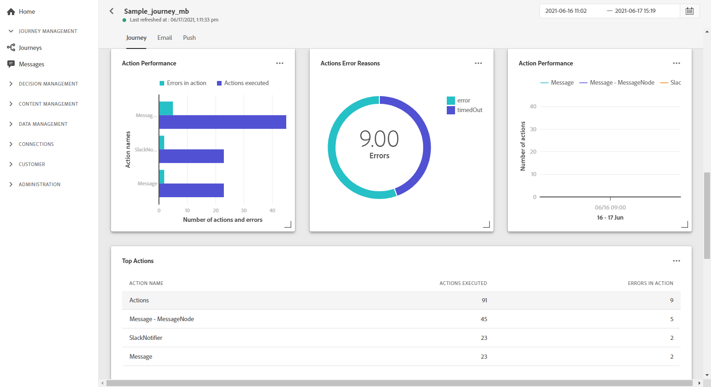
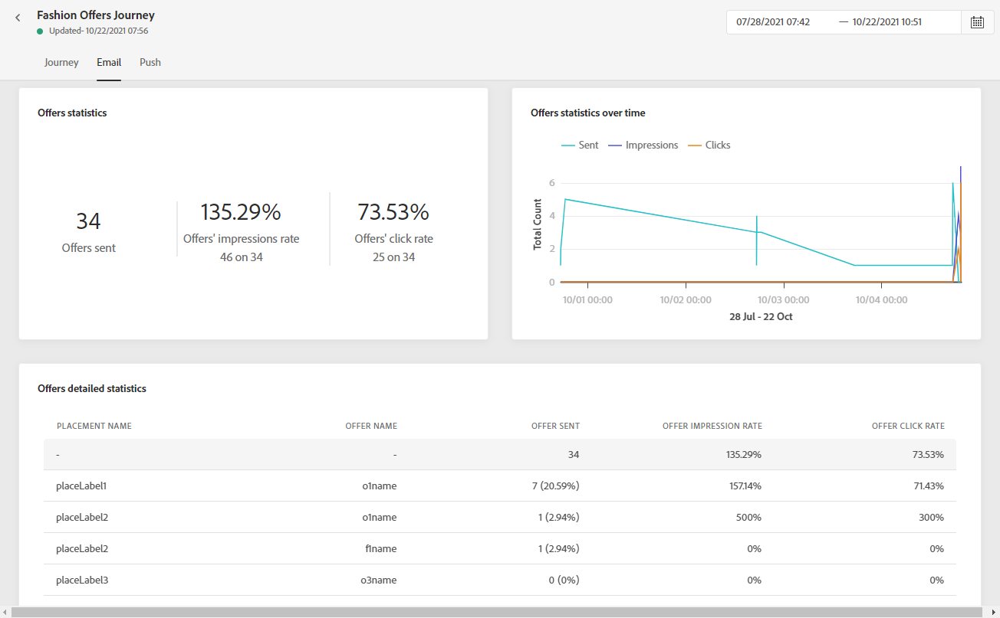

# Informe global de recorrido {#journey-global-report}

Se puede acceder al informe global de recorrido directamente desde el recorrido con la variable **[!UICONTROL Global report]** botón.

El recorrido **[!UICONTROL Global report]** se muestra con las siguientes pestañas:

* [Recorrido](#journey-global)
* [Correo electrónico](#email-global)
* [Push](#push-global)

El recorrido **[!UICONTROL Global report]** se divide en distintas utilidades que detallan el éxito y los errores de su recorrido. Se puede cambiar el tamaño de cada widget y eliminarlo si es necesario. Para obtener más información, consulte [sección](global-report.md#modify-dashboard).

## ficha recorrido {#journey-global}

Desde su recorrido **[!UICONTROL Global report]**, el **[!UICONTROL Journey]** le proporciona una vista clara de los datos de seguimiento más importantes sobre su recorrido.

La variable **[!UICONTROL Journey Performance]** permite ver la ruta de los perfiles de destino paso a paso a través del recorrido.

La variable **[!UICONTROL Journey Statistics]** muestra los siguientes KPI:

* **[!UICONTROL Entered profiles]**: Número total de personas que llegaron al evento de entrada del recorrido.

* **[!UICONTROL Exited profiles]**: Número total de personas que salieron del recorrido.

* **[!UICONTROL Failed individual journey]**: Número total de recorridos individuales que no se ejecutaron correctamente.

La variable **[!UICONTROL Events received by event]**, **[!UICONTROL Events by origin]** y **[!UICONTROL Top events]** las utilidades permiten ver cuál de sus **[!UICONTROL Events]** se ejecutó correctamente mediante gráficos y tablas.

**[!UICONTROL Action Performance]**, **[!UICONTROL Action Error Reasons]** y **[!UICONTROL Top Actions]** las utilidades representan la acción más exitosa y los errores que se produjeron al **[!UICONTROL Actions]** se activaron.

La variable **[!UICONTROL Top Actions]** contiene los datos disponibles para **[!UICONTROL Actions]**, como:

* **[!UICONTROL Actions successfully executed]**: Número total de **[!UICONTROL Actions]** se ejecutó correctamente para un recorrido.

* **[!UICONTROL Error in action]**: Número total de errores que se han producido para **[!UICONTROL Actions]**.

## Ficha Correo electrónico {#email-global}

Desde su recorrido **[!UICONTROL Global report]**, el **[!UICONTROL Email]** La pestaña detalla la información principal relativa a los envíos de correo electrónico realizados en el recorrido.

Para obtener un informe detallado sobre un envío de correo electrónico específico, consulte la [Informe global de correo electrónico](#email-global-report) para obtener más información.

La variable **[!UICONTROL Email Sending Statistics]** graph detalla el éxito de la entrega:

* **[!UICONTROL Sent]**: Número total de envíos para la entrega.

* **[!UICONTROL Delivered]**: Número de mensajes enviados correctamente, en relación con el número total de mensajes enviados.

* **[!UICONTROL Delivery Rate]**: Porcentaje de mensajes enviados correctamente.

* **[!UICONTROL Bounces]**: Total de errores acumulados durante la entrega y el procesamiento automático de devoluciones en relación con la cantidad total de mensajes enviados.

* **[!UICONTROL Bounce Rate]**: Porcentaje de correos electrónicos devueltos en comparación con los correos electrónicos enviados.

* **[!UICONTROL Errors]**: Número total de errores que se han producido durante una entrega que impiden que se envíe a perfiles.

* **[!UICONTROL Error Rate]**: Porcentaje de errores que se produjeron durante una entrega que impiden que se envíe en comparación con los correos electrónicos enviados.

La variable **[!UICONTROL Email - Tracking statistics]** contiene los datos disponibles para la actividad de destinatario para su envío:

* **[!UICONTROL Opens]**: Número de veces que se abrió la entrega en una entrega.

* **[!UICONTROL Unique Opens]**: Porcentaje de envíos abiertos.

* **[!UICONTROL Open Rate]**: Número total de correos electrónicos abiertos comparados con el número de correos electrónicos enviados.

* **[!UICONTROL Clicks]**: Número de veces que se hizo clic en un contenido en un correo electrónico.

* **[!UICONTROL Unique Clicks]**: número de destinatarios que hicieron clic en un contenido en un correo electrónico.

* **[!UICONTROL Click through rate]**: Porcentaje de usuarios que interactuaron con el recorrido.

* **[!UICONTROL Unsubscribe]**: Número de clics en el vínculo de baja de suscripción.

* **[!UICONTROL Spam complaints]**: Número de veces que un mensaje se declaró como correo no deseado o no deseado.

La variable **[!UICONTROL Sending Statistics]** El gráfico contiene los datos disponibles para los correos electrónicos enviados, como:

* **[!UICONTROL Delivered]**: Número de mensajes enviados correctamente, en relación con el número total de mensajes enviados.

* **[!UICONTROL Bounces]**: Total de errores acumulados durante la entrega y el procesamiento automático de devoluciones en relación con la cantidad total de mensajes enviados.

* **[!UICONTROL Errors]**: Número total de errores que se han producido durante una entrega que impiden que se envíe a perfiles.

La variable **[!UICONTROL Bounce Reasons]** y **[!UICONTROL Bounce categories]** los widgets contienen los datos disponibles relacionados con los mensajes devueltos, como:

* **[!UICONTROL Hard bounce]**: El número total de errores permanentes, como una dirección de correo electrónico incorrecta. Esto implica un mensaje de error que indica explícitamente que la dirección no es válida, como Usuario desconocido.

* **[!UICONTROL Soft bounce]**: El número total de errores temporales, como una bandeja de entrada completa.

* **[!UICONTROL Ignored]**: El número total de mensajes temporales, como fuera de la oficina o un error técnico, por ejemplo, si el tipo de remitente es administrador de correo.

Para obtener más información sobre las devoluciones, consulte la sección [Lista de supresión](../suppression-list.md) página.

La variable **[!UICONTROL Email - Top Url]** gráfico y tabla detallan las direcciones URL de su envío que son las más visitadas.

La variable **[!UICONTROL Email - Top recipient domain]** gráfico y tabla detallan qué dominios son los más utilizados por los destinatarios para abrir el correo electrónico.

<!--

>[!NOTE]
>
>The Offers widgets and metrics are only available if a decision was inserted in an email. For more information on Decision Management, refer to this [page](../offers/get-started/starting-offer-decisioning.md).

The **[!UICONTROL Offers statistic]** and **[!UICONTROL Offers statistics]** over time widgets measure your offer's success and impact on your targeted audience. It detail the main information relative to your message with KPIs:

* **[!UICONTROL Offer sent]**: Total number of sends for the offer.

* **[!UICONTROL Offer impression]**: Number of times the offer was opened in a delivery.

* **[!UICONTROL Offer clicks]**: Number of times an offer was clicked on in a delivery.

The **[!UICONTROL Offers detailed statistic]** table contains the available data for recipient activity with your offer:

* **[!UICONTROL Placement name]**: Name of your placement used to display your offer. For more information on placement, refer to this [page](../offers/offer-library/creating-placements.md).

* **[!UICONTROL Offer name]**: Name of the offer added in the delivery. For more information on placement, refer to this [page](../offers/offer-library/creating-personalized-offers.md).

* **[!UICONTROL Offer sent]**: Total number of sends for the offer.

* **[!UICONTROL Offer impression rate]**: Percentage of opened offers compared to the number of sent offers.

* **[!UICONTROL Offer click rate]**: Percentage of users who interacted with the offer.
-->

## Ficha Insertar {#push-global}

Desde su recorrido **[!UICONTROL Global report]**, el **[!UICONTROL Push]** detalla la información principal relativa a los envíos push realizados en el recorrido.

Para obtener un informe detallado sobre una entrega push específica, consulte esta sección [Insertar informe global](#push-global-report).

La variable **[!UICONTROL Push notification - Sending statistics]** la tabla detalla la información principal relativa a las notificaciones push con gráficos y KPI:

* **[!UICONTROL Sent]**: Número total de envíos para la entrega.

* **[!UICONTROL Delivered]**: Número de mensajes enviados correctamente, en relación con el número total de mensajes enviados.

* **[!UICONTROL Delivery Rate]**: Porcentaje de mensajes enviados correctamente.

* **[!UICONTROL Bounces]**: Total de errores acumulados durante la entrega y el procesamiento automático de devoluciones en relación con la cantidad total de mensajes enviados.

* **[!UICONTROL Bounce Rate]**: Porcentaje de notificaciones push que rebotaron en comparación con las notificaciones push enviadas.

* **[!UICONTROL Errors]**: Número total de errores que se han producido durante una entrega que impiden que se envíe a perfiles.

* **[!UICONTROL Error Rate]**: Porcentaje de errores que se produjeron durante una entrega que impiden que se envíe comparado con las notificaciones push enviadas.

La variable **[!UICONTROL Push - Tracking statistics]** contiene los datos disponibles para la actividad de destinatario para su envío:

* **[!UICONTROL Opens]**: Número de veces que se abrió un mensaje en una entrega.

* **[!UICONTROL Open Rate]**: Porcentaje de notificaciones push abiertas.

* **[!UICONTROL Actions]**: Número total de acciones realizadas en la notificación push entregada, por ejemplo, hacer clic en un botón o rechazar una solicitud.

* **[!UICONTROL Engagements]**: Número total de aperturas y acciones para esta notificación push, es decir, si el perfil abrió la notificación push o si se hizo clic en un botón.

* **[!UICONTROL Engagement Rate]**: Porcentaje de aperturas y acciones para esta notificación push, es decir, si el perfil abrió la notificación push o si se hizo clic en un botón.

La variable **[!UICONTROL Push notification summary]** El gráfico contiene los datos disponibles para las notificaciones push enviadas, como:

* **[!UICONTROL Opens]**: Número de veces que se abrió un mensaje en una entrega.

* **[!UICONTROL Actions]**: Número total de acciones realizadas en la notificación push entregada, por ejemplo, hacer clic en un botón o rechazar una solicitud.

* **[!UICONTROL Bounces]**: Total de errores acumulados durante la entrega y el procesamiento automático de devoluciones en relación con la cantidad total de mensajes enviados.

* **[!UICONTROL Delivered]**: Número de mensajes enviados correctamente, en relación con el número total de mensajes enviados.

* **[!UICONTROL Errors]**: Número total de errores que se han producido durante una entrega que impiden que se envíe a perfiles.

La variable **[!UICONTROL Error Reasons]** El gráfico y la tabla permiten ver qué error se produjo durante el envío.

La variable **[!UICONTROL Tracking by platform]**, **[!UICONTROL Sending by platform]** y **[!UICONTROL Breakdown by platform]** gráficos y tablas detallan el éxito de la notificación push en función del sistema operativo del destinatario.
