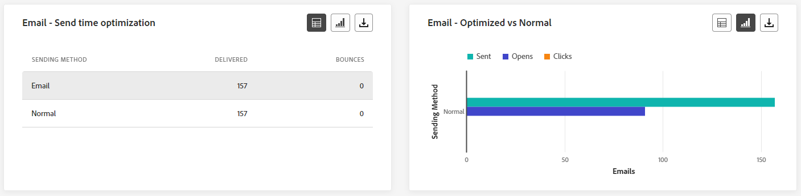

# Informe global de recorrido {#journey-global-report}

>[!CONTEXTUALHELP]
>id="ajo_journey_global_report"
>title="Informe global de recorrido"
>abstract="El informe global del recorrido permite medir el impacto de sus recorridos durante un período de tiempo seleccionado. El informe se divide en distintos widgets que detallan el éxito y los errores del recorrido. Cada tablero de informes se puede modificar cambiando el tamaño de los widgets o eliminándolos."

>[!AVAILABILITY]
>
>La experiencia actual de creación de informes se eliminará a partir de enero de 2025. Después de esta fecha, la nueva experiencia de creación de informes pasará a ser el estándar. Recomendamos que se familiarice con las nuevas funciones y características para garantizar una transición sin problemas. [Introducción a la nueva interfaz de informes de Journey Optimizer.](report-gs-cja.md)

Los informes globales, a los que se puede acceder desde la pestaña Todo el tiempo, muestran los eventos que se produjeron hace al menos dos horas y cubren los eventos de un periodo de tiempo seleccionado. En comparación, los informes en directo se centran en los eventos que han tenido lugar en las últimas 24 horas, con un intervalo de tiempo mínimo de dos minutos desde que se produjo el evento.

Se puede acceder directamente al informe global de recorrido desde su recorrido con el botón **[!UICONTROL Ver informe]**.

La página del recorrido **[!UICONTROL Informe global]** se mostrará con las siguientes fichas:

* [ Recorrido ](#journey-global)
* [Correo electrónico](#email-global)
* [Push](#push-global)
* [SMS](#sms-global)
* [En la aplicación](#in-app-global)

El recorrido **[!UICONTROL Informe global]** está dividido en diferentes widgets que detallan el éxito y los errores de su recorrido. Se puede cambiar el tamaño de cada widget y eliminarlo si es necesario. Para obtener más información, consulte esta [sección](global-report.md#modify-dashboard).

Para obtener una lista detallada de todas las métricas disponibles en Adobe Journey Optimizer, consulte [esta página](global-report.md#list-of-components-global).

## pestaña recorrido {#journey-global}

Desde tu **[!UICONTROL informe global]** de recorrido, la pestaña **[!UICONTROL Recorrido]** te ofrece una vista clara de los datos de seguimiento más importantes sobre tu recorrido.

### Rendimiento del recorrido {#journey-perfomance}

>[!CONTEXTUALHELP]
>id="ajo_journey_performance"
>title="Rendimiento del recorrido"
>abstract="El widget Rendimiento del recorrido le permite seguir visualmente la ruta de sus perfiles objetivo a medida que avanzan por su recorrido."

El widget **[!UICONTROL Rendimiento del Recorrido]** le permite rastrear visualmente la trayectoria de sus perfiles de destino a medida que navegan por su recorrido.

Tenga en cuenta que el recuento de perfiles de un nodo solo se actualiza una vez que el perfil lo ha completado, no al introducirlo. Por ejemplo, un perfil en un nodo **Wait** solo se cuenta una vez que se alcanza la fecha especificada y el perfil se ha salido del nodo.

### Estadísticas del recorrido {#journey-statistics}

>[!CONTEXTUALHELP]
>id="ajo_journey_statistics"
>title="Estadísticas del recorrido"
>abstract="Los indicadores clave de rendimiento (KPI) de las estadísticas del recorrido sirven como un panel completo, proporcionando un análisis en profundidad de las métricas esenciales relacionadas con su recorrido."

Los indicadores clave de rendimiento (KPI) de **[!UICONTROL Estadísticas de Recorrido]** funcionan como un tablero integral que ofrece un análisis de las métricas esenciales asociadas con su recorrido. Esto incluye detalles como el recuento de perfiles introducidos y los casos de recorridos individuales fallidos, lo que ofrece una perspectiva completa de la eficacia y el nivel de participación de su recorrido.

+++ Más información sobre las métricas de Estadísticas de Recorrido

* **[!UICONTROL Perfiles introducidos]**: Número total de individuos que alcanzaron el evento de entrada del recorrido.

* **[!UICONTROL Perfiles abandonados]**: Número total de individuos que salieron del recorrido.

* **[!UICONTROL recorrido individual con errores]**: Número total de recorridos individuales que no se ejecutaron correctamente.

+++

### Rendimiento de las acciones {#action-performance}

>[!CONTEXTUALHELP]
>id="ajo_journey_action_performance"
>title="Rendimiento de las acciones"
>abstract="El widget Rendimiento de las acciones ilustra las acciones más exitosas que tuvieron lugar cuando se iniciaron sus acciones."

El widget **[!UICONTROL Rendimiento de la acción]** representa las acciones más exitosas que ocurrieron cuando se activaron las **[!UICONTROL acciones]**.

### Acciones principales {#top-actions}

>[!CONTEXTUALHELP]
>id="ajo_journey_top_actions"
>title="Acciones principales"
>abstract="La tabla Acciones principales consolida la información vital sobre sus acciones, ofreciendo observaciones concisas tanto sobre la frecuencia como sobre la eficacia de cada acción."

La tabla **[!UICONTROL Acciones principales]** compila datos esenciales sobre sus **[!UICONTROL Acciones]**. Proporciona una perspectiva sucinta de la frecuencia y el rendimiento de cada acción.

+++ Más información sobre las Métricas de acciones principales

* **[!UICONTROL Acciones ejecutadas correctamente]**: Número total de **[!UICONTROL Acciones]** ejecutadas correctamente para un recorrido.

* **[!UICONTROL Error en la acción]**: Número total de errores que se produjeron para **[!UICONTROL Acciones]**.

+++

### Motivos de error de las acciones {#action-error}

>[!CONTEXTUALHELP]
>id="ajo_journey_actions_error_reasons"
>title="Motivos de error de las acciones"
>abstract="La tabla y el gráfico Motivos de error de las acciones proporcionan un resumen exhaustivo de los errores encontrados durante la ejecución de sus acciones, ofreciendo información general completa de los problemas que pueden haberse producido."

La tabla y el gráfico de **[!UICONTROL Motivos de error de acción]** ofrecen una descripción general de los errores que se produjeron durante la ejecución de **[!UICONTROL Acciones]**.

### Eventos por origen {#events-origin}

>[!CONTEXTUALHELP]
>id="ajo_journey_events_origin"
>title="Eventos por origen"
>abstract="La tabla y los gráficos Eventos por origen ofrecen una vista del éxito de recepción de sus eventos. Estas representaciones visuales le permiten identificar con precisión los eventos que se han recibido de forma efectiva, proporcionándole información valiosa sobre el rendimiento y el impacto de cada evento dentro de su recorrido."

La tabla y los gráficos de **[!UICONTROL Eventos por origen]** proporcionan una perspectiva detallada sobre la recepción exitosa de sus **[!UICONTROL eventos]**. A través de estas representaciones visuales, puede discernir con precisión cuáles de sus **[!UICONTROL eventos]** se recibieron de manera efectiva, lo que ofrece información valiosa sobre el rendimiento y el impacto de los eventos individuales dentro de su recorrido.

### Eventos recibidos por evento {#events-received}

>[!CONTEXTUALHELP]
>id="ajo_journey_events_received"
>title="Eventos recibidos por evento"
>abstract="El gráfico Eventos recibidos por evento le permite identificar y analizar los eventos específicos de su recorrido que se han ejecutado con eficacia, proporcionándole información valiosa sobre el rendimiento y las tasas de éxito de los eventos individuales."

El gráfico **[!UICONTROL Eventos recibidos por evento]** le permite identificar y analizar qué **[!UICONTROL evento]** específico de su recorrido se ejecutó de forma eficaz, lo que proporciona una valiosa perspectiva del rendimiento y las tasas de éxito de los eventos individuales.

### Eventos principales {#top-events}

>[!CONTEXTUALHELP]
>id="ajo_journey_top_events"
>title="Eventos principales"
>abstract="La tabla Eventos principales consolida los datos esenciales sobre sus eventos, ofreciendo observaciones concisas tanto sobre la frecuencia como sobre el rendimiento de cada evento individual."

La tabla **[!UICONTROL Eventos principales]** recopila datos esenciales sobre **[!UICONTROL Eventos]**. Proporciona información sucinta sobre la frecuencia y el rendimiento de cada **[!UICONTROL evento]**.

### Políticas de consentimiento {#consent-policies}

>[!CONTEXTUALHELP]
>id="ajo_journey_consent_policies"
>title="Políticas de consentimiento"
>abstract="La tabla y el gráfico Políticas de Consentimiento muestran la cantidad de perfiles excluidos de cada política dentro de sus acciones personalizadas. Esta presentación ofrece una visión clara de la influencia de cada política de consentimiento en las exclusiones de perfiles."

La tabla y el gráfico de **[!UICONTROL políticas de consentimiento]** muestran el número de perfiles excluidos de cada política dentro de sus acciones personalizadas. Esto proporciona una perspectiva clara del impacto de cada política de consentimiento en las exclusiones de perfil.

Para obtener más información sobre las acciones personalizadas, consulte [la documentación detallada](../action/about-custom-action-configuration.md).

Tenga en cuenta que para que estos widgets aparezcan en los informes de Recorrido, deberá restablecer los paneles. Para ello, haz clic en **[!UICONTROL Modificar]** y luego en **[!UICONTROL Restablecer]** en la parte superior del informe.

## Pestaña de correo electrónico {#email-global}

En el **[!UICONTROL informe global]** de recorrido, la ficha **[!UICONTROL Correo electrónico]** detalla la información principal relativa a los mensajes de correo electrónico enviados en el recorrido.

### Correo electrónico: estadísticas de envío {#email-sending-statistics}

>[!CONTEXTUALHELP]
>id="ajo_journey_email_sending_statistics"
>title="Correo electrónico: estadísticas de envío"
>abstract="La tabla Correo electrónico: Estadísticas de envío resume los datos esenciales sobre sus correos electrónicos, como los segmentados o enviados."

La tabla **[!UICONTROL Estadísticas de envío de correo electrónico]** proporciona un resumen completo de los datos esenciales relacionados con los correos electrónicos de sus recorridos. Detalla métricas clave como el tamaño de la audiencia objetivo y la cantidad de correos electrónicos enviados correctamente, lo que ofrece perspectivas valiosas sobre la eficacia y el alcance de los correos electrónicos y recorridos.

+++ Más información sobre las métricas de estadísticas de envío de correo electrónico

* **[!UICONTROL Tiempo de ejecución]**: tiempo de inicio de cada ejecución de recorrido en caso de recorridos recurrentes. Para segmentar solo una o varias repeticiones, selecciónelo en la lista desplegable **[!UICONTROL Hora de ejecución]**.

* **[!UICONTROL Segmentación]**: número de perfiles segmentados para cualquier acción, como enviar correo electrónico o SMS.

* **[!UICONTROL Enviado]**: Número total de correos electrónicos enviados para el recorrido.

* **[!UICONTROL Entregado]**: Número de correos electrónicos enviados correctamente, en relación con el número total de correos electrónicos enviados.

* **[!UICONTROL Tasa de entrega]**: Porcentaje de correos electrónicos enviados correctamente.

* **[!UICONTROL Devoluciones]**: Total de errores acumulados durante el proceso de envío y el procesamiento automático de devoluciones en relación con el número total de correos electrónicos enviados.

* **[!UICONTROL Tasa de salida hacia otro sitio]**: Porcentaje de correos electrónicos que se rebotaron en comparación con los enviados.

* **[!UICONTROL Errores]**: Número total de errores que se produjeron durante el proceso de envío para evitar que se enviara a los perfiles.

* **[!UICONTROL Tasa de errores]**: Porcentaje de errores que se produjeron durante el proceso de envío que impiden su envío en comparación con los correos electrónicos enviados.

* **[!UICONTROL Reintentos]**: número de correos electrónicos en cola para reintentos.

* **[!UICONTROL Excluido]**: número de perfiles que han sido excluidos por Adobe Journey Optimizer.

+++

### Correo electrónico: Estadísticas de seguimiento {#email-tracking}

>[!CONTEXTUALHELP]
>id="ajo_journey_email_tracking_statistics"
>title="Correo electrónico: Estadísticas de seguimiento"
>abstract="La tabla Correo electrónico: Estadísticas de seguimiento proporciona datos sobre la actividad del perfil del Correo electrónico."

La tabla **[!UICONTROL Correo electrónico: estadísticas de seguimiento]** ofrece una cuenta detallada de la actividad del perfil relacionada con los correos electrónicos incluidos en el recorrido. Esto incluye métricas sobre aperturas, clics y otros indicadores de participación relevantes, lo que ofrece una vista completa de cómo los perfiles interactúan con el contenido del correo electrónico.

+++ Más información sobre las Métricas de estadísticas de seguimiento de correo electrónico

* **[!UICONTROL Tiempo de ejecución]**: Hora de inicio de cada ejecución del correo electrónico recurrente en el recorrido. Para enviar solo uno o varios correos electrónicos recurrentes, selecciónelos en la lista desplegable **[!UICONTROL Tiempo de ejecución]**.

* **[!UICONTROL Aperturas]**: Número de veces que los mensajes de correo electrónico se abrieron en un recorrido.

* **[!UICONTROL Aperturas únicas]**: Porcentaje de correos electrónicos abiertos.

* **[!UICONTROL Tasa de apertura única]**: Cantidad total de correos electrónicos abiertos en comparación con la cantidad de correos electrónicos enviados.

* **[!UICONTROL Clics]**: Número de veces que se hizo clic en un contenido en sus correos electrónicos.

* **[!UICONTROL Clics únicos]**: Número de destinatarios que hicieron clic en un contenido de sus correos electrónicos.

* **[!UICONTROL Tasa de clics]**: Porcentaje de usuarios que interactuaron con el recorrido.

* **[!UICONTROL Cancelaciones de suscripciones]**: número de clics en el vínculo de cancelación de suscripción.

* **[!UICONTROL Quejas por correo no deseado]**: Número de veces que los mensajes de correo electrónico se declararon como correo no deseado.

+++

### Correo electrónico: rendimiento del envío {#email-performance}

>[!CONTEXTUALHELP]
>id="ajo_journey_email_sending_performance"
>title="Correo electrónico: rendimiento del envío"
>abstract="El gráfico Correo electrónico: rendimiento del envío presenta datos completos sobre los correos electrónicos enviados, ofreciendo perspectivas sobre métricas clave como envíos y rechazos, lo que permite realizar un análisis detallado del proceso de entrega del correo electrónico."

El gráfico **[!UICONTROL Correo electrónico: rendimiento de envío]** proporciona una vista completa de los datos relacionados con los correos electrónicos enviados en el recorrido, y ofrece detalles sobre métricas clave como envíos y devoluciones. Esto permite un análisis detallado del proceso de envío de correo electrónico, lo que proporciona información valiosa sobre la eficacia y el rendimiento de sus recorridos.

+++ Más información sobre el Correo electrónico: envío de métricas de rendimiento

* **[!UICONTROL Entregado]**: Número de correos electrónicos enviados correctamente, en relación con el número total de correos electrónicos enviados.

* **[!UICONTROL Devoluciones]**: Total de errores acumulados durante el proceso de envío y el procesamiento automático de devoluciones en relación con el número total de mensajes enviados.

* **[!UICONTROL Reintentos]**: número de correos electrónicos en cola para reintentos.

* **[!UICONTROL Errores]**: Número total de errores que se produjeron durante un proceso de envío que impidió que se enviara a los perfiles.

+++

### Correo electrónico: categorías y motivos de rechazo {#email-bounce-categories}

>[!CONTEXTUALHELP]
>id="ajo_journey_email_bounces"
>title="Correo electrónico: categorías y motivos de rechazo"
>abstract="Los widgets Correo electrónico: categorías y motivos de rechazo agregan los datos relativos a los mensajes rechazados, ofreciendo una visión en profundidad de los motivos y categorías específicos que contribuyen a los mensajes rechazados."

Los widgets **[!UICONTROL Motivos de rechazo]** y **[!UICONTROL Categorías de rechazo]** compilan los datos disponibles relacionados con los mensajes rechazados, proporcionando una perspectiva detallada de los motivos específicos y las categorías detrás de los rechazos de correo electrónico.

Para obtener más información sobre las devoluciones, consulte la página [Lista de supresión](../reports/suppression-list.md).

+++ Más información sobre las métricas Correo electrónico: categorías de rechazo

* **[!UICONTROL Rechazo grave]**: El número total de errores permanentes, como una dirección de correo electrónico incorrecta. Esto implica un mensaje de error que indica explícitamente que la dirección no es válida, como Usuario desconocido.

* **[!UICONTROL Devolución suave]**: El número total de errores temporales, como una bandeja de entrada completa.

* **[!UICONTROL Omitido]**: El número total de mensajes temporales, como Fuera de la oficina, o un error técnico, por ejemplo, si el tipo de remitente es administrador de correo.

+++

### Correo electrónico: motivos del error {#email-errors}

>[!CONTEXTUALHELP]
>id="ajo_journey_email_error_reasons"
>title="Correo electrónico: motivos del error"
>abstract="El correo electrónico: los gráficos y la tabla Motivos de error permiten le permiten identificar los errores específicos que se produjeron durante el envío."

Los gráficos y la tabla **[!UICONTROL Motivos del error]** ofrecen visibilidad de los errores específicos que se produjeron durante el proceso de envío y proporcionan información valiosa sobre la naturaleza y la incidencia de los errores.

### Correo electrónico: Motivos excluidos {#email-excluded}

>[!CONTEXTUALHELP]
>id="ajo_journey_email_excluded_reasons"
>title="Correo electrónico: Motivos excluidos"
>abstract="Los gráficos y la tabla Motivos excluidos ilustran los distintos factores que llevaron a que los perfiles de usuario, excluidos del público destinatario, no recibieran el mensaje."

Los gráficos y la tabla de **[!UICONTROL Motivos de exclusión]** presentan una vista completa de los diferentes factores que tuvieron como resultado la exclusión de perfiles de usuario de la audiencia de destino, lo que hizo que no se recibiera el mensaje.

Consulte [esta página](exclusion-list.md) para obtener una lista completa de motivos de exclusión.

### Enviados y entregados por dominios {#sent-domains}

>[!CONTEXTUALHELP]
>id="ajo_journey_email_sent_delivered_domains"
>title="Enviados y entregados por dominios"
>abstract="La tabla y el gráfico Enviados y entregados por dominios ofrecen un desglose de los correos electrónicos categorizados por dominios, presentando una visión en profundidad del rendimiento general de sus comunicaciones por correo electrónico."

La tabla y el gráfico de **[!UICONTROL Enviados y entregados por dominios]** proporcionan un desglose detallado de los mensajes de correo electrónico en el nivel de dominio, lo que ofrece una perspectiva completa del rendimiento de los mismos.

+++ Más información sobre las Métricas de Enviado y entregado por dominios

* **[!UICONTROL Enviado]**: Número total de envíos de sus correos electrónicos.

* **[!UICONTROL Entregado]**: Número de correos electrónicos enviados correctamente, en relación con el número total de correos electrónicos enviados.

+++

### Aperturas y clics por dominios {#open-domains}

>[!CONTEXTUALHELP]
>id="ajo_journey_email_open_clicks_domains"
>title="Aperturas y clics por dominios"
>abstract="El gráfico y la tabla Aperturas y clics por dominios ofrecen un desglose detallado a nivel de dominio, presentando una vista completa de cómo su público interactúa con sus correos electrónicos."

El gráfico y la tabla **[!UICONTROL Abrir y clics por dominios]** muestran un desglose a nivel de dominio de la participación de sus perfiles con su correo electrónico, lo que proporciona información valiosa sobre cómo los distintos dominios interactúan con su contenido.

+++ Más información sobre las métricas Abrir y clics por dominios

* **[!UICONTROL Aperturas]**: Número de veces que se abrió el correo electrónico.

* **[!UICONTROL Clics]**: Número de veces que se hizo clic en un contenido en un correo electrónico.

+++

### Rechazos y errores por dominios {#bounces-domains}

>[!CONTEXTUALHELP]
>id="ajo_journey_email_bounces_errors_domains"
>title="Rechazos y errores por dominios"
>abstract="El gráfico y la tabla Rechazos y errores por dominios proporcionan un desglose granular a nivel de dominio, ofreciendo perspectivas sobre errores específicos encontrados durante el proceso de envío del correo electrónico."

El gráfico y la tabla **[!UICONTROL Devoluciones y errores por dominios]** ofrecen un desglose a nivel de dominio de los errores específicos encontrados durante el proceso de envío, lo que proporciona un análisis detallado de los problemas que se produjeron.

+++ Más información sobre las Métricas Devoluciones y errores por dominios

* **[!UICONTROL Devoluciones]**: Total de errores acumulados durante el proceso de envío y el procesamiento automático de devoluciones en relación con el número total de correos electrónicos enviados.

* **[!UICONTROL Errores]**: Número total de errores que se produjeron durante el proceso de envío para evitar que se enviara a los perfiles.

+++

### Motivos de rechazo por dominio {#bounce-reasons-domains}

>[!CONTEXTUALHELP]
>id="ajo_journey_email_bounces_reasons_domains"
>title="Motivos de rechazo por dominios"
>abstract="El gráfico y la tabla Motivos de rechazo por dominio proporcionan un desglose a nivel de dominio, ofreciendo una visión completa de los errores temporales y permanentes. Este análisis detallado le proporciona información valiosa sobre las razones específicas de los mensajes rechazados."

El gráfico y la tabla de **[!UICONTROL motivos de rechazo por dominio]** ofrecen un desglose de datos a nivel de dominio sobre los errores temporales y permanentes, lo que proporciona información detallada sobre los motivos detrás de los mensajes rechazados.

### Correo electrónico: URL principal {#email-top}

>[!CONTEXTUALHELP]
>id="ajo_journey_email_top_url"
>title="Correo electrónico: URL principal"
>abstract="Correo electrónico: el gráfico y la tabla URL principal ofrecen una visión general de las direcciones URL dentro del correo electrónico que reciben el mayor tráfico de visitantes, lo que le permite identificar los vínculos más populares."

El gráfico y la tabla de **[!UICONTROL Correo electrónico: URL principal]** proporcionan una visión general de las direcciones URL del correo electrónico que atraen el mayor tráfico de visitantes. Esto le permite identificar y priorizar los vínculos más populares, lo que mejora su comprensión de la participación del perfil con contenido específico en los correos electrónicos.

### Correo electrónico: optimización {#email-sto}

>[!CONTEXTUALHELP]
>id="ajo_journey_email_optimization"
>title="Correo electrónico: optimización"
>abstract="Los widgets Optimización del tiempo de envío y Optimizado frente a los no optimizados proporcionan información detallada sobre sus mensajes, destacando si se han optimizado o no."

>[!NOTE]
>
>Los widgets **[!UICONTROL Optimización del tiempo de envío]** y **[!UICONTROL Optimizado frente a no optimizado]** solo están disponibles si la opción Optimización del tiempo de envío está activada para su envío. Para obtener más información sobre la optimización del tiempo de envío, consulte [esta página](../building-journeys/journeys-message.md#send-time-optimization).

Los widgets **[!UICONTROL Optimización del tiempo de envío]** y **[!UICONTROL Optimizado frente a no optimizado]** detallan el éxito de los correos electrónicos según el método de envío: optimizado o normal.

+++ Obtenga más información sobre la Optimización del tiempo de envío y las métricas optimizadas frente a las no optimizadas

* **[!UICONTROL Entregado]**: número de mensajes enviados correctamente en relación con el número total de mensajes enviados.
* **[!UICONTROL Devoluciones]**: Total de errores acumulados durante el proceso de envío y el procesamiento automático de devoluciones en relación con el número total de mensajes enviados.

* **[!UICONTROL Enviado]**: Número total de correos electrónicos enviados para el recorrido.

* **[!UICONTROL Aperturas]**: Número de veces que se abrieron los mensajes de correo electrónico en el recorrido.

* **[!UICONTROL Clics]**: Número de veces que se hizo clic en un contenido en sus correos electrónicos.

+++

### Correo electrónico: ofertas {#email-offers}

>[!CONTEXTUALHELP]
>id="ajo_journey_email_offers"
>title="Correo electrónico: ofertas"
>abstract="Los widgets Estadísticas de las ofertas y Estadísticas detalladas de las ofertas proporcionan una visión completa del rendimiento de sus ofertas, ofreciendo un análisis detallado de su impacto a lo largo del tiempo y presentando estadísticas detalladas para una comprensión más profunda."

>[!NOTE]
>
>Los widgets y las métricas de Ofertas solo están disponibles si se insertó una decisión en un mensaje de correo electrónico. Para obtener más información sobre Administración de decisiones, consulte esta [página](../offers/get-started/starting-offer-decisioning.md).

Las estadísticas de **[!UICONTROL Ofertas]** y **[!UICONTROL Estadísticas detalladas de ofertas]** a lo largo del tiempo miden el éxito de su oferta y el impacto en la audiencia de destino. Detalla la información principal relativa al mensaje con KPI.

+++ Más información sobre el Correo electrónico: métricas de ofertas

* **[!UICONTROL Oferta enviada]**: Número total de envíos de la oferta.

* **[!UICONTROL Impresión de oferta]**: Número de veces que se abrió la oferta en sus correos electrónicos.

* **[!UICONTROL Clics en ofertas]**: Número de veces que se hizo clic en una oferta en sus correos electrónicos.

* **[!UICONTROL Nombre de ubicación]**: Nombre de la ubicación usada para mostrar la oferta. Para obtener más información sobre la ubicación, consulte esta [página](../offers/offer-library/creating-placements.md).

* **[!UICONTROL Nombre de oferta]**: Nombre de la oferta agregada en sus correos electrónicos. Para obtener más información sobre la ubicación, consulte esta [página](../offers/offer-library/creating-personalized-offers.md).

* **[!UICONTROL Oferta enviada]**: Número total de envíos de la oferta.

* **[!UICONTROL Tasa de impresión de ofertas]**: Porcentaje de ofertas abiertas comparado con el número de ofertas enviadas.

* **[!UICONTROL Tasa de clics en ofertas]**: Porcentaje de usuarios que interactuaron con la oferta.

+++

## Pestaña de notificación push {#push-global}

En el **[!UICONTROL informe global]** de recorrido, la ficha **[!UICONTROL Notificación push]** detalla la información principal relativa a las notificaciones push enviadas en el recorrido.

### Notificación push: estadísticas de envío {#push-sending-stat}

>[!CONTEXTUALHELP]
>id="ajo_journey_push_sending_statistics"
>title="Notificación push: estadísticas de envío"
>abstract="La tabla Estadísticas de envío de notificaciones push resume los datos esenciales sobre las notificaciones push, como los mensajes dirigidos o enviados."

La tabla **[!UICONTROL Notificación push: estadísticas de envío]** proporciona un resumen conciso de los datos esenciales relacionados con las notificaciones push, incluidas métricas clave como el número de mensajes de destino y el número de mensajes enviados correctamente.

+++ Más información sobre las Notificaciones push: envío de métricas de estadísticas

* **[!UICONTROL Tiempo de ejecución]**: tiempo de inicio de cada ejecución de recorrido en caso de recorridos recurrentes. Para segmentar solo una o varias repeticiones, selecciónelo en la lista desplegable **[!UICONTROL Hora de ejecución]**.

* **[!UICONTROL Segmentación]**: número de perfiles segmentados para cualquier acción, como enviar correo electrónico o SMS.

* **[!UICONTROL Enviado]**: Número total de notificaciones push enviadas.

* **[!UICONTROL Entregado]**: Número de notificaciones push enviadas correctamente, en relación con el número total de notificaciones push enviadas.

* **[!UICONTROL Tasa de entrega]**: porcentaje de notificaciones push enviadas correctamente.

* **[!UICONTROL Devoluciones]**: Total de errores acumulados durante el proceso de envío y el procesamiento automático de devoluciones en relación con el número total de notificaciones push enviadas.

* **[!UICONTROL Tasa de devoluciones]**: porcentaje de notificaciones push que rebotaron en comparación con las notificaciones push enviadas.

* **[!UICONTROL Errores]**: Número total de errores que se produjeron durante el proceso de envío para evitar que se enviara a los perfiles.

* **[!UICONTROL Tasa de errores]**: Porcentaje de errores que se produjeron durante el proceso de envío y que impiden su envío en comparación con las notificaciones push enviadas.

* **[!UICONTROL Excluido]**: número de perfiles que han sido excluidos por Adobe Journey Optimizer.

+++

### Notificación push: estadísticas de seguimiento {#push-tracking-stat}

>[!CONTEXTUALHELP]
>id="ajo_journey_push_tracking_statistics"
>title="Notificación push: estadísticas de seguimiento"
>abstract="Las Estadísticas de seguimiento push proporcionan datos sobre la actividad del perfil de su notificación push."

El widget **[!UICONTROL Push - Estadísticas de seguimiento]** ofrece una instantánea detallada de la actividad del perfil vinculada a las notificaciones push, lo que proporciona información esencial sobre la participación y la eficacia de las notificaciones push.

+++ Más información sobre las Notificaciones push: métricas de estadísticas de seguimiento

* **[!UICONTROL Tiempo de ejecución]**: tiempo de inicio de cada ejecución de recorrido en caso de recorridos recurrentes. Para segmentar solo una o varias repeticiones, selecciónelo en la lista desplegable **[!UICONTROL Hora de ejecución]**.

* **[!UICONTROL Aperturas]**: Número de veces que se abrieron las notificaciones push en el recorrido.

* **[!UICONTROL Acciones]**: Número total de acciones en la notificación de inserción entregada, por ejemplo, clic en el botón o despido.

+++

### Notificación push: resumen del envío {#push-summary}

>[!CONTEXTUALHELP]
>id="ajo_journey_push_sending_summary"
>title="Notificación push: resumen del envío"
>abstract="El gráfico Resumen del envío de notificaciones push muestra los datos disponibles para las notificaciones push enviadas."

El gráfico **[!UICONTROL Notificación push: resumen de envío]** ofrece una representación dinámica que muestra un análisis de su actividad de notificaciones push. Esta representación gráfica proporciona un desglose completo de las notificaciones push enviadas.

+++ Más información sobre las Notificaciones push: envío de métricas de resumen

* **[!UICONTROL Aperturas]**: Número de veces que se abrieron las notificaciones push en el recorrido.

* **[!UICONTROL Acciones]**: Número total de acciones en la notificación de inserción entregada, por ejemplo, clic en el botón o despido.

* **[!UICONTROL Devoluciones]**: Total de errores acumulados durante el proceso de envío y el procesamiento automático de devoluciones en relación con el número total de notificaciones push enviadas.

* **[!UICONTROL Entregado]**: Número de notificaciones push enviadas correctamente, en relación con el número total de notificaciones push enviadas.

* **[!UICONTROL Errores]**: Número total de errores que se produjeron durante el proceso de envío para evitar que se enviara a los perfiles.

+++

### Notificación push: motivos del error {#push-error-reasons}

>[!CONTEXTUALHELP]
>id="ajo_journey_push_error_reasons"
>title="Notificación push: motivos del error"
>abstract="Los gráficos y la tabla Motivos del error le permiten identificar los errores específicos que se produjeron durante el proceso de envío."

La tabla y los gráficos de **[!UICONTROL Motivos del error]** le permiten identificar los errores específicos que se produjeron durante el proceso de envío de las notificaciones push, lo que ofrece una perspectiva detallada de los problemas que se detectaron durante el proceso.

### Notificación push: motivos de exclusión {#push-excluded}

>[!CONTEXTUALHELP]
>id="ajo_journey_push_excluded_reasons"
>title="Notificación push: motivos de exclusión"
>abstract="Los gráficos y la tabla Motivos de la exclusión ilustran los distintos factores que llevaron a que los perfiles de usuario, excluidos del público destinatario, no recibieran el mensaje."

Los gráficos y la tabla de **[!UICONTROL razones de exclusión]** muestran las diferentes razones que impidieron que los perfiles de usuario, excluidos de los perfiles de destino, recibieran sus notificaciones push.

Consulte [esta página](exclusion-list.md) para obtener una lista completa de motivos de exclusión.

### Notificación push: desglose por plataforma {#push-breakdown}

>[!CONTEXTUALHELP]
>id="ajo_journey_push_breakdown_platform"
>title="Notificación push: desglose por plataforma"
>abstract="La notificación push: los gráficos y la tabla Desglose por plataforma proporcionan un desglose del éxito de las notificaciones push en función del sistema operativo del perfil."

El gráfico y la tabla **[!UICONTROL Desglose por plataforma]** proporcionan un análisis detallado del éxito de las notificaciones push, y ofrecen perspectivas basadas en el sistema operativo de su perfil. Este desglose mejora su comprensión del rendimiento de las notificaciones push en las distintas plataformas.

### Notificación push: optimización {#push-sto}

>[!NOTE]
>
>Los widgets **[!UICONTROL Optimizado frente a no optimizado]** y **[!UICONTROL Optimización del tiempo de envío]** solo están disponibles si la opción Optimización del tiempo de envío está activada para su envío. Para obtener más información sobre la optimización del tiempo de envío, consulte [esta página](../building-journeys/journeys-message.md#send-time-optimization).

Los widgets **[!UICONTROL Optimizado frente a no optimizado]** y **[!UICONTROL Optimización del tiempo de envío]** detallan la información principal relativa a su mensaje, estén optimizados o no.

+++ Más información sobre las Notificaciones push: métricas de optimización

* **[!UICONTROL Entregado]**: número de mensajes enviados correctamente en relación con el número total de mensajes enviados.

* **[!UICONTROL Aperturas]**: Número de veces que se abrieron las notificaciones push en el recorrido.

* **[!UICONTROL Acciones]**: Número total de acciones en la notificación de inserción entregada, por ejemplo, clic en el botón o despido.

* **[!UICONTROL Entregado]**: número de mensajes enviados correctamente en relación con el número total de mensajes enviados.

* **[!UICONTROL Devoluciones]**: Total de errores acumulados durante el proceso de envío y el procesamiento automático de devoluciones en relación con el número total de mensajes enviados.

+++

## Pestaña SMS {#sms-global}

### SMS: estadísticas de envío {#sms-sending-stat}

>[!CONTEXTUALHELP]
>id="ajo_journey_sms_sending_statistics"
>title="SMS: estadísticas de envío"
>abstract="La tabla SMS: estadísticas del envío resume los datos esenciales sobre sus mensajes SMS, como los mensajes segmentados o los entregados."

La tabla **[!UICONTROL SMS - estadísticas de envío]** proporciona un resumen conciso de los datos esenciales relacionados con sus mensajes SMS, que incluye métricas clave como el número de mensajes dirigidos y el recuento de mensajes enviados correctamente.

+++ Más información sobre SMS: métricas de estadísticas de envío

* **[!UICONTROL Tiempo de ejecución]**: tiempo de inicio de cada ejecución de recorrido en caso de recorridos recurrentes. Para segmentar solo una o varias repeticiones, selecciónelo en la lista desplegable **[!UICONTROL Hora de ejecución]**.

* **[!UICONTROL Segmentado]**: Número de perfiles de usuario que cumplen los requisitos como perfiles objetivo para sus mensajes SMS.

* **[!UICONTROL Excluido]**: número de perfiles de usuario, excluidos de los perfiles de destino, que no recibieron sus mensajes SMS.

* **[!UICONTROL Enviado]**: Número total de mensajes SMS enviados para el recorrido.

* **[!UICONTROL Devoluciones]**: Total de errores acumulados durante el proceso de envío y el procesamiento automático de devoluciones en relación con el número total de mensajes SMS enviados.

* **[!UICONTROL Errores]**: Número total de errores que se produjeron durante el proceso de envío para evitar que se enviara a los perfiles.

+++

### SMS: estadísticas de seguimiento {#sms-tracking-stat}

>[!CONTEXTUALHELP]
>id="ajo_journey_sms_tracking_statistics"
>title="SMS: estadísticas de seguimiento"
>abstract="El widget SMS: estadísticas de seguimiento proporciona información general completa de la información esencial relacionada con la interacción de sus visitantes con su URL."

El widget **[!UICONTROL SMS - Estadísticas de seguimiento]** proporciona una descripción detallada de la información clave relacionada con la participación de los visitantes con las direcciones URL, lo que ofrece perspectivas sobre la eficacia de los mensajes SMS.

* **[!UICONTROL Tiempo de ejecución]**: Hora de inicio de cada ejecución de su SMS recurrente. Para enviar solo uno o varios SMS recurrentes, selecciónelos en la lista desplegable **[!UICONTROL Tiempo de ejecución]**.

* **[!UICONTROL Clics]**: Número de veces que se hizo clic en un contenido en sus mensajes SMS.

### SMS: rendimiento por fecha {#sms-performance-date}

>[!CONTEXTUALHELP]
>id="ajo_journey_sms_perfomance_date"
>title="SMS: rendimiento por fecha"
>abstract="El widget SMS: rendimiento por fecha proporciona información clave sobre los mensajes a través de una representación gráfica."

El widget **[!UICONTROL SMS - Rendimiento por fecha]** ofrece una descripción detallada de la información clave relacionada con sus mensajes, presentada a través de un gráfico, que proporciona información sobre las tendencias de rendimiento en períodos de tiempo específicos.

+++ Más información sobre SMS: rendimiento por métricas de fecha

* **[!UICONTROL Enviado]**: Número total de mensajes SMS enviados para el recorrido

* **[!UICONTROL Devoluciones]**: Total de errores acumulados durante el proceso de envío y el procesamiento automático de devoluciones en relación con el número total de mensajes SMS enviados.

* **[!UICONTROL Errores]**: Número total de errores que se produjeron durante el proceso de envío para evitar que se enviara a los perfiles.

+++

### SMS: motivos de rechazos {#sms-bounce}

>[!CONTEXTUALHELP]
>id="ajo_journey_sms_bounces_reasons"
>title="SMS: motivos de rechazos"
>abstract="Los gráficos y la tabla Motivos de rechazos contienen los datos disponibles relacionados con los mensajes rechazados."

Los gráficos y la tabla de **[!UICONTROL Motivos de rechazos]** proporcionan una visión general completa de los datos relacionados con los mensajes SMS rechazados, lo que proporciona información valiosa sobre los motivos específicos detrás de los rechazos de mensajes SMS.

### SMS: motivos del error {#sms-error}

>[!CONTEXTUALHELP]
>id="ajo_journey_sms_error_reasons"
>title="SMS: motivos del error"
>abstract="SMS: los gráficos y la tabla Motivos de error le permiten identificar los errores específicos que se produjeron durante el proceso de envío."

Los gráficos y la tabla **[!UICONTROL Motivos del error]** le permiten identificar los errores específicos que se produjeron durante el proceso de envío de sus mensajes SMS, lo que facilita un análisis exhaustivo de cualquier problema que se haya encontrado.

### SMS: motivos de exclusión {#sms-excluded}

>[!CONTEXTUALHELP]
>id="ajo_journey_sms_excluded_reasons"
>title="SMS: motivos de exclusión"
>abstract="Los gráficos y la tabla Motivos excluidos ilustran los distintos factores que llevaron a que los perfiles de usuario, excluidos del público destinatario, no recibieran el mensaje."

Los gráficos y la tabla de **[!UICONTROL Motivos de exclusión]** muestran visualmente los diversos factores que llevaron a la exclusión de perfiles de usuarios de la audiencia de destino, lo que les impidió recibir sus mensajes SMS.

Consulte [esta página](exclusion-list.md) para obtener una lista completa de motivos de exclusión.

### SMS: clics por vínculos {#sms-clicks}

>[!CONTEXTUALHELP]
>id="ajo_journey_sms_clicks"
>title="SMS: clics por vínculos"
>abstract="El widget SMS: clics por vínculos proporciona información esencial de la participación de los visitantes en las direcciones URL de los mensajes."

El widget **[!UICONTROL SMS - Clics por vínculos]** ofrece información esencial sobre la participación de los visitantes con las direcciones URL incluidas en los mensajes, y proporciona información valiosa sobre los vínculos que atraen más interacción.

## Pestaña en la aplicación {#in-app-global}

En el **[!UICONTROL informe global]** de Recorrido, la ficha **[!UICONTROL En la aplicación]** detalla la información principal relativa a los mensajes en la aplicación enviados en los recorridos.

### Rendimiento en la aplicación {#inapp-performance}

>[!CONTEXTUALHELP]
>id="ajo_journey_inapp_performance"
>title="Rendimiento en la aplicación"
>abstract="Los KPI de rendimiento en la aplicación proporcionan información esencial sobre la participación de los visitantes en los mensajes de la aplicación."

Los KPI de **[!UICONTROL rendimiento en la aplicación]** proporcionan información esencial sobre la participación de sus perfiles en los mensajes en la aplicación, lo que proporciona métricas esenciales para evaluar la efectividad y el impacto de los mensajes en la aplicación incluidos en su recorrido.

+++ Más información sobre las Métricas en la aplicación: rendimiento por fecha

* **[!UICONTROL Impresiones únicas]**: número de usuarios únicos a los que se les mostró el mensaje en la aplicación.

* **[!UICONTROL Impresiones]**: número total de mensajes en la aplicación mostrados a todos los usuarios.

  >[!NOTE]
  >
  >Para garantizar que se cuente una impresión, el usuario debe cumplir dos criterios:
  >* Calificación dentro de la experiencia en la aplicación, que se logra al alcanzar la actividad en la aplicación específica en su recorrido.
  >* Cumplir las condiciones especificadas en las reglas de Déclencheur.
  > 
  >Debido al segundo criterio, puede haber variaciones notables entre el número de perfiles objetivo y el recuento de impresiones únicas.

* **[!UICONTROL Interacción]**: número de interacciones con su mensaje en la aplicación. Esto incluye cualquier acción realizada por los usuarios, como clics, rechazos o cualquier otra interacción.
+++

### Resumen de la aplicación {#inapp-summary}

>[!CONTEXTUALHELP]
>id="ajo_journey_inapp_summary"
>title="Resumen de la aplicación"
>abstract="El gráfico de resumen de la aplicación ilustra la progresión de las impresiones e interacciones de la aplicación durante el período especificado."

El gráfico **[!UICONTROL Resumen en la aplicación]** ilustra la progresión de las impresiones e interacciones en la aplicación durante el período especificado, lo que proporciona una visión general del rendimiento de los mensajes en la aplicación.

### Interacciones por tipo {#interactions-type}

>[!CONTEXTUALHELP]
>id="ajo_journey_inapp_interactions"
>title="Interacciones por tipo"
>abstract="La tabla Interacciones por tipo detalla la interacción de los usuarios con el mensaje de la aplicación mediante el seguimiento de cualquier clic, rechazo o interacción."

Los gráficos y la tabla de **[!UICONTROL Interacciones por tipo]** proporcionan una descripción detallada de cómo interactuaron los perfiles con el mensaje en la aplicación, el seguimiento de acciones como clics, rechazos o cualquier otra forma de participación.
