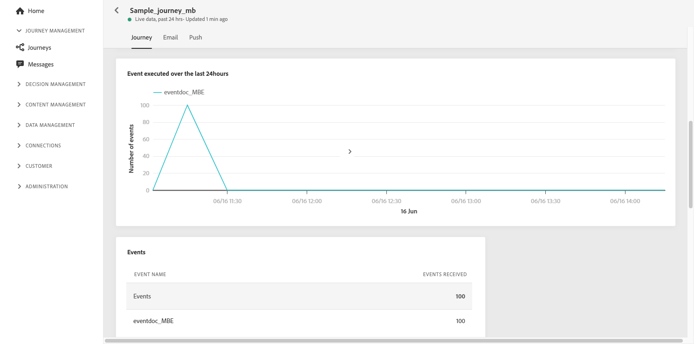
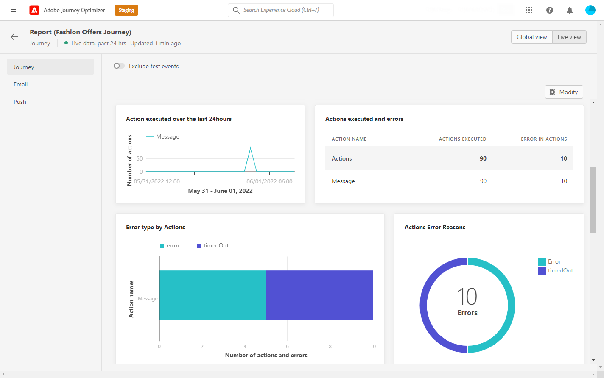

# Informe de recorrido en vivo {#journey-live-report}

Se puede acceder al informe de recorrido en directo directamente desde el recorrido con la variable **[!UICONTROL Live report]** botón.

El recorrido **[!UICONTROL Live report]** se muestra con las siguientes pestañas:

* [ Recorrido ](#journey-live)
* [Correo electrónico](#email-live)
* [Push](#push-live)

El recorrido **[!UICONTROL Live report]** se divide en distintas utilidades que detallan el éxito y los errores de su recorrido. Se puede cambiar el tamaño de cada widget y eliminarlo si es necesario. Para obtener más información, consulte [sección](live-report.md#modify-dashboard).

## ficha recorrido {#journey-live}

Desde su recorrido **[!UICONTROL Live report]**, el **[!UICONTROL Journey]** le proporciona una vista clara de los datos de seguimiento más importantes sobre su recorrido.

**[!UICONTROL Journey Performance]** le permite ver la ruta de sus perfiles de destino paso a paso a través de su recorrido.

La variable **[!UICONTROL Journey Statistics]** muestra los siguientes KPI:

* **[!UICONTROL Entered profiles]**: Número total de personas que llegaron al evento de entrada del recorrido.

* **[!UICONTROL Exited profiles]**: Número total de personas que salieron del recorrido.

* **[!UICONTROL Failed individual journeys]**: Número total de recorridos individuales que no se ejecutaron correctamente.

La variable **[!UICONTROL Event executed over the last 24 hours]** y **[!UICONTROL Events]** las utilidades permiten ver cuál de sus eventos se ejecutó correctamente mediante el número de resumen, el gráfico y la tabla.

La variable **[!UICONTROL Action executed over the last 24 hours]** y **[!UICONTROL Actions executed and errors]** las utilidades representan la acción más exitosa y los errores que se produjeron cuando se activaron las acciones. Los números del gráfico de acción, la tabla y el resumen contienen los datos disponibles para acciones como:

* **[!UICONTROL Actions executed]**: Número total de acciones ejecutadas correctamente para un recorrido.

* **[!UICONTROL Error in actions]**: Número total de errores que se produjeron en las acciones.

## Ficha Correo electrónico {#email-live}

Desde su recorrido **[!UICONTROL Live report]**, el **[!UICONTROL Email]** La pestaña detalla la información principal relativa a los envíos de correo electrónico realizados en el recorrido.

Para obtener un informe detallado sobre un envío de correo electrónico específico, consulte la [Enviar informe activo por correo electrónico](email-live-report.md) para obtener más información.

La variable **[!UICONTROL Email Sending Statistics]** La utilidad detalla la información principal relativa al mensaje:

* **[!UICONTROL Delivered]**: Número de mensajes enviados correctamente, en relación con el número total de mensajes enviados.

* **[!UICONTROL Bounces]**: Total de errores acumulados durante la entrega y el procesamiento automático de devoluciones en relación con la cantidad total de mensajes enviados.

* **[!UICONTROL Errors]**: Número total de errores que se han producido durante una entrega que impiden que se envíe a perfiles.

La variable **[!UICONTROL Sending metrics by Email]** tabla y **[!UICONTROL Email Summary]** graph detalla el éxito de la entrega:

* **[!UICONTROL Sent]**: Número total de envíos para la entrega.

* **[!UICONTROL Delivered]**: Número de mensajes enviados correctamente, en relación con el número total de mensajes enviados.

* **[!UICONTROL Bounces]**: Total de errores acumulados durante la entrega y el procesamiento automático de devoluciones en relación con la cantidad total de mensajes enviados.

* **[!UICONTROL Errors]**: Número total de errores que se han producido durante una entrega que impiden que se envíe a perfiles.

* **[!UICONTROL Opens]**: Número de veces que se abrió un mensaje en una entrega.

* **[!UICONTROL Clicks]**: Número de veces que se hizo clic en un contenido en una entrega.

* **[!UICONTROL Unsubscribe]**: Número de clics en el vínculo de baja de suscripción.

* **[!UICONTROL Spam complaints]**: Número de veces que un mensaje se declaró como correo no deseado o no deseado.

La variable **[!UICONTROL Bounce Reasons]**, **[!UICONTROL Bounce categories]** y **[!UICONTROL Hard and bounce - by Email]** los widgets contienen los datos disponibles relacionados con los mensajes devueltos, como:

* **[!UICONTROL Hard bounce]**: El número total de errores permanentes, como una dirección de correo electrónico incorrecta. Esto implica un mensaje de error que indica explícitamente que la dirección no es válida, como Usuario desconocido.

* **[!UICONTROL Soft bounce]**: El número total de errores temporales, como una bandeja de entrada completa.

* **[!UICONTROL Ignored]**: El número total de mensajes temporales, como fuera de la oficina o un error técnico, por ejemplo, si el tipo de remitente es administrador de correo.

La variable **[!UICONTROL Error Reasons]** y **[!UICONTROL Exclude Reasons]** los gráficos y las tablas permiten ver qué error y exclusiones se produjeron durante el envío.

La variable **[!UICONTROL Email - Top recipient domain]** gráfico y tabla detallan qué dominios son los más utilizados por los destinatarios para abrir el correo electrónico.

>[!NOTE]
>
>Las métricas y las utilidades de Ofertas solo están disponibles si se ha insertado una decisión en un mensaje de correo electrónico. Para obtener más información sobre la gestión de decisiones, consulte esta [página](../offers/get-started/starting-offer-decisioning.md).

La variable **[!UICONTROL Offers statistic]** y **[!UICONTROL Offers statistics]** a lo largo del tiempo, los widgets miden el éxito y el impacto de su oferta en la audiencia de destino. Detalla la información principal relativa al mensaje con KPI:

* **[!UICONTROL Offer sent]**: Número total de envíos para la oferta.

* **[!UICONTROL Offer impression]**: Número de veces que la oferta se abrió en una entrega.

* **[!UICONTROL Offer clicks]**: Número de veces que se hizo clic en una oferta en una entrega.

## Ficha Insertar {#push-live}

Desde su recorrido **[!UICONTROL Live report]**, el **[!UICONTROL Push]** detalla la información principal relativa a los envíos push realizados en el recorrido.

Para obtener un informe detallado sobre una entrega push específica, consulte la [Insertar informe activo](push-live-report.md) para obtener más información.

**[!UICONTROL Push notification sending performance]**, **[!UICONTROL Push notification summary]** y **[!UICONTROL Sending metrics - by Push]** widgets detalla la información principal relativa a su mensaje:

* **[!UICONTROL Sent]**: Número total de envíos para la entrega.

* **[!UICONTROL Delivered]**: Número de mensajes enviados correctamente, en relación con el número total de mensajes enviados.

* **[!UICONTROL Bounces]**: Total de errores acumulados durante la entrega y el procesamiento automático de devoluciones en relación con la cantidad total de mensajes enviados.

* **[!UICONTROL Errors]**: Número total de errores que se han producido durante una entrega que impiden que se envíe a perfiles.

* **[!UICONTROL Opens]**: Número de veces que se abrió un mensaje en una entrega.

* **[!UICONTROL Actions]**: Número total de acciones realizadas en la notificación push entregada, por ejemplo, hacer clic en un botón o rechazar una solicitud.

* **[!UICONTROL Engagements]**: Número total de aperturas y acciones para esta notificación push, es decir, si el perfil abrió la notificación push o si se hizo clic en un botón.

La variable **[!UICONTROL Error Reasons]** y **[!UICONTROL Exclude Reasons]** los gráficos y las tablas permiten ver qué error y exclusiones se produjeron durante el envío.

La variable **[!UICONTROL Sending statistics - Failed]** permite ver cuántos errores y rechazos se han producido.

La variable **[!UICONTROL Tracking by platform]**, **[!UICONTROL Sending by platform]** y **[!UICONTROL Breakdown by platform]** gráficos y tablas detallan el éxito de la notificación push en función del sistema operativo.
