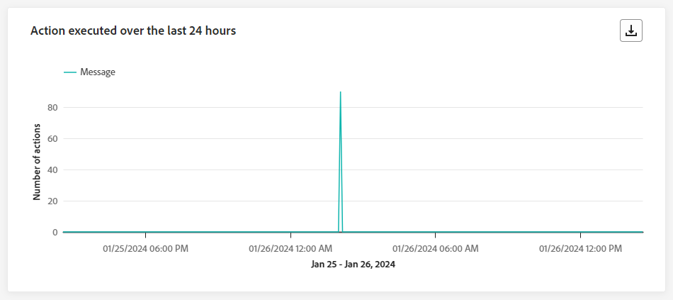
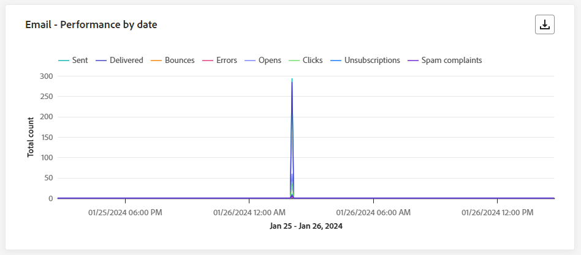

# Informe de recorrido en vivo {#journey-live-report}

>[!CONTEXTUALHELP]
>id="ajo_journey_live_report"
>title="Informe de recorrido en vivo"
>abstract="El informe en vivo del recorrido permite medir y visualizar en tiempo real el impacto y el rendimiento de sus recorridos solo durante las últimas 24 horas. El informe se divide en distintos widgets que detallan el éxito y los errores del recorrido. Cada tablero de informes se puede modificar cambiando el tamaño de los widgets o eliminándolos."

Los informes en directo, a los que se puede acceder desde la pestaña Últimas 24 horas, muestran los eventos que han tenido lugar en las últimas 24 horas, con un intervalo de tiempo mínimo de dos minutos desde que se produjo el evento. En comparación, los informes globales se centran en eventos que se produjeron hace al menos dos horas y abarcan eventos durante un período de tiempo seleccionado.

Se puede acceder al informe en directo de recorrido directamente desde el recorrido con el **[!UICONTROL Ver informe]** botón.

El recorrido **[!UICONTROL Informe en vivo]** se mostrará con las siguientes pestañas:

* [ Recorrido ](#journey-live)
* [Correo electrónico](#email-live)
* [Push](#push-live)
* [SMS](#sms-live)
* [En la aplicación](#in-app-live)

El recorrido **[!UICONTROL Informe en vivo]** se divide en diferentes widgets que detallan el éxito y los errores de su recorrido. Se puede cambiar el tamaño de cada widget y eliminarlo si es necesario. Para obtener más información, consulte [sección](live-report.md#modify-dashboard).

Para obtener una lista detallada de todas las métricas disponibles en Adobe Journey Optimizer, consulte [esta página](live-report.md#list-of-components-live).

## pestaña recorrido {#journey-live}

De tu recorrido **[!UICONTROL Informe en vivo]**, el **[!UICONTROL Recorrido]** le ofrece una visión clara de los datos de seguimiento más importantes sobre su recorrido.

### rendimiento del recorrido {#journey-performance}

**[!UICONTROL Rendimiento de recorrido]** le permite ver la ruta de los perfiles objetivo paso a paso a través del recorrido.

### Estadísticas del recorrido {#journey-statistics}

El **[!UICONTROL Estadísticas de recorrido]** Los indicadores clave de rendimiento (KPI) funcionan como un panel que abarca todo, lo que ofrece un análisis de las métricas esenciales asociadas con el recorrido en las últimas 24 horas. Esto incluye detalles como el recuento de perfiles introducidos y los casos de recorridos individuales fallidos, lo que ofrece una perspectiva completa de la eficacia y el nivel de participación de su recorrido.

+++ Más información sobre las métricas de estadísticas de Recorrido

* **[!UICONTROL Perfiles introducidos]**: Número total de personas que llegaron al evento de entrada del recorrido.

* **[!UICONTROL Perfiles abandonados]**: Número total de personas que salieron del recorrido.

* **[!UICONTROL Recorridos individuales con errores]**: Número total de recorridos individuales que no se ejecutaron correctamente.
+++

### Acción ejecutada en las últimas 24 horas {#action-executed}

El **[!UICONTROL Acción ejecutada en las últimas 24 horas]** widget representa la acción más exitosa que se produjo cuando se activaron sus acciones.

+++ Más información sobre las Acciones ejecutadas en las últimas 24 horas

* **[!UICONTROL Acciones ejecutadas]**: Número total de acciones ejecutadas correctamente para un recorrido.

* **[!UICONTROL Error en acciones]**: Número total de errores que se produjeron para las acciones.

+++

### Acciones ejecutadas y errores {#actions-errors}

El **[!UICONTROL Acciones ejecutadas y errores]** widget representa la acción y los errores que se produjeron con mayor éxito cuando se activaron las acciones.

+++ Más información sobre las Métricas de acciones ejecutadas y errores

* **[!UICONTROL Acciones ejecutadas]**: Número total de acciones ejecutadas correctamente para un recorrido.

* **[!UICONTROL Error en acciones]**: Número total de errores que se produjeron para las acciones.

+++

### Razones de error de acciones {#actions-error-reasons}

El **[!UICONTROL Razones de error de acción]** La tabla y el gráfico ofrecen una visión general de los errores que se produjeron durante la ejecución de las acciones en las últimas 24 horas.

### Tipo de error por acciones {#error-type-actions}

El **[!UICONTROL Tipo de error por acciones]** La tabla y el gráfico ofrecen una visión general de los errores que se han producido para cada ejecución de las acciones en las últimas 24 horas.

### Evento ejecutado en las últimas 24 horas {#event-executed-24hours}

El **[!UICONTROL Evento ejecutado en las últimas 24 horas]** Este widget permite identificar cuál de sus eventos se ejecutó correctamente en las últimas 24 horas.

### Eventos {#events}

El **[!UICONTROL Eventos]** El widget permite ver cuál de sus eventos se ejecutó correctamente a través del número de resumen, el gráfico y la tabla.

### Eventos por origen {#events-origin}

El **[!UICONTROL Eventos por origen]** La tabla y los gráficos proporcionan una perspectiva detallada sobre la recepción exitosa de sus eventos en las últimas 24 horas. A través de estas representaciones visuales, puede discernir con precisión cuál de sus eventos se recibió de manera efectiva, ofreciendo una valiosa perspectiva del rendimiento y el impacto de los eventos individuales dentro de su recorrido.

## Pestaña de correo electrónico {#email-live}

De tu recorrido **[!UICONTROL Informe en vivo]**, el **[!UICONTROL Correo electrónico]** Esta pestaña detalla la información principal relativa a los correos electrónicos enviados en el recorrido.

### Rendimiento de envío de correo electrónico {#email-sending-performance}

El **[!UICONTROL Correo electrónico: rendimiento de envío]** El gráfico proporciona una vista completa de los datos relacionados con los correos electrónicos enviados en el recorrido, lo que ofrece información sobre las métricas clave como los envíos y los rechazos que se han producido en las últimas 24 horas. Esto permite un análisis detallado del proceso de envío de correo electrónico, lo que proporciona información valiosa sobre la eficacia y el rendimiento de sus recorridos.

+++ Más información sobre el Correo electrónico: envío de métricas de rendimiento

* **[!UICONTROL Entregado]**: número de correos electrónicos enviados correctamente.

* **[!UICONTROL Devoluciones]**: Total de errores acumulados durante el proceso de envío y el procesamiento automático de devoluciones.

* **[!UICONTROL Errores]**: Número total de errores que se produjeron durante el proceso de envío y que impiden su envío a los perfiles.

* **[!UICONTROL Reintentos]**: Número de correos electrónicos en cola para reintentos.

+++

### Correo electrónico: Estadísticas {#email-stat}

El **[!UICONTROL Correo electrónico: estadísticas]** proporciona un resumen completo de los datos esenciales sobre los correos electrónicos en los recorridos durante las últimas 24 horas. Detalla métricas clave como el tamaño de la audiencia objetivo y la cantidad de correos electrónicos enviados correctamente, lo que ofrece perspectivas valiosas sobre la eficacia y el alcance de los correos electrónicos y recorridos.

+++ Más información sobre las métricas de estadísticas de envío de correo electrónico

* **[!UICONTROL Objetivos]**: Número total de mensajes procesados durante el proceso de envío.

* **[!UICONTROL Excluido]**: Número de perfiles que han sido excluidos por Adobe Journey Optimizer.

* **[!UICONTROL Enviado]**: Número total de correos electrónicos enviados.

* **[!UICONTROL Entregado]**: Número de correos electrónicos enviados correctamente, en relación con el número total de mensajes enviados.

* **[!UICONTROL Devoluciones]**: Total de errores acumulados durante el proceso de envío y el procesamiento automático de devoluciones en relación con el número total de mensajes enviados.

* **[!UICONTROL Errores]**: Número total de errores que se produjeron durante el proceso de envío y que impiden su envío a los perfiles.

* **[!UICONTROL Aperturas]**: Número de veces que se abrieron los correos electrónicos.

* **[!UICONTROL Clics]**: Número de veces que se hizo clic en un contenido en los correos electrónicos.

* **[!UICONTROL Cancelar suscripción]**: Número de clics en el vínculo de baja de suscripción.

* **[!UICONTROL Quejas de spam]**: Número de veces que un mensaje se declaró como correo no deseado.

* **[!UICONTROL Reintentos]**: Número de correos electrónicos en cola para reintentos.

+++

### Correo electrónico: Rendimiento por fecha {#email-perf-date}

El **[!UICONTROL Correo electrónico: rendimiento por fecha]** widget ofrece una descripción detallada de la información clave relacionada con sus correos electrónicos, presentada a través de un gráfico, que proporciona información sobre las tendencias de rendimiento en las últimas 24 horas.

+++ Más información sobre el Correo electrónico: rendimiento por métricas de fecha

* **[!UICONTROL Enviado]**: Número total de correos electrónicos enviados.

* **[!UICONTROL Entregado]**: número de correos electrónicos enviados correctamente.

* **[!UICONTROL Devoluciones]**: Total de errores acumulados durante el proceso de envío y el procesamiento automático de devoluciones.

* **[!UICONTROL Errores]**: Número total de errores que se produjeron durante el proceso de envío y que impiden su envío a los perfiles.

* **[!UICONTROL Aperturas]**: Número de veces que se abrieron los correos electrónicos.

* **[!UICONTROL Clics]**: Número de veces que se hizo clic en un contenido en los correos electrónicos.

* **[!UICONTROL Cancelar suscripción]**: Número de clics en el vínculo de baja de suscripción.

* **[!UICONTROL Quejas de spam]**: Número de veces que un mensaje se declaró como correo no deseado.

+++

### Correo electrónico: categorías y motivos de rechazo {#email-bounce-categories}

El **[!UICONTROL Motivos del rechazo]** y **[!UICONTROL Categorías de rechazo]** los widgets compilan los datos disponibles relacionados con los mensajes devueltos, proporcionando una perspectiva detallada de los motivos y las categorías específicos detrás de los rechazos de correo electrónico durante las últimas 24 horas.

Para obtener más información sobre las devoluciones, consulte [Lista de supresión](../reports/suppression-list.md) página.

+++ Más información sobre las métricas Correo electrónico: Categorías de rechazo y motivos

* **[!UICONTROL Rechazo duro]**: el número total de errores permanentes, como una dirección de correo electrónico incorrecta. Esto implica un mensaje de error que indica explícitamente que la dirección no es válida, como Usuario desconocido.

* **[!UICONTROL Rechazo suave]**: el número total de errores temporales, como una bandeja de entrada llena.

* **[!UICONTROL Ignorado]**: el número total de mensajes temporales, como Fuera de la oficina, o un error técnico, por ejemplo, si el tipo de remitente es administrador de correo.

+++

### Correo electrónico: Motivos de error {#email-error-reasons}

El **[!UICONTROL Motivos del error]** los gráficos y las tablas ofrecen visibilidad de los errores específicos que se produjeron durante el proceso de envío de las últimas 24 horas, lo que proporciona información valiosa sobre la naturaleza y la ocurrencia de los errores.

### Correo electrónico: Motivos excluidos {#email-excluded}

El **[!UICONTROL Razones de exclusión]** los gráficos y la tabla presentan una vista completa de los diferentes factores que resultaron en la exclusión de perfiles de usuario de la audiencia de destino, lo que da como resultado que el mensaje no se haya recibido en las últimas 24 horas.

Consulte [esta página](exclusion-list.md) para obtener la lista completa de motivos de exclusión.

### Correo electrónico: Dominio del mejor destinatario {#email-best-recipient}

El **[!UICONTROL Correo electrónico: dominio del mejor destinatario]** el gráfico y la tabla ofrecen un desglose detallado de los dominios que los perfiles utilizan con más frecuencia para abrir los correos electrónicos en las últimas 24 horas. Esto proporciona una valiosa perspectiva del comportamiento del perfil, lo que le ayuda a comprender las plataformas preferidas.

### Correo electrónico: ofertas {#email-offers}

>[!NOTE]
>
>Los widgets y las métricas de Ofertas solo están disponibles si se insertó una decisión en un mensaje de correo electrónico. Para obtener más información sobre Gestión de decisiones, consulte esta [página](../offers/get-started/starting-offer-decisioning.md).

El **[!UICONTROL Estadísticas de ofertas]** y **[!UICONTROL Estadísticas de ofertas con el tiempo]** los widgets miden el éxito y el impacto de su oferta en la audiencia de destino. Detalla la información principal relativa al mensaje con KPI.

+++ Más información sobre el Correo electrónico: métricas de ofertas

* **[!UICONTROL Oferta enviada]**: Número total de envíos para la oferta.

* **[!UICONTROL Impresión de oferta]**: Número de veces que se abrió la oferta en sus correos electrónicos.

* **[!UICONTROL Clics de oferta]**: Número de veces que se hizo clic en una oferta en sus correos electrónicos.

+++

## Pestaña de notificación push {#push-live}

De tu recorrido **[!UICONTROL Informe en vivo]**, el **[!UICONTROL Notificación push]** La pestaña detalla la información principal relativa a la notificación push enviada en el recorrido.

### Notificación push: estadísticas {#push-statistics}

**[!UICONTROL Notificación push: estadísticas]** proporciona un resumen conciso de los datos esenciales relacionados con las notificaciones push, incluidas las métricas clave como el número de mensajes dirigidos y el número de mensajes enviados correctamente en las últimas 24 horas.

+++ Más información sobre las Notificaciones push: métricas estadísticas

* **[!UICONTROL Objetivos]**: Número de perfiles dirigidos para cualquier acción, como enviar correos electrónicos o SMS.

* **[!UICONTROL Excluido]**: Número de perfiles que han sido excluidos por Adobe Journey Optimizer.

* **[!UICONTROL Enviado]**: Número total de notificaciones push enviadas.

* **[!UICONTROL Entregado]**: número de notificaciones push enviadas correctamente.

* **[!UICONTROL Devoluciones]**: Total de errores acumulados durante el proceso de envío y el procesamiento automático de devoluciones.

* **[!UICONTROL Errores]**: Número total de errores que se produjeron durante el proceso de envío y que impiden su envío a los perfiles.

* **[!UICONTROL Aperturas]**: Número de veces que se abrió la notificación push.
+++

### Notificación push: desglose por plataforma {#push-breakdown}

El **[!UICONTROL Notificación push: desglose por plataforma]** el gráfico y la tabla proporcionan un análisis detallado del éxito de sus notificaciones push, y ofrecen perspectivas basadas en el sistema operativo de su perfil. Este desglose mejora su comprensión del rendimiento de las notificaciones push en las distintas plataformas.

### Notificación push: resumen del envío {#push-sending-summary}

El **[!UICONTROL Resumen de notificaciones push]** El gráfico de ofrece una representación dinámica que muestra un análisis de la actividad de notificaciones push en las últimas 24 horas. Esta representación gráfica proporciona un desglose completo de las notificaciones push enviadas.

+++ Más información sobre las Notificaciones push: envío de métricas de resumen

* **[!UICONTROL Enviado]**: Número total de notificaciones push enviadas.

* **[!UICONTROL Entregado]**: número de notificaciones push enviadas correctamente.

* **[!UICONTROL Devoluciones]**: Total de errores acumulados durante el proceso de envío y el procesamiento automático de devoluciones.

* **[!UICONTROL Errores]**: Número total de errores que se produjeron durante el proceso de envío y que impiden su envío a los perfiles.

* **[!UICONTROL Aperturas]**: Número de veces que se abrieron las notificaciones push.

* **[!UICONTROL Clics]**: Número de veces que se hizo clic en un contenido en las notificaciones push.

+++

### Notificación push: motivos del error {#push-error}

El **[!UICONTROL Motivos del error]** La tabla y los gráficos le permiten identificar los errores específicos que se produjeron durante el proceso de envío de las notificaciones push, lo que ofrece información detallada sobre cualquier problema encontrado en las últimas 24 horas.

### Notificación push: motivos excluidos {#push-excluded}

El **[!UICONTROL Razones de exclusión]** los gráficos y la tabla muestran los diferentes motivos que impidieron que los perfiles de usuario, excluidos de los perfiles de destino, recibieran notificaciones push en las últimas 24 horas.

Consulte [esta página](exclusion-list.md) para obtener la lista completa de motivos de exclusión.

## Pestaña SMS {#sms-live}

### SMS: estadísticas {#sms-statistics}

El **[!UICONTROL SMS: estadísticas]** La tabla proporciona un resumen conciso de los datos esenciales relacionados con sus mensajes SMS, que incluye métricas clave como el número de mensajes dirigidos y el recuento de mensajes enviados correctamente desde las últimas 24 horas.

+++ Más información sobre los SMS: métricas estadísticas

* **[!UICONTROL Objetivos]**: número de perfiles de usuario que se califican como perfiles de destinatario.

* **[!UICONTROL Excluido]**: número de perfiles de usuario, excluidos de los perfiles de destino, que no recibieron el mensaje.

* **[!UICONTROL Enviado]**: Número total de mensajes SMS enviados.

* **[!UICONTROL Aperturas]**: Número de veces que se abrieron sus mensajes SMS.

* **[!UICONTROL Clics]**: Número de veces que se hizo clic en un contenido en sus mensajes SMS.

* **[!UICONTROL Devoluciones]**: Total de errores acumulados durante el proceso de envío, el proceso de envío y el procesamiento automático de devolución.

* **[!UICONTROL Errores]**: Número total de errores que se produjeron durante el proceso de envío y que impiden su envío a los perfiles.

+++

### SMS: rendimiento por fecha {#sms-performance}

El **[!UICONTROL SMS: rendimiento por fecha]** El widget ofrece una descripción detallada de la información clave relacionada con los mensajes, presentada a través de un gráfico, que proporciona información sobre las tendencias de rendimiento durante las últimas 24 horas.

+++ Más información sobre SMS: rendimiento por métricas de fecha

* **[!UICONTROL Enviado]**: Número total de mensajes SMS enviados.

* **[!UICONTROL Devoluciones]**: Total de errores acumulados durante el proceso de envío y el procesamiento automático de devoluciones.

* **[!UICONTROL Errores]**: Número total de errores que se produjeron durante el proceso de envío y que impiden su envío a los perfiles.

+++

### SMS: motivos de rechazos {#sms-bounces}

El **[!UICONTROL SMS: motivos de rechazos]** Los gráficos y la tabla proporcionan una visión general completa de los datos relacionados con los mensajes SMS rechazados, lo que ofrece una valiosa perspectiva de las razones específicas detrás de las instancias de rechazos de mensajes SMS en las últimas 24 horas.

### SMS: motivos de error {#sms-error}

El **[!UICONTROL SMS: razones de error]** Los gráficos y la tabla le permiten identificar los errores específicos que se produjeron durante el proceso de envío de sus mensajes SMS, lo que facilita un análisis exhaustivo de cualquier problema encontrado en las últimas 24 horas.

### SMS: motivos excluidos {#sms-excluded}

El **[!UICONTROL SMS: razones de exclusión]** Los gráficos y tablas muestran visualmente los diversos factores que llevaron a la exclusión de perfiles de usuario de la audiencia de destino, lo que les impidió recibir sus mensajes SMS.

Consulte [esta página](exclusion-list.md) para obtener la lista completa de motivos de exclusión.

### SMS: clics por vínculos {#sms-clicks}

El **[!UICONTROL SMS: clics por vínculos]** El widget ofrece una información esencial sobre la participación de los visitantes con las direcciones URL incluidas en los mensajes, lo que proporciona información valiosa sobre los vínculos que atraen la mayor interacción en las últimas 24 horas.

## Pestaña en la aplicación {#in-app-live}

### Rendimiento en la aplicación {#inapp-performance}

El **[!UICONTROL Rendimiento en la aplicación]** Los KPI proporcionan una perspectiva esencial de la participación de sus perfiles con los mensajes en la aplicación en las últimas 24 horas, lo que proporciona métricas esenciales para evaluar la eficacia y el impacto de los mensajes en la aplicación incluidos en su recorrido.

+++ Más información sobre las Métricas de rendimiento en la aplicación

* **[!UICONTROL Impresiones]**: número total de mensajes en la aplicación entregados a todos los usuarios.

  >[!NOTE]
  >
  >Para garantizar que se cuente una impresión, el usuario debe cumplir dos criterios:
  >* Calificación dentro de la experiencia en la aplicación, que se logra al alcanzar la actividad en la aplicación específica en su recorrido.
  >* Cumplir las condiciones especificadas en las reglas de Déclencheur.
  > 
  >Debido al segundo criterio, puede haber variaciones notables entre el número de perfiles objetivo y el recuento de impresiones únicas.

* **[!UICONTROL Interacciones]**: número total de interacciones con el mensaje en la aplicación. Esto incluye cualquier acción realizada por los usuarios, como clics, rechazos o cualquier otra interacción.

+++

### Resumen de la aplicación {#inapp-summary}

El **[!UICONTROL Resumen en la aplicación]** Este gráfico ilustra la progresión de las impresiones e interacciones en la aplicación durante las últimas 24 horas, y proporciona una visión general completa del rendimiento de los mensajes en la aplicación.

+++ Más información sobre las Métricas de resumen en la aplicación

* **[!UICONTROL Impresiones]**: número total de mensajes en la aplicación entregados a todos los usuarios.

  >[!NOTE]
  >
  >Para garantizar que se cuente una impresión, el usuario debe cumplir dos criterios:
  >* Calificación dentro de la experiencia en la aplicación, que se logra al alcanzar la actividad en la aplicación específica en su recorrido.
  >* Cumplir las condiciones especificadas en las reglas de Déclencheur.
  > 
  >Debido al segundo criterio, puede haber variaciones notables entre el número de perfiles objetivo y el recuento de impresiones únicas.

* **[!UICONTROL Interacciones]**: número total de interacciones con el mensaje en la aplicación. Esto incluye cualquier acción realizada por los usuarios, como clics, rechazos o cualquier otra interacción.

+++

### Interacciones por tipo {#interactions-type}

El **[!UICONTROL Interacciones por tipo]** Los gráficos y la tabla detallan cómo interactuaron los usuarios con el mensaje en la aplicación rastreando cualquier clic, descarte o interacción.
