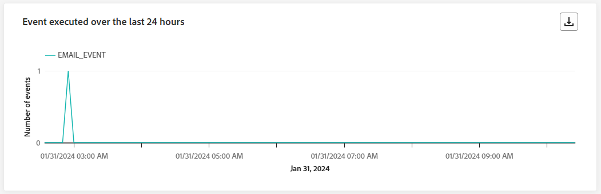
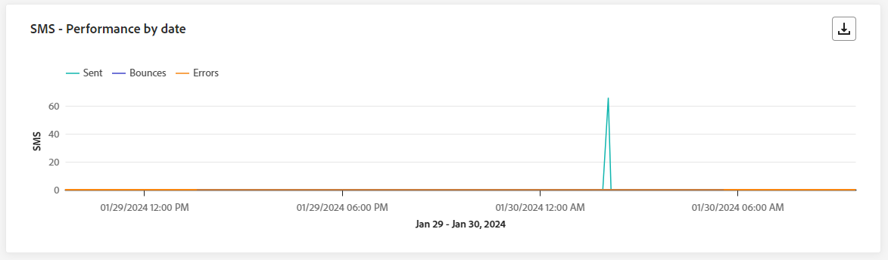

# Informe de recorrido en vivo {#journey-live-report}

>[!CONTEXTUALHELP]
>id="ajo_journey_live_report"
>title="Informe de recorrido en vivo"
>abstract="El informe en vivo del recorrido permite medir y visualizar en tiempo real el impacto y el rendimiento de sus recorridos solo durante las últimas 24 horas. El informe se divide en distintos widgets que detallan el éxito y los errores del recorrido. Cada panel de control de informes se puede modificar cambiando el tamaño de los widgets o eliminándolos."

Los informes en directo, a los que se puede acceder desde la pestaña Últimas 24 horas, muestran los eventos que han tenido lugar en las últimas 24 horas, con un intervalo de tiempo mínimo de dos minutos desde que se produjo el evento. En comparación, los informes de Customer Journey Analytics se centran en eventos que ocurrieron al menos hace dos horas y cubren eventos que se produjeron durante un período de tiempo seleccionado.

Acceda al informe de Recorrido en directo desde el menú [!UICONTROL Recorridos] abriendo el menú [!UICONTROL Más acciones] de su recorrido y seleccionando [!UICONTROL Ver el informe de las últimas 24 horas].

La página del recorrido **[!UICONTROL Informe en vivo]** se mostrará con las siguientes pestañas:

* [ Recorrido ](#journey-live)
* [Correo electrónico](#email-live)
* [Push](#push-live)
* [SMS](#sms-live)
* [in-app](#in-app-live)

El recorrido **[!UICONTROL Informe en vivo]** está dividido en diferentes widgets que detallan el éxito y los errores de su recorrido. Se puede cambiar el tamaño de cada widget y eliminarlo si es necesario. Para obtener más información, consulte esta [sección](live-report.md#modify-dashboard).

Para obtener una lista detallada de todas las métricas disponibles en Adobe Journey Optimizer, consulte [esta página](live-report.md#live-report).

## pestaña recorrido {#journey-live}

Desde tu **[!UICONTROL informe en vivo]** de recorrido, la pestaña **[!UICONTROL Recorrido]** te ofrece una vista clara de los datos de seguimiento más importantes sobre tu recorrido.

### Rendimiento del recorrido {#journey-performance}

>[!CONTEXTUALHELP]
>id="ajo_journey_performance_live"
>title="Rendimiento del recorrido"
>abstract="El widget Rendimiento del recorrido le permite seguir visualmente la ruta de sus perfiles de destino a medida que avanzan por su recorrido durante las últimas 24 horas."

**[!UICONTROL Rendimiento del Recorrido]** le permite ver paso a paso la ruta de sus perfiles de destino a través de su recorrido.

Tenga en cuenta que el recuento de perfiles de un nodo solo se actualiza una vez que el perfil lo ha completado, no al introducirlo. Por ejemplo, un perfil en un nodo **Wait** solo se cuenta una vez que se alcanza la fecha especificada y el perfil se ha salido del nodo.

### Estadísticas del recorrido {#journey-statistics}

>[!CONTEXTUALHELP]
>id="ajo_journey_statistics_live"
>title="Estadísticas del recorrido"
>abstract="Los indicadores clave de rendimiento (KPI) de estadísticas del recorrido sirven como un panel de control completo, proporcionando un análisis en profundidad de las métricas esenciales de las últimas 24 horas relacionadas con su recorrido."

Las **[!UICONTROL Estadísticas de Recorrido]** Indicadores clave de rendimiento (KPI) funcionan como un tablero integral que ofrece un análisis de las métricas esenciales asociadas con su recorrido en las últimas 24 horas. Esto incluye detalles como el recuento de perfiles introducidos y los casos de recorridos individuales fallidos, lo que ofrece un insight completo de la eficacia y el nivel de participación de su recorrido.

+++ Más información sobre las métricas de estadísticas de Recorrido

* **[!UICONTROL Perfiles introducidos]**: Número total de individuos que alcanzaron el evento de entrada del recorrido.

* **[!UICONTROL Perfiles abandonados]**: Número total de individuos que salieron del recorrido.

* **[!UICONTROL recorridos individuales con errores]**: Número total de recorridos individuales que no se ejecutaron correctamente.
+++

### Acción ejecutada en las últimas 24 horas {#action-executed}

>[!CONTEXTUALHELP]
>id="ajo_journey_actions_executed_live"
>title="Acción ejecutada en las últimas 24 horas"
>abstract="El widget Acción ejecutada en las últimas 24 horas ofrece una instantánea del rendimiento reciente, mostrando la eficacia de las acciones ejecutadas en las últimas 24 horas."

La **[!UICONTROL acción ejecutada en las últimas 24 horas]** representa la acción más exitosa que ocurrió cuando se activaron sus acciones.

+++ Más información sobre las Acciones ejecutadas en las últimas 24 horas

* **[!UICONTROL Acciones ejecutadas]**: Número total de acciones ejecutadas correctamente para un recorrido.

* **[!UICONTROL Error en acciones]**: Número total de errores que se produjeron en las acciones.

+++

### Acciones ejecutadas y errores {#actions-errors}

>[!CONTEXTUALHELP]
>id="ajo_journey_actions_executed__errors_live"
>title="Acciones ejecutadas y errores"
>abstract="El widget Acciones ejecutadas y errores muestra las acciones más exitosas y cualquier error que se haya producido durante la activación de acciones en las últimas 24 horas. Este widget ofrece información general exhaustiva tanto de las ejecuciones que han tenido éxito como de los errores encontrados, proporcionando información valiosa sobre el rendimiento reciente de sus acciones."

El widget **[!UICONTROL Acciones ejecutadas y errores]** representa la acción y los errores que se produjeron con mayor éxito cuando las acciones se activaron en las últimas 24 horas.

+++ Más información sobre las Acciones ejecutadas y las métricas de error

* **[!UICONTROL Acciones ejecutadas]**: Número total de acciones ejecutadas correctamente para un recorrido.

* **[!UICONTROL Error en acciones]**: Número total de errores que se produjeron en las acciones.

+++

### Motivos de error de las acciones {#actions-error-reasons}

>[!CONTEXTUALHELP]
>id="ajo_journey_actions_errors_live"
>title="Motivos de error de las acciones"
>abstract="La tabla y el gráfico Motivos del error de las acciones proporcionan un resumen exhaustivo de los errores encontrados durante la ejecución de sus acciones, ofreciendo información general completa de los problemas que pueden haberse producido en las últimas 24 horas."

La tabla y el gráfico de **[!UICONTROL razones de error de acción]** ofrecen una descripción general completa de los errores que se produjeron durante la ejecución de las acciones en las últimas 24 horas.

### Tipo de error por acciones {#error-type-actions}

>[!CONTEXTUALHELP]
>id="ajo_journey_actions_error_type_live"
>title="Tipo de error por acciones"
>abstract="La tabla y el gráfico Tipo de error por acciones ofrecen información general completa de los errores que se produjeron durante cada ejecución de sus acciones en las últimas 24 horas."

La tabla y el gráfico **[!UICONTROL Tipo de error por acciones]** ofrecen una descripción general completa de los errores que se produjeron en cada ejecución de las acciones en las últimas 24 horas.

### Evento ejecutado en las últimas 24 horas {#event-executed-24hours}

>[!CONTEXTUALHELP]
>id="ajo_journey_event_24hours_live"
>title="Evento ejecutado en las últimas 24 horas"
>abstract="El widget Evento ejecutado en las últimas 24 horas le permite identificar cuál de sus eventos se ha ejecutado correctamente en las últimas 24 horas. "

El widget **[!UICONTROL Evento ejecutado en las últimas 24 horas]** le permite identificar cuál de sus eventos se ejecutó correctamente en las últimas 24 horas.

### Eventos {#events}

>[!CONTEXTUALHELP]
>id="ajo_journey_events_live"
>title="Eventos"
>abstract="El widget Eventos proporciona una vista completa de los eventos que se han ejecutado correctamente, ofreciendo un número de resumen, un gráfico y una tabla para obtener información detallada de las últimas 24 horas."

El widget **[!UICONTROL Events]** le permite ver cuál de sus eventos se ejecutó correctamente a través del número de resumen, el gráfico y la tabla.

### Eventos por origen {#events-origin}

>[!CONTEXTUALHELP]
>id="ajo_journey_events_origin_live"
>title="Eventos por origen"
>abstract="La tabla y los gráficos Eventos por origen ofrecen una vista del éxito de recepción de sus eventos en las últimas 24 horas. Estas representaciones visuales le permiten identificar con precisión los eventos que se han recibido de forma efectiva, proporcionándole información valiosa sobre el rendimiento y el impacto de cada evento dentro de su recorrido."

La tabla y los gráficos de **[!UICONTROL Eventos por origen]** proporcionan una perspectiva detallada sobre la recepción exitosa de sus eventos en las últimas 24 horas. A través de estas representaciones visuales, puede discernir con precisión cuál de sus eventos se recibió de manera efectiva, ofreciendo una valiosa perspectiva del rendimiento y el impacto de los eventos individuales dentro de su recorrido.

## Pestaña de correo electrónico {#email-live}

Desde tu **[!UICONTROL informe en vivo]** de recorrido, la pestaña **[!UICONTROL Correo electrónico]** detalla la información principal relacionada con los correos electrónicos enviados en tu recorrido.

### Correo electrónico: rendimiento del envío {#email-sending-performance}

>[!CONTEXTUALHELP]
>id="ajo_journey_email_sending_performance_live"
>title="Correo electrónico: rendimiento del envío"
>abstract="El gráfico Estadísticas del envío de correo electrónico resume los datos esenciales sobre sus correos electrónicos, como los segmentados o enviados en las últimas 24 horas."

El gráfico **[!UICONTROL Correo electrónico: rendimiento de envío]** proporciona una vista completa de los datos relacionados con los mensajes de correo electrónico enviados en el recorrido, y ofrece detalles sobre métricas clave como envíos y devoluciones que se produjeron en las últimas 24 horas. Esto permite un análisis detallado del proceso de envío de correo electrónico, lo que proporciona información valiosa sobre la eficacia y el rendimiento de sus recorridos.

+++ Más información sobre el Correo electrónico: envío de métricas de rendimiento

* **[!UICONTROL Entregado]**: número de correos electrónicos enviados correctamente.

* **[!UICONTROL Devoluciones]**: Total de errores acumulados durante el proceso de envío y el procesamiento automático de devoluciones.

* **[!UICONTROL Errores]**: Número total de errores que se produjeron durante el proceso de envío para evitar que se enviara a los perfiles.

* **[!UICONTROL Reintentos]**: número de correos electrónicos en cola para reintentos.

+++

### Correo electrónico: Estadísticas {#email-stat}

>[!CONTEXTUALHELP]
>id="ajo_journey_email_statistics_live"
>title="Correo electrónico: Estadísticas"
>abstract="La tabla Correo electrónico: Estadísticas proporciona datos sobre la actividad del perfil de su correo electrónico en las últimas 24 horas."

La tabla **[!UICONTROL Correo electrónico: estadísticas]** proporciona un resumen completo de los datos esenciales relacionados con los correos electrónicos de los recorridos durante las últimas 24 horas. Detalla métricas clave como el tamaño de la audiencia objetivo y la cantidad de correos electrónicos enviados correctamente, lo que ofrece perspectivas valiosas sobre la eficacia y el alcance de los correos electrónicos y recorridos.

+++ Más información sobre las métricas de Estadísticas de envío de correo electrónico

* **[!UICONTROL Destinatarios]**: Número total de mensajes procesados durante el proceso de envío.

* **[!UICONTROL Excluido]**: número de perfiles que han sido excluidos por Adobe Journey Optimizer.

* **[!UICONTROL Enviado]**: Número total de correos electrónicos enviados.

* **[!UICONTROL Entregado]**: número de correos electrónicos enviados correctamente en relación con el número total de mensajes enviados.

* **[!UICONTROL Devoluciones]**: Total de errores acumulados durante el proceso de envío y el procesamiento automático de devoluciones en relación con el número total de mensajes enviados.

* **[!UICONTROL Errores]**: Número total de errores que se produjeron durante el proceso de envío para evitar que se enviara a los perfiles.

* **[!UICONTROL Aperturas]**: Número de veces que se abrieron los correos electrónicos.

* **[!UICONTROL Clics]**: Número de veces que se hizo clic en un contenido en sus correos electrónicos.

* **[!UICONTROL Cancelar suscripción]**: número de clics en el vínculo de cancelación de suscripción.

* **[!UICONTROL Quejas por correo no deseado]**: Número de veces que un mensaje se declaró como correo no deseado.

* **[!UICONTROL Reintentos]**: número de correos electrónicos en cola para reintentos.

+++

### Correo electrónico: Rendimiento por fecha {#email-perf-date}

>[!CONTEXTUALHELP]
>id="ajo_journey_email_performance_bydate_live"
>title="Correo electrónico: Rendimiento por fecha"
>abstract="El gráfico Correo electrónico: rendimiento por fecha presenta datos completos de las últimas 24 horas sobre los correos electrónicos enviados, ofreciendo información sobre métricas clave como las entregas y los rechazos, lo que permite realizar un análisis detallado del proceso de envío del correo electrónico."

El widget **[!UICONTROL Correo electrónico - Rendimiento por fecha]** ofrece una descripción detallada de la información clave relacionada con sus correos electrónicos, presentada a través de un gráfico, que proporciona información sobre las tendencias de rendimiento en las últimas 24 horas.

+++ Más información sobre el Correo electrónico: rendimiento por métricas de fecha

* **[!UICONTROL Enviado]**: Número total de correos electrónicos enviados.

* **[!UICONTROL Entregado]**: número de correos electrónicos enviados correctamente.

* **[!UICONTROL Devoluciones]**: Total de errores acumulados durante el proceso de envío y el procesamiento automático de devoluciones.

* **[!UICONTROL Errores]**: Número total de errores que se produjeron durante el proceso de envío para evitar que se enviara a los perfiles.

* **[!UICONTROL Aperturas]**: Número de veces que se abrieron los correos electrónicos.

* **[!UICONTROL Clics]**: Número de veces que se hizo clic en un contenido en sus correos electrónicos.

* **[!UICONTROL Cancelar suscripción]**: número de clics en el vínculo de cancelación de suscripción.

* **[!UICONTROL Quejas por correo no deseado]**: Número de veces que un mensaje se declaró como correo no deseado.

+++

### Correo electrónico: categorías y motivos de rechazo {#email-bounce-categories}

>[!CONTEXTUALHELP]
>id="ajo_journey_email_bounces_live"
>title="Correo electrónico: categorías y motivos de rechazo"
>abstract="XX"

Los widgets **[!UICONTROL Motivos de rechazo]** y **[!UICONTROL Categorías de rechazo]** compilan los datos disponibles relacionados con los mensajes rechazados, proporcionando una perspectiva detallada de los motivos específicos y las categorías detrás de los rechazos de correo electrónico durante las últimas 24 horas.

Para obtener más información sobre las devoluciones, consulte la página [Lista de supresión](../reports/suppression-list.md).

+++ Más información sobre las métricas Correo electrónico: Categorías de rechazo y motivos

* **[!UICONTROL Rechazo grave]**: El número total de errores permanentes, como una dirección de correo electrónico incorrecta. Esto implica un mensaje de error que indica explícitamente que la dirección no es válida, como Usuario desconocido.

* **[!UICONTROL Devolución suave]**: El número total de errores temporales, como una bandeja de entrada completa.

* **[!UICONTROL Omitido]**: El número total de mensajes temporales, como Fuera de la oficina, o un error técnico, por ejemplo, si el tipo de remitente es administrador de correo.

+++

### Correo electrónico: motivos del error {#email-error-reasons}

>[!CONTEXTUALHELP]
>id="ajo_journey_email_errors_live"
>title="Correo electrónico: motivos del error"
>abstract="Los gráficos y la tabla Correo electrónico: Motivos de error permiten identificar los errores específicos que se han producido en las últimas 24 horas."

Los gráficos y la tabla **[!UICONTROL Motivos del error]** ofrecen visibilidad de los errores específicos que se produjeron durante el proceso de envío de las últimas 24 horas, lo que proporciona información valiosa sobre la naturaleza y la incidencia de los errores.

### Correo electrónico: Motivos excluidos {#email-excluded}

>[!CONTEXTUALHELP]
>id="ajo_journey_email_excluded_live"
>title="Correo electrónico: Motivos excluidos"
>abstract="Los gráficos y la tabla Motivos de exclusión ilustran los distintos factores que llevaron a que los perfiles de usuario, excluidos del público destinatario, no recibieran el mensaje en las últimas 24 horas."

Los gráficos y la tabla de **[!UICONTROL Motivos de exclusión]** presentan una vista completa de los diferentes factores que resultaron en la exclusión de perfiles de usuarios de la audiencia de destino, lo que resultó en que el mensaje no se recibiera en las últimas 24 horas.

Consulte [esta página](exclusion-list.md) para obtener una lista completa de motivos de exclusión.

### Correo electrónico: Dominio del mejor destinatario {#email-best-recipient}

>[!CONTEXTUALHELP]
>id="ajo_journey_email_best_recipient_live"
>title="Correo electrónico: Dominio del mejor destinatario"
>abstract="El gráfico y la tabla Correo electrónico: el mejor dominio de destinatario proporcionan un desglose detallado de los dominios que los destinatarios utilizan con más frecuencia para abrir el correo electrónico, lo que ofrece información valiosa sobre el comportamiento de los destinatarios en las últimas 24 horas."

El gráfico y la tabla **[!UICONTROL Correo electrónico: mejor dominio de destinatario]** ofrecen un desglose detallado de los dominios que los perfiles usan con más frecuencia para abrir sus correos electrónicos en las últimas 24 horas. Esto proporciona una valiosa perspectiva del comportamiento del perfil, lo que le ayuda a comprender las plataformas preferidas.

### Correo electrónico: ofertas {#email-offers}

>[!CONTEXTUALHELP]
>id="ajo_journey_email_offers_live"
>title="Correo electrónico: ofertas"
>abstract="Los widgets Estadísticas de las ofertas y Estadísticas detalladas de las ofertas proporcionan información completa del rendimiento de sus ofertas en las últimas 24 horas, ofreciendo un análisis detallado de su impacto en el tiempo y presentando estadísticas detalladas para una comprensión más profunda."

>[!NOTE]
>
>Los widgets y las métricas de Ofertas solo están disponibles si se insertó una decisión en un mensaje de correo electrónico. Para obtener más información sobre Administración de decisiones, consulte esta [página](../offers/get-started/starting-offer-decisioning.md).

Los widgets **[!UICONTROL Estadísticas de ofertas]** y **[!UICONTROL Estadísticas de ofertas a lo largo del tiempo]** miden el éxito de la oferta y el impacto en la audiencia de destino. Detalla la información principal relativa al mensaje con KPI.

+++ Más información sobre el Correo electrónico: métricas de ofertas

* **[!UICONTROL Oferta enviada]**: Número total de envíos de la oferta.

* **[!UICONTROL Impresión de oferta]**: Número de veces que se abrió la oferta en sus correos electrónicos.

* **[!UICONTROL Clics en ofertas]**: Número de veces que se hizo clic en una oferta en sus correos electrónicos.

+++

### Correo electrónico: optimización {#email-sto}

>[!CONTEXTUALHELP]
>id="ajo_journey_email_optimization_live"
>title="Correo electrónico: optimización"
>abstract="Los widgets Optimización del tiempo de envío y Optimizado frente a los no optimizados proporcionan información detallada de las últimas 24 horas sobre sus mensajes, destacando si se han optimizado o no."

>[!NOTE]
>
>Los widgets **[!UICONTROL Optimización del tiempo de envío]** y **[!UICONTROL Optimizado frente a no optimizado]** solo están disponibles si la opción Optimización del tiempo de envío está activada para su envío. Para obtener más información sobre la optimización del tiempo de envío, consulte [esta página](../building-journeys/send-time-optimization.md).

Los widgets **[!UICONTROL Optimización del tiempo de envío]** y **[!UICONTROL Optimizado frente a no optimizado]** detallan el éxito de los correos electrónicos según el método de envío: optimizado o normal.

+++ Obtenga más información sobre la Optimización del tiempo de envío y las métricas optimizadas frente a las no optimizadas

* **[!UICONTROL Entregado]**: número de mensajes enviados correctamente en relación con el número total de mensajes enviados.
* **[!UICONTROL Devoluciones]**: Total de errores acumulados durante el proceso de envío y el procesamiento automático de devoluciones en relación con el número total de mensajes enviados.

* **[!UICONTROL Enviado]**: Número total de correos electrónicos enviados para el recorrido.

* **[!UICONTROL Aperturas]**: Número de veces que se abrieron los mensajes de correo electrónico en el recorrido.

* **[!UICONTROL Clics]**: Número de veces que se hizo clic en un contenido en sus correos electrónicos.

+++

## Pestaña de notificación push {#push-live}

Desde su **[!UICONTROL informe en vivo]** de recorrido, la ficha **[!UICONTROL Notificación push]** detalla la información principal relativa a la notificación push enviada en su recorrido.

### Notificación push: rendimiento del envío {#push-sending-performance}

>[!CONTEXTUALHELP]
>id="ajo_journey_push_sending_performance_live"
>title="Notificación push: rendimiento del envío"
>abstract="El gráfico Rendimiento del envío de notificación push resume los datos esenciales sobre la notificación push, como los errores o los mensajes enviados en las últimas 24 horas."

El gráfico **[!UICONTROL Rendimiento de envío de notificaciones push]** ofrece una descripción detallada de los datos relacionados con las notificaciones push enviadas en las últimas 24 horas. Proporciona perspectivas sobre métricas esenciales como envíos y devoluciones, lo que permite un examen detallado del proceso de envío de notificaciones push.

+++ Más información sobre las Notificaciones push: envío de métricas de rendimiento

* **[!UICONTROL Entregado]**: número de mensajes enviados correctamente.

* **[!UICONTROL Devoluciones]**: Total de errores acumulados durante el proceso de envío y el procesamiento automático de devoluciones.

* **[!UICONTROL Errores]**: Número total de errores que se produjeron durante el proceso de envío para evitar que se enviara a los perfiles.

+++

### Notificación push: estadísticas {#push-statistics}

>[!CONTEXTUALHELP]
>id="ajo_journey_push_statistics_live"
>title="Notificación push: estadísticas"
>abstract="La tabla Estadísticas push proporciona datos sobre la actividad del destinatario referente a la notificación push en las últimas 24 horas."

**[!UICONTROL Notificación push: tabla de estadísticas]** proporciona un resumen conciso de los datos esenciales relacionados con las notificaciones push, incluidas las métricas clave como el número de mensajes dirigidos y el número de mensajes enviados correctamente en las últimas 24 horas.

+++ Más información sobre las Notificaciones push: métricas estadísticas

* **[!UICONTROL Segmentación]**: número de perfiles segmentados para cualquier acción, como enviar correo electrónico o SMS.

* **[!UICONTROL Excluido]**: número de perfiles que han sido excluidos por Adobe Journey Optimizer.

* **[!UICONTROL Enviado]**: Número total de notificaciones push enviadas.

* **[!UICONTROL Entregado]**: número de notificaciones push enviadas correctamente.

* **[!UICONTROL Devoluciones]**: Total de errores acumulados durante el proceso de envío y el procesamiento automático de devoluciones.

* **[!UICONTROL Errores]**: Número total de errores que se produjeron durante el proceso de envío para evitar que se enviara a los perfiles.

* **[!UICONTROL Aperturas]**: Número de veces que se abrió la notificación push.
+++

### Notificación push: desglose por plataforma {#push-breakdown}

>[!CONTEXTUALHELP]
>id="ajo_journey_push_breakdown_live"
>title="Notificación push: desglose por plataforma"
>abstract="Los gráficos y la tabla Desglose por plataforma proporcionan un desglose del éxito de las notificaciones push en las últimas 24 horas en función del sistema operativo del destinatario."

El gráfico y la tabla de **[!UICONTROL Notificación push: desglose por plataforma]** proporcionan un análisis detallado del éxito de sus notificaciones push, y ofrecen perspectivas basadas en el sistema operativo de su perfil. Este desglose mejora su comprensión del rendimiento de las notificaciones push en las distintas plataformas.

### Notificación push: resumen del envío {#push-sending-summary}

>[!CONTEXTUALHELP]
>id="ajo_journey_push_sending_summary_live"
>title="Notificación push: resumen del envío"
>abstract="El gráfico Resumen del envío de notificación push muestra los datos disponibles para las notificaciones push enviadas en las últimas 24 horas."

El gráfico **[!UICONTROL Resumen de notificaciones push]** ofrece una representación dinámica que muestra un análisis de su actividad de notificaciones push en las últimas 24 horas. Esta representación gráfica proporciona un desglose completo de las notificaciones push enviadas.

+++ Más información sobre las Notificaciones push: envío de métricas de resumen

* **[!UICONTROL Enviado]**: Número total de notificaciones push enviadas.

* **[!UICONTROL Entregado]**: número de notificaciones push enviadas correctamente.

* **[!UICONTROL Devoluciones]**: Total de errores acumulados durante el proceso de envío y el procesamiento automático de devoluciones.

* **[!UICONTROL Errores]**: Número total de errores que se produjeron durante el proceso de envío para evitar que se enviara a los perfiles.

* **[!UICONTROL Aperturas]**: Número de veces que se abrieron las notificaciones push.

* **[!UICONTROL Clics]**: Número de veces que se hizo clic en un contenido en las notificaciones push.

+++

### Notificación push: motivos del error {#push-error}

>[!CONTEXTUALHELP]
>id="ajo_journey_push_error_reasons_live"
>title="Notificación push: motivos del error"
>abstract="Los gráficos y la tabla Motivos de error permiten identificar los errores específicos que se produjeron en las últimas 24 horas durante el envío."

La tabla y los gráficos de **[!UICONTROL Motivos del error]** le permiten identificar los errores específicos que se produjeron durante el proceso de envío de las notificaciones push, lo que ofrece una perspectiva detallada de los problemas encontrados en las últimas 24 horas.

### Notificación push: motivos de exclusión {#push-excluded}

>[!CONTEXTUALHELP]
>id="ajo_journey_push_excluded_reasons_live"
>title="Notificación push: motivos de exclusión"
>abstract="Los gráficos y la tabla Motivos de exclusión ilustran los distintos factores que llevaron a que los perfiles de usuario, excluidos del público destinatario, no recibieran el mensaje en las últimas 24 horas."

Los gráficos y la tabla de **[!UICONTROL Motivos de exclusión]** muestran los diferentes motivos que impidieron que los perfiles de usuario, excluidos de los perfiles de destino, recibieran las notificaciones push en las últimas 24 horas.

Consulte [esta página](exclusion-list.md) para obtener una lista completa de motivos de exclusión.

## Pestaña SMS {#sms-live}

### SMS: estadísticas {#sms-statistics}

>[!CONTEXTUALHELP]
>id="ajo_journey_sms_statistics_live"
>title="SMS: estadísticas"
>abstract="La tabla Estadísticas del envío de SMS resume los datos esenciales sobre sus mensajes SMS, como los mensajes segmentados o enviados en las últimas 24 horas."

La tabla **[!UICONTROL SMS - Estadísticas]** proporciona un resumen conciso de los datos esenciales relacionados con sus mensajes SMS, que incluye métricas clave como el número de mensajes dirigidos y el recuento de mensajes enviados correctamente desde las últimas 24 horas.

+++ Más información sobre los SMS: métricas estadísticas

* **[!UICONTROL Segmentado]**: número de perfiles de usuario que cumplen los requisitos como perfiles de destinatario.

* **[!UICONTROL Excluido]**: número de perfiles de usuario, excluidos de los perfiles de destino, que no recibieron el mensaje.

* **[!UICONTROL Enviado]**: Número total de mensajes SMS enviados.

* **[!UICONTROL Clics]**: Número de veces que se hizo clic en un contenido en sus mensajes SMS.

* **[!UICONTROL Devoluciones]**: Total de errores acumulados durante el proceso de envío, el proceso de envío y el procesamiento automático de devoluciones.

* **[!UICONTROL Errores]**: Número total de errores que se produjeron durante el proceso de envío para evitar que se enviara a los perfiles.

+++

### SMS: rendimiento por fecha {#sms-performance}

>[!CONTEXTUALHELP]
>id="ajo_journey_sms_performance_live"
>title="SMS: rendimiento por fecha"
>abstract="El widget Rendimiento por fecha de SMS proporciona información clave de las últimas 24 horas sobre sus mensajes a través de una representación gráfica."

El widget **[!UICONTROL SMS - Rendimiento por fecha]** ofrece una descripción detallada de la información clave relacionada con sus mensajes, presentada a través de un gráfico, que proporciona información sobre las tendencias de rendimiento durante las últimas 24 horas.

+++ Más información sobre SMS: rendimiento por métricas de fecha

* **[!UICONTROL Enviado]**: Número total de mensajes SMS enviados.

* **[!UICONTROL Devoluciones]**: Total de errores acumulados durante el proceso de envío y el procesamiento automático de devoluciones.

* **[!UICONTROL Errores]**: Número total de errores que se produjeron durante el proceso de envío para evitar que se enviara a los perfiles.

+++

### SMS: motivos de rechazos {#sms-bounces}

>[!CONTEXTUALHELP]
>id="ajo_journey_sms_bounces_live"
>title="SMS: motivos de rechazos"
>abstract="Los gráficos y la tabla Motivos de rechazos contienen los datos disponibles de las últimas 24 horas relacionados con los mensajes rechazados."

Los gráficos y la tabla de **[!UICONTROL SMS - motivos de rechazos]** proporcionan una visión general de los datos relacionados con los mensajes SMS rechazados, lo que proporciona información valiosa sobre los motivos específicos detrás de las instancias de rechazos de mensajes SMS en las últimas 24 horas.

### SMS: motivos del error {#sms-error}

>[!CONTEXTUALHELP]
>id="ajo_journey_sms_error_live"
>title="SMS: motivos del error"
>abstract="Los gráficos y la tabla SMS: Motivos de error permiten identificar los errores específicos que se produjeron en las últimas 24 horas durante el envío."

Los gráficos y la tabla **[!UICONTROL SMS - Motivos del error]** le permiten identificar los errores específicos que se produjeron durante el proceso de envío de sus mensajes SMS, lo que facilita un análisis exhaustivo de cualquier problema encontrado en las últimas 24 horas.

### SMS: motivos de exclusión {#sms-excluded}

>[!CONTEXTUALHELP]
>id="ajo_journey_sms_excluded_live"
>title="SMS: motivos de exclusión"
>abstract="Los gráficos y la tabla Motivos de exclusión ilustran los distintos factores que llevaron a que los perfiles de usuario, excluidos del público destinatario, no recibieran el mensaje en las últimas 24 horas."

Los gráficos y la tabla de **[!UICONTROL SMS - Razones de exclusión]** muestran visualmente los diversos factores que llevaron a la exclusión de perfiles de usuarios de la audiencia de destino, lo que les impidió recibir sus mensajes SMS.

Consulte [esta página](exclusion-list.md) para obtener una lista completa de motivos de exclusión.

<!--
### SMS - Clicks by links {#sms-clicks}

The **[!UICONTROL SMS - Clicks by links]** widget offers essential insights into your visitors' engagement with the URLs included in your messages, providing valuable information about which links attract the most interaction within the last 24 hours.
-->

## Pestaña en la aplicación {#in-app-live}

### Rendimiento en la aplicación {#inapp-performance}

>[!CONTEXTUALHELP]
>id="ajo_journey_inapp_performance_live"
>title="Rendimiento en la aplicación"
>abstract="Los KPI de rendimiento de la aplicación proporcionan una perspectiva esencial de la participación de los visitantes con los mensajes de la aplicación en las últimas 24 horas."

Los KPI de **[!UICONTROL rendimiento en la aplicación]** proporcionan información esencial sobre la participación de sus perfiles con los mensajes en la aplicación en las últimas 24 horas, lo que proporciona métricas esenciales para evaluar la efectividad y el impacto de los mensajes en la aplicación incluidos en su recorrido.

+++ Más información sobre las Métricas de rendimiento en la aplicación

* **[!UICONTROL Impresiones]**: número total de mensajes en la aplicación entregados a todos los usuarios.

  >[!NOTE]
  >
  >Para garantizar que se cuente una impresión, el usuario debe cumplir dos criterios:
  >* Calificación dentro de la experiencia en la aplicación, que se logra al alcanzar la actividad en la aplicación específica en su recorrido.
  >* Cumplir las condiciones especificadas en las reglas de Déclencheur.
  > 
  >Debido al segundo criterio, puede haber variaciones notables entre el número de perfiles objetivo y el recuento de impresiones únicas.

* **[!UICONTROL Interacciones]**: número total de interacciones con su mensaje en la aplicación. Esto incluye cualquier acción realizada por los usuarios, como clics, rechazos o cualquier otra interacción.

+++

### Resumen de la aplicación {#inapp-summary}

>[!CONTEXTUALHELP]
>id="ajo_journey_inapp_summary_live"
>title="Resumen de la aplicación"
>abstract="El gráfico de resumen en la aplicación ilustra la progresión de las impresiones e interacciones en la aplicación en las últimas 24 horas."

El gráfico **[!UICONTROL Resumen en la aplicación]** ilustra la progresión de las impresiones e interacciones en la aplicación durante las últimas 24 horas, y proporciona una visión general del rendimiento de los mensajes en la aplicación.

+++ Obtenga más información sobre las métricas de resumen en la aplicación

* **[!UICONTROL Impresiones]**: número total de mensajes en la aplicación entregados a todos los usuarios.

  >[!NOTE]
  >
  >Para garantizar que se cuente una impresión, el usuario debe cumplir dos criterios:
  >* Calificación dentro de la experiencia en la aplicación, que se logra al alcanzar la actividad en la aplicación específica en su recorrido.
  >* Cumplir las condiciones especificadas en las reglas de Déclencheur.
  > 
  >Debido al segundo criterio, puede haber variaciones notables entre el número de perfiles objetivo y el recuento de impresiones únicas.

* **[!UICONTROL Interacciones]**: número total de interacciones con su mensaje en la aplicación. Esto incluye cualquier acción realizada por los usuarios, como clics, rechazos o cualquier otra interacción.

+++

### Interacciones por tipo {#interactions-type}

>[!CONTEXTUALHELP]
>id="ajo_journey_inapp_interactions_live"
>title="Interacciones por tipo"
>abstract="La tabla Interacciones por tipo detalla la interacción de los usuarios con el mensaje en la aplicación mediante el seguimiento de cualquier clic, descarte o interacción en las últimas 24 horas."

La tabla y los gráficos de **[!UICONTROL Interacciones por tipo]** detallan cómo interactuaron los usuarios con su mensaje en la aplicación al rastrear cualquier clic, descarte o interacción.
