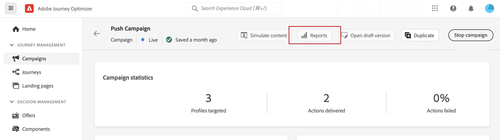
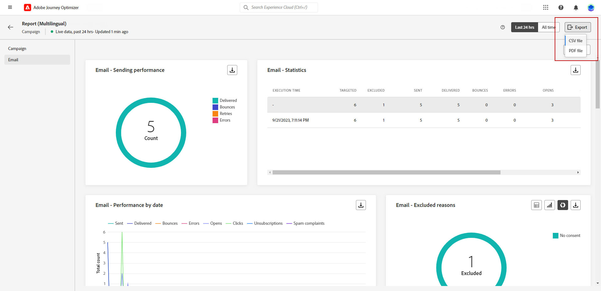

# Introducción al Informe en vivo {#live-report}

Use **[!UICONTROL Informe en vivo]** para medir y visualizar en tiempo real el impacto y el rendimiento de sus recorridos y sus mensajes en un panel integrado. Los datos están disponibles en el **[!UICONTROL informe en vivo]** tan pronto como se envíe o se ejecute el recorrido desde la ficha **[!UICONTROL Últimas 24 horas]**.

* Si desea direccionar un recorrido en el contexto de un recorrido, en el menú de **[!UICONTROL Recorridos]**, acceda al menú de **[!UICONTROL Más acciones]** de su recorrido y haga clic en el botón **[!UICONTROL Ver el informe de las últimas 24 horas]**.

  

* Si desea segmentar una campaña, en el menú **[!UICONTROL Campañas]**, acceda a su campaña y haga clic en el botón **[!UICONTROL Informes]**; a continuación, **[!UICONTROL Ver el informe de las últimas 24 horas]**.

  

Para obtener una lista detallada de todas las métricas disponibles en Adobe Journey Optimizer, consulte [esta página](#list-of-components-live).

## Personalizar tablero {#modify-dashboard}

Se puede modificar cada tablero de informes cambiando el tamaño o eliminando widgets. Cambiar los widgets solo afecta al tablero del usuario actual. Otros usuarios verán sus propios tableros o los establecidos de forma predeterminada.

1. En la lista desplegable **[!UICONTROL Acciones]**, elija si desea informar sobre una acción en particular de sus recorridos.

1. Elija si desea excluir los eventos de prueba de los informes con la barra de alternancia. Para obtener más información sobre los eventos de prueba, consulte [esta página](../building-journeys/testing-the-journey.md).

   Tenga en cuenta que la opción **[!UICONTROL Excluir eventos de prueba]** solo está disponible para los informes de Recorrido.

   

1. Para cambiar el tamaño o quitar widgets, haga clic en **[!UICONTROL Modificar]**.

   

1. Ajuste el tamaño de los widgets arrastrando su esquina inferior derecha.

   

1. Haga clic en **[!UICONTROL Eliminar]** para eliminar cualquier widget que no necesite.

   

1. Cuando esté satisfecho con el orden de visualización y el tamaño de los widgets, haga clic en **[!UICONTROL Guardar]**.

1. Para personalizar la forma en que se muestran los datos, puede cambiar entre distintas opciones de visualización, como gráficos, tablas y gráficos circulares.

   

El tablero se ha guardado. Los diferentes cambios se volverán a aplicar para un uso posterior de los informes activos. Si es necesario, use la opción **[!UICONTROL Restablecer]** para restaurar el orden predeterminado de los widgets y widgets.

## Exportación de informes {#export-reports}

Puede exportar fácilmente los distintos informes a los formatos PDF o CSV, lo que le permite compartirlos o imprimirlos.

>[!BEGINTABS]

>[!TAB Exporte su informe como archivo PDF]

1. En el informe, haga clic en **[!UICONTROL Exportar]** y seleccione **[!UICONTROL archivo PDF]**.

   

1. En la ventana Imprimir, configure el documento según sea necesario. Tenga en cuenta que las opciones pueden variar según el explorador.

1. Elija imprimir o guardar el informe como PDF.

1. Busque la carpeta en la que desea guardar el archivo, cambie su nombre si es necesario y haga clic en Guardar.

El informe ya está disponible para su visualización o uso compartido en un archivo pdf.

>[!TAB Exporte su informe como archivo CSV]

1. En el informe, haga clic en **[!UICONTROL Exportar]** y seleccione **[!UICONTROL archivo CSV]** para generar un archivo CSV en el nivel de informe general.

   

1. También puede elegir exportar datos de un widget específico. Haga clic en **[!UICONTROL Descargar archivo CSV]** junto al widget seleccionado.

   

1. El archivo se descargará automáticamente y se podrá encontrar en los archivos locales.

   Si ha generado el archivo en el nivel de informe, contiene información detallada para cada widget, incluidos su título y datos.

   Si ha generado el archivo en el nivel de widget, proporciona específicamente datos para el widget seleccionado.

>[!ENDTABS]
