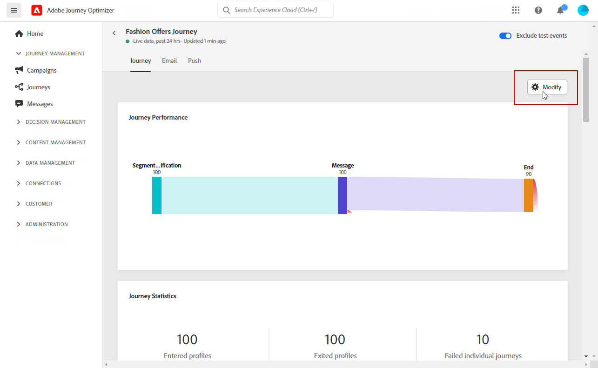
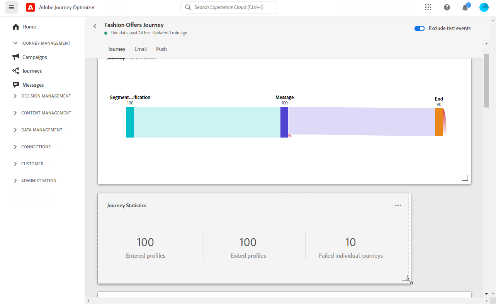
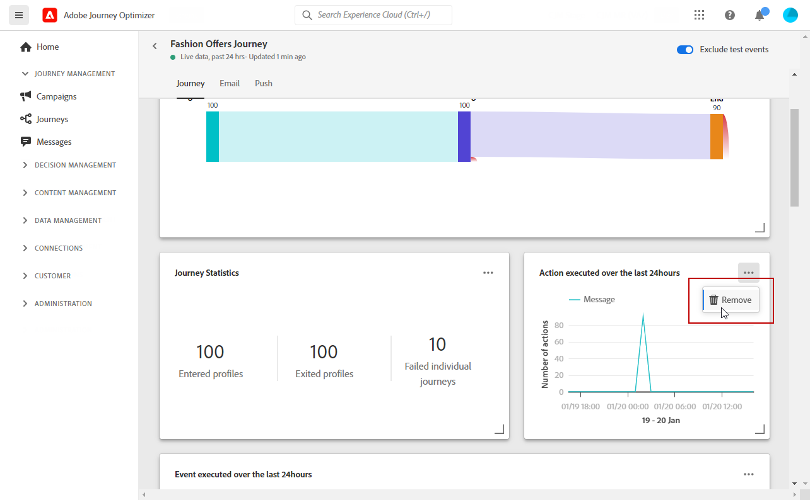

# Introducción a Live Report {#live-report}

Utilice la variable **[!UICONTROL Live report]** para medir y visualizar en tiempo real el impacto y el rendimiento de sus recorridos y mensajes en un panel integrado.
Los datos están disponibles en la **[!UICONTROL Live report]** en cuanto se realiza el envío o se ejecuta el recorrido.

* Si desea dirigirse a un recorrido o envíos en el contexto de un recorrido, desde el **[!UICONTROL Journeys]** , acceda al recorrido y haga clic en el botón **[!UICONTROL Live report]** icono. A continuación, puede encontrar los informes de Recorrido, correo electrónico y push en directo.

   

* Si desea segmentar un envío específico, en la **[!UICONTROL Live view]** del **[!UICONTROL Executions]** de los mensajes, seleccione **[!UICONTROL Live Report]** en el menú avanzado de la entrega seleccionada.

   

## Personalizar tablero {#modify-dashboard}

Cada tablero de informes se puede modificar cambiando el tamaño o eliminando las utilidades. Cambiar las utilidades solo afecta al tablero del usuario actual. Otros usuarios verán sus propios tableros o los que estén configurados de forma predeterminada.

1. Elija si desea excluir los eventos de prueba de los informes con la barra de alternancia. Para obtener más información sobre los eventos de prueba, consulte [esta página](../building-journeys/testing-the-journey.md).

   

1. Para cambiar el tamaño o eliminar widgets, haga clic en **[!UICONTROL Modify]**.

   

1. Ajuste el tamaño de los widgets arrastrando su esquina inferior derecha.

   

1. Haga clic en **[!UICONTROL Remove]** para quitar cualquier utilidad que no necesite.

   

1. Una vez que esté satisfecho con el orden de visualización y el tamaño de sus widgets, haga clic en **[!UICONTROL Save]**.

El tablero se ha guardado. Los diferentes cambios se volverán a aplicar para un uso posterior de los informes activos. Si es necesario, use la variable **[!UICONTROL Reset]** para restaurar el orden predeterminado de las utilidades y utilidades.
