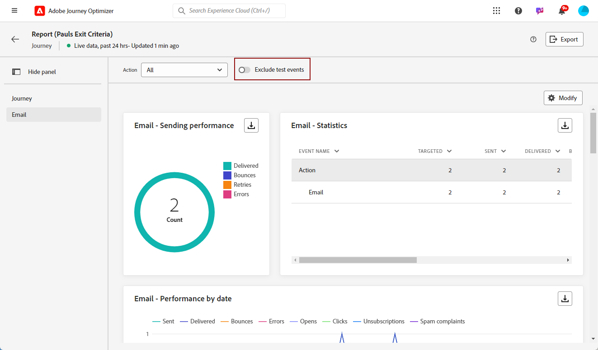

# Introducción al Informe en vivo {#live-report}

Utilice la variable **[!UICONTROL Informe activo]** para medir y visualizar en tiempo real el impacto y el rendimiento de sus recorridos y mensajes en un panel integrado.
Los datos están disponibles en la **[!UICONTROL Informe activo]** en cuanto se realiza el envío o el recorrido se ejecuta desde la **[!UICONTROL Últimas 24 horas]** pestaña .

* Si desea dirigirse a un recorrido en el contexto de un recorrido, desde la **[!UICONTROL Recorridos]** , acceda al recorrido y haga clic en el botón **[!UICONTROL Ver informe]** botón.

   

* Si desea dirigir una campaña, desde la **[!UICONTROL Campañas]** , acceda a la campaña y haga clic en el botón **[!UICONTROL Informes]** botón.

   

* Si desea cambiar del **[!UICONTROL Informe global]** a **[!UICONTROL Informe activo]** para la entrega, haga clic en **[!UICONTROL Últimas 24 horas]** del conmutador de pestañas.

   

Para obtener una lista detallada de todas las métricas disponibles en Adobe Journey Optimizer, consulte [esta página](#list-of-components-live).

## Personalizar tablero {#modify-dashboard}

Cada tablero de informes se puede modificar cambiando el tamaño o eliminando los widgets. Cambiar las utilidades solo afecta al tablero del usuario actual. Otros usuarios verán sus propios tableros o los que estén configurados de forma predeterminada.

1. En el **[!UICONTROL Acciones]** , elija si desea informar sobre una acción concreta de sus recorridos.

1. Elija si desea excluir los eventos de prueba de los informes con la barra de alternancia. Para obtener más información sobre los eventos de prueba, consulte [esta página](../building-journeys/testing-the-journey.md).

   Tenga en cuenta que **[!UICONTROL Excluir eventos de prueba]** solo está disponible para informes de Recorrido.

   

1. Para cambiar el tamaño o eliminar widgets, haga clic en **[!UICONTROL Modificar]**.

   

1. Ajuste el tamaño de los widgets arrastrando su esquina inferior derecha.

   

1. Haga clic en **[!UICONTROL Eliminar]** para quitar cualquier utilidad que no necesite.

   

1. Una vez que esté satisfecho con el orden de visualización y el tamaño de sus widgets, haga clic en **[!UICONTROL Guardar]**.

1. Para personalizar la forma en que se muestran los datos, puede cambiar de distintas opciones de visualización, como gráficos, tablas y gráficos circulares.

   

El tablero se ha guardado. Los diferentes cambios se volverán a aplicar para un uso posterior de los informes activos. Si es necesario, use la variable **[!UICONTROL Restablecer]** para restaurar el orden predeterminado de las utilidades y utilidades.

## Exportación de informes {#export-reports}

Puede exportar fácilmente los distintos informes al formato de PDF, lo que le permite compartirlos o imprimirlos.

1. En el informe, haga clic en **[!UICONTROL Exportar]**.

   

1. Desde la ventana Imprimir, configure el documento según sea necesario. Tenga en cuenta que las opciones pueden variar según el explorador.

1. Elija imprimir o guardar el informe como PDF.

1. Busque la carpeta en la que desea guardar el archivo, cambie el nombre si es necesario y haga clic en Guardar.

El informe ya está disponible para su visualización o uso compartido en un archivo pdf.
