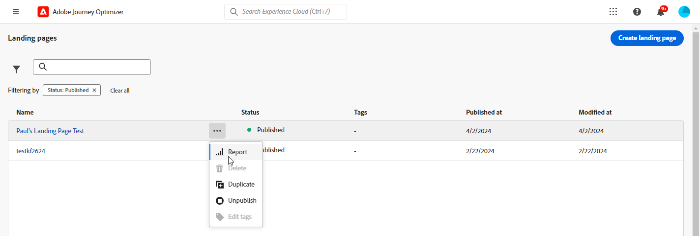

# Informe de página de destino {#lp-report-global-cja}

El informe **Página de aterrizaje** ofrece información valiosa sobre el comportamiento del usuario, los patrones de participación, las tasas de conversión y otras métricas clave, lo que le permite tomar decisiones informadas y optimizar el rendimiento de la página de aterrizaje de manera eficaz.

Para acceder a tus informes, selecciona **[!UICONTROL Informe]** en el menú avanzado de la página de aterrizaje seleccionada.

Para obtener más información sobre Customer Journey Analytics Workspace y cómo filtrar y analizar datos, consulte [esta página](https://experienceleague.adobe.com/en/docs/analytics-platform/using/cja-workspace/home).

## Tasa de conversión de página de aterrizaje {#lp-conversion}

El KPI **[!UICONTROL Tasa de conversión de páginas de aterrizaje]** le permite evaluar la eficacia de su página de aterrizaje en función del número de visitas e interacciones.

* **[!UICONTROL Tasa de conversión de página de aterrizaje]**: Número de personas que interactuaron con la página de aterrizaje (por ejemplo, se suscribieron a un formulario) en relación con el número total de visitas.

## Tasa de devoluciones de página de aterrizaje {#lp-bounce-rate}

El KPI **[!UICONTROL Tasa de salida hacia otro sitio de la página de aterrizaje]** proporciona información sobre perfiles que vieron su página de aterrizaje sin interactuar ni hacer clic en ningún elemento.

* **[!UICONTROL Tasa de salida hacia otro sitio de la página de aterrizaje]**: Número de personas que no interactuaron con la página de aterrizaje y no completaron la acción de suscripción en relación con el número total de visitas.

## Vistas de página de aterrizaje {#lp-views}

El KPI **[!UICONTROL Vistas de página de aterrizaje]** le permite ver el impacto de su página de aterrizaje.

* **[!UICONTROL Vistas de página de aterrizaje]**: Número total de visitas a su página de aterrizaje provenientes de recorridos y fuentes externas, incluidas las visitas múltiples de un perfil.

## Vistas de página de aterrizaje únicas {#lp-unique-views}

El KPI **[!UICONTROL Vistas únicas de la página de aterrizaje]** le permite medir el impacto de su página de aterrizaje al excluir varias vistas del mismo perfil.

* **[!UICONTROL Vistas únicas de la página de aterrizaje]**: Número de personas que visitaron su página de aterrizaje; no se tienen en cuenta las visitas múltiples de un perfil.

## Rendimiento de página de aterrizaje con el tiempo {#lp-performance-overtime}

El gráfico **[!UICONTROL Rendimiento de la página de aterrizaje con el paso del tiempo]** mide el éxito de sus páginas de aterrizaje y el impacto en la audiencia de destino.

* **[!UICONTROL Vistas de página de aterrizaje]**: Número total de visitas a su página de aterrizaje provenientes de recorridos y fuentes externas, incluidas las visitas múltiples de un perfil.

* **[!UICONTROL Conversión de página de aterrizaje]**: Número de personas que interactuaron con la página de aterrizaje (por ejemplo, se suscribieron a un formulario) en relación con el número total de visitas.

## Rendimiento de página de aterrizaje {#lp-performance}

La tabla **[!UICONTROL Rendimiento de la página de aterrizaje]** sirve como un tablero completo y ofrece un desglose detallado de las métricas clave relacionadas con su página de aterrizaje.

* **[!UICONTROL Tasa de conversión de página de aterrizaje]**: Número de personas que interactuaron con la página de aterrizaje (por ejemplo, se suscribieron a un formulario) en relación con el número total de visitas.

* **[!UICONTROL Tasa de salida hacia otro sitio de la página de aterrizaje]**: Número de personas que no interactuaron con la página de aterrizaje y no completaron la acción de suscripción en relación con el número total de visitas.

* **[!UICONTROL Vistas únicas de la página de aterrizaje]**: Número de personas que visitaron su página de aterrizaje; no se tienen en cuenta las visitas múltiples de un perfil.

* **[!UICONTROL Conversión de página de aterrizaje única]**: número de personas que interactuaron con la página de aterrizaje; no se tienen en cuenta las interacciones múltiples de un perfil.

* **[!UICONTROL Vistas de página de aterrizaje]**: Número total de visitas a su página de aterrizaje provenientes de recorridos y fuentes externas, incluidas las visitas múltiples de un perfil.

* **[!UICONTROL Conversión de página de aterrizaje]**: Número de personas que interactuaron con la página de aterrizaje, por ejemplo: suscritas a un formulario.

## Recorridos {#lp-journeys}

La tabla **[!UICONTROL Recorrido]** proporciona información general detallada sobre la frecuencia de las visitas a la página de aterrizaje en el contexto del recorrido de un usuario. Esta interesante representación ofrece datos valiosos sobre las interacciones de los usuarios, lo que le permite comprender cómo navegan los visitantes por el sitio y cómo interactúan con el contenido.

* **[!UICONTROL Vistas de página de aterrizaje]**: Número total de visitas a su página de aterrizaje provenientes de recorridos y fuentes externas, incluidas las visitas múltiples de un perfil.

* **[!UICONTROL Conversión de página de aterrizaje]**: Número de personas que interactuaron con la página de aterrizaje, por ejemplo: suscritas a un formulario.

## Campañas {#lp-campaigns}

La tabla **[!UICONTROL Campañas]** proporciona información sobre la cantidad de visitas dirigidas a su página de aterrizaje como resultado de campañas específicas, lo que ofrece una vista completa de la eficacia de la campaña y la participación con el contenido de su página de aterrizaje.

* **[!UICONTROL Vistas de página de aterrizaje]**: Número total de visitas a su página de aterrizaje provenientes de recorridos y fuentes externas, incluidas las visitas múltiples de un perfil.

* **[!UICONTROL Conversión de página de aterrizaje]**: Número de personas que interactuaron con la página de aterrizaje, por ejemplo: suscritas a un formulario.

## Canal {#lp-channels}

La tabla **[!UICONTROL Canal]** muestra el número de visitas a su página de aterrizaje clasificadas por cada canal.

* **[!UICONTROL Vistas de página de aterrizaje]**: Número total de visitas a su página de aterrizaje provenientes de recorridos y fuentes externas, incluidas las visitas múltiples de un perfil.

* **[!UICONTROL Conversión de página de aterrizaje]**: Número de personas que interactuaron con la página de aterrizaje, por ejemplo: suscritas a un formulario.

## Principales vínculos en los que se hizo clic {#lp-top-clicked}

La tabla **[!UICONTROL Principales vínculos en los que se hizo clic]** proporciona información sobre cómo los visitantes interactúan con el envío, destacando qué vínculos reciben la mayor participación y atención de su audiencia.

* **[!UICONTROL Clics en la página de aterrizaje]**: Número de veces que se hizo clic en un contenido en la página de aterrizaje.
