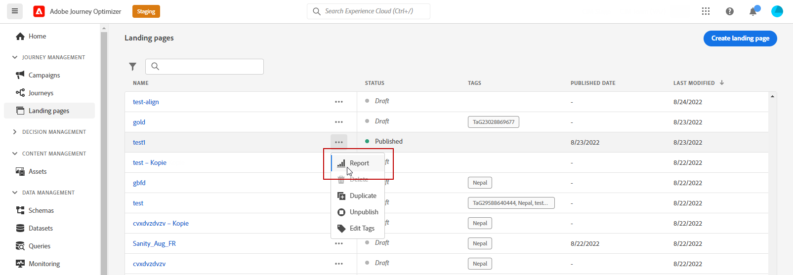

# Informe en vivo de la página de destino {#lp-report-live}

>[!BEGINSHADEBOX]

**En esta página:** mida el rendimiento de su página de aterrizaje en tiempo real en las últimas 24 horas con el informe en vivo de Adobe Journey Optimizer, que incluye visitas, conversiones, devoluciones y fuentes de visitas.

>[!ENDSHADEBOX]

>[!CONTEXTUALHELP]
>id="ajo_landing_page_live_report"
>title="Informe en vivo de la página de destino"
>abstract="El informe en vivo de la página de destino permite medir y visualizar en tiempo real el impacto y el rendimiento de la página de destino solo durante las últimas 24 horas. El informe se divide en distintos widgets que detallan el éxito y los errores de la página de destino. Cada panel de control de informes se puede modificar cambiando el tamaño de los widgets o eliminándolos."

Los informes en directo, a los que se puede acceder desde la pestaña Últimas 24 horas, muestran los eventos que han tenido lugar en las últimas 24 horas, con un intervalo de tiempo mínimo de dos minutos desde que se produjo el evento. En comparación, los informes de Customer Journey Analytics se centran en eventos que ocurrieron al menos hace dos horas y cubren eventos que se produjeron durante un período de tiempo seleccionado.

Para acceder a tus informes, selecciona **[!UICONTROL Ver el informe de las últimas 24 horas]** en el menú avanzado de la página de aterrizaje seleccionada.

La página de aterrizaje **[!UICONTROL Informe en vivo]** está dividida en diferentes widgets que detallan el éxito y los errores de su entrega. Se puede cambiar el tamaño de cada widget y eliminarlo si es necesario. Para obtener más información, consulte esta [sección](live-report.md).

+++Obtenga más información acerca de las distintas métricas y widgets disponibles para el informe en directo de la página de aterrizaje.

El widget **[!UICONTROL Rendimiento de la página de aterrizaje]** detalla la información principal relacionada con su mensaje en las últimas 24 horas mediante KPI:

* **[!UICONTROL Visitas totales]**: Número total de visitas a su página de aterrizaje desde un recorrido u otras fuentes, incluidas las visitas múltiples de un destinatario.

* **[!UICONTROL Conversiones]**: Número de personas que interactuaron con la página de aterrizaje (por ejemplo, se suscribieron a un formulario).

* **[!UICONTROL Devoluciones]**: Número de personas que no interactuaron con la página de aterrizaje y no completaron la acción de suscripción.

El widget **[!UICONTROL Fuentes de visitas]** representa cómo acceden los visitantes a su página de aterrizaje:

* **[!UICONTROL Recorrido(s)]**: Número de visitas a su página de aterrizaje provenientes de un recorrido.

* **[!UICONTROL Otras fuentes]**: Número de visitas a la página de aterrizaje provenientes de una fuente externa en lugar de un recorrido.

Los **[!UICONTROL vínculos en los que se hizo clic más arriba]** identifican la interacción de los visitantes con la página de aterrizaje:

* **[!UICONTROL Clics]**: Número de veces que se hizo clic en un contenido en la página de aterrizaje.

El widget **[!UICONTROL Recorrido(es)]** representa el número de visitas a su página de aterrizaje desde un recorrido.

El widget **[!UICONTROL Otras fuentes]** representa el número de visitas a su página de aterrizaje desde una fuente externa en lugar de un recorrido.

Los gráficos **[!UICONTROL Visitas por mensajes]** / **[!UICONTROL Conversiones por mensajes]** representan la cantidad total de visitas y personas que interactuaron correctamente con la página de aterrizaje en las últimas 24 horas, según los mensajes enviados.

Los gráficos **[!UICONTROL Visitas por canales]** / **[!UICONTROL Conversiones por canales]** representan la cantidad total de visitas y personas que interactuaron correctamente con la página de aterrizaje en las últimas 24 horas, según los canales.
+++

Para obtener una lista detallada de todas las métricas disponibles en Adobe Journey Optimizer, consulte [esta página](live-report.md#live-report).
