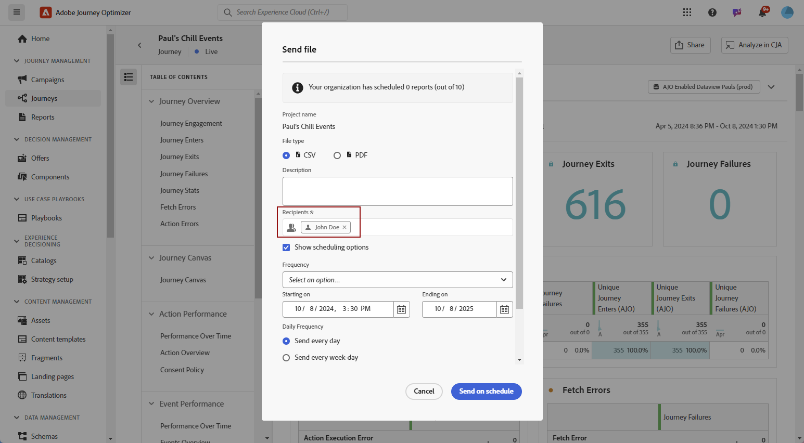

# Administración de informes {#channel-cja-manage}

## Analizar en Customer Journey Analytics {#analyze}

>[!AVAILABILITY]
>
> La funcionalidad **Analizar en CJA** está disponible de forma exclusiva para los usuarios con una licencia de [!DNL Customer Journey Analytics].

Mejore su experiencia de análisis de datos con la licencia de **[!DNL Customer Journey Analytics]** aprovechando la función **[!UICONTROL Analizar en CJA]** disponible en todos los informes.

Esta potente opción le redirige sin problemas a su entorno de **[!DNL Customer Journey Analytics]**, lo que le permite personalizar sus informes exhaustivamente. Puede enriquecer sus widgets con métricas de Customer Journey Analytics especializadas, llevando sus perspectivas a un nivel completamente nuevo.

[Más información acerca de la interfaz de Customer Journey Analytics.](https://experienceleague.adobe.com/en/docs/analytics-platform/using/cja-overview/cja-getting-started)

## Definición del período de informe {#report-period}

Al acceder a un informe, puede aplicar un filtro de período de tiempo, ubicado en la esquina superior derecha del informe.

De forma predeterminada, el periodo de filtrado de una campaña o recorrido se establece en sus fechas de inicio y finalización. Si no hay fecha de finalización, el filtro toma de forma predeterminada la fecha actual.

Para modificar el filtro, puede seleccionar una fecha de inicio y una duración personalizadas, o elegir entre opciones preestablecidas como la semana pasada o hace dos meses.

El informe se actualizará automáticamente una vez que se aplique o modifique el filtro.

## Exportación de informes {#export-reports}

Puede exportar fácilmente los distintos informes a los formatos PDF o CSV, lo que le permite compartirlos o imprimirlos. Los pasos para exportar informes se detallan en las pestañas siguientes.

>[!BEGINTABS]

>[!TAB Exporte su informe como archivo CSV]

1. En el informe, haga clic en **[!UICONTROL Compartir]** y seleccione **[!UICONTROL Descargar CSV]** para generar un archivo CSV en el nivel de informe general.

   

1. El archivo se descargará automáticamente y se podrá encontrar en los archivos locales.

   Si ha generado el archivo en el nivel de informe, contiene información detallada para cada widget, incluidos su título y datos.

>[!TAB Exporte su informe como archivo PDF]

1. En el informe, haga clic en **[!UICONTROL Compartir]** y seleccione **[!UICONTROL Descargar PDF]**.

   

1. Una vez solicitada la descarga, haz clic en **[!UICONTROL Descargar]**.

   

1. El archivo se abrirá automáticamente en el explorador.

El informe ya está disponible para verlo, descargarlo o compartirlo en un archivo pdf.

>[!ENDTABS]

## Programar exportaciones {#schedule-export}

La **exportación de horario** le permite automatizar el envío de hasta 10 informes a intervalos semanales, mensuales o anuales. También puede administrar fácilmente sus informes programados, con opciones para actualizar, editar, cancelar o eliminar cualquiera de sus exportaciones programadas.

1. En el informe, haga clic en **[!UICONTROL Compartir]** y seleccione **[!UICONTROL Programar exportación]**.

   

1. Elija su **[!UICONTROL tipo de archivo]** entre CSV y PDF.

1. Si es necesario, puede agregar **[!UICONTROL Descripción]** a la exportación.

1. Introduzca el nombre de los destinatarios que recibirán esta entrega automatizada.

   

1. Elija la **[!UICONTROL frecuencia]**.

1. En función de la frecuencia seleccionada, proporcione los detalles de programación relevantes, como:

   * Fecha de inicio y de finalización

   * Intervalo (por ejemplo, cada pocas semanas)

   * Día específico de la semana

   * Semana dentro del mes

   * Día dentro del mes

   * Mes del año

1. Haga clic en **[!UICONTROL Enviar según lo programado]**.

1. Para editar la exportación programada creada anteriormente, haga clic en **[!UICONTROL Compartir]** y seleccione **[!UICONTROL Administrar programaciones]**.

   

1. En la lista de exportaciones programadas, seleccione la que desee actualizar y realice los cambios necesarios.

1. Para eliminar un informe programado, seleccione uno de la lista de programaciones administradas y haga clic en **[!UICONTROL Eliminar]**.

   

## Creación de una métrica simple {#create-simple-metric}

Puede crear métricas calculadas personalizadas directamente en los informes. Puede generar perspectivas más adaptadas y analizar mejor los datos combinando dos métricas existentes de manera que se adapten a sus necesidades específicas de creación de informes.

1. Comience por acceder al informe en el que desea agregar una métrica nueva.

1. En la tabla del informe, seleccione las métricas que desee manteniendo presionadas las claves `Shift` o `CTRL/CMD` mientras hace clic en ellas. A continuación, haga clic con el botón derecho y seleccione **[!UICONTROL Crear métrica a partir de la selección]**.

   Si selecciona más de dos métricas, solo se utilizarán las dos primeras en el creador de métricas.

   

1. En el Creador de métricas calculadas, asigne un nombre a la nueva métrica escribiendo el campo **[!UICONTROL Título]**. También puede agregar una **[!UICONTROL descripción]**.

   >[!NOTE]
   >
   >Si tiene Customer Journey Analytics, puede personalizar aún más las métricas con opciones adicionales. [Más información](https://experienceleague.adobe.com/en/docs/analytics-platform/using/cja-components/cja-calcmetrics/cm-workflow/cm-build-metrics#areas-of-the-calculated-metrics-builder)

1. Elija los **[!UICONTROL lugares decimales]** adecuados y seleccione un **[!UICONTROL formato]** (decimal, hora, porcentaje o moneda) en función de cómo desee que se muestre su métrica.

1. Seleccione el operador, como suma, resta, multiplicación o división, que determinará cómo se calcula la métrica.

   

1. Puede reordenar los componentes si es necesario.

1. Cuando esté satisfecho con la configuración, haga clic en **[!UICONTROL Aplicar]** para finalizar la nueva métrica.

1. La nueva métrica aparecerá junto a las métricas originales en el informe.

   

La métrica que acaba de crear se incluirá al exportar el informe como PDF o CSV. Sin embargo, se eliminará del informe una vez que lo cierre.

## Exploración de datos con el generador de Insight {#exploratory}

Use la herramienta Insight Builder para crear fácilmente tablas y visualizaciones a partir de las **[!UICONTROL dimensiones]** y las **[!UICONTROL métricas]** que haya seleccionado. Esta herramienta optimiza la exploración de datos, lo que le permite personalizar y analizar automáticamente la información con facilidad. Obtenga más información en [esta documentación](https://experienceleague.adobe.com/en/docs/analytics/analyze/analysis-workspace/panels/quickinsight).

1. Comience por acceder al informe donde desea utilizar el generador de Insight.

1. Seleccione el menú del creador de Insight en el menú del carril izquierdo.

   

1. Cree una consulta eligiendo una **[!UICONTROL Dimension]** y una **[!UICONTROL métrica]** mediante los menús desplegables. También puede seleccionar un **[!UICONTROL segmento]** si es necesario.

   

1. Defina el intervalo de fechas para que el análisis especifique el periodo en el que desea centrarse. De forma predeterminada, el intervalo de fechas se establecerá en el utilizado en el panel de informes.

1. Use las opciones **[!UICONTROL Agregar desglose]** o **[!UICONTROL Agregar métrica]** para incluir dimensiones adicionales, lo que permite un desglose de datos más detallado.

   Tenga en cuenta que solo puede agregar hasta tres **[!UICONTROL dimensiones]**, **[!UICONTROL métricas]** y **[!UICONTROL segmentos]**.

Ahora puede analizar los datos con las herramientas de visualización y tabla personalizadas.

<!--## Create a down-funnel metric {#down-funnel}

1. Create a new journey or open an existing one. [Learn more about journey creation](../building-journeys/journey-gs.md)

1. On the canvas editor, select the option to "add a metric".

c. In the metric selector, choose whichever conversion metric seems appropriate and publish your journey

d. Open the report for the journey that you added the metric to and ensure that the metric has been added to the table alongside all the other pre-configured metrics.
-->

## Crear una audiencia a partir de datos de informes {#create-audience}

>[!IMPORTANT]
>
>Cada organización se limita a publicar 25 audiencias. Además, los usuarios pueden publicar un máximo de 5 audiencias por hora y 20 por día.
> Las audiencias únicas tienen una duración de 48 horas. Por lo tanto, si se publican 25 audiencias dentro de ese periodo de tiempo, las audiencias adicionales solo se pueden publicar una vez transcurrido el periodo de 48 horas.

Ahora puede seleccionar datos específicos dentro de la tabla y crear directamente una audiencia a partir de estas selecciones, lo que optimiza y simplifica el proceso de creación de audiencias.

1. Para empezar, vaya a la tabla del informe que contiene los datos que desea transformar en una audiencia.

1. Haga clic con el botón derecho en la celda deseada y seleccione **[!UICONTROL Crear audiencia]**.

   También puede iniciar la creación de audiencias desde el widget **[!UICONTROL lienzo de Recorrido]** seleccionando un nodo y haciendo clic con el botón derecho en él.

1. En la ventana **[!UICONTROL Crear audiencia]**, escriba un **[!UICONTROL Nombre]** y establezca un **[!UICONTROL intervalo de fecha único]** para la audiencia que planea publicar.

   >[!NOTE]
   >
   >Si tiene Customer Journey Analytics, puede personalizar aún más las métricas con opciones adicionales. [Más información](https://experienceleague.adobe.com/en/docs/analytics-platform/using/cja-components/audiences/publish)

   

1. Haga clic en el botón **[!UICONTROL Crear]** para finalizar la creación de la audiencia. Tenga en cuenta que este proceso puede requerir algún tiempo para completarse.

Ahora puede utilizar la audiencia recién creada con un Recorrido o una campaña.

## Administración de plantillas {#cja-template}

>[!AVAILABILITY]
>
> La funcionalidad **Template** se está implementando progresivamente por fases, con una disponibilidad general completa planificada para finales de enero y disponible exclusivamente para los usuarios con una licencia de [!DNL Customer Journey Analytics].

Ahora tiene la opción de mejorar los informes de Journey Optimizer mediante plantillas de Customer Journey Analytics. [Más información sobre la plantilla Customer Journey Analytics](https://experienceleague.adobe.com/en/docs/analytics-platform/using/cja-workspace/templates/use-templates#use-reports)

Al acceder a los informes, puede elegir entre dos tipos de plantilla en la lista desplegable **[!UICONTROL Seleccionar una plantilla]**:

* Plantilla predeterminada proporcionada por Adobe
* Plantillas generadas por el cliente

Si no se ha creado ninguna plantilla, la lista desplegable **[!UICONTROL Seleccionar una plantilla]** no aparecerá en la interfaz de informes.

Para crear una plantilla, siga los pasos a continuación:

1. En [!DNL Customer Journey Analytics], vaya al menú **[!UICONTROL Workspace]** y seleccione **[!UICONTROL Adobe templates]**. [Más información sobre las plantillas disponibles](https://experienceleague.adobe.com/en/docs/analytics-platform/using/cja-workspace/templates/use-templates#available-templates)

1. Examine las plantillas creadas previamente disponibles y haga clic en **[!UICONTROL Usar plantilla]** para seleccionar una.

   

1. Ajuste el informe para adaptarlo a sus necesidades. Consulte [Documentación de Customer Journey Analytics](https://experienceleague.adobe.com/en/docs/analytics-platform/using/cja-workspace/home).

1. Una vez completada la plantilla personalizada, accede al menú **[!UICONTROL Proyecto]** y selecciona **[!UICONTROL Guardar como plantilla]**.

   

1. Proporcione los detalles necesarios para la plantilla. Consulte [Documentación de Customer Journey Analytics](https://experienceleague.adobe.com/en/docs/analytics-platform/using/cja-workspace/templates/create-templates#edit-or-delete-a-template) para obtener información detallada.

   >[!IMPORTANT]
   >
   > Asegúrese de elegir **Journey Optimizer** en **[!UICONTROL Casos de uso]** y especifique el tipo de actividad de **Journey Optimizer** y la **actividad** correspondientes. Esto permite que el informe aparezca en Journey Optimizer.

   

1. En [!DNL Journey Optimizer], desde tu informe, accede a tu informe y elige la plantilla creada anteriormente en la lista desplegable **[!UICONTROL Seleccionar una plantilla]**.

   

Para crear directamente una plantilla a partir del informe de Recorrido Optimizer, simplemente accede a tu campaña o informe de recorrido, selecciona **[!UICONTROL Analizar en CJA]** y personaliza la plantilla predeterminada siguiendo los pasos descritos anteriormente.
