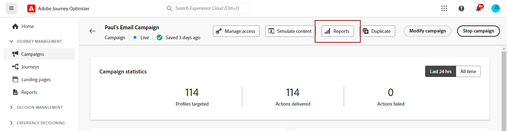

# Introducción a la nueva interfaz de informes {#channel-report-gs-cja}

>[!NOTE]
>
> Para volver a los informes tradicionales de Journey Optimizer, simplemente cambie el **[!UICONTROL Usar nueva experiencia]** opción.

La creación de informes de Journey Optimizer ofrece una interoperabilidad mejorada con funciones de Customer Journey Analytics, estandarización de los informes en ambas plataformas y mejora de la coherencia y fiabilidad de los datos. Esta integración perfecta entre Journey Optimizer y Customer Journey Analytics proporciona una visión más clara de las métricas de rendimiento, lo que permite a los usuarios tomar decisiones más informadas.

* Si desea dirigirse a un recorrido o envíos en el contexto de un recorrido, desde el **[!UICONTROL Recorridos]** , acceda al recorrido y haga clic en el **[!UICONTROL Ver informe]** botón.

  En la lista de recorridos existentes, también puede seleccionar **[!UICONTROL Informe]** en el menú avanzado del recorrido seleccionado. [Obtenga más información sobre el informe de Recorrido](journey-global-report-cja.md)

  

* Si desea dirigirse a una campaña, en el **[!UICONTROL Campañas]** , acceda a la campaña y haga clic en **[!UICONTROL Informes]** botón.

  En la lista de campañas existentes, también puede seleccionar **[!UICONTROL Informe]** en el menú avanzado de la campaña seleccionada. [Obtenga más información sobre el informe de campaña](campaign-global-report-cja.md)

  

* Si desea establecer como objetivo métricas para todas las campañas y recorridos de su entorno, acceda al **Información general** para crear un informe de navegando hasta **[!UICONTROL Informes]** menú dentro de **[!UICONTROL Administración de recorrido]** sección. [Obtenga más información sobre el informe Información general](channel-report-cja.md)

  

## Requisitos previos {#prerequisites}

* Si lo hace **no** propio Customer Journey Analytics, o si es de su propiedad, pero lo hace **no** Si tiene acceso a cualquier perfil de producto de Customer Journey Analytics, los permisos se administran en Journey Optimizer. En este caso, solo necesita el **[!UICONTROL Ver informes de canal]** permiso o funciones relacionadas. [Más información sobre los permisos de Journey Optimizer](../administration/permissions.md)
* Si es el propietario del Customer Journey Analytics y tiene acceso a un perfil de producto de Customer Journey Analytics, se aplican permisos de Customer Journey Analytics estándar. El administrador del Customer Journey Analytics es responsable de mantener el acceso adecuado del usuario. [Más información sobre los Permisos de Customer Journey Analytics](https://experienceleague.adobe.com/en/docs/analytics-platform/using/technotes/access-control)
* Las vistas de datos del Customer Journey Analytics deben configurarse con la siguiente configuración: **Establecer como vista de datos predeterminada en Adobe Journey Optimizer**. [Más información sobre las vistas de datos](https://experienceleague.adobe.com/en/docs/analytics-platform/using/cja-dataviews/create-dataview)
* Para acceder al panel del Customer Journey Analytics en Journey Optimizer, simplemente active la **[!UICONTROL Usar nueva experiencia]** alterne en el informe.

  

## Vídeo explicativo{#video}

El siguiente vídeo muestra cómo asignar el **Administrar configuración de aplicación** permiso para acceder al menú Superficies de la aplicación.

>[!VIDEO](https://video.tv.adobe.com/v/3430413)