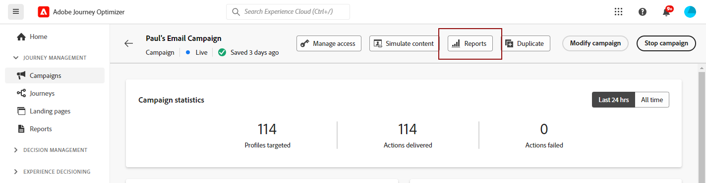

# Introducción al Informe de todo el tiempo {#channel-report-gs-cja}

>[!CONTEXTUALHELP]
>id="cja_connections_enable_cja"
>title="Habilitar Customer Journey Analytics"
>abstract="Para analizar este informe en Customer Journey Analytics, póngase en contacto con el administrador para asegurarse de que su organización ha adquirido Customer Journey Analytics y de que la integración está configurada correctamente."
>additional-url="https://experienceleague.adobe.com/es/docs/journey-optimizer/using/channels/email/design-email/add-content/content-components#add-content-components" text="Customer Journey Analytics"

La creación de informes en Journey Optimizer cuenta con una interoperabilidad mejorada con las funciones de Customer Journey Analytics, estandariza la creación de informes en ambas plataformas y mejora la coherencia y fiabilidad de los datos. Esta integración perfecta entre Journey Optimizer y Customer Journey Analytics proporciona una visión más clara de las métricas de rendimiento, lo que permite a los usuarios tomar decisiones más informadas.

El acceso a estas funciones de creación de informes depende del contexto y las áreas de producto:

* **Recorridos**: si desea dirigir un recorrido o envíos en el contexto de un recorrido, en el menú **[!UICONTROL Recorridos]**, acceda al recorrido y haga clic en el botón **[!UICONTROL Ver informe]**.

  En la lista de recorridos existentes, también puedes seleccionar **[!UICONTROL Informe]** del menú avanzado del recorrido seleccionado. [Más información sobre el informe de Recorrido](journey-global-report-cja.md)

  

* **Campañas**: si deseas segmentar una campaña, desde el menú **[!UICONTROL Campañas]**, accede a tu campaña y haz clic en el botón **[!UICONTROL Informes]**; a continuación, **[!UICONTROL Ver informe de todo el tiempo]**.

  En la lista de campañas existentes, también puedes seleccionar **[!UICONTROL Informe]** del menú avanzado de la campaña seleccionada. [Más información sobre el informe de Campaign](campaign-global-report-cja.md)

  

* **Global**: si desea establecer como objetivo métricas para todas las campañas y recorridos de su entorno, acceda al informe **Información general** navegando al menú **[!UICONTROL Informes]** dentro de la sección **[!UICONTROL Administración de Recorrido]**. [Más información acerca del informe de información general](channel-report-cja.md)

  

>[!IMPORTANT]
>
>Los informes de Adobe Journey Optimizer están estandarizados actualmente en UTC. En una versión futura se introducirá la capacidad de personalizar la zona horaria de los informes.

## Requisitos previos {#prerequisites}

* Si **no** es propietario de Customer Journey Analytics, o si es propietario pero **no** tiene acceso a ningún perfil de producto de Customer Journey Analytics, los permisos se administran en Journey Optimizer. En este caso, necesita el permiso **[!UICONTROL Ver informes de canal]** para roles relacionados. [Más información](../administration/permissions.md)

* Si usted **posee** Customer Journey Analytics y tiene acceso a un perfil de producto de Customer Journey Analytics, necesita:

   * Permisos de **[!UICONTROL Creación de audiencias]** y **[!UICONTROL Vista de audiencias]** para Customer Journey Analytics. [Más información](https://experienceleague.adobe.com/es/docs/analytics-platform/using/technotes/access-control){target="_blank"}

   * Permiso de **[!UICONTROL Administrar perfiles]** para Adobe Journey Optimizer. [Más información](../administration/permissions.md)

* Las vistas de datos de Customer Journey Analytics deben configurarse con la siguiente configuración: **Establecer como vista de datos predeterminada en Adobe Journey Optimizer**. [Más información sobre las vistas de datos](https://experienceleague.adobe.com/es/docs/analytics-platform/using/cja-dataviews/create-dataview){target="_blank"}

## Vídeo práctico{#video}

El siguiente vídeo muestra cómo utilizar los informes mejorados de Journey Optimizer con Customer Journey Analytics.

>[!VIDEO](https://video.tv.adobe.com/v/3443154?captions=spa)