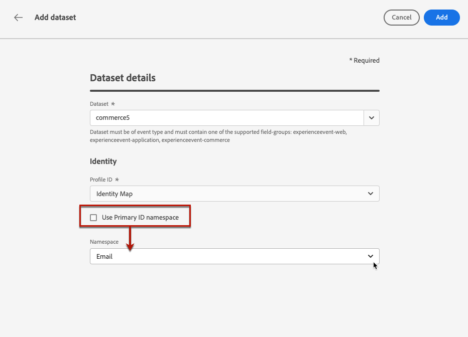

# Requisitos previos de creación de informes y experimentación {#reporting-configuration}

>[!CONTEXTUALHELP]
>id="ajo_admin_reporting_config"
>title="Configuración de conjuntos de datos para creación de informes"
>abstract="La configuración de la creación de informes permite recuperar métricas adicionales que se utilizarán en los informes de campaña. Debe realizarla un usuario técnico."

>[!CONTEXTUALHELP]
>id="ajo_admin_reporting_dataset"
>title="Selección de un conjunto de datos"
>abstract="Solo puede seleccionar un conjunto de datos de tipo evento, que debe contener al menos uno de los grupos de campos admitidos: detalles de la aplicación, detalles de comercio, detalles web."

>[!NOTE]
>
>La configuración de creación de informes debe realizarla un usuario técnico.

La configuración de la fuente de datos de creación de informes permite definir una conexión con un sistema para recuperar información adicional que se utilizará en los informes.

Para esta configuración, debe agregar uno o más conjuntos de datos que contengan los elementos adicionales que desee utilizar en los informes. Para ello, siga los pasos [debajo de](#add-datasets).

Tenga en cuenta que para los canales web, basados en código y en la aplicación, debe asegurarse de que el [conjunto de datos](../data/get-started-datasets.md) configurado para la recopilación de datos también se añada a esta configuración del sistema de informes. De lo contrario, los datos web y en la aplicación no se mostrarán en los informes de experimento de contenido.

## Requisitos previos

Antes de poder agregar un conjunto de datos a la configuración de creación de informes, debe crearlo. Obtenga más información en la [documentación de Adobe Experience Platform](https://experienceleague.adobe.com/docs/experience-platform/catalog/datasets/user-guide.html?lang=es#create){target="_blank"}.

* Solo puede añadir conjuntos de datos de tipo evento.

* Estos conjuntos de datos deben incluir el `Experience Event - Proposition Interactions` [grupo de campos](https://experienceleague.adobe.com/docs/experience-platform/xdm/tutorials/create-schema-ui.html?lang=es#field-group){target="_blank"}.

* Estos conjuntos de datos también pueden contener uno de los siguientes [grupos de campos](https://experienceleague.adobe.com/docs/experience-platform/xdm/tutorials/create-schema-ui.html?lang=es#field-group){target="_blank"}: `Application Details`, `Commerce Details`, `Web Details`.

  >[!NOTE]
  >
  >También se pueden incluir otros grupos de campo, pero actualmente solo los grupos de campo anteriores son compatibles con los informes de Journey Optimizer.

  Por ejemplo, si desea conocer el impacto de una campaña de correo electrónico en los datos de comercio, como compras o pedidos, debe crear un conjunto de datos de evento de experiencia con el grupo de campos `Commerce Details`.

  Del mismo modo, si desea informar sobre interacciones móviles, debe crear un conjunto de datos de evento de experiencia con el grupo de campos `Application Details`.

  <!--The metrics corresponding to each field group are listed [here](#objective-list).-->

* Puede añadir estos grupos de campos a uno o varios esquemas que se utilizarán en uno o varios conjuntos de datos.

>[!NOTE]
>
>Obtenga más información acerca de esquemas XDM y grupos de campos en la [documentación de información general del sistema XDM](https://experienceleague.adobe.com/docs/experience-platform/xdm/home.html?lang=es){target="_blank"}.

<!--
## Objectives corresponding to each field group {#objective-list}

The table below shows which metrics will be added to the **[!UICONTROL Objectives]** tab of your campaign reports for each field group.

| Field group | Objectives |
|--- |--- |
| Commerce Details | Price Total Payment Amount (Unique) Checkouts (Unique) Product List Adds (Unique) Product List Opens (Unique) Product List Removal (Unique) Product List Views (Unique) Product Views (Unique) Purchases (Unique) Save For Laters Product Price Total Product Quantity |
| Application Details | (Unique) App Launches First App Launches (Unique) App Installs (Unique) App Upgrades |
| Web Details | (Unique) Page Views |
-->

## Añadir conjuntos de datos {#add-datasets}

>[!NOTE]
>
>Los conjuntos de datos recién creados solo estarán disponibles en los informes de Customer Journey Analytics.

1. En el menú **[!UICONTROL Administración]**, seleccione **[!UICONTROL Configuraciones]**. En la sección **[!UICONTROL Informes]**, haga clic en **[!UICONTROL Administrar]**.

   

   Se muestra la lista de conjuntos de datos que ya se han agregado.

1. En la ficha **[!UICONTROL Conjunto de datos]**, haga clic en **[!UICONTROL Agregar conjunto de datos]**.

   

   >[!NOTE]
   >
   >Si selecciona la pestaña **[!UICONTROL Conjunto de datos del sistema]**, solo se mostrarán los conjuntos de datos creados por el sistema. No podrá añadir otros.

1. En la lista desplegable **[!UICONTROL Conjunto de datos]**, seleccione el conjunto de datos que desee usar para sus informes.

   >[!CAUTION]
   >
   >Solo puede seleccionar un conjunto de datos de tipo de evento, que debe contener al menos uno de los [grupos de campos](https://experienceleague.adobe.com/docs/experience-platform/xdm/tutorials/create-schema-ui.html?lang=es#field-group){target="_blank"} admitidos: **Detalles de la aplicación**, **Detalles de Commerce**, **Detalles web**. Si selecciona un conjunto de datos que no coincida con esos criterios, no podrá guardar los cambios.

   

   Obtenga más información acerca de los conjuntos de datos en la [documentación de Adobe Experience Platform](https://experienceleague.adobe.com/docs/experience-platform/catalog/datasets/overview.html?lang=es){target="_blank"}.

1. En la lista desplegable **[!UICONTROL ID de perfil]**, seleccione el atributo de campo del conjunto de datos que se utilizará para identificar cada perfil en los informes.

   

   >[!NOTE]
   >
   >Solo se muestran los ID disponibles para la creación de informes.

1. La opción **[!UICONTROL Usar área de nombres de ID principal]** está habilitada de manera predeterminada. Si el **[!UICONTROL Id. de perfil]** seleccionado es **[!UICONTROL Mapa de identidad]**, puede deshabilitar esta opción y elegir otro área de nombres en la lista desplegable que se muestra.

   

   Obtenga más información sobre áreas de nombres en la [documentación de Adobe Experience Platform](https://experienceleague.adobe.com/docs/experience-platform/identity/namespaces.html?lang=es){target="_blank"}.

1. Guarde los cambios para añadir el conjunto de datos seleccionado a la lista de configuración de creación de informes.

   >[!CAUTION]
   >
   >Si seleccionó un conjunto de datos que no es de tipo de evento, no podrá continuar.

<!--
When building your campaign reports, you can now see the metrics corresponding to the field groups used in the datasets you added. Go to the **[!UICONTROL Objectives]** tab and select the metrics of your choice to better fine-tune your reports. [Learn more](content-experiment.md#objectives-global)

>[!NOTE]
>
>If you add several datasets, all data from all datasets will be available for reporting.

## How-to video {#video}

Understand how to configure Experience Platform reporting data sources.

>[!VIDEO]()
-->
