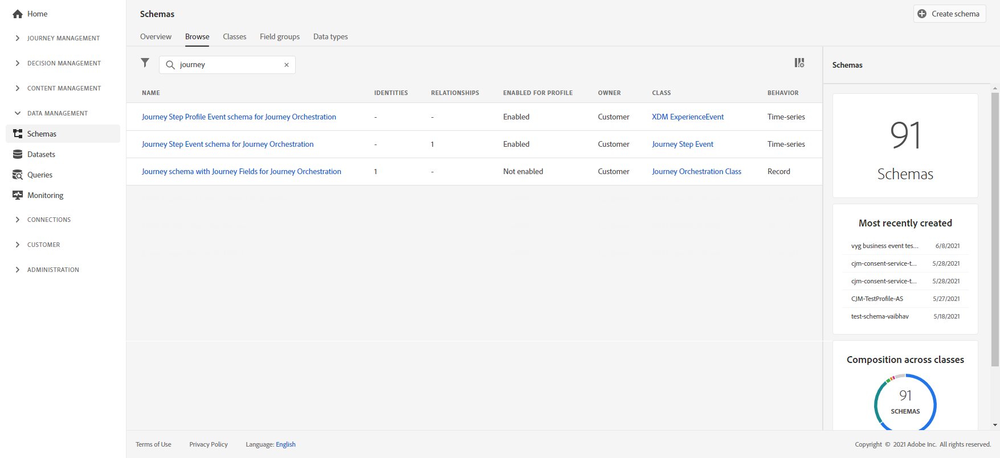

# Creación de informes de recorrido {#design-jo-reports}

Además de [informes en tiempo real](live-report.md) y integrados [funciones de informes globales](global-report.md), [!DNL Journey Optimizer] puede enviar automáticamente datos de rendimiento del recorrido a Adobe Experience Platform para que se puedan combinar con otros datos con fines de análisis.

>[!NOTE]
>
>Esta función se activa de forma predeterminada en todas las instancias para eventos de pasos de recorrido. No se pueden modificar ni actualizar los esquemas y conjuntos de datos que se han creado durante el aprovisionamiento para eventos de paso. De forma predeterminada, estos esquemas y conjuntos de datos están en modo de solo lectura.

Por ejemplo, ha configurado un recorrido que envía varios correos electrónicos. Esta capacidad le permite combinar lo siguiente [!DNL Journey Optimizer] datos con datos de evento descendente como cuántas conversiones se produjeron, cuánta participación se produjo en el sitio web o cuántas transacciones se produjeron en la tienda. La información de recorrido se puede combinar con los datos de Adobe Experience Platform, ya sea desde otras propiedades digitales o desde propiedades sin conexión para proporcionar una vista más completa del rendimiento.

[!DNL Journey Optimizer] crea automáticamente los esquemas y flujos necesarios en conjuntos de datos a Adobe Experience Platform para cada paso que realiza un individuo en un recorrido. Un evento de paso corresponde a un individuo que se mueve de un nodo a otro en un recorrido. Por ejemplo, en un recorrido que tiene un evento, una condición y una acción, se envían tres eventos de paso a Adobe Experience Platform.

La lista de campos XDM que se pasan es completa. Algunos contienen códigos generados por el sistema y otros tienen nombres descriptivos en lenguaje natural. Algunos ejemplos son la etiqueta de la actividad de recorrido o el estado del paso: cuántas veces se ha superado el tiempo de espera de una acción o ha finalizado en error.

>[!CAUTION]
>
>Los conjuntos de datos no se pueden activar para el servicio de perfil en tiempo real. Asegúrese de que la variable **[!UICONTROL Perfil]** la opción está desactivada.

[!DNL Journey Optimizer] envía datos a medida que se producen de forma continua. Puede consultar estos datos mediante el servicio de consultas. Puede conectarse a Customer Journey Analytics u otras herramientas de BI para ver los datos relacionados con estos pasos.

Se crean los siguientes esquemas:

* Esquema de evento de paso de recorrido para [!DNL Journey Orchestration] : evento de paso de Recorrido vinculado a un Metadatos de Recorrido.
* Esquema de recorrido con campos de Recorrido para [!DNL Journey Orchestration] : metadatos de Recorrido para describir Recorridos.

Se pasan los siguientes conjuntos de datos:

* Eventos de paso de recorrido
* Recorridos

Las listas de campos XDM pasados a Adobe Experience Platform se detallan aquí:

* [Lista de campos de eventos de paso](../reports/sharing-field-list.md)
* [Campos de eventos de paso heredados](../reports/sharing-legacy-fields.md)

## Integración con Customer Journey Analytics {#integration-cja}

[!DNL Journey Optimizer] los eventos de paso se pueden vincular a otros conjuntos de datos en [Adobe Customer Journey Analytics](https://experienceleague.adobe.com/docs/analytics-platform/using/cja-overview/cja-overview.html?lang=es){target="_blank"}.

El flujo de trabajo general es:

* [!DNL Customer Journey Analytics] incorpora el conjunto de datos &quot;Evento de paso de Recorrido&quot;.
* El **profileID** El campo del &quot;esquema de evento de paso de Recorrido para el Journey Orchestration&quot; asociado se define como un campo de identidad. Entrada [!DNL Customer Journey Analytics]A continuación, puede vincular este conjunto de datos a cualquier otro conjunto de datos que tenga el mismo valor que el identificador basado en personas.
* Para usar este conjunto de datos en [!DNL Customer Journey Analytics], para el análisis de recorrido entre canales, consulte [Documentación del Customer Journey Analytics](https://experienceleague.adobe.com/docs/analytics-platform/using/cja-usecases/cross-channel.html?lang=es){target="_blank"}.

