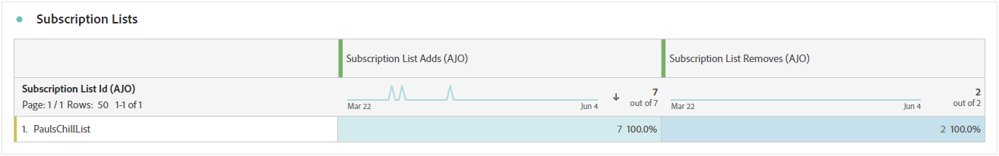

# Informe de suscripción {#subscription-report-global-cja}

>[!BEGINSHADEBOX]

**En esta página:** Aprenda a usar el informe Suscripción para analizar las suscripciones y bajas de suscripción de perfil en listas, recorridos, campañas y canales a fin de medir la participación.

>[!ENDSHADEBOX]

El **informe de suscripciones** ofrece información esencial sobre las suscripciones y bajas de perfiles asociadas con listas particulares, lo que le ayuda a comprender la eficacia de diferentes campañas e iniciativas de suscripción para impulsar la participación y las conversiones.

Para acceder a tus informes, haz clic en el icono **[!UICONTROL Informe]** de la lista de suscripción seleccionada en el menú avanzado.

Para obtener más información sobre Customer Journey Analytics Workspace y cómo filtrar y analizar datos, consulte [esta página](https://experienceleague.adobe.com/en/docs/analytics-platform/using/cja-workspace/home).

## La lista de suscripción agrega

La lista de suscripción **[!UICONTROL agrega]** KPI proporciona una descripción general del número total de suscripciones adquiridas durante el período especificado. Esta métrica destaca el crecimiento y la adquisición de nuevos suscriptores, lo que ofrece información valiosa sobre la eficacia de sus campañas o iniciativas de suscripción.

## La lista de suscripción elimina

La lista de suscripción **[!UICONTROL elimina]** KPI proporciona un desglose del número total de bajas de suscripción que se produjeron durante el período especificado. Esta métrica ofrece información valiosa sobre la desvinculación de los suscriptores.

## Aumento de suscripciones con el tiempo

El gráfico **[!UICONTROL Crecimiento de las suscripciones con el paso del tiempo]** muestra visualmente la progresión de las suscripciones durante el período especificado, lo que proporciona una comprensión clara de la evolución de la base de suscriptores.

* **[!UICONTROL La lista de suscripciones agrega]**: Número total de suscripciones durante el período correspondiente.

* **[!UICONTROL La lista de suscripciones elimina]**: Número total de bajas de suscripción durante el periodo correspondiente.

* **[!UICONTROL Crecimiento de la lista de suscripciones]**: Velocidad a la que aumenta la lista de suscriptores durante un período de tiempo específico.

## Listas de suscripciones

La tabla **[!UICONTROL Listas de suscripción]** proporciona información esencial sobre las suscripciones y bajas de suscripción de sus perfiles asociadas con listas de suscripción específicas. Esta información le ayuda a comprender la eficacia de las distintas listas de suscripción para impulsar la participación y las conversiones.

* **[!UICONTROL La lista de suscripciones agrega]**: Número total de suscripciones durante el período correspondiente.

* **[!UICONTROL La lista de suscripciones elimina]**: Número total de bajas de suscripción durante el periodo correspondiente.

## Recorridos

La tabla de **[!UICONTROL Recorrido]** ofrece una vista extensa y presenta detalles intrincados de las suscripciones de los visitantes como parte de su recorrido de usuario.

* **[!UICONTROL La lista de suscripciones agrega]**: Número total de suscripciones durante el período correspondiente.

* **[!UICONTROL La lista de suscripciones elimina]**: Número total de bajas de suscripción durante el periodo correspondiente.

## Campañas

La tabla **[!UICONTROL Campañas]** ofrece información valiosa sobre las suscripciones y bajas de sus perfiles activadas por campañas específicas. Esta vista completa le permite medir la eficacia de sus campañas y rastrear la participación con el contenido de su página de aterrizaje de forma eficaz.

* **[!UICONTROL La lista de suscripciones agrega]**: Número total de suscripciones durante el período correspondiente.

* **[!UICONTROL La lista de suscripciones elimina]**: Número total de bajas de suscripción durante el periodo correspondiente.

## Canal

La tabla **[!UICONTROL Channel]** muestra el número de perfiles, suscripciones y bajas clasificados por cada canal.

* **[!UICONTROL La lista de suscripciones agrega]**: Número total de suscripciones durante el período correspondiente.

* **[!UICONTROL La lista de suscripciones elimina]**: Número total de bajas de suscripción durante el periodo correspondiente.
