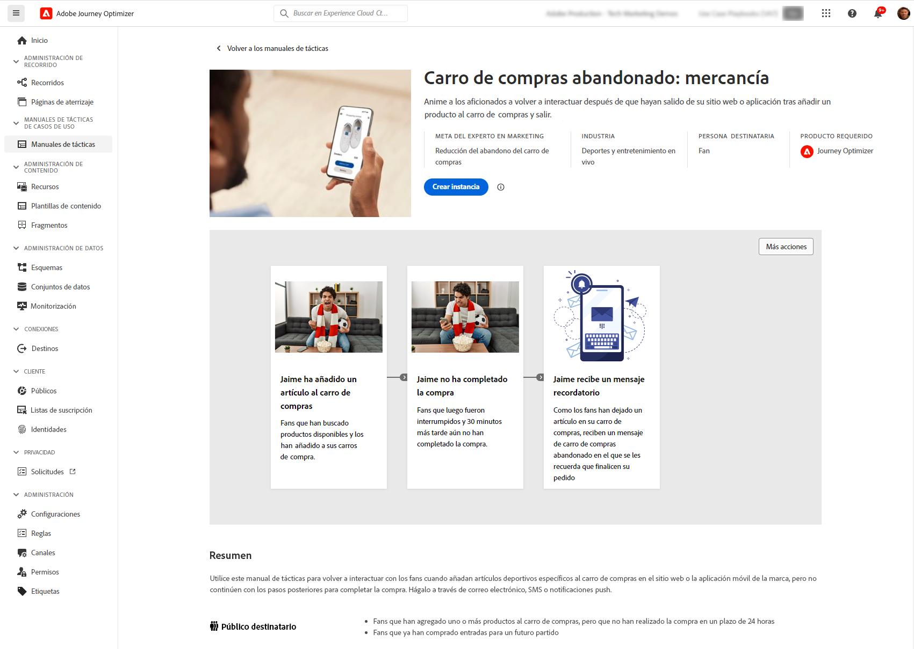

# Notas de la versión preliminar {#e-release-notes}

[!DNL Adobe Journey Optimizer] ofrece continuamente nuevas funciones, mejoras en las existentes y correcciones de errores. Todos los cambios se consolidan la última semana de cada mes en las [notas de la versión](release-notes.md).

Las notas de la primera versión están sujetas a cambios sin previo aviso hasta la fecha de disponibilidad del lanzamiento. Los vínculos, las pantallas y la documentación actualizada se publican en las [notas de la versión](release-notes.md), en la fecha de la versión.

## Notas de la versión anteriores de enero de 2024 {#oct-jan-2024}

**Fecha de lanzamiento**: 30-31 de enero de 2024

### Nuevas funciones{#jan-2024-features}

Esta versión incorpora las nuevas funciones que se enumeran a continuación.

<table>
<thead>
<tr>
<th><strong>Actualizaciones de entrega</strong> </th>
</tr>
</thead>
<tbody>
<tr>
<td>

Journey Optimizer ahora admite la tecnología de autenticación DMARC.

A partir del 1 de febrero de 2024, Google y Yahoo! requerirá que tenga un registro DMARC para cualquier dominio que utilice para enviarles correo electrónico. Asegúrese de tener configurado el registro DMARC para todos los subdominios que ha delegado o que está delegando al Adobe en Journey Optimizer.

<!--img src="assets/channel-reports.png"/-->

Para obtener más información, consulte la <a href="../configuration/dmarc-record-update.md">documentación detallada</a>.

</tr>
</tbody>
</table>

<table>
<thead>
<tr>
<th><strong>Manuales de casos de uso</strong> </th>
</tr>
</thead>
<tbody>
<tr>
<td>

Aproveche un catálogo de libros de reproducción de casos de uso específicos del sector en Real-Time CDP y Journey Optimizer para abordar casos de uso comunes que puede realizar con Adobe Experience Platform y Adobe Recorrido Optimizer.

Una vez que haya elegido el manual que mejor se adapte a sus necesidades, puede habilitarlo para generar los recursos necesarios para admitir su caso de uso, como recorridos, mensajes, esquemas o segmentos.

<!--
For more information, refer to the <a href="../start/">detailed documentation</a>.
-->
</tr>
</tbody>
</table>

### Mejoras {#jan-2024-improvements}

Esta versión incorpora las mejoras que se enumeran a continuación.

**Creación de informes**

* **Nuevos widgets de desglose basados en dominio** - Se han añadido nuevos widgets para mejorar los informes de Campaign y de Recorrido. El **Razones de rechazo por dominio**, **Enviados y entregados por dominios**, **Aperturas y clics por dominio** y **Rechazos y errores por dominio** los widgets proporcionan un desglose detallado a nivel de dominio para las métricas clave de envío y seguimiento de correo electrónico.

**Canal de SMS**

* **Inclusión doble** : el flujo de trabajo de inclusión doble para SMS garantiza que los usuarios se incluyan explícitamente en la recepción de mensajes cuando la solicitud se inicie desde su dispositivo. Los usuarios inician el proceso de consentimiento enviando un mensaje SMS entrante. Al confirmar su consentimiento, se envía un mensaje de seguimiento en el que se solicita la verificación final. Si no existe ningún perfil de usuario, se crea tras una confirmación correcta.

  Tenga en cuenta que esto solo se aplica a los proveedores de SMS de Sinch e Infobip.

**Recorridos**

* **Duración de eventos de reacción** - La duración máxima que puede definir en la variable **Eventos de reacción** ahora es 29 días en lugar de 30.

* **Filtros de fecha** - Ahora puede utilizar fechas personalizadas para filtrar el inventario de recorridos, además de los filtros de fecha predefinidos existentes. Esto le permite refinar la lista mostrando recorridos publicados en una fecha específica, dentro de un mes en particular, a lo largo de un año completo o dentro de intervalos de tiempo especificados.

* **Leer audiencia**  : la actividad Leer audiencia ahora se basa en el conjunto de datos de instantánea de perfil para segmentos por lotes, que solo se genera una vez al día después de ejecutar el trabajo por lotes diario programado.

**Reglas de frecuencia**

* **Límite de frecuencia semanal y diaria** : Ahora puede especificar el número máximo de mensajes enviados a un perfil de cliente en una semana o un día, además del mes. El límite de frecuencia se basa en el periodo de calendario seleccionado y se restablece al principio del lapso de tiempo correspondiente.

**Gestión de decisiones**

* **Límite de frecuencia en Edge** : El contador de límite de frecuencia ahora se actualiza y está disponible en una decisión de API de Edge Decisioning en menos de 3 segundos.