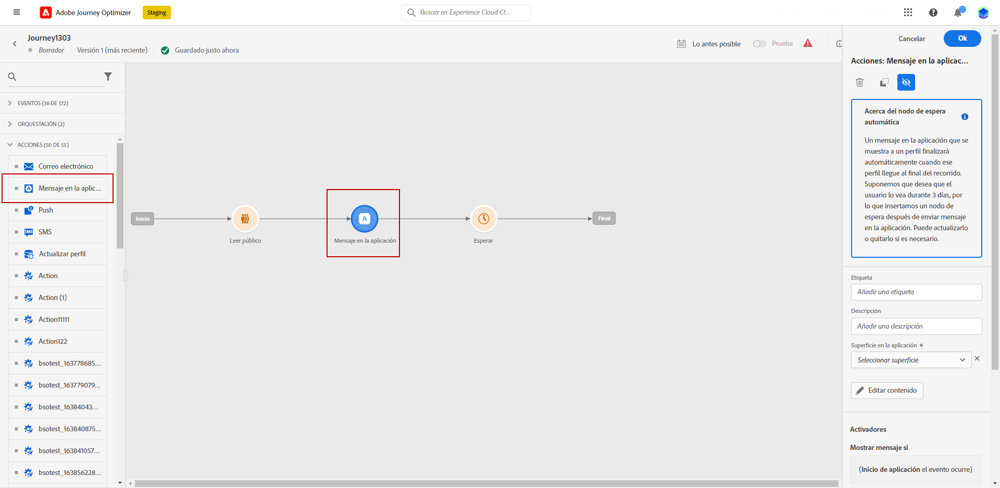

# Notas de la versión preliminar {#e-release-notes}

[!DNL Adobe Journey Optimizer] ofrece continuamente nuevas funciones, mejoras en las existentes y correcciones de errores. Todos los cambios se consolidan la última semana de cada mes en las [notas de la versión](release-notes.md).

Las notas de la primera versión están sujetas a cambios sin previo aviso hasta la fecha de disponibilidad del lanzamiento. Los vínculos, las pantallas y la documentación actualizada se publican en las [notas de la versión](release-notes.md), en la fecha de la versión.

## Notas de la versión anteriores de agosto de 2023 {#aug-rn-2023}

**Fecha de lanzamiento**: 23-24 de agosto de 2023

### Nuevas funciones{#aug-2023-features}

Esta versión incorpora las nuevas funciones que se enumeran a continuación.

<table>
<thead>
<tr>
<th><strong>Envío de mensajes en la aplicación en los recorridos</strong> </th>
</tr>
</thead>
<tbody>
<tr>
<td>

Ahora puede enviar mensajes personalizados en la aplicación a los usuarios de la misma dentro de un recorrido. Utilice Journey Optimizer para diseñar notificaciones y personalizar el diseño, la visualización, el texto y los botones del mensaje para crear una experiencia perfecta.

Para obtener más información, consulte la <a href="../in-app/get-started-in-app.md">documentación detallada</a>.

</tr>
</tbody>
</table>

<table>
<thead>
<tr>
<th><strong>Validación de correos electrónicos con listas semilla</strong> </th>
</tr>
</thead>
<tbody>
<tr>
<td>

Ahora puede crear y administrar listas semilla en Journey Optimizer. Una lista semilla consiste en las direcciones de correo electrónico de prueba a las que se envía un correo electrónico antes de enviarlo a la audiencia real. Utilice esta capacidad para monitorizar las copias de correo electrónico enviadas y asegurarse de que todos los formatos de visualización, direcciones URL, imágenes y vínculos son correctos.

<!--p>For more information, refer to the <a href="../audience/get-started-audience-orchestration.md">detailed documentation</a>.</p-->
</td>
</tr>
</tbody>
</table>

<table>
<thead>
<tr>
<th><strong>Generación de texto e imágenes con el asistente de contenido</strong> </th>
</tr>
</thead>
<tbody>
<tr>
<td>

Una vez que haya creado y personalizado el mensaje, lleve el contenido al siguiente nivel con el asistente de contenido. Ahora puede utilizar el Asistente de contenido para optimizar el impacto del mensaje experimentando con diferentes títulos e imágenes principales. Cada variante se administra como un Tratamiento único, para medir y comparar qué título genera más clics de forma eficaz.

Actualmente, esta función está disponible como una versión beta privada.

<!--p>For more information, refer to the <a href="../start/search-filter-categorize.md#tags">detailed documentation</a>.</p-->
</td>
</tr>
</tbody>
</table>

### Mejoras {#aug-2023-improvements}

Esta versión incorpora las mejoras que se enumeran a continuación.

**API**

Ya está disponible una nueva API para crear y administrar fragmentos de contenido. [Más información](https://developer.adobe.com/journey-optimizer-apis/references/content-templates/#tag/Content-fragment-API){target="_blank"}.

**Canal de correo electrónico**

* Hay una nueva opción disponible en la configuración de la superficie de correo electrónico para incluir las direcciones de correo electrónico suprimidas debido a una queja de spam en las audiencias de mensajes transaccionales. Incluso si han marcado los mensajes de marketing como correo no deseado, estos perfiles pueden recibir mensajes transaccionales, como restablecimiento de contraseña o extractos de cuenta. Esta opción está desactivada de forma predeterminada.

**Recorridos**

* Ahora puede utilizar las respuestas de llamadas de API en acciones personalizadas y organizar su recorrido en función de estas respuestas.
* Se ha introducido un nuevo tipo de alerta del sistema. Ahora puede recibir notificaciones cuando falle una acción personalizada.

**Correo directo**

* Compatibilidad con Azure Blob como destino de enrutamiento.
* Compatibilidad con &quot;&amp;&quot; como separador personalizado.