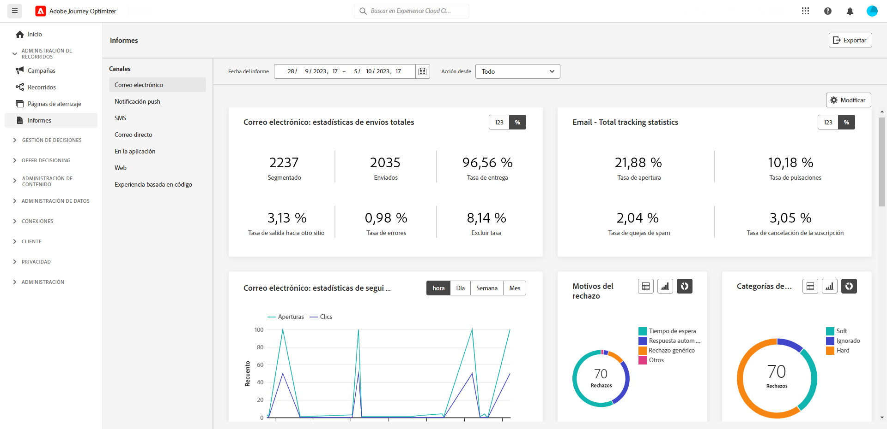

# Notas de la versión preliminar {#e-release-notes}

[!DNL Adobe Journey Optimizer] ofrece continuamente nuevas funciones, mejoras en las existentes y correcciones de errores. Todos los cambios se consolidan la última semana de cada mes en las [notas de la versión](release-notes.md).

Las notas de la primera versión están sujetas a cambios sin previo aviso hasta la fecha de disponibilidad del lanzamiento. Los vínculos, las pantallas y la documentación actualizada se publican en las [notas de la versión](release-notes.md), en la fecha de la versión.

## Notas de la versión anticipada de septiembre de 2023 {#sept-rn-2023}

**Fecha de la versión**: 26-27 de septiembre de 2023

### Nuevas funciones{#sept-2023-features}

Esta versión incorpora las nuevas funciones que se enumeran a continuación.

<table>
<thead>
<tr>
<th><strong>Informes de los canales consolidados</strong> </th>
</tr>
</thead>
<tbody>
<tr>
<td>

La funcionalidad Informe de canal ofrece a los analistas y expertos en marketing información general completa de las métricas de tráfico y de participación a nivel de canal. Para acceder al menú “Informe”, debe tener el permiso “Ver informes de canal”.

<!--p>For more information, refer to the <a href="../in-app/get-started-in-app.md">detailed documentation</a>.</p-->
</tr>
</tbody>
</table>

<table>
<thead>
<tr>
<th><strong>Destinos de exportación del conjunto de datos (GA)</strong> </th>
</tr>
</thead>
<tbody>
<tr>
<td>

La exportación de conjuntos de datos de Journey Optimizer a destinos de almacenamiento en la nube ya está disponible de forma general. Esta funcionalidad le permite establecer una conexión activa con las ubicaciones de almacenamiento en la nube para exportar el contenido de los conjuntos de datos.

<!--p>For more information, refer to the <a href="../audience/get-started-audience-orchestration.md">detailed documentation</a>.</p-->
</td>
</tr>
</tbody>
</table>

<table>
<thead>
<tr>
<th><strong>Almacenamiento de las credenciales de aplicación móvil por zona protegida</strong> </th>
</tr>
</thead>
<tbody>
<tr>
<td>

Esta nueva funcionalidad le permite administrar y asociar fácilmente las credenciales push con una zona protegida en las superficies de la aplicación.

Para obtener más información, consulte la <a href="../in-app/inapp-configuration.md">documentación detallada</a>.

</tr>
</tbody>
</table>

<table>
<thead>
<tr>
<th><strong>Atributos calculados</strong> </th>
</tr>
</thead>
<tbody>
<tr>
<td>

Los atributos calculados permiten que la funcionalidad resuma fácilmente los datos de evento en atributos de perfil a través de una interfaz de usuario intuitiva para mejorar la segmentación, personalización y activación basada en el comportamiento. Con esta funcionalidad, puede crear atributos calculados de forma automática, administrarlos y utilizarlos en segmentación, destinos de perfil del cliente en tiempo real o Journey Optimizer.  
Además, los atributos calculados simplifican la segmentación y los flujos de trabajo del recorrido para ofrecer experiencias relevantes. Obtenga más información en la <a href="https://experienceleague.adobe.com/docs/experience-platform/profile/computed-attributes/overview.html?lang=es">documentación detallada</a>.

</tr>
</tbody>
</table>

### Mejoras {#sept-2023-improvements}

Esta versión incorpora las mejoras que se enumeran a continuación.

<!--**Audiences**

* You can now target audiences uploaded from a CSV file into journeys and campaigns.
* You can now target audiences resulting from composition workflows into journeys. -->

**Personalización**

* Además de los fragmentos visuales, ahora es posible crear, guardar y reutilizar fragmentos de expresiones desde la interfaz de Journey Optimizer a través del editor de expresiones. Los fragmentos de expresión reemplazan a las expresiones guardadas anteriormente.

**Alerta**

* Se ha introducido un nuevo tipo de alerta del sistema. Ahora puede recibir notificaciones cuando falle un público de lectura.

**Canal web**

* Ahora, se pueden crear las aplicaciones de una sola página (SPA) en el editor visual del diseñador web, lo que le permite seleccionar a qué vistas específicas desea aplicar las modificaciones de la página web. Una vista puede definirse como un sitio completo o un grupo de elementos visuales en un sitio, como la página de inicio, la totalidad de productos del sitio o el marco de preferencias de envío en todas las páginas de cierre de compra. Para crear y ejecutar campañas web de Adobe Journey Optimizer en SPA, se necesita una configuración de desarrollador única para definir las vistas en la implementación del SDK web de Adobe Experience Platform.

* Al editar una página con el diseñador web, ahora puede añadir nuevos cambios al contenido directamente desde el panel **Modificaciones**, sin necesidad de seleccionar un componente y editarlo desde la interfaz del diseñador.
* A la hora de configurar los subdominios web, tiene la opción de añadir su propio subdominio, además de utilizar uno ya delegado a Adobe.

**Recorridos**

* La compatibilidad con las respuestas de acciones personalizadas ahora es GA. Esto permite aprovechar las respuestas de las llamadas de la API en acciones personalizadas y organizar su recorrido en función de estas respuestas. Además, se ha añadido un nuevo mecanismo de protección para limitar todas las acciones habituales a 5000 llamadas por extremo.
* Al duplicar un recorrido, puede definir el nombre de la copia.

<!--
* The maximum duration that you can define in the Wait activity is now 29 days instead of 30.
-->

**Canal de correo electrónico**

Una nueva opción en la configuración de la superficie del correo electrónico permite elegir el envío de los mensajes transaccionales a perfiles, incluso si sus direcciones de correo electrónico están en la lista de supresión de Adobe Journey Optimizer.

**Canal de SMS**

Dos campos nuevos, **Mensaje de inclusión** y **Mensaje de ayuda**, se han añadido a la pantalla de configuración de la API, lo que permite a los usuarios personalizar las respuestas para las palabras clave entrantes. Tenga en cuenta que esto solo está disponible para el proveedor de SMS de Sinch.

**Creación de informes**

Ahora puede exportar informes de Journey Optimizer como un archivo CSV. [Más información](../reports/global-report.md#export-reports)

<!--**Decision management**

Enhancements have been made to the audience picker in journeys or campaigns, with the addition of new columns displaying the origin and update frequency of audiences.    -->
