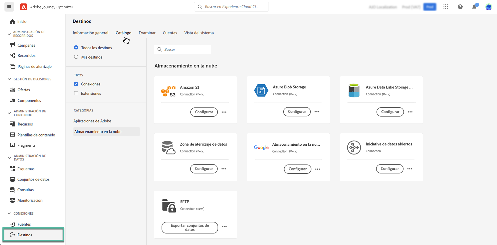

# Notas de la versión preliminar {#e-release-notes}

[!DNL Adobe Journey Optimizer] ofrece continuamente nuevas funciones, mejoras en las existentes y correcciones de errores. Todos los cambios se consolidan la última semana de cada mes en las [notas de la versión](release-notes.md).

Las notas de la primera versión están sujetas a cambios sin previo aviso hasta la fecha de disponibilidad del lanzamiento. Los vínculos, las pantallas y la documentación actualizada se publican en las [notas de la versión](release-notes.md), en la fecha de la versión.

## Notas de la versión anteriores de septiembre de 2023 {#sept-rn-2023}

**Fecha de lanzamiento**: 26-27 de septiembre de 2023

### Nuevas funciones{#sept-2023-features}

Esta versión incorpora las nuevas funciones que se enumeran a continuación.

<table>
<thead>
<tr>
<th><strong>Informes de canales consolidados</strong> </th>
</tr>
</thead>
<tbody>
<tr>
<td>

La función Informe de canal ofrece a analistas y expertos en marketing una descripción general completa de las métricas de tráfico y participación a nivel de canal. Para acceder al menú "Informe", debe tener el permiso "Ver informes de canal".

<!--p>For more information, refer to the <a href="../in-app/get-started-in-app.md">detailed documentation</a>.</p-->
</tr>
</tbody>
</table>

<table>
<thead>
<tr>
<th><strong>Destinos de exportación de conjuntos de datos (GA)</strong> </th>
</tr>
</thead>
<tbody>
<tr>
<td>

La exportación de conjuntos de datos de Journey Optimizer a destinos de almacenamiento en la nube ya está disponible de forma general. Ahora, puede establecer una conexión activa con las ubicaciones de almacenamiento en la nube para exportar el contenido de los conjuntos de datos.

<!--p>For more information, refer to the <a href="../audience/get-started-audience-orchestration.md">detailed documentation</a>.</p-->
</td>
</tr>
</tbody>
</table>

<table>
<thead>
<tr>
<th><strong>Almacenamiento de credenciales de aplicación móvil por zona protegida</strong> </th>
</tr>
</thead>
<tbody>
<tr>
<td>

Esta nueva función le permite administrar y asociar fácilmente credenciales push con una zona protegida dedicada en las superficies de la aplicación.

Para obtener más información, consulte la <a href="../in-app/inapp-configuration.md">documentación detallada</a>.

</tr>
</tbody>
</table>

### Mejoras {#sept-2023-improvements}

Esta versión incorpora las mejoras que se enumeran a continuación.

**Audiences**

* Ahora puede segmentar audiencias cargadas desde un archivo CSV a recorridos y campañas.
  <!--* Enhancements have been made to the audience picker in journeys or campaigns, with the addition of new columns displaying the origin and update frequency of audiences.-->
* Ahora puede segmentar audiencias resultantes de flujos de trabajo de maquetación en recorridos.

**Personalización**

* Además de los fragmentos visuales, ahora es posible crear, guardar y reutilizar fragmentos de expresiones desde la interfaz de Journey Optimizer a través del Editor de expresiones. Los fragmentos de expresión reemplazan a las expresiones guardadas anteriormente.
* Ahora puede utilizar atributos calculados de Adobe Experience Platform para la personalización en Journey Optimizer. Los atributos calculados son valores agregados que se calculan en función de conjuntos de datos de evento de experiencia con perfil habilitado introducidos en Adobe Experience Platform.

**Alerta**

* Se han introducido dos nuevos tipos de alertas del sistema. Ahora puede recibir notificaciones cuando falle una acción personalizada o un segmento de lectura.

**Canal web**

* Ahora puede seleccionar a qué vistas específicas desea aplicar las modificaciones de la página web. Una vista puede definirse como un sitio completo o como un grupo de elementos visuales en un sitio, como la página de inicio, la totalidad del sitio de productos o el marco de preferencias de envío en todas las páginas de cierre de compra.
* Al editar una página con el diseñador web, ahora puede agregar nuevos cambios al contenido directamente desde el panel Modificaciones, sin necesidad de seleccionar un componente y editarlo desde la interfaz del diseñador.
* Al configurar subdominios web, ahora tiene la opción de agregar su propio subdominio, además de utilizar un subdominio ya delegado al Adobe.

**Recorridos**

* Las capacidades de respuesta de acción personalizadas ahora son GA. Esto le permite aprovechar las respuestas de llamadas de API en acciones personalizadas y organizar el recorrido en función de estas respuestas. Además, se ha añadido una nueva protección para limitar todas las acciones aduaneras a 5000 llamadas/s por punto final.
* Al duplicar un recorrido, ahora puede definir el nombre de la copia de recorrido.
* La duración máxima que puede definir en la actividad Espera ahora es 29 días en lugar de 30.

**Canal de correo electrónico**

Una nueva opción en la configuración de superficie de correo electrónico permite elegir enviar mensajes transaccionales a perfiles incluso si sus direcciones de correo electrónico están en la lista de supresión de Adobe Journey Optimizer.

<!--**Decision management**

Enhancements have been made to the audience picker in journeys or campaigns, with the addition of new columns displaying the origin and update frequency of audiences.    -->