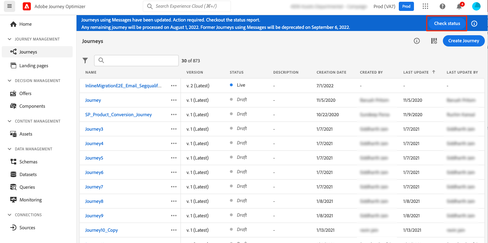

# Pasos de migración de creación en línea{#migration-steps}

El nuevo proceso de creación de contenido en Adobe Journey Optimizer se describe en esta [página](../rn/inline-messages.md). Se realiza una conversión automática de recorridos. Dicho esto, necesitamos su ayuda con algunos pasos.

>[!VIDEO](https://video.tv.adobe.com/v/344699)

Estas son las fases y pasos principales:

**[Antes de la migración](../rn/inline-messages-steps.md#migration-step-1)**

1. En entornos limitados que no sean de producción, detenga todos los recorridos activos y cerrados. [Más información](../rn/inline-messages-steps.md#migration-step-1-1)
1. En el simulador para pruebas de producción, detenga todos los recorridos ad-hoc activos sin perfil que aún se encuentren. [Más información](../rn/inline-messages-steps.md#migration-step-1-2)

**[Después de la primera iteración](../rn/inline-messages-steps.md#migration-step-2)**

1. Compruebe si hay errores en los recorridos activos migrados. [Más información](../rn/inline-messages-steps.md#migration-step-2-1)
1. Enumera todas las versiones nuevas creadas por la migración. [Más información](../rn/inline-messages-steps.md#migration-step-2-2)
1. Pruebe y publique una por una. [Más información](../rn/inline-messages-steps.md#migration-step-2-3)
1. Enumerar todas las versiones activas. [Más información](../rn/inline-messages-steps.md#migration-step-2-4)
1. Compruebe si hay errores en las versiones de borrador migradas. [Más información](../rn/inline-messages-steps.md#migration-step-2-5)

**[Después de la segunda iteración](../rn/inline-messages-steps.md#migration-step-3)**

1. Compruebe ambas fases de migración. [Más información](../rn/inline-messages-steps.md#migration-step-3-1)
1. Detenga las versiones anteriores. [Más información](../rn/inline-messages-steps.md#migration-step-3-2)

**[Antes de la tercera y la última iteración](../rn/inline-messages-steps.md#migration-step-4)**

Valide que todo se haya migrado antes de la desaprobación.

  

## Antes de la migración (25 de julio){#migration-step-1}

### 1. Detener todos los recorridos vivos y cerrados{#migration-step-1-1}

Activado **entornos limitados que no sean de producción**, detengan todos los recorridos vivos y cerrados. Esto permite que el proceso de migración automatizada migre todos los recorridos de esos entornos limitados sin que usted haya realizado ninguna acción. Después de la migración, podrá duplicar las versiones de recorrido detenidas y utilizarlas.

### 2. Detenga todos los recorridos ad hoc activos sin perfil en{#migration-step-1-2}

En el **entorno limitado de producción**, detenga todos los recorridos ad hoc activos que ya no contengan perfiles.

+++¿Cómo encontrar estos recorridos?

Para encontrar estos recorridos, vaya a la **Recorridos** y filtre la lista en &quot;Estado = Activo&quot; y &quot;Tipo = Leer segmento&quot;. También puede ordenar los recorridos cronológicamente desde la fecha más temprana hasta la más reciente de &quot;Publicado&quot;.

Ábralas de arriba abajo.

* Compruebe que el recorrido tenga un mensaje.
* Compruebe que no sean recorridos recurrentes. No son ad hoc. Lo más probable es que quieras mantenerlos vivos. Por ejemplo, este es un recorrido recurrente (no ad-hoc):

   

* Si ha utilizado oyentes de espera o eventos en esos recorridos, es posible que los perfiles sigan estando dentro. Observe la fecha de ejecución del recorrido y añada cualquier hora o día que haya definido en sus esperas o oyentes de eventos para deducir la fecha real en la que no quedan perfiles dentro. Si esa fecha es anterior, puede detener el recorrido. De lo contrario, este recorrido se mueve automáticamente al estado &quot;Finalizado&quot; 30 días después de la fecha de ejecución del recorrido.

+++

**Notas importantes**

* Evite cerrar los recorridos antes de la fecha de migración (25 de julio). Sabiendo que el script de migración no migrará los recorridos activos o cerrados, limitar el número de recorridos cerrados en el entorno limitado de producción limitará el número de acciones manuales necesarias después de la migración.

* Si tiene recorridos activos que no son la última versión, lo que significa que ha creado otra versión de recorrido en borrador, publíquelo o elimínelo.

* Si tiene mensajes que no se utilizan en recorridos y que desea conservar, guárdelos como plantillas. Consulte [esta página](../design/email-templates.md#save-as-template). Tenga en cuenta que aún podrá acceder a ellas hasta que desaparezca.

## Después de la primera iteración de migración (25 de julio){#migration-step-2}

La migración se secuencia en dos fases: la fase automatizada (por la noche, entre el 25 de julio y el 26 de julio) y la fase manual (a partir del 26 de julio) que requiere elementos de acción.

Para la fase automatizada, consulte esta [página](../rn/inline-messages.md#process). Para la fase manual, estas son las acciones que se deben realizar en la variable **entorno limitado de producción**:

<!--
_On non-production sandboxes:_

**1. Check the migration status report for any error**

Click the **Check status** button in the top banner and check that there has been no error during the automatic migration and that there is nothing left to migrate. 

Look for the "ERROR" status. 

* If there is no error, you are good to go.
* If there are errors, look for the error by searching "errorMessage". The following error is expected as migration of multi-channel messages is not supported: "Migration of multi-channel messages is not supported". You will have to rebuild this journey.

    

_On the production sandbox:_

-->

### 1. Compruebe si hay errores en los Recorridos activos migrados{#migration-step-2-1}

Compruebe si hay errores en los recorridos activos migrados automáticamente en el informe de estado ([más información](../rn/inline-messages.md#status). Haga clic en el **Comprobar estado** en el banner superior.

Busque &quot;ERROR_NEW_VERSION_CREATION&quot;:

* Si no hay ningún error, significa que todas las versiones de recorrido activas que requieren migración se han procesado y se ha creado automáticamente una nueva versión de borrador migrada.

* Si ve un error, puede buscar &quot;errorMessage&quot; y comprobar el mensaje de error en los registros. Los mensajes multicanal no se migran. Tendrá que crear otro recorrido.

   

* Para otros errores, póngase en contacto con su CSM o con cualquier representante de Adobe para obtener ayuda.

### 2. Enumerar todas las versiones nuevas creadas por la migración{#migration-step-2-2}

Se marcan como [MIGRADO] en la etiqueta de recorrido y se actualiza la fecha de creación.

### 3. Pruebe y publique una por una{#migration-step-2-3}

Asegúrese de que el recorrido aún debe ejecutarse en producción. Si la variable [preparación antes de la migración](../rn/inline-messages-steps.md#migration-step-1) no se realizó correctamente, podría tener una nueva versión creada para un recorrido de una toma que ya no es necesario.

Pruebe la versión borrador del recorrido que ahora contiene acciones de canal en línea.

Publique la nueva versión del recorrido. A continuación, su versión anterior en directo pasará al estado &quot;Cerrado&quot;.

### 4. Enumerar todas las versiones activas{#migration-step-2-4}

Todos deben marcarse como los últimos. si no es así, busque la versión más reciente, pruébelas y publíquelas.

### 5. Compruebe si hay errores en las versiones de borrador migradas {#migration-step-2-5}

Haga clic en el **Comprobar estado** en el banner superior ([más información](../rn/inline-messages.md#status) y compruebe que no se ha producido ningún error durante la migración automática y que no queda nada por migrar. Tenga en cuenta que cualquier recorrido de error (con mensajes) quedará obsoleto después del 5 de septiembre (en todos los entornos limitados).

Busque el estado &quot;ERROR&quot;.

* Si no hay error, está listo para irse.

* Si hay errores, busque el error buscando &quot;errorMessage&quot;. Se espera el siguiente error, ya que no se admite la migración de mensajes multicanal: &quot;No se admite la migración de mensajes multicanal&quot;. Tendrás que reconstruir este recorrido.

## Después de la segunda iteración (1 de agosto){#migration-step-3}

La segunda iteración se produce por la noche entre el 1 de agosto y el 2 de agosto.

<!--
_On non-production sandboxes:_

**1. Check at the status report**

Click the **Check status** button in the top banner and check that all journeys have been migrated and there's nothing left to migrate. If there is an error or something left to migrate, please reach out to your CSM or Adobe representative for guidance.

-->

Si todos los pasos anteriores se realizaron a tiempo, todos los recorridos se han migrado, excepto los cerrados y los con errores. Estos son los pasos a seguir en la **entorno limitado de producción**:

### 1. Compruebe ambas fases de migración{#migration-step-3-1}

Si no hay errores, no debe tener recorridos en &quot;eligibilityStatus&quot;, en &quot;toMigrate&quot; y &quot;createNewVersion&quot;. En el siguiente ejemplo, hay un &quot;ERROR&quot; y un &quot;ERROR_NEW_VERSION_CREATION&quot;.

### 2. Detener versiones anteriores{#migration-step-3-2}

Si no ha publicado versiones de recorrido más recientes (consulte esta [sección](../rn/inline-messages-steps.md#migration-step-2-3)) en el tiempo que significa antes de la iteración 2 (1 de agosto), y luego publicar la versión más reciente.

>[!NOTE]
>
>Detenga la versión anterior o la perderá junto con los informes asociados.

## Antes de la tercera y última iteración (5 de septiembre){#migration-step-4}

Entre el 1 de agosto y el 5 de septiembre, tendrá que validar que todo se ha migrado y que no quedan recorridos que usen mensajes; de lo contrario, quedarán obsoletos el 5 de septiembre.

