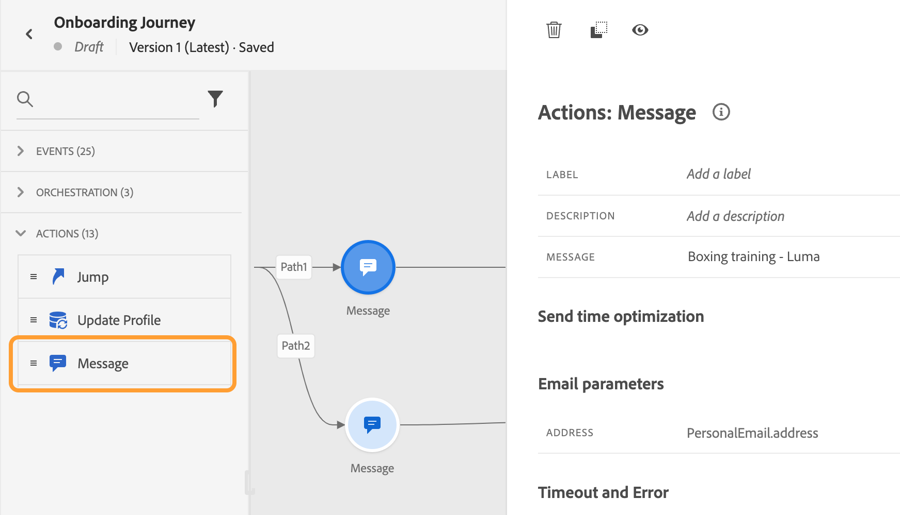
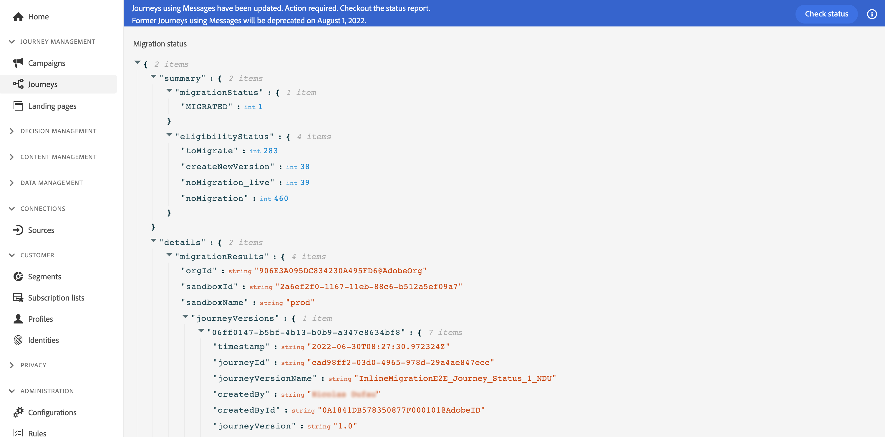

# Información general sobre la migración de creación en línea{#inline-authoring}

>[!CONTEXTUALHELP]
>id="ajo_messages_migration_before"
>title="Obtenga más información sobre la nueva función de creación en línea"
>abstract="A partir del 25 de julio de 2022, los mensajes se crean directamente desde un Recorrido. Los mensajes existentes se migran automáticamente al nuevo modelo. Después de la migración se necesitarán acciones adicionales si actualmente utiliza mensajes dentro de sus recorridos."
>additional-url="https://experienceleague.adobe.com/docs/journey-optimizer/using/whats-new/inline-authoring/inline-messages-steps.html" text="Pasos de migración"

>[!CONTEXTUALHELP]
>id="ajo_messages_migration_during"
>title="Descubra lo que está sucediendo"
>abstract="A partir del 25 de julio de 2022, los mensajes se crean directamente desde un Recorrido. Se está migrando el entorno. Después de la migración será necesario realizar acciones adicionales."
>additional-url="https://experienceleague.adobe.com/docs/journey-optimizer/using/whats-new/inline-authoring/inline-messages-steps.html" text="Pasos de migración"

>[!CONTEXTUALHELP]
>id="ajo_messages_migration_after"
>title="Descubra cómo migrar sus mensajes"
>abstract="A partir del 25 de julio de 2022, los mensajes se crean directamente desde un Recorrido. Los mensajes existentes se han migrado al nuevo modelo. Como profesional del recorrido, ahora se requieren acciones adicionales."
>additional-url="https://experienceleague.adobe.com/docs/journey-optimizer/using/whats-new/inline-authoring/inline-messages-steps.html" text="Pasos de migración"

>[!CONTEXTUALHELP]
>id="ajo_messages_depecrated_inventory"
>title="Descubra cómo migrar sus mensajes"
>abstract="A partir del 25 de julio de 2022, el menú Mensajes desaparece y los mensajes se crean directamente desde un Recorrido. Si desea reutilizar los mensajes heredados en recorrido, debe guardarlos como plantillas."
>additional-url="https://experienceleague.adobe.com/docs/journey-optimizer/using/design/email-templates.html#save-as-template" text="Guardar mensajes como plantillas"

Adobe Journey Optimizer está lanzando una nueva función que mejora la forma en que crea contenido para canales de Journey Optimizer (correo electrónico, push, SMS). Como profesional de Journey Optimizer, ahora crea y crea sus mensajes directamente desde un recorrido.

Esta función requiere una migración de los recorridos existentes que utilizan mensajes. En esta página, encontrará la información necesaria sobre este cambio, así como los pasos que debe seguir.

Para obtener más información sobre sus funciones y responsabilidades como profesional de Journey Optimizer, consulte esta [página](../start/path/marketer.md).

<!--
Here are the main changes in the interface:

* Messages are created direcly from journeys.
* The **Messages** entry in the left navigation menu has been removed. 
* There is no separate library of messages, the journey now centralizes all components.

-->

>[!VIDEO](https://video.tv.adobe.com/v/344698)

## Puntos clave a seguir{#keys}

* **¿Estoy afectado?**: le afectará si crea mensajes a partir de la variable **Mensajes** en el panel de navegación izquierdo y utilícelos en sus recorridos. Si utiliza un sistema de terceros (como Adobe Campaign), esta migración no le afectará.

* **Cambios del producto**: en GA (25 de julio), el contenido del canal se crea y administra dentro de cada recorrido. La variable **Mensajes** , en la navegación izquierda ya no está disponible ([más información](../rn/inline-messages.md#change)). Procederemos a la migración de sus recorridos existentes.

* **Cronología**: la migración se produce en cada región por la noche, a través de varias [iteraciones](../rn/inline-messages.md#iterations).

   

* **Acciones necesarias**: se realiza una conversión automática de recorridos. Dicho esto, necesitamos su ayuda con algunos pasos. Obtenga más información sobre los pasos necesarios en esta [página](../rn/inline-messages-steps.md).

* **Obsolescencia**: después del 6 de septiembre, todos los recorridos que siguen utilizando mensajes heredados se detienen y se eliminan más adelante.

## Ventajas y cambios en los productos{#change}

La visión de Adobe es simplificar el producto continuamente para proporcionar flujos de usuarios eficientes y optimizados. Esta nueva forma de crear mensajes ofrece un proceso de usuario más simplificado.

Hemos diseñado este nuevo flujo de trabajo para centralizar el contenido en un lugar, directamente donde se utiliza.

La creación de contenido ahora se realiza directamente dentro del recorrido. Lo inmediato **ventajas** se obtienen:

* Generación de recorridos más rápida mediante canales de Journey Optimizer en un solo flujo.
* Visualización rápida del contenido cambiando sin problemas entre todo el contenido de correo electrónico, push y SMS en un recorrido.
* Se ha mejorado el flujo de los correos electrónicos y la inserción mediante la personalización contextual desde el lienzo.
* Los informes de recorrido centralizan la información detallada de los informes de canal.

Aquí están los **cambios de productos** traído por esta nueva función:

<table>
<tr>
<th>Antes de la migración</th>
<th>Después de la migración</th>
</tr>
<tr>
<td>
Antes, creaba el mensaje desde el <strong>Mensajes</strong> para abrir el Navegador. 
</td>
<td>
Ahora, la variable <strong>Mensajes</strong> , en el panel de navegación izquierdo ya no está disponible. 
</td>
</tr>
<tr>
<td>
A continuación, creó un recorrido y agregó un <strong>Mensaje</strong> y seleccionó el mensaje creado anteriormente.
</td>
<td>
Ahora, simplemente agregue la actividad de acción del canal deseada (correo electrónico, SMS, push) a su recorrido. En la actividad , configure directamente los parámetros del mensaje y acceda al editor de contenido.
</td>
</tr>
<tr>
<td>
Antes, era posible acceder a los informes tanto en los niveles de mensaje como de recorrido. Debe desplazarse entre la pestaña de ejecución del mensaje y el informe de recorrido.
</td>
<td>
Todos los informes ahora están centralizados a nivel de recorrido. Esto mejora la navegación y la experiencia del usuario. Si tiene varios correos electrónicos en un recorrido, puede usar la variable <strong>Acción</strong> menú desplegable para ver el informe relacionado.

</td>
</tr>
</table>

En GA (25 de julio), este nuevo flujo de usuarios se aplica a todos los recorridos nuevos. La variable **Mensajes** , en el panel de navegación izquierdo ya no está disponible.

## Cronología de migración{#iterations}

Es necesario realizar una migración para cambiar los recorridos existentes mediante **Mensajes** en recorridos con acciones creadas en línea. Se realiza una conversión automática de recorridos. Dicho esto, necesitamos su ayuda con algunos pasos.

La migración se produce en cada región por la noche, a través de varias iteraciones. Esta es la cronología de migración:

* 25 de julio de 2022: GA: primera iteración
* 1 de agosto de 2022: Segunda iteración
* 5 de septiembre de 2022: Tercera iteración
* 6 de septiembre de 2022: desaprobación

¿Por qué necesitamos varias iteraciones?

Durante una iteración, vamos por cada recorrido y los migramos cuando es posible. Hay casos en los que no queremos migrar automáticamente: cuando el recorrido está activo o cerrado (lo que significa que aún puede haber perfiles en él). En estos casos, se le pedirá que realice una acción y, a continuación, la siguiente iteración migrará los recorridos que no se hayan podido migrar en la iteración anterior.

## Preguntas frecuentes {#faq}

### ¿Cómo se me informará del cambio?{#inform}

Adobe se comunica con usted antes de la primera iteración.

El cambio se implementa de la noche a la mañana, a través de varias iteraciones. Más información sobre [iteraciones](../rn/inline-messages.md#inline-authoring).

También se le informa mediante notificaciones internas del producto que se muestran en pantallas de Recorridos:

* Antes de la implementación del cambio

   

* Durante una iteración

   

* Después de una iteración

   

   Después de una iteración, la variable **Comprobar estado** se muestra. Esto le permite ver todos sus recorridos en formato JSON y su estado de migración respectivo. Consulte esta [sección](../rn/inline-messages.md#status).

* Cuando desaparece el banner, estás listo para irte. No es necesario que realice más acciones.

### ¿Cuál es el proceso de migración?{#process}

La migración es totalmente automática para los recorridos que no están activos o cerrados. No queremos afectar a los recorridos en directo o cerrados para evitar cualquier impacto en la producción. Le pedimos que publique la nueva versión que creamos para usted.

Todos los entornos limitados de una organización de clientes se procesan simultáneamente. Durante la implementación del cambio, se realizan las siguientes acciones:

**CUALQUIER recorrido que no utilice mensajes**

Estos no se ven afectados por el cambio. La migración solo se dirige a los recorridos que utilizan mensajes. Sin embargo, aún podrá acceder a los mensajes que no se utilicen en un recorrido a través de la siguiente URL: https://experience.adobe.com/#/@[ORG]/sname:[SANDBOX]/recorrido-optimizer/messages/

**BORRADOR DE recorridos utilizando al menos un mensaje**

Las versiones de borrador de los mensajes se modifican durante la migración. Ya no hacen referencia a ningún mensaje. La variable **Mensaje** las actividades de se sustituyen por las actividades de acción del canal correspondientes. Cada uno de ellos incluye los parámetros de canal y el contenido.

Como de costumbre, pruebe el recorrido de borrador antes de publicarlo.

**Recorridos ACTIVOS que utilizan al menos un mensaje**

La versión activa de un recorrido se sigue ejecutando para evitar cualquier impacto en la producción.

Se crea una nueva versión borrador de este recorrido durante la migración. Esta nueva versión de borrador es una copia de la versión activa, pero los mensajes se sustituyen por acciones de canal creadas en línea. Cada actividad de acción del canal incluye los parámetros y el contenido del canal. El contenido no se pierde. Los informes no se pierden.

Esperamos que revise esta versión de borrador, la pruebe y publique para que esta se convierta en la versión activa.

**RECORRIDOS FINALIZADOS o DETENIDOS que utilizan al menos un mensaje**

Estos recorridos también se migran.

Al consultar el informe recorrido, los informes ahora son más ricos e incluyen el nivel de información que antes estaba disponible en el informe de mensaje.

**RECORRIDOS CERRADOS que utilizan al menos un mensaje**

La versión cerrada de un recorrido se sigue ejecutando para cualquier perfil interno, para evitar cualquier impacto en la producción.

Los recorridos cerrados cambian automáticamente al estado &quot;Finalizado&quot; después de 30 días. Se tendrán en cuenta en la siguiente iteración, cuando terminen.

**Recorridos multicanal**

No se migran. Debe volver a crearlos.

### ¿Cuáles son mis elementos de acción como cliente?{#actions}

Para usted se realiza una conversión automática de recorridos, pero se requieren algunos pasos. Obtenga más información sobre los pasos necesarios en esta [página](../rn/inline-messages-steps.md).

<!--

The process timeline is indicated in a blue banner on the Journeys screen. See this [section](../rn/inline-messages.md#inform). 

**Before migration**

* Check the date indicated in the banner. 
* Stop non-critical journeys, on development, stage and production environments.
* If you have draft messages that you want to keep using, add them to a journey so they are migrated.

**During migration**

* Migration occurs at night-time
* Do not to create, edit or delete journeys.

**After migration**

* After each iteration, click the **Check status** button in the top banner. This page lists all journeys and their migration status. See this [section](../rn/inline-messages.md#status). 

* For each live journey, a new version is created. Review the new version, test it and publish it. 

* The **Messages** menu, in the left navigation is no longer available. You need to use the new in-line message feature. See this [section](../rn/inline-messages.md#change). 

* If you need to access a specific message which was not used in a journey, you can use this URL and save the content as a template: https://experience.adobe.com/#/@[ORG]/sname:[SANDBOX]/journey-optimizer/messages/

## How can I check the migration status?{#status}

Click the **Check status** button in the top banner. The following page is displayed.

The status report is at sandbox level. This report includes several useful sections:

**migrationStatus**

This section displays the migration information since the first iteration. Numbers are incremented after each iteration.

* MIGRATED: number of draft journeys migrated successfully.
* NEW_VERSION_CREATED: number of live journeys migrated. For each live journey, a new draft version is created: you must test and publish this version.
* ERROR: number of draft journeys not migrated because of a failure. You need to re-create them.
* ERROR_ON_NEW_VERSION_CREATION: number of live journeys not migrated because of a failure. new draft journey versions not migrated because of a failure. You need to re-create them.

**eligibilityStatus**

This section lists the remaining items after the last iteration:

* toMigrate: number of draft journeys that need to be migrated.
* createNewVersion: number of live journeys to migrate.
* noMigration_live: number of live journeys that do not need to be migrated
* noMigration: number of draft journeys that do not need to be migrated.

The **details** section gives, for each of the above indicators, the list of related journeys.

-->

### ¿Cómo puedo comprobar el estado de migración?{#status}

Haga clic en el **Comprobar estado** en el banner superior. Se muestra la siguiente página.

El informe de estado se encuentra en el nivel de entorno limitado. Este informe incluye varias secciones útiles:

**migrationStatus**

Esta sección muestra la información de migración desde la primera iteración. Los números se incrementan después de cada iteración.

* MIGRADO: número de recorridos borrador, finalizados y detenidos migrados correctamente.
* NEW_VERSION_CREATED: número de recorridos activos migrados. Para cada recorrido activo, se crea una nueva versión borrador: debe probar y publicar esta versión.
* ERROR: número de recorridos borradores, finalizados y detenidos no migrados debido a un error. Debe volver a crearlos.
* ERROR_ON_NEW_VERSION_CREATION: número de recorridos activos no migrados debido a un error. las nuevas versiones de recorrido borrador no se migraron debido a un error. No se han creado nuevas versiones de borrador para ellas. Debe volver a crearlos manualmente.

**eligibilityStatus**

Esta sección enumera los elementos restantes después de la última iteración:

* toMigrate: número de recorridos borrador, finalizados y detenidos que deben migrarse.
* createNewVersion: número de recorridos activos que migrar.
* noMigration_live: número de recorridos activos que no es necesario migrar. Los recorridos cerrados también están listados aquí.
* noMigration: número de recorridos que no es necesario migrar.

La variable **detalles** proporciona, para cada una de las secciones anteriores, la lista de recorridos relacionados.

### ¿Provocará este cambio alguna interrupción del servicio?{#interruption}

No habrá interrupción del servicio.

* En recorridos en directo: sin impacto, siguen corriendo.
* En recorridos creados: durante la migración (por la noche), se recomienda no crear, editar ni eliminar recorridos.

### ¿Habrá pérdida de datos? {#data}

No habrá pérdida de datos ni impacto en los recorridos activos. Estará en control de la publicación de versiones de recorrido actualizadas.

### ¿Habrá pérdida de funcionalidad?{#functionality}

Habrá un cambio en la forma en que crea el mensaje. No habrá pérdida de funcionalidad.

### ¿Habrá acceso al entorno durante el proceso de migración?

La migración se produce por la noche. Podrá utilizar el producto. Sin embargo, no cree, edite ni elimine recorridos.

### ¿Seguirán enviándose los mensajes?

Sí, los recorridos en vivo siguen funcionando.

### ¿Cómo sé que la migración ha finalizado?

La migración se completa cuando desaparece el banner. Consulte esta [sección](../rn/inline-messages.md#inform).

<!--
* Improved authoring flow and navigation
* Personalization: improved contextual personalization flow
* Reporting: the message execution screen will no longer exist. Reporting is centralized in journeys.
* You will still be able to update content in a live journey.
->>
