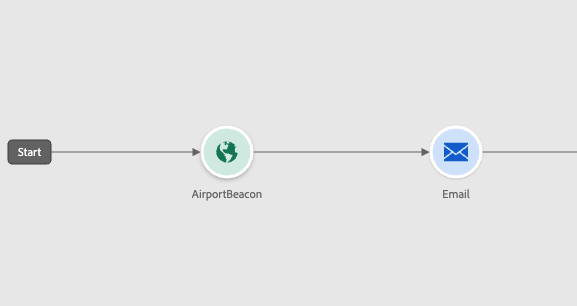
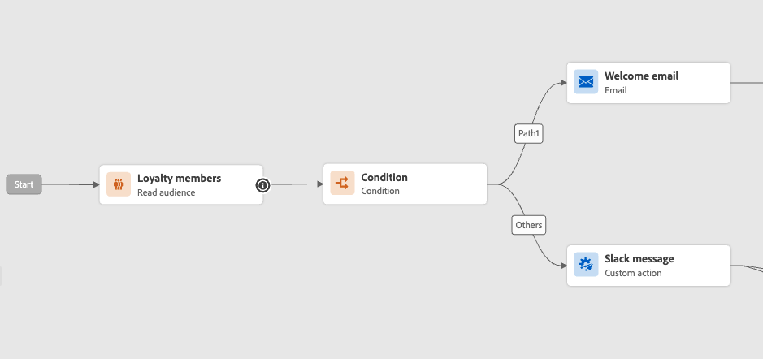
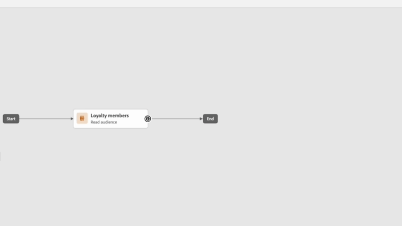
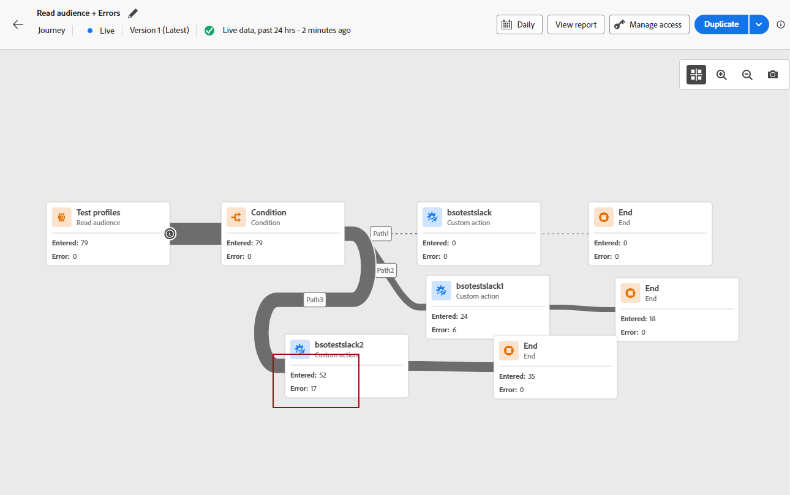
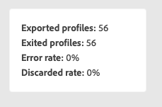
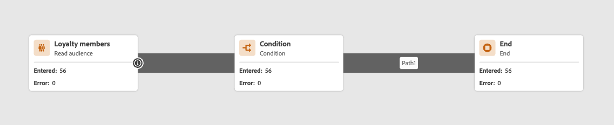

# Bienvenido al Diseñador de recorridos mejorado {#new-canvas}

[!DNL Journey Optimizer] ahora ofrece un **modelo de recorrido simplificado** que busca mejorar la experiencia del usuario y los procesos internos. A partir de la versión de abril, podrá beneficiarse de las siguientes funciones:

* Un lienzo de recorrido **rediseñado** se ha diseñado para ofrecer una experiencia de interfaz de usuario modernizada
* Una interfaz de usuario de **creación de informes en vivo** disponible directamente en el lienzo del recorrido

>[!NOTE]
>
>Tenga en cuenta que el despliegue de esta función será progresivo. Es posible que no vea los cambios de inmediato.

Para obtener más información acerca de cómo generar recorridos en el nuevo lienzo, vea [usar el diseñador de recorridos](../building-journeys/using-the-journey-designer.md#canvas-capabilities).

## Actualizaciones en el modelo de recorrido {#updates-journey-model}

El nuevo modelo de recorrido estará activo junto al existente, lo que significa que habrá recorridos que usen **dos modelos diferentes**:

* El modelo heredado
* El nuevo modelo

Todos los recorridos del modelo heredado permanecerán en él. Aún puede editarlos, probarlos o publicarlos. Cualquier nueva versión creada a partir de un recorrido en el modelo heredado también permanecerá en él. No hay **cambios funcionales** alrededor de esos recorridos.

Como puede ver en la captura de pantalla siguiente, los nodos tienen forma redondeada, que es la interfaz de usuario antigua para recorridos en el modelo heredado.

Sin embargo, cuando **cree un nuevo recorrido** o **duplique uno existente**, estará en el nuevo modelo. Los recorridos en el modelo heredado seguirán siendo compatibles hasta que la mayoría de los clientes pasen al nuevo.

Hay una limitación al nuevo modelo de recorrido; **no será posible copiar y pegar actividades del modelo heredado en el nuevo y viceversa**. Si desea hacerlo, le recomendamos que duplique el recorrido heredado para cambiarlo al nuevo modelo y, a continuación, copie las actividades.

En la captura de pantalla siguiente, puede ver la interfaz de usuario rediseñada para el lienzo de recorrido (solo disponible con el nuevo modelo):

**Cualquier característica nueva agregada al diseñador de recorrido (incluidos los informes en vivo) solo estará disponible para los recorridos en el nuevo modelo a partir de este momento.**

## Diseño de lienzo de recorrido mejorado {#improved-canvas-design}

Con el nuevo modelo de recorrido presentamos una nueva y mejorada **interfaz de usuario de lienzo de recorrido**, que se adapta perfectamente a las soluciones de [!DNL Adobe CX Enterprise] y al ecosistema de la aplicación, lo que ofrece una experiencia de usuario intuitiva y eficiente. Cualquier recorrido en el nuevo modelo estará en ese nuevo diseño.

Las actividades ahora se representan mediante cuadros cuadrados con las siguientes capacidades:

* La primera línea representa el tipo de actividad que a menudo se sobrescribe con información más contextual (en Leer audiencias, contiene el nombre de la audiencia seleccionada) o con una etiqueta personalizada, si define una.
* La segunda línea siempre representa el tipo de actividad.

Esta nueva interfaz de usuario mejora la legibilidad del lienzo de recorrido al proporcionar **tipos y etiquetas de actividad más claros**.

También permite al equipo de productos añadir más información en el lienzo con menos clics. Un ejemplo de &quot;más información&quot; sería la inclusión de informes en directo en el lienzo de recorrido, donde puede ver perfiles que entran y salen de sus actividades debido a errores.

## Creación de informes en directo en el lienzo de recorrido {#live-reporting-canvas}

Además de la distribución mejorada del lienzo de recorrido, se está presentando una nueva característica para permitir que los usuarios vean las métricas de informes en tiempo real de **las últimas 24 horas**, llamada informes en vivo, directamente dentro del lienzo de recorrido. Esto complementa el [informe en vivo de recorrido](../reports/journey-live-report.md) existente.

Para cada actividad dentro de cada recorrido activo que utilice el nuevo modelo, tiene acceso a:

* Recuento de perfiles que entran en esta actividad.
* Recuento de perfiles que salen de esta actividad debido a un error.

<!--
`
With every live journey on the new model, you will be able to see two types of "last 24 hours" reporting information:

* On a **new insert**, you will see:
    * The number of profiles that have been exported for audience-triggered journeys. You will see the number of profiles available in the last export job alongside the time when that export has been made.
    * The number of profiles who exited the journey
    * The percentage of errors
    
* **On each activity**, you will see the number of profiles who entered that activity and the number who exited because of an error:
    
-->
<!--
Please note that you may see differences between the number of exported profiles and the number of profiles flowing through the journey. The exported profiles count only provides information about the last export job being made while the number of profiles entering an activity only contains profiles who did it in the last 24 hours. This can especially be visible on recurring daily journeys as there could be a data overlap between two days.
-->
