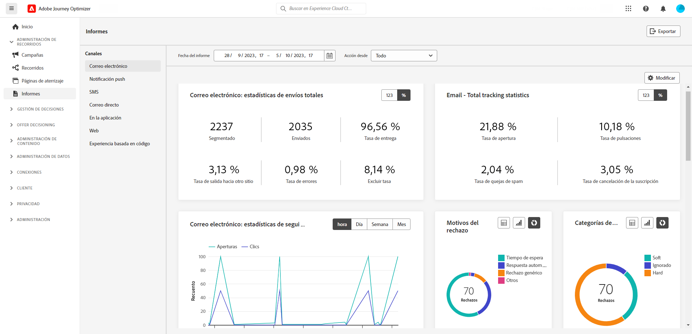
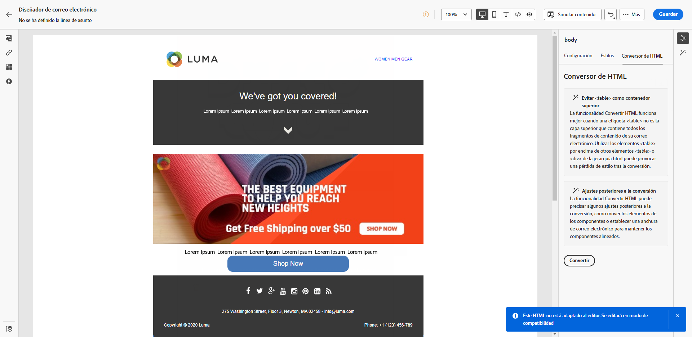
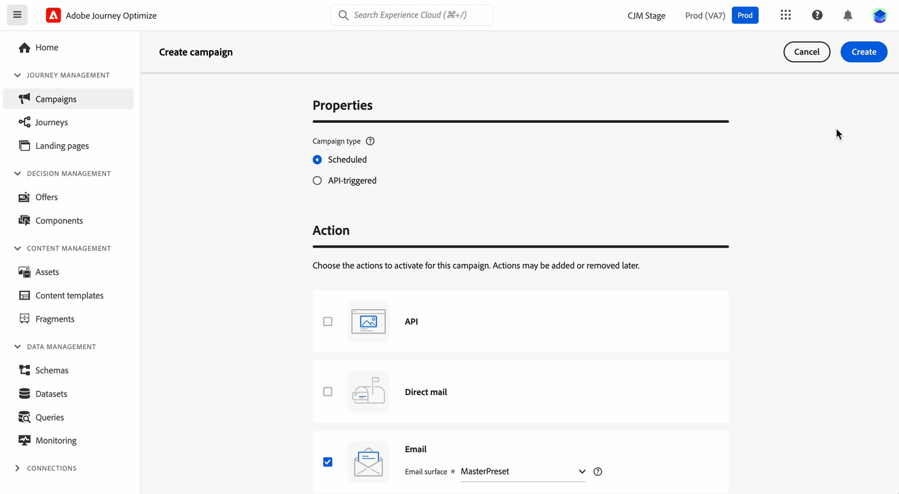

# Notas de la versión de 2023 {#release-notes-2023}

Esta página enumera todas las funciones y mejoras de [!DNL Journey Optimizer] lanzadas en 2023.

## Versión de octubre de 2023 {#oct-rn-2023}

### Nuevas funciones{#oct-2023-features}

Esta versión incorpora las nuevas funciones que se enumeran a continuación.

<table>
<thead>
<tr>
<th><strong>Herramientas de zona protegida</strong> </th>
</tr>
</thead>
<tbody>
<tr>
<td>

Las herramientas de zona protegida permiten copiar objetos en varias zonas protegidas aprovechando la exportación e importación de paquetes. Un paquete puede constar de un único objeto o de varios objetos. Los objetos incluidos en un paquete deben pertenecer a la misma zona protegida.

<!--img src="../data/assets/dataset-export-setup.png"-->

Para obtener más información, consulte la <a href="../building-journeys/copy-to-sandbox.md">documentación detallada</a>.

</td>
</tr>
</tbody>
</table>

<table>
<thead>
<tr>
<th><strong>Servicio de mensajes multimedia (MMS) en SMS</strong> </th>
</tr>
</thead>
<tbody>
<tr>
<td>

Con el canal SMS, ahora puede mejorar su comunicación enviando mensajes del servicio de mensajes multimedia (MMS), lo que le permite compartir imágenes, GIF o vídeos con sus clientes. Tenga en cuenta que esta funcionalidad solo está disponible actualmente con Sinch.

Para obtener más información, consulte la <a href="../sms/create-sms.md#mms-content">documentación detallada</a>.

</tr>
</tbody>
</table>

### Mejoras {#oct-2023-improvements}

Esta versión incorpora las mejoras que se enumeran a continuación.

**Públicos**

* Ahora puede dirigirse a públicos destinatarios cargados desde un archivo CSV en recorridos y campañas. [Más información](../audience/about-audiences.md#about-segments)
* Ahora puede dirigirse a públicos destinatarios creados mediante la composición de públicos y aprovechar los atributos de enriquecimiento de los recorridos. [Más información](../building-journeys/read-audience.md)

>[!AVAILABILITY]
>
>Estas funcionalidades están disponibles actualmente como versión Beta.

<!--
**Spam scoring for emails**

* When simulating an email content, a new option enables you to check how your content performs against inboxes spam filtering. This feature is currently proposed to a set of customers only (Limited Availability), and available for the Email channel.-->

**Campañas**

<!--* You can now stop a live one-time campaign, make modifications and resume it again. This improvement is available in Beta.-->
* Cuando se produce un error en una de las campañas, ahora aparece un icono de advertencia en la lista de campañas junto con el estado de la campaña. [Más información](../campaigns/manage-campaigns.md#statuses)

**Recorridos**

* La duración máxima que puede definir en cualquier tiempo de espera ahora es de 29 días, en lugar de 30. Esta mejora se ha introducido para evitar que la duración de la espera supere los 30 días de vida útil del recorrido. Esto se aplica a:

   * el campo **Cantidad de tiempo** en la [actividad de espera](../building-journeys/wait-activity.md)
   * el **Período de espera de reentrada** en [Propiedades del recorrido](../building-journeys/journey-properties.md#entrance)
   * el campo **Esperar a** en la definición de tiempo de espera de las [actividades de eventos](../building-journeys/general-events.md#events-specific-time).

<!--
**Consent in channel configuration**

* You can now select a marketing action at the channel configuration level. When used in a surface, all consent policies associated with that marketing action are leveraged in order to respect the preferences of your customers.-->

**Gestión de decisiones**

* Se han actualizado varias etiquetas relacionadas con el límite de ofertas en la interfaz de gestión de decisiones. [Más información](../offers/offer-library/add-constraints.md#capping)

## Versión de septiembre de 2023 {#sept-rn-2023}

### Nuevas funciones{#sept-2023-features}

Esta versión incorpora las nuevas funciones que se enumeran a continuación.

<table>
<thead>
<tr>
<th><strong>Atributos calculados</strong> </th>
</tr>
</thead>
<tbody>
<tr>
<td>

Los atributos calculados permiten que la funcionalidad resuma fácilmente los datos de evento en atributos de perfil a través de una interfaz de usuario intuitiva para mejorar la segmentación, personalización y activación basada en el comportamiento. Con esta funcionalidad, puede crear atributos calculados de forma automática, administrarlos y utilizarlos en segmentación, destinos de perfil del cliente en tiempo real o Journey Optimizer.  
Además, los atributos calculados simplifican la segmentación y los flujos de trabajo del recorrido para ofrecer experiencias relevantes. Obtenga más información en la <a href="../audience/computed-attributes.md">documentación detallada</a>.

</tr>
</tbody>
</table>

<table>
<thead>
<tr>
<th><strong>Informes de los canales consolidados</strong> </th>
</tr>
</thead>
<tbody>
<tr>
<td>

La funcionalidad Informe de canal ofrece a los analistas y expertos en marketing información general completa de las métricas de tráfico y de participación a nivel de canal. 

Para acceder al menú <b>Informe</b>, debe tener el permiso <b>Ver informes de canal</b>.

Para obtener más información, consulte la <a href="../reports/channel-report-cja.md">documentación detallada</a>.

</tr>
</tbody>
</table>

<table>
<thead>
<tr>
<th><strong>Destinos de exportación del conjunto de datos (GA)</strong> </th>
</tr>
</thead>
<tbody>
<tr>
<td>

La exportación de conjuntos de datos de Journey Optimizer a destinos de almacenamiento en la nube ya está disponible de forma general. Esta funcionalidad le permite establecer una conexión activa con las ubicaciones de almacenamiento en la nube para exportar el contenido de los conjuntos de datos.

Para obtener más información, consulte la <a href="../data/export-datasets.md">documentación detallada</a>.

</td>
</tr>
</tbody>
</table>

<table>
<thead>
<tr>
<th><strong>Almacenamiento de las credenciales de aplicación móvil por zona protegida</strong> </th>
</tr>
</thead>
<tbody>
<tr>
<td>

Esta nueva funcionalidad le permite administrar y asociar fácilmente las credenciales push con una zona protegida en las superficies de la aplicación.

Para obtener más información, consulte la <a href="../in-app/inapp-configuration.md#channel-prerequisites">documentación detallada</a>.

</tr>
</tbody>
</table>

### Mejoras {#sept-2023-improvements}

Esta versión incorpora las mejoras que se enumeran a continuación.

**Gestión de decisiones**

* Ya están disponibles las nuevas API para la creación y administración de objetos de gestión de decisiones. Estas API ofrecen un rendimiento y una experiencia de usuario mejorada. Las API heredadas serán compatibles hasta el 27/03/2024. [Más información](../offers/api-reference/getting-started.md)

**Personalización**

* Además de los fragmentos visuales, ahora es posible crear, guardar y reutilizar fragmentos de expresiones desde la interfaz de Journey Optimizer a través del editor de expresiones. Los fragmentos de expresión reemplazan a las expresiones guardadas anteriormente. [Más información](../personalization/use-expression-fragments.md)

**Alerta**

* Se ha introducido un nuevo tipo de alerta del sistema. Ahora puede recibir notificaciones cuando falle una actividad de **Público de lectura**. [Más información](../reports/alerts.md).

**Canal web**

* Las aplicaciones de una sola página (SPA) se pueden crear en el editor visual web, lo que le permite seleccionar a qué vistas específicas desea aplicar las modificaciones de la página web. Una vista puede definirse como un sitio completo o un grupo de elementos visuales en un sitio, como la página de inicio, la totalidad de productos del sitio o el marco de preferencias de envío en todas las páginas de cierre de compra. Se necesita una configuración de desarrollador única para definir las vistas en la implementación del SDK web de Adobe Experience Platform; esto permite a los expertos en marketing crear y ejecutar campañas web de Adobe Journey Optimizer en las SPA. [Más información](../web/web-spa.md)

* Al editar una página con el diseñador web, ahora puede añadir nuevos cambios al contenido directamente desde el panel Modificaciones, sin necesidad de seleccionar un componente y editarlo desde la interfaz del diseñador. [Más información](../web/manage-web-modifications.md#add-modifications)

* A la hora de configurar los subdominios web, tiene la opción de añadir su propio subdominio, además de utilizar uno ya delegado a Adobe. [Más información](../web/web-delegated-subdomains.md#web-configure-new-subdomain)

**Recorridos**

* Al duplicar un recorrido, puede definir el nombre de la copia. [Más información](../building-journeys/journey-gs.md#duplicate-a-journey)

* La compatibilidad con las respuestas de acciones personalizadas ahora es GA. Esto permite aprovechar las respuestas de las llamadas de la API en acciones personalizadas y organizar su recorrido en función de estas respuestas. Además, se ha añadido un [nuevo mecanismo de protección de límite](../start/guardrails.md#custom-actions-g) para limitar automáticamente las llamadas de acción personalizadas. [Más información](../action/action-response.md)
<!--
* The maximum duration that you can define in the Wait activity is now 29 days instead of 30.
-->

**Canal de correo electrónico**

* Una nueva opción en la configuración de la superficie del correo electrónico permite elegir el envío de los mensajes transaccionales a perfiles, incluso si sus direcciones de correo electrónico están en la lista de supresión de Adobe [!DNL Journey Optimizer]. [Más información](../email/email-settings.md#send-to-suppressed-email-addresses)

**Canal de SMS**

* Dos campos nuevos, **Mensaje de inclusión** y **Mensaje de ayuda**, se han añadido a la pantalla de configuración de la API, lo que permite a los usuarios personalizar las respuestas para las palabras clave entrantes. Tenga en cuenta que esto solo está disponible para el proveedor de SMS de Sinch. [Más información](../sms/sms-configuration.md)

* La exclusión de SMS ya no se administra al nivel del canal. Ahora es específico para cada número, lo que significa que si algunos perfiles se excluyen de un número o código corto determinado, podrá seguir enviándoles mensajes SMS desde otros números. Una nueva opción permite seleccionar el **número de exclusiones** que desee utilizar para una superficie determinada. [Más información](../sms/sms-configuration.md)

**Canal de correo directo**

* Ahora puede cifrar archivos destinados a sus proveedores de correo directo cuando se transfieren a un servidor. Para ello, hay un nuevo campo disponible en la pantalla de configuración de enrutamiento de archivos, que le permite copiar y pegar la clave de cifrado. [Más información](../direct-mail/direct-mail-configuration.md)

**Creación de informes**

* Ahora puede exportar informes de Journey Optimizer como un archivo CSV. Obtenga más información en la [documentación detallada](../reports/report-gs-cja.md).

**Recursos**

* Una nueva opción para los recursos le permite elegir el repositorio de estos en Journey Optimizer. Puede optar por un repositorio de Assets Essentials o de Assets as a Cloud Service, siempre que sea el propietario de esta solución. [Más información](../integrations/assets.md)

<!--**Decision management**

Enhancements have been made to the audience picker in journeys or campaigns, with the addition of new columns displaying the origin and update frequency of audiences.    -->

## Versión de agosto de 2023 {#aug-rn-2023}

### Nuevas funciones{#aug-2023-features}

Esta versión incorpora las nuevas funciones que se enumeran a continuación.

<table>
<thead>
<tr>
<th><strong>Envío de mensajes en la aplicación en los recorridos</strong> </th>
</tr>
</thead>
<tbody>
<tr>
<td>

Ahora, puede enviar mensajes personalizados en la aplicación a la gente que use la aplicación y esté en un recorrido. Utilice Journey Optimizer para diseñar notificaciones y personalizar el diseño, la visualización, el texto y los botones del mensaje para crear una experiencia perfecta.

Para obtener más información, consulte la <a href="../in-app/create-in-app.md">documentación detallada</a>.

</tr>
</tbody>
</table>

<table>
<thead>
<tr>
<th><strong>Validación de correos electrónicos con listas semilla</strong> </th>
</tr>
</thead>
<tbody>
<tr>
<td>

Ahora puede crear y administrar listas semilla en Journey Optimizer. Una lista semilla consiste en direcciones internas que se pueden añadir al público real y recibir el mismo mensaje que los perfiles objetivo en el momento de la ejecución del envío. Utilice esta capacidad para monitorizar las comunicaciones enviadas y asegurarse de que todos los formatos de visualización, direcciones URL, imágenes y vínculos son correctos.

Para obtener más información, consulte la <a href="../configuration/seed-lists.md">documentación detallada</a>.

</td>
</tr>
</tbody>
</table>

<!--table>
<thead>
<tr>
<th><strong>Generate text and images with the Content assistant</strong> </th>
</tr>
</thead>
<tbody>
<tr>
<td>

Once you have created and personalized your message, take your content to the next level with the Content assistant. You can now use the Content assistant to optimize your message's impact by experimenting with different main titles, and images. Each variant is managed as a unique Treatment, to measure and compare which title effectively generates more clicks.

This capability is currently available as a private beta.

For more information, refer to the <a href="../start/search-filter-categorize.md#tags">detailed documentation</a>.

</td>
</tr>
</tbody>
</table-->

### Mejoras {#aug-2023-improvements}

Esta versión incorpora las mejoras que se enumeran a continuación.

<!--
**APIs**

A new API to create and manage Content Fragments is now available. [Learn more](https://developer.adobe.com/journey-optimizer-apis/references/content-templates/#tag/Content-fragment-API){target="_blank"}.-->

<!--**Email channel**

A new option is available in the email surface settings to include email addresses suppressed due to spam complaint in your transactional messages audiences. Even if they marked marketing messages as spam, these profiles can then receive transactional messages, such as password reset or account statements. This option is disabled by default.-->

**Recorridos**

* Ahora puede utilizar las respuestas de llamadas de API en acciones personalizadas y organizar su recorrido en función de estas respuestas. Actualmente, esta función está disponible como versión Beta. [Más información](../action/action-response.md).
* Se ha introducido un nuevo tipo de alerta del sistema. Ahora puede recibir notificaciones cuando falle una acción personalizada. [Más información](../reports/alerts.md).
  <!--* When duplicating a journey, you can now define the name of the journey copy.-->

**Correo directo**

* Azure ahora se puede seleccionar como tipo de servidor en la configuración de enrutamiento de archivos. [Más información](../direct-mail/direct-mail-configuration.md#file-routing-configuration)
* El ampersand está ahora disponible como campo separador de columnas en la configuración de superficie de correo directo. [Más información](../direct-mail/direct-mail-configuration.md#direct-mail-surface)

## Versión de julio de 2023 {#july-rn-2023}

### Nuevas funciones{#july-2023-features}

<table>
<thead>
<tr>
<th><strong>Composición de público</strong> </th>
</tr>
</thead>
<tbody>
<tr>
<td>

Ahora puede crear flujos de trabajo de composición para combinar públicos de Adobe Experience Platform existentes en un lienzo visual y aprovechar varias actividades (división, enriquecer) para crear públicos nuevos. Los públicos recién creados se vuelven a guardar en Adobe Experience Platform junto con los públicos existentes y se pueden aprovechar en las campañas de Journey Optimizer para dirigirse a los clientes.

Para obtener más información, consulte la <a href="../audience/get-started-audience-orchestration.md">documentación detallada</a>.

La composición de público viene totalmente integrada con el nuevo menú "Audiences" de Adobe Experience Platform, que sirve como portal centralizado para los públicos. Ahora puede utilizar una página de exploración que incluya un nuevo panel de control con tendencias de segmentos y superposiciones para encontrar nuevos insights y explorar las herramientas organizativas para la carpeta y el etiquetado. Esta experiencia incluye controles de gobernanza para el etiquetado de público estandarizado, así como funciones de administración del ciclo vital de los públicos para administrar los flujos de trabajo de activación. Con esta nueva experiencia de administración, ahora puede administrar públicos de forma fácil y segura desde un solo lugar. Para obtener más información, consulte la <a href="https://experienceleague.adobe.com/docs/experience-platform/segmentation/ui/overview.html?lang=es" target="_blank">Documentación de Adobe Experience Platform</a>.

</td>
</tr>
</tbody>
</table>

<table>
<thead>
<tr>
<th><strong>Canal de correo directo</strong> </th>
</tr>
</thead>
<tbody>
<tr>
<td>

Ahora puede añadir mensajes de correo directo en sus campañas. El correo directo es un canal sin conexión que le permite personalizar y generar los archivos necesarios para que los proveedores de correo directo envíen correo a sus clientes.

Al preparar un envío de correo directo, Journey Optimizer genera un archivo con todos los perfiles de destino y la información de contacto elegida (por ejemplo, una dirección directo). Después, puede enviar este archivo al proveedor de correo directo que se encarga de la entrega real.

Por ahora, el canal de correo directo no está disponible para las organizaciones que han adquirido la oferta complementaria Adobe Healthcare Shield

Para obtener más información, consulte la <a href="../direct-mail/get-started-direct-mail.md">documentación detallada</a>.

</tr>
</tbody>
</table>

<table>
<thead>
<tr>
<th><strong>Conversión del contenido del HTML para el Diseñador de correo electrónico</strong> </th>
</tr>
</thead>
<tbody>
<tr>
<td>

Ahora puede importar y convertir cualquier contenido de HTML en el editor de correo electrónico de Journey Optimizer. Los bloques de contenido se identifican automáticamente y están disponibles en el Diseñador de correo electrónico: utilice sus potentes funciones de diseño para actualizarlos y personalizarlos.

Para obtener más información, consulte la <a href="../email/existing-content.md">documentación detallada</a>.

</td>
</tr>
</tbody>
</table>

<table>
<thead>
<tr>
<th><strong>Uso de etiquetas en Journey Optimizer</strong> </th>
</tr>
</thead>
<tbody>
<tr>
<td>

Además de las campañas y los recorridos, ahora puede asignar etiquetas unificadas de Adobe Experience Platform a sus páginas de destino, plantillas de contenido, fragmentos y listas de suscripción. Esto le permite clasificarlas fácilmente y mejorar la búsqueda y la navegación en todas las listas. 

Para obtener más información, consulte la <a href="../start/search-filter-categorize.md#tags">documentación detallada</a>.

</td>
</tr>
</tbody>
</table>

<table>
<thead>
<tr>
<th><strong>API de plantillas de contenido</strong> </th>
</tr>
</thead>
<tbody>
<tr>
<td>

Ahora puede crear y administrar plantillas de contenido de Adobe Journey Optimizer mediante API dedicadas, lo que proporciona una integración perfecta con su sistema de contenido existente.

Para obtener más información, consulte la <a href="https://developer.adobe.com/journey-optimizer-apis/references/content/">documentación detallada</a>.

</td>
</tr>
</tbody>
</table>

### Mejoras {#july-2023-improvements}

Esta versión incorpora las mejoras que se enumeran a continuación.

**Campañas**

Los eventos contextuales relacionados con campañas ya están disponibles para su uso en el menú &quot;Atributos contextuales&quot; del editor de personalización.

**Públicos**

Se han realizado mejoras en el selector de públicos en recorridos o campañas, añadiendo nuevas columnas que muestran el origen y la frecuencia de actualización de los públicos. Con el lanzamiento del portal de composición de público, Adobe Experience Platform y Adobe Journey Optimizer han actualizado el uso de “públicos” y “segmento” dentro del sistema y la documentación.

* Público: conjunto de personas, cuentas, hogares u otras entidades que comparten características y comportamientos comunes.
* Definición del segmento: en Adobe Experience Platform, las reglas utilizadas para describir las características clave o el comportamiento de un público destinatario. Este término se conocía anteriormente como &quot;segmento&quot;.

Como resultado, dentro de Adobe Journey Optimizer y de la IU de Adobe Experience Platform, los &quot;Segmentos&quot; se sustituyen por &quot;Públicos&quot; para reflejar esta nueva ruta de creación y administración de públicos.

**API**

El método JWT para generar tokens de acceso para la autenticación de API de Adobe Journey Optimizer ha quedado obsoleto. Todas las nuevas integraciones deben crearse con el método de autenticación de servidor a servidor OAuth. Adobe también recomienda migrar las integraciones existentes al método OAuth. [Más información](https://developer.adobe.com/journey-optimizer-apis/references/authentication/){target="_blank"}.

**Otros cambios**

La exportación de conjuntos de datos de Journey Optimizer a destinos de almacenamiento en la nube ya está disponible para todos los clientes como beta pública. Esta funcionalidad le permite establecer una conexión activa con las ubicaciones de almacenamiento en la nube para exportar el contenido de los conjuntos de datos. [Más información](../data/export-datasets.md)

## Versión de junio de 2023 {#june-rn-2023}

<table>
<thead>
<tr>
<th><strong>Campañas activadas por API para casos de uso de marketing</strong> </th>
</tr>
</thead>
<tbody>
<tr>
<td>

Ahora puede utilizar las API para activar las campañas de marketing en Adobe Journey Optimizer desde un sistema externo.

Hasta esta versión, la capacidad de campañas activadas por API cubría varias necesidades operativas y de mensajería transaccional, como los restablecimientos de contraseña o el token OTP, pero no se podía utilizar para crear campañas de marketing. Los canales disponibles para las campañas activadas por API son: correo electrónico, SMS y mensajes push.

Para obtener más información, consulte la <a href="../campaigns/api-triggered-campaigns.md">documentación detallada</a>.
</td>
</tr>
</tbody>
</table>

<!--
### Improvements {#june-2023-improvements}

**Audiences**

Enhancements have been made to the audience picker in journeys or campaigns, with the addition of new columns displaying the origin and update frequency of audiences.

**Journeys**

You can now leverage API call responses in custom actions and orchestrate your journey based on these responses.
-->

<!--
## June 2023 early release notes {#june-rn-2023}

Information below is subject to change without prior notice until the release availability date. Updated documentation will be published at the release date, and direct links will be added on this page.

**Audiences**

Enhancements have been made to the audience picker in journeys or campaigns, with the addition of new columns displaying the origin and update frequency of audiences.    

**Journeys**

* You can now leverage API call responses in custom actions and orchestrate your journey based on these responses.     

* A new type of system alert has been introduced. You can now get notified when a custom action fails.
-->

## Versión de mayo de 2023 {#may-rn-2023}

### Nuevas funciones{#may-2023-features}

<table>
<thead>
<tr>
<th><strong>Experimentación de contenido en campañas</strong> </th>
</tr>
</thead>
<tbody>
<tr>
<td>

Adobe Journey Optimizer ahora admite experimentos en campañas. Los experimentos son ensayos aleatorios, lo que en el contexto de las pruebas en línea significa que expone a algunos usuarios seleccionados aleatoriamente a una variación determinada de un mensaje y a otro conjunto de usuarios seleccionados aleatoriamente a otra variación o tratamiento. Después de la exposición, puede medir las métricas de resultado que le interesan, como aperturas de correos electrónicos, suscripciones o compras.

Para obtener más información, consulte la <a href="../content-management/content-experiment.md">documentación detallada</a>.

</td>
</tr>
</tbody>
</table>

<!--
<table>
<thead>
<tr>
<th><strong>Objective reporting and performance measurement in campaigns</strong> </th>
</tr>
</thead>
<tbody>
<tr>
<td>

You can now measure the performance of your campaigns across inbound and outbound through dedicated reports. Adobe Journey Optimizer reports can retrieve additional metrics to use in the Objectives tab of your campaign reports.

For more information, refer to the <a href="../reports/campaign-global-report-cja.md">detailed documentation</a>.

</td>
</tr>
</tbody>
</table>
-->

<table>
<thead>
<tr>
<th><strong>Creación y uso de fragmentos en el contenido del correo electrónico</strong> </th>
</tr>
</thead>
<tbody>
<tr>
<td>

Ahora puede crear, utilizar y administrar fragmentos para montar rápidamente sus correos electrónicos y plantillas de contenido. Un fragmento es un componente reutilizable creado previamente al que se puede hacer referencia en varios correos electrónicos en campañas y recorridos de Journey Optimizer para un proceso de diseño mejorado y acelerado.

Para obtener más información, consulte la <a href="../content-management/fragments.md">documentación detallada</a>.

</td>
</tr>
</tbody>
</table>

<table>
<thead>
<tr>
<th><strong>Uso de etiquetas en las campañas (Beta)</strong> </th>
</tr>
</thead>
<tbody>
<tr>
<td>

Ahora puede asignar Etiquetas unificadas de Adobe Experience Platform a sus campañas. Esto le permite clasificarlos fácilmente y mejorar la búsqueda desde la lista de campañas. Tenga en cuenta que la función de etiquetas unificadas está actualmente en versión beta.

Para obtener más información, consulte la <a href="../start/search-filter-categorize.md#tags">documentación detallada</a>.

</td>
</tr>
</tbody>
</table>

<table>
<thead>
<tr>
<th><strong>Modelo de clasificación de IA de optimización personalizada (disponibilidad general)</strong> </th>
</tr>
</thead>
<tbody>
<tr>
<td>

Los modelos de clasificación de IA de optimización personalizada ahora están disponibles de forma general en Gestión de decisiones. Este nuevo tipo de modelo le permite optimizar y personalizar ofertas en función de los públicos y ofrecer rendimiento.

Para obtener más información, consulte la <a href="../offers/ranking/personalized-optimization-model.md">documentación detallada</a>.

</td>
</tr>
</tbody>
</table>

### Mejoras {#may-2023-improvements}

**Públicos**

* Como preparación para la disponibilidad general de la función de Audience Portal, Adobe Experience Platform está actualizando el uso de &quot;públicos&quot; y &quot;segmentos&quot; en el sistema y la documentación.

   * Público: conjunto de personas, cuentas, hogares u otras entidades que comparten características y comportamientos comunes.
   * Definición del segmento: en Adobe Experience Platform, las reglas utilizadas para describir las características clave o el comportamiento de un público destinatario. Este término se conocía anteriormente como &quot;segmento&quot;.

  Como resultado, dentro de Adobe Journey Optimizer y de la IU de Adobe Experience Platform, verá &quot;Segmentos&quot; reemplazado por &quot;Públicos&quot; para reflejar esta nueva ruta de creación y administración de públicos.

  Las traducciones del término &quot;público&quot; al referirse a un grupo de perfiles destinados a recibir un mensaje se armonizaron en todos los productos de Digital Experience para algunos idiomas:

   * Alemán: Zielgruppe
   * Portugués brasileño: público-alvo
   * Español: público destinatario

<!--* Enhancements have been made to the audience picker in journeys or campaigns, with the addition of new columns displaying the origin and update frequency of audiences.-->

**Canal de SMS**

* Infobip se ha añadido como proveedor al configurar las configuraciones de canal de SMS. [Más información](../sms/sms-configuration.md)
* Twillio: La configuración de credenciales de API ahora incluye la capacidad de agregar el SID del servicio de mensajería para una integración perfecta con su cuenta de Twillio. [Más información](../sms/sms-configuration.md)

**Canal en la aplicación**

* Se han añadido nuevas reglas de activación de mensajes para el servicio Places de Adobe. [Más información](../in-app/inapp-configuration.md)
* Se han añadido nuevas funciones de Adobe Experience Platform Assurance para capturar eventos de dispositivo para añadirlos como reglas de activación.

<!--
**Journeys**

* You can now leverage API call responses in custom actions and orchestrate your journey based on these responses.
-->

**Campañas**

* Ahora es posible duplicar una campaña desde la pantalla del inventario utilizando el menú de acción de los tres puntos. [Más información](../campaigns/manage-campaigns.md#duplicate)
* Ahora puede eliminar borradores de modificaciones en una campaña en directo.
* Los pasos para activar una campaña se han simplificado. [Más información](../campaigns/manage-campaigns.md)

**Gestión de decisiones**

* Ahora puede editar la restricción de frecuencia si la oferta tiene el estado **[!UICONTROL Borrador]** y nunca antes se había publicado con la restricción de frecuencia habilitada. [Más información](../offers/offer-library/add-constraints.md#frequency-capping)

**Personalización**

* Ahora puede seleccionar e insertar referencias de recursos directamente desde el Editor de personalización cuando trabaja en contenido de HTML.

### Correcciones{#may-2023-fixes}

* Mensajes en la aplicación: se ha corregido un problema por el que la programación de campañas entraba en conflicto con la configuración de frecuencia de mensajes.

## Versión de abril de 2023 {#apr-rn-2023}

<!--Information below is subject to change without prior notice until the release availability date. Updated documentation will be published at the release date, and direct links will be added on this page.

**Release date**: April 27, 2023-->

### Nuevas funciones{#apr-2023-features}

<table>
<thead>
<tr>
<th><strong>Canal web (disponibilidad general)</strong> </th>
</tr>
</thead>
<tbody>
<tr>
<td>

Adobe Journey Optimizer está ampliando sus funciones en todos los canales añadiendo compatibilidad con canales web. Ahora puede crear, cambiar y previsualizar experiencias web como cualquier otro canal mediante una interfaz visual inteligente e intuitiva para personalizar la experiencia de los usuarios finales. Tenga en cuenta que actualmente en Journey Optimizer solo puede crear experiencias web en campañas.

Para obtener más información, consulte la <a href="../web/get-started-web.md">documentación detallada</a>.

</tr>
</tbody>
</table>

<table>
<thead>
<tr>
<th><strong>Flujo de trabajo de inicio rápido de incorporación al dispositivo móvil (beta)</strong> </th>
</tr>
</thead>
<tbody>
<tr>
<td>

Ya está disponible el nuevo flujo de trabajo de inicio rápido de incorporación al dispositivo móvil. Utilice esta nueva función de producto para configurar rápidamente el SDK móvil y empezar a recopilar y validar datos de eventos móviles, así como enviar notificaciones push móviles con Adobe Journey Optimizer. Se puede acceder a esta funcionalidad a través de la página de inicio de recopilación de datos como una versión beta pública.

Para obtener más información, consulte la <a href="../push/mobile-onboarding-wf.md">documentación detallada</a>.

</td>
</tr>
</tbody>
</table>

<table>
<thead>
<tr>
<th><strong>Nuevo panel de control de recorrido (Beta)</strong> </th>
</tr>
</thead>
<tbody>
<tr>
<td>

 El panel de control de recorrido ahora se divide en dos pestañas:

<ul><li>Utilice la pestaña <strong>Información general</strong> para acceder a un nuevo panel de control que muestra métricas clave relacionadas con sus recorridos.</li>
<li>Utilice la pestaña <strong>Examinar</strong> para acceder a la lista de todos los recorridos.</li></ul>

Se puede acceder a esta funcionalidad en todos los recorridos como una versión beta pública.

Para obtener más información, consulte la <a href="../building-journeys/journey-gs.md#journey-access">documentación detallada</a>.

</td>
</tr>
</tbody>
</table>

### Mejoras {#april-2023-improvements}

**Recorridos**

* El lienzo del recorrido muestra ahora el ID de actividad en las actividades de mensajes y las etiquetas finales. Esto mejora la creación de informes y la segmentación
* Se ha mejorado el diseño del panel de configuración, que aparece en acciones, fuentes de datos, eventos y recorridos.
* Nuevo conocimiento del número de nodos en lienzo con garantías para ayudar a crecer: mantenga los recorridos fáciles de leer, realice controles de calidad y solucione problemas con un número máximo de nodos por recorrido a 50. [Más información](../start/guardrails.md#journeys-guardrails-journeys)
* Al añadir un [Correo electrónico](../email/create-email.md), [SMS](../sms/create-sms.md) o [Push](../push/create-push.md) en un recorrido, la superficie se rellena ahora previamente, de forma predeterminada, con la última superficie utilizada para dicho canal, en el recorrido actual.
* Ahora puede definir parámetros de consulta estáticos o dinámicos en sus acciones personalizadas. [Más información](../action/about-custom-action-configuration.md#url-configuration)

**Creación de informes**

* Ahora puede exportar informes de Journey Optimizer como PDF. [Más información](../reports/report-gs-cja.md)

**Diseñador de contenido**

* Se ha actualizado el Diseñador de contenido de Adobe Journey Optimizer y ahora es más fácil acceder a los estilos y componentes de diseño. Esta nueva versión ofrece una experiencia de usuario mejorada e incluye un mayor rendimiento, compatibilidad parcial en modo oscuro y compatibilidad con nuevos estándares de accesibilidad.

## Versión de marzo de 2023 {#mar-2023}

### Nuevas funciones{#mar-2023-features}

<table>
<thead>
<tr>
<th><strong>Canal en la aplicación (disponibilidad general)</strong> </th>
</tr>
</thead>
<tbody>
<tr>
<td>

Ahora, puede enviar mensajes personalizados en la aplicación a los usuarios de la aplicación dentro de una campaña. Utilice Journey Optimizer para diseñar notificaciones y personalizar el diseño, la visualización, el texto y los botones del mensaje para crear una experiencia perfecta.

Para obtener más información, consulte la <a href="../../rp_landing_pages/in-app-landing-page.md">documentación detallada</a>.

</tr>
</tbody>
</table>

<table>
<thead>
<tr>
<th><strong>Rastreo de clics de SMS</strong> </th>
</tr>
</thead>
<tbody>
<tr>
<td>

Con el rastreo de clics de SMS, puede monitorizar el rendimiento de las URL acortadas, identificar quién hizo clic en ellas y utilizar estos datos para redirigirse a esos clientes con campañas posteriores.

Para obtener más información, consulte la <a href="../sms/create-sms.md#sms-content">documentación detallada</a>.

</td>
</tr>
</tbody>
</table>

<table>
<thead>
<tr>
<th><strong>Uso de etiquetas en los recorridos (beta)</strong> </th>
</tr>
</thead>
<tbody>
<tr>
<td>

Como profesional de Journey Optimizer, ahora puede organizar los objetos de negocio mediante etiquetas. Las etiquetas son una forma rápida y sencilla de clasificar objetos para mejorar la búsqueda. Actualmente, esta funcionalidad está en versión beta y solo está disponible para recorridos.

Para obtener más información, consulte la <a href="../start/search-filter-categorize.md#tags">documentación detallada</a>.

</td>
</tr>
</tbody>
</table>

### Mejoras {#mar-2023-improvements}

**Recorridos**

* La nueva **API de limitación** le permite establecer un límite en la cantidad de eventos enviados por segundo, lo que evita picos de tráfico abrumadores en sus sistemas externos o API. Cuando se alcanza el límite establecido, todas las llamadas a la API subsiguientes se ponen en cola y se procesan lo antes posible en el orden en que se recibieron. Tenga en cuenta que esta función solo admite una configuración de limitación en todas las zonas protegidas. [Más información](../configuration/external-systems.md)
* El lienzo de recorrido se ha mejorado para que la experiencia del usuario sea más sencilla y mejorada. Al final de cada ruta en el lienzo, se han eliminado los marcadores vacíos. Ahora puede simplemente agregar sus actividades arrastrándolas al final de una ruta.
* En el lienzo del recorrido, la etiqueta de **Fin** ya no se configura automáticamente con el nombre de la actividad anterior. Los usuarios pueden agregar manualmente una etiqueta personalizada si es necesario.
* El tiempo de espera predeterminado y la duración del error en las propiedades del recorrido han cambiado de 5 a 30 segundos. [Más información](../configuration/external-systems.md#timeout)
* La tasa de limitación predeterminada en las actividades de lectura de público ha cambiado de 20 000 a 5000 mensajes por segundo. [Más información](../building-journeys/read-audience.md#configuring-segment-trigger-activity)
* Se ha añadido un mecanismo de protección al modo de prueba para escuchar solo los eventos enviados a través de la interfaz. Los eventos enviados a través de una herramienta externa no se tienen en cuenta. [Más información](../building-journeys/testing-the-journey.md)

<!-- 
* When adding an Email, SMS or Push action in a journey, the surface is now pre-filled, by default, with the last used surface for that channel.
* A new type of system alert has been introduced. You can now get notified when a custom action fails. [Learn more](../reports/alerts.md)
* Timeout and error management has been improved in journeys. Timeout and error paths are now always added on the canvas. A new toolbar button is available to show/hide these paths. [Learn more](../building-journeys/journey-gs.md#timeout_and_error)
* The Journey dashboard is now split in two tabs:
    * Use the **Overview** tab to access a new dashboard which displays key metrics related to your journeys.
    * Use the **Browse** tab to access list of all journeys.
-->

**Gestión de decisiones**

* Para evitar cualquier posible confusión con la reciente versión de la funcionalidad de etiquetas en Adobe Experience Platform, se ha cambiado el nombre de las etiquetas de Gestión de decisiones a &quot;Calificadores de colección&quot;.

  Tenga en cuenta que, aunque el término &quot;etiqueta&quot; ya no se utiliza en la interfaz de usuario de Gestión de decisiones, se sigue utilizando en servicios backend como API y conjuntos de datos.

* Ahora puede restablecer el contador de límite de oferta diariamente, semanalmente o mensualmente. [Más información](../offers/offer-library/add-constraints.md#capping)

* También puede elegir qué evento de Adobe Experience Platform se debe tener en cuenta para el límite de Offer Decisioning. [Más información](../offers/offer-library/add-constraints.md#capping)

* Se han añadido parámetros adicionales en la pantalla de creación de ubicaciones. Permiten controlar si una oferta se puede duplicar en varias ubicaciones y especificar si el contenido y los metadatos de la oferta se deben incluir en la respuesta de API. [Más información](../offers/offer-library/creating-placements.md)

**Personalización**

* Ahora puede incluir texto alternativo predeterminado para atributos de perfil basados en cadenas en el Editor de expresiones. Estos valores se mostrarán si los atributos seleccionados no devuelven ningún resultado. [Más información](../personalization/personalization-build-expressions.md#add)

**Creación de informes**

* La funcionalidad del widget de creación de informes se ha mejorado con la capacidad de personalizar la forma en que los usuarios ven sus datos. Con esta mejora, los usuarios ahora pueden elegir entre varias opciones de visualización, incluidos gráficos, tablas y gráficos circulares.

  Para tener acceso a las últimas utilidades, tenga en cuenta que tendrá que restablecer los distintos paneles de control de creación de informes. Para obtener más información sobre la personalización de tableros, consulte la [documentación detallada](../reports/report-gs-cja.md).

## Versión de febrero de 2023 {#feb-2023}

### Nuevas funciones{#feb-2023-features}

<table>
<thead>
<tr>
<th><strong>Canal en la aplicación (Beta)</strong> </th>
</tr>
</thead>
<tbody>
<tr>
<td>

Ahora, puede enviar mensajes personalizados en la aplicación a los usuarios de la aplicación dentro de una campaña. Utilice Journey Optimizer para diseñar notificaciones y personalizar el diseño, la visualización, el texto y los botones del mensaje para crear una experiencia perfecta.

<strong>Precaución</strong>: Actualmente, esta funcionalidad está en versión beta y solo está disponible para los clientes de la versión beta. Para unirse al programa beta, póngase en contacto con el Servicio de atención al cliente de Adobe.

Para obtener más información, consulte la <a href="../../rp_landing_pages/in-app-landing-page.md">documentación detallada</a>.

</td>
</tr>
</tbody>
</table>

<table>
<thead>
<tr>
<th><strong>Exportación de los conjuntos de datos de Journey Optimizer a los destinos de almacenamiento en la nube (Beta)</strong> </th>
</tr>
</thead>
<tbody>
<tr>
<td>

Ahora, puede establecer una conexión activa con las ubicaciones de almacenamiento en la nube para exportar el contenido de los conjuntos de datos. Los destinos disponibles son: almacenamiento en la nube Amazon S3, Azure Blob, Azure Data Lake Gen 2, zona de aterrizaje de datos, almacenamiento en la nube de Google, SFTP.

<strong>Precaución</strong>: Esta funcionalidad está actualmente en versión beta y está disponible para todos los usuarios de Adobe Journey Optimizer. Póngase en contacto con su representante de Adobe para obtener acceso a los destinos si todavía no tiene acceso.

Para obtener más información, consulte la <a href="../data/export-datasets.md">documentación detallada</a>.

</td>
</tr>
</tbody>
</table>

<!--

<table>
<thead>
<tr>
<th><strong>Performance Measurement in campaigns</strong> </th>
</tr>
</thead>
<tbody>
<tr>
<td>

You can now measure the performance of your campaigns across inbound and outbound through dedicated reports. Adobe Journey Optimizer reports can retrieve additional metrics to use in the <strong>Objective</strong> tab of your campaign reports. 

For more information, refer to the <a href="../privacy/data-hygiene.md">detailed documentation</a>.

</td>
</tr>
</tbody>
</table>

+++ Learn more about Performance Measurement

The **[!UICONTROL Objective]** tab of your Campaign report allows you to better fine-tune your deliveries' reports by targeting one specific metric. With this feature, you can effectively track and analyze your campaign's performance and make informed decisions to improve your results.

The **[!UICONTROL Objectives]** listed are linked to **[!UICONTROL Datasets]** that define a connection to a system in order to retrieve additional information. A list of pre-configured **[!UICONTROL Objectives]** is available, but you can also customize your report by adding new **[!UICONTROL Datasets]** and defining your own objectives. 

By selecting the desired Objectives, the **[!UICONTROL Performance overview]** and **[!UICONTROL Campaign objective]** widgets provide a comprehensive and insightful summary of your delivery performance, allowing you to closely monitor and evaluate the success of your campaign.

With the **[!UICONTROL Campaign objective]** widget, you can also choose to compare your primary objective against another performance metric.

Note that each widget can be resized and deleted as needed.
+++

<table>
<thead>
<tr>
<th><strong>Use Tags in your Journeys</strong> </th>
</tr>
</thead>
<tbody>
<tr>
<td>

As a Journey Optimizer practitioner, you can now organize your business objects using tags. Tags are a quick and easy way of classifying objects to improve search. Tags are currently only available for Journeys.

</td>
</tr>
</tbody>
</table>

-->

### Mejoras {#feb-2023-improvements}

**Recorridos**

* El campo **Período de espera de reentrada** se ha añadido a las propiedades del recorrido. Este campo permite definir el tiempo de espera antes de permitir que un perfil vuelva a entrar en el recorrido en el caso de recorridos unitarios (empezando con un evento o una calificación de público). Esto evita que los recorridos se activen varias veces por error para el mismo evento. De forma predeterminada, el campo se establece en 5 minutos. [Más información](../building-journeys/journey-properties.md#entrance)

* Se han realizado mejoras para las **fechas de inicio y finalización del recorrido**. Si no ha especificado una fecha de inicio, se añadirá ahora automáticamente en el momento de la publicación. Para los recorridos de **Leer público**, ahora puede añadir una fecha de finalización. Esto permite que los perfiles salgan automáticamente cuando se alcanza la fecha. [Más información](../building-journeys/journey-gs.md#dates)

<!--

* The Journey canvas has been enhanced for a simpler and improved user experience. At the end of each path in the canvas, the empty placeholders have been removed. You can now simply add your activities by dragging them anywhere between nodes. [Learn more](../building-journeys/using-the-journey-designer.md)

* Timeout and error management has been improved in journeys. Timeout and error paths are now always added on the canvas. A new toolbar button is available to show/hide these paths. [Learn more](../building-journeys/journey-gs.md#timeout_and_error)

* A new type of system alert has been introduced. You can now get notified when a custom action fails. [Learn more](../reports/alerts.md)

* The Journey dashboard is now split in two tabs:
    * Use the **Overview** tab to access a new dashboard which displays key metrics related to your journeys.
    * Use the **Browse** tab to access list of all journeys.
-->

**Administración**

* **Lista de permitidos**: ahora, puede descargar la lista de permitidos como un archivo .csv. [Más información](../configuration/allow-list.md#download-allowed-list)

* **Superficie de correo electrónico**: se ha añadido una comprobación adicional a la configuración de la superficie del correo electrónico: si el registro MX del subdominio utilizado en el campo **Responder a la dirección (correo electrónico)** o **Dirección de correo electrónico en CCO** no está configurado correctamente, la superficie del correo electrónico ya no se podrá crear más. Debe tenerlo configurado o utilizar otro. [Más información](../email/email-settings.md#send-to-suppressed-email-addresses)

* **Superficie de correo electrónico**: en la sección **Parámetros de seguimiento de URL** de la configuración de la superficie del correo electrónico, el límite de cada campo **Valor** se ha actualizado de 255 caracteres a 5 KB para la compatibilidad con el seguimiento de Adobe Analytics. [Más información](../email/email-settings.md#url-tracking)

**Gestión de decisiones**

* **Ubicaciones**: se han añadido parámetros adicionales en la pantalla de creación de ubicaciones. Permiten controlar si una oferta se puede duplicar en varias ubicaciones y especificar si el contenido y los metadatos de la oferta se deben incluir en la respuesta de API. [Más información](../offers/offer-library/creating-placements.md)

* **Personalización de URL**: al añadir direcciones URL como contenido a las representaciones de las ofertas, ahora puede personalizar estas direcciones URL con el Editor de expresiones. [Más información](../offers/offer-library/add-representations.md)

## Versión de enero de 2023 {#jan-2023-release}

### Nuevas funciones{#jan-2023-features}

<table>
<thead>
<tr>
<th><strong>Higiene de los datos</strong> </th>
</tr>
</thead>
<tbody>
<tr>
<td>

Adobe Experience Platform proporciona un conjunto de funcionalidades de higiene de datos que le permiten administrar los datos almacenados mediante eliminaciones programáticas de registros de consumidores y conjuntos de datos. Esta funcionalidad ya está disponible para Adobe Journey Optimizer. 

Puede administrar los almacenes de datos para asegurarse de que la información se utiliza según lo esperado, se actualiza cuando es necesario corregir datos incorrectos y se elimina cuando las políticas organizativas lo consideran necesario.

<strong>Precaución</strong>: Actualmente, las funcionalidades de higiene de los datos solo están disponibles para las organizaciones que han adquirido las ofertas de complementos <strong>Escudo de atención sanitaria</strong> y <strong>Escudo de seguridad y privacidad</strong>.

Para obtener más información, consulte la <a href="../privacy/data-hygiene.md">documentación detallada</a>.
</td>
</tr>
</tbody>
</table>

<table>
<thead>
<tr>
<th><strong>Plantillas de contenido de correo electrónico</strong> </th>
</tr>
</thead>
<tbody>
<tr>
<td>

Ahora puede crear plantillas de contenido independientes que se pueden aprovechar en distintos recorridos y campañas para que las pueda reutilizar rápidamente.
 

Obtenga información sobre cómo crear, editar y utilizar plantillas de contenido en <a href="https://experienceleague.adobe.com/docs/journey-optimizer-learn/tutorials/email-channel/content-templates.html?lang=es">este vídeo</a>. Para obtener más información, consulte la <a href="../content-management/content-templates.md">documentación detallada</a>.

</td>
</tr>
</tbody>
</table>

### Mejoras {#jan-2023-improvements}

**Recorridos**

* Al añadir **Calificación de público** o **Leer público** en un recorrido, el área de nombres ahora se rellena previamente con la última utilizada de forma predeterminada. Consulte las secciones [Calificación de público](../building-journeys/audience-qualification-events.md#about-segment-qualification) y [Leer público](../building-journeys/read-audience.md#configuring-segment-trigger-activity).

* En el lienzo del recorrido, hay un nuevo botón disponible en la barra de herramientas que le permite descargar una captura de pantalla del recorrido.

**Diseñador de correos electrónicos**

* Ahora puede exportar el contenido del correo electrónico desde el menú **Exportar HTML**. Los archivos exportados están disponibles en un archivo de compresión (.ZIP).

**Administración**

* Una nueva subsección ofrece recomendaciones sobre la creación de la dirección **Responder a (correo electrónico)** y la gestión adecuada de las respuestas. [Más información](../email/email-settings.md#send-to-suppressed-email-addresses)

* Al crear o editar **Grupos de IP**, los registros PTR asociados ahora se muestran en la lista de IP y al pasar el puntero por encima de las direcciones IP seleccionadas. [Más información](../configuration/ip-pools.md#create-ip-pool)

* Después de seleccionar un grupo de IP en una configuración de canal, la información de registro PTR ahora es visible al pasar el puntero por encima de las direcciones IP. [Más información](../email/email-settings.md#ip-pools)

* La interfaz de usuario para editar [Registros PTR](../configuration/ptr-records.md#edit-ptr-record) y [campos de ejecución](../configuration/primary-email-addresses.md) se ha actualizado.

* Se ha mejorado la interfaz de usuario para crear y editar subdominios. [Más información](../configuration/delegate-subdomain.md)

* La lista de supresión **Cargas recientes** se ha actualizado. [Más información](../configuration/manage-suppression-list.md#recent-uploads)

**Campañas**

* Ahora se genera automáticamente una solicitud cURL de ejemplo que permite la ejecución de campañas activadas por API y está disponible en la pantalla de la campaña. [Más información](../campaigns/api-triggered-campaigns.md)

**Personalización**

* Hay disponibles nuevas funciones de ayuda: formatCurrency, charCodeAt, stringToDate, toString, formatNumber y toHexString. Además, la función toDateTimeOnly ahora acepta tipos de campo de cadena, fecha, larga e int. [Más información](../personalization/functions/functions.md)
