# Notas de la versión 2023 {#release-notes-2023}

Esta página enumera todas las características y mejoras de [!DNL Journey Optimizer] publicadas en 2023.

## Versión de octubre de 2023 {#oct-rn-2023}

### Nuevas funciones{#oct-2023-features}

Esta versión incorpora las nuevas funciones que se enumeran a continuación.

<table>
<thead>
<tr>
<th><strong>Herramientas de espacio aislado</strong> </th>
</tr>
</thead>
<tbody>
<tr>
<td>

La herramienta de zona protegida permite copiar objetos en varias zonas protegidas aprovechando la exportación e importación de paquetes. Un paquete puede constar de un único objeto o de varios objetos. Los objetos incluidos en un paquete deben pertenecer a la misma zona protegida.

<!--img src="../data/assets/dataset-export-setup.png"-->

Para obtener más información, consulte la <a href="../building-journeys/copy-to-sandbox.md">documentación detallada</a>.

</td>
</tr>
</tbody>
</table>

<table>
<thead>
<tr>
<th><strong>Servicio de mensajes multimedia (MMS) en SMS</strong> </th>
</tr>
</thead>
<tbody>
<tr>
<td>

Con el canal SMS, ahora puede mejorar su comunicación enviando mensajes del servicio de mensajes multimedia (MMS), lo que permite compartir imágenes, GIF o vídeos con sus clientes. Tenga en cuenta que esta función solo está disponible actualmente con Sinch.

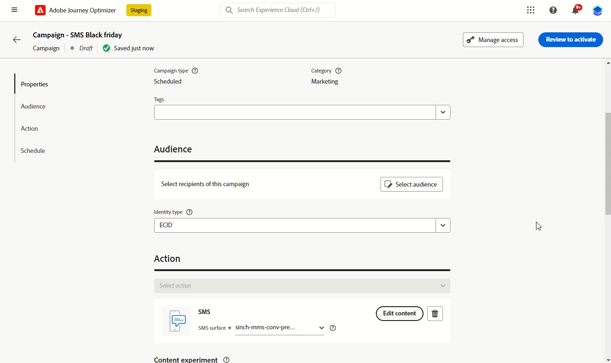

Para obtener más información, consulte la <a href="../sms/create-sms.md#mms-content">documentación detallada</a>.

</tr>
</tbody>
</table>

### Mejoras {#oct-2023-improvements}

Esta versión incorpora las mejoras que se enumeran a continuación.

**Audiencias**

* Ahora puede segmentar audiencias cargadas desde un archivo CSV a recorridos y campañas. [Más información](../audience/about-audiences.md#about-segments)
* Ahora puede segmentar audiencias creadas mediante la composición de audiencias y aprovechar los atributos de enriquecimiento en los Recorridos. [Más información](../building-journeys/read-audience.md)

>[!AVAILABILITY]
>
>Estas funcionalidades están disponibles actualmente como una versión beta.

<!--
**Spam scoring for emails**

* When simulating an email content, a new option enables you to check how your content performs against inboxes spam filtering. This feature is currently proposed to a set of customers only (Limited Availability), and available for the Email channel.
-->

**Campañas**

<!--* You can now stop a live one-time campaign, make modifications and resume it again. This improvement is available in Beta.-->
* Cuando se produce un error en una de las campañas, ahora aparece un icono de advertencia en la lista de campañas junto con el estado de la campaña. [Más información](../campaigns/manage-campaigns.md#statuses)

**Recorridos**

* La duración máxima que puede definir en cualquier tiempo de espera ahora es de 29 días, en lugar de 30. Esta mejora se ha introducido para evitar que la duración de la espera supere los 30 días de vida útil del recorrido. Esto se aplica a:

   * el campo **Cantidad de tiempo** en la [actividad de espera](../building-journeys/wait-activity.md)
   * el **período de espera de reentrada** en [propiedades de recorrido](../building-journeys/journey-properties.md#entrance)
   * el campo **Esperar** en la definición de tiempo de espera de [actividades de evento](../building-journeys/general-events.md#events-specific-time).

<!--
**Consent in channel configuration**

* You can now select a marketing action at the channel configuration level. When used in a surface, all consent policies associated with that marketing action are leveraged in order to respect the preferences of your customers.
-->

**Administración de decisiones**

* Se han actualizado varias etiquetas relacionadas con la restricción de ofertas en la interfaz de administración de decisiones. [Más información](../offers/offer-library/add-constraints.md#capping)

## Versión de septiembre de 2023 {#sept-rn-2023}

### Nuevas funciones{#sept-2023-features}

Esta versión incorpora las nuevas funciones que se enumeran a continuación.

<table>
<thead>
<tr>
<th><strong>Atributos calculados</strong> </th>
</tr>
</thead>
<tbody>
<tr>
<td>

Los atributos calculados permiten resumir fácilmente los datos de evento en atributos de perfil a través de una interfaz de usuario intuitiva para mejorar la segmentación, personalización y activación basada en el comportamiento. Con esta función, puede crear atributos calculados de forma automática, administrarlos y utilizarlos en segmentación, destinos de perfil del cliente en tiempo real o Journey Optimizer.  
Además, los atributos calculados simplifican la segmentación y los flujos de trabajo de recorrido para ayudarle a ofrecer sin problemas experiencias relevantes. Obtenga más información en la <a href="../audience/computed-attributes.md">documentación detallada</a>.

</tr>
</tbody>
</table>

<table>
<thead>
<tr>
<th><strong>Informes de canales consolidados</strong> </th>
</tr>
</thead>
<tbody>
<tr>
<td>

La función Informe de canal ofrece a analistas y expertos en marketing una descripción general completa de las métricas de tráfico y participación a nivel de canal.

Para acceder al menú <b>Informe</b>, debe tener el permiso <b>Ver informes de canal</b>.

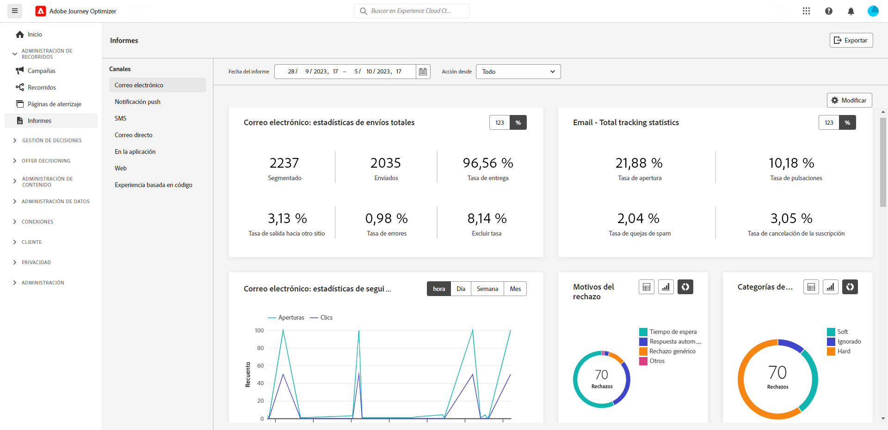

Para obtener más información, consulte la <a href="../reports/channel-report-cja.md">documentación detallada</a>.

</tr>
</tbody>
</table>

<table>
<thead>
<tr>
<th><strong>Destinos de exportación de conjuntos de datos (GA)</strong> </th>
</tr>
</thead>
<tbody>
<tr>
<td>

La exportación de conjuntos de datos de Journey Optimizer a destinos de almacenamiento en la nube ya está disponible de forma general. Esta función le permite establecer una conexión activa con ubicaciones de almacenamiento en la nube para exportar el contenido de sus conjuntos de datos.

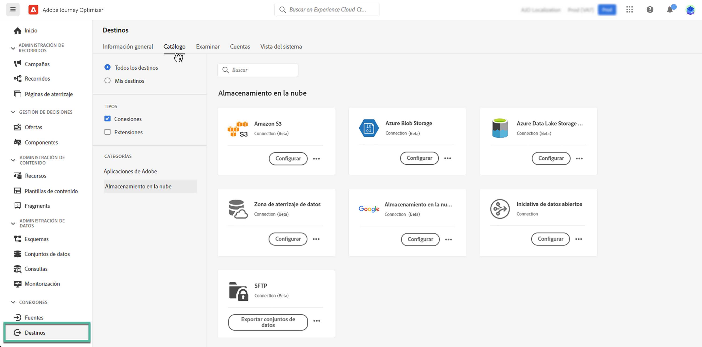

Para obtener más información, consulte la <a href="../data/export-datasets.md">documentación detallada</a>.

</td>
</tr>
</tbody>
</table>

<table>
<thead>
<tr>
<th><strong>Almacenamiento de credenciales de aplicación móvil por zona protegida</strong> </th>
</tr>
</thead>
<tbody>
<tr>
<td>

Esta nueva función le permite administrar y asociar fácilmente credenciales push con una zona protegida dedicada en las superficies de la aplicación.

Para obtener más información, consulte la <a href="../in-app/inapp-configuration.md#channel-prerequisites">documentación detallada</a>.

</tr>
</tbody>
</table>

### Mejoras {#sept-2023-improvements}

Esta versión incorpora las mejoras que se enumeran a continuación.

**Administración de decisiones**

* Ya están disponibles nuevas API para la creación y administración de objetos de administración de decisiones. Estas API ofrecen un rendimiento mejorado y una experiencia de usuario mejorada. Las API heredadas serán compatibles hasta el 27 de marzo de 2024. [Más información](../offers/api-reference/getting-started.md)

**Personalization**

* Además de los fragmentos visuales, ahora es posible crear, guardar y reutilizar fragmentos de expresiones desde la interfaz de Journey Optimizer a través del Editor de expresiones. Los fragmentos de expresión reemplazan a las expresiones guardadas anteriormente. [Más información](../personalization/use-expression-fragments.md)

**Alerta**

* Se ha introducido un nuevo tipo de alerta del sistema. Ahora puede recibir una notificación cuando falle una actividad **Leer audiencia**. [Más información](../reports/alerts.md).

**Canal web**

* Ahora, las aplicaciones de una sola página (SPA) se pueden crear en el editor visual web, que le permite seleccionar a qué vistas específicas desea aplicar las modificaciones de la página web. Una vista puede definirse como un sitio completo o como un grupo de elementos visuales en un sitio, como la página de inicio, la totalidad del sitio de productos o el marco de preferencias de envío en todas las páginas de cierre de compra. Se necesita una configuración de desarrollador única para definir las vistas en la implementación de Adobe Experience Platform Web SDK; esto permite a los especialistas en marketing crear y ejecutar campañas web de Adobe Journey Optimizer en SPA. [Más información](../web/web-spa.md)

* Al editar una página con el diseñador web, ahora puede agregar nuevos cambios al contenido directamente desde el panel Modificaciones, sin necesidad de seleccionar un componente y editarlo desde la interfaz del diseñador. [Más información](../web/manage-web-modifications.md#add-modifications)

* Al configurar subdominios web, ahora tiene la opción de agregar su propio subdominio, además de utilizar un subdominio ya delegado a Adobe. [Más información](../web/web-delegated-subdomains.md#web-configure-new-subdomain)

**Recorridos**

* Al duplicar un recorrido, ahora puede definir el nombre de la copia de recorrido. [Más información](../building-journeys/journey-gs.md#duplicate-a-journey)

* La compatibilidad con las respuestas de acciones personalizadas ahora es GA. Esta capacidad le permite aprovechar las respuestas de llamadas de API en acciones personalizadas y organizar su recorrido en función de estas respuestas. Además, se ha agregado una [nueva protección de límite](../start/guardrails.md#custom-actions-g) para limitar automáticamente las llamadas de acción personalizadas. [Más información](../action/action-response.md)
<!--
* The maximum duration that you can define in the Wait activity is now 29 days instead of 30.
-->

**Canal de correo electrónico**

* Una nueva opción de la configuración de superficie de correo electrónico permite enviar mensajes transaccionales a perfiles aunque sus direcciones de correo electrónico estén en la lista de supresión de Adobe [!DNL Journey Optimizer]. [Más información](../email/email-settings.md#send-to-suppressed-email-addresses)

**Canal de SMS**

* Se han agregado dos campos nuevos, **Mensaje de inclusión** y **Mensaje de ayuda**, a la pantalla de configuración de la API, lo que permite a los usuarios personalizar las respuestas para las palabras clave entrantes. Tenga en cuenta que esto solo está disponible para el proveedor de SMS de Sinch. [Más información](../sms/sms-configuration.md)

* La exclusión de SMS ya no se administra en el nivel de canal. Ahora es específico para un número, lo que significa que si algunos perfiles se excluyen de un número determinado o código corto, aún puede enviarles mensajes de otros números que pueda utilizar para enviar mensajes SMS. Una nueva opción le permite seleccionar el **número de exclusión** que desea utilizar para una superficie determinada. [Más información](../sms/sms-configuration.md)

**Canal de correo postal**

* Ahora puede cifrar archivos destinados a sus proveedores de correo postal cuando se transfieren a un servidor. Para ello, hay un nuevo campo disponible en la pantalla de configuración de enrutamiento de archivos, que le permite copiar y pegar la clave de cifrado. [Más información](../direct-mail/direct-mail-configuration.md)

**Informes**

* Ahora puede exportar informes de Journey Optimizer como archivo CSV. Obtenga más información en la [documentación detallada](../reports/report-gs-cja.md).

**Assets**

* Una nueva opción para Assets le permite elegir el repositorio para su Assets en Journey Optimizer. Puede optar por un repositorio de Assets Essentials o por un repositorio de Assets as a Cloud Service, siempre que sea el propietario de esta solución. [Más información](../integrations/assets.md)

<!--
**Decision management**

Enhancements have been made to the audience picker in journeys or campaigns, with the addition of new columns displaying the origin and update frequency of audiences.    
-->

## Versión de agosto de 2023 {#aug-rn-2023}

### Nuevas funciones{#aug-2023-features}

Esta versión incorpora las nuevas funciones que se enumeran a continuación.

<table>
<thead>
<tr>
<th><strong>Envío de mensajes en la aplicación en los recorridos</strong> </th>
</tr>
</thead>
<tbody>
<tr>
<td>

Ahora puede enviar mensajes personalizados en la aplicación a los usuarios de la misma dentro de un recorrido. Utilice Journey Optimizer para diseñar notificaciones y personalizar el diseño del mensaje, la visualización, el texto y los botones para crear una experiencia perfecta.

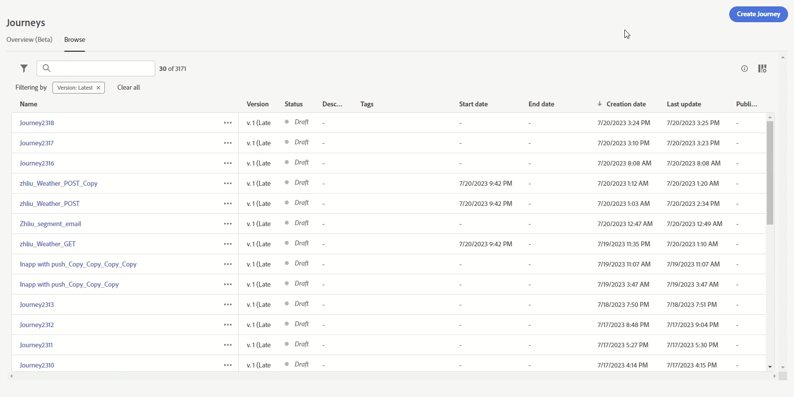

Para obtener más información, consulte la <a href="../in-app/create-in-app.md">documentación detallada</a>.

</tr>
</tbody>
</table>

<table>
<thead>
<tr>
<th><strong>Validación de correos electrónicos con listas semilla</strong> </th>
</tr>
</thead>
<tbody>
<tr>
<td>

Ahora puede crear y administrar listas semilla en Journey Optimizer. Una lista semilla consiste en direcciones internas que se pueden añadir a la audiencia real y recibir el mismo mensaje que los perfiles objetivo en el momento de la ejecución de la entrega. Utilice esta capacidad para monitorizar las comunicaciones enviadas y asegurarse de que todos los formatos de visualización, URL, imágenes y vínculos son correctos.

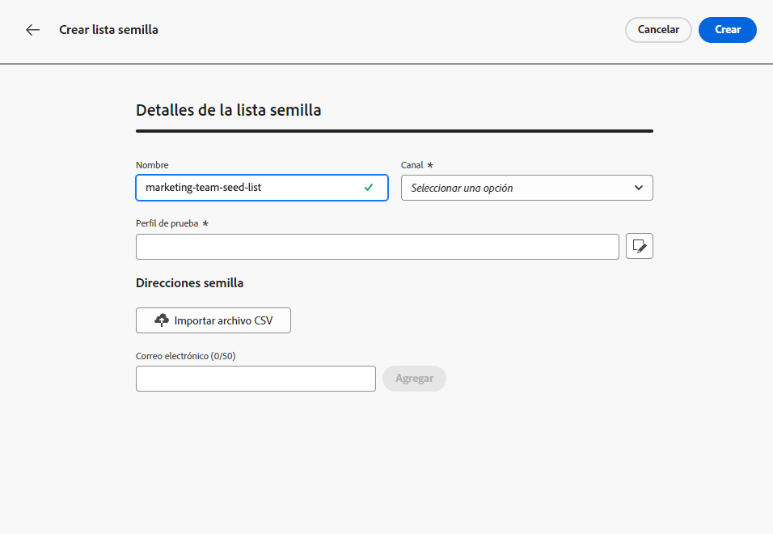

Para obtener más información, consulte la <a href="../configuration/seed-lists.md">documentación detallada</a>.

</td>
</tr>
</tbody>
</table>

<!--
table>
<thead>
<tr>
<th><strong>Generate text and images with the Content assistant</strong> </th>
</tr>
</thead>
<tbody>
<tr>
<td>

Once you have created and personalized your message, take your content to the next level with the Content assistant. You can now use the Content assistant to optimize your message's impact by experimenting with different main titles, and images. Each variant is managed as a unique Treatment, to measure and compare which title effectively generates more clicks.

This capability is currently available as a private beta.

For more information, refer to the <a href="../start/search-filter-categorize.md#tags">detailed documentation</a>.

</td>
</tr>
</tbody>
-->

### Mejoras {#aug-2023-improvements}

Esta versión incorpora las mejoras que se enumeran a continuación.

<!--
**APIs**

A new API to create and manage Content Fragments is now available. [Learn more](https://developer.adobe.com/journey-optimizer-apis/references/content-templates/#tag/Content-fragment-API){target="_blank"}.
-->

<!--
**Email channel**

A new option is available in the email surface settings to include email addresses suppressed due to spam complaint in your transactional messages audiences. Even if they marked marketing messages as spam, these profiles can then receive transactional messages, such as password reset or account statements. This option is disabled by default.
-->

**Recorridos**

* Ahora puede aprovechar las respuestas de llamadas de API en acciones personalizadas y organizar su recorrido en función de estas respuestas. Actualmente, esta función está disponible como una versión beta. [Más información](../action/action-response.md).
* Se ha introducido un nuevo tipo de alerta del sistema. Ahora puede recibir notificaciones cuando falle una acción personalizada. [Más información](../reports/alerts.md).
  <!--* When duplicating a journey, you can now define the name of the journey copy.-->

**Correo postal**

* Ahora se puede seleccionar Azure como tipo de servidor en la configuración de enrutamiento de archivos. [Más información](../direct-mail/direct-mail-configuration.md#file-routing-configuration)
* Ampersand está ahora disponible como campo separador de columnas en la configuración de superficie de correo postal. [Más información](../direct-mail/direct-mail-configuration.md#direct-mail-surface)

## Versión de julio de 2023 {#july-rn-2023}

### Nuevas funciones{#july-2023-features}

<table>
<thead>
<tr>
<th><strong>Composición de audiencia</strong> </th>
</tr>
</thead>
<tbody>
<tr>
<td>

Ahora puede crear flujos de trabajo de composición para combinar audiencias de Adobe Experience Platform existentes en un lienzo visual y aprovechar varias actividades (dividir, enriquecer...) para crear nuevas audiencias. Las audiencias recién creadas se vuelven a guardar en Adobe Experience Platform junto con las audiencias existentes y se pueden aprovechar en campañas de Journey Optimizer para clientes de destino.

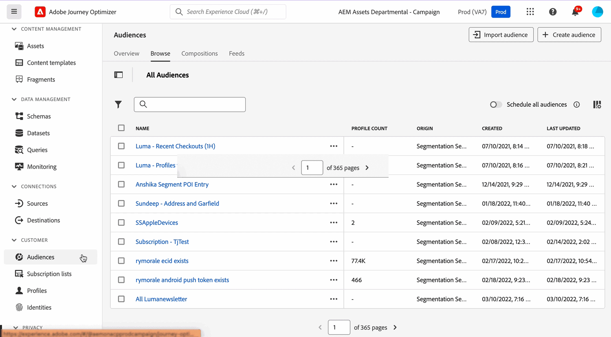

Para obtener más información, consulte la <a href="../audience/get-started-audience-orchestration.md">documentación detallada</a>.

La composición de audiencias viene totalmente integrada con el nuevo menú "Audiencias" de Adobe Experience Platform, que sirve como portal centralizado para las audiencias. Ahora puede utilizar una página de exploración que incluya un nuevo panel con tendencias de segmentos y superposiciones para encontrar nuevas perspectivas y explorar las herramientas organizativas para la carpeta y el etiquetado. Esta experiencia incluye controles de gobernanza para el etiquetado de audiencias estandarizado, así como funciones de administración del ciclo vital de las audiencias para administrar los flujos de trabajo de activación. Con esta nueva experiencia de administración, ahora puede administrar audiencias de forma fácil y segura desde un solo lugar. Para obtener más información, consulte <a href="https://experienceleague.adobe.com/docs/experience-platform/segmentation/ui/overview.html?lang=es" target="_blank">Documentación de Adobe Experience Platform</a>.

</td>
</tr>
</tbody>
</table>

<table>
<thead>
<tr>
<th><strong>Canal de correo directo</strong> </th>
</tr>
</thead>
<tbody>
<tr>
<td>

Ahora puede agregar mensajes de correo postal en sus campañas. El correo postal es un canal sin conexión que le permite personalizar y generar los archivos necesarios para que los proveedores de correo postal envíen correo a sus clientes.

Al preparar una entrega de correo postal, Journey Optimizer genera un archivo que incluye todos los perfiles de destino y la información de contacto elegida (por ejemplo, una dirección postal). A continuación, podrá enviar este archivo a su proveedor de correo postal, que se encargará del envío real.

Por ahora, el canal de correo postal no está disponible para las organizaciones que hayan adquirido la oferta complementaria Adobe Healthcare Shield.

Para obtener más información, consulte la <a href="../direct-mail/get-started-direct-mail.md">documentación detallada</a>.

</tr>
</tbody>
</table>

<table>
<thead>
<tr>
<th><strong>Conversión del contenido de HTML para el Designer de correo electrónico</strong> </th>
</tr>
</thead>
<tbody>
<tr>
<td>

Ahora puede importar y convertir cualquier contenido de HTML en el editor de correo electrónico de Journey Optimizer. Los bloques de contenido se identifican automáticamente y están disponibles en el Designer de correo electrónico: utilice sus potentes funciones de diseño para actualizarlos y personalizarlos.

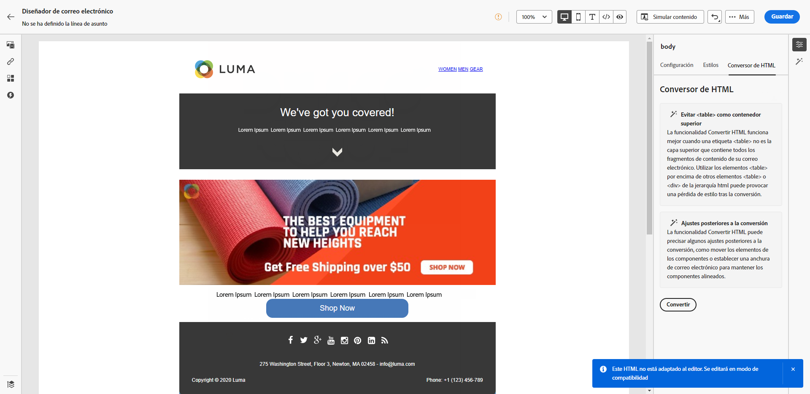

Para obtener más información, consulte la <a href="../email/existing-content.md">documentación detallada</a>.

</td>
</tr>
</tbody>
</table>

<table>
<thead>
<tr>
<th><strong>Uso de etiquetas en Journey Optimizer</strong> </th>
</tr>
</thead>
<tbody>
<tr>
<td>

Además de las campañas y los recorridos, ahora puede asignar Adobe Experience Platform Unified Tags a sus páginas de aterrizaje, plantillas de contenido, fragmentos y listas de suscripción. Esto le permite clasificarlas fácilmente y mejorar la búsqueda y la navegación en todas las listas. 

Para obtener más información, consulte la <a href="../start/search-filter-categorize.md#tags">documentación detallada</a>.

</td>
</tr>
</tbody>
</table>

<table>
<thead>
<tr>
<th><strong>API de plantillas de contenido</strong> </th>
</tr>
</thead>
<tbody>
<tr>
<td>

Ahora puede crear y administrar plantillas de contenido de Adobe Journey Optimizer mediante API dedicadas, lo que proporciona una integración perfecta con su sistema de contenido existente.

Para obtener más información, consulte la <a href="https://developer.adobe.com/journey-optimizer-apis/references/content">documentación detallada</a>.

</td>
</tr>
</tbody>
</table>

### Mejoras {#july-2023-improvements}

Esta versión incorpora las mejoras que se enumeran a continuación.

**Campañas**

Los eventos contextuales relacionados con campañas ya están disponibles para su uso en el menú &quot;Atributos contextuales&quot; del editor de personalización.

**Audiencias**

Se han realizado mejoras en el selector de audiencias en recorridos o campañas, con la adición de nuevas columnas que muestran el origen y la frecuencia de actualización de las audiencias. Con la publicación del portal de composición de audiencias, Adobe Experience Platform y Adobe Journey Optimizer han actualizado el uso de &quot;audiencias&quot; y &quot;segmentos&quot; en el sistema y en la documentación.

* Audiencia: conjunto de personas, cuentas, hogares u otras entidades que comparten características y comportamientos comunes.
* Definición del segmento: en Adobe Experience Platform, las reglas utilizadas para describir las características clave o el comportamiento de una audiencia objetivo. Este término se conocía anteriormente como &quot;segmento&quot;.

Como resultado, dentro de Adobe Journey Optimizer y de la interfaz de usuario de Adobe Experience Platform, los &quot;segmentos&quot; se sustituyen por &quot;audiencias&quot; para reflejar esta nueva ruta de creación y administración de audiencias.

**API**

El método JWT para generar tokens de acceso para la autenticación de API de Adobe Journey Optimizer ha quedado obsoleto. Todas las nuevas integraciones deben crearse con el método de autenticación de servidor a servidor OAuth. Adobe también recomienda migrar las integraciones existentes al método OAuth. [Más información](https://developer.adobe.com/journey-optimizer-apis/references/authentication){target="_blank"}.

**Otros cambios**

La exportación de conjuntos de datos de Journey Optimizer a destinos de almacenamiento en la nube ya está disponible para todos los clientes como una versión beta pública. Esta función le permite establecer una conexión activa con ubicaciones de almacenamiento en la nube para exportar el contenido de sus conjuntos de datos. [Más información](../data/export-datasets.md)

## Versión de junio de 2023 {#june-rn-2023}

<table>
<thead>
<tr>
<th><strong>Campañas activadas por API para casos de uso de marketing</strong> </th>
</tr>
</thead>
<tbody>
<tr>
<td>

Ahora puede utilizar las API para almacenar en déclencheur las campañas de marketing en Adobe Journey Optimizer desde un sistema externo.

Hasta esta versión, la capacidad de campañas activadas por API cubría varias necesidades operativas y de mensajería transaccional, como los restablecimientos de contraseña o el token OTP, pero no se podía utilizar para crear campañas de marketing. Los canales disponibles para las campañas activadas por API son: correo electrónico, SMS y mensajes push.

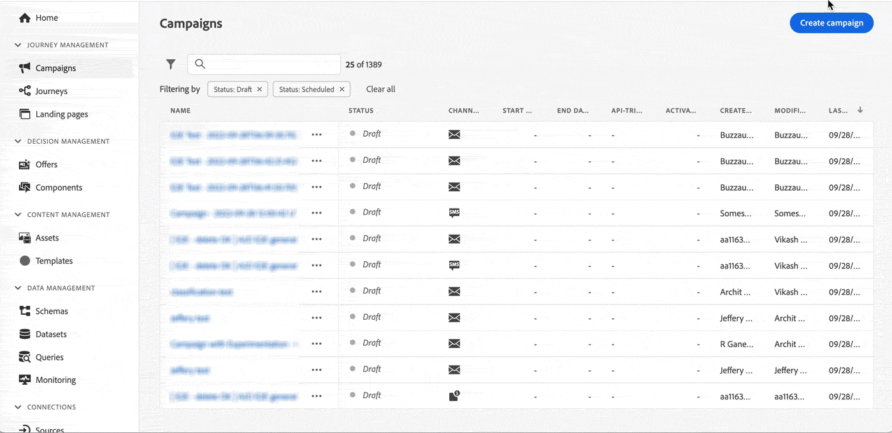

Para obtener más información, consulte la <a href="../campaigns/api-triggered-campaigns.md">documentación detallada</a>.
</td>
</tr>
</tbody>
</table>

<!--
### Improvements {#june-2023-improvements}

**Audiences**

Enhancements have been made to the audience picker in journeys or campaigns, with the addition of new columns displaying the origin and update frequency of audiences.

**Journeys**

You can now leverage API call responses in custom actions and orchestrate your journey based on these responses.
-->

<!--
## June 2023 early release notes {#june-rn-2023}

Information below is subject to change without prior notice until the release availability date. Updated documentation will be published at the release date, and direct links will be added on this page.

**Audiences**

Enhancements have been made to the audience picker in journeys or campaigns, with the addition of new columns displaying the origin and update frequency of audiences.    

**Journeys**

* You can now leverage API call responses in custom actions and orchestrate your journey based on these responses.     

* A new type of system alert has been introduced. You can now get notified when a custom action fails.
-->

## Versión de mayo de 2023 {#may-rn-2023}

### Nuevas funciones{#may-2023-features}

<table>
<thead>
<tr>
<th><strong>Experimentación de contenido en campañas</strong> </th>
</tr>
</thead>
<tbody>
<tr>
<td>

Adobe Journey Optimizer ahora admite experimentos en campañas. Los experimentos son ensayos aleatorios, lo que en el contexto de las pruebas en línea significa que expone a algunos usuarios seleccionados aleatoriamente a una variación determinada de un mensaje y a otro conjunto de usuarios seleccionados aleatoriamente a otra variación o tratamiento. Después de la exposición, puede medir las métricas de resultado que le interesan, como aperturas de correos electrónicos, suscripciones o compras.

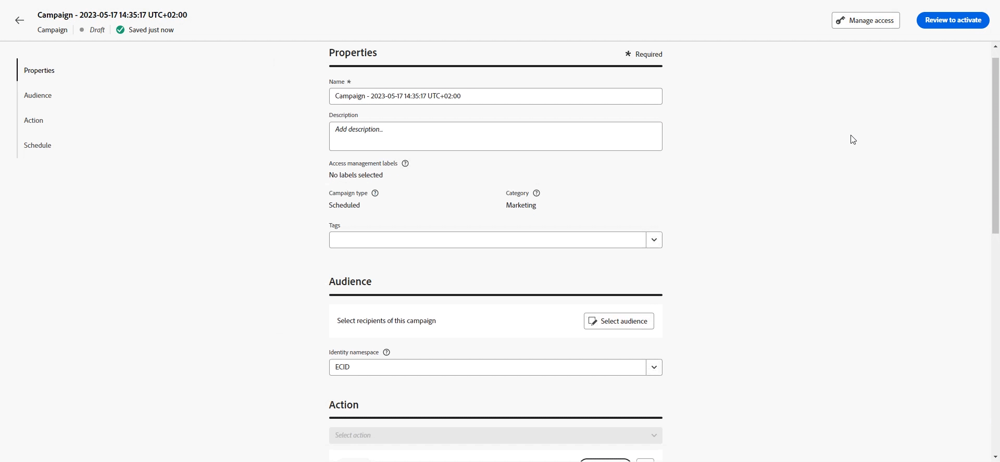

Para obtener más información, consulte la <a href="../content-management/content-experiment.md">documentación detallada</a>.

</td>
</tr>
</tbody>
</table>

<!--
<table>
<thead>
<tr>
<th><strong>Objective reporting and performance measurement in campaigns</strong> </th>
</tr>
</thead>
<tbody>
<tr>
<td>

You can now measure the performance of your campaigns across inbound and outbound through dedicated reports. Adobe Journey Optimizer reports can retrieve additional metrics to use in the Objectives tab of your campaign reports.

For more information, refer to the <a href="../reports/campaign-global-report-cja.md">detailed documentation</a>.

</td>
</tr>
</tbody>
</table>
-->

<table>
<thead>
<tr>
<th><strong>Creación y uso de fragmentos en el contenido del correo electrónico</strong> </th>
</tr>
</thead>
<tbody>
<tr>
<td>

Ahora puede crear, utilizar y administrar fragmentos para montar rápidamente sus correos electrónicos y plantillas de contenido. Un fragmento es un componente reutilizable creado previamente al que se puede hacer referencia en varios correos electrónicos en campañas y recorridos de Journey Optimizer para un proceso de diseño mejorado y acelerado.

Para obtener más información, consulte la <a href="../content-management/fragments.md">documentación detallada</a>.

</td>
</tr>
</tbody>
</table>

<table>
<thead>
<tr>
<th><strong>Uso de etiquetas en las campañas (Beta)</strong> </th>
</tr>
</thead>
<tbody>
<tr>
<td>

Ahora puede asignar etiquetas unificadas de Adobe Experience Platform a sus campañas. Esto le permite clasificarlas fácilmente y mejorar la búsqueda desde la lista de campañas. Tenga en cuenta que la función de etiquetas unificadas se encuentra actualmente en versión beta.

Para obtener más información, consulte la <a href="../start/search-filter-categorize.md#tags">documentación detallada</a>.

</td>
</tr>
</tbody>
</table>

<table>
<thead>
<tr>
<th><strong>Modelo de clasificación de AI de optimización personalizada (disponibilidad general)</strong> </th>
</tr>
</thead>
<tbody>
<tr>
<td>

Los modelos de clasificación de IA de optimización personalizada ahora están disponibles de forma general en Administración de decisiones. Este nuevo tipo de modelo le permite optimizar y personalizar ofertas basadas en audiencias y ofrecer rendimiento.

Para obtener más información, consulte la <a href="../offers/ranking/personalized-optimization-model.md">documentación detallada</a>.

</td>
</tr>
</tbody>
</table>

### Mejoras {#may-2023-improvements}

**Audiencias**

* Como preparación para la disponibilidad general de la función de Audience Portal, Adobe Experience Platform está actualizando el uso de &quot;audiencias&quot; y &quot;segmentos&quot; en el sistema y la documentación.

   * Audiencia: conjunto de personas, cuentas, hogares u otras entidades que comparten características y comportamientos comunes.
   * Definición del segmento: en Adobe Experience Platform, las reglas utilizadas para describir las características clave o el comportamiento de una audiencia objetivo. Este término se conocía anteriormente como &quot;segmento&quot;.

  Como resultado, dentro de Adobe Journey Optimizer y de la interfaz de usuario de Adobe Experience Platform, verá &quot;Segmentos&quot; reemplazado por &quot;Audiencias&quot; para reflejar esta nueva ruta de creación y administración de audiencias.

  Las traducciones del término &quot;audiencia&quot; al referirse a un grupo de perfiles destinados a recibir un mensaje se armonizaron en todos los productos de Digital Experience para algunos idiomas:

   * Alemán: Zielgruppe
   * Portugués brasileño: público-alvo
   * Español: público destinatario

<!--* Enhancements have been made to the audience picker in journeys or campaigns, with the addition of new columns displaying the origin and update frequency of audiences.-->

**Canal de SMS**

* Infobip se ha agregado como proveedor al configurar las configuraciones de canal de SMS. [Más información](../sms/sms-configuration.md)
* Twillio: La configuración de credenciales de API ahora incluye la capacidad de agregar el SID del servicio de mensajería para una integración perfecta con su cuenta de Twilio. [Más información](../sms/sms-configuration.md)

**Canal en la aplicación**

* Se han añadido nuevas reglas de déclencheur de mensajes para el servicio Adobe Places. [Más información](../in-app/inapp-configuration.md)
* Se han añadido nuevas funciones de Adobe Experience Platform Assurance para capturar eventos de dispositivos y añadirlos como reglas de déclencheur.

<!--
**Journeys**

* You can now leverage API call responses in custom actions and orchestrate your journey based on these responses.
-->

**Campañas**

* Ahora es posible duplicar una campaña desde la pantalla del inventario utilizando el menú de acción de los tres puntos. [Más información](../campaigns/manage-campaigns.md#duplicate)
* Ahora puede eliminar borradores de modificaciones en una campaña en directo.
* Los pasos para activar una campaña se han simplificado. [Más información](../campaigns/manage-campaigns.md)

**Administración de decisiones**

* Ahora puede editar la restricción de frecuencia si la oferta tiene el estado **[!UICONTROL Borrador]** y nunca antes se había publicado con la restricción de frecuencia habilitada. [Más información](../offers/offer-library/add-constraints.md#frequency-capping)

**Personalization**

* Ahora puede seleccionar e insertar referencias de recursos directamente desde el Editor de Personalization cuando trabaja en contenido de HTML.

### Correcciones{#may-2023-fixes}

* Mensajes en la aplicación: se ha corregido un problema por el que la programación de campañas entraba en conflicto con la configuración de frecuencia de mensajes.

## Versión de abril de 2023 {#apr-rn-2023}

<!--
Information below is subject to change without prior notice until the release availability date. Updated documentation will be published at the release date, and direct links will be added on this page.

**Release date**: April 27, 2023
-->

### Nuevas funciones{#apr-2023-features}

<table>
<thead>
<tr>
<th><strong>Canal web (disponibilidad general)</strong> </th>
</tr>
</thead>
<tbody>
<tr>
<td>

Adobe Journey Optimizer está ampliando sus funciones en canales múltiples al añadir compatibilidad con el canal web. Ahora puede crear, cambiar y previsualizar experiencias web como cualquier otro canal, a través de una interfaz visual inteligente e intuitiva para personalizar la experiencia de los usuarios finales. Tenga en cuenta que actualmente en Journey Optimizer solo puede crear experiencias web en campañas de.

Para obtener más información, consulte la <a href="../web/get-started-web.md">documentación detallada</a>.

</tr>
</tbody>
</table>

<table>
<thead>
<tr>
<th><strong>Flujo de trabajo de inicio rápido de la incorporación móvil (Beta)</strong> </th>
</tr>
</thead>
<tbody>
<tr>
<td>

Ya está disponible el nuevo flujo de trabajo de inicio rápido de la incorporación móvil. Utilice esta nueva función de producto para configurar rápidamente Mobile SDK para que empiece a recopilar y validar datos de eventos móviles y enviar notificaciones push móviles con Adobe Journey Optimizer. Se puede acceder a esta funcionalidad a través de la página de inicio de la recopilación de datos como una versión beta pública.

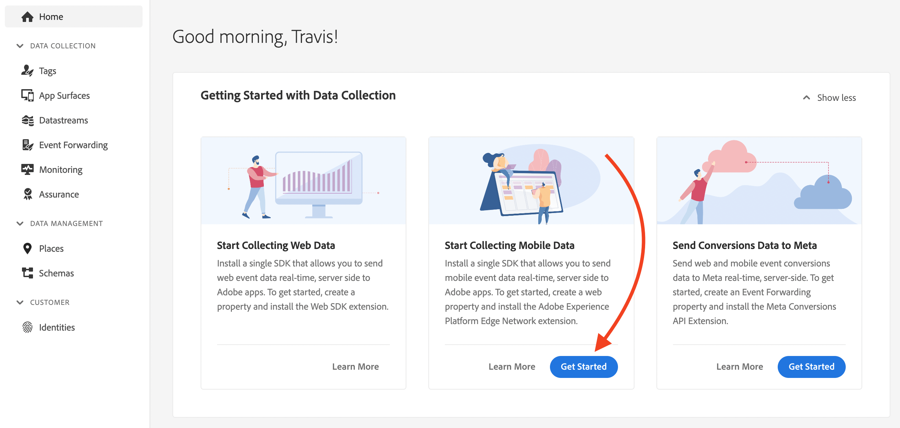

Para obtener más información, consulte la <a href="../push/mobile-onboarding-wf.md">documentación detallada</a>.

</td>
</tr>
</tbody>
</table>

<table>
<thead>
<tr>
<th><strong>Nuevo tablero de Recorrido (Beta)</strong> </th>
</tr>
</thead>
<tbody>
<tr>
<td>

 El panel de Recorrido ahora se divide en dos pestañas:

<ul><li>Use la ficha <strong>Información general</strong> para acceder a un nuevo tablero que muestra métricas clave relacionadas con sus recorridos.</li>
<li>Use la ficha <strong>Examinar</strong> para obtener acceso a la lista de todos los recorridos.</li></ul>

Se puede acceder a esta funcionalidad en todos los recorridos como una versión beta pública.

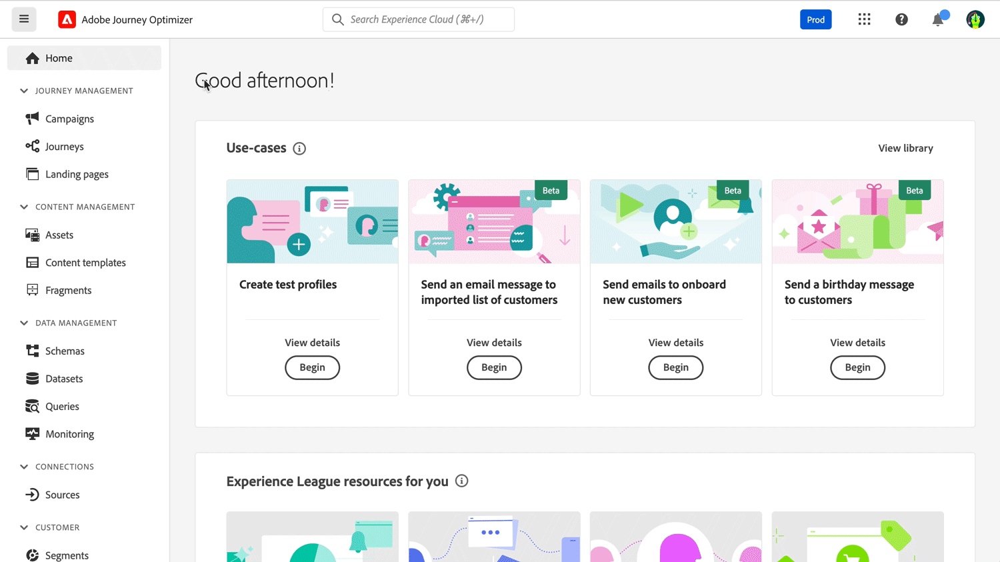

Para obtener más información, consulte la <a href="../building-journeys/journey-gs.md#journey-access">documentación detallada</a>.

</td>
</tr>
</tbody>
</table>

### Mejoras {#april-2023-improvements}

**Recorridos**

* El lienzo de recorrido ahora muestra el ID de actividad en las actividades de mensajes y las etiquetas de finalización. Esto mejora la creación de informes y el retargeting.
* Se ha mejorado la presentación del panel de configuración, que aparece en acciones, fuentes de datos, eventos y recorridos.
* Nuevo insight en número de nodos en lienzo con garantías para ayudar a crecer: mantenga los recorridos fáciles de leer, realice controles de calidad y solucione problemas con un número máximo de nodos por recorrido a 50. [Más información](../start/guardrails.md#journeys-guardrails-journeys)
* Al agregar una acción [Email](../email/create-email.md), [SMS](../sms/create-sms.md) o [Push](../push/create-push.md) en un recorrido, la superficie ahora se rellena previamente, de forma predeterminada, con la última superficie utilizada para ese canal, en el recorrido actual.
* Ahora puede definir parámetros de consulta estáticos o dinámicos en sus acciones personalizadas. [Más información](../action/about-custom-action-configuration.md#url-configuration)

**Informes**

* Ahora puede exportar informes de Journey Optimizer como PDF. [Más información](../reports/report-gs-cja.md)

**Designer de contenido**

* Se ha actualizado Adobe Journey Optimizer Content Designer y el acceso a los estilos y componentes de diseño es ahora más sencillo. Esta nueva versión ofrece una experiencia de usuario mejorada e incluye un mayor rendimiento, compatibilidad parcial con el modo oscuro y compatibilidad con nuevos estándares de accesibilidad.

## Versión de marzo de 2023 {#mar-2023}

### Nuevas funciones{#mar-2023-features}

<table>
<thead>
<tr>
<th><strong>Canal en la aplicación (disponibilidad general)</strong> </th>
</tr>
</thead>
<tbody>
<tr>
<td>

Ahora puede enviar mensajes personalizados en la aplicación a los usuarios de la misma dentro de una campaña. Utilice Journey Optimizer para diseñar notificaciones y personalizar el diseño del mensaje, la visualización, el texto y los botones para crear una experiencia perfecta.

Para obtener más información, consulte la <a href="../../rp_landing_pages/in-app-landing-page.md">documentación detallada</a>.

</tr>
</tbody>
</table>

<table>
<thead>
<tr>
<th><strong>Seguimiento de clics de SMS</strong> </th>
</tr>
</thead>
<tbody>
<tr>
<td>

Con el rastreo de clics de SMS, puede monitorizar el rendimiento de sus URL abreviadas, identificar quién hizo clic en ellas y utilizar estos datos para redireccionar a esos clientes con campañas posteriores.

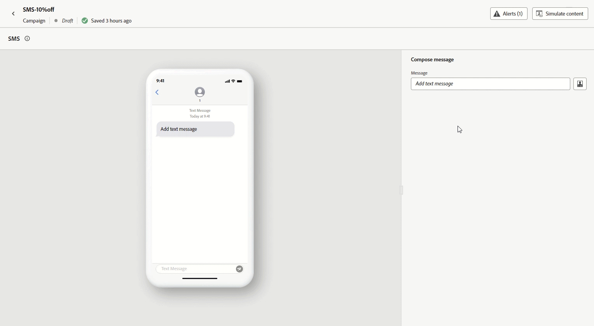

Para obtener más información, consulte la <a href="../sms/create-sms.md#sms-content">documentación detallada</a>.

</td>
</tr>
</tbody>
</table>

<table>
<thead>
<tr>
<th><strong>Uso de etiquetas en los Recorridos (Beta)</strong> </th>
</tr>
</thead>
<tbody>
<tr>
<td>

Como profesional de Journey Optimizer, ahora puede organizar los objetos empresariales mediante etiquetas. Las etiquetas son una forma rápida y sencilla de clasificar objetos para mejorar la búsqueda. Actualmente, esta función está en versión beta y solo está disponible para Recorridos.

Para obtener más información, consulte la <a href="../start/search-filter-categorize.md#tags">documentación detallada</a>.

</td>
</tr>
</tbody>
</table>

### Mejoras {#mar-2023-improvements}

**Recorridos**

* La nueva **API de restricción** le permite establecer un límite en el número de eventos enviados por segundo, lo que evita picos de tráfico abrumadores en sus sistemas externos o API. Cuando se alcanza el límite establecido, todas las llamadas de API subsiguientes se ponen en cola y se procesan lo antes posible, en el orden en que se recibieron. Tenga en cuenta que esta función solo admite una configuración de regulación en todas las zonas protegidas. [Más información](../configuration/external-systems.md)
* El lienzo de Recorrido se ha mejorado para una experiencia de usuario más sencilla y mejorada. Al final de cada trazado en el lienzo, se han eliminado los marcadores de posición vacíos. Ahora puede añadir las actividades arrastrándolas al final de una ruta.
* En el lienzo de recorrido, la etiqueta **End** ya no se establece automáticamente con el nombre de la actividad anterior. Los usuarios pueden agregar manualmente una etiqueta personalizada si es necesario.
* El tiempo de espera predeterminado y la duración del error en las propiedades del recorrido se han cambiado de 5 a 30 segundos. [Más información](../configuration/external-systems.md#timeout)
* La tasa de regulación predeterminada en las actividades de audiencia de lectura se ha cambiado de 20 000 a 5 000 mensajes por segundo. [Más información](../building-journeys/read-audience.md#configuring-segment-trigger-activity)
* Se ha añadido una protección al modo de prueba para escuchar solo los eventos enviados a través de la interfaz. No se tienen en cuenta los eventos enviados a través de una herramienta externa. [Más información](../building-journeys/testing-the-journey.md)

<!--
 
* When adding an Email, SMS or Push action in a journey, the surface is now pre-filled, by default, with the last used surface for that channel.
* A new type of system alert has been introduced. You can now get notified when a custom action fails. [Learn more](../reports/alerts.md)
* Timeout and error management has been improved in journeys. Timeout and error paths are now always added on the canvas. A new toolbar button is available to show/hide these paths. [Learn more](../building-journeys/journey-gs.md#timeout_and_error)
* The Journey dashboard is now split in two tabs:
    * Use the **Overview** tab to access a new dashboard which displays key metrics related to your journeys.
    * Use the **Browse** tab to access list of all journeys.
-->

**Administración de decisiones**

* Para evitar cualquier posible confusión con la reciente versión de la función de etiquetas en Adobe Experience Platform, se ha cambiado el nombre de las etiquetas de Gestión de decisiones a &quot;Calificadores de colección&quot;.

  Tenga en cuenta que, aunque el término &quot;etiqueta&quot; ya no se utiliza en la interfaz de usuario de Administración de decisiones, se sigue utilizando en servicios back-end como API y conjuntos de datos.

* Ahora puede restablecer el contador de límite de oferta diariamente, semanalmente o mensualmente. [Más información](../offers/offer-library/add-constraints.md#capping)

* También puede elegir qué evento de Adobe Experience Platform debe buscarse para la restricción de Offer Decisioning. [Más información](../offers/offer-library/add-constraints.md#capping)

* Se han añadido parámetros adicionales en la pantalla de creación de ubicaciones. Permiten controlar si una oferta se puede duplicar en varias ubicaciones y especificar si el contenido y los metadatos de la oferta deben incluirse en la respuesta de la API. [Más información](../offers/offer-library/creating-placements.md)

**Personalization**

* Ahora puede incluir texto de reserva predeterminado para atributos de perfil basados en cadenas en el Editor de expresiones. Estos valores se muestran si los atributos seleccionados no devuelven ningún resultado. [Más información](../personalization/personalization-build-expressions.md#add)

**Informes**

* La funcionalidad del widget para creación de informes se ha mejorado con la capacidad de personalizar la forma en que los usuarios ven sus datos. Con esta mejora, los usuarios ahora pueden elegir entre varias opciones de visualización, incluidos gráficos, tablas y gráficos circulares.

  Para tener acceso a las últimas utilidades, tenga en cuenta que tendrá que restablecer los diferentes paneles de creación de informes. Para obtener más información sobre la personalización de tableros, consulte la [documentación detallada](../reports/report-gs-cja.md).

## Versión de febrero de 2023 {#feb-2023}

### Nuevas funciones{#feb-2023-features}

<table>
<thead>
<tr>
<th><strong>Canal en la aplicación (Beta)</strong> </th>
</tr>
</thead>
<tbody>
<tr>
<td>

Ahora puede enviar mensajes personalizados en la aplicación a los usuarios de la misma dentro de una campaña. Utilice Journey Optimizer para diseñar notificaciones y personalizar el diseño del mensaje, la visualización, el texto y los botones para crear una experiencia perfecta.

<strong>Precaución</strong>: esta característica se encuentra actualmente en la versión beta y solo está disponible para los clientes de la versión beta. Para unirse al programa beta, póngase en contacto con el Servicio de atención al cliente de Adobe.

Para obtener más información, consulte la <a href="../../rp_landing_pages/in-app-landing-page.md">documentación detallada</a>.

</td>
</tr>
</tbody>
</table>

<table>
<thead>
<tr>
<th><strong>Exportar conjuntos de datos de Journey Optimizer a destinos de almacenamiento en la nube (Beta)</strong> </th>
</tr>
</thead>
<tbody>
<tr>
<td>

Ahora puede establecer una conexión activa con las ubicaciones de almacenamiento en la nube para exportar el contenido de los conjuntos de datos. Los destinos disponibles son: Amazon S3 Cloud Storage, Azure Blob, Azure Data Lake Gen 2, Data Landing Zone, Google Cloud Storage, SFTP.

<strong>Precaución</strong>: esta característica se encuentra actualmente en versión beta y está disponible para todos los usuarios de Adobe Journey Optimizer. Póngase en contacto con su representante de Adobe para obtener acceso a Destinos si todavía no tiene acceso.

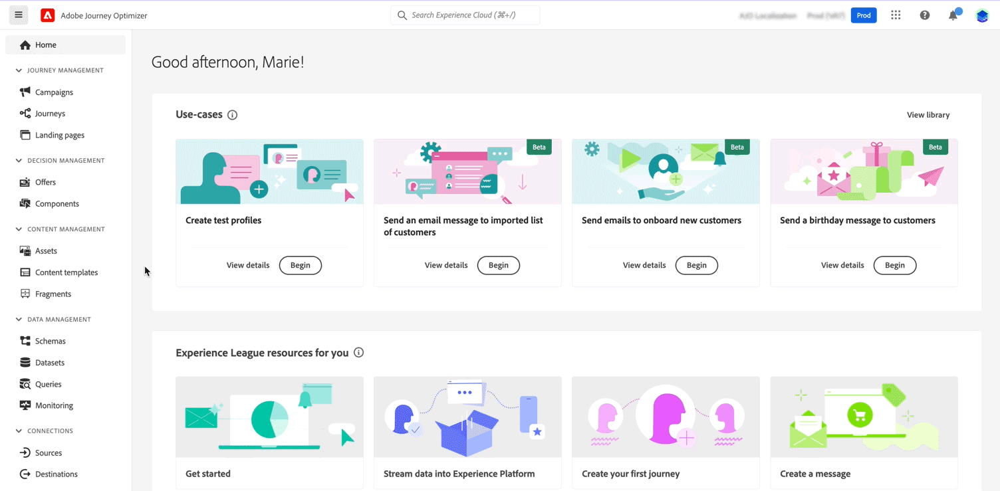

Para obtener más información, consulte la <a href="../data/export-datasets.md">documentación detallada</a>.

</td>
</tr>
</tbody>
</table>

<!--
<table>
<thead>
<tr>
<th><strong>Performance Measurement in campaigns</strong> </th>
</tr>
</thead>
<tbody>
<tr>
<td>

You can now measure the performance of your campaigns across inbound and outbound through dedicated reports. Adobe Journey Optimizer reports can retrieve additional metrics to use in the <strong>Objective</strong> tab of your campaign reports. 

For more information, refer to the <a href="../privacy/data-hygiene.md">detailed documentation</a>.

</td>
</tr>
</tbody>
</table>

+++ Learn more about Performance Measurement

The **[!UICONTROL Objective]** tab of your Campaign report allows you to better fine-tune your deliveries' reports by targeting one specific metric. With this feature, you can effectively track and analyze your campaign's performance and make informed decisions to improve your results.

The **[!UICONTROL Objectives]** listed are linked to **[!UICONTROL Datasets]** that define a connection to a system in order to retrieve additional information. A list of pre-configured **[!UICONTROL Objectives]** is available, but you can also customize your report by adding new **[!UICONTROL Datasets]** and defining your own objectives. 

By selecting the desired Objectives, the **[!UICONTROL Performance overview]** and **[!UICONTROL Campaign objective]** widgets provide a comprehensive and insightful summary of your delivery performance, allowing you to closely monitor and evaluate the success of your campaign.

With the **[!UICONTROL Campaign objective]** widget, you can also choose to compare your primary objective against another performance metric.

Note that each widget can be resized and deleted as needed.
+++

<table>
<thead>
<tr>
<th><strong>Use Tags in your Journeys</strong> </th>
</tr>
</thead>
<tbody>
<tr>
<td>

As a Journey Optimizer practitioner, you can now organize your business objects using tags. Tags are a quick and easy way of classifying objects to improve search. Tags are currently only available for Journeys.

</td>
</tr>
</tbody>
</table>
-->

### Mejoras {#feb-2023-improvements}

**Recorridos**

* El campo **Período de espera de reentrada** se ha agregado a las propiedades del recorrido. Este campo le permite definir el tiempo de espera antes de permitir que un perfil vuelva a introducir el recorrido en recorridos unitarios (empezando por un evento o una calificación de audiencia). Esto evita que los recorridos se activen varias veces de forma errónea para el mismo evento. De forma predeterminada, el campo se establece en 5 minutos. [Más información](../building-journeys/journey-properties.md#entrance)

* Se han hecho mejoras para **fechas de inicio y finalización del recorrido**. Si no ha especificado una fecha de inicio, esta se añade automáticamente en el momento de la publicación. Para los recorridos de **Leer audiencia**, ahora puede agregar una fecha de finalización. Esto permite que los perfiles salgan automáticamente cuando llega la fecha. [Más información](../building-journeys/journey-gs.md#dates)

<!--
* The Journey canvas has been enhanced for a simpler and improved user experience. At the end of each path in the canvas, the empty placeholders have been removed. You can now simply add your activities by dragging them anywhere between nodes. [Learn more](../building-journeys/using-the-journey-designer.md)

* Timeout and error management has been improved in journeys. Timeout and error paths are now always added on the canvas. A new toolbar button is available to show/hide these paths. [Learn more](../building-journeys/journey-gs.md#timeout_and_error)

* A new type of system alert has been introduced. You can now get notified when a custom action fails. [Learn more](../reports/alerts.md)

* The Journey dashboard is now split in two tabs:
    * Use the **Overview** tab to access a new dashboard which displays key metrics related to your journeys.
    * Use the **Browse** tab to access list of all journeys.
-->

**Administración**

* **Lista de permitidos**: ahora puede descargar la lista de permitidos como archivo .csv. [Más información](../configuration/allow-list.md#download-allowed-list)

* **Superficie de correo electrónico**: se ha agregado una comprobación adicional a la configuración de la superficie de correo electrónico: si el registro MX del subdominio utilizado en la dirección **Responder a (correo electrónico)** o en la dirección de correo electrónico **CCO** no está configurado correctamente, la superficie de correo electrónico ya no se puede crear. Debe tenerlo configurado o usar otro. [Más información](../email/email-settings.md#send-to-suppressed-email-addresses)

* **Superficie de correo electrónico** - En la sección **Parámetros de seguimiento de URL** de la configuración de la superficie de correo electrónico, el límite de cada campo **Valor** se ha actualizado de 255 caracteres a 5 KB para la compatibilidad con el seguimiento de Adobe Analytics. [Más información](../email/email-settings.md#url-tracking)

**Administración de decisiones**

* **Ubicaciones**: se han agregado parámetros adicionales en la pantalla de creación de ubicaciones. Permiten controlar si una oferta se puede duplicar en varias ubicaciones y especificar si el contenido y los metadatos de la oferta deben incluirse en la respuesta de la API. [Más información](../offers/offer-library/creating-placements.md)

* **Personalización de URL**: al agregar direcciones URL como contenido a las representaciones de sus ofertas, ahora puede personalizar estas direcciones URL mediante el Editor de expresiones. [Más información](../offers/offer-library/add-representations.md)

## Versión de enero de 2023 {#jan-2023-release}

### Nuevas funciones{#jan-2023-features}

<table>
<thead>
<tr>
<th><strong>Higiene de datos</strong> </th>
</tr>
</thead>
<tbody>
<tr>
<td>

Adobe Experience Platform proporciona un conjunto de funciones de higiene de los datos que le permiten administrar los datos almacenados mediante la eliminación mediante programación de registros de consumidores y conjuntos de datos. Esta funcionalidad ya está disponible para Adobe Journey Optimizer. 

Puede administrar los almacenes de datos para asegurarse de que la información se utiliza según lo esperado, se actualiza cuando es necesario corregir datos incorrectos y se elimina cuando las directivas de la organización lo consideran necesario.

<strong>Precaución</strong>: actualmente, las funciones de higiene de los datos solo están disponibles para las organizaciones que han adquirido las ofertas de complementos de <strong>Healthcare Shield</strong> y <strong>Privacy and Security Shield</strong>.

Para obtener más información, consulte la <a href="../privacy/data-hygiene.md">documentación detallada</a>.
</td>
</tr>
</tbody>
</table>

<table>
<thead>
<tr>
<th><strong>Plantillas de contenido de correo electrónico</strong> </th>
</tr>
</thead>
<tbody>
<tr>
<td>

Ahora puede crear plantillas de contenido independientes que se pueden aprovechar en varios recorridos y campañas para reutilizarlas rápidamente.
 

Aprenda a crear, editar y utilizar plantillas de contenido en <a href="https://experienceleague.adobe.com/docs/journey-optimizer-learn/tutorials/email-channel/content-templates.html?lang=es">este vídeo</a>. Para obtener más información, consulte la <a href="../content-management/content-templates.md">documentación detallada</a>.

</td>
</tr>
</tbody>
</table>

### Mejoras {#jan-2023-improvements}

**Recorridos**

* Al agregar una **calificación de audiencia** o **Leer audiencia** en un recorrido, el área de nombres ahora está rellenada previamente, de forma predeterminada, con el área de nombres que se utilizó por última vez. Consulte las secciones [Calificación de audiencias](../building-journeys/audience-qualification-events.md#about-segment-qualification) y [Leer audiencia](../building-journeys/read-audience.md#configuring-segment-trigger-activity).

* En el lienzo del recorrido, hay un nuevo botón disponible en la barra de herramientas que le permite descargar una captura de pantalla del recorrido.

**Correo electrónico Designer**

* Ahora puede exportar el contenido del correo electrónico desde el menú **Exportar HTML**. Los archivos exportados están disponibles en un archivo (.ZIP).

**Administración**

* Una nueva subsección proporciona recomendaciones sobre cómo generar la dirección **Responder a (correo electrónico)** y asegurar la administración de respuestas adecuada. [Más información](../email/email-settings.md#send-to-suppressed-email-addresses)

* Al crear o editar **grupos de IP**, los registros PTR asociados ahora se muestran en la lista de IP y al pasar el ratón por encima de las direcciones IP seleccionadas. [Más información](../configuration/ip-pools.md#create-ip-pool)

* Después de seleccionar un grupo de IP en una configuración de canal, la información de registro PTR ahora está visible al pasar el ratón por encima de las direcciones IP. [Más información](../email/email-settings.md#ip-pools)

* Se ha actualizado la interfaz de usuario para editar [registros PTR](../configuration/ptr-records.md#edit-ptr-record) y [campos de ejecución](../configuration/primary-email-addresses.md).

* Se ha mejorado la interfaz de usuario para crear y editar subdominios. [Más información](../configuration/delegate-subdomain.md)

* Se ha actualizado la pantalla de la lista de supresión **cargas recientes**. [Más información](../configuration/manage-suppression-list.md#recent-uploads)

**Campañas**

* Ahora, una solicitud cURL de ejemplo que permite la ejecución de campañas activadas por API se genera automáticamente y está disponible en la pantalla de la campaña. [Más información](../campaigns/api-triggered-campaigns.md)

**Personalization**

* Hay nuevas funciones de ayuda disponibles: formatCurrency, charCodeAt, stringToDate, toString, formatNumber y toHexString. Además, la función toDateTimeOnly ahora acepta tipos de campo de cadena, fecha, largo e int. [Más información](../personalization/functions/functions.md)
