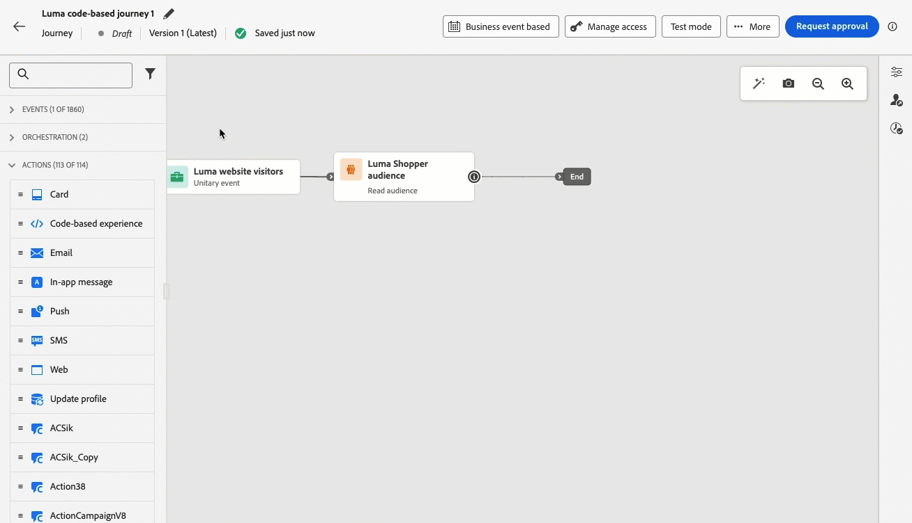
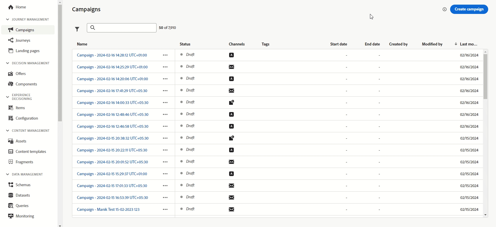

# Notas de la versión de 2024 {#release-notes-2024}

Esta página enumera todas las funciones y mejoras de [!DNL Journey Optimizer] lanzadas en 2024.

## Versión de octubre de 2024 {#24-10-rn}

**Fecha de lanzamiento**: 29-30 de octubre de 2024

### Nuevas funciones {#24-10-features}

Esta versión incorpora las nuevas funciones que se indican a continuación:

<table>
<thead>
<tr>
<th><strong>Bloqueo de contenido de correo electrónico</strong> </th>
</tr>
</thead>
<tbody>
<tr>
<td>

Journey Optimizer ahora permite bloquear contenido en plantillas de correo electrónico, ya sea bloqueando la plantilla completa o estructuras y componentes específicos. Esto le permite evitar ediciones o eliminaciones no intencionadas, lo que le proporciona un mayor control sobre la personalización de las plantillas y mejora la eficacia y fiabilidad de sus campañas de correo electrónico.

Para obtener más información, consulte la <a href="../content-management/content-locking.md">documentación detallada</a>.

Disponible desde el 24 de octubre de 2024

</td>
</tr>
</tbody>
</table>

<table>
<thead>
<tr>
<th><strong>Experiencias basadas en código en recorridos</strong> </th>
</tr>
</thead>
<tbody>
<tr>
<td>

Con el canal de experiencia basado en código, Adobe Journey Optimizer le permite realizar personalizaciones y pruebas avanzadas para cualquiera de sus propiedades de entrada, lo que permite ofrecer experiencias adaptadas en diversos puntos de contacto, como aplicaciones web, aplicaciones móviles, aplicaciones de escritorio, consolas de vídeo, servicios conectados a TV, televisores inteligentes, quioscos, cajeros automáticos, dispositivos IoT y mucho más. El canal de experiencia basado en código ya está disponible en el lienzo de recorrido.

Para obtener más información, consulte la <a href="../code-based/create-code-based.md">documentación detallada</a>.

Disponible desde el 1 de octubre de 2024

</tr>
</tbody>
</table>

<table>
<thead>
<tr>
<th><strong>Experiencias web en recorridos</strong> </th>
</tr>
</thead>
<tbody>
<tr>
<td>

Con el canal web, Adobe Journey Optimizer permite personalizar la experiencia web que ofrece a sus clientes a través de recorridos web entrantes. El canal web ahora está disponible en el lienzo de recorrido.

Para obtener más información, consulte la <a href="../web/create-web.md">documentación detallada</a>.

Disponible desde el 1 de octubre de 2024

</tr>
</tbody>
</table>

<table>
<thead>
<tr>
<th><strong>Administración de conflictos y prioridades (disponibilidad limitada)</strong> </th>
</tr>
</thead>
<tbody>
<tr>
<td>

En Journey Optimizer, la administración del volumen y la sincronización de las campañas y los recorridos tiene vital importancia, ya que reducen las interacciones para los clientes. Journey Optimizer ahora ofrece varias herramientas para la administración de conflictos y la priorización. 
Para obtener más información, consulte la <a href="../conflict-prioritization/gs-conflict-prioritization.md">documentación detallada</a>.

<ul><li><b>Restricción de frecuencia de recorrido</b>: ahora puede crear conjuntos de reglas para aplicarlos a sus recorridos, lo que le permite limitar el número de recorridos para un perfil por día, semana o mes, así como controlar el número de recorridos simultáneos que se ejecutan simultáneamente.</li>
<li><b>Puntuación de prioridad</b>: ahora puede asignar una puntuación de prioridad a una campaña o a un recorrido, de 0 a 100. Un número mayor indica una prioridad mayor. Cuando dos campañas o acciones de viaje utilicen la misma configuración de canal, Journey Optimizer seleccionará la que tenga la puntuación de prioridad más alta. Si las campañas tienen la misma puntuación, se elegirá la campaña que se haya modificado en fecha menos reciente.</li>
<li><b>Ver conflictos potenciales</b>: el nuevo botón “Ver conflictos potenciales” en recorridos y campañas ahora permite identificar la superposición con otros recorridos o campañas, como la fecha de inicio, el público de destino o la configuración del canal seleccionado.</li>
<li><b>Arbitraje de recorridos</b>: esta nueva funcionalidad le permite priorizar los recorridos más importantes para sus clientes. Puede crear una regla para suprimir la entrada en un recorrido de prioridad inferior cuando un cliente cumpla los requisitos para un próximo recorrido de prioridad superior.</li>
<li><b>Restricción de frecuencia por tipo de comunicación: </b>con los conjuntos de reglas, ahora puede establecer reglas granulares por tipo de comunicación (por ejemplo, Ventas, Promocional) para evitar sobrecargar a los clientes con mensajes similares. Puede controlar la frecuencia en varios canales, excluyendo automáticamente los perfiles saturados para garantizar una mejor experiencia del cliente.</li></ul>

Las funciones de administración de conflictos y prioridades están disponibles en Disponibilidad limitada para un grupo selecto de clientes. Tenga en cuenta que estas funciones se implementarán gradualmente para más usuarios en el futuro. Póngase en contacto con el equipo de la cuenta si está interesado en que se le añada a la lista de espera de estas funciones.

</td>
</tr>
</tbody>
</table>

<table>
<thead>
<tr>
<th><strong>Integración de Adobe Journey Optimizer y Movable Ink</strong> </th>
</tr>
</thead>
<tbody>
<tr>
<td>

Ahora puedes integrar Movable Ink Da Vinci y Adobe Journey Optimizer. Con esta actividad puedes: 

<ul><li>Aprovechar las potentes funciones del producto Da Vinci de Movable Ink para combinar y personalizar las variaciones de correo electrónico para las campañas por lotes</li>
<li>Acelerar los flujos de trabajo de los profesionales para los clientes de Journey Optimizer que utilizan Da Vinci para la creación y Adobe Journey Optimizer para la optimización y el envío</li>
<li>Optimizar los modelos Da Vinci con datos de Adobe.</li></ul>

Para obtener más información, consulte la <a href="https://movableink.com/adobe-and-movable-ink">documentación sobre Movable Ink Da Vinci</a>.

</tr>
</tbody>
</table>

Anteriormente disponibles para un conjunto de organizaciones (LA), los experimentos en recorridos ya están disponibles para todos los usuarios (GA):

<table>
<thead>
<tr>
<th><strong>Personalización de la configuración del correo electrónico (Disponibilidad general) </strong> </th>
</tr>
</thead>
<tbody>
<tr>
<td>

Para obtener una mayor flexibilidad y control sobre la configuración de correo electrónico, puede definir subdominios dinámicos y parámetros de encabezado personalizados al crear configuraciones de canal de correo electrónico.

Para obtener más información, consulte la <a href="../email/surface-personalization.md">documentación detallada</a>.

Disponible desde el 23 de octubre de 2024

</tr>
</tbody>
</table>

<table>
<thead>
<tr>
<th><strong>Aprobaciones en recorridos y campañas (Disponibilidad general)</strong> </th>
</tr>
</thead>
<tbody>
<tr>
<td>

Con las políticas de aprobación, ahora puede configurar un proceso de aprobación dentro de Journey Optimizer que permita a los equipos de marketing asegurarse de que las campañas y los recorridos sean revisados y firmados por las partes interesadas correspondientes antes de que se activen.

Para obtener más información, consulte la <a href="../test-approve/gs-approval.md">documentación detallada</a>.

Disponible desde el 22 de octubre de 2024

</td>
</tr>
</tbody>
</table>

<table>
<thead>
<tr>
<th><strong>Experimentación de contenido en recorridos (disponibilidad general)</strong> </th>
</tr>
</thead>
<tbody>
<tr>
<td>

Adobe Journey Optimizer, que ya estaba disponible en las campañas, ahora admite experimentos en los recorridos. Los experimentos son ensayos aleatorios, lo que en el contexto de las pruebas en línea significa que expone a algunos usuarios seleccionados aleatoriamente a una variación determinada de un mensaje y a otro conjunto de usuarios seleccionados aleatoriamente a otra variación o tratamiento. Después de la exposición, puede medir las métricas de resultado que le interesan, como aperturas de correos electrónicos, suscripciones o compras.

Para obtener más información, consulte la <a href="../content-management/content-experiment.md">documentación detallada</a>.

</td>
</tr>
</tbody>
</table>

<table>
<thead>
<tr>
<th><strong>Decisioning (disponibilidad general)</strong> </th>
</tr>
</thead>
<tbody>
<tr>
<td>

Decisioning, disponible anteriormente para un conjunto de organizaciones (LA) y conocida como Decisiones sobre experiencias, ya está disponible para todos los usuarios (GA), incluidas las organizaciones que han adquirido las ofertas adicionales de Adobe Healthcare Shield o Privacy and Security Shield.

Decisioning simplifica la personalización al ofrecer un catálogo centralizado de ofertas de marketing conocidas como “elementos de decisión” y un motor de decisión sofisticado. Este motor aprovecha las reglas y los criterios de clasificación para seleccionar y presentar a cada persona los elementos de decisión más relevantes. Estos elementos de decisión se integran perfectamente en una amplia gama de superficies entrantes a través del canal de experiencia basado en código.

Para obtener más información, consulte la <a href="../experience-decisioning/gs-experience-decisioning.md">documentación detallada</a>.

</td>
</tr>
</tbody>
</table>

<table>
<thead>
<tr>
<th><strong>Mensajes multilingües en recorridos y campañas (disponibilidad general)</strong> </th>
</tr>
</thead>
<tbody>
<tr>
<td>

Ahora puede crear contenido sin esfuerzo en varios idiomas dentro de una sola campaña o recorrido. Con esta función, puede cambiar entre idiomas al editar su campaña o su recorrido, lo que optimiza todo el proceso de edición y mejora su capacidad para administrar de forma eficaz el contenido multilingüe.

Para obtener más información, consulte la <a href="../content-management/multilingual-gs.md">documentación detallada</a>.

</td>
</tr>
</tbody>
</table>

<table>
<thead>
<tr>
<th><strong>Experiencia actualizada de creación de informes (disponibilidad general)</strong> </th>
</tr>
</thead>
<tbody>
<tr>
<td>

La creación de informes en Journey Optimizer ahora está disponible de manera general (GA) y cuenta con una interoperabilidad mejorada con las funciones de Customer Journey Analytics, estandarizando la creación de informes en ambas plataformas y mejorando la coherencia y fiabilidad de los datos. Esta integración perfecta entre Journey Optimizer y Customer Journey Analytics proporciona una visión más clara de las métricas de rendimiento, lo que permite a los usuarios tomar decisiones más informadas.

Con la disponibilidad general, se introducen cuatro nuevas funciones: la posibilidad de crear métricas sencillas, crear y publicar públicos, hacer preguntas específicas mediante Insight Builder y programar informes para que se envíen automáticamente por correo electrónico a los destinatarios clave.

Para obtener más información, consulte la <a href="../reports/report-cja-manage.md">documentación detallada</a>.

Importante: la experiencia actual de creación de informes se retirará a partir de enero de 2025. Después de esta fecha, la nueva experiencia de creación de informes pasará a ser el estándar. Le recomendamos que se familiarice con las nuevas características y funcionalidades para garantizar una transición sin problemas. <a href="../reports/report-gs-cja.md">Aprenda a empezar con la nueva interfaz de creación de informes de Journey Optimizer</a>

Disponible desde el 16 de octubre de 2024

</tr>
</tbody>
</table>

<!--The following capabilities are available to all customers in public beta:-->

<table>
<thead>
<tr>
<th><strong>Prueba del contenido con datos de entrada de muestra (Beta)</strong> </th>
</tr>
</thead>
<tbody>
<tr>
<td>

Journey Optimizer ahora le permite probar diferentes variantes del contenido previsualizándolo y enviando pruebas por correo electrónico utilizando datos de entrada de muestra cargados desde un archivo o añadidos manualmente. El sistema detecta automáticamente todos los atributos de perfiles utilizados en el contenido para la personalización y los puede utilizar en las pruebas para crear varias variantes.

Actualmente, todos los clientes tienen esta posibilidad disponible como una versión Beta pública, para los canales de correo electrónico, SMS y notificaciones push.

Para obtener más información, consulte la <a href="../test-approve/simulate-sample-input.md">documentación detallada</a>.

</td>
</tr>
</tbody>
</table>

<table>
<thead>
<tr>
<th><strong>Uso de datos de Adobe Experience Platform para la personalización (Beta)</strong> </th>
</tr>
</thead>
<tbody>
<tr>
<td>

Aproveche los datos de Adobe Experience Platform en el editor de personalización para personalizar su contenido. Para ello, los conjuntos de datos necesarios para la personalización de la búsqueda deben habilitarse primero mediante una llamada de la API. Cuando haya terminado, puede usar sus datos para personalizar su contenido en [!DNL Journey Optimizer].

Esta funcionalidad está actualmente disponible para todos los clientes como beta pública.

Para obtener más información, consulte la <a href="../personalization/lookup-aep-data.md">documentación detallada</a>.

</td>
</tr>
</tbody>
</table>

### Mejoras {#24-10-improvements}

Esta versión incorpora las mejoras que se enumeran a continuación.

**Canal de SMS**

* Ahora puede editar o eliminar una configuración de canal de API por SMS. [Más información](../sms/sms-configuration.md)

* Se han introducido las siguientes mejoras para optimizar las funciones de mensajería SMS con Infobip y Sinch:

   * Puede definir y administrar palabras clave únicas para sus campañas y recorridos de SMS, lo que permite una comunicación más personalizada y eficaz.

   * Puede crear y enviar un mensaje SMS predeterminado cuando no se reconozca una palabra clave.

  Obtenga más información sobre estas mejoras en la documentación de configuración de SMS para [Infobip](../sms/sms-configuration-infobip.md) y [Sinch](../sms/sms-configuration-sinch.md).

<!--**Journeys**-->

<!--* **Path experiment in journeys** - With the journey path experiment, you can now define and track key metrics for your journey paths, allowing you to measure the impact of your activities and to provide clearer insights into your performance. -->

<!--* **Max number of Live journeys** - Journey Optimizer now has a guardrail of 500 live journeys on production sandboxes, instead of 100. The number of live journeys is visible in the journey canvas. (DOCAC-10977) -->

**Canal web**

* **Modo de edición no visual para el diseñador web**: como alternativa al diseñador web de Journey Optimizer, ahora puede añadir modificaciones al sitio web mediante un editor no visual. Le permite introducir los cambios manualmente sin abrir las páginas en el editor visual. Este modo de edición no visual resulta útil si no puede instalar extensiones de explorador como el asistente visual de Adobe Experience Cloud, necesario para cargar las páginas en el diseñador web. [Más información](../web/web-non-visual-editor.md)

**Conjuntos de datos**

* **Enviar y abrir eventos**: a partir del 1 de noviembre de 2024, la segmentación de streaming ya no admitirá el uso de eventos de envío y apertura de conjuntos de datos de seguimiento y comentarios de Journey Optimizer. Este cambio se aplicará a todas las zonas protegidas y organizaciones de clientes. [Más información](../data/datasets-ttl.md#segmentation-update)

* **Tiempo de vida del conjunto de datos (TTL)**: a partir de febrero de 2025, se implementará una protección de tiempo de vida (TTL) en los conjuntos de datos generados por el sistema de Journey Optimizer en las nuevas zona protegidas y organizaciones de la siguiente manera:

   * 90 días para los datos en el almacén de perfiles
   * 13 meses para los datos en el lago de datos

  Este cambio se implementará en las zonas protegidas de clientes existentes en una fase posterior. [Más información](../data/datasets-ttl.md#ttl)

* **Parámetros en acciones personalizadas**: fecha de disponibilidad: 3 de octubre de 2024. Ahora se admiten parámetros NULL y opcionales en las acciones personalizadas. [Más información](../action/about-custom-action-configuration.md#define-the-message-parameters)

**Creación de informes**

* Ya está disponible la **creación de informes de Decisioning**, que ofrece información esencial sobre cómo los visitantes interactúan con las experiencias. [Más información](../reports/campaign-global-report-cja-code.md#decisioning-kpis)

**Gobernanza de datos y políticas de consentimiento**: fecha de disponibilidad: 7 de octubre de 2024

* La aplicación de las **políticas de gobernanza de datos** ahora se aplica en todos los canales de Journey Optimizer. Para los clientes que han creado políticas en Adobe Experience Platform, estas se aplican a las acciones de marketing como parte de la configuración de canales. Al crear contenido con una configuración, el sistema comprueba todos los campos de personalización para detectar cualquier infracción de la gobernanza de datos. Si se encuentra una infracción, no será posible publicar un recorrido o una campaña. [Más información](../action/action-privacy.md)

* Las **políticas de consentimiento personalizado** ahora se aplican a todos los canales de Journey Optimizer. Al aplicar la ley antes de enviar un mensaje o de entregar una experiencia entrante, el sistema comprueba que el usuario haya dado su consentimiento para utilizar campos de personalización en el contenido que va a recibir. Si no se da ningún consentimiento, la experiencia no se muestra. [Más información](../action/consent.md)

  >[!NOTE]
  >
  >Actualmente, las políticas de consentimiento solo están disponibles para las organizaciones que han adquirido las ofertas sobre el programa **Healthcare Shield** y el programa **Privacy and Security Shield**.

**Públicos**: fecha de disponibilidad: 8 de octubre de 2024

* Al segmentar el público de un archivo CSV, ahora puede utilizar atributos del archivo en el editor de personalización y en el generador de reglas de recorridos y campañas. [Más información](../audience/about-audiences.md)

* El uso de públicos y atributos de cargas personalizadas (archivos CSV) no está disponible en la actualidad para su uso con el programa Healthcare Shield ni Privacy and Security Shield.

**Configuración** - Fecha de disponibilidad: 23 de octubre de 2024

* Al utilizar una configuración personalizada en una campaña o un recorrido, ahora puedes obtener una vista previa del contenido del correo electrónico para comprobar posibles errores con la configuración dinámica definida. [Más información](../email/surface-personalization.md#check-configuration)

**Canal basado en código**

* Ya están disponibles las plantillas de contenido. Puede acelerar la creación de experiencias basadas en código a partir de una plantilla de contenido creada por los desarrolladores. El uso de una plantilla de contenido permitirá al experto en marketing modificar tan solo algunos valores o campos, en lugar de crear todo el HTML o la carga útil de contenido JSON. [Más información](../content-management/content-templates.md)

**Decisioning**

* Los usuarios de [Adobe Customer Journey Analytics](https://experienceleague.adobe.com/docs/analytics-platform/using/cja-overview/cja-overview.html?lang=es) ahora pueden elegir modelos personalizados para optimizarlos al configurar un modelo de IA en Decisioning (anteriormente conocido como Decisiones sobre experiencias). Esto le permite, por ejemplo, optimizar en una tabla de “compras” personalizada en lugar de restricciones definidas como la tasa de clics. [Más información](../experience-decisioning/ranking.md)

* Al añadir una política de decisión a una campaña basada en código con Decisioning, ahora puede seleccionar manualmente elementos de decisión únicos, además de las estrategias de selección. Además, ahora puede seleccionar más de una oferta de reserva. Esto garantiza que se devuelva un determinado número de elementos de decisión. [Más información](../experience-decisioning/create-decision.md)

## Versión de septiembre de 2024 {#24-9-rn}

<!--
>[!CAUTION]
>
>**Early release notes below are subject to change without prior notice until the release date**. Links, screens and updated documentation are published at the release date.
>
-->

**Fecha de la versión**: 24-26 de septiembre de 2024

### Nuevas funciones {#24-9-features}

Esta versión incorpora las nuevas funciones que se indican a continuación.

<table>
<thead>
<tr>
<th><strong>Tarjetas de contenido para aplicaciones móviles y sitios web</strong> </th>
</tr>
</thead>
<tbody>
<tr>
<td>

Las tarjetas de contenido son una nueva función de mensajería digital de Adobe Journey Optimizer que ofrece contenido personalizado y atractivo directamente en aplicaciones móviles y sitios web. A diferencia de las notificaciones push tradicionales, las tarjetas de contenido se integran perfectamente en la interfaz de usuario y ofrecen actualizaciones persistentes y no intrusivas que mejoran la interacción y experiencia del usuario.

Esta función permite a los especialistas en marketing presentar a los usuarios contenido con medios enriquecidos y relevantes, para aumentar la participación y garantizar que se vean mensajes importantes sin distraer al usuario del recorrido.

Para obtener más información, consulte la <a href="../content-card/get-started-content-card.md">documentación detallada</a>.

</td>
</tr>
</tbody>
</table>

<table>
<thead>
<tr>
<th><strong>Aprobaciones en recorridos y campañas (LA)</strong> </th>
</tr>
</thead>
<tbody>
<tr>
<td>

Con las políticas de aprobación, ahora puede configurar un proceso de aprobación dentro de Journey Optimizer que permita a los equipos de marketing asegurarse de que las campañas y los recorridos sean revisados y firmados por las partes interesadas correspondientes antes de que se activen.

Ahora mismo, las políticas de aprobación solo están disponibles para un conjunto de organizaciones (disponibilidad limitada). Para obtener acceso, póngase en contacto con su representante de Adobe.

Para obtener más información, consulte la <a href="../test-approve/gs-approval.md">documentación detallada</a>.

</td>
</tr>
</tbody>
</table>

<!--<table>
<thead>
<tr>
<th><strong>Email Content Locking</strong> </th>
</tr>
</thead>
<tbody>
<tr>
<td>

Journey Optimizer now allows you to lock content in email templates, either by locking the entire template or specific structures and component. This allows you to prevent unintentional edits or deletions, giving you greater control over template customization, and improving the efficiency and reliability of your email campaigns.

For more information, refer to the <a href="../content-management/gs-generative.md">detailed documentation</a>.

</td>
</tr>
</tbody>
</table>-->

<table>
<thead>
<tr>
<th><strong>Criterios de salida globales en los recorridos</strong> </th>
</tr>
</thead>
<tbody>
<tr>
<td>

Ahora puede definir los criterios de salida en el nivel de recorrido. Al añadir criterios de salida, hace que los perfiles salgan del recorrido en cuanto se produce un evento (p. ej.: compra) o cumplen los requisitos para un público. Esto evitará que el usuario reciba más comunicaciones del recorrido.

Para obtener más información, consulte la <a href="../building-journeys/journey-properties.md#exit-criteria">documentación detallada</a>.

</td>
</tr>
</tbody>
</table>

<table>
<thead>
<tr>
<th><strong>Asistente de IA</strong> </th>
</tr>
</thead>
<tbody>
<tr>
<td>

Cuando haya creado y personalizado el mensaje, lleve el contenido al siguiente nivel con el Asistente de IA de Journey Optimizer. Ahora puede utilizar el Asistente de IA para optimizar el impacto de su mensaje experimentando con diferentes títulos e imágenes principales. Cada variante se gestiona como un tratamiento único para medir y comparar qué título genera más clics de forma efectiva.

Láncese a una experiencia práctica inmersiva con <a href="https://experienceleague.adobe.com/es/apps/journey-optimizer/ai-assistant-content-accelerator">nuestra vista previa en directo</a>, diseñada para permitirle explorar sus funciones en primera persona y comprender plenamente sus capacidades.</a>

Para obtener más información, consulte la <a href="../content-management/gs-generative.md">documentación detallada</a>.

Fecha de disponibilidad: 12 de septiembre de 2024

</td>
</tr>
</tbody>
</table>

<table>
<thead>
<tr>
<th><strong>Configuración de canales guiada</strong> </th>
</tr>
</thead>
<tbody>
<tr>
<td>

La configuración de canales guiada le permite automatizar y validar la configuración del canal en una experiencia unificada, lo que acelera el proceso de introducción a Journey Optimizer. Esta nueva configuración guiada optimiza la configuración de canal rápida, lo que garantiza que todos los recursos necesarios se instalen y funcionen fácilmente en Experience Platform, Journey Optimizer y recopilación de datos. Esto permite a los equipos de marketing, productos e ingeniería de datos empezar rápidamente en la creación de campañas y recorridos.

Para obtener más información, consulte la <a href="../configuration/set-mobile-config.md">documentación detallada</a>.

Fecha de disponibilidad: 3 de septiembre de 2024

 
</td>
</tr>
</tbody>
</table>

### Mejoras {#24-9-improvements}

Esta versión incorpora las mejoras que se enumeran a continuación.

**Públicos**: fecha de disponibilidad: 17 de septiembre de 2024

**Uso de licencias**: el panel Uso de licencias ahora muestra perfiles interesados, en lugar de públicos interesados. [Más información](../audience/license-usage.md)

**Administración de contenido**

Ahora puede exportar plantillas de contenido y fragmentos entre zonas protegidas. [Más información](../configuration/copy-objects-to-sandbox.md)

**Recorridos**

* **Mejoras en la creación de informes en directo**: la creación de informes en directo proporciona información sobre el rendimiento de sus recorridos en las últimas 24 horas. La hemos mejorado añadiendo nuevas métricas (perfiles de entrada, salida y descartados y perfiles erróneos), lo que le permite comprender mejor el comportamiento y el rendimiento del usuario directamente desde el lienzo de recorrido. [Más información](../building-journeys/report-journey.md)

* (Fecha de disponibilidad: 10 de septiembre) **Reintentos automáticos de Leer público**: los reintentos ahora se aplican de forma predeterminada a los recorridos activados por públicos (empezando con una actividad **Leer público** o **Evento empresarial**) cuando se recupera el trabajo de exportación. Si se produce un error durante la creación del trabajo de exportación, se realizarán reintentos cada 10 minutos, hasta un máximo de 1 hora. Después de esto, se considerará como un error. Por lo tanto, estos tipos de recorridos se pueden ejecutar hasta una hora después de la hora programada. [Más información](../building-journeys/read-audience.md#retries)

**Canal de correo electrónico**

* **Encabezado de mensaje en el correo electrónico enviado y copia CCO**: se ha añadido un nuevo encabezado a todos los mensajes de correo electrónico. El valor de este encabezado es único para cada correo electrónico enviado y para su copia de correo electrónico CCO correspondiente. Este encabezado también se almacena en los conjuntos de datos del mensaje y en los comentarios CCO, lo que permite reconciliar la copia CCO y la información de correo electrónico enviado correspondiente. [Más información](../configuration/archiving-support.md#bcc-header)

* **Puntuación de correo no deseado** (GA): ahora puede comprobar la puntuación de correo no deseado de su contenido en un **informe específico**. Utilizando SpamAssassin, Adobe Journey Optimizer ahora puede probar el contenido de su correo electrónico y darle una puntuación para indicar si los ISP o los proveedores de buzones lo considerarán correo no deseado o no. [Más información](../content-management/spam-report.md)

**Canal de SMS**

* **Editar credenciales de API**: ahora puede editar la configuración en las credenciales de API de SMS, incluidas las actualizaciones de las palabras clave de inclusión/exclusión y las respuestas.

**API**

* **API de simulación de campaña**: use esta API para activar el trabajo de prueba de una campaña. El envío de la prueba de una campaña es un proceso asincrónico, la API devuelve un proofJobId que se puede utilizar para comprobar el estado de la prueba. [Más información](https://developer.adobe.com/journey-optimizer-apis/references/simulations/){target="_blank"}

* (Fecha de disponibilidad: 10 de septiembre) La [documentación de la API de Adobe Journey Optimizer](https://developer.adobe.com/journey-optimizer-apis/references/simulations/){target="_blank"} ahora es interactiva. Explore los extremos de la API directamente desde las páginas de documentación para obtener comentarios inmediatos y acelerar la implementación técnica. 

  Todas las páginas de referencia de la API ahora tienen una funcionalidad **Probar** que puede usar para probar las llamadas de la API directamente en la página del sitio web de documentación. [Obtenga las credenciales de autenticación requeridas](https://developer.adobe.com/journey-optimizer-apis/references/authentication/){target="_blank"} y empiece a usar la funcionalidad para explorar los puntos finales de API.

  Utilice esta nueva funcionalidad para explorar las solicitudes y las respuestas de los extremos de la API, obtener comentarios inmediatos y acelerar la implementación técnica. 

  >[!CAUTION]
  >
  >Tenga en cuenta que, al utilizar la funcionalidad de API interactiva en las páginas de documentación, está realizando llamadas de API reales a los puntos finales. Tenga esto en cuenta al experimentar con zonas protegidas de producción.

Configuración de ****

* **Planes de calentamiento de IP**: esta capacidad ya está disponible para todos los clientes, incluidas las organizaciones que han adquirido las ofertas complementarias **Healthcare Shield** o **Privacy and Security Shield** de Adobe. [Más información](../configuration/ip-warmup-gs.md)

<!--
 Sign up for the [Adobe Journey Optimizer quarterly newsletter](https://www.adobe.com/subscription/Adobe_Journey_Optimizer_NL.html){target="_blank"} today, and receive the latest product updates, exciting stories, use cases, tips and more delivered directly to your inbox every quarter.-->

## Versión de agosto de 2024 {#8-2024}

**Fecha de lanzamiento**: 20-21 de agosto de 2024

### Nuevas funciones {#8-features}

Esta versión incorpora las nuevas funciones que se indican a continuación.

<!--
<table>
<thead>
<tr>
<th><strong>Content Cards (Limited Availability)</strong> </th>
</tr>
</thead>
<tbody>
<tr>
<td>

Content cards are a new digital messaging feature in Adobe Journey Optimizer that delivers personalized and engaging content directly within mobile apps and websites. Unlike traditional push notifications, Content Cards integrate seamlessly into the user interface, offering persistent, non-intrusive updates that enhance user interaction and experience.

This feature enables marketers to present relevant, rich media content to users, driving higher engagement and ensuring important messages are seen without disrupting the user journey.

 

Content card are currently only available for a set of organizations (Limited Availability). To gain access, contact your Adobe representative.

</td>
</tr>
</tbody>
</table-->

<table>
<thead>
<tr>
<th><strong>Configuraciones de canal mejoradas</strong> </th>
</tr>
</thead>
<tbody>
<tr>
<td>

Las funciones actuales de superficie de canal se han mejorado para lograr un enfoque coherente en todos los canales. Ahora puede definir, administrar y reutilizar estas configuraciones para cualquiera de sus canales, incluidos la web, la mensajería en la aplicación o la experiencia basada en código.

<ul>
<li>Se ha cambiado el nombre de las superficies de canal a <strong>Configuraciones de canal</strong></li>
<li>Puede adjuntar una o varias acciones de marketing para aplicar políticas de consentimiento y gobernanza de datos</li>
<li>El control de acceso a nivel de objeto (OLAC) ya está disponible para cada configuración de canal, lo que le permite decidir cuál de sus usuarios puede crear o utilizar configuraciones específicas</li>
<li>Para algunos canales, puede crear configuraciones de canal dirigidas a varias plataformas. Un ejemplo sería una configuración de canal de mensajería en la aplicación que pueda dirigirse a una página web, una aplicación de iOS y a una aplicación de Android.</li>
</ul>

Para obtener más información, consulte la <a href="../configuration/channel-surfaces.md">documentación detallada</a>.

</td>
</tr>
</tbody>
</table>

<table>
<thead>
<tr>
<th><strong>Acción personalizada de Marketo Engage</strong> </th>
</tr>
</thead>
<tbody>
<tr>
<td>

Ahora puede integrar Adobe Journey Optimizer con Adobe Marketo Engage para crear sus casos de uso B2B. Desde un recorrido, una nueva acción personalizada le permite introducir datos en Marketo.

Para obtener más información, consulte la <a href="../action/marketo-engage.md">documentación detallada</a>.

</td>
</tr>
</tbody>
</table>

<table>
<thead>
<tr>
<th><strong>Variables en fragmentos de contenido</strong> </th>
</tr>
</thead>
<tbody>
<tr>
<td>

Las variables globales de fragmentos realzan la funcionalidad de fragmentos existente para mejorar la eficacia en los casos de uso de scripts y reutilización de contenido. Los fragmentos ahora pueden utilizar variables de entrada y crear variables de salida utilizables en el contenido de campaña y recorrido. Los fragmentos ahora pueden consumir variables de entrada, tanto en <a href="../personalization/use-expression-fragments.md">fragmentos de expresión</a> como en <a href="../email/use-visual-fragments.md">fragmentos visuales</a>. Se pueden utilizar esas variables para personalizar el contenido y los parámetros de los mensajes, en sus campañas y recorridos.

Para obtener más información, consulte la <a href="../personalization/use-expression-fragments.md">documentación detallada</a>.

</td>
</tr>
</tbody>
</table>

<table>
<thead>
<tr>
<th><strong>Flujo de trabajo de calentamiento de IP</strong> </th>
</tr>
</thead>
<tbody>
<tr>
<td>

Fecha de disponibilidad: 13 de agosto

Si envía un correo electrónico a una dirección de IP completamente nueva, ahora puede ejecutar fácilmente los flujos de trabajo de calentamiento de IP directamente desde la interfaz de usuario. Adobe Journey Optimizer ofrece una forma estandarizada y eficaz de añadir las direcciones IP que siguen las prácticas recomendadas para lograr una entrega óptima.

Para obtener más información, consulte la <a href="../configuration/ip-warmup-gs.md">documentación detallada</a>.

</td>
</tr>
</tbody>
</table>

### Mejoras {#8-improvements}

Esta versión incorpora las mejoras que se enumeran a continuación.

**Recorridos**

* En la actividad **Condición**, de forma predeterminada, la **[!UICONTROL condición Tiempo]** se establece ahora por hora, de 00:00 a 12:00. [Más información](../building-journeys/condition-activity.md#time_condition)
* Al crear los recorridos, las alertas se muestran ahora en el botón **Alertas** para alinearse con otras alertas y ofrecer una experiencia de usuario coherente. [Más información](../building-journeys/troubleshooting.md#checking-for-errors-before-testing)
* Se han mejorado las opciones de zoom en la barra de herramientas del recorrido. El porcentaje del zoom ahora es visible y se puede restablecer su valor más fácilmente.

**Canal push**

* Ahora puede añadir las credenciales push de la aplicación móvil en los ajustes de configuración del canal de Adobe Journey Optimizer. Ya no es necesario crear una superficie de aplicación en la recopilación de datos de Adobe Experience Platform.

### Otros cambios {#changes}

**Creación de informes**

* Se han añadido nuevos casos de uso a la nueva experiencia de creación de informes:

   * Cree métricas calculadas personalizadas directamente en los informes.
   * Cree un público a partir de los datos de creación del informe.
   * Use la herramienta de análisis exploratorio para crear fácilmente tablas y visualizaciones a partir de las **[!UICONTROL Dimensiones]** y las **[!UICONTROL Métricas]** que haya seleccionado.

  Para obtener más información, consulte la [documentación detallada](../reports/report-cja-manage.md).

## Versión de julio de 2024 {#24-7-2024}

**Fecha de la versión**: 30-31 de julio de 2024

### Nuevas funciones {#27-4-features}

Esta versión incorpora las nuevas funciones que se enumeran a continuación.

<table>
<thead>
<tr>
<th><strong>Canal de SMS con cualquier proveedor (Beta)</strong> </th>
</tr>
</thead>
<tbody>
<tr>
<td>

Ahora puede configurar proveedores de SMS adicionales en Journey Optimizer, además de los proveedores predeterminados Sinch, Infobip y Twilio.

Para obtener más información, consulte la <a href="../sms/sms-configuration-custom.md">documentación detallada</a>.

</td>
</tr>
</tbody>
</table>

<table>
<thead>
<tr>
<th><strong>Composición de público federado (disponibilidad limitada)</strong> </th>
</tr>
</thead>
<tbody>
<tr>
<td>

La composición de público federado ya está disponible en Adobe Journey Optimizer. Permite a las empresas componer datos para una mejor utilización en varios casos de uso. Con este nuevo enfoque, como usuario de Adobe Real-time Customer Data Platform y/o Adobe Journey Optimizer, puede federar conjuntos de datos directamente desde su almacén de datos existente para generar y enriquecer públicos y atributos de Adobe Experience Platform en un solo sistema.

Para obtener más información, consulte la <a href="https://experienceleague.adobe.com/es/docs/federated-audience-composition/using/home"  target="_blank">documentación detallada</a>.

</td>
</tr>
</tbody>
</table>

### Mejoras {#27-4-improvements}

Esta versión incorpora las mejoras que se enumeran a continuación.

**Recorridos**

* (Fecha de disponibilidad: 8 de julio) **Editor de expresiones avanzadas de la configuración de eventos del recorrido**: ahora puede aprovechar el editor de expresiones avanzadas mientras configura un evento, lo que le permite definir expresiones más complejas o utilizar funciones en la condición de ID de evento. [Más información](../event/about-creating.md#adv-exp-editor)

## Versión de junio de 2024 {#24-6-2024}

**Fecha de lanzamiento**: 18 y 19 de junio de 2024

### Nuevas funciones {#june-24-features}

Esta versión incorpora las nuevas funciones que se indican a continuación.

<table>
<thead>
<tr>
<th><strong>Personalización de fragmentos de contenido</strong> </th>
</tr>
</thead>
<tbody>
<tr>
<td>

Ahora puede definir campos específicos en un fragmento que se pueden editar cuando el fragmento se añade a una campaña o un recorrido. Esto permite ajustar las partes de contenido en el momento de su uso, lo que ofrece flexibilidad para anular los valores predeterminados con detalles específicos del contexto.

Para obtener más información, consulte la <a href="../content-management/customizable-fragments.md">documentación detallada</a>.

</td>
</tr>
</tbody>
</table>

<table>
<thead>
<tr>
<th><strong>Creación de informes con Customer Journey Analytics (disponibilidad limitada)</strong> </th>
</tr>
</thead>
<tbody>
<tr>
<td>

La creación de informes en Journey Optimizer cuenta con una interoperabilidad mejorada con las funciones de Customer Journey Analytics, estandariza la creación de informes en ambas plataformas y mejora la coherencia y fiabilidad de los datos. Esta integración perfecta entre Journey Optimizer y Customer Journey Analytics proporciona una visión más clara de las métricas de rendimiento, lo que permite a los usuarios tomar decisiones más informadas.

Para obtener más información, consulte la <a href="../reports/report-gs-cja.md">documentación detallada</a>.

</td>
</tr>
</tbody>
</table>

<table>
<thead>
<tr>
<th><strong>Asistente de IA de Adobe Journey Optimizer</strong> </th>
</tr>
</thead>
<tbody>
<tr>
<td>

El asistente de IA es una función de la interfaz de usuario que se puede utilizar para navegar, comprender los conceptos de Adobe y obtener perspectivas operativas de su entorno específico. Está disponible en varios productos de Adobe Experience Cloud, incluido Adobe Journey Optimizer.

Para obtener más información, consulte la <a href="../start/ai-assistant.md">documentación detallada</a>.

</td>
</tr>
</tbody>
</table>

<table>
<thead>
<tr>
<th><strong>Mensajes multilingües en recorridos y campañas (disponibilidad limitada)</strong> </th>
</tr>
</thead>
<tbody>
<tr>
<td>

Ahora puede crear contenido sin esfuerzo en varios idiomas dentro de una sola campaña o recorrido. Con esta función, puede cambiar entre idiomas al editar su campaña o su recorrido, lo que optimiza todo el proceso de edición y mejora su capacidad para administrar de forma eficaz el contenido multilingüe.

Ahora mismo, el contenido multilingüe solo está disponible para un conjunto de organizaciones (disponibilidad limitada). Para obtener acceso, póngase en contacto con su representante de Adobe.

</td>
</tr>
</tbody>
</table>

<table>
<thead>
<tr>
<th><strong>Experimentación en los recorridos (disponibilidad limitada)</strong> </th>
</tr>
</thead>
<tbody>
<tr>
<td>

Adobe Journey Optimizer, que ya estaba disponible en las campañas, ahora admite experimentos en los recorridos. Los experimentos son ensayos aleatorios, lo que en el contexto de las pruebas en línea significa que expone a algunos usuarios seleccionados aleatoriamente a una variación determinada de un mensaje y a otro conjunto de usuarios seleccionados aleatoriamente a otra variación o tratamiento. Después de la exposición, puede medir las métricas de resultado que le interesan, como aperturas de correos electrónicos, suscripciones o compras.

La experimentación en los recorridos solo está disponible para un conjunto de organizaciones (disponibilidad limitada). Para obtener acceso, póngase en contacto con su representante de Adobe.

</td>
</tr>
</tbody>
</table>

<!--table>
<thead>
<tr>
<th><strong>Extended personalization data - Beta</strong> </th>
</tr>
</thead>
<tbody>
<tr>
<td>

You can now lookup and fetch data values within Adobe Experience Platform datasets, and use these values to build conditions in Adobe Journey Optimizer. You can leverage data from a lookup dataset when a relationship has been defined using an attribute inside of an array of objects. You can specify non-profile enabled datasets for lookup. Once enabled, you can use a profile attribute as a join key to the specified dataset to retrive further data for personalization.

This capability is currently available as a public beta.

</td>
</tr>
</tbody>
</table-->

### Mejoras {#june24-improvements}

Esta versión incorpora las mejoras que se enumeran a continuación.

#### Gestión de decisiones

* **Compatibilidad con varias reglas de gestión de decisiones**: ahora puede añadir hasta 10 reglas límite para una oferta determinada de Gestión de decisiones. Esto le permite aumentar el nivel de control sobre la forma en que se envían las ofertas. [Más información](../offers/offer-library/add-constraints.md#capping)

<!--* **Audits** - The **Change log** tab allowing you to see all the changes that have been made to an offer or a decision has been removed. Changes related to offers and decisions can now be seen in the **Audits** menu. -->

#### Fragmentos de contenido

>[!AVAILABILITY]
>
>Tenga en cuenta que estas mejoras se implementarán gradualmente durante varios días después del lanzamiento inicial. Aunque algunos usuarios tendrán acceso inmediato, otros pueden experimentar un retraso antes de que esté disponible en sus cuentas.

* Ahora, los fragmentos se pueden editar y los cambios se pueden propagar a todos los recorridos activos y campañas en las que se utilicen.
* Se han introducido nuevos estados para los fragmentos de contenido: **Borrador**, **Activo**, **Publicación** y **Archivado**.
* Para utilizar un fragmento de un recorrido o una campaña, ahora debe tener el estado **Activo**. Se ha añadido un nuevo paso al proceso de creación de fragmentos, que permite publicar el fragmento y se puede utilizar en recorridos y campañas. Tenga en cuenta que la publicación de fragmentos requiere un nuevo permiso.

  **PRECAUCIÓN**: puesto que los estados **Borrador** y **Activo** se han incorporado con la versión de junio de Journey Optimizer, el estado de todos los fragmentos creados antes de esta versión es **Borrador**, incluso si se utilizan en un recorrido o una campaña. Si realiza algún cambio en estos fragmentos, debe [publicarlos](../content-management/create-fragments.md#publish) para que tengan el estado “Activo” y propagarlos a las campañas y recorridos asociados. También debe crear una nueva versión del recorrido/campaña y publicarla. 

Obtenga más información en la documentación de [fragmento de contenido](../content-management/fragments.md).

#### Recorridos

* El tiempo de espera global de los Recorridos se ha ampliado a 91 días. [Más información](../building-journeys/journey-properties.md#global_timeout)

  Cualquier nuevo recorrido creado tendrá reflejado este nuevo tiempo de espera. Consulte esta sección [Sección de preguntas frecuentes](../building-journeys/journey-properties.md#timeout-faq) para obtener más información. Tenga en cuenta que estos cambios se implementarán gradualmente durante el mes de junio.

* Adobe Journey Optimizer ahora admite solicitudes de eliminación/acceso de privacidad, así como solicitudes de administración del ciclo de vida de datos. [Más información](../privacy/requests.md)
* Ahora puede cambiar el tamaño de las columnas en el inventario de recorridos.
  <!--* **Advanced expression editor in Event configuration** is now GA - You can now leverage the advanced expression editor while configuring an event, allowing you to define more complex expressions or use functions in the event id condition. This capability is released in Limited Availability for selected customers. [Read more](../event/about-creating.md)-->
* Las **políticas de combinación** ahora son de disponibilidad general (GA): las políticas de combinación que Journey utiliza ahora son visibles y homogéneas en todo el recorrido. [Más información](../building-journeys/journey-properties.md#merge-policies)

#### Campañas

* Al crear una campaña en Adobe Journey Optimizer, ahora puede elegir el tipo de campaña (programada o activada) en un nuevo modal. [Más información](../campaigns/create-campaign.md)

#### Canal de correo electrónico

* **Habilitar cancelación de suscripción a lista**: después de los recientes anuncios de Gmail y Yahoo para remitentes masivos, Journey Optimizer admite la opción de Habilitar cancelación de suscripción a lista “después de 1 clic”. Consulte las siguientes páginas: [Administrar la exclusión de correo electrónico](../email/email-opt-out.md#unsubscribe-header) y [Configuración de correo electrónico](../email/email-settings.md#list-unsubscribe).

  **NOTA**: Para cualquier superficie de canal nueva, de forma predeterminada, se activa la opción de encabezado de cancelación de suscripción a lista. Para las superficies existentes, de forma predeterminada, la opción de URL de cancelación de suscripción con un clic en la configuración de la superficie de canal no está marcada. Si anteriormente utilizaba una URL de exclusión con un clic en el cuerpo del correo electrónico, esta configuración sigue siendo válida. Si la opción de URL de cancelación de suscripción con un clic está marcada en la configuración de la superficie de canal, Adobe Journey Optimizer utilizará la URL de cancelación de suscripción con un clic generada de forma predeterminada en la configuración de la superficie de canal.

#### Canal de SMS

* Ahora puede añadir códigos cortos únicos para cada zona protegida con una sola configuración de API, lo que hace que el proceso sea más eficiente y optimizado. [Más información](../sms/sms-configuration.md)

* Después de la creación, el campo **Token de API** en la página **Detalles de credenciales de API** está ahora enmascarada.

<!--* You can now modify existing SMS configurations.-->

#### Canal en la aplicación

<!--* **Expression fragment** - Expression fragments are now available for the **In-app channel**. [Read more](../personalization/use-expression-fragments.md)-->

* Ahora puede utilizar el complemento Edge Delivery para obtener la información necesaria para comprender y solucionar problemas de las implementaciones entrantes. [Más información sobre la vista de Edge Delivery](https://experienceleague.adobe.com/es/docs/experience-platform/assurance/view/edge-delivery){target="_blank"}.

#### Canal de correo directo

* El canal de correo directo ya está disponible para todos los clientes. [Más información](../direct-mail/get-started-direct-mail.md)

## Versión de mayo de 2024 {#may-2024}

**Fecha de la versión**: 21-22 de mayo de 2024

### Nuevas funciones {#e-features}

Esta versión incorpora las nuevas funciones que se indican a continuación.

<table>
<thead>
<tr>
<th><strong>Toma de decisiones sobre experiencias: disponibilidad limitada</strong> </th>
</tr>
</thead>
<tbody>
<tr>
<td>

La toma de decisiones sobre experiencias simplifica la personalización al ofrecer un catálogo centralizado de ofertas de marketing conocidas como “elementos de decisión” y un motor de decisión sofisticado. Este motor aprovecha las reglas y los criterios de clasificación para seleccionar y presentar a cada persona los elementos de decisión más relevantes.

Estos elementos de decisión se integran perfectamente en una amplia gama de configuraciones entrantes a través del nuevo canal de experiencia basado en código, ahora accesible dentro de las campañas de Journey Optimizer. Las políticas de decisión respecto a la toma de decisiones sobre experiencias solo se pueden utilizar en campañas de experiencias basadas en código.

Ahora mismo, la toma de decisiones sobre experiencias solo está disponible para un conjunto de organizaciones (disponibilidad limitada). Para obtener acceso, póngase en contacto con su representante de Adobe.

Para obtener más información, consulte la <a href="../experience-decisioning/gs-experience-decisioning.md">documentación detallada</a>.

</td>
</tr>
</tbody>
</table>

<table>
<thead>
<tr>
<th><strong>Personalización de la superficie de configuración de correo electrónico: disponibilidad limitada</strong> </th>
</tr>
</thead>
<tbody>
<tr>
<td>

Ahora puede definir subdominios dinámicos y parámetros de encabezado personalizados al crear configuraciones de canal de correo electrónico para disponer de mayor flexibilidad y control sobre la configuración del correo electrónico.

En la actualidad, la personalización de la configuración de correo electrónico solo está disponible para un conjunto de organizaciones (disponibilidad limitada). Para obtener acceso, póngase en contacto con su representante de Adobe.

Para obtener más información, consulte la <a href="../email/surface-personalization.md">documentación detallada</a>.

</td>
</tr>
</tbody>
</table>

<!--table>
<thead>
<tr>
<th><strong>IP Warmup Workflow</strong> </th>
</tr>
</thead>
<tbody>
<tr>
<td>

If you are sending email on a brand new IP address, you can now easily perform IP warmup workflows directly from the user interface. Adobe Journey Optimizer offers a standardized and efficient way to warm up your IP adresses that follows the best practices for optimal deliverability.

For more information, refer to the <a href="../configuration/ip-warmup-gs.md">detailed documentation</a>.

</td>
</tr>
</tbody>
</table-->

<!--table>
<thead>
<tr>
<th><strong>Business rules - Beta</strong> </th>
</tr>
</thead>
<tbody>
<tr>
<td>

You can now create granular frequency capping rules, and apply them to different types of marketing communications through rule sets. This new capability lets you control how often your audiences receive a message by setting cross-channel rules, that automatically exclude over-solicited profiles from messages and actions.

Business rules capability is currently available as a beta. To join the beta program, contact your Adobe representative.

For more information, refer to the <a href="../configuration/business-rules.md">detailed documentation</a>.

</td>
</tr>
</tbody>
</table-->

<!--table>
<thead>
<tr>
<th><strong>Extended personalization data - Beta</strong> </th>
</tr>
</thead>
<tbody>
<tr>
<td>

You can now lookup and fetch data values within Adobe Experience Platform datasets, and use these values to build conditions in Adobe Journey Optimizer. You can leverage data from a lookup dataset when a relationship has been defined using an attribute inside of an array of objects. You can specify non-profile enabled datasets for lookup. Once enabled, you can use a profile attribute as a join key to the specified dataset to retrive further data for personalization.

This capability is currently available as a public beta.

</td>
</tr>
</tbody>
</table-->

### Mejoras {#e-improvements}

Esta versión incorpora las mejoras que se enumeran a continuación.

**Toma de decisiones sobre experiencias** (disponibilidad limitada)

Desde la versión beta hasta esta, se han añadido las siguientes mejoras:

* **Toma de decisiones sobre experiencias + Experiencias basadas en código**: ahora puede aprovechar la función de toma de decisiones sobre experiencias para utilizar elementos de decisión en sus campañas basadas en código. Nota: El canal de experiencia basado en código y la toma de decisiones sobre experiencias no están disponibles en las organizaciones que han adquirido las ofertas complementarias Healthcare Shield y Privacy y Security Shield de Adobe. [Más información](../code-based/get-started-code-based.md)
* **Datos de contexto**: ahora puede aprovechar los datos de contexto de Adobe Experience Platform en las reglas de decisión y fórmulas de clasificación. [Más información](../experience-decisioning/context-data.md)
* **Nuevo permiso**: ya está disponible un nuevo permiso para administrar decisiones sobre experiencias para el recurso Gestión de decisiones. Le permite administrar derechos relacionados con la toma de decisiones sobre experiencias. [Más información](../experience-decisioning/gs-experience-decisioning.md)
* **Reglas de límite**: ahora puede añadir varias reglas de límite para un elemento de decisión determinado en la toma de decisiones sobre experiencias. Esto le permite aumentar el nivel de control sobre la forma en que se envían las ofertas. [Más información](../experience-decisioning/items.md#capping)
* **Creación de informes**: ahora puede crear paneles de creación de informes personalizados de campañas sobre la toma de decisiones sobre experiencias mediante [!DNL Customer Journey Analytics]. [Más información](../experience-decisioning/cja-reporting.md)

<!--**Decision Management**

* **Multi-rule support** - You can now add up to 10 capping rules for a given offer in Decision Management. This allows you to increase the level of control over the way offers are sent.
* **Audits** - The **Change log** tab allowing you to see all the changes that have been made to an offer or a decision has been removed. Changes related to offers and decisions can now be seen in the **Audits** menu. -->

**Canal de correo electrónico**

<!--
* **List-unsubscribe** - Following on the recent Gmail and Yahoo announcements for bulk senders, Journey Optimizer supports the "post/1-click" List-Unsubscribe option. Refer to the following pages: [Email opt-out management](../email/email-opt-out.md#unsubscribe-header) and [Configure email settings](../email/email-settings.md#list-unsubscribe)
-->

* **Puntuación de correo no deseado** (beta): ahora puede comprobar la puntuación de correo no deseado de su contenido en un informe específico. Utilizando SpamAssassin, Adobe Journey Optimizer ahora puede probar el contenido de su correo electrónico y darle una puntuación para indicar si los ISP o los proveedores de buzones lo considerarán correo no deseado o no. [Más información](../content-management/spam-report.md)

  >[!AVAILABILITY]
  >
  >Actualmente, esta función está en versión Beta y solo se encuentra disponible para los clientes de dicha versión. Para unirse al programa beta, póngase en contacto con su representante de Adobe.

<!--
**Audiences**

* The use of audiences and attributes from audience composition and custom upload (CSV file) is now available for use with Healthcare Shield or Privacy and Security Shield.-->

<!--**Personalization**

* **Expression fragment** - Expression fragments are now available for the **In-app channel**. [Read more](../personalization/use-expression-fragments.md)-->

**Recorridos**

<!--* **Merge policies** (Limited Availability)- Merge policies used by a journey are now visible and consistent throughout the journey.-->
* **Compatibilidad con mTLS**: la autenticación mTLS ahora es compatible con las acciones personalizadas. No se requiere ninguna configuración adicional en la acción personalizada ni en el recorrido para activar mTLS; se produce automáticamente cuando se detecta un extremo habilitado para mTLS. [Más información](../action/about-custom-action-configuration.md#mtls-protocol-support)
* **Tablas de búsqueda en eventos**: ahora puede aprovechar los datos de un conjunto de datos de búsqueda cuando se haya definido una relación con un atributo dentro de una matriz de objetos. Los valores de búsqueda estarán disponibles en los recorridos (condiciones, acciones personalizadas, etc.) y la personalización de mensajes. [Más información](../event/experience-event-schema.md#relationships_limitations)
* **Editor de expresiones avanzadas en la configuración de eventos** (LA): ahora puede aprovechar el editor de expresiones avanzadas mientras configura un evento, lo que le permite definir expresiones más complejas o utilizar funciones en la condición de ID de evento. Esta función se lanza con disponibilidad limitada para determinados clientes. [Más información](../event/about-creating.md#adv-exp-editor)
* **Políticas de combinación** (disponibilidad limitada): las políticas de combinación utilizadas por un recorrido son ahora visibles y coherentes en todo el recorrido. Esta función se lanza con disponibilidad limitada para determinados clientes. [Más información](../building-journeys/journey-properties.md#merge-policies)

**Globalización**

Como parte de nuestro esfuerzo continuo por ofrecer una experiencia de usuario unificada, armonizamos la terminología utilizada en los productos y aplicaciones de Adobe Experience Cloud. Esto afecta al término alemán “Titel”, que se cambia por “Label” cuando se refiere al nombre de un objeto. Los cambios se irán introduciendo progresivamente en la IU y la documentación.

## Versión de abril de 2024 {#apr-2024}

**Fecha de la versión**: 2 de mayo de 2024

### Nuevas funciones {#apr-features}

Esta versión incorpora las nuevas funciones que se indican a continuación.

<table>
<thead>
<tr>
<th><strong>Servicio de mensajes multimedia (MMS): todos los proveedores</strong> </th>
</tr>
</thead>
<tbody>
<tr>
<td>

Con el canal SMS, ahora puede mejorar su comunicación enviando mensajes del servicio de mensajes multimedia (MMS), lo que le permite compartir imágenes, GIF o vídeos con sus clientes. Inicialmente, solo disponible con Sinch, MMS también está ahora disponible con Infobip y Twilio.

</td>
</tr>
</tbody>
</table>

<table>
<thead>
<tr>
<th><strong>Diseñador de recorridos optimizado y sistema de informes en directo</strong> </th>
</tr>
</thead>
<tbody>
<tr>
<td>

Esta versión incorpora una interfaz de usuario de lienzo mejorada para los recorridos y proporciona una experiencia del usuario más intuitiva y eficaz. Las actividades son más claras y presentan más información en el lienzo del recorrido con menos clics.

Junto con el diseño mejorado del lienzo de recorrido, presentamos la capacidad de ver las métricas de creación de informes de las últimas 24 horas directamente en el lienzo de recorrido. 

<strong>Nota</strong>: estos cambios se implementarán gradualmente en todos los entornos a partir de la versión de abril.

Para obtener más información, consulte la <a href="new-canvas.md">documentación detallada</a>.

</td>
</tr>
</tbody>
</table>

<!-- table>
<thead>
<tr>
<th><strong>AI Assistant - Experience Variant Generation - Beta</strong> </th>
</tr>
</thead>
<tbody>
<tr>
<td>

Once you have created and personalized your message, take your content to the next level with AI Assistant. You can now use AI Assistant to optimize your message's impact by experimenting with different main titles, and images. Each variant is managed as a unique Treatment, to measure and compare which title effectively generates more clicks.

</td>
</tr>
</tbody>
</table-->

<!--table>
<thead>
<tr>
<th><strong>Email Surface Personalization - Private beta </strong> </th>
</tr>
</thead>
<tbody>
<tr>
<td>

You can now define dynamic subdomains and personalized header parameters when creating email channel configurations, for increased flexibility and control over your email settings.

</td>
</tr>
</tbody>
</table-->

### Mejoras {#apr-improvements}

Esta versión incorpora las mejoras que se enumeran a continuación.

<!--
* **Expression Fragments supported for Web and In-App**: Expression fragments are now available for the Web and In-app channels. 
-->

<!--
* **DULE for AJO channel configuration**: It is now possible to apply a label on certain profile attributes to restrict their usage inside a channel configuration through marketing actions.
-->

<!--
* **List-Unsubscribe updates**: Following on the recent Gmail and Yahoo announcements for bulk senders, Journey Optimizer supports the "post/1-click" List-Unsubscribe option. 
-->

Configuración de ****

* Ahora puede seleccionar una acción de marketing en el nivel de configuración de canal. Cuando se utilizan en una configuración, se aprovechan todas las políticas de consentimiento asociadas con esa acción de marketing para respetar las preferencias de los clientes. [Más información](../action/consent.md#surface-marketing-actions)
* El uso del Control de acceso a nivel de objeto ya está disponible en las configuraciones de canal. [Más información](../configuration/channel-surfaces.md#create-channel-surface)
* Al habilitar la cancelación de suscripción a una lista en una configuración de canal, ahora puede definir el nivel de consentimiento para alinearlo con la forma en que administra el consentimiento de todas las demás fuentes. [Más información](../email/email-settings.md#list-unsubscribe)

**Administración de contenido**

* Ahora puede simular plantillas de contenido para todos los canales. [Más información](../content-management/content-templates.md#test-templates)

**Personalización**

* La nueva función de ayuda **toInt** está disponible en el editor de expresiones. Permite convertir cualquiera de estos tipos (número, doble, ent, largo, flotante, corto, byte, booleano, cadena) en un entero. [Más información](../personalization/functions/math.md#to-int)

## Versión de marzo de 2024 {#mar-2024}

**Fecha de lanzamiento**: 19 y 20 de marzo de 2024

### Nuevas funciones {#mar-features}

Esta versión incorpora las nuevas funciones que se indican a continuación.

<table>
<thead>
<tr>
<th><strong>Experiencias basadas en código</strong> </th>
</tr>
</thead>
<tbody>
<tr>
<td>

Con el nuevo canal de experiencia basado en código, Adobe Journey Optimizer le permite realizar personalizaciones y pruebas avanzadas para cualquiera de sus propiedades de entrada, lo que permite ofrecer experiencias adaptadas en diversos puntos de contacto, como aplicaciones web, aplicaciones móviles, aplicaciones de escritorio, consolas de vídeo, dispositivos conectados a TV, televisores inteligentes, quioscos, cajeros automáticos, dispositivos IoT y mucho más.

Las funcionalidades clave incluyen:

<ul><li> Personalización universal: amplíe las experiencias personalizadas en todos los puntos de contacto, lo que garantiza un recorrido de usuario coherente y personalizado</li>
<li>Precisión de edición granular: editar contenido específico en ubicaciones individuales dentro de sus aplicaciones o páginas web</li>
<li>Implementación versátil: compatibilidad con métodos de implementación del lado del servidor, basados en API o basados en SDK para integrarse sin problemas con su entorno de desarrollo.</li></ul>

Para obtener más información, consulte la <a href="../code-based/get-started-code-based.md">documentación detallada</a>.

 
</tr>
</tbody>
</table>

### Mejoras {#mar-improvements}

Esta versión incorpora las mejoras que se enumeran a continuación.

**Plantillas de contenido**

* **Miniaturas**: ahora, hay un modo **Vista de cuadrícula** disponible para plantillas de contenido, mostrando miniaturas a fin de mejorar el acceso visual. Actualmente, solo se admiten plantillas de HTML de correo electrónico. [Más información](../content-management/content-templates.md#template-thumbnails)

  >[!AVAILABILITY]
  >
  >Esta capacidad se lanza con disponibilidad limitada (LA) para un pequeño conjunto de clientes.

**Recorridos**

Se han añadido nuevos estados intermedios al ciclo vital de creación de recorridos:

* Estado de **Publicación** entre el estado **Borrador** y el estado **Activo**
* Estado **Deteniendo** entre los estados **Activo** y **Detenido**
* Estados **Activando modo de prueba** o **Desactivando modo de prueba** entre el estado **Borrador** y el estado **Borrador (pruebas)**

Cuando un recorrido está en un estado intermedio, es de solo lectura. [Más información](../building-journeys/journey-gs.md#filter)

## Versión de febrero de 2024 {#feb-2024}

**Fecha de la versión**: 21-22 de febrero de 2024

### Nuevas funciones{#feb-features}

Esta versión incorpora las nuevas funciones que se enumeran a continuación.

<table>
<thead>
<tr>
<th><strong>Mensajería en la aplicación web</strong> </th>
</tr>
</thead>
<tbody>
<tr>
<td>

Ahora puede utilizar la nueva función de mensajería en la aplicación web para mostrar contenido personalizado directamente en sitios web, a través de mensajes de superposición modal. Esta función le permite interactuar de forma eficaz con los visitantes web, lo que mejora la interacción del usuario, la retención y las tasas de conversión.  

Para obtener más información, consulte la <a href="../in-app/create-in-app-web.md">documentación detallada</a>.  

</tr>
</tbody>
</table>

<table>
<thead>
<tr>
<th><strong>Plantillas de contenido multicanal</strong> </th>
</tr>
</thead>
<tbody>
<tr>
<td>

Además del correo electrónico, las plantillas de contenido ya están disponibles para los siguientes canales: push, en la aplicación, SMS y correo directo, y cada canal tiene tipos de plantilla dedicados. Para correo electrónico, ahora puede seleccionar el tipo de contenido, que le permite guardar la línea de asunto como parte de la plantilla de correo electrónico.   

Para obtener más información, consulte la <a href="../content-management/content-templates.md">documentación detallada</a>.  

 
</tr>
</tbody>
</table>

### Mejoras {#feb-improvements}

Esta versión incorpora las mejoras que se enumeran a continuación.

**Públicos**

* **Listas semilla**: ahora se admiten variantes al utilizar **listas semilla**. Las direcciones semilla reciben una copia de todas las variantes del mismo mensaje (como los diferentes tratamientos de un experimento de contenido). [Más información](../configuration/seed-lists.md)

Las siguientes mejoras, anteriormente disponibles como versión beta, ya están disponibles para todos los usuarios:

* Ahora puede dirigirse a **públicos destinatarios creados mediante la composición de públicos** y aprovechar los atributos de enriquecimiento de los recorridos. [Más información](../building-journeys/read-audience.md)

* Ahora puede dirigirse a **públicos destinatarios cargados desde un archivo CSV** en recorridos y campañas. [Más información](../audience/about-audiences.md#segments-in-journey-optimizer)

  >[!AVAILABILITY]
  >
  >* El uso de públicos y atributos de composición de públicos y carga personalizada (archivo CSV) no está disponible actualmente para su uso con Healthcare Shield o Privacy and Security Shield.
  >* Tenga en cuenta que la **carga de público desde un archivo CSV** se implementa gradualmente durante varios días después del lanzamiento inicial. Aunque algunos usuarios tendrán acceso inmediato, otros pueden experimentar un retraso antes de que esté disponible en su entorno.

**Recorridos**

* **Filtre los recorridos**: ahora puede utilizar **fechas personalizadas para filtrar el inventario de recorridos**, además de los filtros de fecha predefinidos existentes. Esto le permite acotar la lista mostrando recorridos creados o publicados en una fecha específica, en un mes en particular, a lo largo de un año completo o en intervalos de tiempo especificados. [Más información](../building-journeys/journey-gs.md#filter)
* **Acciones personalizadas**: ahora puede actualizar el encabezado **content-type**. Este nuevo **content-type** debe hacer referencia al contenido JSON. [Más información](../action/about-custom-action-configuration.md#url-configuration)
* **Configuración**: ahora el atributo identityMap de stepEvents se rellena previamente. La identidad principal se define como &quot;primary = true&quot;. [Más información](../reports/sharing-field-list.md)
* **Interfaz de usuario**: la barra superior, en pantallas de recorrido, se ha reorganizado para mejorar la experiencia. Entre las diferentes actualizaciones, observe que el icono de “lápiz” que le permite acceder a las propiedades del recorrido ahora se muestra a la izquierda de la barra superior, junto al nombre del recorrido. [Más información](../building-journeys/journey-properties.md)

**Canal de SMS**

* **Palabras clave de inclusión/exclusión**: al configurar el canal de SMS, ahora puede personalizar la variable **Palabras clave de inclusión y exclusión** según sus preferencias. Journey Optimizer activa la respuesta en función de estas palabras clave especificadas. [Más información](../sms/sms-configuration.md)

**Campañas**

* **Campañas activadas por API**: se ha mejorado el código cURL generado después de activar una campaña activada por API. Ahora incluye todas las variables de personalización (perfil y contexto) utilizadas en el mensaje. [Más información](../campaigns/api-triggered-campaigns.md#execute)

**Reglas de frecuencia**

* Además de correo electrónico y push, ahora puede crear reglas de frecuencia para canales de SMS y de correo directo. Las reglas de frecuencia excluyen automáticamente los perfiles saturados de los mensajes y las acciones cuando se alcanza el límite de frecuencia. [Más información](../conflict-prioritization/rule-sets.md)

<!--**Decision management**

* **Capping rules** - You can now add **multiple capping rules** for one offer. This allows you to increase the level of control over the way offers are sent.-->

## Versión de enero de 2024 {#jan-2024}

**Fecha de la versión**: 30-31 de 2024

### Nuevas funciones{#jan24-features}

Esta versión incorpora las nuevas funciones que se enumeran a continuación.

<table>
<thead>
<tr>
<th><strong>Actualizaciones sobre la entregabilidad</strong> </th>
</tr>
</thead>
<tbody>
<tr>
<td>

Journey Optimizer ahora admite la tecnología de autenticación DMARC.

Desde el 1 de febrero de 2024, Google y Yahoo le exigen que tenga un registro DMARC para cualquier dominio que utilice para enviarles correos electrónicos. Asegúrese de tener configurado el registro DMARC para todos los subdominios que haya delegado a Adobe en Journey Optimizer.

Para obtener más información, consulte la <a href="../configuration/dmarc-record-update.md">documentación detallada</a>.

 
</tr>
</tbody>
</table>

<table>
<thead>
<tr>
<th><strong>Manuales de tácticas de casos de uso</strong> </th>
</tr>
</thead>
<tbody>
<tr>
<td>

Utilice un catálogo de manuales de tácticas de casos de uso específicos del sector en Real-Time CDP y Journey Optimizer para abordar casos de uso comunes que puede realizar con Adobe Experience Platform y Adobe Journey Optimizer.

Una vez que haya elegido el manual de tácticas que mejor se adapte a sus necesidades, puede habilitarlo para generar los recursos necesarios compatibles con su caso de uso, como recorridos, mensajes, esquemas o segmentos, y personalizarlos según su esquema para acelerar la obtención de valor.

Para obtener más información, consulte la <a href="../start/playbooks.md">documentación detallada</a>.

 
</tr>
</tbody>
</table>

### Mejoras {#jan24-improvements}

Esta versión incorpora las mejoras que se enumeran a continuación.

**Creación de informes**

* **Nuevos widgets de desglose basados en dominios**: se han añadido nuevos widgets para mejorar los informes de Campaign y Journey. Los widgets **Motivos del rechazo por dominio**, **Enviados y entregados por dominios**, **Aperturas y clics por dominio** y **Rechazos y errores por dominio** proporcionan un desglose detallado a nivel de dominio para las métricas clave de envío y seguimiento de correo electrónico. [Más información](../reports/channel-report-cja.md)

**Canal de SMS**

* **Inclusión doble**: el flujo de trabajo de inclusión doble para SMS garantiza que los usuarios acepten explícitamente recibir mensajes cuando la solicitud se inicia desde su dispositivo. Los usuarios inician el proceso de consentimiento enviando un mensaje SMS entrante. Al confirmar su consentimiento, se envía un mensaje de seguimiento en el que se solicita la verificación final. Si no existe ningún perfil de usuario, se crea tras una confirmación correcta. [Más información](../sms/sms-configuration.md)

  Tenga en cuenta que esta capacidad está disponible con proveedores de SMS de Sinch e Infobip.

**Recorridos**

* **Duración de los eventos de reacción**: la duración máxima que se puede definir en los **Eventos de reacción** ahora es de 29 días en lugar de 30. [Más información](../building-journeys/reaction-events.md)

<!--* **Date filters** - You can now use custom dates to filter the journeys inventory, in addition to the existing predefined date filters. This allows you to refine the list by displaying journeys published on a specific date, within a particular month, throughout an entire year, or within specified time ranges. [Learn more](../building-journeys/journey-gs.md#filter)-->

* **Leer público**: la actividad **Leer público** ahora depende del conjunto de datos de instantánea de perfil para segmentos por lotes, que solo se genera una vez al día después de ejecutar el trabajo por lotes diario programado, por lo que los datos se actualizarán hasta ese último trabajo por lotes diario. [Más información](../building-journeys/read-audience.md)

* **Grupos de campos**: esta versión soluciona un problema que impedía que los grupos de campo se guardaran en determinados casos.

* Se ha modificado la compatibilidad con `<listObject>` en varias funciones.

**Reglas de frecuencia**

* **Límite de frecuencia semanal**: ahora puede especificar el número máximo de mensajes enviados a un perfil de cliente en una semana, además del mes. El límite de frecuencia se basa en el período de calendario seleccionado y se restablece al principio del lapso de tiempo correspondiente. [Más información](../conflict-prioritization/rule-sets.md)

  >[!NOTE]
  >
  >El límite diario de frecuencia también está disponible bajo demanda. Póngase en contacto con su representante de Adobe. 

**Gestión de decisiones**

* **Restricción de frecuencia en Edge**: el contador de restricción de frecuencia ahora se ha actualizado y está disponible en una decisión de API de Edge Decisioning en menos de 3 segundos. [Más información](../offers/api-reference/offer-delivery-api/start-offer-delivery-apis.md)
