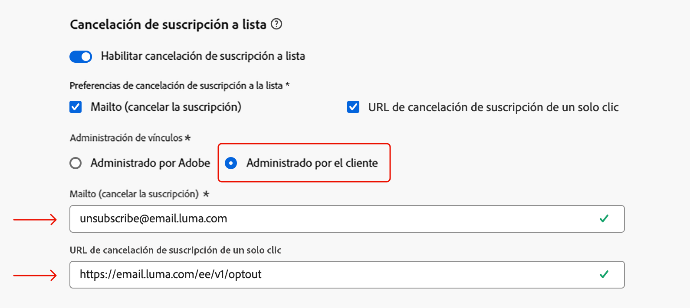

# Notas de la versión de 2025 {#release-notes-2025}

Esta página enumera todas las funciones y mejoras de [!DNL Journey Optimizer] lanzadas en 2025.

## Notas de la versión de julio de 2025 {#25-7-rn}

**Fecha de lanzamiento**: miércoles, 29 de julio de 2025

### Nuevas funciones {#features-25-7}

A continuación, se describen las nuevas funciones incluidas en esta versión.

#### Funcionalidades

<table>
<thead>
<tr>
<th><strong>Marcas</strong> </th>
</tr>
</thead>
<tbody>
<tr>
<td>

Ahora puede crear y personalizar sus propias marcas para definir claramente su identidad visual y verbal en todas las comunicaciones. Con la puntuación de alineación de marca, puede recibir comentarios en tiempo real sobre cómo el contenido refleja el tono, el estilo y las directrices de su marca, lo que le ayuda a mantenerse siempre coherente con la marca en cada mensaje que envía.

Esta capacidad, que se lanzó anteriormente en beta, ya está disponible en todos los entornos (disponibilidad general).

Para obtener más información, consulte la <a href="../content-management/brands.md">documentación detallada</a>.

</td>
</tr>
</tbody>
</table>

<table>
<thead>
<tr>
<th><strong>Use Decisioning en el canal de correo electrónico</strong> </th>
</tr>
</thead>
<tbody>
<tr>
<td>

Ahora puede añadir directivas de Decisión a recorridos de correo electrónico y campañas. Las políticas de decisión son contenedores para sus ofertas que aprovechan el motor de Decisioning para devolver dinámicamente el mejor contenido para entregar a cada miembro del público.

Esta capacidad tiene disponibilidad limitada. Póngase en contacto con su representante de Adobe para obtener acceso.

Para obtener más información, consulte la <a href="../experience-decisioning/create-decision.md">documentación detallada</a>.

</td>
</tr>
</tbody>
</table>

<table>
<thead>
<tr>
<th><strong>Canal LINE</strong> </th>
</tr>
</thead>
<tbody>
<tr>
<td>

Adobe Journey Optimizer ha ampliado sus funcionalidades en canales múltiples para incluir la compatibilidad con el canal LINE. Esta mejora le permite crear, editar y previsualizar experiencias de LINE, permitiendo interacciones más personalizadas y atractivas. Con LINE, puede conectarse con más clientes, enviar contenido relevante y mejorar su participación.

Anteriormente disponible solo para solicitudes, el canal LINE ahora está disponible para todos los usuarios (disponibilidad general).

Para obtener más información, consulte la <a href="../../rp_landing_pages/line-landing-page.md">documentación detallada</a>.
</td>
</tr>
</tbody>
</table>

<table>
<thead>
<tr>
<th><strong>Ensayo de recorrido </strong> </th>
</tr>
</thead>
<tbody>
<tr>
<td>

El ensayo del recorrido es un modo especial de publicación de recorrido de Adobe Journey Optimizer que permite a los profesionales de recorridos probar un recorrido utilizando datos de producción reales sin ponerse en contacto con clientes reales ni actualizar la información de perfil. Esta función ayuda a los profesionales de recorridos a confiar en el diseño del recorrido y en la segmentación del público antes de publicarlo en vivo.

Esta capacidad, que se lanzó anteriormente con disponibilidad limitada, ya está disponible en todos los entornos (disponibilidad general).

Para obtener más información, consulte la <a href="../building-journeys/journey-dry-run.md">documentación detallada</a>.

</td>
</tr>
</tbody>
</table>

<table>
<thead>
<tr>
<th><strong>ID suplementario para recorridos</strong> </th>
</tr>
</thead>
<tbody>
<tr>
<td>

Ahora puede activar recorridos utilizando un ID de perfil junto con otro identificador, como un ID de pedido, un ID de suscripción o un ID de prescripción, lo que permite que el mismo perfil esté en el mismo recorrido varias veces a la vez. Esto permite situaciones como administrar varios pedidos o suscripciones en paralelo, y que cada instancia siga su propia ruta a través del recorrido.

Publicado anteriormente con disponibilidad limitada, el uso de ID suplementarios en recorridos ya está disponible para todos los entornos. En esta versión con disponibilidad general, la función ahora es compatible con los recorridos de Leer público.

Para obtener más información, consulte la <a href="../building-journeys/supplemental-identifier.md">documentación detallada</a>.

</td>
</tr>
</tbody>
</table>

### Alertas en el producto

Ahora puede suscribirse a **alertas por correo electrónico y en el producto** para las versiones de productos de Journey Optimizer.

Para suscribirse:

* Vaya a **Preferencias de Adobe Experience Cloud**.
* En **Notificaciones**, busque **Nuevas versiones de Journey Optimizer**.
* Habilite las notificaciones in-app y por correo electrónico.

{width="70%" align="left"}

### Cambio en las condiciones del recorrido {#ee-change@}

A partir del 8 de julio, en las nuevas organizaciones de clientes, la creación de expresiones mediante eventos de experiencia dejará de ser compatible con el editor de expresiones utilizado en las condiciones del recorrido. Como resultado, no se pueden usar eventos de experiencia en la [fuente de datos de Experience Platform](../datasource/adobe-experience-platform-data-source.md) para crear expresiones. [Aquí](../building-journeys/exp-event-lookup.md) encontrará referencias a enfoques alternativos y prácticas recomendadas para crear expresiones y lógicas con eventos de experiencia.

No hay cambios en la forma de acceder a los datos de evento de contexto de recorrido en los recorridos unitarios. En los editores de expresiones y personalización, los usuarios pueden seguir accediendo a los datos pasados con el evento de recorrido inicial.

Obtenga más información [en estas preguntas frecuentes](../building-journeys/exp-event-lookup.md#faq-ee).

### Mejoras {#25-7-improv}

A continuación, se describen las mejoras incluidas en esta versión.

* **Campañas**

   * **Varias acciones entrantes en las campañas**: para simplificar la orquestación de la campaña, ahora puede definir varias acciones entrantes en una sola campaña. Esta capacidad le permite enviar varias experiencias basadas en código, mensajes in-app, tarjetas de contenido o acciones web a diferentes ubicaciones al mismo tiempo, y cada acción con un contenido específico.
     [Más información](../campaigns/campaign-action.md#multi-action)

   * **Reorganización del inventario de campañas**: las campañas programadas y activadas por API ahora se dividen en pestañas independientes en el inventario de campañas para facilitar la navegación y la administración.

[Más información](../campaigns/modify-stop-campaign.md)

* **Administración de datos**
   * **Actualización del conjuntos de datos del sistema de Gestión de decisiones**: las ofertas personalizadas y de reserva eliminadas ahora se marcan como archivadas en los conjuntos de datos «decision_object_repository_personalized_offers» y «decision_object_repository_fallback_offers». Los registros existentes en el conjunto de datos no cambian.

[Más información](../offers/export-catalog/access-dataset.md)

* **Recorridos**
   * **Mejoras en la herramienta de zona protegida para recorridos**: al copiar recorridos en varias zonas protegidas mediante las funciones de exportación e importación de paquetes, ahora también están disponibles las siguientes funciones:
      * Selección de un evento existente en el destino
      * Copia de un evento independientemente de un recorrido
      * Detectar relaciones entre grupos de campos y fuentes de datos, vincularlas en el destino si existen y crearlas en caso contrario.

[Más información](../configuration/copy-objects-to-sandbox.md)

* **Canal: in-app**
   * **Pares de clave/valor in-app**: con los mensajes in-app, puede definir pares de clave y valor para incluir variables personalizadas en la carga útil del mensaje. Estos pares clave-valor le permiten pasar datos adicionales según su configuración específica y el caso de uso. [Más información](../in-app/design-in-app.md)

* **Canal - Tarjeta de contenido**

   * **Descalificación de campaña basada en reglas**: al editar reglas de entrega adicionales, la opción de reglas de envío anteriores se ha reemplazado con tres tipos de reglas diferentes para controlar mejor el tiempo y la visibilidad del mensaje:
      * Mostrar mensaje si: Condiciones que determinan cuándo se muestra la tarjeta de contenido.
      * Descartar mensaje si: Condiciones que ocultan temporalmente la tarjeta de contenido. Puede volver a aparecer si se vuelven a cumplir las condiciones de visualización.
      * Descalificar mensaje si: Condiciones que impiden permanentemente que se vuelva a mostrar la tarjeta de contenido.

[Más información](../content-card/design-content-card.md)

* **Toma de decisiones**
   * **API de herramientas de migración**: el equipo de Journey Optimizer está trabajando en las API de herramientas de migración para migrar entidades de gestión de decisiones a Decisioning. Esta herramienta permite una migración perfecta entre zonas protegidas con resolución de dependencia y funciones de reversión. Si está interesado, póngase en contacto con su representante de Adobe.

* **Personalización**
   * Se ha añadido una nueva función auxiliar, «SHA256», al editor de personalización. Esta función se utiliza para calcular y devolver el hash sha256 de una cadena.

[Más información](../personalization/functions/string.md#sha256)

## Notas de la versión de junio de 2025 {#25-6-rn}

**Fecha de lanzamiento**: 18 de junio de 2025

### Nuevas funciones {#25-06-features}

A continuación, se describen las nuevas funciones incluidas en esta versión.

<table>
<thead>
<tr>
<th><strong>Conjuntos de datos de Adobe Experience Platform en las tomas de decisiones (Beta)</strong> </th>
</tr>
</thead>
<tbody>
<tr>
<td>

Los conjuntos de datos de Adobe Experience Platform, que anteriormente estaban disponibles para la personalización, ahora se pueden aprovechar para la toma de decisiones. Esto le permite ampliar la definición de los atributos de decisión a datos adicionales en conjuntos de datos para actualizaciones masivas que cambian periódicamente sin tener que actualizar manualmente los atributos de uno en uno. Por ejemplo, disponibilidad, tiempos de espera, etc.

Esta funcionalidad está actualmente disponible para todos los clientes en beta pública. Póngase en contacto con el representante de su cuenta si desea tener acceso.

Para obtener más información, consulte la <a href="../experience-decisioning/aep-data-exd.md">documentación detallada</a>.

Fecha de disponibilidad: 20 de junio de 2025

</td>
</tr>
</tbody>
</table>

<table>
<thead>
<tr>
<th><strong>Mensajería RCS</strong> </th>
</tr>
</thead>
<tbody>
<tr>
<td>

La mensajería de servicios de comunicación enriquecida (RCS) ahora es compatible con Journey Optimizer, lo que permite las siguientes funciones de mensajería mejoradas sujetas a la compatibilidad del proveedor y el operador:

<ul>
<li>Compatibilidad con remitentes de marca y verificados: envía mensajes utilizando perfiles comerciales verificados con elementos de promoción de la marca (logotipo, nombre del remitente, etc.).</li>
<li>Información sobre el envío de mensajes: se reciben informes de envío detallados que incluyen actualizaciones del estado del mensaje (por ejemplo, enviado, entregado, leído).</li>
<li>Seguimiento de vínculos: incrusta y rastrea direcciones URL en mensajes RCS para el análisis de participación.</li>
<li>Reserva de SMS: recurre automáticamente a los SMS cuando el dispositivo del perfil no sea compatible con RCS o no se pueda acceder temporalmente mediante RCS.</li>
<li>Composición básica de mensajes: envía mensajes RCS basados en texto con medios opcionales y elementos enriquecidos, según la compatibilidad del proveedor.</li>
</ul>

Para obtener más información, consulte la <a href="../sms/sms-configuration.md">documentación detallada</a>.

</td>
</tr>
</tbody>
</table>

<table>
<thead>
<tr>
<th><strong>Campos de formulario en el contenido de la experiencia basada en código</strong> </th>
</tr>
</thead>
<tbody>
<tr>
<td>

Ahora puede definir los campos editables específicos en las plantillas de contenido JSON o HTML que permitan a los usuarios no técnicos editar fácilmente el contenido en una vista de formulario dentro de la creación del canal de la experiencia basada en código, sin necesidad de manipular ningún código. Más que eso, al definir las plantillas de contenido de la experiencia basada en código, ahora puede insertar directivas de decisión en la plantilla, lo que aumenta la reutilización y facilidad de uso.

Para obtener más información, consulte la <a href="../code-based/code-based-form-fields.md">documentación detallada</a>.

</td>
</tr>
</tbody>
</table>

<!--
<table>
<thead>
<tr>
<th><strong>Custom delegation method for subdomains</strong> </th>
</tr>
</thead>
<tbody>
<tr>
<td>

In addition to the full delegation and the CNAME method, a new subdomain configuration method is now available: the Custom delegation method, which enables you to fully own controlling and maintaining all aspects of DNS that are required for delivering, rendering and tracking messages.

</td>
</tr>
</tbody>
</table>
-->

<table>
<thead>
<tr>
<th><strong>Actividad de decisión de contenido en los recorridos</strong> </th>
</tr>
</thead>
<tbody>
<tr>
<td>

Ahora puede incluir ofertas personalizadas en los recorridos mediante una actividad de decisión de contenido específica en el lienzo y utilizarlas en actividades de recorrido, incluidas las condiciones y las acciones personalizadas.

Esta funcionalidad solo está disponible para un conjunto de organizaciones (disponibilidad limitada) y se implementará globalmente en una futura versión.

Para obtener más información, consulte la <a href="../building-journeys/content-decision.md">documentación detallada</a>.

</td>
</tr>
</tbody>
</table>

<table>
<thead>
<tr>
<th><strong>Ensayo del recorrido</strong> </th>
</tr>
</thead>
<tbody>
<tr>
<td>

El ensayo del recorrido es un modo especial de publicación de recorrido de Adobe Journey Optimizer que permite a los profesionales de recorridos probar un recorrido utilizando datos de producción reales sin ponerse en contacto con clientes reales ni actualizar la información de perfil. Esta función ayuda a los profesionales de recorridos a confiar en el diseño del recorrido y en la segmentación del público antes de publicarlo en vivo.

Esta funcionalidad solo está disponible para un conjunto de organizaciones (disponibilidad limitada) y se implementará globalmente en una futura versión.

Para obtener más información, consulte la <a href="../building-journeys/journey-dry-run.md">documentación detallada</a>.

</td>
</tr>
</tbody>
</table>

<table>
<thead>
<tr>
<th><strong>Pausar y reanudar recorridos</strong> </th>
</tr>
</thead>
<tbody>
<tr>
<td>

Ahora puede poner en pausa y reanudar los recorridos. Esta funcionalidad proporciona a los profesionales del recorrido un mayor control y flexibilidad al permitir que los recorridos en directo se suspendan temporalmente sin interrumpir la experiencia del cliente. Cuando están en pausa, no se envían comunicaciones y los perfiles permanecen en estado suspendido hasta que se reanuda el recorrido.

Puede poner en pausa y reanudar solo un recorrido, o realizar pausas masivas y reanudar operaciones en un grupo de recorridos.

Además, puede aplicar filtros globales a los recorridos en pausa para excluir perfiles en función de sus atributos.

Esta funcionalidad solo está disponible para un conjunto de organizaciones (disponibilidad limitada) y se implementará globalmente en una futura versión.

Para obtener más información, consulte la <a href="../building-journeys/journey-pause.md">documentación detallada</a>.

</td>
</tr>
</tbody>
</table>

<table>
<thead>
<tr>
<th><strong>Escalar el ganador de la experimentación</strong> </th>
</tr>
</thead>
<tbody>
<tr>
<td>

Escalar el ganador de la experimentación permite desplegar automática o manualmente la variación ganadora de un experimento para todo el público. Esta función garantiza que, una vez que se identifique al que tenga el mayor rendimiento, pueda maximizar su alcance y eficacia sin una supervisión manual constante.

Para obtener más información, consulte la <a href="../content-management/content-experiment.md">documentación detallada</a>.

Fecha de disponibilidad: 2 de junio de 2025
</td>
</tr>
</tbody>
</table>

<table>
<thead>
<tr>
<th><strong>Conflicto y priorización</strong> </th>
</tr>
</thead>
<tbody>
<tr>
<td>

En Journey Optimizer, administrar el volumen y la cronología de las campañas y los recorridos es esencial para evitar abrumar a los clientes con demasiadas interacciones. Journey Optimizer ahora ofrece varias herramientas para la administración de conflictos y la priorización - antes disponibles solo para organizaciones de acceso limitado (LA) que ahora están disponibles de forma general (GA).

Esta capacidad, que se lanzó anteriormente con disponibilidad limitada, ya está disponible en todos los entornos. Con esta versión de disponibilidad general, se han introducido las siguientes mejoras:

<ul>
<li>Compatibilidad ampliada: las herramientas de administración de conflictos ahora admiten tanto los recorridos unitarios como los recorridos de calificación de público, además de los recorridos de público de lectura.</li>
<li>Solución de problemas mejorada: ahora hay dos nuevos campos de evento de paso disponibles en el servicio de consultas, lo que le permite analizar por qué se rechazó un perfil de un recorrido o una campaña.</li>
<li>Informes mejorados: ahora los informes indican qué regla específica excluyó un perfil de un recorrido o campaña, lo que proporciona una mayor transparencia e información útil.</li></ul>

Para obtener más información, consulte la <a href="../conflict-prioritization/gs-conflict-prioritization.md">documentación detallada</a>.

Fecha de disponibilidad: 3 de junio de 2025

</td>
</tr>
</tbody>
</table>

### Mejoras {#25-06-improv}

A continuación, se describen las mejoras incluidas en esta versión.

* **Conjuntos de reglas de canal**

   * **Ventana de duración personalizada** para el límite: ahora hay un nuevo campo **Cada** disponible en la pantalla de configuración de conjuntos de reglas de canal, que le permite aplicar reglas de restricción de frecuencia durante varios días, semanas o meses, según la duración especificada.

   * **Frecuencia de restricción de restablecimiento por hora**: ahora puede aplicar una restricción por hora a los conjuntos de reglas de canal. Esta versión solo está disponible para un conjunto de organizaciones (disponibilidad limitada). Póngase en contacto con el Servicio de atención al cliente para activarlo.

   * **Duración diaria**: anteriormente disponible en disponibilidad limitada, la restricción de frecuencia “diaria” en los conjuntos de reglas de canal ya está disponible para todos los clientes.

  Para obtener más información, consulte la [documentación detallada](../conflict-prioritization/channel-capping.md).

* **Experiencias basadas en código**

   * Ahora es posible añadir una política de decisión en las plantillas de contenido de la experiencia basada en código, donde se puede utilizar para aprovechar las ofertas en campos de formulario editables. [Más información](../code-based/code-based-form-fields.md)

   * Desde la pantalla de recorrido de la experiencia basada en código o de edición de campaña, ahora puede añadir directamente una política de decisión, sin abrir el editor de personalización. [Más información](../code-based/create-code-based.md#edit-code)

* **Compatibilidad con CSS personalizado en el diseñador de correo electrónico**

  Journey Optimizer ahora le permite añadir CSS personalizado al contenido del correo electrónico directamente en el diseñador de correo electrónico. [Más información](../email/custom-css.md)

* **Nueva navegación con pestañas para las campañas**

  El nuevo patrón de navegación permite un acceso más rápido a la creación de contenido y admite una mayor ampliación de la configuración en todas las campañas. [Más información](../campaigns/create-campaign.md)

* **Toma de decisiones**

   * **Copia y toma de decisiones de zona protegida** (fecha de disponibilidad: 3 de junio de 2025): ahora se pueden copiar objetos de decisiones entre zonas protegidas, lo que agiliza los flujos de trabajo de prueba e implementación. [Más información](../configuration/copy-objects-to-sandbox.md#decisioning)

   * **Compatibilidad con atributos de elementos de decisión para reglas de toma de decisiones** (fecha de disponibilidad: 4 de junio de 2025). Ahora puede aprovechar los atributos de elementos de decisión para crear reglas de toma de decisiones. [Más información](../experience-decisioning/rules.md#create)

* **Actualización de la API de ejecución de mensajes interactivos** - Fecha de disponibilidad: 6 de junio de 2025

  La API de ejecución de mensajes interactivos ahora le permite eliminar la programación de la próxima ejecución de campañas. [Más información](https://developer.adobe.com/journey-optimizer-apis/references/messaging/){target="_blank"}

## Notas de la versión de mayo de 2025 {#25-5-rn}

<!--**Release date**: May 20-21, 2025-->

### Nuevas funciones {#25-05-features}

A continuación, se describen las nuevas funciones incluidas en esta versión.

<table>
<thead>
<tr>
<th><strong>Vista de calendario para el inventario de campañas y recorridos</strong> </th>
</tr>
</thead>
<tbody>
<tr>
<td>

Ahora hay disponible una vista de calendario en las listas de recorridos y campañas. Permite visualizar todas las activaciones de recorridos y campañas en las listas respectivas.

Ahora mismo, esta función solo está disponible para un conjunto de organizaciones (disponibilidad limitada). Para solicitar acceso, utilice <a href="https://forms.cloud.microsoft/r/FC49afuJVi" target="_blank">este formulario</a>.

Para obtener más información, consulte estas secciones: <a href="../building-journeys/journey-ui.md">Examinar y filtrar sus recorridos</a>, <a href="../campaigns/modify-stop-campaign.md">Acceso a campañas</a>.

Fecha de disponibilidad: 28 de mayo de 2025

</td>
</tr>
</tbody>
</table>

<table>
<thead>
<tr>
<th><strong>Integración de fragmentos de contenido de Adobe Experience Manager</strong> </th>
</tr>
</thead>
<tbody>
<tr>
<td>

Con la integración de Adobe Experience Manager y Adobe Journey Optimizer, ahora puede utilizar sin esfuerzo fragmentos de contenido de Adobe Experience Manager dentro de su contenido de Journey Optimizer. Esta conexión perfecta facilita el acceso y el uso del contenido de AEM directamente en Journey Optimizer.

Anteriormente disponible para un conjunto limitado de organizaciones (LA), esta funcionalidad ahora es de disponibilidad general (GA) con la siguiente mejora: ahora puede definir marcadores de posición y asignar valores de personalización dentro de la firma del fragmento mediante el modo Editor.

<ul>
<!--li>Create offers by directly selecting an AEM Content Fragment.</li>
<li>Define placeholders and map personalization values within the fragment signature using the Editor mode.</li-->
</ul>
 

Para obtener más información, consulte la <a href="../integrations/aem-fragments.md">documentación detallada</a>.

Fecha de disponibilidad: 23 de mayo de 2025

</td>
</tr>
</tbody>
</table>

<table>
<thead>
<tr>
<th><strong>Integración de Dynamic Media de Adobe Experience Manager</strong> </th>
</tr>
</thead>
<tbody>
<tr>
<td>

Los recursos de Dynamic Media ahora están disponibles y son accesibles directamente en Journey Optimizer. Esta actividad le permite lo siguiente:

<ul>
<li>Administrar centralmente los recursos con actualizaciones en tiempo real.</li>
<li>Modificar la configuración de los recursos, como la anchura y la altura, al instante.</li>
<li>Personalizar las plantillas de Dynamic Media actualizando el contenido y añadiendo campos de personalización.</li>
</ul>
 

Esta capacidad, que se lanzó anteriormente con disponibilidad limitada, ya está disponible en todos los entornos (disponibilidad general).

Para obtener más información, consulte la <a href="../integrations/aem-dynamic.md">documentación detallada</a>.

Fecha de disponibilidad: 23 de mayo de 2025

</td>
</tr>
</tbody>
</table>

<table>
<thead>
<tr>
<th><strong>ID suplementario para recorridos activados por eventos</strong> </th>
</tr>
</thead>
<tbody>
<tr>
<td>

Ahora puede activar recorridos utilizando un ID de perfil junto con otro identificador, como un ID de pedido, un ID de suscripción o un ID de prescripción, lo que permite que el mismo perfil esté en el mismo recorrido varias veces a la vez. Esto permite situaciones como administrar varios pedidos o suscripciones en paralelo, y que cada instancia siga su propia ruta a través del recorrido.

Para obtener más información, consulte la <a href="../building-journeys/supplemental-identifier.md">documentación detallada</a>.

Esta versión solo está disponible para un conjunto de organizaciones (disponibilidad limitada). Para obtener acceso, póngase en contacto con su representante de Adobe.

Fecha de disponibilidad: 23 de mayo de 2025

</td>
</tr>
</tbody>
</table>

<table>
<thead>
<tr>
<th><strong>Simulación de variaciones de contenido</strong> </th>
</tr>
</thead>
<tbody>
<tr>
<td>
<!--p>Previously available in beta, content variations simulation is now generally available (GA). It allows you to preview different variations of your content using sample input data uploaded from a CSV or JSON file or added manually. All the attributes used in your content for personalization are automatically detected by the system and can be used for your tests to create multiple variants.</p-->

Esta capacidad, que se lanzó anteriormente con disponibilidad limitada, ya está disponible en todos los entornos. Con la versión de Disponibilidad general, la función ahora incluye compatibilidad con el contenido multilingüe y experimentos de contenido, lo que permite probar variaciones en diferentes idiomas y tratamientos. Además, ahora admite atributos contextuales (además de los atributos de perfil), lo que permite realizar pruebas de contenido aún más dinámicas y adaptadas a cada situación.

Para obtener más información, consulte la <a href="../test-approve/simulate-sample-input.md">documentación detallada</a>.

Fecha de disponibilidad: 23 de mayo de 2025

</td>
</tr>
</tbody>
</table>

<table>
<thead>
<tr>
<th><strong>Sincronización de la programación de público de lectura con el trabajo de segmentación por lotes</strong> </th>
</tr>
</thead>
<tbody>
<tr>
<td>

Ahora puede activar ejecuciones de recorrido diarias tras la finalización de la segmentación por lotes. Esta opción ahora está disponible en los recorridos programados diariamente para todos los clientes. Le permite definir un período de tiempo de hasta 6 horas de espera de los datos del público procedentes de los trabajos de segmentación por lotes, lo que garantiza que los recorridos se ejecuten con los datos más actualizados o se omitan si no están listos. 

Esta capacidad, que se lanzó anteriormente con disponibilidad limitada, ya está disponible en todos los entornos (disponibilidad general).

Para obtener más información, consulte la <a href="../building-journeys/read-audience.md#schedule">documentación detallada</a>.

Fecha de disponibilidad: 20 de mayo de 2025

</td>
</tr>
</tbody>
</table>

<table>
<thead>
<tr>
<th><strong>Proveedor de SMS personalizado</strong> </th>
</tr>
</thead>
<tbody>
<tr>
<td>

Journey Optimizer ahora permite configurar proveedores de SMS adicionales más allá de las opciones predeterminadas: Sinch, Infobip y Twilio. Con la configuración personalizada del proveedor de SMS, puede integrar proveedores de terceros directamente, aprovechar la personalización avanzada de la carga útil para la mensajería dinámica y administrar las preferencias de consentimiento (inclusión/exclusión) para garantizar el cumplimiento.

Para obtener más información, consulte la <a href="../sms/sms-configuration-custom.md">documentación detallada</a>.

Esta capacidad, que se lanzó anteriormente con disponibilidad limitada, ya está disponible en todos los entornos (disponibilidad general).

Fecha de disponibilidad: 20 de mayo de 2025

</td>
</td>
</tr>
</tbody>
</table>

<table>
<thead>
<tr>
<th><strong>Temas del Diseñador de correo electrónico</strong> </th>
</tr>
</thead>
<tbody>
<tr>
<td>

Ahora puede aplicar rápidamente temas aprobados anteriormente para garantizar la coherencia de marca en todos los correos electrónicos, acelerar el proceso de creación de campañas y producir de forma independiente correos electrónicos de alta calidad, al tiempo que se reduce la dependencia en los equipos de diseño.

Actualmente, esta función está en versión Beta y solo se encuentra disponible para los clientes de dicha versión. Para unirse al programa beta, póngase en contacto con su representante de Adobe.

Para obtener más información, consulte la <a href="../email/apply-email-themes.md">documentación detallada</a>.

Fecha de disponibilidad: 14 de mayo de 2025

</td>
</tr>
</tbody>
</table>

<table>
<thead>
<tr>
<th><strong>Decisiones: nuevo generador de fórmulas de IA</strong> </th>
</tr>
</thead>
<tbody>
<tr>
<td>

Ahora puede crear fórmulas de clasificación de decisiones específicas definiendo y combinando criterios a partir de una nueva interfaz mejorada. En lugar de depender únicamente de una prioridad de oferta estática, puede definir fórmulas de clasificación personalizadas que combinen puntuaciones del modelo de IA, prioridades de oferta, atributos de perfil, atributos de oferta y señales contextuales a través de una interfaz guiada.

Para obtener más información, consulte la <a href="../experience-decisioning/ranking/ranking-formulas.md">documentación detallada</a>.

Fecha de disponibilidad: 14 de mayo de 2025

</td>
</tr>
</tbody>
</table>

### Mejoras {#25-05-improv}

A continuación, se describen las mejoras incluidas en esta versión.

* **Nueva compatibilidad con objetos de campaña para copias en zonas protegidas**. Fecha de disponibilidad: 15 de mayo de 2025

  Cuando se copian campañas en varias zonas protegidas limitadas mediante las funciones de exportación e importación de paquetes, ahora también se copian las siguientes dependencias: configuraciones de canal, variantes y configuración de experimento, políticas de decisión y elementos. [Más información](../configuration/copy-objects-to-sandbox.md)

* **Carpetas para páginas de aterrizaje**. Fecha de disponibilidad: 9 de mayo de 2025

  Para administrar con facilidad las páginas de aterrizaje, ahora puede utilizar las carpetas para organizarlas de forma más eficaz en una jerarquía estructurada. [Más información](../landing-pages/manage-lp.md)

* **Correo directo: compatibilidad con claves SSH para conexiones SFTP**. Fecha de disponibilidad: 5 de mayo de 2025

  En la configuración de enrutamiento del archivo de correo directo, además del SFTP existente con el tipo de autenticación por contraseña, ahora puede exportar el archivo de correo directo a un servidor SFTP con la autenticación por clave SSH. [Más información](../direct-mail/direct-mail-configuration.md)

* **Activación de cápsulas para la personalización**. Fecha de disponibilidad: 5 de mayo de 2025

  Se ha añadido el nuevo botón “píldoras” al editor de personalización. Cuando se habilita, los atributos contextuales y de perfil se muestran como píldoras, lo que mejora la legibilidad del código. [Más información](../personalization/personalization-build-expressions.md#options)

  >[!AVAILABILITY]
  >
  >Esta capacidad se implementará gradualmente en todos los entornos en los próximos 30 días.

* **Compatibilidad con “Redireccionar a URL” en el canal web** - Fecha de disponibilidad: 20 de mayo de 2025

  El canal web de Journey Optimizer ahora le permite redirigir a los visitantes a otra URL existente, en lugar de crear una nueva variación en el editor visual. Esta funcionalidad se puede utilizar para ejecutar experimentos comparando dos páginas completamente diferentes en lugar de cambiar solo unos pocos elementos dentro de una página. [Más información](../web/create-web.md#web-redirect-to-url)

* **Carpetas para plantillas y fragmentos**: fecha de disponibilidad: 20 de mayo de 2025

  Las carpetas permiten organizar los objetos de forma más fácil y eficaz en una jerarquía estructurada. Las carpetas, que antes solo estaban disponibles para un conjunto de organizaciones (LA), ahora lo están para que todos los usuarios (GA) administren sus plantillas y fragmentos de contenido. Obtenga más información en las secciones [Plantillas de contenido](../content-management/access-content-templates.md#folders) y [Fragmentos](../content-management/manage-fragments.md#folders).

* **Rastreo de clics en plantillas de correo electrónico** - Fecha de disponibilidad: 20 de mayo de 2025

  El rastreo de clics en elementos `<area>` dentro de mapas de imagen en el contenido de correo electrónico ahora se admite de forma nativa en [!DNL Journey Optimizer]. Esto sirve para garantizar que las áreas de mapa de imagen reciban el mismo encapsulado de seguimiento, datos de seguimiento y parámetros añadidos que los hipervínculos estándar. [Obtenga más información sobre el seguimiento de mensajes](../email/message-tracking.md#manage-tracking).

<!--
* **Decisioning - Leverage Adobe Experience Platform datasets** 
  
  Journey Optimizer now allows you to leverage Adobe Experience Platform datasets in the following Decisioning objects: eligibility rules, ranking formulas, and capping rules.-->

* **Carril derecho en la lista de campañas** - Fecha de disponibilidad: 20 de mayo de 2025

  Al seleccionar una campaña de la lista, se abre el panel que muestra sus detalles.

<!--* **Form fields in code-based experience content**

  In content templates, you can now define specific JSON or HTML fields which enable non-technical users to easily edit content in code-based experiences without the need to manipulate code.-->

<!--* **Subdomains - 'Custom delegation' method**  
  In addition to the full delegation and the CNAME method, a new subdomain configuration method is now available: the Custom delegation method, which enables you to fully own controlling and maintaining all aspects of DNS that are required for delivering, rendering, and tracking messages.
  -->

## Notas de la versión de abril de 2025 {#25-4-rn}

**Fecha de lanzamiento**: del 29 al 30 de abril de 2025

### Nuevas funciones {#25-04-features}

A continuación, se describen las nuevas funciones incluidas en esta versión.

<table>
<thead>
<tr>
<th><strong>Editor de personalización: Aprenda haciendo</strong> </th>
</tr>
</thead>
<tbody>
<tr>
<td>

Ya está disponible un área de reproducción de personalización, donde puede experimentar con expresiones de personalización. Le permite explorar plantillas y cargas útiles de ejemplo para ayudarle a empezar y probar sus propias expresiones de personalización.

Para obtener más información, consulte la <a href="../personalization/personalize.md#playground">documentación detallada</a>.

Fecha de disponibilidad: 24 de abril de 2025

</td>
</tr>
</tbody>
</table>

<!--table>
<thead>
<tr>
<th><strong>Adobe Experience Manager as a Cloud Service integration</strong> </th>
</tr>
</thead>
<tbody>
<tr>
<td>

The integration between Adobe Journey Optimizer and Adobe Experience Manager as a Cloud Service is now released in General Availability (GA). This integration enables seamless content sourcing and management for personalized customer journeys.

For more information, refer to the <a href="../integrations/aem-templates.md">detailed documentation</a>.

</td>
</tr>
</tbody>
</table-->

<!--<table>
<thead>
<tr>
<th><strong>Simulate content variations (General Availability)</strong> </th>
</tr>
</thead>
<tbody>
<tr>
<td>

Previously available in beta, content variations simulation is now generally available (GA). It allows you to preview different variations of your content using sample input data uploaded from a CSV or JSON file or added manually. All the attributes used in your content for personalization are automatically detected by the system and can be used for your tests to create multiple variants.

With the General Availability release, the feature now includes support for multilingual content and content experiments, enabling you to test variations across different languages and treatments. Additionally, it now supports contextual attributes (in addition to profile attributes), allowing for even more dynamic and situational content testing.

</td>
</tr>
</tbody>
</table>-->

<table>
<thead>
<tr>
<th><strong>Canal LINE</strong> </th>
</tr>
</thead>
<tbody>
<tr>
<td>

Adobe Journey Optimizer ha ampliado sus funcionalidades en canales múltiples para incluir la compatibilidad con el canal LINE. Esta mejora le permite crear, editar y previsualizar experiencias de LINE, permitiendo interacciones más personalizadas y atractivas. Con LINE, puede conectarse con más clientes, enviar contenido relevante y mejorar su participación.

El canal LINE está habilitado para los clientes de Adobe Journey Optimizer previa solicitud. Póngase en contacto con el Servicio de atención al cliente de Adobe o con su representante de Adobe para activar la función para su organización.

Para obtener más información, consulte la <a href="../../rp_landing_pages/line-landing-page.md">documentación detallada</a>.
</td>
</tr>
</tbody>
</table>

<!--table>
<thead>
<tr>
<th><strong>Custom SMS provider (General Availability)</strong> </th>
</tr>
</thead>
<tbody>
<tr>
<td>

Adobe Journey Optimizer now supports custom SMS providers, allowing you to integrate your preferred SMS services for enhanced communication flexibility.

For more information, refer to the <a href="../sms/sms-configuration-custom.md">detailed documentation</a>.
</td>
</tr>
</tbody>
</table-->

<table>
<thead>
<tr>
<th><strong>Métricas de recorrido</strong> </th>
</tr>
</thead>
<tbody>
<tr>
<td>

Las métricas de recorrido ya están disponibles, lo que le permite medir el impacto de sus actividades en las métricas clave de su empresa y proporcionar una perspectiva más clara de su rendimiento.

 

Para obtener más información, consulte la <a href="../building-journeys/success-metrics.md">documentación detallada</a>.

Fecha de disponibilidad: 9 de abril de 2025

</td>
</tr>
</tbody>
</table>

<!--<table>
<thead>
<tr>
<th><strong>Calendar view for campaign and journey inventory (Limited Availability)</strong> </th>
</tr>
</thead>
<tbody>
<tr>
<td>

A new calendar view is now available for campaigns and journey activations. This feature provides a visual representation of scheduled activities, allowing you to view and manage your campaigns and journeys more effectively. Selecting a calendar item opens a right rail with detailed information. This feature is currently in Limited Availability.

</td>
</tr>
</tbody>
</table>-->

<table>
<thead>
<tr>
<th><strong>Integración de Adobe Express (disponibilidad limitada)</strong> </th>
</tr>
</thead>
<tbody>
<tr>
<td>

Adobe Journey Optimizer ahora se integra con Adobe Express, lo que le permite conectar sin problemas sus recursos creativos con la orquestación de recorrido. Esta integración simplifica el proceso de diseño e implementación de contenido personalizado en todas las campañas. 

Esta integración no está disponible actualmente para su uso con Healthcare Shield o Privacy and Security Shield.

Para obtener más información, consulte la <a href="../integrations/express.md">documentación detallada</a>.

</td>
</tr>
</tbody>
</table>

<table>
<thead>
<tr>
<th><strong>Activación de ejecuciones de recorrido diarias tras la finalización de la segmentación por lotes (disponibilidad limitada)</strong> </th>
</tr>
</thead>
<tbody>
<tr>
<td>

En el caso de los recorridos programados diariamente, una nueva opción le permite definir un intervalo de tiempo de hasta 6 horas para esperar los datos de audiencia de los trabajos de segmentación por lotes, lo que garantiza que los recorridos se ejecuten con los datos más actualizados o se omitan si no están listos. La opción Activar tras evaluación de público por lotes solo está disponible para un conjunto de organizaciones (disponibilidad limitada). Para obtener acceso, póngase en contacto con su representante de Adobe.

Para obtener más información, consulte la <a href="../building-journeys/read-audience.md#schedule">documentación detallada</a>.

</td>
</tr>
</tbody>
</table>

<!--table>
<thead>
<tr>
<th><strong>Themes in the Email Designer (Beta)</strong> </th>
</tr>
</thead>
<tbody>
<tr>
<td>

You can now quickly apply pre-approved styling themes to your email content to ensure brand consistency across all emails, speed up your campaign creation process and independently produce hight-quality emails while reducing dependency on design teams.

This capability is currently in beta version and only available to beta customers. To join the beta program, contact your Adobe representative.

For more information, refer to the <a href="../content-management/brands-score.md">detailed documentation</a>.

Availability date: May 5, 2025

</td>
</tr>
</tbody>
</table-->

<table>
<thead>
<tr>
<th><strong>Puntuación de alineación con la marca (beta)</strong> </th>
</tr>
</thead>
<tbody>
<tr>
<td>

La función de puntuación de alineación de marca proporciona comentarios claros directamente en el Diseñador de correo electrónico, lo que le ayuda a ver si el contenido se ajusta al tono, al estilo y a las directrices de la marca. Esta función está disponible en Beta.

Para obtener más información, consulte la <a href="../content-management/brands-score.md">documentación detallada</a>.

</td>
</tr>
</tbody>
</table>

<!--
<table>
<thead>
<tr>
<th><strong>Decisioning - New AI formula builder</strong> </th>
</tr>
</thead>
<tbody>
<tr>
<td>

You can now create specific Decisioning ranking formulas by defining and combining criteria from a new improved interface. Ranking formulas allow you to define rules that will determine which decision items should be presented first, rather than taking into account the priority scores.

For more information, refer to the <a href="../content-management/brands-score.md">detailed documentation</a>.

Availability date: May 5, 2025

</td>
</tr>
</tbody>
</table>
-->

### Mejoras {#25-04-improv}

**API de vista previa de campañas**

Hay nuevas API disponibles para previsualizar campañas, además de las capacidades de envío de pruebas existentes. [Más información](https://developer.adobe.com/journey-optimizer-apis/references/simulations/#operation/createCampaignPreview){target="_blank"}.

**Herramientas de la zona protegida**

* **Herramientas de zona protegida para acciones personalizadas**

  Las acciones personalizadas ahora se incluyen en la lista de objetos de Adobe Journey Optimizer que se pueden copiar mediante la función de herramientas de zona protegida, lo que optimiza las pruebas y la implementación. [Más información](../configuration/copy-objects-to-sandbox.md)

* **Herramientas de zona protegida para campañas**. Fecha de disponibilidad: 3 de abril de 2025

  Ahora puede copiar campañas en varias zonas protegidas mediante las funciones de exportación e importación de paquetes. Las campañas se copian junto con todos los elementos relacionados con el perfil, el público, el esquema, los mensajes en línea y los objetos dependientes. Algunos elementos no se copian, como los elementos de decisión, las etiquetas de uso de datos y la configuración de idioma. [Más información](../configuration/copy-objects-to-sandbox.md#custom-actions)

**Personalización**

* **Nuevo atributo contextual**

  Ahora hay disponible un nuevo atributo contextual, **ID de perfil de mensaje**, que se puede seleccionar en el editor de personalización. Es un atributo orientado a mensajes que identifica de forma exclusiva cada mensaje enviado a cada perfil de destino en un envío. Este identificador único se puede utilizar, por ejemplo, como parámetro de seguimiento de URL para distinguir cada vínculo abierto o en el que los destinatarios hacen clic.

* **Atributos rellenados en el panel de atributos**. Fecha de disponibilidad: 2 de abril de 2025

  El panel de atributos del editor de personalización ahora muestra solo los atributos rellenados de forma predeterminada. Para ver todos los atributos, use el botón de configuración para desactivar la opción **[!UICONTROL Mostrar solo atributos rellenados]**. [Más información](../personalization/personalization-build-expressions.md)

**Canal de correo electrónico**

* **Seguimiento personalizado de URL**. Fecha de disponibilidad: 30 de abril de 2025

  Para obtener una mayor flexibilidad y control sobre la configuración del correo electrónico, ahora puede personalizar todos los parámetros de seguimiento de URL a la vez a nivel de configuración de canal de correo electrónico, en lugar de hacerlo en el Diseñador de correo electrónico para cada vínculo del contenido. [Más información](../email/surface-personalization.md#personalize-url-tracking)

* **Diseñador de correo electrónico**. Fecha de disponibilidad: 1 de abril de 2025

  Para mejorar la accesibilidad en Journey Optimizer, ahora hay dos campos nuevos disponibles en Diseñador de correo electrónico: se corresponden con el elemento `<title>` y el atributo `lang` en el elemento `<html>` del contenido del correo electrónico. Puede definir esta configuración, además del campo **[!UICONTROL Preencabezado]**, en la sección **[!UICONTROL Cuerpo]** del correo electrónico. [Más información](../email/email-metadata.md)

**Manuales de tácticas de casos de uso**

* **Creación y uso compartido de manuales de tácticas (Private Beta)**: ahora puede crear, administrar y compartir sus propios manuales de tácticas de casos de uso. Ahora mismo, esta función solo está disponible para un conjunto de organizaciones como Private Beta. Para obtener acceso, póngase en contacto con su representante de Adobe. [Más información](../start/playbooks.md)

**Navegación**

* **Administración de contenido**. Fecha de disponibilidad: 2 de abril de 2025

  Para administrar con facilidad los fragmentos y las plantillas de contenido, ahora puede utilizar carpetas para organizarlos de forma más eficaz en una jerarquía estructurada. Obtenga más información en las secciones [Fragmentos](../content-management/manage-fragments.md#folders) y [Plantillas de contenido](../content-management/access-content-templates.md#folders)

  >[!AVAILABILITY]
  >
  >Esta mejora solo está disponible para un conjunto de organizaciones (disponibilidad limitada).

<!--- **Folders for content templates and fragments** - Availability date: May 5, 2025

  Previously available for a set of organizations (LA), folders are now available to all users (GA) to manage their content templates and fragments. Folders let you organize your content templates and fragments more easily and effectively into a structured hierarchy.

<!--- **Right rail in campaigns list**  

  A right rail has been added to the campaigns list, providing detailed information when a campaign is selected.-->

<!--**Playbooks**

- **Create your own playbooks (Beta)**
  
  You can now create your own playbooks in Adobe Journey Optimizer, enabling greater customization and flexibility in journey planning.-->

## Notas de la versión de marzo de 2025 {#25-3-rn}

### Nuevas funciones {#25-03-features}

A continuación, se describen las nuevas funciones incluidas en esta versión.

<!--table>
<thead>
<tr>
<th><strong>Integration with Adobe Express (Limited Availability)</strong> </th>
</tr>
</thead>
<tbody>
<tr>
<td>

The Adobe Express integration in Adobe Journey Optimizer lets you use Adobe Express's editing tools directly during content creation, enabling you to resize, remove backgrounds, crop, and convert assets to JPEG or PNG.

Adobe Express integration in Adobe Journey Optimizer is currently only available for a set of organizations (Limited Availability). It cannot be deployed for use with Healthcare Shield or Privacy and Security Shield.

For more information, refer to the <a href="../integrations/express.md">detailed documentation</a>.

 

</td>
</tr>
</tbody>
</table-->

<!--table>
<thead>
<tr>
<th><strong>Journey metrics</strong> </th>
</tr>
</thead>
<tbody>
<tr>
<td>

Journey metrics are now available, allowing you to measure the impact of your activities across the key metrics of your business and to provide clearer insights into your performance.

For more information, refer to the <a href="../building-journeys/success-metrics.md">detailed documentation</a>.

</td>
</tr>
</tbody>
</table-->

<!-- table>
<thead>
<tr>
<th><strong>Calendar view for journeys (Limited Availability)</strong> </th>
</tr>
</thead>
<tbody>
<tr>
<td>

A calendar view is now available in Journey Optimizer to visualize all journeys activations. From this view, you can browse your journeys and check details and properties.

This change is only available for a set of organizations (Limited Availability). To gain access, contact your Adobe representative.

For more information, refer to the <a href="../conflict-prioritization/rule-sets.md">detailed documentation</a>.

</td>
</tr>
</tbody>
</table-->

<table>
<thead>
<tr>
<th><strong>Integración con Dynamic Media (disponibilidad limitada)</strong> </th>
</tr>
</thead>
<tbody>
<tr>
<td>

Los recursos de Dynamic Media ahora están disponibles y son accesibles directamente en Journey Optimizer. Esta actividad le permite lo siguiente:
<ul>
<li>Administrar centralmente los recursos con actualizaciones en tiempo real</li>
<li>Modificar la configuración de los recursos, como la anchura y la altura, al instante</li>
<li>Personalizar las plantillas de Dynamic Media actualizando el contenido y añadiendo campos de personalización</li>
</ul>

Esta integración solo está disponible para un conjunto de organizaciones (disponibilidad limitada). Para obtener acceso, póngase en contacto con su representante de Adobe.

Para obtener más información, consulte la <a href="../integrations/aem-dynamic.md">documentación detallada</a>.

</td>
</tr>
</tbody>
</table>

<table>
<thead>
<tr>
<th><strong>Integración con Adobe GenStudio (disponibilidad limitada)</strong> </th>
</tr>
</thead>
<tbody>
<tr>
<td>

Para mejorar la eficacia del marketing y mantener la coherencia de marca, ahora puede integrar sin problemas las experiencias de GenStudio for Performance Marketing con Journey Optimizer. Esto le permite aprovechar la creación de contenido con tecnología de IA de GenStudio junto con las funcionalidades de orquestación avanzadas de Journey Optimizer.

El uso de la integración de GenStudio en Journey Optimizer no está disponible actualmente con Healthcare Shield o Privacy and Security Shield (disponibilidad limitada).

Para obtener más información, consulte la <a href="../integrations/genstudio.md">documentación detallada</a>.

</td>
</tr>
</tbody>
</table>

<table>
<thead>
<tr>
<th><strong>Evaluación de público flexible (GA)</strong> </th>
</tr>
</thead>
<tbody>
<tr>
<td>

Anteriormente disponible para un conjunto de organizaciones (LA), la evaluación de público flexible ya está disponible para todos los usuarios (GA). Esta función le permite ejecutar un trabajo de segmentación bajo demanda para los públicos seleccionados, lo que garantiza que siempre tenga los datos de público más actualizados antes de segmentarlos en recorridos y campañas de Journey Optimizer.

Para obtener más información, consulte la <a href="../audience/creating-a-segment-definition.md#flexible">documentación detallada</a>.

</tr>
</tbody>
</table>
</table>

<!--table>
<thead>
<tr>
<th><strong>LINE channel (Limited Availability)</strong> </th>
</tr>
</thead>
<tbody>
<tr>
<td>

Adobe Journey Optimizer has expanded its cross-channel capabilities to include support for the LINE channel. This enhancement allows you to create, edit, and preview LINE experiences enabling more personalized and engaging interactions. With LINE, you can connect with more customers, send relevant content, and improve your engagement.

This capability is only available for a set of organizations (Limited Availability). To gain access, contact your Adobe representative.

For more information, refer to the <a href="../conflict-prioritization/rule-sets.md">detailed documentation</a>.

</td>
</tr>
</tbody>
</table-->

### Mejoras {#25-03-improv}

**Editor de personalización** (fecha de disponibilidad: 12 de marzo)

El editor de personalización de Journey Optimizer se ha actualizado con nuevas funciones:
* **Diseño actualizado del editor de código**: una interfaz más clara y moderna para mejorar la facilidad de uso y el enfoque.
* **Buscar y reemplazar**: funcionalidad añadida para buscar y reemplazar contenido rápidamente en el editor.
* **Compatibilidad con Deshacer y Rehacer**: permite revertir o volver a aplicar fácilmente los cambios.
* **Tamaño de fuente personalizable**: habilita el ajuste del tamaño de fuente del editor para mejorar la legibilidad.
* **Validación JSON en línea**: proporciona validación en tiempo real del lado del cliente para el contenido JSON a fin de acelerar la detección de errores.
* **Completar automáticamente atributos de perfil y contexto**: ofrece sugerencias inteligentes para optimizar la creación de contenido.
* **Resaltado de sintaxis mejorado**: mejora la legibilidad al hacer que la estructura del código quede visualmente más diferenciada.

Para obtener más información, consulte la [documentación detallada](../personalization/personalization-build-expressions.md).

**Aprobaciones**

Al definir las condiciones de una directiva de aprobación, ahora tiene la opción de filtrar por etiqueta o categoría de objeto.

Para obtener más información, consulte la [documentación detallada](../test-approve/approval-policies.md).

**Configuración**

* Ahora puede asignar las etiquetas unificadas de Adobe Experience Platform a las configuraciones de canal. Esto le permite clasificarlas con facilidad y mejorar la búsqueda y la navegación en todas las listas. [Más información](../configuration/channel-surfaces.md#channel-config-tags)

* Al configurar o editar un subdominio de correo electrónico en Journey Optimizer, ahora puede elegir administrar el registro DMARC asociado por su cuenta, si está disponible en el dominio principal. [Más información](../configuration/dmarc-record.md#set-up-dmarc)

**Reglas empresariales**

Ahora puede usar la restricción de frecuencia diaria en recorridos y campañas con la segmentación por lotes. Para garantizar la precisión de las reglas de restricción de frecuencia diaria, asegúrese de elegir el espacio de nombres de prioridad más alta durante la creación de una campaña o recorrido. Obtenga más información sobre la prioridad del espacio de nombres en la [Guía del servicio de identidad de Platform](https://experienceleague.adobe.com/es/docs/experience-platform/identity/features/identity-graph-linking-rules/namespace-priority){target="_blank"}

Como recordatorio, la restricción de frecuencia diaria en los conjuntos de reglas solo está disponible para un conjunto de organizaciones (disponibilidad limitada). Para obtener acceso, póngase en contacto con su representante de Adobe.

Para obtener más información sobre las reglas empresariales, consulte la [documentación detallada](../conflict-prioritization/rule-sets.md).

**Plantillas de contenido**

Las plantillas de contenido de tipo HTML ya no se utilizan. Tenga en cuenta que aún puede usar plantillas de contenido de HTML existentes creadas anteriormente en [!DNL Journey Optimizer]. [Más información sobre las plantillas de contenido](../content-management/content-templates.md)

<!--**Deliverability**

You can now choose to have your emails relayed to your SMTP servers instead of being sent directly from Journey Optimizer to ISPs. This allows you to route final email deliveries through your own Mail Transfer Agents and IPs, or to perform final validations on the emails before sending them to your recipients. The SMTP relay capacity is available on demand - contact your Adobe representative.-->

## Notas de la versión de febrero de 2025 {#25-02-rn}

**Fecha de lanzamiento**: 18-19 de febrero de 2025

### Nuevas funciones {#25-02-features}

A continuación, se describen las nuevas funciones incluidas en esta versión.

<table>
<thead>
<tr>
<th><strong>Crear y administrar reglas empresariales</strong> </th>
</tr>
</thead>
<tbody>
<tr>
<td>

Ahora puede crear reglas empresariales utilizando conjuntos de reglas. Los conjuntos de reglas son grupos de reglas que ayudan a limitar los mensajes enviados dentro de las campañas y las acciones de recorrido entre canales, así como para controlar las entradas de perfiles en los recorridos.

<ul><li>Cree conjuntos de reglas de canal para restringir el número de mensajes enviados a través de uno o varios canales. Aplíquelas a campañas o acciones de recorrido para aplicar las reglas definidas en el conjunto de reglas. El conjunto de reglas de canal le permite aplicar reglas de límite basadas en tipos de comunicación. Por ejemplo, defina una regla para limitar los “mensajes promocionales” y otra para los “boletines”. Aplique el conjunto de reglas adecuado en la campaña o acción de recorrido según el tipo de comunicación que envíe.</li>
<li> Cree conjuntos de reglas de recorrido para controlar las entradas de perfil en los recorridos. Limite la frecuencia con la que un perfil puede entrar en un recorrido dentro de un período determinado o el número de recorridos en los que se puede inscribir un perfil simultáneamente. Aplíquelas en el nivel de recorrido para garantizar una administración de entrada adecuada.</li></ul>

Las reglas empresariales, que anteriormente estaban disponibles para un conjunto de organizaciones (LA), ya están disponibles para todos los usuarios (GA). Las reglas empresariales del dominio de recorrido siguen estando disponibles únicamente para un conjunto limitado de organizaciones (LA).

Para obtener más información, consulte la <a href="../conflict-prioritization/rule-sets.md">documentación detallada</a>.

</td>
</tr>
</tbody>
</table>

<table>
<thead>
<tr>
<th><strong>Generación de páginas de aterrizaje con el Asistente de IA</strong> </th>
</tr>
</thead>
<tbody>
<tr>
<td>

Ahora puede crear contenido atractivo para sus páginas de aterrizaje, incluidos diseños de página completa, texto personalizado e imágenes personalizadas, con la ayuda del Asistente de IA.

Para obtener más información, consulte la <a href="../content-management/generative-lp.md">documentación detallada</a>.

</td>
</tr>
</tbody>
</table>

<table>
<thead>
<tr>
<th><strong>Marcas con el asistente de IA (Beta)</strong> </th>
</tr>
</thead>
<tbody>
<tr>
<td>

Ahora puede configurar sus propias marcas para definir la identidad visual y verbal de su marca. 

Esta capacidad se presenta como una versión beta privada para un conjunto limitado de clientes. Estará disponible de forma progresiva para todos los clientes en futuras versiones.

Para obtener más información, consulte la <a href="../content-management/brands.md">documentación detallada</a>.

</td>
</tr>
</tbody>
</table>

<table>
<thead>
<tr>
<th><strong>Resolución de problemas de acciones personalizadas</strong> </th>
</tr>
</thead>
<tbody>
<tr>
<td>

Ahora puede validar una configuración de acción personalizada realizando llamadas de API reales directamente desde Adobe Journey Optimizer. Esta nueva funcionalidad le ayuda a solucionar los problemas de las acciones personalizadas antes o después de utilizarlas en un recorrido.  

Para obtener más información, consulte la <a href="../action/troubleshoot-custom-action.md">documentación detallada</a>.

<!--p> This capability is only available for a set of organizations (Limited Availability). To gain access, contact your Adobe representative.</p-->
</td>
</tr>
</tbody>
</table>

<table>
<thead>
<tr>
<th><strong>Evaluación de público flexible (disponibilidad limitada)</strong> </th>
</tr>
</thead>
<tbody>
<tr>
<td>

La evaluación de público flexible le permite ejecutar un trabajo de segmentación bajo demanda para los públicos seleccionados, lo que garantiza que siempre tenga los datos de público más actualizados antes de segmentarlos en recorridos y campañas de Journey Optimizer.

Para obtener más información, consulte la <a href="../audience/creating-a-segment-definition.md#flexible">documentación detallada</a>.

Esta versión solo está disponible para un conjunto de organizaciones (disponibilidad limitada). Para obtener acceso, póngase en contacto con su representante de Adobe.

Fecha de disponibilidad: 28 de enero de 2025

</tr>
</tbody>
</table>
</table>

### Mejoras {#25-02-improvements}

Las mejoras que se muestran a continuación están incluidas en la actualización de febrero.

* **Tiempo de vida del conjunto de datos (TTL)**: a partir de este mes, se implementará un mecanismo de protección de tiempo de vida (TTL) en los conjuntos de datos generados por el sistema de Journey Optimizer en las nuevas zona protegidas y organizaciones de la siguiente manera:

   * 90 días para los datos en el almacén de perfiles
   * 13 meses para los datos en el lago de datos

  Este cambio se implementará en las zonas protegidas de clientes existentes en una fase posterior. 

  Obtenga más información sobre esta actualización en [las preguntas más frecuentes](../data/datasets-ttl.md#frequently-asked-questions).

<!--* **Playbooks** - You can now create and publish your own Use Case Playbooks in Journey Optimizer.-->

* **Correo directo**: ahora se admite un nuevo tipo de servidor, la zona de aterrizaje de datos, para el enrutamiento de archivos en la configuración del canal de correo directo. [Más información](../direct-mail/direct-mail-configuration.md#file-routing-configuration)

* **SMS**: ahora puede administrar el envío de mensajes SMS desde puntos finales multiregionales anulando las direcciones URL de envío, comentarios, entrada y devolución de llamada. Para admitir esto, se ha añadido nuevo campo Anular URL a la configuración de Credenciales de API. Este cambio solo está disponible con el proveedor Sinch. [Más información](../sms/sms-configuration-sinch.md)

* **Personalización** (fecha de disponibilidad: 29 de enero de 2025): hay nuevas funciones de ayuda de fecha y hora disponibles para usar en el editor de personalización. [Más información](../personalization/functions/dates.md)

<!--
* The personalization editor has been enhanced with new capabilities such as Auto-complete, Search, and filtering options. You can also show or hide deprecated attributes.-->

* **Configuración de correo electrónico**: si administra el consentimiento fuera de Adobe, ahora puede establecer una dirección de correo electrónico de cancelación de suscripción personalizada y una URL de cancelación de suscripción de un solo clic personalizada como parte de los ajustes de la configuración de canal de correo electrónico.[Más información](../email/list-unsubscribe.md#custom-managed)

  {width="80%"}

* **Toma de decisiones** (fecha de disponibilidad: 28 de enero de 2025): la toma de decisiones ahora admite tipos de datos de objeto al editar el esquema del catálogo de elementos. [Más información](../experience-decisioning/catalogs.md)
