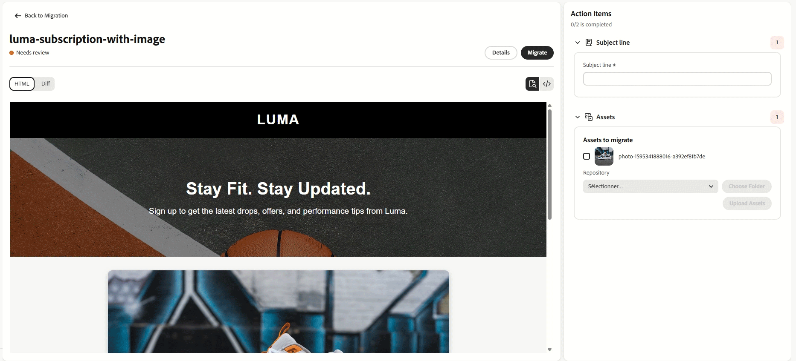
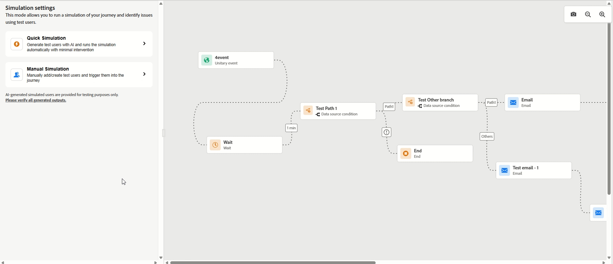
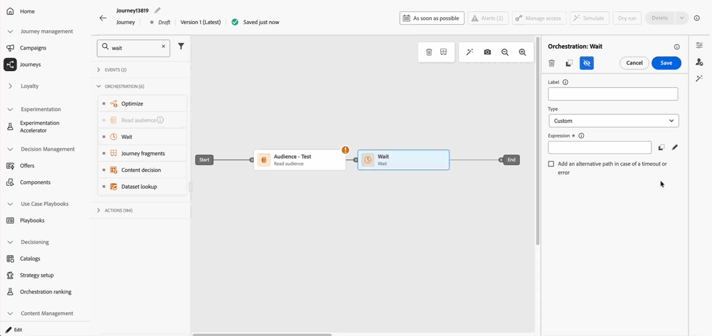
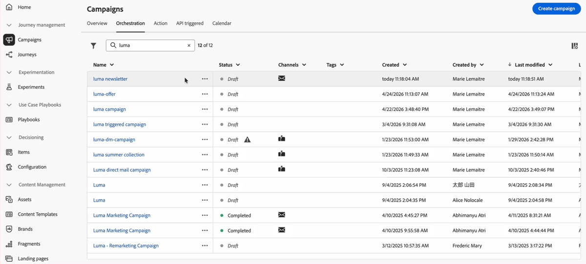
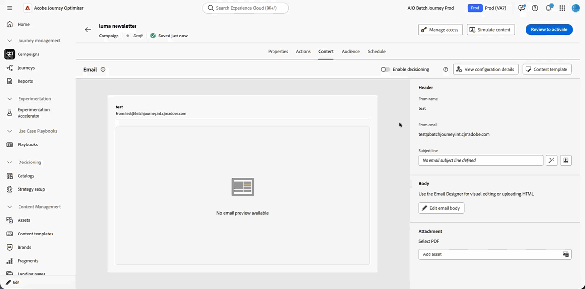
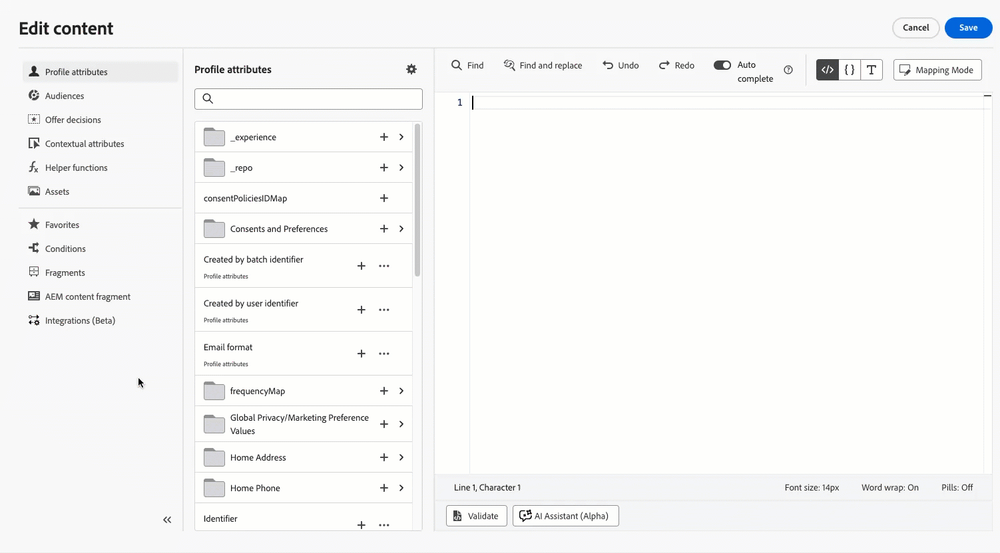
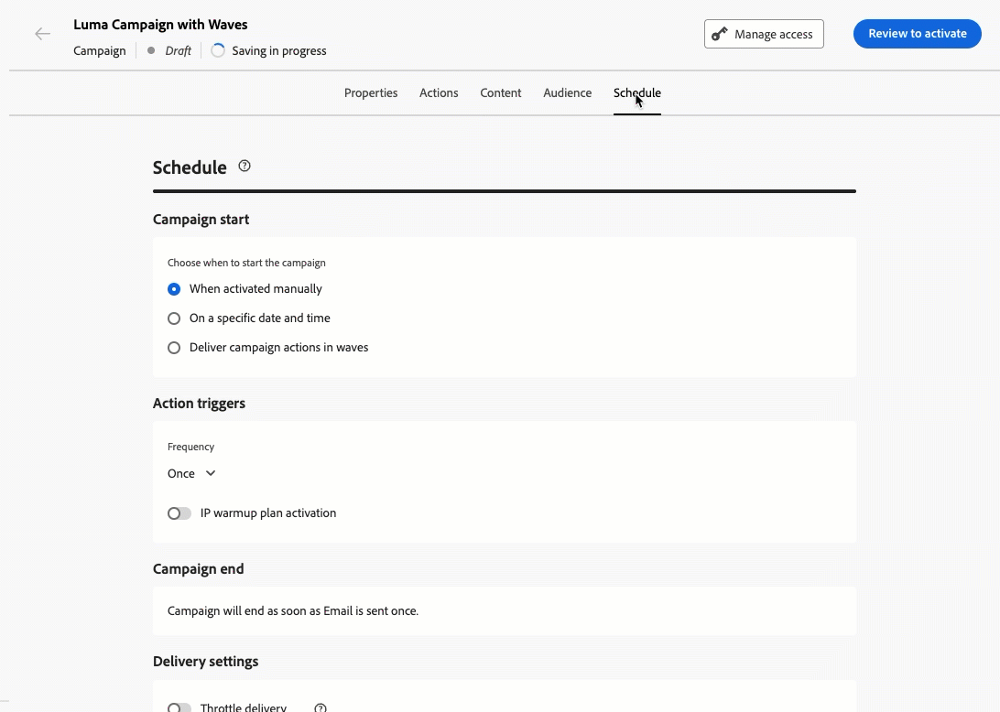
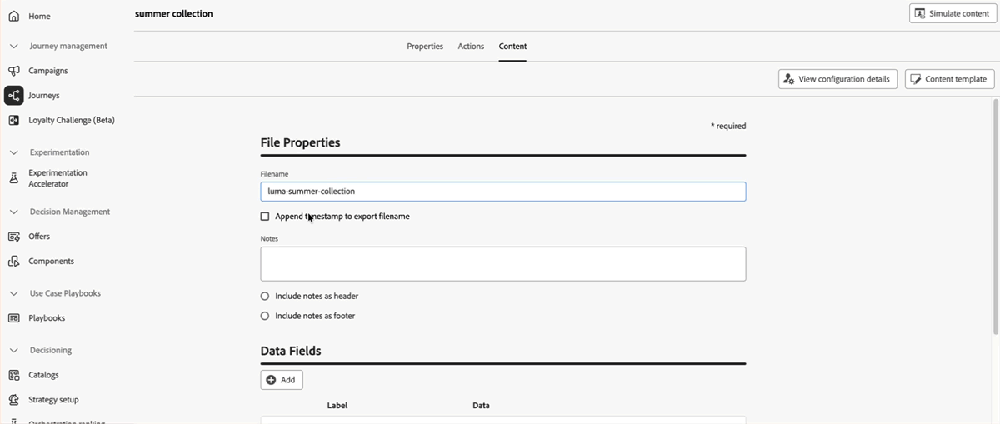

# Notas de la versión de 2026 {#release-notes-2026}

En esta página se indican todas las funciones y mejoras de [!DNL Journey Optimizer] lanzadas en 2026.

## Notas de la versión de julio de 2026 {#july-26-updates}

### Retos de lealtad {#july-26-loyalty}

Journey Optimizer presenta los retos de lealtad, una nueva funcionalidad de esta versión.

<table>
<thead>
<tr>
<th><strong>Retos de lealtad</strong> </th>
</tr>
</thead>
<tbody>
<tr>
<td>

Los retos de lealtad convierten las iniciativas de lealtad en experiencias atractivas y entretenidas que motivan a los clientes a realizar acciones valiosas, como efectuar compras, escribir opiniones o cualquier comportamiento deseado.

Los administradores pueden utilizar el menú de configuraciones de lealtad para conectar Journey Optimizer con el ecosistema de lealtad, incluidas las API de envío de recompensas, las definiciones de eventos, el inventario de productos, las exclusiones y la configuración de identidad. Los expertos en marketing pueden diseñar retos estándar, de racha o secuenciales, definir tareas y recompensas, ofrecer tarjetas de contenido de marca y mensajes y monitorizar el rendimiento con paneles de creación de informes impulsados por IA. Journey Optimizer genera los recorridos que organizan cada reto en segundo plano, de modo que los equipos puedan centrarse en la experiencia del cliente y las metas empresariales.

La lealtad también introduce habilidades de Coworker que permiten a los equipos realizar operaciones de retos clave de forma más eficiente, incluida la creación de retos, la configuración de propiedades de retos, la administración de públicos y la configuración relacionada y la revisión de perspectivas para monitorizar la participación en el reto y recompensar el rendimiento.

Esta funcionalidad solo está disponible para organizaciones con licencia para Journey Optimizer Loyalty. Para obtener acceso, póngase en contacto con su representante de Adobe.

Para obtener más información, consulte la <a href="../loyalty-challenges/get-started.md">documentación detallada</a>.

 Fecha de disponibilidad: 28 de julio de 2026

</td>
</tr>
</tbody>
</table>

### Canales {#july-26-channels}

En esta versión se han añadido las siguientes funcionalidades y mejoras.

<table>
<thead>
<tr>
<th><strong>Canal de salida personalizado</strong> </th>
</tr>
</thead>
<tbody>
<tr>
<td>

Journey Optimizer ahora presenta Canales personalizados, una nueva funcionalidad que permite a los administradores introducir cualquier canal de mensajería de salida basado en HTTP, como WeChat, Kakao Talk, Messenger o un proveedor propietario, directamente en Journey Optimizer a través de un Generador de canales sin código.

Una vez configurados, los canales personalizados están disponibles en cualquier campaña, recorrido y campaña orquestada, con el mismo conjunto completo de funcionalidades que los canales nativos: personalización con el editor de expresiones, experimentación de contenido, previsualización y prueba, creación de informes predeterminada y aplicación de consentimiento y gobernanza.

Esto llena un hueco que anteriormente se solucionaba con las acciones personalizadas, que se limitan únicamente a los recorridos y carecen de funcionalidades de canal dedicadas.

Actualmente, los canales de salida personalizados están disponibles como disponibilidad limitada. Para obtener acceso, póngase en contacto con su representante de Adobe.

Para obtener más información, consulte la <a href="../custom-channel/get-started-custom-channel.md">documentación detallada</a>.

 Fecha de disponibilidad: 31 de julio de 2026

</td>
</tr>
</tbody>
</table>

<table>
<thead>
<tr>
<th><strong>Optimización de canal</strong> </th>
</tr>
</thead>
<tbody>
<tr>
<td>

Ahora puede configurar un recorrido o una acción de campaña para incluir varios canales de salida (correo electrónico, push, SMS) y permitir que Journey Optimizer realice envíos automáticamente a través del mejor canal para cada cliente. Hay tres modos de optimización disponibles:

<ul>
<li>Clasificación manual: especifique el orden de canal preferido.</li>
<li>Preferencia del cliente: utilice el canal preferido del cliente desde su perfil (atributo Consentimientos y preferencias del modelo de datos de experiencia).</li>
<li>Clasificación basada en modelos de IA: utilice puntuaciones de tendencia de aprendizaje automático para deducir el canal más efectivo por cliente.</li>
</ul>

Cuando el canal con mejor clasificación no está disponible (no está incluido, está limitado por frecuencia o no está configurado), el sistema recurre al siguiente canal disponible.

Esta versión solo está disponible para un conjunto de organizaciones (disponibilidad limitada). Para obtener acceso, póngase en contacto con su representante de Adobe.

Para obtener más información, consulte la <a href="../building-journeys/channel-optimization.md">documentación detallada</a>.

Fecha de disponibilidad: 22 de julio de 2026

</td>
</tr>
</tbody>
</table>

* **Canal de WhatsApp; admite plantillas de flujo de WhatsApp**: ahora puede enviar plantillas de flujo de WhatsApp en Adobe Journey Optimizer para ofrecer experiencias interactivas en varias pantallas, como encuestas y captura de posibles clientes. Las respuestas se capturan al enviarlas y se almacenan como cargas JSON sin procesar en el nuevo conjunto de datos de evento de seguimiento de canal de Journey Optimizer:

  * **Conjunto de datos de evento de seguimiento de canal de AJO**: captura todas las respuestas de WhatsApp de entrada, incluidas las enviadas a través de plantillas de flujo de WhatsApp.

  [Más información](../data/get-started-datasets.md#system-datasets)

* **Integraciones mejoradas de proveedores personalizados, móvil**: las integraciones de proveedores personalizados ahora ofrecen una mayor flexibilidad con mensajería clave y actualizaciones de encabezados:

  * Personalización del encabezado: ahora puede editar el valor predeterminado del encabezado Content-Type y añadir hasta 10 parámetros de encabezado personalizados.

  * Compatibilidad con carga útil SMS: se ha añadido compatibilidad con las funciones de ayuda de Adobe Journey Optimizer en la carga útil SMS, incluido encode64.

### Administración {#july-26-administration}

En esta versión se han añadido las siguientes funcionalidades y mejoras a la administración y la gestión de datos.

<table>
<thead>
<tr>
<th><strong>Inclusión en la lista de permitidos IP del cortafuegos de la aplicación web</strong> </th>
</tr>
</thead>
<tbody>
<tr>
<td>

Adobe Journey Optimizer ahora admite la lista de permitidos de IP de cortafuegos de la aplicación web para páginas de destino, lo que permite a las organizaciones aplicar que todas las solicitudes entrantes se enruten exclusivamente a través de su infraestructura de cortafuegos de la aplicación web configurada. Con esta mejora, los clientes pueden configurar Journey Optimizer para que rechace cualquier solicitud directa que omita la capa del cortafuegos de la aplicación web, lo que garantiza que las directivas de seguridad definidas en herramientas como Imperva se apliquen de forma coherente.

Esta funcionalidad refuerza la posición de seguridad de las empresas con requisitos estrictos de acceso a la red, lo que les permite un control total del flujo de tráfico a sus páginas de destino alojadas en Journey Optimizer.

Para obtener más información, consulte la <a href="../configuration/waf-ip-allowlist.md">documentación detallada</a>.

Fecha de disponibilidad: 30 de julio de 2026

</td>
</tr>
</tbody>
</table>

* **Administrar dominios para personalización completa/básica de URL**: ahora puede crear y administrar dominios aprobados para personalización completa y básica de URL directamente desde la configuración de administración en Adobe Journey Optimizer, sin tener que ponerse en contacto con el soporte de Adobe. [Más información](../email/url-personalization.md#personalize-complete-base-url)

  Fecha de disponibilidad: 30 de julio de 2026

* **Mecanismos de protección de tiempo de vida de conjunto de datos (TTL), zonas protegidas existentes**: el mecanismo de protección de tiempo de vida (TTL) para conjuntos de datos generados por el sistema de Journey Optimizer (90 días en el almacén de perfiles, 13 meses en el lago de datos) se aplicará en **zonas protegidas y organizaciones de clientes existentes** a partir del **1 de octubre de 2026**. [Más información](../data/datasets-ttl.md#ttl-guardrail)

### Diseño de correo electrónico {#july-26-email}

En esta versión se han añadido las siguientes funcionalidades y mejoras al diseño de correos electrónicos.

<table>
<thead>
<tr>
<th><strong>Módulos en el diseñador de correo electrónico</strong> </th>
</tr>
</thead>
<tbody>
<tr>
<td>

El diseñador de correo electrónico ahora incluye una biblioteca de módulos de diseño listos para usar, como encabezados, tarjetas de producto, bloques de información y pies de página, que puede arrastrar y soltar directamente en el lienzo del correo electrónico.

Cada módulo viene preconfigurado con propiedades editables (imagen, título, texto, botón, vínculos) y se puede personalizar completamente a través de la interfaz de WYSIWYG, lo que acelera la creación de correos electrónicos sin necesidad de crear estructuras desde cero.

Para obtener más información, consulte la <a href="../email/email-modules.md">documentación detallada</a>.

Fecha de disponibilidad: 29 de julio de 2026

</td>
</tr>
</tbody>
</table>

<table>
<thead>
<tr>
<th><strong>Comprobación de contenido en el Diseñador de correo electrónico (disponibilidad general)</strong> </th>
</tr>
</thead>
<tbody>
<tr>
<td>

Journey Optimizer ahora incluye validación técnica automatizada directamente en el diseñador de correo electrónico, lo que le ayuda a detectar problemas de HTML y CSS antes de enviarlos.

Las comprobaciones cubren elementos no admitidos, como etiquetas <code>&lt;script&gt;</code> y <code>&lt;base&gt;</code>, divs vacíos que pueden romper el diseño en Microsoft Outlook, metaetiquetas de actualización HTML y umbrales de tamaño de CSS o HTML que activan los errores de procesamiento en Gmail.

Los resultados aparecen como errores, advertencias o avisos informativos directamente en el panel de creación, con detalles contextuales y correcciones con un solo clic cuando están disponibles, de modo que los problemas se pueden resolver sin salir del editor.

Esta funcionalidad, que antes estaba disponible en disponibilidad limitada, ya está disponible para todos los clientes.

Para obtener más información, consulte la <a href="../email/content-check.md">documentación detallada</a>.

Fecha de disponibilidad: 16 de julio de 2026

</td>
</tr>
</tbody>
</table>

* **Compatibilidad con fragmentos de expresión en`<head>`**: ahora los fragmentos de expresión se pueden usar en `<head>` de las plantillas de correo electrónico. Esto le permite centralizar el estilo de cualquier código personalizado en un solo fragmento y reutilizarlo en varias plantillas. Cuando se actualiza y vuelve a publicar un fragmento, todos los correos electrónicos creados a partir de plantillas que hacen referencia a él heredan de manera automática el código más reciente, lo que elimina la necesidad de actualizar manualmente cada correo electrónico de forma individual. [Más información](../personalization/use-expression-fragments.md)

  Fecha de disponibilidad: 29 de julio de 2026

### Recorridos {#july-26-journeys}

En esta versión se han añadido las siguientes funciones y mejoras a los recorridos.
<table>
<thead>
<tr>
<th><strong>Nueva interfaz de usuario</strong> </th>
</tr>
</thead>
<tbody>
<tr>
<td>

Se ha presentado una <b>nueva interfaz de usuario</b> para el lienzo de recorrido, que ofrece un rendimiento mejorado para recorridos grandes, un diseño automático para una mejor legibilidad y una experiencia de creación guiada.

Para cambiar a la nueva IU, haga clic en el botón <b>Nueva experiencia</b>. Esta configuración se guarda en el nivel de recorrido, por lo que el recorrido se vuelve a abrir en la nueva experiencia de forma predeterminada. Para volver, haga clic en <b>Experiencia anterior</b>. <a href="../building-journeys/using-the-journey-designer.md#canvas-capabilities">Más información</a>.

 Fecha de disponibilidad: 16 de julio de 2026

</td>
</tr>
</tbody>
</table>

* [!BADGE Obsolescencia]{type=Negative} **Los públicos por lotes ya no son compatibles con el nodo de calificación de público y los criterios de salida**: a partir de septiembre de 2026, Journey Optimizer bloqueará la publicación de cualquier recorrido que utilice un público por lotes en un nodo de calificación de público o en los criterios de salida. Ya aparece una advertencia de validación en el lienzo del recorrido.  Los recorridos activos existentes no se ven afectados. Los recorridos nuevos, en borrador y duplicados que incluyen esta configuración deben actualizarse antes de septiembre de 2026. Utilice un público de streaming en el nodo de calificación de público o cambie a una actividad Leer público. Para los criterios de salida, utilice un público de streaming. [Aprenda a migrar sus recorridos](../building-journeys/aq-batch-audiences-migration.md)

* **Públicos externos en la simulación del recorrido**: la simulación del recorrido ahora admite públicos externos. Al simular recorridos dirigidos a públicos de CSV o de composición de público federado, puede burlar los atributos de enriquecimiento de dichos públicos directamente a través del formulario de la IU o una importación JSON. La IU muestra dinámicamente solo los atributos de enriquecimiento específicos utilizados en la lógica de recorrido, lo que permite la validación precisa de las ramas de decisión y las reglas de personalización antes de su lanzamiento. [Más información](../building-journeys/simulate-journey.md)

  Fecha de disponibilidad: 29 de julio de 2026

* **Protección de disyuntor para extremos de acción personalizados lentos**: Para los extremos enrutados a través del servicio de acción personalizada lenta, Journey Optimizer ahora limita temporalmente todas las llamadas durante un máximo de 5 minutos cuando más del 20 % de las llamadas en una ventana de 120 segundos exceden los 5 segundos, si hay al menos 200 llamadas en la ventana de observación de 120 segundos. Esto ayuda a evitar sobrecargar puntos finales que ya son lentos. [Más información](../configuration/external-systems.md#response-time)

  Fecha de disponibilidad: 29 de julio de 2026. Esta funcionalidad se está implementando gradualmente en todas las regiones.

### Campañas orquestadas {#july-26-oc}

Las siguientes funcionalidades y mejoras estarán disponibles en las campañas orquestadas en esta versión.

<table>
<thead>
<tr>
<th><strong>Segmentación basada en archivos en campañas orquestadas</strong> </th>
</tr>
</thead>
<tbody>
<tr>
<td>

Las campañas orquestadas ahora admiten la carga de un <strong>archivo CSV o TXT</strong> directamente en el lienzo de campaña como público de segmentación, sin ingerir primero el archivo en Adobe Experience Platform. Los datos del archivo se consumen en el momento de la ejecución y no se conservan como un conjunto de datos de Adobe Experience Platform. Durante la configuración del archivo, puede definir asignaciones de columnas, tipos de datos, control de valores NULL y directivas de error por columna. Las filas que no superan la validación se rechazan y registran antes de que se ejecute la campaña, lo que mantiene el público limpio sin preprocesamiento manual. Esto es especialmente adecuado para envíos específicos o campañas de listas de socios en las que no es práctico crear una canalización de ingesta completa.

Para obtener más información, consulte la <a href="../orchestrated/activities/load-file.md">documentación detallada</a>.

 Fecha de disponibilidad: 6 de julio de 2026

</td>
</tr>
</tbody>
</table>

* **Ver permiso de transiciones de campaña orquestada**: se ha añadido un nuevo permiso **Ver transiciones de campaña orquestada** para reemplazar la opción **Ver archivo en campañas orquestadas** heredada. Este cambio le permite ocultar los resultados de la vista previa en las transiciones de campaña para garantizar el cumplimiento de la normativa sobre información de identificación personal.

  Fecha de disponibilidad: 29 de julio de 2026

  [Más información](../administration/ootb-permissions.md)

### Toma de decisiones {#decisioning}

* **Creación de reglas de toma de decisiones a partir de la expresión en lenguaje natural**: ahora puede describir la regla de toma de decisiones que desea crear en un lenguaje sencillo y permitir que la IA la genere por usted. Esta funcionalidad está disponible para los clientes con acceso a las funcionalidades de Adobe AI.

  Esta funcionalidad está disponible para las organizaciones con acceso a las funcionalidades de Adobe AI. Solo está disponible para un conjunto de organizaciones (disponibilidad limitada). Para obtener acceso, póngase en contacto con su representante de Adobe.

  Fecha de disponibilidad: 29 de julio de 2026

  [Más información](../experience-decisioning/rules.md#build-rule-with-ai)

* **Atributos personalizados de elementos de decisión dinámicos**: los atributos personalizados de elementos de decisión ahora se pueden personalizar en el momento del envío mediante datos de perfil, contextuales y de público. Esto elimina la necesidad de mantener ofertas duplicadas para variaciones de contenido menores, lo que permite a los especialistas en marketing administrar menos elementos de decisión más flexibles. [Más información](../experience-decisioning/items.md#attributes)

  Fecha de disponibilidad: 27 de julio de 2026

* **Simulación de reglas de decisión y fórmulas de clasificación**: ahora puede simular las reglas de decisión y las fórmulas de clasificación directamente desde el editor de reglas o de fórmulas. Añada variantes de prueba manuales o genérelas mediante IA y, a continuación, ejecute la expresión con los datos de prueba para validar la idoneidad y revisar los resultados de clasificación, todo antes de implementarlos en producción. La generación de variantes está disponible para los clientes con acceso a las funcionalidades de Adobe AI.

  Esta versión solo está disponible para un conjunto de organizaciones (disponibilidad limitada). Para obtener acceso, póngase en contacto con su representante de Adobe.

  Fecha de disponibilidad: 29 de julio de 2026

  [Más información sobre la simulación de reglas](../experience-decisioning/rules.md) | [Más información sobre la simulación de fórmulas de clasificación](../experience-decisioning/ranking/ranking-formulas.md)

### Gestión de contenidos {#july-26-content}

En esta versión se han añadido las siguientes funcionalidades y mejoras a la gestión de contenidos.

<table>
<thead>
<tr>
<th><strong>Funcionalidades de adopción guiada</strong> </th>
</tr>
</thead>
<tbody>
<tr>
<td>

La transición a Adobe Journey Optimizer desde otra plataforma de marketing es más sencilla gracias a las funcionalidades guiadas que le ayudan a trasladar el contenido y los recorridos de correo electrónico existentes a Journey Optimizer. Un espacio de trabajo dedicado le permite reutilizar lo que tiene en lugar de reconstruirlo desde cero.

Esta versión solo está disponible para un conjunto de organizaciones (disponibilidad limitada). Para obtener acceso, póngase en contacto con su representante de Adobe.

Para obtener más información, consulte la <a href="../start/migrate-content-and-journeys.md">documentación detallada</a>.

 Fecha de disponibilidad: 30 de julio de 2026

</td>
</tr>
</tbody>
</table>

* **Nuevas funciones de ayuda en las expresiones de personalización**: las nuevas funciones de ayuda ya están disponibles en las expresiones de personalización:

  * `appendQueryParams`: anexa un parámetro de consulta a una URL o lo reemplaza si la clave ya existe.
  * `dateBetween`: comprueba si una fecha se encuentra dentro de un intervalo de fechas de inicio y finalización (incluido).
  * `equalsAnyIgnoreCase`: devuelve “verdadero” cuando una cadena coincide con cualquier valor proporcionado, sin distinguir mayúsculas y minúsculas.
  * `getUrlFragment`: extrae la parte de fragmento de una URL (la parte posterior a #).
  * `join`: concatena elementos de matriz en una sola cadena utilizando un separador.
  * `decode64`: descodifica una cadena codificada en Base64. Si la entrada no es Base64 válida, la cadena de entrada original se devuelve sin cambiar.
  * `parseJson`: analiza una cadena JSON en una variable estructurada que se puede utilizar en la plantilla.
  * `valueAtPath`: asigna un valor de una ruta de datos a una variable de plantilla, con indexación opcional para extraer un elemento específico de matrices o colecciones.
  * `abort`: detiene el envío del mensaje cuando se alcanza durante el procesamiento.

  La función `concat` también se ha mejorado y ahora admite dos o más argumentos.

  Además, las siguientes funciones de migración de plantillas ya están disponibles para ayudarle a migrar plantillas existentes a Journey Optimizer:

  * `ampCompare`: compara dos valores utilizando el operador de comparación especificado.
  * `ampSubstr`: devuelve una parte de una cadena entre los índices de inicio y fin especificados.
  * `compareTo`: compara dos cadenas lexicográficamente.

  [Más información sobre las funciones de ayuda](../personalization/functions/functions.md)

  Fecha de disponibilidad: 28 de julio de 2026

* **Se ha cambiado el nombre de “Asistente de IA” a “Generar contenido”**: se ha cambiado el nombre del “Asistente de IA” a “Generar contenido” en Adobe Journey Optimizer. Esta actualización se limita a los nombres y la terminología; no se han introducido cambios funcionales. Se ha cambiado el nombre de las etiquetas de navegación, los botones, los menús y los cuadros de diálogo para la generación de contenido, la generación de imágenes, las expresiones de personalización y la experimentación de contenido de “Asistente de IA” a “Generar contenido”.

  Fecha de disponibilidad: 30 de julio de 2026

* **Mejoras multilingües**: ahora se puede duplicar la configuración de idioma a partir de una configuración activa existente, por lo que ya no es necesario reconstruir completamente una configuración para hacer cambios. También puede copiar una condición de una configuración regional a otra durante la creación de la Configuración de idioma, lo que optimiza la configuración para sitios con muchos idiomas.

  Fecha de disponibilidad: 30 de julio de 2026

### Contenido e integraciones {#july-26-integration}

Las siguientes mejoras estarán disponibles en la gestión de contenidos e integraciones en esta versión.

<table>
<thead>
<tr>
<th><strong>Temporizador de cuenta atrás con Dynamic Media</strong> </th>
</tr>
</thead>
<tbody>
<tr>
<td>

<strong>Integración de Dynamic Media de Journey Optimizer y Adobe Experience Manager</strong> permite la personalización en tiempo abierto para plantillas de Dynamic Media, lo que desbloquea casos de uso hiperpersonalizados. Los clientes pueden crear y publicar plantillas personalizadas en Adobe Experience Manager y utilizarlas en Journey Optimizer, con datos procesados en el momento de la apertura.

Para obtener más información, consulte la <a href="../integrations/aem-dynamic.md#countdown">documentación detallada</a>.

 Fecha de disponibilidad: 30 de julio de 2026

</td>
</tr>
</tbody>
</table>

* **Nuevas herramientas del servidor MCP de AJO**: el servidor MCP de [!DNL Adobe Journey Optimizer] ahora expone cinco **herramientas de configuración de canal** de solo lectura adicionales, lo que le permite consultar las configuraciones de canal, los recursos de soporte y las acciones de marketing directamente desde su Asistente de IA. Ahora puede usar **Enumerar configuraciones de canal** (en todos los canales de AJO), **Obtener configuración de canal**, **Enumerar recursos de configuración**, **Obtener recurso de configuración** y **Enumerar acciones de marketing**. [Más información](../integrations/ajo-mcp.md#mcp-tools)

  Fecha de disponibilidad: 9 de julio de 2026

### Creación de informes {#july-26-reporting}

Las siguientes mejoras se incorporarán en la creación de informes en esta versión.

* **Nuevas métricas estimadas de clics para la creación de informes de correo electrónico**: para proporcionar una vista más precisa de la participación real de los clientes, ahora hay disponibles nuevas métricas estimadas en los informes activos de recorridos, campañas y canales.

  * CTR (Porcentaje de clics) estimado: se calcula como una estimación de clics en relación con la cantidad total de mensajes enviados.

  * CTOR (Porcentaje de clic-para-abrir) estimado: se calcula como una estimación de clics en relación con el número total de aperturas estimadas.

    Fecha de disponibilidad: 29 de julio de 2026

### Mejoras de uso {#july-26-usability}

* **Métodos abreviados de inicio rápido en el inventario de fragmentos**: ahora puede acceder rápidamente a las acciones comunes desde la lista de fragmentos con el botón **[!UICONTROL Más acciones]**. Los métodos abreviados disponibles incluyen editar el fragmento, abrir sus detalles y descartar la versión de borrador. [Más información](../content-management/manage-fragments.md#quick-launch-fragments)

  

* **Métodos abreviados de inicio rápido en el inventario de plantillas**: el botón **[!UICONTROL Más acciones]** de la lista Plantillas de contenido ahora proporciona acceso rápido a acciones comunes, como editar detalles de plantilla, simular contenido y eliminar una plantilla. También hay disponibles métodos abreviados adicionales específicos del canal: para plantillas de correo electrónico, edite el cuerpo del correo electrónico, vea o envíe una prueba, ejecute un informe de correo no deseado y procese el correo electrónico; para plantillas de SMS, compruebe el recuento de caracteres y el número de segmentos. [Más información](../content-management/access-content-templates.md#edit)

  

## Notas de la versión de junio de 2026 {#june-26-rn}

### Recorridos {#june-26-journeys}

En esta versión se han añadido las siguientes funciones y mejoras a los recorridos. También se esperan cambios adicionales en los próximos días o semanas.

<table>
<thead>
<tr>
<th><strong>Simulación del recorrido (disponibilidad general)</strong> </th>
</tr>
</thead>
<tbody>
<tr>
<td>

Ahora puede establecer su recorrido en Simulación. Este modo le permite validar su lógica usando usuarios simulados. Son perfiles temporales creados específicamente para la simulación, lo que le permite realizar pruebas libremente sin necesidad de administrar perfiles de prueba persistentes en Adobe Experience Platform. 

La simulación del recorrido, que se lanzó anteriormente con disponibilidad limitada, ya está disponible en todos los entornos. Con esta versión de Disponibilidad general, ahora puede utilizar Journey Agent para generar usuarios y eventos simulados directamente en el menú Simulación.

Para obtener más información, consulte la <a href="../building-journeys/simulate-journey-gs.md">documentación detallada</a>.

Fecha de disponibilidad: 9 de junio de 2026

</td>
</tr>
</tbody>
</table>

<table>
<thead>
<tr>
<th><strong>Fragmentos de recorrido (disponibilidad general)</strong> </th>
</tr>
</thead>
<tbody>
<tr>
<td>

Ahora puede crear <strong>fragmentos de recorrido</strong> en Adobe Journey Optimizer. Los fragmentos de recorrido son conjuntos reutilizables de nodos de recorrido que puede generar una vez y soltarlos en cualquier recorrido de la zona protegida. Tanto si se trata de una comprobación de elegibilidad, una lógica de enrutamiento de canal preferida o una secuencia de bienvenida, los fragmentos ayudan a los equipos a moverse más rápido y a mantenerse coherentes, sin reconstruir la misma lógica desde cero cada vez.

Una vez creados, los fragmentos se almacenan en un <strong>inventario de fragmentos</strong> específico y se pueden insertar en cualquier recorrido mediante la actividad <strong>Fragmentos de recorrido</strong>.

Esta funcionalidad, que antes estaba disponible en disponibilidad limitada, ya está disponible para todos los clientes. Los fragmentos de recorrido también admiten <strong>herramientas de zona protegida</strong>, que le permiten realizar paquetes y exportar fragmentos en zona protegidas.

Para obtener más información, consulte la <a href="../building-journeys/journey-fragments.md">documentación detallada</a>.

Fecha de disponibilidad: 9 de junio de 2026

</td>
</tr>
</tbody>
</table>

<table>
<thead>
<tr>
<th><strong>Optimización de la ruta del recorrido: segmentación (disponibilidad general)</strong> </th>
</tr>
</thead>
<tbody>
<tr>
<td>

La <strong>actividad de optimización</strong> ahora admite <strong>reglas de segmentación</strong> que le permiten definir criterios específicos que los clientes deben cumplir para calificar para una ruta de recorrido en particular, según segmentos de público o atributos de perfil.

A diferencia de la experimentación, en la que los clientes se asignan a rutas de forma aleatoria, la segmentación utiliza una lógica determinista para garantizar que el público o el perfil de cliente adecuados se enruten a la ruta deseada.

Esta funcionalidad, lanzada anteriormente con disponibilidad limitada, ya está disponible en todos los entornos (disponibilidad general).

Para obtener más información, consulte la <a href="../building-journeys/path-targeting.md">documentación detallada</a>.

Fecha de disponibilidad: 8 de junio de 2026

</td>
</tr>
</tbody>
</table>

<table>
<thead>
<tr>
<th><strong>Asistente de IA para expresiones de recorrido (versión Beta pública)</strong> </th>
</tr>
</thead>
<tbody>
<tr>
<td>

El asistente de IA ahora funciona en el editor de expresiones avanzadas del recorrido para convertir las indicaciones de datos en lenguaje natural en expresiones válidas y lógica condicional. Describa la personalización que desea lograr y el Asistente de IA generará un código listo para usar que puede aplicar inmediatamente o perfeccionar mediante indicaciones de seguimiento.

Esta funcionalidad está actualmente disponible para todos los clientes en versión Beta pública.

Para obtener más información, consulte la <a href="../building-journeys/expression/generate-expression.md">documentación detallada</a>.

Fecha de disponibilidad: 3 de junio de 2026
 
</td>
</tr>
</tbody>
</table>

* [!BADGE Obsolescencia]{type=Negative} **Los públicos por lotes ya no son compatibles con el nodo de calificación de público y los criterios de salida**: a partir de septiembre de 2026, Journey Optimizer bloquea la publicación de cualquier recorrido que utilice un público por lotes en un nodo de calificación de público o en los criterios de salida. Los recorridos activos existentes no se ven afectados. Los recorridos nuevos, en borrador y duplicados que incluyen esta configuración deben actualizarse antes de septiembre de 2026. Utilice un público de streaming en el nodo de calificación de público o cambie a una actividad Leer público. Para los criterios de salida, utilice un público de streaming. [Aprenda a migrar sus recorridos](../building-journeys/aq-batch-audiences-migration.md)

* **Detener un recorrido pausado directamente**: ahora puede detener un recorrido directamente desde el estado **Pausado**. Anteriormente, un recorrido pausado tenía que reanudarse como **Activo** antes de que se pudiera detener. [Más información](../building-journeys/journey-pause.md#stop-close-paused)

  Fecha de disponibilidad: 18-22 de junio de 2026

* **Compatibilidad con identificadores suplementarios para públicos externos**. Ahora se admiten identificadores suplementarios en los recorridos para públicos externos, incluyendo los públicos importados de un archivo CSV y públicos creados con la composición de público federado. Puede designar cualquier atributo que no sea de identidad o de identidad no personal del público como ID suplementario; no se requiere etiquetado de esquema. [Más información](../building-journeys/supplemental-identifier.md)

  Fecha de disponibilidad: 11 de junio de 2026

* **Parada automática de recorridos de público de lectura no recurrentes**: los recorridos del **público de lectura** no recurrentes pasan ahora automáticamente al estado **Detenido** una vez que el último perfil activo sale del recorrido. Anteriormente, estos recorridos permanecían **Activos** hasta que expiraba el tiempo de espera global de 91 días, incluso cuando ya no circulaba ningún perfil por ellos. Con esta mejora, el estado del recorrido refleja el estado de ejecución real en cuanto se completa, lo que mantiene el inventario de recorridos preciso sin intervención manual.

  Tenga en cuenta que este comportamiento no se aplica a los recorridos que incluyen nodos que generan períodos de espera, como nodos de espera, nodos de reacción o transiciones activadas por eventos. Estos recorridos siguen estando sujetos al tiempo de espera global estándar de 91 días. [Más información](../building-journeys/end-journey.md#auto-stop-non-recurring)

  Fecha de disponibilidad: 9 de junio de 2026

* **Autenticación personalizada basada en certificados en acciones personalizadas**: las acciones personalizadas ahora admiten la autenticación personalizada basada en certificados. Al añadir `subType: "certificateCredential"` a una configuración de autorización personalizada, Journey Optimizer utiliza el certificado administrado de Adobe para firmar una declaración de cliente JWT e intercambiarla por un token de acceso (no se requiere secreto de cliente). Se ha diseñado para las API empresariales que aplican la verificación de identidad basada en certificados, como Microsoft Entra ID. [Más información](../datasource/external-data-sources.md#certificate-credential)

  Fecha de disponibilidad: 4 de junio de 2026

* **Aumento del límite de recorridos activos y nuevos mecanismos de protección**: ahora puede tener hasta **200 recorridos activos**, más que el límite anterior de 100. [Más información](../start/guardrails.md#journeys-guardrails-journeys)

  Fecha de disponibilidad: 18 de junio de 2026. Esta funcionalidad se implementará gradualmente en todas las regiones en los próximos días.

### Campañas orquestadas {#june-26-oc}

Las siguientes funcionalidades y mejoras estarán disponibles en las campañas orquestadas en esta versión.

* **Personalización basada en bucles para datos relacionales**: el editor de personalización ahora admite un bloque de bucles que se repite en colecciones relacionales, como pedidos, cuentas o reservas, y procesa un bloque de contenido por registro en un solo correo electrónico o SMS. Las colecciones se configuran mediante el selector de datos utilizando tokens de personalización, sin necesidad de escribir expresiones. [Más información](../orchestrated/add-personalization.md#enrichment-collections)

  Fecha de disponibilidad: 26 de junio de 2026

### Toma de decisiones {#june-26-decisioning}

En esta versión se han añadido las siguientes funcionalidades y mejoras a la toma de decisiones.

<table>
<thead>
<tr>
<th><strong>Compatibilidad con la toma de decisiones en el canal de correo directo</strong> </th>
</tr>
</thead>
<tbody>
<tr>
<td>

Ahora puede añadir políticas de decisión a recorridos de correo electrónico directo y campañas. Las políticas de decisión son contenedores para sus ofertas que aprovechan el motor de Toma de decisiones para devolver de forma dinámica el mejor contenido para cada miembro del público. La toma de decisiones por correo directo también admite casos de uso de toma de decisiones por lotes, lo que le permite exportar los elementos de oferta correspondientes para cada perfil en una público determinado de Adobe Experience Platform. 

Para obtener más información, consulte la <a href="../experience-decisioning/use-decision-policy.md">documentación detallada</a>.

Fecha de disponibilidad: 3 de junio de 2026

</td>
</tr>
</tbody>
</table>

* **Aprovechar los fragmentos de contenido de Adobe Experience Manager en la toma de decisiones**: ahora puede asignar fragmentos de contenido de Adobe Experience Manager a elementos de decisión en la toma de decisiones y aprovecharlos dentro de las directivas de decisión para suministrar el fragmento adecuado al cliente adecuado en el momento adecuado. Esta funcionalidad, lanzada anteriormente con disponibilidad limitada, ya está disponible en todos los entornos (disponibilidad general). [Más información](../experience-decisioning/fragments-decision-policies.md)

  Fecha de disponibilidad: 18 de junio de 2026

### Gestión de contenidos {#june-26-content}

En esta versión se han añadido las siguientes funcionalidades y mejoras a la gestión de contenidos.

<table>
<thead>
<tr>
<th><strong>Simular variaciones de contenido: experiencia actualizada y generación de variantes de IA</strong> </th>
</tr>
</thead>
<tbody>
<tr>
<td>

Hay dos actualizaciones disponibles para el flujo de trabajo <strong>Simular contenido</strong>:

<ul>
<li><strong>Nueva ruta predeterminada</strong>: al hacer clic en <strong>Simular contenido</strong>, ahora se abre la experiencia <strong>Simular variaciones de contenido</strong> de forma predeterminada. Desde una sola pantalla, puede añadir una entrada de muestra manualmente o desde un archivo CSV o JSON, reutilizar usuarios simulados, previsualizar el procesamiento y enviar pruebas. Para obtener una vista previa con perfiles de prueba de Adobe Experience Platform, enviar pruebas con datos de perfil de prueba o comprobar el procesamiento de la bandeja de entrada del correo electrónico y los informes de correo no deseado, haga clic en <strong>Simular contenido</strong> y, a continuación, seleccione <strong>Simular contenido (perfiles de AEP)</strong> en el menú desplegable.</li>
<li><strong>Variantes de contenido generadas por IA</strong>: en la experiencia <strong>Simular variaciones de contenido</strong>, haga clic en <strong>Generar</strong> para usar IA y crear automáticamente variantes de contenido. El sistema analiza el mensaje, detecta los campos de personalización y las ramas condicionales y rellena valores realistas para que pueda validar el procesamiento sin crear cada variante de forma manual.</li>
</ul>

Para obtener más información, consulte la <a href="../test-approve/simulate-sample-input.md">documentación detallada</a>.

Fecha de disponibilidad: 9 de junio de 2026

</td>
</tr>
</tbody>
</table>

### Canal de correo electrónico {#june-26-email}

En esta versión se han añadido las siguientes mejoras al canal de correo electrónico.

* **Cifrado de parámetro de URL**: ahora puede cifrar parámetros de URL en los vínculos de seguimiento y página de destino añadidos a sus mensajes de correo electrónico. Esto proporciona una capa adicional de seguridad para los datos de parámetros confidenciales. Esta funcionalidad, lanzada anteriormente con disponibilidad limitada, ya está disponible en todos los entornos (disponibilidad general). [Más información](../personalization/url-parameter-encryption.md)

  Fecha de disponibilidad: 1 de junio de 2026

* **Nuevos permisos para el registro de claves**: ahora se necesitan dos nuevos permisos para acceder y administrar las claves necesarias para el cifrado de parámetros de URL: **Administrar el registro de claves** y **Ver el registro de claves**. [Más información](../administration/high-low-permissions.md#administration-permissions)

  Fecha de disponibilidad: 1 de junio de 2026

<table>
<thead>
<tr>
<th><strong>Optimización de tamaño de correo electrónico</strong> </th>
</tr>
</thead>
<tbody>
<tr>
<td>

Journey Optimizer ahora incluye una opción para reducir el tamaño del HTML del correo electrónico eliminando los espacios en blanco, los comentarios y el código redundante innecesarios, sin afectar al procesamiento del correo electrónico.

Esto puede mejorar la entregabilidad al evitar los umbrales de tamaño que algunos proveedores de correo electrónico utilizan para marcar o rechazar mensajes y puede reducir el tiempo de carga de los destinatarios.

Para obtener más información, consulte la <a href="../email/create-email.md#optimize-html-size">documentación detallada</a>.

Fecha de disponibilidad: 26 de junio de 2026

</td>
</tr>
</tbody>
</table>

<table>
<thead>
<tr>
<th><strong>Texto enriquecido en campos editables de fragmentos</strong> </th>
</tr>
</thead>
<tbody>
<tr>
<td>

Ahora puede añadir texto enriquecido a fragmentos personalizables que se utilizan en el contenido de los correos electrónicos.

Por ejemplo, al utilizar el componente Texto como campo editable en el diseñador de correo electrónico, puede dar formato directamente al contenido (por ejemplo, negrita y cursiva) e insertar hipervínculos.

Para obtener más información, consulte la <a href="../content-management/customizable-fragments.md#rich-text-visual">documentación detallada</a>.

Fecha de disponibilidad: 19 de junio de 2026

</td>
</tr>
</tbody>
</table>

<table>
<thead>
<tr>
<th><strong>Comprobación de contenido en el Diseñador de correo electrónico (disponibilidad limitada)</strong> </th>
</tr>
</thead>
<tbody>
<tr>
<td>

Journey Optimizer ahora incluye validación técnica automatizada directamente en el diseñador de correo electrónico, lo que le ayuda a detectar problemas de HTML y CSS antes de enviarlos.

Las comprobaciones cubren elementos no admitidos, como etiquetas <code>&lt;script&gt;</code> y <code>&lt;base&gt;</code>, divs vacíos que pueden romper el diseño en Microsoft Outlook, metaetiquetas de actualización HTML y umbrales de tamaño de CSS o HTML que activan los errores de procesamiento en Gmail.

Los resultados aparecen como errores, advertencias o avisos informativos directamente en el panel de creación, con detalles contextuales y correcciones con un solo clic cuando están disponibles, de modo que los problemas se pueden resolver sin salir del editor.

Esta versión solo está disponible para un conjunto de organizaciones (disponibilidad limitada). Para obtener acceso, póngase en contacto con su representante de Adobe.

Para obtener más información, consulte la <a href="../email/content-check.md">documentación detallada</a>.

Fecha de disponibilidad: 18 de junio de 2026

</td>
</tr>
</tbody>
</table>

* **Conversor mejorado de imagen a HTML**: ya está disponible una nueva versión de la función de conversión de imagen a HTML, que ofrece una precisión mejorada para la generación de HTML. Esta actualización aprovecha los modelos LLM de nivel superior para ofrecer una salida de HTML más precisa y fiable a partir de las entradas de imagen.

  Fecha de disponibilidad: 18 de junio de 2026

### Contenido e integraciones {#june-26-integration}

Las siguientes funcionalidades y mejoras estarán disponibles en la gestión de contenidos e integraciones en esta versión.

<table>
<thead>
<tr>
<th><strong>Mejoras en los fragmentos de contenido de Adobe Experience Manager en Journey Optimizer</strong> </th>
</tr>
</thead>
<tbody>
<tr>
<td>

Esta versión incorpora varias mejoras para que los <strong>fragmentos de contenido de Adobe Experience Manager</strong> se puedan usar, controlar y estén más preparados para la producción dentro de los flujos de trabajo de creación de Journey Optimizer:

<ul>
<li>Journey Optimizer ahora admite la obtención de fragmentos de contenido desde varias configuraciones de Adobe Experience Manager, incluidos los niveles de creación, publicación y publicación autenticada.</li>
<li>Una vez seleccionado un fragmento, su contexto se conserva en todo el mensaje, lo que permite a los autores reutilizar los campos de fragmento en bloques de contenido sin volver a seleccionar.</li>
<li>Se ha introducido una nueva página de lista de fragmentos de contenido en Journey Optimizer para mejorar la administración del ciclo vital; los usuarios pueden identificar fragmentos no sincronizados y activar la sincronización manual para mantenerse al día.</li>
<li>La compatibilidad con la configuración regional y las variaciones ahora permite a los especialistas en marketing trabajar con versiones alternativas del mismo fragmento de contenido de forma más deliberada.</li>
<li>Ahora tiene flexibilidad en la forma en que Adobe Journey Optimizer accede al contenido de Adobe Experience Manager. Esta versión incluye la capacidad de <strong>cambiar el repositorio de origen</strong> para los fragmentos de contenido utilizados en sus recorridos y campañas.</li>
<li>Al ser compatible con <b>Managed Services</b>, ahora puede ver, acceder y usar fragmentos de contenido de Adobe Experience Manager directamente en Journey Optimizer para su personalización. Simplemente añada la URL del repositorio de Adobe Experience Manager Managed Services en los ajustes de configuración como una configuración única.</li>
</ul>

Para obtener más información, consulte la <a href="../integrations/aem-fragments-gs.md">documentación detallada</a>.

Fecha de disponibilidad: 18 de junio de 2026

</td>
</tr>
</tbody>
</table>

<!--
+++ Coming soon — **Information below is subject to change.**

<table>
<thead>
<tr>
<th><strong>AI assistant integration with Adobe Experience Manager Asset Essentials</strong> </th>
</tr>
</thead>
<tbody>
<tr>
<td>

The AI Assistant now automatically fetches <b>brand-approved images</b> directly from your Adobe Experience Manager Assets when generating Emails, Web pages, and Push notifications. This eliminates the need to manually search the Assets or rely on generic AI fallbacks, ensuring every visual is perfectly accurate and brand-compliant.

</td>
</tr>
</tbody>
</table>

<table>
<thead>
<tr>
<th><strong>AI Assistant for content generation enhancements</strong> </th>
</tr>
</thead>
<tbody>
<tr>
<td>

This release improves the <strong>AI Assistant</strong> content generation experience with stronger image editing, more reliable brand extraction, and content authenticity support in the image flow:

<ul>
<li><strong>AI image editing</strong> is now available in the image generation flow, including Firefly third-party model support, so you can refine source images without leaving the assistant.</li>
<li><strong>Brand signal extraction</strong> delivers higher-quality results. When selected pages lack sufficient signal, improved fallbacks now populate colors, typography, writing guidelines, and other brand attributes.</li>
<li><strong>Web-based brand extraction</strong> is more reliable. Improved timeout handling helps prevent slow pages, popups, and cookie banners from blocking extraction.</li>
<li><strong>Content authenticity (CAI)</strong> is now supported in the image flow. This release also fixes reference image upload issues and improves handling for images without an existing C2PA manifest.</li>
</ul>
</td>
</tr>
</tbody>
</table>

+++
-->

### Creación de informes {#june-26-reporting}

En esta versión se han añadido las siguientes mejoras a la creación de informes.

* **Nuevas métricas estimadas de clics para la creación de informes de correo electrónico**: para proporcionar una vista más precisa de la participación real de los clientes, ahora hay disponibles nuevas métricas estimadas en los informes de recorridos, campañas y canales.

  * **CTR (Porcentaje de clics) estimado**: se calcula como una estimación de clics en relación con la cantidad total de mensajes enviados.

  * **CTOR (Porcentaje de clic-para-abrir) estimado**: se calcula como una estimación de clics en relación con el número total de aperturas estimadas.

  Fecha de disponibilidad: 25 de junio de 2026

### Administración {#june-26-administration}

En esta versión se han añadido las siguientes mejoras a la administración y la gestión de datos.

* [!BADGE Importante]{type=Informative} **El conjunto de datos de eventos de comentarios de mensajes de AJO pasa a ingesta por lotes**: el **conjunto de datos de evento de comentarios de mensajes de AJO** pasa de ingesta en streaming a ingesta por lotes. Como resultado, se espera una latencia de datos de hasta dos horas para este conjunto de datos. Si ha creado informes en Customer Journey Analytics o ha ejecutado consultas utilizando este conjunto de datos, tenga en cuenta este aumento de latencia en el futuro. [Más información](../data/datasets-query-examples.md#message-feedback-event-dataset)

  Fecha de disponibilidad: 10 de junio de 2026

* **Alertas de cliente para eventos de ciclo vital de campañas**: las nuevas alertas del sistema ahora le notifican de los eventos de ciclo de vida clave para campañas activadas por acciones y API. Suscríbase en el nivel de zona protegida. [Más información](../reports/alerts.md)

  Fecha de disponibilidad: 1 de junio de 2026

<!--
+++ Coming soon — **Information below is subject to change**

* **Web Application Firewall (WAF) IP whitelisting** - Adobe Journey Optimizer now supports Web Application Firewall (WAF) IP whitelisting for landing pages, enabling organizations to enforce that all incoming requests are routed exclusively through their configured WAF infrastructure. With this enhancement, customers can configure Journey Optimizer to reject any direct requests that bypass the WAF layer, ensuring that security policies defined in tools such as Imperva are consistently applied. This capability strengthens the security posture for enterprises with strict network access requirements, giving them full control over the traffic flow to their AJO-hosted landing pages.
  
  Availability date: Late June, 2026

+++
-->

### Mensajería móvil (SMS, MMS, RCS y LINE) {#june-26-mobile}

Las siguientes mejoras se incluyen en la mensajería móvil en esta versión.

* **Clics únicos para informes de SMS**: se ha introducido un nuevo módulo de **Clics únicos** en los informes de SMS, que trae el mismo nivel de seguimiento granular de rendimiento a los SMS disponibles actualmente para los informes de correo electrónico.

* **SMS: mostrar métricas de uso**: para los clientes que compran SMS directamente a través de Adobe Journey Optimizer, se ha incorporado un nuevo **panel de uso de SMS**. Ahora puede ver y rastrear las métricas de envío de mensajes de los últimos 90 días, clasificadas por mensajes originados en dispositivos móviles (MO) y terminados en dispositivos móviles (MT). Estos datos también están disponibles para su descarga a través de CSV, lo que proporciona una mayor visibilidad y control sobre la inversión en SMS. [Más información](../mobile/sms-usage-report.md)

* **Clics estimados para informes de SMS**: una nueva métrica de Clics estimados ya está disponible en los informes de recorridos, campañas y canales para correo electrónico y SMS. Esta métrica excluye el tráfico de interacción identificado y no humano (NHI) para proporcionar una visión más clara de la participación genuina del cliente. La métrica de clics existente permanece disponible y sigue informando de los clics totales.

### Mejoras de uso {#june-26-usability}

* **Carpetas para recorridos**: ahora puede organizar sus recorridos en **carpetas** para mejorar la navegación y la administración en la interfaz. [Más información](../building-journeys/journey-ui.md#journeys-folders)

  Fecha de disponibilidad: 30 de junio de 2026

<!--
+++ Coming soon — **Information below is subject to change.**

* **Override the default execution field in campaigns** - Previously available at the journey level, you can now override the default execution field set globally for your Email, SMS and WhatsApp deliveries in the campaign parameters.

  Availability date: Early June, 2026

+++
-->

## Notas de la versión de mayo de 2026 {#may-26-rn}

### Recorridos {#may-26-journeys}

En esta versión se han añadido las siguientes funciones y mejoras a los recorridos.
<table>
<thead>
<tr>
<th><strong>Fragmentos de recorrido (disponibilidad limitada)</strong> </th>
</tr>
</thead>
<tbody>
<tr>
<td>

Ahora puede crear <strong>fragmentos de recorrido</strong> en Adobe Journey Optimizer. Los fragmentos de recorrido son conjuntos reutilizables de nodos de recorrido que puede generar una vez y soltarlos en cualquier recorrido de la zona protegida. Tanto si se trata de una comprobación de elegibilidad, una lógica de enrutamiento de canal preferida o una secuencia de bienvenida, los fragmentos ayudan a los equipos a moverse más rápido y a mantenerse coherentes, sin reconstruir la misma lógica desde cero cada vez.

Una vez creados, los fragmentos se almacenan en un <strong>inventario de fragmentos</strong> específico y se pueden insertar en cualquier recorrido mediante la actividad <strong>Fragmentos de recorrido</strong>.

<!--

-->

Esta versión solo está disponible para un conjunto de organizaciones (disponibilidad limitada). Para obtener acceso, póngase en contacto con su representante de Adobe.

Para obtener más información, consulte la <a href="../building-journeys/journey-fragments.md">documentación detallada</a>.

Fecha de disponibilidad: 13 de mayo de 2026

</td>
</tr>
</tbody>
</table>

<table>
<thead>
<tr>
<th><strong>Simulación del recorrido (disponibilidad limitada)</strong> </th>
</tr>
</thead>
<tbody>
<tr>
<td>

Ahora puede establecer su recorrido en <strong>Simulación</strong>. Este modo le permite validar su lógica usando <strong>usuarios simulados</strong>. Son perfiles temporales creados específicamente para la simulación, lo que le permite realizar pruebas libremente sin necesidad de administrar perfiles de prueba persistentes en Adobe Experience Platform.

Esta capacidad está disponible para todos los clientes como disponibilidad limitada con funciones esenciales.

Para obtener más información, consulte la <a href="../building-journeys/simulate-journey.md">documentación detallada</a>.

Fecha de disponibilidad: 5 de mayo de 2026

</td>
</tr>
</tbody>
</table>

<!--
<table>
<thead>
<tr>
<th><strong>Journey path optimization – Targeting (General Availability)</strong> </th>
</tr>
</thead>
<tbody>
<tr>
<td>

Use the new <strong>Optimize</strong> node to target specific audiences to determine the best path to meet your business-centric KPIs.

This tool allows you to develop more effective marketing campaigns that are more likely to resonate at the 1:1 level, improve marketing personalization efforts for customers and enhance critical customer engagement KPIs, such as conversions and revenue.

Previously available in Limited Availability, this capability is now available to all environments.

Availability date: June 1, 2026

</td>
</tr>
</tbody>
</table>

<table>
<thead>
<tr>
<th><strong>Journey Arbitration – ranking formulas (General Availability)</strong> </th>
</tr>
</thead>
<tbody>
<tr>
<td>

You can now use formulas to automatically boost journey priority scores based on customer profile attributes and contextual factors, ensuring customers enter the most relevant journeys.

Previously available in Limited Availability, this capability is now available to all environments.

Availability date: June 1, 2026

</td>
</tr>
</tbody>
</table>
-->

### Campañas orquestadas {#may-26-oc}

En esta versión se han añadido las siguientes funcionalidades y mejoras a las campañas orquestadas.

<table>
<thead>
<tr>
<th><strong>Campañas orquestadas encadenadas</strong> </th>
</tr>
</thead>
<tbody>
<tr>
<td>

Ahora, las campañas orquestadas se pueden vincular conjuntamente activando una campaña orquestada directamente desde la <strong>actividad Finalizar</strong> de otra campaña orquestada.

Esto permite dividir la lógica de orquestación compleja en flujos más pequeños y reutilizables a los que se puede llamar desde varias campañas principales en lugar de tener que volverlos a crear cada vez. La carga útil pasada en tiempo de ejecución está disponible para la segmentación y personalización en la campaña en sentido descendente, por lo que cada campaña vinculada se puede comportar según el contexto que reciba.

Para obtener más información, consulte la <a href="../orchestrated/trigger-orchestrated-campaign.md#signal-end">documentación detallada</a>.

Fecha de disponibilidad: 20 de mayo de 2026

</td>
</tr>
</tbody>
</table>

* **Añadir vínculos en la actividad de enriquecimiento**: la funcionalidad Añadir vínculo ya está disponible en la actividad de enriquecimiento para campañas orquestadas. Esto permite crear una relación directa entre los datos de la tabla de trabajo y las tablas de base de datos existentes.

  Fecha de disponibilidad: 20 de mayo de 2026

<!--
+++ Coming soon — **Information below is subject to change.**

The following orchestrated campaign capability is expected in the upcoming days or weeks.

<table>
<thead>
<tr>
<th><strong>File-based targeting for orchestrated campaigns (Limited Availability)</strong> </th>
</tr>
</thead>
<tbody>
<tr>
<td>

Orchestrated campaigns now support loading a CSV or TXT file directly into the campaign canvas as the targeting audience, without first ingesting the file into Adobe Experience Platform. The file data is consumed at execution time and is not persisted as an Adobe Experience Platform dataset. During file setup, you can define column mappings, data types, NULL handling, and per-column error policies. This supports ad-hoc sends or partner list campaigns where building a full ingestion pipeline is not practical.

This capability is only available for a set of organizations (Limited Availability). To gain access, contact your Adobe representative.

Availability date: June 1, 2026

</td>
</tr>
</tbody>
</table>

* **Loop-based personalization for relational data** - The personalization editor now supports a Loop block that iterates over relational collections, such as orders, accounts, or bookings, and renders one content block per record inside a single email or SMS. Collections are configured through the data picker using personalization tokens, with no expression writing required.

  Availability date: Early June, 2026

* **Personalize email sender details per recipient and campaign** - Orchestrated campaigns now support personalization of email header fields, including From name, From address, and Reply-To, using profile attributes or relational data. This allows sender details to reflect the relevant advisor, location, or branch for each recipient, rather than routing all sends through a single corporate address.

  Header values can be set at the channel level and overridden per campaign using contextual data for more precise control.

  Availability date: Early June, 2026

+++
-->

### Toma de decisiones {#may-26-decisioning}

En esta versión se han añadido las siguientes funcionalidades y mejoras a la toma de decisiones.

<table>
<thead>
<tr>
<th><strong>La optimización mediante IA de las reglas de toma de decisiones y fórmulas de clasificación</strong> </th>
</tr>
</thead>
<tbody>
<tr>
<td>

[!DNL Adobe Journey Optimizer] ahora utiliza IA para detectar reglas de tomas de decisiones y fórmulas de clasificación que se pueden simplificar. En el inventario, aparece un indicador rojo en cualquier regla para la que la IA haya identificado una oportunidad de optimización. Al hacer clic en el indicador, se muestra la expresión original junto con la versión sugerida por IA. Desde allí, puede descargar un archivo para revisar cómo se evalúan los perfiles simulados en cada versión y confirmar que se comportan de forma idéntica. A continuación, reemplace la expresión por la optimizada.

Para obtener más información, consulte la <a href="../start/ai-features.md#decisioning-optimization">documentación detallada</a>.

Fecha de disponibilidad: 5 de mayo de 2026

</td>
</tr>
</tbody>
</table>

* **Fragmentos de contenido de Adobe Experience Manager en la toma de decisiones**: ahora puede asignar fragmentos de contenido de Adobe Experience Manager a elementos de decisión en la Toma de decisiones y aprovecharlos dentro de las políticas de decisión para suministrar el fragmento adecuado al cliente adecuado en el momento adecuado. [Más información](../integrations/aem-fragments.md#aem-decisioning)

  Esta versión solo está disponible para un conjunto de organizaciones (disponibilidad limitada). Para obtener acceso, póngase en contacto con su representante de Adobe.

  Fecha de disponibilidad: 20 de mayo de 2026

* **Detalles de la política de decisión del resumen de campaña**: desde la página de resumen de la campaña, ahora puede revisar la estructura completa de cada política de decisión (incluidas las estrategias de selección, elementos de decisión y ofertas de reserva) sin duplicar ni editar la campaña. También puede copiar un resumen de JSON en el portapapeles para resolver los problemas con el servicio de asistencia de Adobe o con su equipo de ingeniería. [Más información](../experience-decisioning/use-decision-policy.md#decision-policy-summary)

  Fecha de disponibilidad: 20 de mayo de 2026

* **API de flujo de trabajo de migración de decisiones**: se ha actualizado el contrato de API para crear análisis de dependencia y flujos de trabajo de migración: pase **`request-level`** como **parámetro de consulta** en la dirección URL de solicitud (`sandbox`, `offer` o `decision`). El nivel de solicitud ya no debe enviarse en el cuerpo de JSON. [Más información](../experience-decisioning/decisioning-migration-api.md)

  Fecha de disponibilidad: 6 de mayo de 2026

### Canal de correo electrónico {#may-26-email}

En esta versión se han añadido las siguientes funcionalidades y mejoras al canal de correo electrónico.

<table>
<thead>
<tr>
<th><strong>Enlaces profundos en el Diseñador de correo electrónico</strong> </th>
</tr>
</thead>
<tbody>
<tr>
<td>

Ahora es posible añadir enlaces profundos al contenido del correo electrónico a través de una opción específica en el Diseñador de correo electrónico. Esto garantiza que los usuarios sean llevados directamente al contenido correcto en la aplicación, en lugar de ser redirigidos a navegadores o tiendas de aplicaciones, preservando el contexto y la participación.

Tenga en cuenta que, aunque la opción Enlace profundo está disponible para todos los clientes, los enlaces profundos solo funcionan si ha completado los pasos de configuración necesarios y de implementación de la aplicación móvil.

Para obtener más información, consulte la <a href="../email/deeplinks.md">documentación detallada</a>.

Fecha de disponibilidad: 12 de mayo de 2026

</td>
</tr>
</tbody>
</table>

* **Restringir la división de herencia en fragmentos**: al crear o editar un fragmento, ahora puede elegir si se puede modificar cuando se utiliza en correos electrónicos. Bloquear un fragmento garantiza que permanezca sincronizado en cualquier lugar donde aparezca, lo que evita ediciones locales que podrían romper los estándares de marca o los requisitos de cumplimiento. Esta configuración se puede actualizar más adelante y se aplicará a usos futuros. [Más información](../content-management/create-fragments.md#lock-visual-fragment)

  Fecha de disponibilidad: 21 de mayo de 2026

### Mensajería móvil (SMS, MMS y RCS) {#may-26-mobile}

En esta versión se han añadido las siguientes funciones y mejoras a la mensajería de móvil.

<table>
<thead>
<tr>
<th><strong>Nuevo canal de mensajes de móviles y mensajería RCS mejorada</strong> </th>
</tr>
</thead>
<tbody>
<tr>
<td>

Los SMS, MMS y RCS ahora están unificados en una sola acción <strong>Mensaje de móvil</strong> en Adobe Journey Optimizer, lo que facilita la administración de todos los tipos de mensajes de móvil desde un solo lugar. Como parte de esta actualización, ahora puede crear mensajes RCS de medios enriquecidos, incluidas imágenes, carruseles y acciones sugeridas, directamente en Journey Optimizer a través de una nueva experiencia de creación nativa.

Para obtener más información, consulte la <a href="../mobile/get-started-mobile.md">documentación detallada</a>.

Fecha de disponibilidad: 20 de mayo de 2026

</td>
</tr>
</tbody>
</table>

* **Recuento de caracteres**: en Adobe Journey Optimizer, ahora puede usar el Recuento de caracteres para monitorizar la longitud de sus mensajes SMS en tiempo real. Le ayuda a ver cuándo se dividirá un mensaje en varios segmentos para administrar mejor el formato y evitar aumentos inesperados en los costes de envío. [Más información](../mobile/create-mobile-message.md)

* **Enlaces SMS a un conjunto de datos personalizado**: en **credenciales de la API de SMS**, enrute **SMS entrantes** a un **conjunto de datos de evento de experiencia personalizado con perfil habilitado** que seleccione en lugar de solo el conjunto de datos de seguimiento predeterminado. [Más información](../mobile/mobile-webhook.md)

* **Mejora de la interfaz de webhook**: al configurar los webhooks de SMS, la interfaz de usuario ahora incluye una guía de configuración integrada con ejemplos prácticos, lo que facilita la alineación de las cargas del proveedor y la resolución de problemas sin abandonar el flujo de configuración. [Más información](../mobile/mobile-webhook.md)

* **Enlaces profundos en el contenido de SMS**: ahora es posible añadir enlaces profundos al contenido de SMS mediante la función de ayuda de URL. Esto garantiza que los destinatarios se dirijan directamente al contenido en la aplicación deseada, sin enrutarlos a través de un explorador web o una tienda de aplicaciones, siempre y cuando haya completado los pasos de configuración necesarios y de implementación de la aplicación móvil. [Más información](../email/deeplinks.md)

### Canal de WhatsApp {#may-26-whatsapp}

En esta versión se han añadido las siguientes mejoras al canal de WhatsApp.

* **Compatibilidad con los botones de WhatsApp y seguimiento**: las plantillas de WhatsApp ahora son compatibles con **Respuesta rápida**, **Llamada a la acción - URL** y **Llamada a la acción - teléfono**; **Copiar código** no es compatible. Journey Optimizer envía los botones compatibles y rastrea las interacciones junto con los demás sistemas de informes de canal.

* **Datos de contexto del canal de WhatsApp**: Journey Optimizer ahora captura datos de interacción adicionales devueltos por el canal de WhatsApp y los almacena en el **Conjunto de datos EmailTrackingExperienceEvent de AJO** en el grupo de campos `whatsAppChannelContext`. [Más información](../whatsapp/send-whatsapp.md#whatsapp-channel-context)

  +++ Los siguientes campos se capturan y se pueden usar para crear públicos y analizar la participación de WhatsApp

  * **`messageType`**: tipo de mensaje de WhatsApp (por ejemplo: `templateBased`, `response`)
  * **`inboundMessage`**: contenido de respuesta entrante (por ejemplo: `stop`, `start`, `subscribe`)
  * **`inboundNumber`**: ID del remitente donde se recibió el mensaje entrante
  * **`channelType`**: categoría de canal (`Utility`, `Marketing` o `Promotional`)
  * **`profileNumber`**: número de teléfono desde el cual se recibió el mensaje entrante
  * **`origTimestamp`**: marca de tiempo original de Meta/WhatsApp
  * **`status`**: estado del envío que incluye comentarios estandarizados del proveedor (`sent`, `delivered`, `bounce`, `error`, `delay`, `duplicate`, `denylist`, `exclude` o `unknown`) y el mensaje de estado del proveedor sin procesar
  * **`reactionEvent`**: contenido de la respuesta del usuario: emoji para reacciones o texto del mensaje para respuestas a un mensaje específico
  * **`reactionMessageID`**: ID del mensaje original al que se está respondiendo
  * **`reactionActionName`**: tipo de acción de respuesta (`react`, `unreact` o `reply`)
  * **`interactiveSelectedTitle`**: título seleccionado por el usuario de un mensaje interactivo de WhatsApp
  * **`interactiveType`**: tipo de mensaje interactivo (`list reply`, `button reply` o `button`)
  * **`interactiveSelectedDescription`**: descripción de la opción interactiva de WhatsApp seleccionada
  * **`interactiveSelectedID`**: ID de la opción seleccionada de WhatsApp

  +++

### Contenido e integraciones {#may-26-content}

En esta versión se han añadido las siguientes funciones y mejoras a la gestión de contenido y a las integraciones.

<table>
<thead>
<tr>
<th><strong>Selector de asesor de contenido</strong> </th>
</tr>
</thead>
<tbody>
<tr>
<td>

Journey Optimizer ahora utiliza el <strong>selector de asesor de contenido</strong>, un modal unificado para seleccionar Experience Manager Assets y fragmentos de contenido. El nuevo selector incluye lo siguiente:

<ul>
<li><strong>Examen, búsqueda y filtro</strong> de todos los recursos y fragmentos.</li>
<li><strong>Búsqueda semántica por IA</strong>: describa lo que necesita en un lenguaje sencillo, por ejemplo, “café en las montañas”, para que aparezcan recursos relevantes para el contexto en función del significado y el contenido, no solo coincidencias de texto. También se admiten consultas multilingües.</li>
<li><strong>Carga breve</strong>: cargue un resumen de marketing para que se muestren automáticamente los recursos que se ajustan al contexto de su campaña en función de su contenido y sus requisitos.</li>
<li><strong>Representaciones de Dynamic Media</strong>: elija y aplique representaciones de imagen para los recursos dinámicos sin salir del selector.</li>
</ul>

Para obtener más información, consulte la <a href="../integrations/aem-content-advisor.md">documentación detallada</a>.

Fecha de disponibilidad: 19 de mayo de 2026

</td>
</tr>
</tbody>
</table>

<table>
<thead>
<tr>
<th><strong>Integraciones</strong> </th>
</tr>
</thead>
<tbody>
<tr>
<td>

La característica <b>Integraciones</b> le permite conectar fuentes de datos de terceros directamente a Adobe Journey Optimizer. Al simplificar la forma de extraer datos externos y <b>contenido maquetable</b>, esta característica facilita la entrega de mensajes dinámicos y personalizados en todos los canales.

Esta capacidad, que se lanzó anteriormente en beta, ya está disponible en todos los entornos (disponibilidad general).

Para obtener más información, consulte la <a href="../integrations/integrations.md">documentación detallada</a>.

Fecha de disponibilidad: 4 de mayo de 2026

</td>
</tr>
</tbody>
</table>

* **Acceso a repositorios entre organizaciones en el selector de recursos**: ahora puede seleccionar recursos sin problemas entre repositorios de varias organizaciones directamente desde el Selector de recursos de Adobe Experience Manager.

<!--
+++ Coming soon — **Information below is subject to change.**

* **Message Feedback Event Dataset moving to batch ingestion** - The `AJO Message Feedback Event Dataset` is transitioning from streaming to batch ingestion mode. This change ensures that data ingestion does not exceed streaming ingestion limits. If you use this dataset in Customer Journey Analytics reports or run queries against it, expect an increase in data latency of up to 2 hours going forward.

  Availability date: June 1, 2026

+++
-->

### Mejoras de uso {#may-26-usability}

En mayo de 2026 también se publicaron las siguientes mejoras de uso.

#### Listas

* **Acciones masivas**: ahora puede seleccionar varios elementos a la vez en las listas **Campañas**, **Fragmentos** y **Plantillas** y realizar operaciones masivas desde una sola barra de acciones, entre ellas, añadir elementos a un paquete, moverlos a una carpeta, editar etiquetas, administrar el acceso y archivarlos o eliminarlos. [Más información](../start/search-filter-categorize.md#bulk-actions)

  

* **Ordenación y cambio de tamaño de las columnas**: ahora las listas **Campañas**, **Fragmentos** y **Plantillas** permiten su ordenación al hacer clic en cualquier encabezado de columna. En la vista de carpetas Campañas, también es posible ordenar y filtrar por **[!UICONTROL Prioridad]** y **[!UICONTROL Configuración del canal]**. También se puede cambiar el tamaño de las anchuras de columna en las listas **Fragmentos** y **Plantillas**: arrastre el borde de la columna para que se ajuste a los datos que más le interesan. [Más información](../start/search-filter-categorize.md#filter-lists)

#### Creación de contenido

* **Edición de atributos de perfil en línea**: la edición de atributos de perfil en línea en el Diseñador de correo electrónico se publicó inicialmente en abril. Como parte de la versión de mayo, esta funcionalidad se ha separado del Asistente de IA y se ha ampliado al editor de canales Push. [Más información](../personalization/personalize.md#inline-personalization)

  

* **Ayuda contextual sobre la URL del vínculo en el editor de canales Push**: cuando una URL de un vínculo o un campo multimedia es demasiado larga para mostrarla, siempre aparece un icono de ayuda contextual junto al campo; pase el puntero por encima de él para ver la URL completa. [Más información](../push/design-push.md#on-click-behavior)

  

<!--
#### Simulation & Preview

* **Redesigned preview experience** - The content preview screen has been redesigned with a side-by-side layout that lets you compare how your content renders across multiple profiles at a glance, enabling quicker and more confident reviews before sending. [Learn more](../test-approve/simulate-sample-input.md#preview)

  
-->

<!--
+++ Coming soon — **Information below is subject to change.**

* **Folders for journeys and campaigns** - You can now organize your journeys and campaigns into folders to improve navigation and management in the interface.

  Availability date: Early June, 2026

+++
-->

## Notas de la versión de abril de 2026 {#april-26-rn}

### Nuevas funciones {#april-26-features}

Las siguientes funciones se lanzaron en abril de 2026.

<table>
<thead>
<tr>
<th><strong>Actividad de consulta incremental en campañas orquestadas</strong> </th>
</tr>
</thead>
<tbody>
<tr>
<td>

<strong>Las campañas orquestadas</strong> ahora admiten una actividad de <strong>Consulta incremental</strong> que se dirige únicamente a perfiles o eventos que son recién elegibles desde la última ejecución.

Esto permite que las campañas recurrentes se centren en públicos totalmente nuevos (nuevos registros, miembros de fidelidad recién calificados y segmentos similares), al tiempo que reduce las cargas de trabajo de consultas y evita envíos redundantes a lo largo del tiempo.

Para obtener más información, consulte la <a href="../orchestrated/activities/incremental-query.md#incremental-query-configuration">documentación detallada</a>.

Fecha de disponibilidad: 30 de abril de 2026

</td>
</tr>
</tbody>
</table>

<table>
<thead>
<tr>
<th><strong>Parámetros de remitente en el encabezado del correo electrónico</strong> </th>
</tr>
</thead>
<tbody>
<tr>
<td>

Con Journey Optimizer, ahora puede enviar correos electrónicos donde la entidad transmisora (Remitente) difiera de la entidad creadora (De). Los clientes de correo electrónico que admitan esta función, generalmente la representan como “Remitente en nombre de Desde” o muestran un indicador “a través de”. Rellene los campos <strong>Encabezados de remitente</strong> opcionales en la configuración del canal de correo electrónico para configurar esta capacidad.

Para obtener más información, consulte la <a href="../email/header-parameters.md#sender-header">documentación detallada</a>.

</td>
</tr>
</tbody>
</table>

<table>
<thead>
<tr>
<th><strong>Campo CC en la configuración del canal de correo electrónico</strong> </th>
</tr>
</thead>
<tbody>
<tr>
<td>

Ahora puede configurar un campo CC (copia de carbón) opcional en la configuración del canal de correo electrónico. A diferencia de CCO, los destinatarios de CC son visibles para el destinatario principal, lo que permite una comunicación transparente y una mayor claridad en cuanto a la responsabilidad.

Esto le permite copiar automáticamente al responsable de departamento adecuado en cada mensaje, como un administrador de relaciones o un propietario de cuenta, al tiempo que se garantiza que el cliente sepa con quién ponerse en contacto para realizar el seguimiento.

El campo CC admite la personalización, de modo que una sola configuración puede enrutar copias de forma dinámica en función de los datos de perfil, lo que las hace escalables en varios casos de uso sin necesidad de una configuración adicional.

Para obtener más información, consulte la <a href="../configuration/cc-email-field.md">documentación detallada</a>.

</td>
</tr>
</tbody>
</table>

<table>
<thead>
<tr>
<th><strong>Copiar campañas orquestadas en zonas protegidas</strong> </th>
</tr>
</thead>
<tbody>
<tr>
<td>

La herramienta de zona protegida ahora admite el empaquetado y la copia de campañas orquestadas de una zona protegida a otra. Esto elimina la necesidad de reconstruir manualmente las campañas en cada entorno. Cuando se empaqueta una campaña, sus objetos dependientes principales, como las políticas de combinación y los mensajes, se incluyen automáticamente, de modo que la campaña importada llega lista para configurarse y validarse. Para proteger los entornos de producción, todas las campañas importadas se colocan en estado de borrador en la zona protegida de destino, lo que proporciona a los equipos un paso de revisión y aprobación antes de que cualquier campaña se ponga en marcha.

Para obtener más información, consulte la <a href="../configuration/copy-objects-to-sandbox.md">documentación detallada</a>.

</td>
</tr>
</tbody>
</table>

<table>
<thead>
<tr>
<th><strong>Integración del agente de IA de Journey Optimizer mediante MCP</strong> </th>
</tr>
</thead>
<tbody>
<tr>
<td>

Adobe Journey Optimizer ahora proporciona un <strong>servidor MCP (Model Context Protocol)</strong> que muestra las operaciones de campaña, configuración de canal y zona protegida directamente dentro de cualquier aplicación compatible con MCP. Con esta integración, diferentes personas pueden colaborar en torno a los mismos datos de orquestación. En lugar de escribir consultas contra la API de REST de Adobe Journey Optimizer o navegar por varias pantallas de interfaz de usuario, puede describir su intención de forma conversacional y permitir que el LLM invoque las herramientas de MCP adecuadas. Actualmente, esta funcionalidad está disponible en Claude Web y Desktop.

Esta funcionalidad está disponible para todos los clientes en Public Beta.

Para obtener más información, consulte la <a href="../integrations/ajo-mcp.md">documentación detallada</a>.

</td>
</tr>
</tbody>
</table>

<table>
<thead>
<tr>
<th><strong>Arbitraje de recorrido: modelos de IA</strong> </th>
</tr>
</thead>
<tbody>
<tr>
<td>

Ahora puede usar <strong>modelos de IA</strong> en sus fórmulas de clasificación para aumentar automáticamente las puntuaciones de prioridad de recorrido en función de atributos de perfil del cliente y factores contextuales, asegurándose de que los clientes sigan los recorridos más relevantes.

Esta versión solo está disponible para un conjunto de organizaciones (disponibilidad limitada). Para obtener acceso, póngase en contacto con su representante de Adobe.

Para obtener más información, consulte la <a href="../conflict-prioritization/journey-ai-models.md">documentación detallada</a>.

</td>
</tr>
</tbody>
</table>

<table>
<thead>
<tr>
<th><strong>Integración de Adobe Express</strong> </th>
</tr>
</thead>
<tbody>
<tr>
<td>

La <b>integración de Adobe Express</b> en Adobe Journey Optimizer le permite utilizar las herramientas de edición de Adobe Express directamente durante la creación de contenido, lo que le permite cambiar el tamaño, eliminar fondos, recortar y convertir recursos a JPEG o PNG.

Esta funcionalidad, lanzada anteriormente con disponibilidad limitada, ya está disponible en todos los entornos (disponibilidad general).

Para obtener más información, consulte la <a href="../integrations/express.md">documentación detallada</a>.

Fecha de disponibilidad: 23 de abril de 2026

</td>
</tr>
</tbody>
</table>

<table>
<thead>
<tr>
<th><strong>Optimización del correo electrónico para bandejas de entrada de IA</strong> </th>
</tr>
</thead>
<tbody>
<tr>
<td>

Adobe Journey Optimizer ahora incluye una nueva funcionalidad que garantiza que los correos electrónicos estén estructurados de forma óptima para bandejas de entrada con tecnología de IA como Apple Intelligence y Google Gemini en Gmail.

A medida que los asistentes de IA controlan cada vez más la forma en que los destinatarios leen y actúan en el correo electrónico, esta función le ayuda a generar y crear contenido que se comporta bien en las tareas de IA descendentes, incluidas las de resumen, clasificación, priorización y extracción por intención.

Para obtener más información, consulte <a href="../email/llm-email-optimizer.md">Optimización del correo electrónico para bandejas de entrada de IA</a>.

Fecha de disponibilidad: 17 de abril de 2026

</td>
</tr>
</tbody>
</table>

<table>
<thead>
<tr>
<th><strong>El Asistente de IA para expresiones de personalización</strong> </th>
</tr>
</thead>
<tbody>
<tr>
<td>

[!DNL Adobe Journey Optimizer] ahora incluye el <strong>Asistente de IA</strong> directamente en el editor de personalización y el diseñador de correos electrónicos, que convierte las indicaciones de lenguaje natural en expresiones de personalización válidas y lógica condicional, sin que se requiera ninguna experiencia en sintaxis. Describa la personalización que desea lograr y el Asistente de IA generará un código listo para usar que puede aplicar inmediatamente o perfeccionar mediante indicaciones de seguimiento.

El asistente también trabaja a la inversa. Seleccione cualquier expresión existente y pídale que explique la lógica, identifique problemas o sugiera mejoras. Esto lo hace útil no solo para crear nuevas expresiones, sino para revisar y depurar las existentes en todo el equipo.

Para obtener más información, consulte <a href="../content-management/generative-personalization-expressions.md">Asistente de IA para expresiones de personalización</a>.

Fecha de disponibilidad: 13 de abril de 2026

</td>
</tr>
</tbody>
</table>

<table>
<thead>
<tr>
<th><strong>Experimentación de ruta de recorrido</strong> </th>
</tr>
</thead>
<tbody>
<tr>
<td>

Utilice el nuevo nodo <strong>Optimizar</strong> para dirigirse a públicos específicos o ejecutar pruebas A/B para determinar la mejor ruta para satisfacer los KPI empresariales. Esta herramienta le permite probar, variar y personalizar las comunicaciones, la secuencia y la temporización para llegar mejor a sus clientes.

Esta funcionalidad, lanzada anteriormente con disponibilidad limitada, ya está disponible en todos los entornos (disponibilidad general).

Como parte de la Disponibilidad general, esta versión incluye la selección de <strong>tipo de experimento</strong> (bandido A/B o multibrazo) y <strong>Escalar el ganador</strong> para recorridos unitarios.

Para obtener más información, consulte la <a href="../building-journeys/path-experimentation.md">documentación detallada</a>.

Fecha de disponibilidad: 7 de abril de 2026

</td>
</tr>
</tbody>
</table>

<table>
<thead>
<tr>
<th><strong>Bandeja de entrada</strong> </th>
</tr>
</thead>
<tbody>
<tr>
<td>

<strong>Bandeja de entrada</strong> es una funcionalidad móvil disponible con tarjetas de contenido que permite a los clientes crear una ubicación centralizada dentro de su aplicación o sitio web para mostrar los mensajes enviados a sus usuarios. Esto amplía la duración de las comunicaciones de marketing y garantiza que los mensajes permanezcan accesibles incluso después de descartarlos.

Para obtener más información, consulte la <a href="../inbox/inbox-gs.md">documentación detallada</a>.

Fecha de disponibilidad: 7 de abril de 2026

</td>
</tr>
</tbody>
</table>

<table>
<thead>
<tr>
<th><strong>Admisión de la toma de decisiones en el canal de correo electrónico</strong> </th>
</tr>
</thead>
<tbody>
<tr>
<td>

Ahora puede personalizar y optimizar el contenido de sus mensajes de correo electrónico con la <strong>Toma de decisiones</strong>. Aproveche las puntuaciones de prioridad, las fórmulas o los modelos de IA para mostrar las ofertas y el contenido más relevantes a cada destinatario.

Esta funcionalidad, lanzada anteriormente con disponibilidad limitada, ya está disponible en todos los entornos (disponibilidad general). Con esta versión de Disponibilidad general, ahora se admiten las páginas espejo.

Para obtener más información, consulte la <a href="../experience-decisioning/create-decision-policy.md">documentación detallada</a>.

Fecha de disponibilidad: 6 de abril de 2026

</td>
</tr>
</tbody>
</table>

### Mejoras {#april-26-improv}

En abril de 2026 también se publicaron las siguientes mejoras.

#### IA

<!--
* **Brand alignment score in Campaign dashboard** - You can now assess your brand alignment score directly within your Campaign dashboard to ensure content stays on-brand. This allows you to verify guidelines at a glance without having to open the content designer.
-->

* **Mejora del Asistente de indicaciones**: el Asistente de indicaciones mejora la generación de contenido de IA al analizar las indicaciones del usuario en tiempo real e identificar lagunas en la claridad, la integridad y el contexto. Sugiere reescrituras mejoradas y proporciona una guía procesable para enriquecer las indicaciones con detalles clave como público, tono e intención. La función también hace preguntas de aclaración específicas para ayudar a los usuarios a refinar sus entradas antes de la generación. Esto da como resultado resultados más precisos y de alta calidad con menos iteraciones. [Más información](../content-management/ai-assistant-prompting-guide.md#prompt-assistant)

  Fecha de disponibilidad: 5 de mayo de 2026

#### Push

* **Personalizar el ID de la aplicación en la configuración del canal**: en la configuración del canal push, ahora puede personalizar el campo **ID de la aplicación** para que cada destinatario pueda recibir una notificación push de la marca adecuada en función de su información de perfil. [Más información](../push/push-configuration.md#app-id-personalization)

#### Toma de decisiones

* **API de flujo de trabajo de migración de decisiones**: se ha actualizado el contrato de API para crear análisis de dependencia y flujos de trabajo de migración: pase **`request-level`** como **parámetro de consulta** en la dirección URL de solicitud (`sandbox`, `offer` o `decision`). El nivel de solicitud ya no debe enviarse en el cuerpo de JSON. [Más información](../experience-decisioning/decisioning-migration-api.md)

  Fecha de disponibilidad: 6 de mayo de 2026

* **Adjuntar fragmentos a elementos de decisión**: Journey Optimizer proporciona ahora la capacidad de adjuntar fragmentos a elementos de decisión que se pueden aprovechar en campañas de experiencia basadas en código mediante políticas de decisión. [Más información](../experience-decisioning/fragments-decision-policies.md)

  Esta funcionalidad, lanzada anteriormente con disponibilidad limitada, ya está disponible en todos los entornos (disponibilidad general).

* **Se omiten los fragmentos que no están disponibles temporalmente**: al utilizar fragmentos en elementos de decisión, si un fragmento no está disponible temporalmente en Edge, se omitirá y el recorrido o la campaña continuará procesando en lugar de dar error. [Más información](../experience-decisioning/fragments-decision-policies.md#temporary-unavailable-fragments)

  Fecha de disponibilidad: 14 de abril de 2026

#### Integraciones de Adobe Experience Manager

* **Compatibilidad con la variación del fragmento de contenido de Adobe Experience Manager**: puede seleccionar **variaciones del fragmento de contenido** (por ejemplo, variantes de idioma o canal) al insertar fragmentos de contenido de Adobe Experience Manager, con una administración mejorada para escenarios locales y multilingües. [Más información](../integrations/aem-fragments.md#aem-variations)

  Esta funcionalidad, lanzada anteriormente con disponibilidad limitada, ya está disponible en todos los entornos (disponibilidad general).

* **Contexto del fragmento de contenido de Adobe Experience Manager durante la creación**: la selección del fragmento de contenido permanece activa a medida que se desplaza entre campos de texto y bloques de contenido, por lo que puede añadir más campos de fragmento sin volver a abrir **Abrir el asesor de contenido de AEM** cada vez. [Más información](../integrations/aem-fragments.md)

  Esta funcionalidad, lanzada anteriormente con disponibilidad limitada, ya está disponible en todos los entornos (disponibilidad general).

#### Diseño de correo electrónico

* **Editor de HTML avanzado para el contenido del correo electrónico**: el modo de HTML avanzado permite editar el origen de HTML del contenido en el Diseñador de correo electrónico, añadir expresiones avanzadas (como condiciones) en el origen y alternar entre la vista de HTML y la vista de escritorio sin perder los cambios.

  Esta funcionalidad, que antes solo estaba disponible para plantillas de contenido de correo electrónico, ahora se implementa en el contenido de **correo electrónico** en el Diseñador de correo electrónico (por ejemplo, correos electrónicos creados en recorridos y campañas), además de en las plantillas de contenido de correo electrónico. Actualmente está en disponibilidad limitada: póngase en contacto con su representante de Adobe para obtener acceso. [Más información](../email/email-expert-mode.md)

  Fecha de disponibilidad: 9 de abril de 2026

#### Recorridos

* **Tamaño de carga útil del recorrido actual visible en las propiedades del recorrido**: muestra el tamaño de la carga útil del recorrido actual en comparación con el límite configurado; por ejemplo, *1,5 MB (de 4 MB)*. Utilice este indicador de solo lectura para monitorizar la complejidad del recorrido antes de la publicación y evitar errores producidos porque se ha excedido el límite de tamaño de la carga útil. [Más información](../building-journeys/journey-properties.md#journey-payload-size)

  Fecha de disponibilidad: 30 de abril de 2026

#### Optimización de ruta de recorrido

* **Tipo de experimento**: ahora puede elegir entre experimento A/B (división fija al principio) o bandido multibrazo (división automática con actualizaciones semanales del peso) al configurar un experimento de ruta. [Más información](../building-journeys/path-experimentation.md)

  Fecha de disponibilidad: 7 de abril de 2026

* **Experimentación con rutas: expandir la ruta ganadora**: ahora puede implementar, de forma automática o manual, la ruta ganadora de un experimento para todo su público. Una vez que se determina un ganador, puede amplificar su alcance y efectividad sin monitorear constantemente el experimento. [Más información](../building-journeys/path-experimentation.md#scale-winner)

  Esta funcionalidad solo está disponible en recorridos unitarios (cualificaciones de público y activadas por eventos). No está disponible para recorridos de lectura de público.

  Fecha de disponibilidad: 7 de abril de 2026

* **Condiciones**: la actividad [Optimizar](../building-journeys/optimize.md) es el nuevo vehículo para crear rutas condicionales en recorridos. Reemplaza la actividad **Condición** anterior, que se ha eliminado de la interfaz de usuario. Toda la lógica condicional se conserva y ahora se gestiona mediante las condiciones de la actividad **Optimizar**. [Más información](../building-journeys/conditions.md)

  Esta funcionalidad, lanzada anteriormente con disponibilidad limitada, ya está disponible en todos los entornos (disponibilidad general).

  Fecha de disponibilidad: 7 de abril de 2026

#### Campañas orquestadas

* **Variables globales en campañas orquestadas**: las campañas orquestadas ahora admiten variables globales que se pueden definir una vez y reutilizar en todas las actividades dentro de un flujo de trabajo, lo que simplifica la configuración y garantiza la coherencia en los valores dinámicos, las expresiones y la personalización de contenido. [Más información](../orchestrated/global-variables.md)
* **Mejoras de Data Modeler**: los esquemas relacionales organizados ahora admiten claves compuestas que abarcan varios campos. Al cargar un esquema desde un archivo DDL, también se generan enumeraciones, y al cargar desde un archivo DDL o de Excel se crean automáticamente relaciones compuestas entre las tablas. En la vista de relación de entidades, los vínculos compuestos ahora muestran el conjunto completo de emparejamientos de campos entre tablas después de cargar un archivo. [Más información](../orchestrated/gs-schemas.md)

## Notas de la versión de marzo de 2026 {#march-26-rn}

Las secciones [Nuevas funcionalidades](#march-26-features) y [Mejoras](#march-26-improv) abarcan funcionalidades que ya están disponibles. <!--The [Coming soon](#coming-soon) section lists features and improvements scheduled for release later in March.-->

<!--
**The pre-release notes below are subject to change without prior notice until the release availability date**. Links, screens and updated documentation are published in the release notes, at the release date.

See also [Adobe Experience Platform pre-release notes](https://experienceleague.adobe.com/en/docs/experience-platform/release-notes/pre-release-notes){target="_blank"}.
-->

**Fecha de la versión**: 24-25 de marzo de 2026

### Nuevas funciones {#march-26-features}

<table>
<thead>
<tr>
<th><strong>Cifrado de parámetro de URL</strong> </th>
</tr>
</thead>
<tbody>
<tr>
<td>

Los parámetros de URL en los vínculos de seguimiento y de página de destino añadidos a los mensajes de correo electrónico ahora se pueden cifrar, lo que proporciona una capa adicional de seguridad para los datos de parámetros confidenciales.

<ul>
<li>Registre y administre claves de cifrado en el registro de <strong>Administración</strong> específico.</li>
<li>Utilice la nueva función de ayuda Encrypt en expresiones para cifrar datos confidenciales en direcciones URL para los parámetros de consulta que desea proteger en el momento del procesamiento.</li>
</ul>

Esta versión solo está disponible para un conjunto de organizaciones (disponibilidad limitada). Para obtener acceso, póngase en contacto con su representante de Adobe.

Para obtener más información, consulte la <a href="../personalization/url-parameter-encryption.md">documentación detallada</a>.

Fecha de disponibilidad: 31 de marzo de 2026

</td>
</tr>
</tbody>
</table>

<table>
<thead>
<tr>
<th><strong>Conversión de imágenes en plantillas de contenido de correo electrónico</strong> </th>
</tr>
</thead>
<tbody>
<tr>
<td>

Ahora puede convertir imágenes en plantillas de contenido de correo electrónico directamente en Journey Optimizer. Utilice el análisis con tecnología de IA para generar automáticamente plantillas de HTML estructuradas a partir de referencias visuales, lo que reduce significativamente el tiempo de diseño del correo electrónico.

Esta funcionalidad, lanzada anteriormente con disponibilidad limitada, ya está disponible en todos los entornos (disponibilidad general).

Para obtener más información, consulte la <a href="../content-management/image-to-html.md">documentación detallada</a>.

Fecha de disponibilidad: 31 de marzo de 2026

</td>
</tr>
</tbody>
</table>

<table>
<thead>
<tr>
<th><strong>Formularios personalizados de página de aterrizaje</strong> </th>
</tr>
</thead>
<tbody>
<tr>
<td>

Con [!DNL Journey Optimizer], ahora puede capturar atributos de perfil a través de sus páginas de destino.

Cree, diseñe y administre formularios personalizados adaptados a sus necesidades en función de un conjunto de datos específico. A continuación, puede utilizar estos formularios en páginas de aterrizaje para añadir los atributos de perfil que elija al conjunto de datos definido para cada formulario.

Esta funcionalidad, lanzada anteriormente con disponibilidad limitada para clientes de Estados Unidos y Australia, ya está disponible en todos los entornos (disponibilidad general).

Para obtener más información, consulte la <a href="../landing-pages/lp-forms.md">documentación detallada</a>.

Fecha de disponibilidad: 26 de marzo de 2026.

</td>
</tr>
</tbody>
</table>

<table>
<thead>
<tr>
<th><strong>Actividad de prueba en campañas orquestadas</strong> </th>
</tr>
</thead>
<tbody>
<tr>
<td>

Ya está disponible una nueva actividad de <strong>Prueba</strong> en las campañas orquestadas. Esta actividad enruta la ejecución del flujo de trabajo a diferentes ramas en función de condiciones definidas, lo que permite validar la lógica y las configuraciones de la campaña antes de activar los envíos en directo.

Para obtener más información, consulte la <a href="../orchestrated/activities/test.md">documentación detallada</a>.

</td>
</tr>
</tbody>
</table>

<table>
<thead>
<tr>
<th><strong>Compatibilidad con la búsqueda de conjuntos de datos en recorridos</strong> </th>
</tr>
</thead>
<tbody>
<tr>
<td>

Una nueva actividad <strong>Búsqueda de conjuntos de datos</strong> en recorridos le permite recuperar dinámicamente datos de conjuntos de datos de registros de Adobe Experience Platform en tiempo de ejecución, lo que le permite acceder a información que no forma parte del perfil o la carga útil de evento, de modo que las interacciones de los clientes sigan siendo relevantes y oportunas.

Publicada anteriormente en Disponibilidad limitada para un conjunto restringido de organizaciones, la actividad Búsqueda de conjuntos de datos en recorridos ahora está disponible para todos los clientes que cumplan los requisitos para [dataset lookup](../data/lookup-aep-data.md), mientras permanece en Disponibilidad limitada.

Para obtener más información, consulte la <a href="../building-journeys/dataset-lookup.md">documentación detallada</a>.

</td>
</tr>
</tbody>
</table>

<table>
<thead>
<tr>
<th><strong>La actividad de acción reemplaza las actividades de recorrido específicas del canal</strong> </th>
</tr>
</thead>
<tbody>
<tr>
<td>

Tras la Disponibilidad general de la <strong>actividad de acción</strong> en febrero de 2026, las actividades de canal nativo heredadas (correo electrónico, push, SMS, en la aplicación, web, experiencia basada en código y tarjeta de contenido) en el lienzo del recorrido ya no se utilizan.

Ahora debe utilizar la actividad Acción única para configurar todas las acciones del canal, sustituyendo la necesidad de nodos específicos del canal independientes.

Los recorridos existentes que utilizan actividades de canal heredadas siguen funcionando sin necesidad de realizar cambios ni migraciones.

Para obtener más información, consulte la <a href="../building-journeys/journey-action.md">documentación detallada</a>.

</td>
</tr>
</tbody>
</table>

<table>
<thead>
<tr>
<th><strong>Editor de HTML avanzado para plantillas de correo electrónico</strong> </th>
</tr>
</thead>
<tbody>
<tr>
<td>

El modo avanzado de HTML para plantillas de contenido de correo electrónico permite editar el origen de HTML del contenido en el Diseñador de correo electrónico, añadir expresiones avanzadas (como condiciones) en el origen y alternar entre la vista de HTML y la vista de escritorio sin perder los cambios.

Esta capacidad solo está disponible en plantillas de contenido para el canal de correo electrónico. Actualmente está en disponibilidad limitada: póngase en contacto con su representante de Adobe para obtener acceso.

Para obtener más información, consulte la <a href="../email/email-expert-mode.md">documentación detallada</a>.

Fecha de disponibilidad: 10 de marzo de 2026

</td>
</tr>
</tbody>
</table>

<table>
<thead>
<tr>
<th><strong>Integración de modelos de Firefly personalizados y modelos de generación de imágenes de terceros</strong> </th>
</tr>
</thead>
<tbody>
<tr>
<td>

Permita la integración optimizada de modelos de Firefly estándar y personalizados, junto con modelos de imagen de terceros aprobados, para proporcionar mayor flexibilidad, control y alineación de marca al generar imágenes.

Elija el modelo adecuado para sus necesidades:

<ul><li> <strong>Modelo de Adobe</strong> (con tecnología Firefly Image Model 4) para generar imágenes inmediatamente sin necesidad de configuración adicional</li><li> <strong>Modelo de partner</strong> (con tecnología Gemini 2.5 Flash) para funciones especializadas</li><li><strong>Modelos personalizados</strong> (modelos específicos de la marca entrenados en sus propios recursos) para la generación coherente con la marca que se ajuste con precisión a su identidad de marca, estilo y directrices visuales.</li></ul>

Para obtener más información, consulte la <a href="../content-management/generative-models.md">documentación detallada</a>.

Fecha de disponibilidad: 2 de marzo de 2026

</td>
</tr>
</tbody>
</table>

<table>
<thead>
<tr>
<th><strong>Actividad en directo para iOS</strong> </th>
</tr>
</thead>
<tbody>
<tr>
<td>

Lleve las experiencias en tiempo real directamente a Lock Screens y Dynamic Island de sus clientes con <strong>iOS Live Activity</strong> en Adobe Journey Optimizer. Proporcione actualizaciones en directo, desde el seguimiento de pedidos y el estado de los vuelos hasta la cuenta atrás de eventos, las puntuaciones en directo y el estado de los envíos, sin que sea necesario que los usuarios abran la aplicación. Mantenga a su público informado y comprometido exactamente en el momento adecuado, justo donde está.

Esta capacidad, que se lanzó anteriormente en beta, ya está disponible en todos los entornos (disponibilidad general).

Para obtener más información, consulte la <a href="../mobile-live/get-started-mobile-live.md">documentación detallada</a>.

Fecha de disponibilidad: 3 de marzo de 2026

</td>
</tr>
</tbody>
</table>

<table>
<thead>
<tr>
<th><strong>Journey Agent: Creación de contenido de canal</strong> </th>
</tr>
</thead>
<tbody>
<tr>
<td>

Con tecnología de <strong>Adobe Experience Platform Agent Orchestrator</strong>, <strong>Journey Agent</strong> está disponible en Journey Optimizer y le permite analizar recorridos a través de una interfaz de lenguaje natural. Ahora también puede generar y administrar contenido específico del canal directamente en Journey Agent, creando contenido para canales como correo electrónico y push, aplicando y previsualizando plantillas, refinando el tono y el estilo mediante indicaciones y abriendo contenido en <strong>Content Designer</strong> para la edición en contexto.

Esta versión solo está disponible para un conjunto de organizaciones (disponibilidad limitada). Para obtener acceso, póngase en contacto con su representante de Adobe.

Para obtener más información, consulte la <a href="https://experienceleague.adobe.com/docs/experience-cloud-ai/experience-cloud-ai/agents/ajo-agent.html?lang=es" target="_blank">documentación detallada</a>.

Fecha de disponibilidad: 4 de marzo de 2026

</td>
</tr>
</tbody>
</table>

<table>
<thead>
<tr>
<th><strong>Monitorización del modelo de IA</strong> </th>
</tr>
</thead>
<tbody>
<tr>
<td>

Journey Optimizer ahora le permite monitorizar el estado, el estado de formación y el rendimiento de sus modelos de IA de decisiones. Esto le permite verificar el éxito de la formación, solucionar problemas de errores y comprender el impacto en los resultados para seleccionar las mejores ofertas para cada cliente que utiliza IA. Tenga en cuenta que esta capacidad solo está disponible para <strong>Decisioning</strong> (no para los modelos de gestión de decisiones heredados).

Actualmente, esta funcionalidad solo está disponible para modelos de <strong>optimización personalizada</strong> (no para la optimización automática).

Para obtener más información, consulte la <a href="../experience-decisioning/ranking/ai-model-observability.md">documentación detallada</a>.

Fecha de disponibilidad: 9 de marzo de 2026

</td>
</tr>
</tbody>
</table>

<table>
<thead>
<tr>
<th><strong>Activación de campañas orquestadas mediante una señal</strong> </th>
</tr>
</thead>
<tbody>
<tr>
<td>

Ahora, las campañas orquestadas se pueden activar mediante una <strong>señal de API</strong>. Para configurarlo, configure la campaña de destinatario como <strong>Activada por una señal</strong>, publíquela y luego actívela mediante una llamada de API. Cualquier parámetro incluido en la llamada de API está disponible como variable dentro de la campaña en ejecución. Tenga en cuenta que las campañas orquestadas activadas por señales siguen siendo campañas <strong>por lotes</strong> y son distintas de las campañas activadas por API.

Para obtener más información, consulte la <a href="../orchestrated/trigger-orchestrated-campaign.md">documentación detallada</a>.

</td>
</tr>
</tbody>
</table>

<table>
<thead>
<tr>
<th><strong>Categoría transaccional en campañas orquestadas</strong> </th>
</tr>
</thead>
<tbody>
<tr>
<td>

En Campañas orquestadas, ahora puede establecer una actividad de canal en la categoría <strong>Transaccional</strong>. Esto aplica configuraciones de canal transaccional a esa actividad y resulta útil cuando no deben aplicarse reglas empresariales o cuando no se requiere la inclusión de los clientes.

Para obtener más información, consulte la <a href="../orchestrated/activities/channels.md#add">documentación detallada</a>.

Esta capacidad se implementará gradualmente en todos los entornos en los próximos días.

</td>
</tr>
</tbody>
</table>

### Mejoras {#march-26-improv}

A continuación, se describen las mejoras incluidas en esta versión.

#### Personalización

* **Personalización completa/básica de la dirección URL**: puede personalizar las direcciones URL de destino mediante atributos de perfil (por ejemplo, para el dominio o la ruta). Para habilitar esta capacidad, proporcione a Adobe su lista de dominios aceptados. [Más información](../personalization/personalization-build-expressions.md#where)

  Esta funcionalidad, lanzada anteriormente con disponibilidad limitada, ya está disponible en todos los entornos (disponibilidad general).

  Fecha de disponibilidad: 1 de abril de 2026

#### Creación de informes

* **Optimización del tiempo de envío: la ubicación de los controles actualizados y el nuevo informe de alza**: los controles de Optimización del tiempo de envío (STO) se han reubicado en el menú de configuración Acción. Además, ahora hay disponible un nuevo informe de alza en los informes de recorrido para medir el impacto de STO en las métricas de rendimiento de la campaña. [Más información](../reports/channel-report-cja.md#optimization-models)

  Fecha de disponibilidad: 27 de marzo de 2026

<!--
* **Exclude bot clicks for email and SMS reporting** - Email and SMS reporting now automatically filters out bot clicks from click metrics, providing more accurate engagement data and preventing automated traffic from inflating your performance figures.

#### Email Designer

* **Email Designer displayed in Unified Shell** - The Email Designer is now displayed within the Unified Shell experience, providing a consistent navigation and header experience that aligns with other Adobe applications.

* **Text mode support in fragments** - To support text-based email workflows, you can now create and manage text versions of your visual fragments for optimal use in the plain text version of emails that include that fragment.

  **Caution:** When using a fragment that was created before the current release, the fragment text version may be incorrectly rendered—both in the Email Designer and in the final email delivered to your recipients. For best results with older fragments, edit, save and republish each fragment.
-->

#### Configuración

<!--* **Folders for journeys and campaigns** - You can now organize your journeys and campaigns into folders, enabling structured navigation and easier management for teams working with large volumes of content. This capability is only available for a set of organizations (Limited Availability). To gain access, contact your Adobe representative.-->

* **No se pudieron renovar correctamente los certificados de dominio de AJO**: ahora puede suscribirse para recibir alertas del sistema, ya sea por correo electrónico o en el centro de notificaciones de Journey Optimizer, cuando un certificado de dominio utilizado para la entregabilidad de correo electrónico esté a punto de expirar o ya haya expirado. [Más información](../reports/alerts.md#alert-certificates-renewal-unsuccessful)

  Fecha de disponibilidad: 26 de marzo de 2026

* **Cambio de nombre del conjunto de datos de evento de comentarios de destinatario de AJO**: se ha cambiado el nombre del conjunto de datos `AJO Email BCC Feedback Event` a `AJO Secondary Recipient Feedback Event`. El impacto varía según la situación:

  * **Usuarios existentes**: solo se actualiza el nombre para mostrar. El nombre de la tabla subyacente permanece sin cambios.
  * **Nuevos usuarios y zonas protegidas**: tanto el nombre para mostrar como el nombre de tabla reflejan el nuevo nombre.
  * **Usuarios existentes con zonas protegidas nuevas**: tanto el nombre para mostrar como el nombre de tabla se actualizarán al nuevo nombre.

  >[!NOTE]
  >
  >Los nuevos conjuntos de datos muestran el nuevo nombre inmediatamente. Para los nombres de conjuntos de datos más antiguos, el relleno y la reconciliación avanzan gradualmente y pueden tardar varias semanas en completarse.

  Fecha de disponibilidad: 2 de marzo de 2026

#### Recorridos

* **Acción de actualización de perfil: compatibilidad con varios atributos de perfil**: la actividad de acción **Actualizar perfil** ahora admite la actualización de hasta cinco atributos de perfil en un solo nodo. Anteriormente, cada acción solo podía actualizar un atributo a la vez, lo que requería que varios nodos actualizaran varios atributos. Use el nuevo botón **Actualizar otro campo** para añadir pares de campo/valor adicionales, lo que reduce la complejidad del lienzo y mejora el rendimiento. [Más información](../building-journeys/update-profiles.md)

* **Envío masivo de mensajes salientes en recorridos**: ahora puede programar mensajes de recorridos de Journey Optimizer para que se entreguen en lotes controlados a lo largo del tiempo. [Más información](../delivery/send-using-waves.md)

  Esta funcionalidad, lanzada anteriormente con disponibilidad limitada, ya está disponible en todos los entornos (disponibilidad general).

  Fecha de disponibilidad: 16 de marzo de 2026

* **Detalles técnicos de pausa y reanudación en recorrido**: los **detalles técnicos** del recorrido ahora incluyen información adicional de pausa y reanudación: la fecha y hora de la última pausa y reanudación, el nombre para mostrar y el identificador interno del usuario que realizó cada acción, y un conjunto completo de configuraciones de recorrido en pausa como el comportamiento de pausa, la duración máxima de la pausa y el estado de reanudación automática. [Más información](../building-journeys/journey-properties.md)

  Fecha de disponibilidad: 2 de marzo de 2026

#### Toma de decisiones

* **Migración de decisiones: atributos de oferta y contexto**: la asignación de entidad de la API de migración ahora enumera **atributos de oferta** (`migratedofferattributes` en el esquema de elemento de oferta personalizada) y **atributos de contexto** (`migratedcontextattributes` en el esquema del conjunto de datos de migración). [Más información](../experience-decisioning/decisioning-migration-api.md#entity-mapping)

  Fecha de disponibilidad: 31 de marzo de 2026

<!--
## Coming soon {#coming-soon}

The features and improvements below are planned for release later in March/early April. Release dates and scope are **subject to change without prior notice**.

WAITING RELEASE DATE CONFIRMATION * **Target dimension simplification in Orchestrated Campaigns** - The active targeting dimension is now shown on the workflow canvas, so you can see which dimension is used by a channel activity. The multi-entity segmentation flow is simpler as you no longer need a separate "Change dimension" activity. Moreover, you can now choose explicitly whether messages are sent at the profile level or at a secondary dimension level.

WAITING RELEASE DATE CONFIRMATION
* **Target dimension simplification in Orchestrated Campaigns** - The active targeting dimension is now shown on the workflow canvas, so you can see which dimension is used by a channel activity. The multi-entity segmentation flow is simpler as you no longer need a separate "Change dimension" activity. Moreover, you can now choose explicitly whether messages are sent at the profile level or at a secondary dimension level.
-->

## Notas de la versión de febrero de 2026 {#feb-26-01-rn}

### Nuevas funciones {#feb-26-01-features}

<table>
<thead>
<tr>
<th><strong>Arbitraje del recorrido</strong> </th>
</tr>
</thead>
<tbody>
<tr>
<td>

Ahora puede utilizar <strong>fórmulas de clasificación</strong> para aumentar automáticamente las puntuaciones de prioridad del recorrido en función de atributos de perfil del cliente y factores contextuales, asegurándose de que los clientes accedan a los recorridos más relevantes.

Esta versión solo está disponible para un conjunto de organizaciones (disponibilidad limitada). Para obtener acceso, póngase en contacto con su representante de Adobe.

Para obtener más información, consulte la <a href="../conflict-prioritization/journey-ranking-formulas.md">documentación detallada</a>.

Fecha de disponibilidad: 24 de febrero de 2026

</td>
</tr>
</tbody>
</table>

<table>
<thead>
<tr>
<th><strong>Actividad de acción en recorridos</strong> </th>
</tr>
</thead>
<tbody>
<tr>
<td>

Journey Optimizer admite una nueva <strong>actividad de acción</strong> genérica que le permite configurar acciones únicas y grupos de acciones entrantes de acciones múltiples, lo que permite una configuración de acciones optimizada dentro del lienzo de recorrido. En particular, esta nueva función permite lo siguiente:

<ul>
<li>Una configuración de acción nativa simplificada dentro del lienzo de recorrido.</li>
<li>La capacidad para crear grupos de acciones entrantes de varias acciones.</li>
<li>Capacidad de añadir optimización a cualquier acción de canal integrada.</li>
<li>La posibilidad de añadir tanto opciones de experimentación como multilingües a cualquier acción.</li>
</ul>

Esta funcionalidad, lanzada anteriormente con disponibilidad limitada, ya está disponible en todos los entornos (disponibilidad general).

Para obtener más información, consulte la <a href="../building-journeys/journey-action.md">documentación detallada</a>.

Fecha de disponibilidad: 20 de febrero de 2026

<strong>Nota:</strong> Ahora se puede acceder a todos los canales nativos a través de la actividad recorrido Acción. Las actividades de los canales nativos heredados quedarán obsoletas con la versión de marzo. Los recorridos existentes que incluyen acciones heredadas seguirán funcionando tal cual; no se requiere ninguna migración.

</td>
</tr>
</tbody>
</table>

<table>
<thead>
<tr>
<th><strong>Envío por oleadas de mensajes salientes</strong> </th>
</tr>
</thead>
<tbody>
<tr>
<td>

Ahora puede programar mensajes de campañas o recorridos de Journey Optimizer para que se entreguen en lotes controlados a lo largo del tiempo.

El envío por oleadas ofrece las siguientes ventajas:

<ul>
<li>Mejor entregabilidad: distribuya envíos a lo largo del tiempo para ayudar a mantener una sólida reputación del remitente y reducir el riesgo de ser marcado como spam.</li>
<li>Control de carga: evite saturar los sistemas descendentes (por ejemplo, centros de llamadas, páginas de destino) limitando la cantidad de mensajes que salen a la vez.</li>
<li>Casos de uso de gran volumen y urgentes: adecuados para públicos de gran tamaño o cuando necesite controlar el tiempo (por ejemplo, capacidad del centro de llamadas, puesta en marcha u ofertas con fecha límite).</li>
</ul>

En las <strong>campañas</strong>, esta posibilidad está disponible para todos los entornos (disponibilidad general). Para obtener más información, consulte la <a href="../campaigns/send-using-waves.md">documentación detallada</a>.

En los <strong>recorridos</strong>, esta posibilidad solo está disponible para un conjunto de organizaciones (disponibilidad limitada): para obtener acceso, póngase en contacto con su representante de Adobe. Para obtener más información, consulte la <a href="../building-journeys/send-using-waves.md">documentación detallada</a>.

Fecha de disponibilidad: 19 de febrero de 2026

</td>
</tr>
</tbody>
</table>

<table>
<thead>
<tr>
<th><strong>Migrar subdominios a la delegación personalizada</strong> </th>
</tr>
</thead>
<tbody>
<tr>
<td>

Ahora puede migrar subdominios utilizando el modo de delegación CNAME a la delegación personalizada directamente desde la interfaz, para que pueda cumplir políticas de seguridad más estrictas en línea con las directrices de su compañía sin volver a crear configuraciones de canal.

Esta versión solo está disponible para un conjunto de organizaciones (disponibilidad limitada). Para obtener acceso, póngase en contacto con su representante de Adobe.

Para obtener más información, consulte la <a href="../configuration/custom-subdomain-migration.md">documentación detallada</a>.

Fecha de disponibilidad: 19 de febrero de 2026

</td>
</tr>
</tbody>
</table>

<table>
<thead>
<tr>
<th><strong>Canal de notificaciones push web</strong> </th>
</tr>
</thead>
<tbody>
<tr>
<td>

Adobe Journey Optimizer ahora admite <strong>notificaciones push web</strong>, lo que expande el canal push más allá del móvil. Puede enviar notificaciones sin problemas a <strong>exploradores móviles y de escritorio</strong>, lo que permite llegar a los clientes directamente a través de sus dispositivos sin necesidad de una aplicación. Esta mejora le permite atraer a los usuarios con mensajes personalizados y oportunos en tiempo real, aprovechando los mismos flujos de trabajo de creación y las mismas funcionalidades de segmentación ya disponibles para las notificaciones push móviles.

Esta funcionalidad, lanzada anteriormente con disponibilidad limitada, ya está disponible en todos los entornos (disponibilidad general).

Para obtener más información, consulte la <a href="../push/push-configuration-web.md">documentación detallada</a>.

Fecha de disponibilidad: 13 de febrero de 2026

</td>
</tr>
</tbody>
</table>

<table>
<thead>
<tr>
<th><strong>Actividad de decisión de contenido</strong> </th>
</tr>
</thead>
<tbody>
<tr>
<td>

Ahora hay disponible una nueva <strong>actividad de decisión de contenido</strong> en el lienzo de recorrido para la integración de ofertas personalizadas directamente en los recorridos de los clientes. Esta actividad le permite entregar contenido basado en decisiones y hacer referencia a esas ofertas en todo el recorrido, en condiciones para crear ramificaciones basadas en la idoneidad, en acciones personalizadas para pasar datos de ofertas a sistemas externos y en otras actividades para crear experiencias de cliente totalmente personalizadas.

Esta funcionalidad, lanzada anteriormente con disponibilidad limitada, ya está disponible en todos los entornos (disponibilidad general).

Para obtener más información, consulte la <a href="../building-journeys/content-decision.md">documentación detallada</a>.

Fecha de disponibilidad: 10 de febrero de 2026

</td>
</tr>
</tbody>
</table>

<table>
<thead>
<tr>
<th><strong>API de herramientas de migración de autoservicio</strong> </th>
</tr>
</thead>
<tbody>
<tr>
<td>

Ya están disponibles las API de herramientas de migración para migrar mediante programación las entidades de <strong>Gestión de decisiones</strong> a <strong>Toma de decisiones</strong>, con las siguientes características:

<ul>
<li>Ámbitos de migración flexibles (zona protegida, nivel de oferta o de decisión)</li>
<li>Análisis y validación de dependencias automatizadas</li>
<li>Compatibilidad con reversiones para migraciones completadas</li>
<li>Informes de migración detallados con asignaciones de objetos</li>
</ul>

Para obtener más información, consulte la <a href="../experience-decisioning/decisioning-migration-api.md">documentación detallada</a>.

Fecha de disponibilidad: 3 de febrero de 2026

</td>
</tr>
</tbody>
</table>

<table>
<thead>
<tr>
<th><strong>Monitorización de acciones personalizadas</strong> </th>
</tr>
</thead>
<tbody>
<tr>
<td>

Obtenga información más detallada sobre el estado y el rendimiento de sus puntos finales de acción personalizados con un nuevo panel de monitorización y datos más completos sobre los eventos del paso de recorrido. Rastree las llamadas, los errores, el rendimiento, los tiempos de respuesta y los tiempos de espera de cola correctos para comprender rápidamente cuándo, dónde y por qué se producen anomalías.

Esta funcionalidad, lanzada anteriormente con disponibilidad limitada, ya está disponible en todos los entornos (disponibilidad general).

Para obtener más información, consulte la <a href="../action/reporting.md">documentación detallada</a>.

Fecha de disponibilidad: 3 de febrero de 2026

</td>
</tr>
</tbody>
</table>

<table>
<thead>
<tr>
<th><strong>Compatibilidad con la toma de decisiones en el canal SMS</strong> </th>
</tr>
</thead>
<tbody>
<tr>
<td>

Ahora puede personalizar y optimizar el contenido de sus mensajes SMS con la toma de decisiones. Utilice puntuaciones de prioridad, fórmulas o modelos de IA para mostrar el mejor contenido a sus clientes.

Para obtener más información, consulte la <a href="../experience-decisioning/create-decision.md">documentación detallada</a>.

Fecha de disponibilidad: 2 de febrero de 2026

</td>
</tr>
</tbody>
</table>

### Mejoras {#feb-26-01-improv}

A continuación, se describen las mejoras incluidas en esta versión.

#### Configuración

* **Uso de eventos de experiencia en expresiones de recorrido**: a partir del 1 de abril de 2026, el uso de atributos de eventos de experiencia en expresiones del recorrido deja de ser compatible con las organizaciones que no hayan utilizado esta función en los últimos 90 días. Esta función ha dejado de estar disponible para las nuevas organizaciones de clientes desde el 8 de julio de 2025. Para ver alternativas, consulte [Búsqueda de eventos de experiencia en recorridos](../building-journeys/exp-event-lookup.md).

#### Gestión de contenidos

<!--
* **Update brands with new color tab** - Brand guidelines help ensure your brand is presented consistently across all touchpoints. The new <strong>Colors</strong> section defines the standards for your brand's color system, outlining how colors are selected, organized, and applied across experiences. It ensures consistent use of primary, secondary, accent, and neutral colors to support a cohesive, accessible, and recognizable brand identity. [Read more](../content-management/brands.md)
-->

* **Usar temáticas para convertir imágenes en plantillas de correo electrónico**: al convertir una imagen en una plantilla de correo electrónico en Journey Optimizer, ahora puede usar una temática como entrada para que el HTML generado siga los parámetros de su marca. El estilo, como el color de fondo, el color del botón, las fuentes, el interlineado, los márgenes y el relleno, se aplica automáticamente, lo que reduce el trabajo de diseño manual y proporciona una plantilla lista para usar con ediciones mínimas. [Más información](../content-management/image-to-html.md)

  Fecha de disponibilidad: 17 de febrero de 2026.

<!--* **Text mode for fragments** - You can now create and manage text versions of your fragments, supporting workflows that rely on plain text content and providing the same flexibility as in email content. [Read more](../content-management/create-fragments.md)-->

#### Diseñador de correo electrónico

* **Sangría del texto**: ahora puede aplicar una sangría izquierda personalizable a la primera línea de párrafos de los componentes de texto directamente desde el panel de propiedades. <!--The new **Indentation** control lets you define indentation in pixels or percentage via a numeric input or slider, with live preview on the canvas. -->Esto mejora la legibilidad del contenido de formato largo, como editoriales y artículos. [Más información](../email/get-started-email-style.md)

  Fecha de disponibilidad: 18 de febrero de 2026.

#### Toma de decisiones

* **Compatibilidad con las entradas desde el borde para el uso de datos de Adobe Experience Platform en la toma de decisiones**. El uso de datos de Adobe Experience Platform en la toma de decisiones ahora admite casos de uso de entrada desde el borde, además de acciones por correo electrónico y personalizadas en recorridos. [Más información](../experience-decisioning/aep-data-exd.md)

  Esta versión solo está disponible para un conjunto de organizaciones (disponibilidad limitada). Para obtener acceso, póngase en contacto con su representante de Adobe.

* **Vista previa de Toma de decisiones en el canal de experiencia basado en código**: ahora puede obtener una vista previa de los elementos de decisión al configurar la toma de decisiones con el canal de experiencia basada en código. La vista previa está disponible directamente en la interfaz de creación antes de lanzarse. [Más información](../code-based/test-code-based.md#preview-code-based)

  Fecha de disponibilidad: 18 de febrero de 2026

<!--
THIS WAS FINALLY NOT RELEASED IN FEBRUARY

* **Attach fragments to decision items** - Journey Optimizer now provides the ability to attach fragments to decision items which can be leveraged in code-based experience campaigns through decision policies. [Read more](../experience-decisioning/fragments-decision-policies.md)

  Previously released in Limited Availability, this capability is now available to all environments (General Availability).

  Availability date: February 12, 2026.
-->

#### Personalización

* **Ayuda para los metadatos de ejecución**: ya está disponible la función de ayuda `executionMetadata` para todos los clientes de Journey Optimizer. Permite adjuntar información contextual a cualquier acción nativa y capturarla en un conjunto de datos para exportarla a los sistemas externos. [Más información](../personalization/functions/helpers.md#execution-metadata)

  Esta funcionalidad, lanzada anteriormente con disponibilidad limitada, ya está disponible en todos los entornos (disponibilidad general).

  Fecha de disponibilidad: 20 de febrero de 2026.

#### SMS

* **Webhooks de SMS**: los webhooks son ahora compatibles con todos los proveedores de SMS. Puede configurar cada webhook en función de su propósito, los webhooks entrantes para capturar los mensajes entrantes y los webhooks de comentarios para recibir confirmaciones de envío, actualizaciones de estado y otros eventos relacionados con los mensajes. [Más información](../mobile/mobile-webhook.md)

  Fecha de disponibilidad: 2 de febrero de 2026.

## Notas de la versión de enero de 2026 {#jan-26-rn}

<!--**Release date**: January 27-28, 2026-->

### Nuevas funciones {#jan-26-01-features}

<table>
<thead>
<tr>
<th><strong>Compatibilidad con la toma de decisiones en el canal de Push</strong> </th>
</tr>
</thead>
<tbody>
<tr>
<td>

Ahora puede personalizar y optimizar el contenido de sus <strong>notificaciones Push</strong> con <strong>Toma de decisiones</strong>. Utilice puntuaciones de prioridad, fórmulas o modelos de IA para mostrar el mejor contenido a sus clientes.

Decisiones sobre experiencias con notificaciones push requiere una versión específica del SDK para móviles. Antes de implementar esta función, compruebe <a href="https://developer.adobe.com/client-sdks/home/release-notes" target="_blank">las notas de la versión</a> para identificar la versión necesaria y asegúrese de haber actualizado según corresponda. También puede ver todas las versiones de SDK disponibles para su plataforma en <a href="https://developer.adobe.com/client-sdks/home/current-sdk-versions" target="_blank">esta sección</a>.

Para obtener más información, consulte la <a href="../experience-decisioning/create-decision.md">documentación detallada</a>.

Fecha de disponibilidad: 30 de enero de 2026

</td>
</tr>
</tbody>
</table>

<table>
<thead>
<tr>
<th><strong>Canal de correo directo en recorridos</strong> </th>
</tr>
</thead>
<tbody>
<tr>
<td>

Anteriormente limitado a las campañas, el canal de <strong>correo directo</strong> ya está disponible en el lienzo del recorrido, lo que le permite incorporar correo directo a los recorridos. Ahora se puede usar el correo directo en <strong>escenarios de recorrido 1:1 y por lotes</strong>, con compatibilidad con la configuración de extracción de archivos y la configuración de frecuencia basada en el tiempo.

Esta funcionalidad, lanzada anteriormente con disponibilidad limitada, ya está disponible en todos los entornos (disponibilidad general).

Para obtener más información, consulte la <a href="../direct-mail/get-started-direct-mail.md">documentación detallada</a>.

Fecha de disponibilidad: viernes, 29 de enero de 2026

</td>
</tr>
</tbody>
</table>

<table>
<thead>
<tr>
<th><strong>Horas tranquilas (exclusiones basadas en el tiempo)</strong> </th>
</tr>
</thead>
<tbody>
<tr>
<td>

<strong>Las horas tranquilas</strong> le permiten definir exclusiones basadas en el tiempo para los canales de correo electrónico, SMS, push y WhatsApp. Garantizan que no se envíen mensajes durante períodos de tiempo específicos, lo que le ayuda a respetar las preferencias de los clientes y los requisitos de cumplimiento. Puede aplicar horas tranquilas a través de <strong>conjuntos de reglas</strong>, que se pueden asignar a acciones individuales en campañas o recorridos para un control preciso.

Esta función, que se lanzó anteriormente con disponibilidad limitada, ya está disponible en todos los entornos. Con esta versión de disponibilidad general, la función ahora incluye la posibilidad de que el cliente ponga en cola una acción de campaña hasta que se completen las horas tranquilas y también de previsualizar la regla de horas silenciosas activada.

Para obtener más información, consulte la <a href="../conflict-prioritization/quiet-hours.md">documentación detallada</a>.

Fecha de disponibilidad: viernes, 29 de enero de 2026

</td>
</tr>
</tbody>
</table>

<table>
<thead>
<tr>
<th><strong>Exportación de mensajes</strong> </th>
</tr>
</thead>
<tbody>
<tr>
<td>

Ahora hay disponible una nueva funcionalidad <strong>Exportación de mensajes</strong> para canales de correo electrónico y SMS. Esta función le permite exportar automáticamente el contenido de los mensajes enviados a un conjunto de datos de Experience Platform dedicado, lo que le permite:

<ul>
<li>Cumplir los requisitos de cumplimiento normativo (como HIPAA)</li>
<li>Archivar mensajes para reclamaciones legales y consultas del servicio de atención al cliente</li>
<li>Conservar copias del contenido personalizado enviado a particulares</li>
</ul>

Los registros se conservan en el conjunto de datos de exportación de mensajes de AJO durante 7 días naturales a partir de la ingesta. Durante este período de retención, puede exportar los datos a su propio almacenamiento a través de destinos de Experience Platform. La característica se habilita a nivel de configuración de canal, lo que le proporciona <strong>control granular</strong> sobre los mensajes que se exportan.

Esta funcionalidad solo está disponible para el canal de correo electrónico y SMS, para organizaciones que han adquirido la oferta de complemento de Exportación de mensajes. Para obtener más información, contacte con su representante de Adobe.

Para obtener más información, consulte la <a href="../configuration/message-export.md#message-export">documentación detallada</a>.

Fecha de disponibilidad: 28 de enero de 2026

</td>
</tr>
</tbody>
</table>

<table>
<thead>
<tr>
<th><strong>Canal de correo directo en campañas orquestadas</strong> </th>
</tr>
</thead>
<tbody>
<tr>
<td>

El canal de correo directo ya está disponible para campañas orquestadas. La <strong>actividad de correo directo</strong> facilita el envío de correo directo dentro de la campaña orquestada, tanto para mensajes únicos como recurrentes. Sirve para automatizar el proceso de generación del <strong>archivo de extracción</strong> requerido por los proveedores de correo directo. Puede combinar actividades de canal en el lienzo de la campaña orquestada para crear campañas en canales múltiples que puedan activar acciones basadas en el comportamiento y los datos del cliente.

Para obtener más información, consulte la <a href="../orchestrated/activities/channels.md#channel">documentación detallada</a>.

Fecha de disponibilidad: 28 de enero de 2026

</td>
</tr>
</tbody>
</table>

<table>
<thead>
<tr>
<th><strong>Journey Agent: creación de un recorrido</strong> </th>
</tr>
</thead>
<tbody>
<tr>
<td>

Journey Agent ahora ofrece funcionalidades de creación, lo que permite a los usuarios de Journey Optimizer crear y configurar recorridos de marketing a través de una <strong>interfaz en lenguaje natural</strong>. Con estas nuevas habilidades, los profesionales pueden crear recorridos rápidamente con solo describir sus necesidades en <strong>indicaciones de conversación</strong>. Esta innovación optimiza el proceso de creación de recorridos, lo que permite a los especialistas en marketing centrarse en la estrategia en lugar de en la configuración técnica.

Para obtener más información, consulte la <a href="../start/ai-features.md#journey-agent">documentación detallada</a>.

Fecha de disponibilidad: 12 de enero de 2026

</td>
</tr>
</tbody>
</table>

<table>
<thead>
<tr>
<th><strong>API de recuperación de campaña de acción</strong> </th>
</tr>
</thead>
<tbody>
<tr>
<td>

Ya está disponible una nueva API de Journey Optimizer, que le permite recuperar e inspeccionar mediante programación <strong>datos relacionados</strong> con la campaña, como detalles, versiones y configuraciones.

Para obtener más información, consulte la <a href="https://developer.adobe.com/journey-optimizer-apis/references/campaigns-retrieve" target="_blank">documentación detallada</a>.

Fecha de disponibilidad: 24 de noviembre de 2025

</td>
</tr>
</tbody>
</table>

<table>
<thead>
<tr>
<th><strong>Temas del diseñador de correo electrónico</strong> </th>
</tr>
</thead>
<tbody>
<tr>
<td>

Ahora puede aplicar rápidamente <strong>temas aprobados anteriormente</strong> para garantizar la <strong>coherencia de marca</strong> en todos los correos electrónicos, acelerar el proceso de creación de campañas y producir de forma independiente correos electrónicos de alta calidad, mientras que se reduce la dependencia en los equipos de diseño.

Esta funcionalidad, que se publicó anteriormente en la versión Beta, ya está disponible para un conjunto de organizaciones (disponibilidad limitada). Para obtener acceso, póngase en contacto con su representante de Adobe.

Para obtener más información, consulte la <a href="../email/apply-email-themes.md">documentación detallada</a>.

Fecha de disponibilidad: 5 de noviembre de 2025

</td>
</tr>
</tbody>
</table>

### Mejoras {#jan-26-01-improv}

#### IA

* **Comprobaciones de calidad del contenido del Asistente de IA**: además de la alineación de marca, ahora puede evaluar la <strong>calidad del contenido</strong> general para descubrir posibles problemas con la <strong>legibilidad</strong>, la coherencia y la eficacia, independientemente de las directrices de marca. Estas comprobaciones automatizadas ayudan a identificar mensajes poco claros, tonos incoherentes o lagunas estructurales. [Más información](../content-management/brands-score.md#validate-quality).

  [Descubra esta función en vídeo](https://video.tv.adobe.com/v/3470544/?learn=on).

#### Recorridos

* **Combinar acciones de mensajes nativas y de Adobe Campaign**: Journey Optimizer ahora le permite combinar acciones de mensajes de <strong>las versiones 7 y 8 de Adobe Campaign</strong> con <strong>acciones de canales nativos</strong> en el mismo recorrido. [Más información](../building-journeys/using-adobe-campaign-v7-v8.md)

  Fecha de disponibilidad: miércoles, 27 de enero de 2026.

* **Carga útil de respuesta de error de acción personalizada**: ahora puede definir una <strong>carga útil de respuesta de error</strong> opcional para las acciones personalizadas. Cuando falla una llamada, la carga útil del error se expone en el contexto de recorrido (bajo el nodo errorResponse de la acción) y está disponible en la <strong>rama de tiempo de espera/error</strong>, junto con `jo_status_code`, para admitir una lógica de reserva y una depuración más completas. [Más información](../action/about-custom-action-configuration.md#define-the-message-parameters)

  Fecha de disponibilidad: miércoles, 27 de enero de 2026.

* **Validación del tamaño de la carga útil de Journey en recorridos**: Journey Optimizer ahora valida <strong>los tamaños de carga útil</strong> para ayudar a garantizar un rendimiento óptimo y la estabilidad del sistema. Al crear o publicar recorridos, recibe <strong>advertencias y errores</strong> si el tamaño de la carga útil se acerca o supera los límites recomendados, junto con instrucciones procesables para optimizar la configuración de la recorrido. Esta validación proactiva le ayuda a identificar problemas potenciales de forma temprana y a mantener el rendimiento del recorrido. [Más información](../start/guardrails.md#journey-payload-size)

  Fecha de disponibilidad: miércoles, 27 de enero de 2026.

* **Alertas de recorrido**: hay nuevas <strong>alertas preconfiguradas</strong> disponibles para los recorridos.
  * <strong>Se ha superado la tasa de descarte de perfiles</strong>: la proporción de descartes de perfil para los perfiles introducidos durante los últimos 5 minutos ha superado el límite
  * <strong>Se ha superado la tasa de errores de acciones personalizadas</strong>: la proporción de errores de acciones personalizadas respecto a las llamadas HTTP correctas durante los últimos 5 minutos ha superado el límite
  * <strong>Se ha superado la tasa de errores de perfiles</strong>: la proporción de perfiles erróneos respecto a los perfiles introducidos durante los últimos 5 minutos ha superado el límite

  Para obtener más información, consulte la [documentación detallada](../reports/alerts.md).

  Fecha de disponibilidad: 14 de octubre de 2025.

#### Campañas orquestadas

* **Herencia de etiquetas de uso de datos para públicos**: las etiquetas aplicadas en Adobe Experience Platform ahora se transfieren automáticamente al guardar <strong>público</strong> en campañas orquestadas, lo que reduce el <strong>etiquetado DULE</strong> manual. [Más información](../orchestrated/activities/save-audience.md)

* **Filtros predefinidos con parámetros**: ahora puede crear <strong>filtros predefinidos</strong> con <strong>parámetros</strong> en campañas orquestadas para reglas reutilizables y editables. [Más información](../orchestrated/predefined-filters.md)

* **Seleccionar atributos y copiar valores de distribución**: ahora puede <strong>seleccionar o copiar valores</strong> directamente desde la vista <strong>distribución de valores</strong> en campañas orquestadas. [Más información](../orchestrated/build-query.md)

* **Confirmación de mensaje antes del envío**: se ha habilitado un <strong>paso de confirmación</strong> de forma predeterminada antes de enviar campañas orquestadas para reducir los envíos accidentales. [Más información](../orchestrated/activities/channels.md#confirm-message-sending)

* **Filtros de redireccionamiento predefinidos**: para admitir una resegmentación más sencilla en los casos de uso de campañas orquestadas, esta versión introduce los nuevos <strong>filtros de comentarios de campaña</strong>. Estos filtros le permiten segmentar público destinatario directamente según la <strong>participación del mensaje</strong>, como enviado, abierto solamente, abierto o hecho clic, o abierto y hecho clic, y seleccionar la campaña específica o la campaña en transición que desea redireccionar. [Más información](../orchestrated/retarget.md)

* **Compatibilidad con control de tarifa**: las campañas orquestadas ahora admiten <strong>control de tarifa</strong> para ayudarle a acelerar los envíos y alinearse con las <strong>restricciones de volumen</strong>. [Más información](../orchestrated/activities/channels.md#rate-control)

* **Botón de reinicio**: las campañas orquestadas ahora incluyen un <strong>botón de reinicio</strong> para que pueda <strong>reiniciar ejecuciones</strong> cuando sea necesario antes de publicar la campaña. [Más información](../orchestrated/start-monitor-campaigns.md)

* **Compatibilidad con metadatos generados por el usuario**: <strong>la función de ayuda executionMetadata</strong> ya está disponible en el editor de personalización para campañas orquestadas, lo que le permite adjuntar información contextual a cualquier acción nativa y almacenarla en un conjunto de datos para exportarla a sistemas externos. [Más información](../personalization/functions/helpers.md#execution-metadata)

  Fecha de disponibilidad: miércoles, 27 de enero de 2026.

* **Revertir campañas en directo al estado de borrador**: ahora puede revertir las campañas orquestadas en directo al estado de borrador cuando encuentren errores de ejecución o cuando necesite modificar las campañas programadas antes de que comiencen a ejecutarse. Esta opción está disponible hasta que se envía el primer mensaje. [Más información](../orchestrated/start-monitor-campaigns.md#back-to-draft)

#### Campañas

* **Programar campaña con la zona horaria del perfil**: la programación de campañas ahora puede usar la <strong>zona horaria</strong> de cada perfil para enviar mensajes a la hora local prevista. [Más información](../campaigns/campaign-schedule.md)

  **Nota**: Esta mejora solo está disponible para un conjunto de organizaciones (disponibilidad limitada).

  Fecha de disponibilidad: miércoles, 27 de enero de 2026.

#### Permisos

* **Evitar la autoaprobación para recorridos y campañas**: se ha añadido una opción al crear o establecer <strong>directivas de aprobación</strong> para evitar que los creadores de recorridos o campañas <strong>aprueben sus propios objetos</strong>. [Más información](../test-approve/approval-policies.md)

  Fecha de disponibilidad: miércoles, 27 de enero de 2026.
