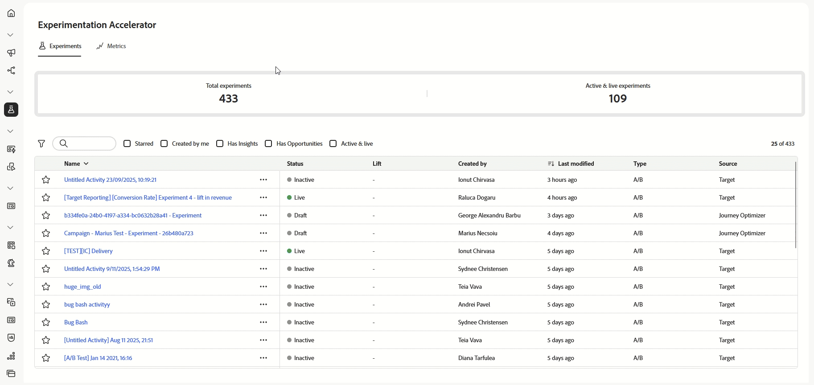

# Notas de la versión {#release-notes}

>[!CONTEXTUALHELP]
>id="ajo_homepage_card1"
>title="Novedades"
>abstract="**Adobe Journey Optimizer** ofrece continuamente nuevas funciones, mejoras en las existentes y correcciones de errores. Todos los cambios se consolidan la última semana de cada mes en estas notas de la versión."

[!DNL Adobe Journey Optimizer] ofrece continuamente nuevas funciones, mejoras en las existentes y correcciones de errores. Todos los cambios se consolidan la última semana de cada mes en estas notas de la versión. [!DNL Adobe Journey Optimizer] está creado de forma nativa en [!DNL Adobe Experience Platform] y hereda sus últimas innovaciones y mejoras. Obtenga más información sobre estos cambios en las [Notas de la versión de Adobe Experience Platform](https://experienceleague.adobe.com/docs/experience-platform/release-notes/latest.html?lang=es){target="_blank"}.

## Actualizaciones del 25 de octubre {#25-10-rn}

<table>
<thead>
<tr>
<th><strong>Archivos adjuntos de PDF a correos electrónicos</strong> </th>
</tr>
</thead>
<tbody>
<tr>
<td>

Ahora puede adjuntar un archivo PDF estático a un mensaje de correo electrónico enviado con Journey Optimizer.

<ul>
<li>Puede enviar hasta 6 mensajes con un archivo adjunto de PDF por perfil y año.</li>
<li>El tamaño máximo para cada archivo adjunto es 5 MB.</li>
<li>Para cualquier tamaño o volumen adicional, puede comprar un complemento de archivos PDF adjuntos. Para obtener más información, póngase en contacto con su representante de Adobe.</li>
</ul>

Esta capacidad, que se lanzó anteriormente con disponibilidad limitada, ya está disponible en todos los entornos (disponibilidad general).

Para obtener más información, consulte la <a href="../email/pdf-attachments.md">documentación detallada</a>.

Fecha de disponibilidad: 30 de septiembre de 2025

</td>
</tr>
</tbody>
</table>

<table>
<thead>
<tr>
<th><strong>API pública para recuperar recorridos</strong> </th>
</tr>
</thead>
<tbody>
<tr>
<td>

Ahora hay disponible una nueva API de Journey Optimizer para recuperar recorridos y sus objetos asociados, como campañas y superficies.

Para obtener más información, consulte la <a href="https://developer.adobe.com/journey-optimizer-apis/references/journeys-retrieve/">documentación detallada</a>.

Fecha de disponibilidad: 25 de septiembre de 2025

</td>
</tr>
</tbody>
</table>

## Notas de la versión de septiembre de 2025 {#25-9-rn}

**Fecha de la versión**: 23-24 de septiembre de 2025

### Nuevas funciones {#sept-25-9-features}

<table>
<thead>
<tr>
<th><strong>Journey Optimizer Experimentation Accelerator</strong> </th>
</tr>
</thead>
<tbody>
<tr>
<td>

Journey Optimizer Experimentation Accelerator es un producto basado en inteligencia artificial diseñado para llevar sus experimentos al siguiente nivel. Creado para usuarios de Adobe Journey Optimizer y Adobe Target, unifica la administración de experimentos, ofrece perspectivas y oportunidades con tecnología de IA e introduce un nuevo agente de experimentación.

Esto es lo que puede esperar:

<ul>
<li><strong>Inventario de experimentos unificado:</strong> vea, filtre y administre rápidamente todos los experimentos de Adobe Journey Optimizer y Adobe Target en un espacio de trabajo central.</li>
<li><strong>Perspectivas y oportunidades de experimentos de IA:</strong> vaya más allá de las lecturas estadísticas con perspectivas y recomendaciones impulsadas por GenAI. Ahora, cada experimento ofrece oportunidades procesables, junto con argumentos de apoyo, para que los equipos puedan decidir con mayor seguridad qué probar a continuación.</li>
<li>Soporte de <strong>Multi-Armed Bandit (MAB) en Journey Optimizer:</strong> maximice el impacto y reduzca el tráfico desperdiciado con experimentos de Multi-Armed Bandit. En lugar de dividir los públicos de manera uniforme, MAB asigna automáticamente a más visitantes a las variaciones con mejor rendimiento en tiempo real para que pueda ofrecer mejores experiencias a más clientes sin dejar de aprender lo que funciona.</li></ul>

Para obtener más información, consulte la <a href="../content-management/experiment-accelerator.md">documentación detallada</a>.

Fecha de disponibilidad: 3 de octubre de 2025

</td>
</tr>
</tbody>
</table>

<table>
<thead>
<tr>
<th><strong>Ya está aquí Journey Agent.</strong> </th>
</tr>
</thead>
<tbody>
<tr>
<td>

Con la tecnología de <a href="https://experienceleague.adobe.com/es/docs/experience-cloud-ai/experience-cloud-ai/agents/agent-orchestrator" target="_blank">Adobe Experience Platform Agent Orchestrator</a>, Journey Agent está disponible en Journey Optimizer. Permite analizar los recorridos a través de una interfaz de lenguaje natural. El agente detecta conflictos de público o de programación y caídas de perfiles en un recorrido para ayudarle a tomar medidas para resolverlos. Pronto, usted será capaz de crear recorridos con apoyo agéntico.

Para obtener más información, consulte la <a href="https://experienceleague.adobe.com/es/docs/experience-cloud-ai/experience-cloud-ai/agents/ajo-agent-analyze" target="_blank">documentación detallada</a>.

Fecha de disponibilidad: 24 de septiembre de 2025

</td>
</tr>
</tbody>
</table>

<table>
<thead>
<tr>
<th><strong>Modo oscuro en el Diseñador de correo electrónico</strong> </th>
</tr>
</thead>
<tbody>
<tr>
<td>

El Diseñador de correo electrónico de Journey Optimizer ahora permite cambiar a la vista en modo oscuro, donde además puede definir configuraciones personalizadas específicas que se mostrarán solo para los destinatarios que lean sus correos electrónicos en modo oscuro.

Tenga en cuenta lo siguiente:

<ul>
<li>El renderizado final del modo oscuro puede variar y depende del cliente de correo electrónico del destinatario.</li>
<li>No todos los clientes de correo electrónico admiten el modo oscuro personalizado. Además, algunos clientes de correo electrónico solo aplican su propio modo oscuro predeterminado a todos los correos electrónicos recibidos. En ambos casos, no se puede procesar la configuración personalizada que definió en el Diseñador de correo electrónico.</li>
</ul>

Para obtener más información, consulte la <a href="../email/dark-mode.md">documentación detallada</a>.

 
Fecha de disponibilidad: 16 de septiembre de 2025

</td>
</tr>
</tbody>
</table>

<table>
<thead>
<tr>
<th><strong>Optimización de la ruta del recorrido</strong> </th>
</tr>
</thead>
<tbody>
<tr>
<td>

Utilice el nuevo nodo Optimizar para dirigirse a públicos específicos o ejecutar pruebas A/B para determinar la mejor ruta para satisfacer los KPI empresariales.

Esta herramienta le permite probar y variar, así como personalizar las comunicaciones, la secuencia y el tiempo para llegar mejor a sus clientes.

Esta capacidad tiene disponibilidad limitada. Póngase en contacto con su representante de Adobe para obtener acceso.

Para obtener más información, consulte la <a href="../building-journeys/optimize.md">documentación detallada</a>.

Fecha de disponibilidad: 4 de septiembre de 2025

</td>
</tr>
</tbody>
</table>

<table>
<thead>
<tr>
<th><strong>Método de delegación personalizada para subdominios</strong> </th>
</tr>
</thead>
<tbody>
<tr>
<td>

Además de la delegación completa y del método CNAME, ahora hay disponible un nuevo método de configuración de subdominios: el método de delegación personalizada, que le permite controlar y mantener por completo todos los aspectos de DNS necesarios para enviar, procesar y rastrear mensajes.

Esta capacidad tiene disponibilidad limitada. Póngase en contacto con su representante de Adobe para obtener acceso.

Para obtener más información, consulte la <a href="../configuration/delegate-custom-subdomain.md">documentación detallada</a>.

Fecha de disponibilidad: 4 de septiembre de 2025

</td>
</tr>
</tbody>
</table>

<table>
<thead>
<tr>
<th><strong>Uso de datos de Adobe Experience Platform para la personalización y la toma de decisiones</strong> </th>
</tr>
</thead>
<tbody>
<tr>
<td>

Esta función, que se lanzó anteriormente en beta pública, ya está disponible en todos los entornos. Con esta versión, se han introducido las siguientes mejoras:

<ul><li>Compatibilidad con la personalización de la búsqueda de conjuntos de datos en canales entrantes.</li>
<li>Ahora, la función de ayuda "datasetLookup" se puede utilizar dentro de los fragmentos de expresiones. Por ahora, esta capacidad está disponible para un conjunto limitado de clientes. Para obtener acceso, póngase en contacto con su representante de Adobe.</li>
<li>Una opción de la interfaz de gestión del conjunto de datos ahora le permite habilitar conjuntos de datos para la personalización de la búsqueda, sin tener que realizar una llamada API.</li>
<li>Monitorización mejorada para rastrear el estado de ingesta de datos y saber cuándo los conjuntos de datos están listos para la búsqueda.</li>
<li>Se han actualizado las directrices y protecciones de uso para garantizar un rendimiento y una fiabilidad óptimos.</li>
<li>Los conjuntos de datos de Adobe Experience Platform ahora se pueden aprovechar en las reglas de límite de Decisioning.</li></ul>

Para obtener más información, consulte la <a href="../data/lookup-aep-data.md">documentación detallada</a>.

Fecha de disponibilidad: 1 de septiembre de 2025

</td>
</tr>
</tbody>
</table>

### Mejoras {#sept-25-9-improvements}

* **Compatibilidad con webhook para campañas activadas por API**\
  Las campañas activadas por API ahora admiten webhooks. Configure una URL de gancho web para recibir actualizaciones de estado en tiempo real para cada mensaje, mejorando la observabilidad y permitiendo una monitorización y automatización sin problemas. [Más información](../configuration/feedback-webhooks.md)

  Fecha de disponibilidad: 29 de septiembre de 2025

* **Compatibilidad con mTLS para el canal SMS**
Al configurar un proveedor de SMS personalizado, ahora tiene la opción de habilitar la autenticación TLS mutua (mTLS), lo que requiere que tanto el cliente como el servidor confirmen mutuamente sus identidades antes de establecer una conexión segura. [Más información](../sms/sms-configuration-custom.md) - Fecha de disponibilidad: 23 de septiembre de 2025

* **Esquemas basados en modelos**\
  Ahora puede utilizar esquemas basados en modelos para satisfacer sus necesidades de modelado relacional en campañas orquestadas. [Más información](../orchestrated/gs-schemas.md) - Fecha de disponibilidad: 23 de septiembre de 2025

* **Compatibilidad con la búsqueda de conjuntos de datos en recorridos**\
  La nueva actividad en recorridos, **Búsqueda de conjuntos de datos**, le permite recuperar dinámicamente datos de conjuntos de datos de registros de Adobe Experience Platform durante el tiempo de ejecución. Al utilizar esta capacidad, puede acceder a datos que podrían no estar en el perfil o en la carga útil del evento, lo que garantiza que sus interacciones con los clientes sean relevantes y oportunas. [Más información](../building-journeys/dataset-lookup.md) - Fecha de disponibilidad: 23 de septiembre de 2025

  Esta actividad solo está disponible para un conjunto de organizaciones (disponibilidad limitada). Para obtener acceso, póngase en contacto con su representante de Adobe.

* **Compatibilidad de redireccionamiento en acciones personalizadas de Recorrido**\
  Ahora se admiten redirecciones (302) en las Acciones personalizadas de recorrido. - Fecha de disponibilidad: 23 de septiembre de 2025

* **Alertas de monitorización de configuración de canal**: ahora puede suscribirse para recibir alertas del sistema, ya sea por correo electrónico o en el centro de notificaciones de Journey Optimizer, en caso de que se produzca un error de configuración de canal usando la delegación de subdominio personalizada. [Más información](../reports/alerts.md#alert-channel-config-failure) - Fecha de disponibilidad: 23 de septiembre de 2025

* **Solicitudes de cancelación de suscripción de un clic**: hemos introducido mejoras que refuerzan aún más la administración de las solicitudes de cancelación de suscripción de un clic configuradas en Adobe Managed, lo que garantiza un procesamiento confiable y coherente. - Fecha de disponibilidad: 23 de septiembre de 2025

* **Ahora se admiten parámetros de cuerpo JSON anidados en la autenticación personalizada**\
  Al configurar la autenticación personalizada para una acción personalizada, ahora se admiten objetos JSON anidados (por ejemplo, subobjetos dentro de `bodyParams`). [Más información](../datasource/external-data-sources.md#custom-authentication-mode) - Fecha de disponibilidad: 18 de septiembre de 2025

* **Frecuencia de restricción de restablecimiento por hora**: ahora puede aplicar una restricción por hora a los conjuntos de reglas de canal. Esta función, que antes estaba disponible en disponibilidad limitada, ahora está disponible en todos los entornos y le permite elegir 1 hora (antes era 3 horas). [Más información](../conflict-prioritization/channel-capping.md) - Fecha de disponibilidad: 17 de septiembre de 2025

* **Simular variaciones de contenido para todos los canales entrantes**\
  Anteriormente solo disponible para los canales de correo electrónico, SMS y notificaciones push, la simulación de variaciones de contenido ahora también se aplica a todos los canales entrantes. [Más información](../test-approve/simulate-sample-input.md) - Fecha de disponibilidad: 17 de septiembre de 2025

* **Expresión para reglas de límite de Decisioning**: ahora puede crear sus propias expresiones para definir el umbral de una regla de límite para un elemento de decisión. [Más información](../experience-decisioning/items.md#capping) - Fecha de disponibilidad: 16 de septiembre de 2025

* **Compatibilidad con dominios dinámicos**: Journey Optimizer ahora admite la personalización completa o básica de direcciones URL para dominios predefinidos aceptados por Adobe. [Más información](../personalization/personalization-build-expressions.md#where) - Fecha de disponibilidad: 12 de septiembre de 2025

  Esta capacidad está disponible en disponibilidad limitada para un conjunto de clientes.

* **Webhooks**: Esta versión incorpora las siguientes mejoras para Webhooks al configurar un proveedor de SMS personalizado:

   * Ahora puede definir el propósito de su webhook, ya sea Entrante o Comentarios, según el tipo de datos que desee capturar. [Más información](../sms/sms-configuration-custom.md#webhook) - Fecha de disponibilidad: 23 de septiembre de 2025

   * La interfaz para configurar palabras clave se ha mejorado para facilitar la configuración. [Más información](../sms/sms-configuration-custom.md#webhook) - Fecha de disponibilidad: 23 de septiembre de 2025

* **SMS**

   * Al configurar un proveedor de SMS personalizado, ahora puede definir una palabra clave **Default** que se usa cuando un SMS entrante contiene una palabra clave no reconocida. También puede crear palabras clave **Custom** para acciones específicas. [Más información](../sms/sms-configuration-custom.md) - Fecha de disponibilidad: 23 de septiembre de 2025

   * Ahora puede acceder a las respuestas de palabras clave de entrada no definidas enviadas mediante un mensaje SMS, incluidos los errores tipográficos, las palabras o las frases que no están definidos explícitamente en la configuración. Se almacenan en el conjunto de datos **AJO Email Tracking Experience Event**, en **InboundMessage** durante 13 meses. Solo disponible con Sinch, Infobip y el proveedor de SMS personalizado. - Fecha de disponibilidad: 23 de septiembre de 2025

<!--
* **Approval policy permissions**
  Added an option when creating or setting Approval Policy to prevent Journey/Campaign creators from approving their own objects. [Read more](../test-approve/approval-policies.md) - Availability date: Sept 23, 2025 
-->

### Próximamente {#sept-25-9-soon}

En los próximos días, está programado el lanzamiento de las siguientes funciones y mejoras. **La información está sujeta a cambios**. Los vínculos, las pantallas y la documentación actualizados se compartirán una vez que estas actualizaciones estén activas en la producción.

<!--table>
<thead>
<tr>
<th><strong>New Web Push notifications channel</strong> </th>
</tr>
</thead>
<tbody>
<tr>
<td>

Adobe Journey Optimizer now supports Web Push notifications, expanding the push channel beyond mobile. You can seamlessly deliver notifications to both mobile and desktop browsers, enabling you to reach customers directly on their devices without requiring an app.

This enhancement allows you to engage users with timely, personalized messages in real time, leveraging the same authoring workflows and targeting capabilities already available for mobile push.

For more information, refer to the <a href="../FILE.md">detailed documentation</a>

Availability date: Sept XX, 2025

</td>
</tr>
</tbody>
</table-->

<!--table>
<thead>
<tr>
<th><strong>Custom action monitoring and reporting</strong> </th>
</tr>
</thead>
<tbody>
<tr>
<td>

Custom action monitoring and reporting is now available. This capability provides better visibility into journey health and execution, including lifecycle status and performance alerts. You can now quickly understand when, where, and why an anomalous situation is occurring in a custom action.

For more information, refer to the <a href="../FILE.md">detailed documentation</a>

Availability date: Sept XX, 2025

</td>
</td>
</tr>
</tbody>
</table-->

<!--table>
<thead>
<tr>
<th><strong>New source connectors for loyalty apps</strong> </th>
</tr>
</thead>
<tbody>
<tr>
<td>

New source connectors are now available in Adobe Experience Platform for the Talon.One, Capillary, and Kobie loyalty apps. These connectors let you seamlessly stream loyalty data into Adobe Experience Platform and leverage these data in Journey Optimizer.

</td>
</tr>
</tbody>
</table-->

<table>
<thead>
<tr>
<th><strong>Formularios personalizados de página de aterrizaje</strong> </th>
</tr>
</thead>
<tbody>
<tr>
<td>

Con [!DNL Journey Optimizer], ahora puede capturar atributos de perfil a través de sus páginas de aterrizaje.

Cree, diseñe y administre formularios personalizados adaptados a sus necesidades en función de un conjunto de datos específico. A continuación, puede utilizar estos formularios en páginas de aterrizaje para añadir los atributos de perfil que elija al conjunto de datos definido para cada formulario.

Esta capacidad tiene disponibilidad limitada. Póngase en contacto con su representante de Adobe para obtener acceso.

<!--p>For more information, refer to the <a href="../landing-pages/lp-forms.md">detailed documentation</a>

Availability date: Sept XX, 2025</p-->
</td>
</tr>
</tbody>
</table>

* **Nuevas alertas de recorrido**\
  Hay nuevas alertas preconfiguradas disponibles para los recorridos:

   * Tasa de descarte de perfil superada: proporción de descartes de perfil para perfiles introducidos durante los últimos 5 minutos del umbral excedido.
   * Tasa de errores de acciones personalizadas superada: la proporción de errores de acciones personalizadas respecto a llamadas HTTP correctas durante los últimos 5 minutos ha superado el umbral.
   * Tasa de error de perfil superada: la proporción de perfiles en error respecto a los perfiles introducidos durante los últimos 5 minutos superaron el umbral.
<!--
  * [Profile Discard Rate Exceeded](../reports/alerts.md#profile-discard-rate-exceeded): Ratio of profile discards to entered profiles over the last 5 mins exceeded threshold.  
  * [Custom Action Error Rate Exceeded](../reports/alerts.md#custom-action-error-rate-exceeded): Ratio of custom action errors to successful HTTP calls over the last 5 mins exceeded threshold.  
  * [Profile Error Rate Exceeded](../reports/alerts.md#profile-error-rate-exceeded): Ratio of profiles-in-error to entered profiles over the last 5 mins exceeded threshold.-->

Puede modificar los valores de umbral y suscribirse a alertas de nivel de recorrido individual o global.

<!-- Availability date: Sept XX, 2025-->

* **Compatibilidad con atributos personalizados con la URL para cancelar la suscripción con un clic**\
  Con Journey Optimizer, si administra el consentimiento fuera de Adobe, puede establecer un punto final personalizado externo definiendo su propio vínculo para cancelar la suscripción con un solo clic en la configuración de correo electrónico. Cuando los destinatarios hacen clic en el vínculo Cancelar LA suscripción, Journey Optimizer añade algunos parámetros predeterminados específicos del perfil al evento de actualización de consentimiento.

  Para personalizar aún más el vínculo de cancelación de suscripción, ahora puede definir atributos personalizados que se adjuntarán al evento de consentimiento. Esta funcionalidad ya ha estado disponible para el vínculo personalizado de cancelación de suscripción de un clic desde la versión del 25 de agosto.

  <!-- Availability date: Sept XX, 2025-->
