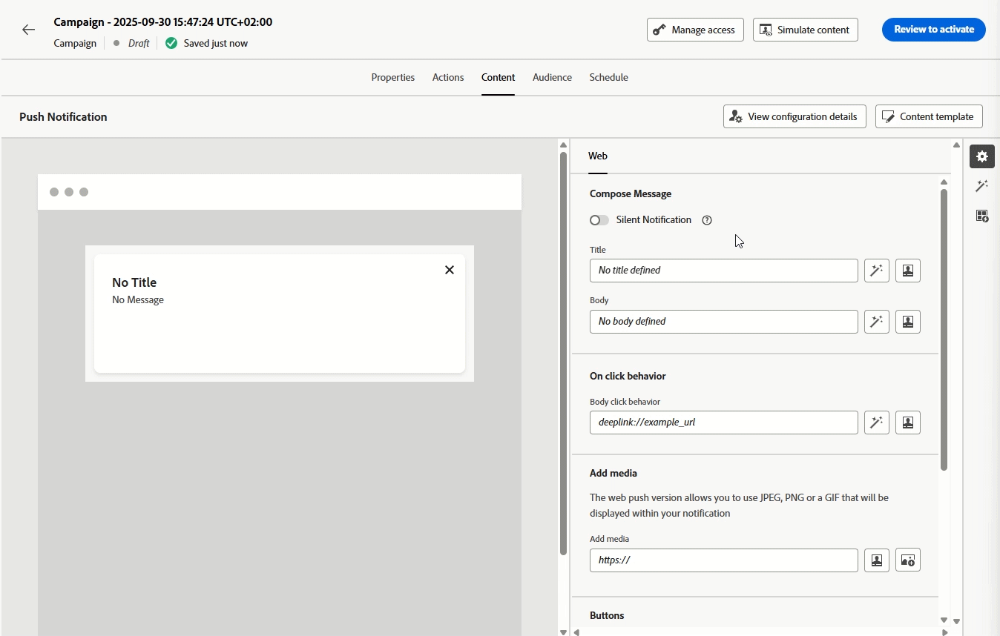

# Notas de la versión {#release-notes}

>[!CONTEXTUALHELP]
>id="ajo_homepage_card1"
>title="Novedades"
>abstract="**Adobe Journey Optimizer** ofrece continuamente nuevas funciones, mejoras en las existentes y correcciones de errores. Todos los cambios se consolidan la última semana de cada mes en estas notas de la versión."

[!DNL Adobe Journey Optimizer] sigue un modelo de envío continuo, lo que permite a Adobe ofrecer nuevas funciones, mejoras y correcciones de forma continua. Este enfoque permite un despliegue escalable y gradual de las funciones para garantizar el rendimiento y la estabilidad en todos los entornos.

Debido a este modelo, las notas de la versión se actualizan entre versiones mensuales. Para obtener información detallada acerca del ciclo de lanzamiento y las fases de disponibilidad, consulte [Ciclo de lanzamiento de Journey Optimizer](releases.md).

[!DNL Adobe Journey Optimizer] está creado de forma nativa en [!DNL Adobe Experience Platform] y hereda sus últimas innovaciones y mejoras. Obtenga más información sobre estos cambios en las [Notas de la versión de Adobe Experience Platform](https://experienceleague.adobe.com/docs/experience-platform/release-notes/latest.html?lang=es){target="_blank"}.

## Notas de la versión de enero de 2026 {#latest-rn}

<!--**Release date**: January 27-28, 2026-->

Las secciones [Características](#jan-26-01-features) y [Mejoras](#jan-26-01-improv) cubren funcionalidades ya disponibles, mientras que [Próximamente](#jan-26-01-coming-soon) enumera elementos programados para una fecha de disponibilidad posterior.

<!-- **The pre-release notes below are subject to change without prior notice until the release availability date**. Links, screens and updated documentation are published in the release notes, at the release date. 

See also [Adobe Experience Platform Pre-release notes](https://experienceleague.adobe.com/en/docs/experience-platform/release-notes/pre-release-notes){target="_blank"}.-->

### Nuevas funciones {#jan-26-01-features}

<table>
<thead>
<tr>
<th><strong>Compatibilidad con decisiones en el canal push</strong> </th>
</tr>
</thead>
<tbody>
<tr>
<td>

Ahora puede personalizar y optimizar el contenido de sus <strong>notificaciones push</strong> con <strong>Decisioning</strong>. Utilice puntuaciones de prioridad, fórmulas o modelos de IA para mostrar el mejor contenido a sus clientes.

Experience Decisioning con notificaciones push requiere una versión específica de Mobile SDK. Antes de implementar esta característica, compruebe <a href="https://developer.adobe.com/client-sdks/home/release-notes/" target="_blank">las notas de la versión</a> para identificar la versión requerida y asegúrese de haber actualizado según corresponda. También puede ver todas las versiones de SDK disponibles para su plataforma en <a href="https://developer.adobe.com/client-sdks/home/current-sdk-versions/" target="_blank">esta sección</a>.

Para obtener más información, consulte la <a href="../experience-decisioning/create-decision.md">documentación detallada</a>.

Fecha de disponibilidad: sábado, 30 de enero de 2026

</td>
</tr>
</tbody>
</table>

<table>
<thead>
<tr>
<th><strong>Canal de correo directo en recorrido</strong> </th>
</tr>
</thead>
<tbody>
<tr>
<td>

Anteriormente limitado a Campañas, el canal <strong>Correo directo</strong> ya está disponible en el lienzo del recorrido, lo que le permite incorporar el Correo directo en los recorridos. Ahora se puede usar el correo postal en <strong>escenarios de recorrido por lotes y 1:1</strong>, con compatibilidad con la configuración de extracción de archivos y la configuración de frecuencia basada en el tiempo.

Esta capacidad, que se lanzó anteriormente con disponibilidad limitada, ya está disponible en todos los entornos (disponibilidad general).

Para obtener más información, consulte la <a href="../direct-mail/get-started-direct-mail.md">documentación detallada</a>.

Fecha de disponibilidad: viernes, 29 de enero de 2026

</td>
</tr>
</tbody>
</table>

<table>
<thead>
<tr>
<th><strong>Horas tranquilas (exclusiones basadas en el tiempo)</strong> </th>
</tr>
</thead>
<tbody>
<tr>
<td>

<strong>Horas tranquilas</strong> le permiten definir exclusiones basadas en el tiempo para los canales de correo electrónico, SMS, Push y WhatsApp. Garantizan que no se envíen mensajes durante períodos de tiempo específicos, lo que le ayuda a respetar las preferencias de los clientes y los requisitos de cumplimiento. Puede aplicar horas tranquilas a través de <strong>conjuntos de reglas</strong>, que se pueden asignar a acciones individuales en campañas o recorridos para un control preciso.

Esta función, lanzada anteriormente en disponibilidad limitada, ya está disponible para todos los entornos. Con esta versión de Disponibilidad general, la función ahora incluye la capacidad para que el cliente ponga en cola una acción de campaña hasta que se completen las horas tranquilas y la capacidad de previsualizar la regla de horas silenciosas activada.

Para obtener más información, consulte la <a href="../conflict-prioritization/quiet-hours.md">documentación detallada</a>.

Fecha de disponibilidad: viernes, 29 de enero de 2026

</td>
</tr>
</tbody>
</table>

<table>
<thead>
<tr>
<th><strong>Exportación de mensajes</strong> </th>
</tr>
</thead>
<tbody>
<tr>
<td>

Ahora hay disponible una nueva funcionalidad <strong>Message Export</strong> para canales de correo electrónico y SMS. Esta función le permite exportar automáticamente el contenido de los mensajes enviados a un conjunto de datos de Experience Platform dedicado, lo que le permite:

<ul>
<li>Cumplir los requisitos de cumplimiento normativo (como HIPAA)</li>
<li>Archivar mensajes para reclamaciones legales y consultas de atención al cliente</li>
<li>Conservar copias del contenido personalizado enviado a particulares</li>
</ul>

Los registros se conservan en el conjunto de datos de exportación de mensajes de AJO durante 7 días naturales a partir de la ingesta. Durante este período de retención, puede exportarlas a su propio almacenamiento a través de destinos de Experience Platform. La característica se habilita en el nivel de configuración de canal, lo que le proporciona <strong>control granular</strong> sobre los mensajes que se exportan.

Esta funcionalidad solo está disponible para el canal de correo electrónico y SMS, para organizaciones que han adquirido la oferta del complemento Exportación de mensajes. Para obtener más información, contacte con su representante de Adobe.

Para obtener más información, consulte la <a href="../configuration/message-export.md#message-export">documentación detallada</a>.

Fecha de disponibilidad: jueves, 28 de enero de 2026

</td>
</tr>
</tbody>
</table>

<table>
<thead>
<tr>
<th><strong>Canal de correo directo en campañas orquestadas</strong> </th>
</tr>
</thead>
<tbody>
<tr>
<td>

El canal de correo postal ya está disponible en campañas orquestadas. La <strong>actividad de correo directo</strong> facilita el envío de correo directo dentro de su campaña orquestada, tanto para mensajes recurrentes como únicos. Sirve para automatizar el proceso de generación del <strong>archivo de extracción</strong> requerido por los proveedores de correo postal. Puede combinar actividades de canal en el lienzo de la campaña orquestada para crear campañas en canales múltiples que puedan activar acciones basadas en el comportamiento y los datos del cliente.

Para obtener más información, consulte la <a href="../orchestrated/activities/channels.md#channel">documentación detallada</a>.

Fecha de disponibilidad: jueves, 28 de enero de 2026

</td>
</tr>
</tbody>
</table>

<table>
<thead>
<tr>
<th><strong>Journey Agent: Creación de un Recorrido</strong> </th>
</tr>
</thead>
<tbody>
<tr>
<td>

Journey Agent ahora ofrece funcionalidades de creación, lo que permite a los usuarios de Journey Optimizer crear y configurar recorridos de marketing a través de una <strong>interfaz en lenguaje natural</strong>. Con estas nuevas destrezas, los profesionales pueden crear recorridos rápidamente con solo describir sus necesidades en <strong>mensajes de conversación</strong>. Esta innovación optimiza el proceso de creación de recorridos, lo que permite a los especialistas en marketing centrarse en la estrategia en lugar de en la configuración técnica.

Para obtener más información, consulte la <a href="../start/ai-features.md#journey-agent">documentación detallada</a>.

Fecha de disponibilidad: martes, 12 de enero de 2026

</td>
</tr>
</tbody>
</table>

<table>
<thead>
<tr>
<th><strong>API de recuperación de campaña de acción</strong> </th>
</tr>
</thead>
<tbody>
<tr>
<td>

Ya está disponible una nueva API de Journey Optimizer que le permite recuperar e inspeccionar mediante programación <strong>datos relacionados con la campaña</strong>, como detalles, versiones y configuraciones.

Para obtener más información, consulte la <a href="https://developer.adobe.com/journey-optimizer-apis/references/campaigns-retrieve/" target="_blank">documentación detallada</a>.

Fecha de disponibilidad: martes, 24 de noviembre de 2025

</td>
</tr>
</tbody>
</table>

<table>
<thead>
<tr>
<th><strong>Temas de Designer de correo electrónico</strong> </th>
</tr>
</thead>
<tbody>
<tr>
<td>

Ahora puede aplicar rápidamente <strong>temas preaprobados</strong> para garantizar la <strong>coherencia de la marca</strong> en todos los correos electrónicos, acelerar el proceso de creación de campañas y producir correos electrónicos de alta calidad de forma independiente, al tiempo que reduce la dependencia en los equipos de diseño.

Esta funcionalidad, que se publicó anteriormente en la versión Beta, ya está disponible para un conjunto de organizaciones (disponibilidad limitada). Para obtener acceso, póngase en contacto con su representante de Adobe.

Para obtener más información, consulte la <a href="../email/apply-email-themes.md">documentación detallada</a>.

Fecha de disponibilidad: jueves, 05 de noviembre de 2025

</td>
</tr>
</tbody>
</table>

### Mejoras {#jan-26-01-improv}

#### IA

* **Comprobaciones de calidad del contenido del Asistente de IA**: además de la alineación de marca, ahora puede evaluar la <strong>calidad del contenido</strong> en general para descubrir posibles problemas con la <strong>legibilidad</strong>, la coherencia y la eficacia, independientemente de las directrices de marca. Estas comprobaciones automatizadas ayudan a identificar mensajes poco claros, tonos incoherentes o lagunas estructurales. [Más información](../content-management/brands-score.md#validate-quality).

  [Descubra esta característica en vídeo](https://video.tv.adobe.com/v/3470544/?learn=on).

#### Experience Decisioning

#### Recorridos

* **Combinar acciones de mensajes nativas y de Adobe Campaign**: Journey Optimizer ahora le permite combinar <strong>acciones de mensajes de Adobe Campaign v7/v8</strong> con <strong>acciones de canales nativos</strong> en el mismo recorrido. [Más información](../building-journeys/using-adobe-campaign-v7-v8.md)

  Fecha de disponibilidad: 27 de enero de 2026.

* **Carga de respuesta de error de acción personalizada**: ahora puede definir una <strong>carga de respuesta de error opcional</strong> para las acciones personalizadas. Cuando falla una llamada, la carga del error se expone en el contexto de recorrido (bajo el nodo errorResponse de la acción) y está disponible en la <strong>rama de tiempo de espera/error</strong>, junto con `jo_status_code`, para admitir una lógica de reserva y una depuración más completas. [Más información](../action/about-custom-action-configuration.md#define-the-message-parameters)

  Fecha de disponibilidad: 27 de enero de 2026.

* **Validación del tamaño de carga útil de Recorrido en recorrido**: Journey Optimizer ahora valida <strong>los tamaños de carga útil</strong> para ayudar a garantizar un rendimiento óptimo y la estabilidad del sistema. Al crear o publicar recorridos, recibe <strong>advertencias y errores</strong> si el tamaño de la carga útil se acerca o excede los límites recomendados, junto con instrucciones procesables para optimizar la configuración de la recorrido. Esta validación proactiva le ayuda a identificar problemas potenciales de forma temprana y a mantener el rendimiento del recorrido. [Más información](../start/guardrails.md#journey-payload-size)

  Fecha de disponibilidad: 27 de enero de 2026.

* **alertas de Recorrido** - Hay <strong>nuevas alertas preconfiguradas</strong> disponibles para los recorridos.
   * <strong>Tasa de descartes de perfiles superada</strong>: proporción de descartes de perfiles respecto a los perfiles introducidos durante el umbral excedido de los últimos 5 minutos
   * <strong>Tasa de errores de acción personalizada superada</strong> - Proporción de errores de acción personalizada respecto a llamadas HTTP correctas durante los últimos 5 minutos superados el umbral
   * <strong>Tasa de error de perfil superada</strong>: proporción de perfiles en error respecto a los perfiles introducidos durante el umbral excedido de los últimos 5 minutos

  Para obtener más información, consulte la [documentación detallada](../reports/alerts.md).

  Fecha de disponibilidad: 14 de octubre de 2025.

#### Campañas orquestadas

* **Herencia de etiquetas de uso de datos para audiencias**: las etiquetas aplicadas en Adobe Experience Platform ahora se transfieren automáticamente al guardar <strong>audiencias</strong> en campañas orquestadas, lo que reduce el etiquetado manual <strong>DULE</strong>. [Más información](../orchestrated/activities/save-audience.md)

* **Filtros predefinidos con parámetros**: ahora puede crear <strong>filtros predefinidos</strong> con <strong>parámetros</strong> en campañas orquestadas para reglas reutilizables y editables. [Más información](../orchestrated/predefined-filters.md)

* **Seleccionar atributos y copiar valores de distribución** - Ahora puede <strong>seleccionar o copiar valores</strong> directamente desde la vista <strong>distribución de valores</strong> en campañas orquestadas. [Más información](../orchestrated/build-query.md)

* **Confirmación de mensaje antes del envío**: un <strong>paso de confirmación</strong> ahora está habilitado de forma predeterminada antes de enviar campañas orquestadas para reducir los envíos accidentales. [Más información](../orchestrated/activities/channels.md#confirm-message-sending)

* **Filtros de redireccionamiento predefinidos**: para admitir un redireccionamiento más sencillo en los casos de uso de campañas orquestadas, esta versión introduce nuevos <strong>filtros de comentarios de campaña</strong>. Estos filtros le permiten segmentar audiencias directamente según la <strong>participación del mensaje</strong>, como enviado, abierto solamente, abierto o hecho clic, o abierto y hecho clic, y seleccionar la campaña específica o la campaña en transición que desea redireccionar. [Más información](../orchestrated/retarget.md)

* **Compatibilidad con control de tarifa**: las campañas orquestadas ahora admiten <strong>control de tarifa</strong> para ayudarle a acelerar las entregas y alinearse con las <strong>restricciones de volumen</strong>. [Más información](../orchestrated/activities/channels.md#rate-control)

* **Botón de reinicio**: las campañas orquestadas ahora incluyen un <strong>botón de reinicio</strong> para que pueda <strong>reiniciar ejecuciones</strong> cuando sea necesario antes de publicar la campaña. [Más información](../orchestrated/start-monitor-campaigns.md)

* **Compatibilidad con metadatos generados por el usuario**: la función <strong>executionMetadata helper</strong> ya está disponible en el editor de personalización para campañas orquestadas, lo que le permite adjuntar información contextual a cualquier acción nativa y almacenarla en un conjunto de datos para exportarla a sistemas externos. [Más información](../personalization/functions/helpers.md#execution-metadata)

  Fecha de disponibilidad: 27 de enero de 2026.

* **Revertir campañas en vivo al estado de borrador**: ahora puede revertir las campañas orquestadas en vivo al estado de borrador cuando encuentren errores de ejecución o cuando necesite modificar las campañas programadas antes de que comiencen a ejecutarse. Esta opción está disponible hasta que se envía el primer mensaje. [Más información](../orchestrated/start-monitor-campaigns.md#back-to-draft)

#### Campañas

* **Programar campaña usando la zona horaria del perfil**. La programación de campañas ahora puede usar la <strong>zona horaria</strong> de cada perfil para enviar mensajes a la hora local prevista. [Más información](../campaigns/campaign-schedule.md)

  **Nota**: esta mejora solo está disponible para un conjunto de organizaciones (disponibilidad limitada).

  Fecha de disponibilidad: 27 de enero de 2026.

#### Permisos

* **Impedir la autoaprobación para recorridos y campañas** - Se agregó una opción al crear o establecer <strong>Directiva de aprobación</strong> para evitar que los creadores de recorridos o campañas <strong>aprueben sus propios objetos</strong>. [Más información](../test-approve/approval-policies.md)

  Fecha de disponibilidad: 27 de enero de 2026.

## Próximamente {#jan-26-01-coming-soon}

En los próximos días, está programado el lanzamiento de las siguientes funciones y mejoras. **La información está sujeta a cambios**. Los vínculos, las pantallas y la documentación actualizados se compartirán una vez que estas actualizaciones estén activas en la producción.

### Funcionalidades

<table>
<thead>
<tr>
<th><strong>API de herramientas de migración de autoservicio</strong> </th>
</tr>
</thead>
<tbody>
<tr>
<td>

<strong>Las API de herramientas de migración</strong> ya están disponibles para migrar mediante programación las entidades de Administración de decisiones a Decisioning, que incluyen:

<ul>
<li>Ámbitos de migración flexibles (zona protegida, nivel de oferta o de decisión)</li>
<li>Análisis y validación de dependencias automatizadas</li>
<li>Compatibilidad con reversiones para migraciones completadas</li>
<li>Informes de migración detallados con asignaciones de objetos</li>
</ul>

Fecha de disponibilidad: jueves, 11 de febrero de 2026

</td>
</tr>
</tbody>
</table>

<table>
<thead>
<tr>
<th><strong>Compatibilidad con decisiones en el canal SMS</strong> </th>
</tr>
</thead>
<tbody>
<tr>
<td>

Ahora puede personalizar y optimizar el contenido de sus <strong>mensajes SMS</strong> con <strong>Decisioning</strong>. Utilice puntuaciones de prioridad, fórmulas o modelos de IA para mostrar el mejor contenido a sus clientes.

Fecha de disponibilidad: miércoles, 03 de febrero de 2026

</td>
</tr>
</tbody>
</table>

<table>
<thead>
<tr>
<th><strong>Actividad de decisión de contenido</strong> </th>
</tr>
</thead>
<tbody>
<tr>
<td>

Ahora hay disponible una nueva actividad <strong>Content decision activity</strong> en el lienzo de recorrido para integrar <strong>ofertas personalizadas</strong> directamente en las recorridos de los clientes. Esta actividad le permite entregar contenido basado en decisiones y hacer referencia a esas ofertas en todo el recorrido, en condiciones para crear ramas basadas en la idoneidad, en acciones personalizadas para pasar datos de ofertas a sistemas externos y en otras actividades para crear experiencias de cliente totalmente personalizadas.

Esta capacidad estará disponible para todos los entornos (disponibilidad general).

Fecha de disponibilidad: jueves, 11 de febrero de 2026

</td>
</tr>
</tbody>
</table>

<table>
<thead>
<tr>
<th><strong>Canal de notificaciones push web</strong> </th>
</tr>
</thead>
<tbody>
<tr>
<td>

Adobe Journey Optimizer ahora admite <strong>notificaciones push web</strong>, lo que expande el canal push más allá del móvil. Puede enviar notificaciones sin problemas a <strong>exploradores móviles y de escritorio</strong>, lo que le permitirá llegar a los clientes directamente en sus dispositivos sin necesidad de una aplicación. Esta mejora le permite atraer a los usuarios con mensajes personalizados y oportunos en tiempo real, aprovechando los mismos flujos de trabajo de creación y las mismas capacidades de direccionamiento ya disponibles para las notificaciones push móviles.

<!--p></p-->

Esta funcionalidad, lanzada anteriormente en Beta, estará disponible para todos los entornos (disponibilidad general).

Fecha de disponibilidad: jueves, 11 de febrero de 2026

</td>
</tr>
</tbody>
</table>

### Mejoras

* **Adjuntar fragmentos a elementos de decisión**: Journey Optimizer ahora proporciona la capacidad de adjuntar <strong>fragmentos</strong> a <strong>elementos de decisión</strong> que se pueden aprovechar en campañas de experiencia basadas en código mediante directivas de decisión.

  Fecha de disponibilidad: 11 de febrero de 2026.
