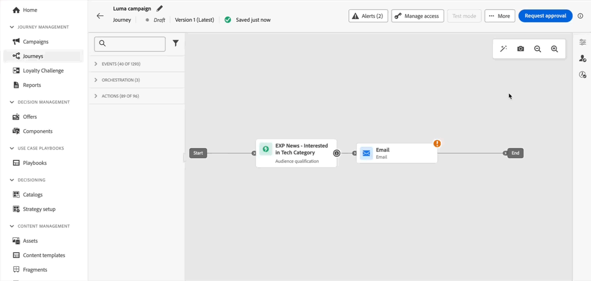

# Notas de la versión {#release-notes}

>[!CONTEXTUALHELP]
>id="ajo_homepage_card1"
>title="Novedades"
>abstract="**Adobe Journey Optimizer** ofrece continuamente nuevas funciones, mejoras en las existentes y correcciones de errores. Todos los cambios se consolidan la última semana de cada mes en estas notas de la versión."

[!DNL Adobe Journey Optimizer] ofrece continuamente nuevas funciones, mejoras en las existentes y correcciones de errores. Todos los cambios se consolidan la última semana de cada mes en estas notas de la versión. [!DNL Adobe Journey Optimizer] está creado de forma nativa en [!DNL Adobe Experience Platform] y hereda sus últimas innovaciones y mejoras. Obtenga más información sobre estos cambios en las [Notas de la versión de Adobe Experience Platform](https://experienceleague.adobe.com/docs/experience-platform/release-notes/latest.html?lang=es){target="_blank"}.

## Notas de la versión anteriores de mayo de 2025 {#25-5-rn}

**Las notas de la versión preliminar están sujetas a cambios sin previo aviso hasta la fecha de disponibilidad del lanzamiento**. Los vínculos, las pantallas y la documentación actualizada se publican en la fecha de la versión.

**Fecha de la versión**: 20-21 de mayo de 2025

### Nuevas funciones {#25-05-features}

A continuación, se describen las nuevas funciones incluidas en esta versión.

<table>
<thead>
<tr>
<th><strong>Temas en el Designer de correo electrónico</strong> </th>
</tr>
</thead>
<tbody>
<tr>
<td>

Ahora puede aplicar rápidamente temas preaprobados para garantizar la coherencia de la marca en todos los correos electrónicos, acelerar el proceso de creación de campañas y producir correos electrónicos de alta calidad de forma independiente, al tiempo que reduce la dependencia en los equipos de diseño.

Actualmente, esta función está en versión beta y solo se encuentra disponible para los clientes de dicha versión. Para unirse al programa beta, póngase en contacto con su representante de Adobe.

Para obtener más información, consulte la <a href="../email/apply-email-themes.md">documentación detallada</a>.

Fecha de disponibilidad: jueves, 14 de mayo de 2025

</td>
</tr>
</tbody>
</table>

<table>
<thead>
<tr>
<th><strong>Decisioning: nuevo generador de fórmulas de IA</strong> </th>
</tr>
</thead>
<tbody>
<tr>
<td>

Ahora puede crear fórmulas de clasificación de toma de decisiones específicas al definir y combinar criterios a partir de una nueva interfaz mejorada. En lugar de depender únicamente de una prioridad de oferta estática, puede definir fórmulas de clasificación personalizadas que combinen puntuaciones del modelo de IA, prioridades de oferta, atributos de perfil, atributos de oferta y señales contextuales a través de una interfaz guiada.

Para obtener más información, consulte la <a href="../experience-decisioning/exd-ranking-formulas.md">documentación detallada</a>.

Fecha de disponibilidad: jueves, 14 de mayo de 2025

</td>
</tr>
</tbody>
</table>

<table>
<thead>
<tr>
<th><strong>Sincronizar programación de lectura de audiencia con trabajo de segmentación por lotes</strong> </th>
</tr>
</thead>
<tbody>
<tr>
<td>

Ahora puede almacenar en déclencheur las ejecuciones de recorridos diarias después de la finalización de la segmentación por lotes. Esta opción ahora está disponible en recorridos programados diariamente para todos los clientes. Permite definir para una ventana de tiempo de hasta 6 horas a la espera de datos de audiencia de trabajos de segmentación por lotes, lo que garantiza que los recorridos se ejecuten con los datos más actualizados o se omitan si no están listos.

Esta capacidad, que se lanzó anteriormente con disponibilidad limitada, ya está disponible en todos los entornos (disponibilidad general).

<!--
For more information, refer to the <a href="../building-journeys/read-audience.md#schedule">detailed documentation</a>.
-->
</td>
</tr>
</tbody>
</table>

<table>
<thead>
<tr>
<th><strong>Integración de fragmentos de contenido de Adobe Experience Manager</strong> </th>
</tr>
</thead>
<tbody>
<tr>
<td>

Con la integración de Adobe Experience Manager y Adobe Journey Optimizer, ahora puede utilizar sin esfuerzo fragmentos de contenido de Adobe Experience Manager dentro de su contenido de Journey Optimizer. Esta conexión perfecta facilita el acceso y el uso del contenido de AEM directamente en Journey Optimizer.

Esta capacidad, que antes estaba disponible para un conjunto limitado de organizaciones (LA), ahora es GA con las siguientes mejoras:

<ul>
<li>Cree ofertas seleccionando directamente un fragmento de contenido de AEM.</li>
<li>Defina los marcadores de posición y asigne los valores de personalización dentro de la firma del fragmento con el modo Editor.</li>
</ul>
</td>
</tr>
</tbody>
</table>

<!--<table>
<thead>
<tr>
<th><strong>Calendar View for Campaign and Journey inventory</strong> </th>
</tr>
</thead>
<tbody>
<tr>
<td>

A calendar view is now available in the journeys and campaigns lists. It allows you to visualize all journeys and campaigns activations in the respective lists.

This change is only available for a set of organizations (Limited Availability). To gain access, contact your Adobe representative.

For more information, refer to these sections: <a href="../building-journeys/journey-ui.md">Browse & filter your journeys</a>, <a href="../campaigns/modify-stop-campaign.md">Access campaigns</a>.

</td>
</tr>
</tbody>
</table>-->

<table>
<thead>
<tr>
<th><strong>Integración de Dynamic Media de Adobe Experience Manager</strong> </th>
</tr>
</thead>
<tbody>
<tr>
<td>

Los recursos de Dynamic Media ahora están disponibles y son accesibles directamente en Journey Optimizer. Esta actividad le permite lo siguiente:

<ul>
<li>Administre los recursos de forma centralizada con actualizaciones en tiempo real.</li>
<li>Modifique la configuración de los recursos, como la anchura y la altura, instantáneamente.</li>
<li>Personalice las plantillas de Dynamic Media actualizando el contenido y añadiendo campos de personalización.</li>
</ul>

Esta capacidad, que se lanzó anteriormente con disponibilidad limitada, ya está disponible en todos los entornos (disponibilidad general).

</td>
</tr>
</tbody>
</table>

<table>
<thead>
<tr>
<th><strong>Conflicto y priorización</strong> </th>
</tr>
</thead>
<tbody>
<tr>
<td>

En Journey Optimizer, la administración del volumen y la sincronización de las campañas y los recorridos tiene vital importancia, ya que reducen las interacciones para los clientes. Journey Optimizer ahora ofrece varias herramientas para la administración de conflictos y la priorización (antes disponibles solo para organizaciones de acceso limitado (LA)) que ahora están disponibles de forma general (GA).

Esta capacidad, que se lanzó anteriormente con disponibilidad limitada, ya está disponible en todos los entornos. Con esta versión de General Availability, se han introducido las siguientes mejoras:

<ul>
<li>Compatibilidad ampliada: las herramientas de administración de conflictos ahora admiten Recorridos unitarios y Recorridos de calificación de audiencias, además de recorridos de audiencia de lectura.</li>
<li>Solución de problemas mejorada: ahora hay dos nuevos campos de evento de paso disponibles en el servicio de consultas, lo que permite analizar por qué se rechazó un perfil de un recorrido o una campaña.</li>
<li>Informes mejorados: ahora los informes indican qué regla específica excluyó un perfil de un recorrido o campaña, lo que proporciona una mayor transparencia y perspectivas procesables.</li></ul>

<!--
For more information, refer to the <a href="../conflict-prioritization/gs-conflict-prioritization.md">detailed documentation</a>.
-->
</td>
</tr>
</tbody>
</table>

<table>
<thead>
<tr>
<th><strong>Simular variaciones de contenido</strong> </th>
</tr>
</thead>
<tbody>
<tr>
<td>

Anteriormente disponible en la versión Beta, ahora la simulación de variaciones de contenido ya está disponible de forma general (GA). Le permite obtener una vista previa de diferentes variaciones del contenido usando los datos de entrada de muestra cargados desde un archivo CSV o JSON o añadidos manualmente. El sistema detecta automáticamente todos los atributos utilizados en el contenido para la personalización y los puede utilizar en las pruebas para crear varias variantes.

Esta capacidad, que se lanzó anteriormente con disponibilidad limitada, ya está disponible en todos los entornos. Con esta versión de Disponibilidad general, la función ahora es compatible con experimentos de contenido y contenido multilingües, lo que le permite probar variaciones en diferentes idiomas y tratamientos. Además, ahora admite atributos contextuales (además de los atributos de perfil), lo que permite realizar pruebas de contenido aún más dinámicas y adaptadas a cada situación.

<!--
For more information, refer to the <a href="../test-approve/simulate-sample-input.md">detailed documentation</a>.
-->
</td>
</tr>
</tbody>
</table>

<!--table>
<thead>
<tr>
<th><strong>Scale your Experimentation winner</strong> </th>
</tr>
</thead>
<tbody>
<tr>
<td>

Scale the Winner enables you to automatically or manually roll out the winning variation of an experiment to your full audience. This feature ensures that, once a top performer is identified, you can maximize its reach and effectiveness without constant manual oversight.

</td>
</tr>
</tbody>
</table-->

<table>
<thead>
<tr>
<th><strong>Proveedor de SMS personalizado</strong> </th>
</tr>
</thead>
<tbody>
<tr>
<td>

Journey Optimizer ahora le permite configurar proveedores de SMS adicionales más allá de las opciones predeterminadas: Sinch, Infobip y Twilio. Con la configuración personalizada del proveedor de SMS, puede integrar proveedores de terceros directamente, aprovechar la personalización avanzada de la carga útil para la mensajería dinámica y administrar las preferencias de consentimiento (inclusión/exclusión) para garantizar el cumplimiento.

Para obtener más información, consulte la <a href="../sms/sms-configuration-custom.md">documentación detallada</a>.

Esta capacidad, que se lanzó anteriormente con disponibilidad limitada, ya está disponible en todos los entornos (disponibilidad general).
</td>
</td>
</tr>
</tbody>
</table>

<!--
<table>
<thead>
<tr>
<th><strong>Supplemental ID for event-triggered journeys</strong> </th>
</tr>
</thead>
<tbody>
<tr>
<td>

You can now trigger journeys using a profile ID along with another identifier, such as an order ID, subscription ID, or prescription ID, allowing the same profile to be in the same journey multiple times at once. This enables scenarios like managing multiple orders or subscriptions in parallel, with each instance following its own path through the journey.

This capability is only available for a set of organizations (Limited Availability). To gain access, contact your Adobe representative.

</td>
</tr>
</tbody>
</table>
-->

### Mejoras {#25-05-improv}

Las mejoras incluidas en esta versión se enumeran a continuación.

* **Compatibilidad con objetos nuevos para la copia de zona protegida**

   * **Campañas** - Fecha de disponibilidad: 15 de mayo de 2025

     Al copiar campañas en varios entornos limitados mediante las funciones de exportación e importación de paquetes, ahora también se copian las siguientes dependencias: configuraciones de canal, variantes y configuración de experimento, políticas de decisión y elementos. [Más información](../configuration/copy-objects-to-sandbox.md)

   * **Decisión** - Fecha de disponibilidad: 16 de mayo de 2025

     Ahora, los objetos de decisión se pueden copiar entre entornos limitados, lo que optimiza los flujos de trabajo de prueba e implementación. [Más información](../configuration/copy-objects-to-sandbox.md#decisioning)

* **Carpetas para páginas de aterrizaje** - Fecha de disponibilidad: 9 de mayo de 2025

  Para administrar fácilmente las páginas de aterrizaje, ahora puede utilizar carpetas para organizarlas de forma más eficaz en una jerarquía estructurada. [Más información](../landing-pages/manage-lp.md)

* **Correo directo: compatibilidad con claves SSH para conexiones SFTP**. Fecha de disponibilidad: 5 de mayo de 2025

  En la configuración de enrutamiento de archivos de correo postal, además del SFTP existente con tipo de autenticación por contraseña, ahora puede exportar el archivo de correo postal a un servidor SFTP con autenticación por clave SSH.

* Activación de **píldoras para personalización** - Fecha de disponibilidad: 5 de mayo de 2025

  Se ha añadido un nuevo botón &quot;Píldoras&quot; al editor de personalización. Cuando se habilita, los atributos contextuales y de perfil se muestran como píldoras, lo que mejora la legibilidad del código. [Más información](../personalization/personalization-build-expressions.md#options)

  >[!AVAILABILITY]
  >
  >Esta capacidad se implementará gradualmente en todos los entornos en los próximos 30 días.

* **Seguimiento de clics en plantillas de correo electrónico**

  El rastreo de clics en `<area>` elementos dentro de mapas de imagen en plantillas de correo electrónico ahora se admite de forma nativa en Journey Optimizer. Esto sirve para garantizar que las áreas de mapa de imagen reciban el mismo ajuste de seguimiento, datos de seguimiento y parámetros añadidos que los hipervínculos estándar.

* **Toma de decisiones - Aprovechar conjuntos de datos de Adobe Experience Platform**

  Journey Optimizer ahora le permite aprovechar los conjuntos de datos de Adobe Experience Platform en los siguientes objetos de Decisioning: reglas de idoneidad, fórmulas de clasificación y reglas de límite.

* **Carpetas para plantillas y fragmentos**

  Las carpetas permiten organizar las plantillas y los fragmentos de contenido de forma más fácil y eficaz en una jerarquía estructurada. Antes disponibles para un conjunto de organizaciones (LA), las carpetas ya están disponibles para todos los usuarios (GA) para administrar sus plantillas de contenido y fragmentos.

* Compatibilidad con **&#39;Redireccionar a dirección URL&#39; en el canal Web**

  El canal Web de Journey Optimizer ahora permite redirigir a los visitantes a otra URL existente, en lugar de crear una nueva variación en el editor visual. Esta capacidad se puede utilizar para ejecutar experimentos comparando dos páginas completamente diferentes en lugar de cambiar solo unos pocos elementos dentro de una página.

<!--* **Right rail in campaigns list**

  In the campaign list, selecting a campaign now opens a pane displaying its details.-->

* **Campos de formulario en contenido de experiencia basado en código**

  En las plantillas de contenido, ahora puede definir campos JSON o HTML específicos que permitan a los usuarios no técnicos editar fácilmente el contenido en experiencias basadas en código sin necesidad de manipular el código.

* **Compatibilidad con atributos de elementos de decisión para reglas de toma de decisiones**

  Ahora puede aprovechar los atributos de elementos de decisión para crear reglas de toma de decisiones.

<!--
* **Subdomains - 'Custom delegation' method**  
  In addition to the full delegation and the CNAME method, a new subdomain configuration method is now available: the Custom delegation method, which enables you to fully own controlling and maintaining all aspects of DNS that are required for delivering, rendering, and tracking messages.-->

