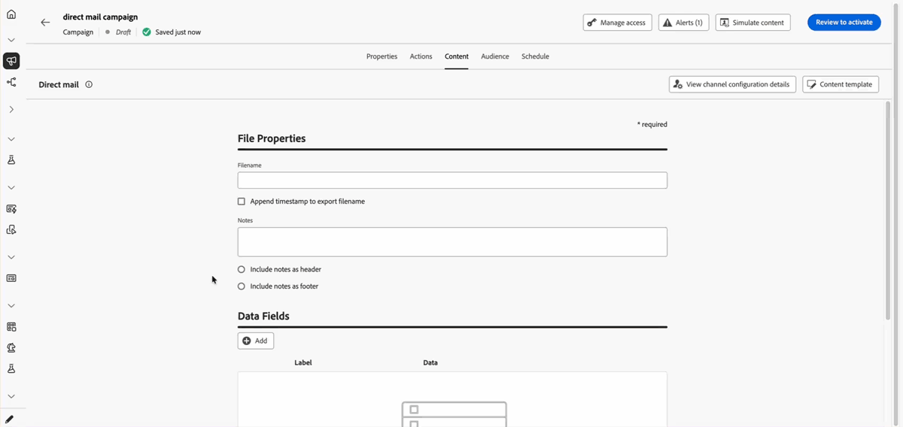

# Notas de la versión {#release-notes}

>[!CONTEXTUALHELP]
>id="ajo_homepage_card1"
>title="Novedades"
>abstract="**Adobe Journey Optimizer** ofrece continuamente nuevas funciones, mejoras en las existentes y correcciones de errores. Todos los cambios se consolidan la última semana de cada mes en estas notas de la versión."

[!DNL Adobe Journey Optimizer] sigue un modelo de envío continuo, lo que permite a Adobe ofrecer nuevas funciones, mejoras y correcciones de forma continua. Este enfoque permite un despliegue escalable y gradual de las funciones para garantizar el rendimiento y la estabilidad en todos los entornos. Debido a este modelo, las notas de la versión se actualizan entre versiones mensuales. Para obtener información detallada acerca del ciclo de lanzamiento y las fases de disponibilidad, consulte [Ciclo de lanzamiento de Journey Optimizer](releases.md).

[!DNL Adobe Journey Optimizer] está creado de forma nativa en [!DNL Adobe Experience Platform] y hereda sus últimas innovaciones y mejoras. Obtenga más información sobre estos cambios en las [Notas de la versión de Adobe Experience Platform](https://experienceleague.adobe.com/docs/experience-platform/release-notes/latest.html?lang=es){target="_blank"}.

>[!NOTE]
>
>Las funcionalidades que se enumeran en estas notas de la versión incluyen una **Fecha de disponibilidad** que indica cuándo se puede acceder a cada cambio en su entorno. Se esperan entradas en los acordeones de **Próximamente** en los próximos días o semanas. La información de estas secciones está sujeta a cambios.

## Notas de la versión de junio de 2026 {#june-26-rn}

La versión de junio de 2026 incorpora varias funciones principales a General Availability, entre las que se incluyen **Simulación de Recorrido**, **Segmentación de optimización de ruta de Recorrido** y **Fragmentos de Recorrido**, además de la nueva creación asistida por IA en recorridos y contenido, la compatibilidad ampliada de Decisioning para el canal de correo postal y controles de seguridad y administración adicionales. Las funcionalidades y mejoras que se indican a continuación están organizadas por temas. También se esperan cambios adicionales en los próximos días o semanas.

### Recorridos {#june-26-journeys}

En esta versión se han añadido las siguientes funciones y mejoras a los recorridos. También se esperan cambios adicionales en los próximos días o semanas.

<table>
<thead>
<tr>
<th><strong>Simulación del recorrido (disponibilidad general)</strong> </th>
</tr>
</thead>
<tbody>
<tr>
<td>

Ahora puede establecer el recorrido en Simulación. Este modo le permite validar la lógica utilizando usuarios simulados. Son perfiles temporales creados específicamente para la simulación, lo que le permite realizar pruebas libremente sin necesidad de administrar perfiles de prueba persistentes en Adobe Experience Platform. 

La simulación del recorrido, que se lanzó anteriormente con disponibilidad limitada, ya está disponible en todos los entornos. Con esta versión de Disponibilidad general, ahora puede utilizar Journey Agent para generar usuarios y eventos simulados directamente en el menú Simulación.

Para obtener más información, consulte la <a href="../building-journeys/simulate-journey-gs.md">documentación detallada</a>.

Fecha de disponibilidad: 9 de junio de 2026

</td>
</tr>
</tbody>
</table>

<table>
<thead>
<tr>
<th><strong>Fragmentos de recorrido (disponibilidad general)</strong> </th>
</tr>
</thead>
<tbody>
<tr>
<td>

Ahora puede crear <strong>fragmentos de recorrido</strong> en Adobe Journey Optimizer. Los fragmentos de recorrido son conjuntos reutilizables de nodos de recorrido que puede generar una vez y soltarlos en cualquier recorrido de la zona protegida. Tanto si se trata de una comprobación de elegibilidad, una lógica de enrutamiento de canal preferida o una secuencia de bienvenida, los fragmentos ayudan a los equipos a moverse más rápido y a mantenerse coherentes, sin reconstruir la misma lógica desde cero cada vez.

Una vez creados, los fragmentos se almacenan en un <strong>inventario de fragmentos</strong> específico y se pueden insertar en cualquier recorrido mediante la actividad <strong>Fragmentos de recorrido</strong>.

Esta capacidad, que antes estaba disponible en disponibilidad limitada, ahora está disponible de forma general para todos los clientes. Los fragmentos de recorrido también admiten <strong>herramientas de espacio aislado</strong>, que le permiten empaquetar y exportar fragmentos en espacios aislados.

Para obtener más información, consulte la <a href="../building-journeys/journey-fragments.md">documentación detallada</a>.

Fecha de disponibilidad: 9 de junio de 2026

</td>
</tr>
</tbody>
</table>

<table>
<thead>
<tr>
<th><strong>Optimización de ruta de recorrido: segmentación (disponibilidad general)</strong> </th>
</tr>
</thead>
<tbody>
<tr>
<td>

La <strong>actividad de optimización</strong> ahora admite <strong>reglas de segmentación</strong> que le permiten definir criterios específicos que los clientes deben cumplir para calificar para una ruta de recorrido en particular, según segmentos de audiencia o atributos de perfil.

A diferencia de la experimentación, en la que los clientes se asignan a rutas de forma aleatoria, la segmentación utiliza una lógica determinista para garantizar que la audiencia o el perfil de cliente adecuados se enruten a la ruta deseada.

Esta funcionalidad, lanzada anteriormente con disponibilidad limitada, ya está disponible en todos los entornos (disponibilidad general).

Para obtener más información, consulte la <a href="../building-journeys/path-targeting.md">documentación detallada</a>.

Fecha de disponibilidad: 8 de junio de 2026

</td>
</tr>
</tbody>
</table>

<table>
<thead>
<tr>
<th><strong>Asistente de IA para expresiones de recorrido (versión Beta pública)</strong> </th>
</tr>
</thead>
<tbody>
<tr>
<td>

El asistente de IA ahora funciona en el editor de expresiones avanzadas del recorrido para convertir las indicaciones de datos en lenguaje natural en expresiones válidas y lógica condicional. Describa la personalización que desea lograr y el Asistente de IA generará un código listo para usar que puede aplicar inmediatamente o perfeccionar mediante indicaciones de seguimiento.

Esta funcionalidad está actualmente disponible para todos los clientes en versión Beta pública.

Para obtener más información, consulte la <a href="../building-journeys/expression/expression-agent.md">documentación detallada</a>.

Fecha de disponibilidad: 3 de junio de 2026
 
</td>
</tr>
</tbody>
</table>

* **Detener un recorrido pausado directamente**. Ahora puede detener un recorrido directamente desde el estado **Paused**. Anteriormente, un recorrido pausado tenía que reanudarse a **Activo** antes de poder detenerse. [Más información](../building-journeys/journey-pause.md#stop-close-paused)

  Fecha de disponibilidad: 18-22 de junio de 2026

* **Compatibilidad con identificadores suplementarios para públicos externos**. Ahora se admiten identificadores suplementarios en los recorridos para públicos externos, incluyendo los públicos importados de un archivo CSV y públicos creados con la composición de público federado. Puede designar cualquier atributo que no sea de identidad o de identidad no personal del público como ID suplementario; no se requiere etiquetado de esquema. [Más información](../building-journeys/supplemental-identifier.md)

  Fecha de disponibilidad: 11 de junio de 2026

* **Detención automática para recorridos de lectura no recurrentes** - Los recorridos de **lectura de audiencia** no recurrentes ahora pasan automáticamente al estado **Detenido** una vez que se cierra el último perfil activo. Anteriormente, estos recorridos permanecían **Activos** hasta que expiraba el tiempo de espera global de 91 días, incluso cuando ya no circulaba ningún perfil por ellos. Con esta mejora, el estado del recorrido refleja el estado de ejecución real en cuanto se completa, lo que mantiene el inventario de recorridos preciso sin intervención manual.

  Tenga en cuenta que este comportamiento no se aplica a los recorridos que incluyen nodos que generan períodos de espera, como nodos de espera, nodos de reacción o transiciones activadas por eventos. Estos recorridos siguen estando sujetos al tiempo de espera global estándar de 91 días. [Más información](../building-journeys/end-journey.md#auto-stop-non-recurring)

  Fecha de disponibilidad: 9 de junio de 2026

* **Autenticación personalizada basada en certificados en acciones personalizadas**: las acciones personalizadas ahora admiten la autenticación personalizada basada en certificados. Al añadir `subType: "certificateCredential"` a una configuración de autorización personalizada, Journey Optimizer utiliza el certificado administrado de Adobe para firmar una declaración de cliente JWT e intercambiarla por un token de acceso (no se requiere secreto de cliente). Diseñado para API empresariales que aplican la verificación de identidad basada en certificados, como Microsoft Entra ID. [Más información](../datasource/external-data-sources.md#certificate-credential)

  Fecha de disponibilidad: 4 de junio de 2026

* **Aumento del límite de recorridos activos y nuevas protecciones**: ahora puede tener hasta **200 recorridos activos**, más que el límite anterior de 100. [Más información](../start/guardrails.md#journeys-guardrails-journeys)

  Fecha de disponibilidad: 18 de junio de 2026. Esta capacidad se está extendiendo gradualmente a todas las regiones en los próximos días.

+++ Próximamente — **La información siguiente está sujeta a cambios.**

* **Fechas de inicio y finalización en el encabezado del recorrido**: cuando las fechas de inicio o finalización se configuran en un recorrido activo, ahora aparecen en el **encabezado del recorrido** junto al distintivo del estado activo. La etiqueta mostrada se adapta en función de si cada fecha es próxima o ya ha pasado.

+++

### Campañas orquestadas {#june-26-oc}

Las siguientes funcionalidades y mejoras están llegando a las campañas orquestadas en esta versión.

+++ Próximamente — **La información siguiente está sujeta a cambios.**

<table>
<thead>
<tr>
<th><strong>Direccionamiento basado en archivos en campañas organizadas</strong> </th>
</tr>
</thead>
<tbody>
<tr>
<td>

Las campañas orquestadas ahora admiten la carga de un <strong>archivo CSV o TXT</strong> directamente en el lienzo de campaña como audiencia de segmentación, sin ingerir primero el archivo en Adobe Experience Platform. Los datos del archivo se consumen en el momento de la ejecución y no persisten como un conjunto de datos de Adobe Experience Platform. Durante la configuración del archivo, puede definir asignaciones de columnas, tipos de datos, control de valores NULL y directivas de error por columna. Las filas que no superan la validación se rechazan y registran antes de que se ejecute la campaña, lo que mantiene la audiencia limpia sin preprocesamiento manual. Esto es especialmente adecuado para envíos específicos o campañas de listas de socios en las que no es práctico crear una canalización de ingesta completa.

Esta versión solo está disponible para un conjunto de organizaciones (disponibilidad limitada). Para obtener acceso, póngase en contacto con su representante de Adobe.

 Fecha de disponibilidad: 30 de junio de 2026

</td>
</tr>
</tbody>
</table>

* **Personalización basada en bucles para datos relacionales**: el editor de personalización ahora admite un bloque de Bucle que se repite en colecciones relacionales, como pedidos, cuentas o reservas, y procesa un bloque de contenido por registro en un solo correo electrónico o SMS. Las colecciones se configuran mediante el selector de datos utilizando tokens de personalización, sin necesidad de escribir expresiones. [Más información](../orchestrated/add-personalization.md#enrichment-collections)

  Fecha de disponibilidad: finales de junio de 2026

* **Personalizar los detalles del remitente del correo electrónico por destinatario y campaña**: las campañas organizadas ahora admiten la personalización de **campos de encabezado de correo electrónico**, incluidos el nombre del remitente, la dirección del remitente y la respuesta a, mediante atributos de perfil o datos relacionales. Esto permite que los detalles del remitente reflejen el asesor, la ubicación o la sucursal relevantes para cada destinatario, en lugar de enrutar todos los envíos a través de una sola dirección corporativa. Los valores del encabezado se pueden establecer en el nivel de canal y anularse por campaña utilizando datos contextuales para un control más preciso.

+++

### Toma de decisiones {#june-26-decisioning}

En esta versión se han añadido las siguientes funcionalidades y mejoras a la toma de decisiones.

<table>
<thead>
<tr>
<th><strong>Compatibilidad con la toma de decisiones en el canal de correo directo</strong> </th>
</tr>
</thead>
<tbody>
<tr>
<td>

Ahora puede añadir políticas de decisión a recorridos de correo electrónico directo y campañas. Las políticas de decisión son contenedores para sus ofertas que aprovechan el motor de Toma de decisiones para devolver de forma dinámica el mejor contenido para cada miembro del público. La toma de decisiones por correo directo también admite casos de uso de toma de decisiones por lotes, lo que le permite exportar los elementos de oferta correspondientes para cada perfil en una público determinado de Adobe Experience Platform. 

Para obtener más información, consulte la <a href="../experience-decisioning/use-decision-policy.md">documentación detallada</a>.

Fecha de disponibilidad: 3 de junio de 2026

</td>
</tr>
</tbody>
</table>

* **Aprovechar fragmentos de contenido de Adobe Experience Manager en la toma de decisiones**: ahora puede asignar fragmentos de contenido de Adobe Experience Manager a elementos de decisión en la toma de decisiones y aprovecharlos dentro de las políticas de decisión para entregar el fragmento adecuado al cliente correcto en el momento adecuado. Esta funcionalidad, lanzada anteriormente con disponibilidad limitada, ya está disponible en todos los entornos (disponibilidad general). [Más información](../experience-decisioning/fragments-decision-policies.md)

  Fecha de disponibilidad: 18 de junio de 2026

+++ Próximamente — **La información siguiente está sujeta a cambios.**

* **Atributos de elemento dinámico**: los atributos personalizados de elemento de decisión ahora se pueden personalizar en el momento de la entrega mediante datos de perfil, contextuales y de audiencia. Esto elimina la necesidad de mantener ofertas duplicadas para variaciones de contenido menores, lo que permite a los especialistas en marketing administrar menos elementos de decisión más flexibles.

  Fecha de disponibilidad: 22 de junio de 2026

+++

### Gestión de contenidos {#june-26-content}

En esta versión se han añadido las siguientes funcionalidades y mejoras a la administración de contenido.

<table>
<thead>
<tr>
<th><strong>Simular variaciones de contenido: experiencia actualizada y generación de variantes de IA</strong> </th>
</tr>
</thead>
<tbody>
<tr>
<td>

Hay dos actualizaciones disponibles para el flujo de trabajo <strong>Simular contenido</strong>:

<ul>
<li><strong>Nueva ruta predeterminada</strong>: al hacer clic en <strong>Simular contenido</strong>, ahora se abre la experiencia <strong>Simular variaciones de contenido</strong> de forma predeterminada. Desde una sola pantalla, puede añadir una entrada de muestra manualmente o desde un archivo CSV/JSON, reutilizar usuarios simulados, previsualizar el procesamiento y enviar pruebas. Para obtener una vista previa con perfiles de prueba de Adobe Experience Platform, enviar pruebas con datos de perfil de prueba o comprobar el procesamiento de la bandeja de entrada del correo electrónico y los informes de correo no deseado, haga clic en <strong>Simular contenido</strong> y, a continuación, seleccione <strong>Simular contenido (perfiles de AEP)</strong> en el menú desplegable.</li>
<li><strong>Variantes de contenido generadas por IA</strong>: en la experiencia <strong>Simular variaciones de contenido</strong>, haga clic en <strong>Generar</strong> para usar IA y crear automáticamente variantes de contenido. El sistema analiza el mensaje, detecta los campos de personalización y las ramas condicionales y rellena valores realistas para que pueda validar el procesamiento sin crear cada variante a mano.</li>
</ul>

Para obtener más información, consulte la <a href="../test-approve/simulate-sample-input.md">documentación detallada</a>.

Fecha de disponibilidad: 9 de junio de 2026

</td>
</tr>
</tbody>
</table>

+++ Próximamente — **La siguiente información está sujeta a cambios.**

<table>
<thead>
<tr>
<th><strong>Simular variaciones de contenido: experiencia actualizada y generación de variantes de IA</strong> </th>
</tr>
</thead>
<tbody>
<tr>
<td>

Hay dos actualizaciones disponibles para el flujo de trabajo <strong>Simular contenido</strong>:

<ul>
<li><strong>Nueva ruta predeterminada</strong>: al hacer clic en <strong>Simular contenido</strong>, ahora se abre la experiencia <strong>Simular variaciones de contenido</strong> de forma predeterminada. Desde una sola pantalla, puede añadir una entrada de muestra manualmente o desde un archivo CSV/JSON, reutilizar usuarios simulados, previsualizar el procesamiento y enviar pruebas. Para obtener una vista previa con perfiles de prueba de Adobe Experience Platform, enviar pruebas con datos de perfil de prueba o comprobar el procesamiento de la bandeja de entrada del correo electrónico y los informes de correo no deseado, haga clic en <strong>Simular contenido</strong> y, a continuación, seleccione <strong>Simular contenido (perfiles de AEP)</strong> en el menú desplegable.</li>
<li><strong>Variantes de contenido generadas por IA</strong>: en la experiencia <strong>Simular variaciones de contenido</strong>, haga clic en <strong>Generar</strong> para usar IA y crear automáticamente variantes de contenido. El sistema analiza el mensaje, detecta los campos de personalización y las ramas condicionales y rellena valores realistas para que pueda validar el procesamiento sin crear cada variante a mano.</li>
</ul>

Para obtener más información, consulte la <a href="../test-approve/simulate-sample-input.md">documentación detallada</a>.

Fecha de disponibilidad: 9 de junio de 2026

</td>
</tr>
</tbody>
</table>

<table>
<thead>
<tr>
<th><strong>Mejoras en los fragmentos de contenido de Adobe Experience Manager en Journey Optimizer</strong> </th>
</tr>
</thead>
<tbody>
<tr>
<td>

Esta versión incorpora varias mejoras para que <strong>Fragmentos de contenido de Adobe Experience Manager</strong> sean más utilizables, controlables y estén más listos para la producción dentro de los flujos de trabajo de creación de Journey Optimizer:

<ul>
<li>Journey Optimizer ahora admite la captura de fragmentos de contenido desde varias configuraciones de Adobe Experience Manager, incluidos los niveles de creación, publicación y publicación autenticada.</li>
<li>Una vez seleccionado un fragmento, su contexto se conserva en todo el mensaje, lo que permite a los autores reutilizar los campos de fragmento en bloques de contenido sin volver a seleccionar.</li>
<li>Se ha introducido una nueva página de lista de fragmentos de contenido en Journey Optimizer para mejorar la administración del ciclo vital; los usuarios pueden identificar fragmentos no sincronizados y sincronizar manualmente el déclencheur para mantenerse al día.</li>
<li>La compatibilidad con la configuración regional y las variaciones ahora permite a los especialistas en marketing trabajar con versiones alternativas del mismo fragmento de contenido de forma más deliberada.</li>
<li>Ahora tiene flexibilidad en la forma en que Adobe Journey Optimizer accede al contenido de Adobe Experience Manager. Esta versión incluye la capacidad de <strong>cambiar el repositorio de origen</strong> para los fragmentos de contenido utilizados en sus recorridos y campañas.</li>
<li>Ahora compatible con <b>Managed Services</b>, puede ver, acceder y usar fragmentos de contenido de Adobe Experience Manager directamente en Journey Optimizer para personalización. Simplemente agregue la URL del repositorio de Adobe Experience Manager Managed Services en los ajustes de configuración como una configuración única.</li>
</ul>
</td>
</tr>
</tbody>
</table>

<table>
<thead>
<tr>
<th><strong>Integración del asistente de IA con Adobe Experience Manager Asset Essentials</strong> </th>
</tr>
</thead>
<tbody>
<tr>
<td>

El asistente de IA ahora recupera automáticamente <b>imágenes aprobadas por la marca</b> directamente de su Adobe Experience Manager Assets al generar correos electrónicos, páginas web y notificaciones push. Esto elimina la necesidad de buscar manualmente en Assets o confiar en las retrospectivas de IA genéricas, lo que garantiza que cada imagen sea perfectamente precisa y compatible con la marca.

</td>
</tr>
</tbody>
</table>

<table>
<thead>
<tr>
<th><strong>Asistente de IA para mejoras en la generación de contenido</strong> </th>
</tr>
</thead>
<tbody>
<tr>
<td>

Esta versión mejora la experiencia de generación de contenido de <strong>AI Assistant</strong> con una edición de imágenes más sólida, una extracción de marca más confiable y compatibilidad con la autenticidad del contenido en el flujo de imagen:

<ul>
<li><strong>La edición de imágenes de IA</strong> ya está disponible en el flujo de generación de imágenes, incluida la compatibilidad con modelos de terceros de Firefly, para que pueda refinar las imágenes de origen sin salir del asistente.</li>
<li><strong>La extracción de señales de marca</strong> ofrece resultados de mayor calidad. Cuando las páginas seleccionadas carecen de señal suficiente, las retrospectivas mejoradas ahora rellenan los colores, la tipografía, las directrices de escritura y otros atributos de marca.</li>
<li><strong>La extracción de marcas basada en web</strong> es más confiable. La administración de tiempo de espera mejorada ayuda a evitar que las páginas lentas, las ventanas emergentes y los banners de cookies bloqueen la extracción.</li>
<li><strong>La autenticidad del contenido (CAI)</strong> ahora se admite en el flujo de imagen. Esta versión también corrige los problemas de carga de imágenes de referencia y mejora el manejo de imágenes sin un manifiesto de C2PA existente.</li>
</ul>
</td>
</tr>
</tbody>
</table>

+++

### Canal de correo electrónico {#june-26-email}

En esta versión se han añadido las siguientes mejoras al canal de correo electrónico.

* **Cifrado de parámetro de URL**: ahora puede cifrar parámetros de URL en los vínculos de seguimiento y página de destino añadidos a sus mensajes de correo electrónico. Esto proporciona una capa adicional de seguridad para los datos de parámetros confidenciales. Esta funcionalidad, lanzada anteriormente con disponibilidad limitada, ya está disponible en todos los entornos (disponibilidad general). [Más información](../personalization/url-parameter-encryption.md)

  Fecha de disponibilidad: 1 de junio de 2026

* **Nuevos permisos para el registro de claves**: ahora se necesitan dos nuevos permisos para acceder y administrar las claves necesarias para el cifrado de parámetros de URL: **Administrar el registro de claves** y **Ver el registro de claves**. [Más información](../administration/high-low-permissions.md#administration-permissions)

  Fecha de disponibilidad: 1 de junio de 2026

<table>
<thead>
<tr>
<th><strong>Texto enriquecido en campos editables para fragmentos</strong> </th>
</tr>
</thead>
<tbody>
<tr>
<td>

Ahora puede añadir texto enriquecido a fragmentos personalizables que se utilizan en el contenido de los correos electrónicos.

Por ejemplo, al utilizar el componente Texto como campo editable en el Designer de correo electrónico, puede dar formato directamente al contenido (por ejemplo, negrita y cursiva) e insertar hipervínculos.

Para obtener más información, consulte la <a href="../content-management/customizable-fragments.md#rich-text-visual">documentación detallada</a>.

Fecha de disponibilidad: finales de junio de 2026

</td>
</tr>
</tbody>
</table>

<table>
<thead>
<tr>
<th><strong>Comprobación de contenido en el Designer de correo electrónico</strong> </th>
</tr>
</thead>
<tbody>
<tr>
<td>

Journey Optimizer ahora incluye validación técnica automatizada directamente en el Designer de correo electrónico, lo que le ayuda a detectar problemas de HTML y CSS antes de enviarlos.

Las comprobaciones cubren elementos no admitidos, como etiquetas <code>&lt;script&gt;</code> y <code>&lt;base&gt;</code>, divs vacíos que pueden romper el diseño en Microsoft Outlook, etiquetas de actualización de metadatos de HTML y umbrales de tamaño de CSS o HTML que almacenan en déclencheur los errores de procesamiento en Gmail.

Los resultados aparecen como errores, advertencias o avisos informativos directamente en el panel de creación, con detalles contextuales y correcciones con un solo clic cuando están disponibles, de modo que los problemas se pueden resolver sin salir del editor.

Para obtener más información, consulte la <a href="../email/content-check.md">documentación detallada</a>.

Fecha de disponibilidad: 18 de junio de 2026

</td>
</tr>
</tbody>
</table>

* **Conversor mejorado de imagen a HTML**: Ya está disponible una nueva versión de la función de conversión de imagen a HTML, que ofrece una precisión mejorada para la generación de HTML. Esta actualización aprovecha los modelos LLM de nivel superior para ofrecer una salida de HTML más precisa y fiable a partir de las entradas de imagen.

  Fecha de disponibilidad: 18 de junio de 2026

+++ Próximamente — **La información siguiente está sujeta a cambios.**

<table>
<thead>
<tr>
<th><strong>Activar reducción de tamaño de correo electrónico</strong> </th>
</tr>
</thead>
<tbody>
<tr>
<td>

Journey Optimizer ahora incluye una opción para reducir el tamaño del HTML del correo electrónico eliminando los espacios en blanco, los comentarios y el código redundante innecesarios, sin afectar al procesamiento del correo electrónico.

Esto puede mejorar la capacidad de entrega al evitar los umbrales de tamaño que algunos proveedores de correo electrónico utilizan para marcar o rechazar mensajes y puede reducir el tiempo de carga de los destinatarios.

</td>
</tr>
</tbody>
</table>

<table>
<thead>
<tr>
<th><strong>Módulos de Designer de correo electrónico</strong> </th>
</tr>
</thead>
<tbody>
<tr>
<td>

Email Designer ahora incluye una biblioteca de módulos de diseño listos para usar, como encabezados, tarjetas de producto, bloques de información y pies de página, que puede arrastrar y soltar directamente en el lienzo del correo electrónico.

Cada módulo viene preconfigurado con propiedades editables (imagen, título, texto, botón, vínculos) y se puede personalizar completamente a través de la interfaz de WYSIWYG, lo que acelera la creación de correos electrónicos sin necesidad de crear estructuras desde cero.

Fecha de disponibilidad: 22 de junio de 2026

</td>
</tr>
</tbody>
</table>

+++

### Contenido e integraciones {#june-26-integration}

En esta versión se incluyen las siguientes funcionalidades y mejoras para la administración de contenido y las integraciones.

<table>
<thead>
<tr>
<th><strong>Mejoras en los fragmentos de contenido de Adobe Experience Manager en Journey Optimizer</strong> </th>
</tr>
</thead>
<tbody>
<tr>
<td>

Esta versión incorpora varias mejoras para que <strong>Fragmentos de contenido de Adobe Experience Manager</strong> sean más utilizables, controlables y estén más listos para la producción dentro de los flujos de trabajo de creación de Journey Optimizer:

<ul>
<li>Journey Optimizer ahora admite la captura de fragmentos de contenido desde varias configuraciones de Adobe Experience Manager, incluidos los niveles de creación, publicación y publicación autenticada.</li>
<li>Una vez seleccionado un fragmento, su contexto se conserva en todo el mensaje, lo que permite a los autores reutilizar los campos de fragmento en bloques de contenido sin volver a seleccionar.</li>
<li>Se ha introducido una nueva página de lista de fragmentos de contenido en Journey Optimizer para mejorar la administración del ciclo vital; los usuarios pueden identificar fragmentos no sincronizados y sincronizar manualmente el déclencheur para mantenerse al día.</li>
<li>La compatibilidad con la configuración regional y las variaciones ahora permite a los especialistas en marketing trabajar con versiones alternativas del mismo fragmento de contenido de forma más deliberada.</li>
<li>Ahora tiene flexibilidad en la forma en que Adobe Journey Optimizer accede al contenido de Adobe Experience Manager. Esta versión incluye la capacidad de <strong>cambiar el repositorio de origen</strong> para los fragmentos de contenido utilizados en sus recorridos y campañas.</li>
<li>Ahora compatible con <b>Managed Services</b>, puede ver, acceder y usar fragmentos de contenido de Adobe Experience Manager directamente en Journey Optimizer para personalización. Simplemente agregue la URL del repositorio de Adobe Experience Manager Managed Services en los ajustes de configuración como una configuración única.</li>
</ul>

Para obtener más información, consulte la <a href="../integrations/aem-fragments-gs.md">documentación detallada</a>.

Fecha de disponibilidad: 18 de junio de 2026

</td>
</tr>
</tbody>
</table>

+++ Próximamente — **La información siguiente está sujeta a cambios.**

<table>
<thead>
<tr>
<th><strong>Integración del asistente de IA con Adobe Experience Manager Asset Essentials</strong> </th>
</tr>
</thead>
<tbody>
<tr>
<td>

El asistente de IA ahora recupera automáticamente <b>imágenes aprobadas por la marca</b> directamente de su Adobe Experience Manager Assets al generar correos electrónicos, páginas web y notificaciones push. Esto elimina la necesidad de buscar manualmente en Assets o confiar en las retrospectivas de IA genéricas, lo que garantiza que cada imagen sea perfectamente precisa y compatible con la marca.

</td>
</tr>
</tbody>
</table>

<table>
<thead>
<tr>
<th><strong>Asistente de IA para mejoras en la generación de contenido</strong> </th>
</tr>
</thead>
<tbody>
<tr>
<td>

Esta versión mejora la experiencia de generación de contenido de <strong>AI Assistant</strong> con una edición de imágenes más sólida, una extracción de marca más confiable y compatibilidad con la autenticidad del contenido en el flujo de imagen:

<ul>
<li><strong>La edición de imágenes de IA</strong> ya está disponible en el flujo de generación de imágenes, incluida la compatibilidad con modelos de terceros de Firefly, para que pueda refinar las imágenes de origen sin salir del asistente.</li>
<li><strong>La extracción de señales de marca</strong> ofrece resultados de mayor calidad. Cuando las páginas seleccionadas carecen de señal suficiente, las retrospectivas mejoradas ahora rellenan los colores, la tipografía, las directrices de escritura y otros atributos de marca.</li>
<li><strong>La extracción de marcas basada en web</strong> es más confiable. La administración de tiempo de espera mejorada ayuda a evitar que las páginas lentas, las ventanas emergentes y los banners de cookies bloqueen la extracción.</li>
<li><strong>La autenticidad del contenido (CAI)</strong> ahora se admite en el flujo de imagen. Esta versión también corrige los problemas de carga de imágenes de referencia y mejora el manejo de imágenes sin un manifiesto de C2PA existente.</li>
</ul>
</td>
</tr>
</tbody>
</table>

+++

### Creación de informes {#june-26-reporting}

+++ Próximamente — **La información siguiente está sujeta a cambios**

* **Clics estimados para informes de correo electrónico y SMS** — Una nueva métrica de **Clics estimados** ya está disponible en los informes de Recorridos, Campañas y Canales para correo electrónico y SMS. Esta métrica excluye el tráfico de interacción identificado y no humano (NHI) para proporcionar una visión más clara de la participación genuina del cliente. La métrica de clics existente permanece disponible y continúa informando de los clics totales.

* **Nuevas métricas estimadas de clics para los informes de correo electrónico y SMS**: para proporcionar una vista más precisa de la participación real de los clientes, ahora hay disponibles nuevas métricas estimadas en los informes Recorridos, Campañas y Canales. Estas métricas ayudan a filtrar las interacciones no humanas (NHI) y los clics de bots a partir de los datos de los informes:

   * Estimated CTR: clics estimados en relación con las entregas totales.
   * Estimated CTOR for email only: Clics estimados en relación con las aperturas estimadas.

  Fecha de disponibilidad: finales de junio de 2026

+++

### Administración {#june-26-administration}

En esta versión se han añadido las siguientes mejoras a la administración y la gestión de datos.

* [!BADGE Importante]{type=Informative} **Conjunto de datos de evento de comentarios de mensajes de AJO que se mueve a la ingesta por lotes** - El **conjunto de datos de evento de comentarios de mensajes de AJO** se está moviendo de la ingesta por transmisión a la ingesta por lotes. Como resultado, se espera una latencia de datos de hasta dos horas para este conjunto de datos. Si ha creado informes en Customer Journey Analytics o ha ejecutado consultas utilizando este conjunto de datos, tenga en cuenta este aumento de latencia en el futuro. [Más información](../data/datasets-query-examples.md#message-feedback-event-dataset)

  Fecha de disponibilidad: 10 de junio de 2026

* **Alertas de cliente para eventos de ciclo vital de campañas**: las nuevas alertas del sistema ahora le notifican de los eventos de ciclo de vida clave para campañas activadas por acciones y API. Suscríbase en el nivel de zona protegida. [Más información](../reports/alerts.md)

  Fecha de disponibilidad: 1 de junio de 2026

+++ Próximamente — **La información siguiente está sujeta a cambios**

* **Lista blanca de IP de Firewall de aplicaciones web (WAF)**: Adobe Journey Optimizer ahora admite la lista blanca de IP de Firewall de aplicaciones web (WAF) para páginas de aterrizaje, lo que permite a las organizaciones aplicar que todas las solicitudes entrantes se enruten exclusivamente a través de su infraestructura de WAF configurada. Con esta mejora, los clientes pueden configurar Journey Optimizer para que rechace cualquier solicitud directa que omita el nivel de WAF, lo que garantiza que las políticas de seguridad definidas en herramientas como Imperva se apliquen de forma coherente. Esta capacidad refuerza la postura de seguridad de las empresas con requisitos estrictos de acceso a la red, lo que les permite un control total del flujo de tráfico a sus páginas de aterrizaje alojadas en AJO.

  Fecha de disponibilidad: finales de junio de 2026

+++

### Mensajería móvil (SMS, MMS, RCS y LINE) {#june-26-mobile}

Las siguientes mejoras se incluyen en la mensajería móvil en esta versión.

* **Clics únicos para informes de SMS**: Se ha introducido un nuevo módulo de **Clics únicos** en los informes de SMS, que trae el mismo nivel de seguimiento granular de rendimiento a los SMS disponibles actualmente para los informes de correo electrónico.

* **SMS - Mostrar métricas de uso** - Para los clientes que compran SMS directamente a través de Adobe Journey Optimizer, se ha introducido un nuevo **panel de uso de SMS**. Ahora puede ver y rastrear las métricas de envío de mensajes de los últimos 90 días, clasificadas por mensajes móviles originados (MO) y móviles terminados (MT). Estos datos también están disponibles para su descarga a través de CSV, lo que proporciona una mayor visibilidad y control sobre la inversión en SMS. [Más información](../mobile/sms-usage-report.md)

* **Informe de clics estimados para SMS**: ahora hay disponible una nueva métrica de clics estimados en los informes Recorridos, campañas y canales para correo electrónico y SMS. Esta métrica excluye el tráfico de interacción identificado y no humano (NHI) para proporcionar una visión más clara de la participación genuina del cliente. La métrica de clics existente permanece disponible y continúa informando de los clics totales.

+++ Próximamente — **La siguiente información está sujeta a cambios.**

* **Canal LINE - Creación de cambios** - La interfaz de usuario del canal LINE se ha actualizado con funciones avanzadas de creación de mensajes. Esta versión incorpora compatibilidad con **varios formatos de mensaje**, incluidos Texto, Imagen, Mapa de imágenes, Carrusel y Flex (Editor JSON), además de vistas previas de dispositivos en tiempo real. Los usuarios ahora pueden administrar mensajes agrupados de hasta cinco mensajes ordenados (con controles de adición, eliminación y reordenación) y aprovechar el editor de personalización integrado para mensajes validados y dinámicos.

+++

### Mejoras de uso {#june-26-usability}

+++ Próximamente — **La información siguiente está sujeta a cambios.**

* **Carpetas para Recorridos y campañas**: ahora puede organizar sus recorridos y campañas en **carpetas** para mejorar la navegación y la administración en la interfaz.

+++

<!--
+++ Coming soon — **Information below is subject to change.**

* **Override the default execution field in campaigns** - Previously available at the journey level, you can now override the default execution field set globally for your Email, SMS and WhatsApp deliveries in the campaign parameters.

  Availability date: Early June, 2026

+++
-->
