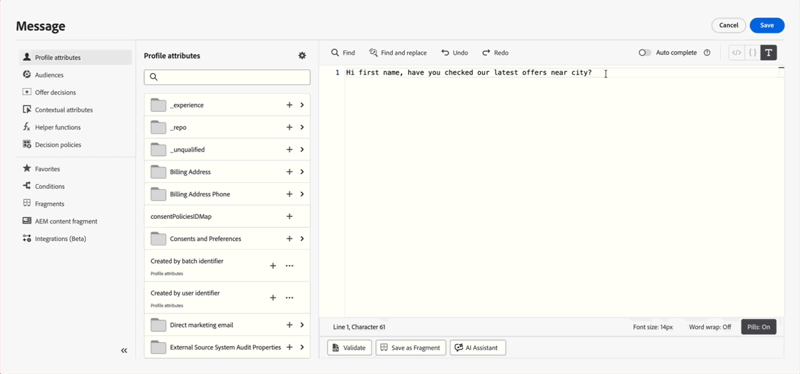

# Notas de la versión {#release-notes}

>[!CONTEXTUALHELP]
>id="ajo_homepage_card1"
>title="Novedades"
>abstract="**Adobe Journey Optimizer** ofrece continuamente nuevas funciones, mejoras en las capacidades existentes y correcciones de errores. Todos los cambios se consolidan la última semana de cada mes en estas notas de la versión."

[!DNL Adobe Journey Optimizer] sigue un modelo de envío continuo, lo que permite a Adobe ofrecer nuevas funciones, mejoras y correcciones de forma continua. Este enfoque permite un despliegue escalable y gradual de las funciones para garantizar el rendimiento y la estabilidad en todos los entornos.

Debido a este modelo, las notas de la versión se actualizan entre versiones mensuales. Para obtener información detallada acerca del ciclo de lanzamiento y las fases de disponibilidad, consulte [Ciclo de lanzamiento de Journey Optimizer](releases.md).

[!DNL Adobe Journey Optimizer] está creado de forma nativa en [!DNL Adobe Experience Platform] y hereda sus últimas innovaciones y mejoras. Obtenga más información sobre estos cambios en las [Notas de la versión de Adobe Experience Platform](https://experienceleague.adobe.com/docs/experience-platform/release-notes/latest.html?lang=es){target="_blank"}.

## Actualizaciones de mayo de 2026 {#may-26-rn}

<table>
<thead>
<tr>
<th><strong>Vínculos profundos en el Designer de correo electrónico</strong> </th>
</tr>
</thead>
<tbody>
<tr>
<td>

Ahora es posible añadir vínculos profundos al contenido del correo electrónico a través de una opción específica en la Designer de correo electrónico.

Esto garantiza que los usuarios sean llevados directamente al contenido correcto en la aplicación, en lugar de ser redirigidos a navegadores o tiendas de aplicaciones, preservando el contexto y la participación.

Para obtener más información, consulte la <a href="../email/deeplinks.md">documentación detallada</a>.

Fecha de disponibilidad: 12 de mayo de 2026

</td>
</tr>
</tbody>
</table>

<table>
<thead>
<tr>
<th><strong>simulación de recorrido</strong> </th>
</tr>
</thead>
<tbody>
<tr>
<td>

Ahora puede establecer su recorrido en <strong>Simulación</strong>. Este modo le permite validar su lógica usando <strong>usuarios simulados</strong>. Son perfiles temporales creados específicamente para la simulación, lo que le permite realizar pruebas libremente sin necesidad de administrar perfiles de prueba persistentes en Adobe Experience Platform.

Esta capacidad está disponible para todos los clientes como disponibilidad limitada con funciones esenciales.

Para obtener más información, consulte la <a href="../building-journeys/simulate-journey.md">documentación detallada</a>.

Fecha de disponibilidad: 5 de mayo de 2026

</td>
</tr>
</tbody>
</table>

<table>
<thead>
<tr>
<th><strong>Optimización de IA de fórmula de decisiones y reglas de clasificación</strong> </th>
</tr>
</thead>
<tbody>
<tr>
<td>

[!DNL Adobe Journey Optimizer] ahora utiliza IA para detectar reglas de Decisioning y fórmulas de clasificación que se pueden simplificar. En el inventario, aparece un indicador rojo en cualquier regla para la que la IA haya identificado una oportunidad de optimización. Al hacer clic en el indicador, se muestra la expresión original junto con la versión sugerida por IA. Desde allí, puede descargar un archivo para revisar cómo se evalúan los perfiles simulados en cada versión y confirmar que se comportan de forma idéntica. A continuación, reemplace la expresión por la optimizada.

Para obtener más información, consulte la <a href="../start/ai-features.md#decisioning-optimization">documentación detallada</a>.

Fecha de disponibilidad: 5 de mayo de 2026

</td>
</tr>
</tbody>
</table>

<table>
<thead>
<tr>
<th><strong>Integraciones</strong> </th>
</tr>
</thead>
<tbody>
<tr>
<td>

La característica <b>Integraciones</b> le permite conectar fuentes de datos de terceros directamente a Adobe Journey Optimizer. Al simplificar la forma de extraer datos externos y <b>contenido maquetable</b>, esta característica facilita la entrega de mensajes dinámicos y personalizados en todos los canales.

Esta capacidad, que se lanzó anteriormente en beta, ya está disponible en todos los entornos (disponibilidad general).

Para obtener más información, consulte la <a href="../integrations/integrations.md">documentación detallada</a>.

Fecha de disponibilidad: 4 de mayo de 2026

</td>
</tr>
</tbody>
</table>

### Mejoras {#may-26-improv}

#### Toma de decisiones

* **API de flujo de trabajo de migración de decisiones**: se ha actualizado el contrato de API para crear análisis de dependencia y flujos de trabajo de migración: pase **`request-level`** como **parámetro de consulta** en la dirección URL de solicitud (`sandbox`, `offer` o `decision`). El nivel de solicitud ya no debe enviarse en el cuerpo de JSON. [Más información](../experience-decisioning/decisioning-migration-api.md)

  Fecha de disponibilidad: 6 de mayo de 2026

#### SMS

<!--
* **Opt-out and consent at phone number and sender** - For SMS, Journey Optimizer now records marketing consent and opt-out at the level of both the profile's phone number and short code. 

  This capability is currently only available for Sinch SMS configurations. [Read more](../sms/sms-configuration-sinch.md)
-->

* **Recuento de caracteres**: en Adobe Journey Optimizer, ahora puede usar el Recuento de caracteres para monitorizar la longitud de sus mensajes SMS en tiempo real. Le ayuda a ver cuándo se dividirá un mensaje en varios segmentos para administrar mejor el formato y evitar aumentos inesperados en los costes de envío. [Más información](../sms/create-sms.md)

* **Enlaces SMS a un conjunto de datos personalizado**: en **credenciales de la API de SMS**, enrute **SMS entrantes** a un **conjunto de datos de evento de experiencia personalizado con perfil habilitado** que seleccione en lugar de solo el conjunto de datos de seguimiento predeterminado. [Más información](../sms/sms-webhook.md)

* **Mejora de la interfaz de webhook**: al configurar los webhooks de SMS, la interfaz de usuario ahora incluye una guía de configuración integrada con ejemplos prácticos, lo que facilita la alineación de las cargas del proveedor y la resolución de problemas sin abandonar el flujo de configuración. [Más información](../sms/sms-webhook.md)

#### WhatsApp

* **Compatibilidad y seguimiento con botones WhatsApp**: Las plantillas de WhatsApp ahora admiten **respuesta rápida**, **Call to action - URL** y **Call to action - teléfono**, **No se admite copiar el código**. Journey Optimizer envía los botones admitidos y rastrea las interacciones junto con los demás informes de canal.

## Próximamente {#coming-soon}

Las siguientes funciones y mejoras están programadas para su lanzamiento en los próximos días. **La información está sujeta a cambios**. Los vínculos, las pantallas y la documentación actualizados se compartirán una vez que estas actualizaciones estén activas en la producción.

### Nuevas funcionalidades {#comming-soon-features}

<table>
<thead>
<tr>
<th><strong>Fragmentos de recorrido</strong> </th>
</tr>
</thead>
<tbody>
<tr>
<td>

Ahora puede crear <strong>fragmentos de Recorrido</strong> en Adobe Journey Optimizer. Los fragmentos de recorrido son conjuntos reutilizables de nodos de recorrido que puede generar una vez y soltarlos en cualquier recorrido de la zona protegida. Tanto si se trata de una comprobación de elegibilidad, una lógica de enrutamiento de canal preferida o una secuencia de bienvenida, los fragmentos ayudan a los equipos a moverse más rápido y a mantener la coherencia, sin volver a crear la misma lógica desde cero cada vez.

Una vez creados, los fragmentos se almacenan en un <strong>inventario de fragmentos</strong> específico y se pueden insertar en cualquier recorrido mediante la actividad <strong>fragmentos de Recorrido</strong>.

<!--

-->

Esta capacidad solo está disponible para un conjunto de organizaciones (disponibilidad limitada). Para obtener acceso, póngase en contacto con su representante de Adobe.

<!--p>For more information, refer to the <a href="../building-journeys/journey-fragments.md">detailed documentation</a>.</p-->

Fecha de disponibilidad: 12 de mayo de 2026

</td>
</tr>
</tbody>
</table>

## Notas de la versión de abril de 2026 {#april-26-rn}

<!--
**The pre-release notes below are subject to change without prior notice until the release availability date**. Links, screens and updated documentation are published in the release notes, at the release date.

See also [Adobe Experience Platform Pre-release notes](https://experienceleague.adobe.com/en/docs/experience-platform/release-notes/pre-release-notes){target="_blank"}.
-->

Las nuevas funciones y mejoras publicadas a principios de abril se anuncian con su fecha de disponibilidad.

**Fecha de publicación**: 28 y 29 de abril de 2026

### Nuevas funciones {#april-26-features}

<table>
<thead>
<tr>
<th><strong>Actividad de consulta incremental en campañas organizadas</strong> </th>
</tr>
</thead>
<tbody>
<tr>
<td>

<strong>Las campañas orquestadas</strong> ahora admiten una actividad de <strong>Consulta incremental</strong> que se dirige únicamente a perfiles o eventos que son recién elegibles desde la última ejecución.

Esto mantiene las campañas recurrentes centradas en nuevas audiencias de red (nuevos registros, miembros de fidelidad recién calificados y segmentos similares), al tiempo que reduce las cargas de trabajo de consultas y evita envíos redundantes a lo largo del tiempo.

Para obtener más información, consulte la <a href="../orchestrated/activities/incremental-query.md#incremental-query-configuration">documentación detallada</a>.

Fecha de disponibilidad: 30 de abril de 2026

</td>
</tr>
</tbody>
</table>

<table>
<thead>
<tr>
<th><strong>Parámetros de remitente en el encabezado del correo electrónico</strong> </th>
</tr>
</thead>
<tbody>
<tr>
<td>

Con Journey Optimizer, ahora puede enviar correos electrónicos donde la entidad transmisora (Remitente) difiera de la entidad creadora (De). Los clientes de correo electrónico que admitan esta función generalmente la representan como "Remitente en nombre de Desde" o muestran un indicador "a través de". Rellene los campos <strong>Encabezados de remitente</strong> opcionales en la configuración del canal de correo electrónico para configurar esta capacidad.

Para obtener más información, consulte la <a href="../email/header-parameters.md#sender-header">documentación detallada</a>.

</td>
</tr>
</tbody>
</table>

<table>
<thead>
<tr>
<th><strong>Campo CC en la configuración del canal de correo electrónico</strong> </th>
</tr>
</thead>
<tbody>
<tr>
<td>

Ahora puede configurar un campo CC (copia de carbón) opcional en la configuración del canal de correo electrónico. A diferencia de CCO, los destinatarios de CC son visibles para el destinatario principal, lo que permite una comunicación transparente y una propiedad más clara.

Esto le permite copiar automáticamente la parte interesada correcta en cada mensaje, como un administrador de relaciones o un propietario de cuenta, al tiempo que se garantiza que el cliente sepa con quién ponerse en contacto para realizar el seguimiento.

El campo CC admite la personalización, de modo que una sola configuración puede enrutar copias de forma dinámica en función de los datos de perfil, lo que las hace escalables en varios casos de uso sin necesidad de una configuración adicional.

Para obtener más información, consulte la <a href="../configuration/cc-email-field.md">documentación detallada</a>.

</td>
</tr>
</tbody>
</table>

<table>
<thead>
<tr>
<th><strong>Copiar campañas orquestadas en entornos limitados</strong> </th>
</tr>
</thead>
<tbody>
<tr>
<td>

La herramienta de zona protegida ahora admite el empaquetado y la copia de campañas orquestadas de una zona protegida a otra. Esto elimina la necesidad de reconstruir manualmente las campañas en cada entorno. Cuando se empaqueta una campaña, sus objetos dependientes principales, como las políticas de combinación y los mensajes, se incluyen automáticamente, de modo que la campaña importada llega lista para configurarse y validarse. Para proteger los entornos de producción, todas las campañas importadas se colocan en estado de borrador en la zona protegida de Target, lo que proporciona a los equipos un paso de revisión y aprobación antes de que cualquier campaña se ponga en marcha.

Para obtener más información, consulte la <a href="../configuration/copy-objects-to-sandbox.md">documentación detallada</a>.

</td>
</tr>
</tbody>
</table>

<table>
<thead>
<tr>
<th><strong>Integración del agente de Journey Optimizer AI mediante MCP</strong> </th>
</tr>
</thead>
<tbody>
<tr>
<td>

Adobe Journey Optimizer ahora proporciona un servidor <strong>MCP (Model Context Protocol)</strong> que muestra las operaciones de la campaña, la configuración del canal y la zona protegida directamente dentro de cualquier aplicación compatible con MCP. Con esta integración, diferentes personas pueden colaborar en torno a los mismos datos de orquestación. En lugar de escribir consultas contra la API de REST de Adobe Journey Optimizer o navegar por varias pantallas de interfaz de usuario, puede describir su intención de forma conversacional y permitir que el LLM invoque las herramientas de MCP adecuadas. Actualmente, esta funcionalidad está disponible en Claude Web y Desktop.

Esta capacidad está disponible para todos los clientes en Public Beta.

Para obtener más información, consulte la <a href="../integrations/ajo-mcp.md">documentación detallada</a>.

</td>
</tr>
</tbody>
</table>

<table>
<thead>
<tr>
<th><strong>Arbitraje de recorrido: modelos de IA</strong> </th>
</tr>
</thead>
<tbody>
<tr>
<td>

Ahora puede usar <strong>modelos de IA</strong> en sus fórmulas de clasificación para aumentar automáticamente las puntuaciones de prioridad de recorrido en función de atributos de perfil del cliente y factores contextuales, asegurándose de que los clientes ingresen los recorridos más relevantes.

Esta versión solo está disponible para un conjunto de organizaciones (disponibilidad limitada). Para obtener acceso, póngase en contacto con su representante de Adobe.

Para obtener más información, consulte la <a href="../conflict-prioritization/journey-ai-models.md">documentación detallada</a>.

</td>
</tr>
</tbody>
</table>

<table>
<thead>
<tr>
<th><strong>Integración de Adobe Express</strong> </th>
</tr>
</thead>
<tbody>
<tr>
<td>

La <b>integración de Adobe Express</b> en Adobe Journey Optimizer le permite utilizar las herramientas de edición de Adobe Express directamente durante la creación de contenido, lo que le permite cambiar el tamaño, eliminar fondos, recortar y convertir recursos a JPEG o PNG.

Esta funcionalidad, lanzada anteriormente con disponibilidad limitada, ya está disponible en todos los entornos (disponibilidad general).

Para obtener más información, consulte la <a href="../integrations/express.md">documentación detallada</a>.

Fecha de disponibilidad: 23 de abril de 2026

</td>
</tr>
</tbody>
</table>

<table>
<thead>
<tr>
<th><strong>Optimización del correo electrónico para bandejas de entrada AI</strong> </th>
</tr>
</thead>
<tbody>
<tr>
<td>

Adobe Journey Optimizer ahora incluye una nueva funcionalidad que garantiza que los correos electrónicos estén estructurados de forma óptima para bandejas de entrada con tecnología de IA como Apple Intelligence y Google Gemini en Gmail.

A medida que los asistentes de IA controlan cada vez más la forma en que los destinatarios leen y actúan en el correo electrónico, esta función le ayuda a generar y crear contenido que se comporta bien en las tareas de IA descendentes, incluidas las de resumen, clasificación, priorización y extracción por intención.

Para obtener más información, consulte <a href="../email/llm-email-optimizer.md">Optimizar correo electrónico para bandejas de entrada de IA</a>.

Fecha de disponibilidad: 17 de abril de 2026

</td>
</tr>
</tbody>
</table>

<table>
<thead>
<tr>
<th><strong>Asistente de IA para expresiones Personalization</strong> </th>
</tr>
</thead>
<tbody>
<tr>
<td>

[!DNL Adobe Journey Optimizer] ahora incluye <strong>AI Assistant</strong> directamente en el editor de personalización y el Designer de correo electrónico, que convierte los mensajes en lenguaje natural en expresiones de personalización válidas y lógica condicional, no se requiere experiencia en sintaxis. Describa la personalización que desea lograr y la IA generará un código listo para usar que puede aplicar inmediatamente o perfeccionar mediante mensajes de seguimiento.

El ayudante también trabaja a la inversa. Seleccione cualquier expresión existente y pídale que explique la lógica, identifique problemas o sugiera mejoras. Esto lo hace útil no solo para crear nuevas expresiones, sino para revisar y depurar las existentes en todo el equipo.

Para obtener más información, consulte <a href="../content-management/generative-personalization-expressions.md">Asistente de IA para expresiones Personalization</a>.

Fecha de disponibilidad: 13 de abril de 2026

</td>
</tr>
</tbody>
</table>

<table>
<thead>
<tr>
<th><strong>Experimentación de ruta de recorrido</strong> </th>
</tr>
</thead>
<tbody>
<tr>
<td>

Use el nuevo nodo <strong>Optimize</strong> para ejecutar pruebas A/B o experimentos de bandidos multibrazo a fin de determinar la mejor ruta para cumplir con los KPI centrados en la empresa. Esta herramienta le permite probar y variar, así como personalizar las comunicaciones, la secuencia y el tiempo para llegar mejor a sus clientes.

Esta funcionalidad, lanzada anteriormente con disponibilidad limitada, ya está disponible en todos los entornos (disponibilidad general).

Como parte de General Availability, esta versión incluye la selección de <strong>tipo de experimento</strong> (bandido A/B o multibrazo) y <strong>Escalar el ganador</strong> para recorridos unitarios.

Para obtener más información, consulte la <a href="../building-journeys/path-experimentation.md">documentación detallada</a>.

Fecha de disponibilidad: 7 de abril de 2026

</td>
</tr>
</tbody>
</table>

<table>
<thead>
<tr>
<th><strong>Bandeja de entrada</strong> </th>
</tr>
</thead>
<tbody>
<tr>
<td>

<strong>Bandeja de entrada</strong> es una funcionalidad móvil disponible con tarjetas de contenido que permite a los clientes crear una ubicación centralizada dentro de su aplicación o sitio web para mostrar los mensajes enviados a sus usuarios. Esto amplía la duración de las comunicaciones de marketing y garantiza que los mensajes permanezcan accesibles incluso después de descartarlos.

Para obtener más información, consulte la <a href="../inbox/inbox-gs.md">documentación detallada</a>.

Fecha de disponibilidad: 7 de abril de 2026

</td>
</tr>
</tbody>
</table>

<table>
<thead>
<tr>
<th><strong>Compatibilidad con decisiones en el canal de correo electrónico</strong> </th>
</tr>
</thead>
<tbody>
<tr>
<td>

Ahora puede usar <strong>Decisioning</strong> para personalizar y optimizar el contenido de sus mensajes de correo electrónico. Aproveche las puntuaciones de prioridad, las fórmulas o los modelos de IA para mostrar las ofertas y el contenido más relevantes a cada destinatario.

Esta funcionalidad, lanzada anteriormente con disponibilidad limitada, ya está disponible en todos los entornos (disponibilidad general). Con esta versión de General Availability, ahora se admiten las páginas espejo.

Para obtener más información, consulte la <a href="../experience-decisioning/create-decision-policy.md">documentación detallada</a>.

Fecha de disponibilidad: 6 de abril de 2026

</td>
</tr>
</tbody>
</table>

### Mejoras {#april-26-improv}

#### IA

<!--
* **Brand alignment score in Campaign dashboard** - You can now assess your brand alignment score directly within your Campaign dashboard to ensure content stays on-brand. This allows you to verify guidelines at a glance without having to open the content designer.
-->

* **Mejora del Asistente de mensajes**: El Asistente de mensajes mejora la generación de contenido de IA al analizar los mensajes del usuario en tiempo real e identificar lagunas en la claridad, la integridad y el contexto. Sugiere reescrituras mejoradas y proporciona una guía procesable para enriquecer las indicaciones con detalles clave como audiencia, tono e intención. La función también hace preguntas de aclaración específicas para ayudar a los usuarios a refinar sus entradas antes de la generación. Esto da como resultado resultados más precisos y de alta calidad con menos iteraciones. [Más información](../content-management/ai-assistant-prompting-guide.md#prompt-assistant)

  Fecha de disponibilidad: 5 de mayo de 2026

#### Push

* **Personalizar el ID de la aplicación en la configuración del canal**: en la configuración del canal push, ahora puede personalizar el campo **ID de la aplicación** para que cada destinatario pueda recibir una notificación push de la marca adecuada en función de su información de perfil. [Más información](../push/push-configuration.md#app-id-personalization)

#### Toma de decisiones

* **API de flujo de trabajo de migración de decisiones**: se ha actualizado el contrato de API para crear análisis de dependencia y flujos de trabajo de migración: pase **`request-level`** como **parámetro de consulta** en la dirección URL de solicitud (`sandbox`, `offer` o `decision`). El nivel de solicitud ya no debe enviarse en el cuerpo de JSON. [Más información](../experience-decisioning/decisioning-migration-api.md)

  Fecha de disponibilidad: 6 de mayo de 2026

* **Adjuntar fragmentos a elementos de decisión**: Journey Optimizer ahora proporciona la capacidad de adjuntar fragmentos a elementos de decisión que se pueden aprovechar en campañas de correo electrónico y experiencia basadas en código mediante directivas de decisión. [Más información](../experience-decisioning/fragments-decision-policies.md)

  Esta funcionalidad, lanzada anteriormente con disponibilidad limitada, ya está disponible en todos los entornos (disponibilidad general).

* **Se omiten los fragmentos que no están disponibles temporalmente**: al utilizar fragmentos en elementos de decisión, si un fragmento no está disponible temporalmente en Edge, se omitirá y el recorrido o la campaña continuará procesando en lugar de dar error. [Más información](../experience-decisioning/fragments-decision-policies.md#temporary-unavailable-fragments)

  Fecha de disponibilidad: 14 de abril de 2026

#### Integraciones de Adobe Experience Manager

* **Compatibilidad con la variación del fragmento de contenido de Adobe Experience Manager**: puede seleccionar **variaciones del fragmento de contenido** (por ejemplo, variantes de idioma o canal) al insertar fragmentos de contenido de Adobe Experience Manager, con una administración mejorada para escenarios locales y multilingües. [Más información](../integrations/aem-fragments.md#aem-variations)

  Esta funcionalidad, lanzada anteriormente con disponibilidad limitada, ya está disponible en todos los entornos (disponibilidad general).

* **Contexto del fragmento de contenido de Adobe Experience Manager durante la creación**: la selección del fragmento de contenido permanece activa a medida que se desplaza entre campos de texto y bloques de contenido, por lo que puede agregar más campos de fragmento sin volver a abrir **Abrir el asesor de contenido de AEM** cada vez. [Más información](../integrations/aem-fragments.md)

  Esta funcionalidad, lanzada anteriormente con disponibilidad limitada, ya está disponible en todos los entornos (disponibilidad general).

#### Diseño de correo electrónico

* **Editor de HTML avanzado para el contenido del correo electrónico**: el modo de HTML avanzado permite editar el origen de HTML del contenido en el Designer de correo electrónico, agregar expresiones avanzadas (como condiciones) en el origen y alternar entre la vista de HTML y la vista de escritorio sin perder los cambios.

  Esta funcionalidad, que antes solo estaba disponible para plantillas de contenido de correo electrónico, ahora se implementa en el contenido de **correo electrónico** en el Designer de correo electrónico (por ejemplo, correos electrónicos creados en recorridos y campañas), además de en las plantillas de contenido de correo electrónico. Actualmente está en disponibilidad limitada: póngase en contacto con su representante de Adobe para obtener acceso. [Más información](../email/email-expert-mode.md)

  Fecha de disponibilidad: 9 de abril de 2026

#### Recorridos

* **Tamaño de carga útil de recorrido actual visible en las propiedades de recorrido**. El panel de propiedades de recorrido ahora muestra el tamaño actual de la carga útil de recorrido en comparación con el límite configurado; por ejemplo, *1,5 MB (de 2 MB)*. Este indicador de solo lectura le ayuda a monitorizar la complejidad del recorrido antes de publicar y evitar errores causados por el límite de tamaño de carga útil excedido. [Más información](../building-journeys/journey-properties.md#journey-payload-size)

  Fecha de disponibilidad: 30 de abril de 2026

#### Optimización de ruta de recorrido

* **Tipo de experimento**: ahora puede elegir entre experimento A/B (división fija al principio) o bandido multibrazo (división automática con actualizaciones semanales del peso) al configurar un experimento de ruta. [Más información](../building-journeys/path-experimentation.md)

  Fecha de disponibilidad: 7 de abril de 2026

* **Experimentación de rutas: escalar el ganador**: ahora puede desplegar automática o manualmente la ruta ganadora de un experimento en toda la audiencia. Una vez que se determina un ganador, puede amplificar su alcance y efectividad sin monitorear constantemente el experimento. [Más información](../building-journeys/path-experimentation.md#scale-winner)

  Esta funcionalidad solo está disponible en recorridos unitarios (cualificaciones de audiencia y activadas por eventos). No está disponible para recorridos de audiencia de lectura.

  Fecha de disponibilidad: 7 de abril de 2026

* **Condiciones** - La actividad [Optimizar](../building-journeys/optimize.md) es el nuevo vehículo para crear rutas condicionales en recorridos. Reemplaza la actividad **Condition** anterior, que se ha eliminado de la interfaz de usuario. Toda la lógica condicional se conserva y ahora se gestiona mediante las condiciones de la actividad **Optimize**. [Más información](../building-journeys/conditions.md)

  Esta funcionalidad, lanzada anteriormente con disponibilidad limitada, ya está disponible en todos los entornos (disponibilidad general).

  Fecha de disponibilidad: 7 de abril de 2026

#### Campañas orquestadas

* **Variables globales en campañas orquestadas**: las campañas orquestadas ahora admiten variables globales que se pueden definir una vez y reutilizar en todas las actividades dentro de un flujo de trabajo, lo que simplifica la configuración y garantiza la coherencia en los valores dinámicos, las expresiones y la personalización de contenido. [Más información](../orchestrated/global-variables.md)
* **Mejoras de Data Modeler**: los esquemas relacionales organizados ahora admiten claves compuestas que abarcan varios campos. Al cargar un esquema desde un archivo DDL, también se generan enumeraciones, y al cargar desde un archivo DDL o de Excel se crean automáticamente relaciones compuestas entre las tablas. En la vista de relación de entidades, los vínculos compuestos ahora muestran el conjunto completo de emparejamientos de campos entre tablas después de cargar un archivo. [Más información](../orchestrated/gs-schemas.md)
